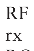

# What this book is about and who should read it

This book is aimed at people who are familiar with the use of routine NMR for structure determination and who wish to deepen their understanding of just exactly how NMR experiments ‘work’. It is one of the great virtues of NMR spectroscopy that one can use it, and indeed use it to quite a high level, without having the least idea of how the technique works. For example, we can be taught how to interpret two-dimensional spectra, such as COSY, in a few minutes, and similarly it does not take long to get to grips with the interpretation of NOE (nuclear Overhauser effect) difference spectra. In addition, modern spectrometers can now run quite sophisticated NMR experiments with the minimum of intervention, further obviating the need for any particular understanding on the part of the operator.

You should reach for this book when you feel that the time has come to understand just exactly what is going on. It may be that this is simply out of curiosity, or it may be that for your work you need to employ a less common technique, modify an existing experiment to a new situation or need to understand more fully the limitations of a particular technique. A study of this book should give you the confidence to deal with such problems and also extend your range as an NMR spectroscopist.

One of the difficulties with NMR is that the language and theoretical techniques needed to describe it are rather different from those used for just about all other kinds of spectroscopy. This creates a barrier to understanding, but it is the aim of this book to show you that the barrier is not too difficult to overcome. Indeed, in contrast to other kinds of spectroscopy, we shall see that in NMR it is possible, quite literally on the back of an envelope, to make exact predictions of the outcome of quite sophisticated experiments. Further, once you have got to grips with the theory, you should find it possible not only to analyse existing experiments but also dream up new possibilities.

There is no getting away from the fact that we need quantum mechanics in order to understand NMR spectroscopy. Developing the necessary quantum mechanical ideas from scratch would make this book rather a hard read. Luckily, it is not really necessary to introduce such a high level of formality provided we are prepared to accept, on trust, certain quantum mechanical ideas and are prepared to use these techniques more or less as a recipe. A good analogy for this approach is to remember that it is perfectly possible to learn to add up and multiply without appreciating the finer points of number theory.

One of the nice features we will discover is that, despite being rigorous, the quantum mechanical approach still retains many features of the simpler vector model often used to describe simple NMR experiments. Once you get used to using the quantum mechanical approach, you will find that it does work in quite an intuitive way and gives you a way of ‘thinking’ about experiments without always having to make detailed calculations.

Quantum mechanics is, of course, expressed in mathematical language, but the mathematics we will need is not very sophisticated. The only topic which we will need which is perhaps not so familiar is that of complex numbers and the complex exponential. These will be introduced as we go along, and the ideas are also summarized in an appendix.

## 1.1 How this book is organized

The ideas we need to describe NMR experiments are built up chapter by chapter, and so the text will make most sense if it read from the beginning. Certain sections are not crucial to the development of the argument and so can be safely omitted at a first reading; these sections are clearly marked as Optional section ⇒ such in the margin.

Chapter 6, which explains how quantum mechanics is formulated in a way useful for NMR, is also entirely optional. It provides the background to the product operator formalism, which is described in Chapter 7, but this latter chapter is written in such a way that it does not rely on anything from Chapter 6. At some point, I hope that you will want to find out about what is written in Chapter 6, but if you decide not to tackle it, rest assured that you will still be able to follow what goes on in the rest of the book.

The main sequence of the book really ends with Chapter 8, which is devoted to two-dimensional NMR. You should dip into Chapters 9–13 as and when you feel the need to further your understanding of the topics they cover. This applies particularly to Chapter 10 which discusses a selection of more advanced ideas in two-dimensional NMR, and Chapter 11 which is concerned with the rather ‘technical’ topic of how to write phase cycles and how field gradient pulses are used.

Quite deliberately, this book starts off at a gentle pace, working through some more-or-less familiar ideas to start with, and then elaborating these as we follow our theme. This means that you might find parts of the discussion rather pedestrian at times, but the aim is always to be clear about what is going on, and not to jump over steps in calculations or arguments. The same philosophy is followed when it comes to the more difficult and/or less familiar topics which are introduced in the later chapters. If you are already familiar with the vector model of pulsed NMR, and are happy with thinking about multiplets in terms of energy levels, then you might wish to jump in at Chapter 6 or Chapter 7.

Each chapter ends with some exercises which are designed to help your understanding of the ideas presented in that chapter. Tackling the exercises will undoubtedly help you to come to grips with the underlying ideas.

## 1.2 Scope and limitations

In this book we are going to discuss the high-resolution NMR of liquid samples and we will concentrate, almost exclusively, on spin-half nuclei (mainly 1H and 13C). The NMR of solids is an important and fast-developing field, but one which lies outside the scope of this book.

The experiments we will choose to describe are likely to be encountered in the routine NMR of small to medium-sized molecules. Many of the experiments are also applicable to the study of large biomolecules, such as proteins and nucleic acids. The special multi-dimensional experiments which have been devised for the study of proteins will not be described here, but we note that such experiments are built up using the repertoire of pulsed techniques which we are going to look at in detail.

The existence of the chemical shift and scalar coupling is, of course, crucial to the utility of NMR spectroscopy. However, we will simply treat the values of shifts and coupling constants as experimentally derived parameters; we will have nothing to say about their calculation or interpretation – topics which are very well covered elsewhere.

## 1.3 Context and further reading

This is not a ‘how to’ book: you will find no advice here on how to select and run a particular experiment, nor on how to interpret the result in terms of a chemical structure. What this book is concerned with is how the experiments work. However, it is not a book of NMR theory for its own sake: rather, the ideas presented, and the theories introduced, have been chosen carefully as those most useful for understanding the kinds of NMR experiments which are actually used.

There are many books which describe how modern NMR spectroscopy is applied in structural studies, and you may wish to consult these alongside this text in order to see how a particular experiment is used in practice. Two useful texts are: J. K. M. Sanders and B. K. Hunter, Modern NMR Spec-troscopy (2nd edition, OUP, 1993), and T. D. W. Claridge, High-Resolution NMR Techniques in Organic Chemistry (Elsevier Science, 1999).

There are also a number of books which are at roughly the same level as this text and which you may wish to consult for further information or an alternative view. Amongst these, R. Freeman, Spin Choreography (Spektrum, 1997) and F. J. M. van de Ven, Multidimensional NMR in Liquids (VCH, 1995) are particularly useful. If you wish to go further and deeper into the theory of NMR, M. H. Levitt, Spin Dynamics (2nd edition, John Wiley & Sons, Ltd, 2008) is an excellent place to start.

The application of NMR to structural studies of biomolecules is a vast area which we will only touch on from time to time. A detailed account of this important area, covering both theoretical and practical matters, can be found in J. Cavanagh, W. J. Fairbrother, A. G. Palmer III, M. Rance and N. J. Skelton, Protein NMR Spectroscopy (2nd edition, Academic Press, 2007).

At the end of each chapter you will also find suggestions for further reading. Many of these are directions to particular chapters of the books we have already mentioned.

## 1.4 On-line resources

A solutions manual for the exercises at the end of each chapter is available on-line via the spectroscopyNOW website:

http://www.spectroscopynow.com/nmr

follow the ‘Education’ link from this page

A list of corrections and amendments will also be available on this site, as well as other additional material. It will also be possible to download all of the figures (in ‘jpeg’ format) from this book.

## 1.5 Abbreviations and acronyms

ADC analogue to digital converter APT attached proton test COSY correlation spectroscopy CTP coherence transfer pathway DEPT distortionless enhancement by polarization transfer DQF COSY double-quantum filtered COSY FID free induction decay HETCOR heteronuclear correlation HMBC heteronuclear multiple-bond correlation HMQC heteronuclear multiple-quantum correlation HSQC heteronuclear single-quantum correlation INEPT insensitive nuclei enhanced by polarization transfer NMR nuclear magnetic resonance NOE nuclear Overhauser effect NOESY nuclear Overhauser effect spectroscopy radiofrequency receiver ROESY rotating frame Overhauser effect spectroscopy SHR States–Haberkorn–Ruben SNR signal-to-noise ratio TOCSY total correlation spectroscopy TPPI time proportional phase incrementation TROSY transverse relaxation optimized spectroscopy transmitter

tx
