# Setting the scene

You will probably find that much of this chapter covers topics you are familiar with or have at least come across before. The point of the chapter is, as the title says, to set the scene for what follows by reminding you of the basic language of NMR, how we describe NMR spectra and how some important quantities are defined. There is also a section on oscillations and rotations, explaining how these are described and represented mathematically. These are key ideas which we will use extensively in the rest of the book.

## 2.1 NMR frequencies and chemical shifts

Like all forms of spectroscopy, an NMR spectrum is a plot of the intensity of absorption (or emission) on the vertical axis against frequency on the horizontal axis. NMR spectra are unusual in that they appear at rather low frequencies, typically in the range 10 to 800 MHz, corresponding to wavelengths from 30 m down to 40 cm. This is the radiofrequency (RF) part of the electromagnetic spectrum which is used for radio and TV broadcasts, mobile phones etc.

It is usual in spectroscopy to quote the frequency or wavelength of the observed absorptions; in contrast, in NMR we give the positions of the lines in ‘ppm’ using the chemical shift scale. The reason for using a shift scale is that it is found that the frequencies of NMR lines are directly proportional to the magnetic field strength. So doubling the field strength doubles the frequency, as shown in Fig. 2.1 on the following page. This field dependence makes it difficult to compare absorption frequencies between spectrometers which operate at different field strengths, and it is to get round this problem that the chemical shift scale is introduced. On this scale, the positions of the peaks are independent of the field strength. In this section we will explore the way in which the scale is defined, and also how to convert back and forth between frequencies and ppm – something we will need to do quite often.

**Fig. 2.1** Schematic NMR spectra consisting of two lines. In (a) the magnetic field is such that the two lines appear at 200.0002 and 200.0004 MHz, respectively; their separation is 200 Hz. The spectrum shown in (b) is that expected when the applied magnetic field is doubled. The frequency of each peak is doubled and, as a consequence, the separation between the two peaks has now also doubled to 400 Hz.

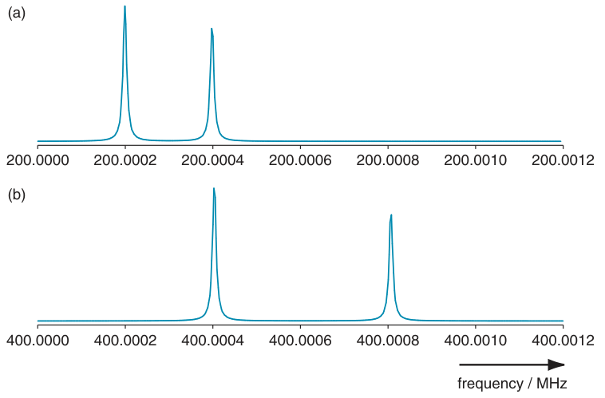

Before we look at the definition of the chemical shift it is worthwhile pointing out that the frequency at which an NMR signal appears also depends on the nuclear isotope (e.g. 1H, 13C, 15N etc.) being studied. Also, for a given field, the NMR absorptions for a particular isotope cover rather a small range of frequencies relative to the absolute frequency of the absorption. In an experiment it is therefore usual only to measure the NMR spectrum from one particular isotope at a time.

### 2.1.1 Chemical shift scales

The chemical shift scale is set up first by agreeing a simple reference compound, a line from which is taken to define zero on the chemical shift scale. For 1H and 13C this reference compound is TMS. The choice of reference compound is arbitrary, but subject to careful international agreement so as to make sure everyone is using the same compound and hence the same origin on their shift scales.

The position of a peak in the spectrum is specified by measuring its frequency separation from the reference peak, and then dividing this difference by the frequency of the reference peak. As we are taking the ratio of two frequencies, the field dependence cancels out. The ratio thus specifies the position of a line in a way which is independent of the applied field, which is what we require.

Expressed mathematically, the chemical shift δ is given by

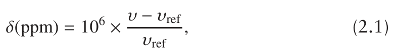

where ν is the frequency of the NMR line in question and νref is the frequency of the line from the agreed reference compound. Clearly, the

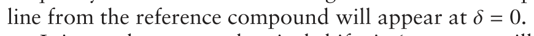

It is usual to quote chemical shifts in ‘parts per million’ (ppm) in order to make the numbers more convenient, and this is why in the definition of

**Fig. 2.2** A schematic NMR spectrum consisting of two lines is shown with both a frequency scale and a chemical shift scale, in ppm. The left-hand peak has been chosen as the reference, and so appears at 0 ppm. Note that it is usual for the ppm scale to be plotted increasing to the left, and not to the right as shown here.

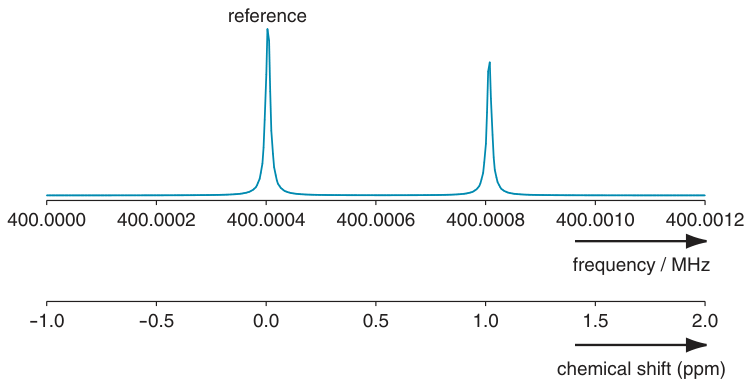

δ the ratio is multiplied by 106. Figure 2.2 shows the schematic spectrum of Fig. 2.1 (b) on the facing page with both a frequency scale and a chemical shift scale in ppm; the left-hand peak has been chosen as the reference and so appears at 0 ppm. The right-hand peak appears at 1 ppm and it is easy to see that if a ppm scale were to be added to the spectrum of Fig. 2.1 (a), the right-hand peak would still be at 1 ppm.

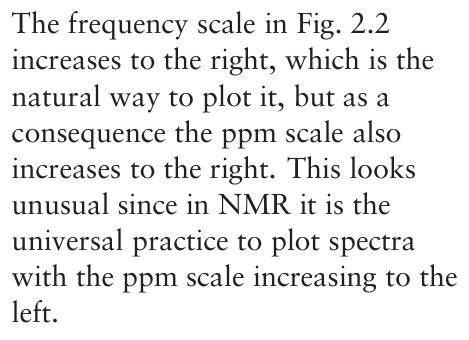

### 2.1.2 Conversion from shifts to frequencies

Sometimes we need to know the frequency separation of two peaks, in Hz. The software used to process and display NMR spectra usually has an option to toggle the scale between Hz and ppm, so measuring the peak separation is quite easy. However, sometimes we will need to make the conversion from ppm to Hz manually.

The definition of the chemical shift, Eq. 2.1 on the preceding page, can be rearranged to

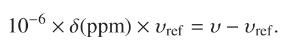

From this it is clear that a peak at δ ppm is separated from the reference peak by 10−6 × δ × νref. It follows that two peaks at shifts δ1 and δ2 are

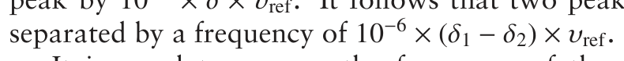

It is usual to express the frequency of the reference peak in MHz (= 106 Hz). When this is done the factor of 10−6 cancels and the frequency separation in Hz is simply

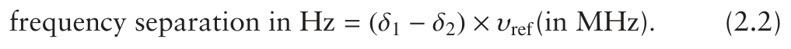

So, for example, if the reference frequency is 500 MHz, then two peaks at

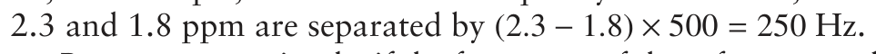

Put even more simply, if the frequency of the reference peak is 500 MHz then 1 ppm corresponds to 500 Hz; if the reference peak is at 800 MHz, 1 ppm corresponds to 800 Hz. The conversion from ppm to Hz is therefore rather simple.

**Fig. 2.3** Our two-line spectrum is shown with both a frequency scale and an offset frequency scale. The receiver reference frequency has been chosen as 400.0007 MHz, as indicated by the arrow. As a result, the right-hand peak has an offset frequency of +100 Hz and the left-hand peak has an offset of −300 Hz. It is important to realize that the choice of the receiver reference frequency is entirely arbitrary and is not related to the frequency of the resonance from the reference compound.

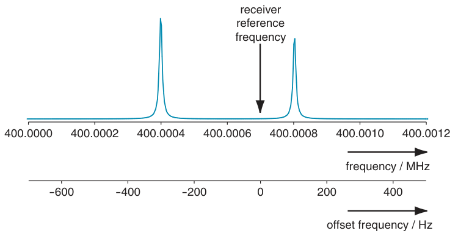

### 2.1.3 The receiver reference frequency and the offset frequency

The RF circuits in virtually all NMR spectrometers are arranged in such a way that the frequencies of the peaks in the spectrum are not measured absolutely but are determined relative to the receiver reference frequency. This reference frequency can be set quite arbitrarily by the operator of the spectrometer; typically, it is placed somewhere in the middle of the peaks of interest.

It is important to realize that this receiver reference frequency has got nothing to do with the resonance from the reference compound; the receiver reference can be placed anywhere we like. The usual arrangement is that when the full spectrum is displayed, the receiver reference frequency is in the middle of the displayed region, so the frequencies of the peaks can be positive or negative, depending on which side of the reference frequency they fall.

The frequency of a peak relative to the receiver reference frequency is called the offset frequency (or, for short, the offset) of the peak. This offset frequency νoffset is given by

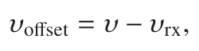

where ν is the frequency of the peak of interest and νrx is the receiver reference frequency (‘rx’ is the traditional abbreviation for receiver). We see from this definition that the offset frequency can be positive or negative, as exemplified in Fig. 2.3.

When calculating the chemical shift using Eq. 2.1 on page 6 it is usually sufficiently accurate to divide, not by the frequency of the line from the reference compound (νref), but by the receiver reference frequency, νrx:

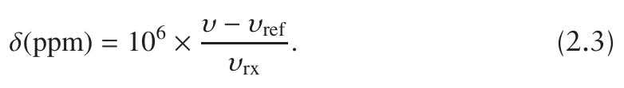

The reason for this is that NMR resonances cover such a small range relative to their absolute frequencies that, provided the receiver reference frequency is somewhere in the spectrum, the difference between νrx and νref is completely negligible. Similarly, when converting from shifts to frequencies (Eq. 2.2 on page 7), it is generally sufficiently accurate to use the receiver reference frequency in place of νref.

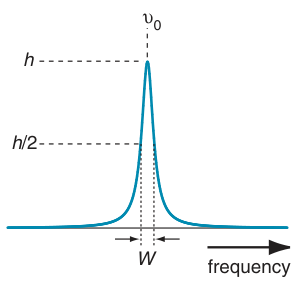

## 2.2 Linewidths, lineshapes and integrals

We cannot extract much useful information from a spectrum unless the peaks or multiplets are clearly separated from one another – an observation which is as true for the most complex multi-dimensional spectrum as it is for the simplest conventional 1H spectrum. Whether or not two peaks are resolved will depend on the separation between them relative to their linewidth and, to an extent, their lineshape. These two properties are thus of paramount importance in NMR.

**Fig. 2.4** An absorption mode lineshape. The peak is centred at ν0 and is of height h; the width of the peak is specified by giving the width W measured at half the peak height (h/2).

It is not uncommon for lines in NMR spectra of small to medium-sized molecules to have widths of a few Hz. Thus, compared with their absolute frequencies, NMR lines are very narrow indeed. However, what we should really be comparing with the linewidth is the spread of frequencies over which NMR lines are found for a given nucleus. This spread is generally rather small, so relatively speaking the lines are not as narrow as we might suppose. Indeed, NMR experiments on complex molecules are primarily limited by the linewidths of the resonances involved.

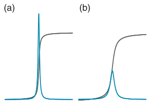

The basic lineshape seen in simple NMR experiments is the absorption mode lineshape, illustrated in Fig. 2.4. The lineshape is entirely positive and is symmetrical about the maximum. The breadth of the line is specified by quoting its width at half of the peak height, as is also shown in the figure.

When we first learn about proton NMR we are told that the area under a peak or multiplet, i.e. the integral, is proportional to the number of protons giving rise to that feature. It therefore follows that if two peaks are both associated with single protons, they must have the same integral and hence if one of the lines is broader it will have reduced peak height; this is illustrated in Fig. 2.5. This reduction in peak height also means that the signal-to-noise ratio of the spectrum is reduced.

**Fig. 2.5** Illustration of how the area or integral of a peak corresponding to a certain number of protons is fixed. The peak shown in (b) is three times broader than that shown in (a); however, they have the same integral (shown by the grey line). As a result, the peak height of the broader line is reduced, also by a factor of three.

As two lines get closer and closer together, they begin to overlap and eventually will merge completely so that it is no longer possible to see the two separate lines; the process is illustrated in Fig. 2.6 on the next page. The diagram shows that, by the time the separation falls somewhat below the linewidth, the merging of the two lines is complete so that they are no longer distinct. The exact point at which the lines merge depends on the lineshape.

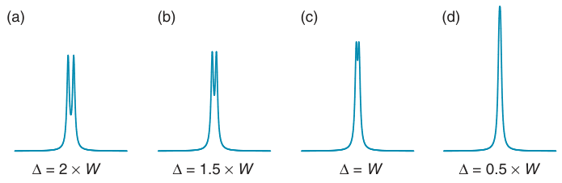

**Fig. 2.6** Illustration of how the ability to resolve two lines depends on their separation relative to the linewidth. In (a) the separation Δ is twice the linewidth, W; the two peaks are clearly resolved. In (b) the separation has decreased so that it is equal to 1.5 times the linewidth and as a result the ‘dip’ between the two lines is less pronounced. Further reduction in the separation makes the dip even smaller, as in (c) where the separation is equal to the linewidth. Finally, in (d) where the separation is half of the linewidth, the two peaks are no longer distinct and a single line is seen.

## 2.3 Scalar coupling

Scalar or J coupling between nuclei is mediated by chemical bonds and is therefore very useful in establishing which nuclei are close to one another on the bonding framework. The presence of such coupling gives rise to multiplets in the spectrum; for example, as shown in Fig. 2.7, if two spin-half nuclei are coupled, the resonance from each spin splits symmetrically about the chemical shift into two lines, called a doublet.

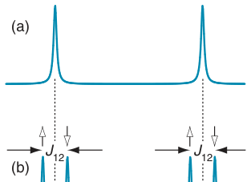

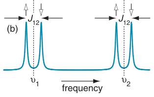

Each doublet is split by the same amount, a quantity referred to as the coupling constant, J. It is found that the values of coupling constants are independent of the field strength; they are always quoted in Hz.

One way of thinking about the two lines of a doublet is to associate them with different spin states of the coupled spin. The idea here is that a spin-half nucleus can be in one of two spin states, described as ‘up’ and ‘down’ (in Chapter 3 we will have a lot more to say about what up and down actually mean). So, for the doublet centred at the chemical shift of the first spin, one line is associated with the second spin being in the up spin state, and the other line is associated with the second spin being in the down spin state; Fig. 2.7 (b) illustrates the idea. Similarly, for the doublet centred at the shift of the second spin, one line is associated with the first spin being up and the other line with the first spin being down.

**Fig. 2.7** Spectrum (a) shows two lines, at frequencies ν1 and ν2, from two different spins. If there is a scalar coupling between the spins, each line splits symmetrically into two, giving two doublets, as shown in (b). The splitting of the two lines in each doublet is the coupling constant, J12. One way of thinking about the two lines of a doublet is to associate one line with the coupled spin being in the ‘up’ spin state, and the other line with the coupled spin being in the ‘down’ spin state; these spin states are indicated by the open-headed arrows.

In terms of frequencies, the line associated with the coupled spin being in the up state is shifted by 12 J12 to the left, and the line associated with the coupled spin being in the down state is shifted by 12 J12 to the right. So, the two lines of the doublet are separated by J12, and placed symmetrically about the chemical shift.

### 2.3.1 Tree diagrams

If there are couplings present to further spins, the form of the multiplets can be predicted using ‘tree’ diagrams, of the type shown in Fig. 2.8 on the facing page. Multiplet (a) is the doublet arising from the first spin due to

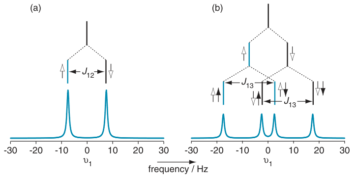

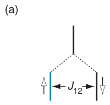

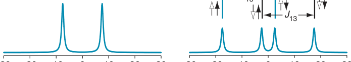

**Fig. 2.8** Illustration of how multiplets are built up as a result of scalar coupling. In (a) we see a doublet which arises from the coupling of the first spin to a second spin; the coupling constant is J12. The doublet can be built up using a tree diagram in which the original line at ν1 is split symmetrically into two; the left-hand line is associated with the second spin being up (indicated by an upward pointing arrow), and the right-hand line is associated with the second spin being ‘down’ (a downward arrow). If the first spin is also coupled to a third spin, with coupling constant J13, each line of the doublet is split once more, as is shown in (b); the resulting multiplet is called a doublet of doublets. The first branching of the tree diagram represents the coupling to the second spin and is the same as in (a). The second layer represents the coupling to the third spin: again, the line which splits to the left is associated with the third spin being up, and the one which splits to the right is associated with the third spin being down. The spin states of the second spin are shown using arrows with open heads, whereas those of the third spin have filled heads. Each line of the doublet of doublets is thus associated with particular spin states of the two coupled spins. The parameters chosen to draw the diagram were: ν1 = 0, J12 = 15 Hz and J13 = 20 Hz.

its coupling to the second, and over the multiplet is shown the tree diagram which can be used to construct it. At the top, we start with a line at ν1. In the next layer down this line splits symmetrically into two: one shifted by 12 J12 to the left, and one by 12 J12 to the right, thus producing the doublet. These two branches can be associated with the second spin being in the up and down spin states, respectively.

If a third spin is now introduced which also has a coupling (of size J13) to the first spin, we have to add another layer of branching to the tree diagram; this is shown in Fig. 2.8 (b). As before, we start with a line at ν1. The first layer of the branching is due to the coupling to the second spin, and is exactly the same as in (a). To construct the second layer, each line from the first is split symmetrically into two but this time with the splitting being J13. As before, the branch which splits to the left is associated with the third spin being up and the branch which splits to the right is associated with the third spin being down. Overall, the result is a four line multiplet, called a doublet of doublets.

If we assume that a branching to the left reduces the frequency of the line, and that a branching to the right increases it, we can work out the frequencies of each of the four lines of the doublet of doublets simply by noting whether they are the result of a branching to the left or right. So, the left-most line of the doublet of doublets shown in (b) must have frequency (ν1 − 12 J12 − 12 J13), whereas the next line along has frequency (ν1 + 12 J12 − 12 J13) as it derives from a branching to the right due to the coupling to the second spin and a branching to the left due to the coupling to the third spin.

You should convince yourself that the doublet of doublets looks exactly the same if, in the tree diagram, you first split according to the coupling to the third spin and then according to the coupling to the second spin.

The question arises as to how we know that it is the up spin state which is associated with the line which splits to the left. In fact, whether it is the up or down state depends on the sign of the coupling constant; here we have chosen both couplings to be positive. In section 3.6 on page 38 we will return to the influence which the sign of the coupling has on the spectrum. However, for the moment we will simply note that the appearance of the multiplet is unaffected by the sign of the coupling.

The final thing to note from Fig. 2.8 on the previous page is that since the doublet and the doublet of doublets are both from one spin, the integral of both must be the same. So, adding the second splitting to form the doublet of doublets reduces the intensity of the lines by a factor of two.

### 2.3.2 Weak and strong coupling

All we have said so far about the multiplets which arise from scalar coupling is applicable only in the weak coupling limit. This limit is when the frequency separation of the two coupled spins is much larger in magnitude than the magnitude of the scalar coupling between the two spins.

For example, suppose that we record a proton spectrum at 500 MHz and that there are two protons whose resonances are separated by 2 ppm and which have a coupling of 5 Hz between them. As explained in section 2.1.2 on page 7, the frequency separation between the two lines is 2 × 500 = 1000 Hz. This is two hundred times greater than the coupling constant, so we can be sure that we are in the weak coupling limit. The coupling between different isotopes (e.g. 13C and 1H) is always in the weak coupling limit on account of the very large frequency separation between the resonance frequencies of different isotopes (usually of the order of several MHz).

On the other hand, if the frequency separation of the resonances from two coupled spins is comparable with the coupling constant between them, we have what is called strong coupling. In this limit, both the frequencies and intensities of the lines are perturbed from the simple weak coupling prediction. We will return to a more detailed discussion of the effects of strong coupling in section 12.1 on page 442 and section 12.7 on page 468.

Unless we say otherwise, everything described in this book applies only to weakly coupled spin systems. This is something of a limitation, but for strongly coupled systems the calculations for all but the simplest experiments become very much more complex and the resulting spectra are rather hard to interpret, so little is to be gained by such an analysis. In practice, therefore, we need not be too worried by this limitation to weak coupling.

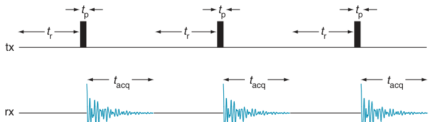

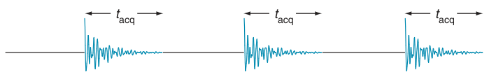

**Fig. 2.9** Timing diagram showing how a basic NMR spectrum is recorded. The line marked ‘tx’ shows the location of high-power RF pulses; tx is the traditional abbreviation for an RF transmitter. The NMR signal is detected by a receiver during the times shown on the line marked ‘rx’. During time tr the spins come to equilibrium. A very short RF pulse is applied for time tp and then the resulting FID is recorded for time tacq. In order to improve the signal-to-noise ratio, the whole process is repeated several times over and the FIDs are added together; this process is called time averaging. Here, the experiment is repeated three times.

Confusion can arise as the term strong coupling is sometimes used to mean a coupling constant with a large size. Strictly, this is an erroneous use of the term.

## 2.4 The basic NMR experiment

The way we actually record an NMR spectrum using a pulsed experiment is shown in Fig. 2.9. First, a delay is left in order to allow the spins to come to equilibrium; this is called the relaxation delay, tr. Typically this delay is of the order of a few seconds.

Next, a very short burst, typically lasting no more that 20 μs, of high power RF is applied. This excites a transient signal known as a free induction decay or FID, which is then recorded for a time called the acquisition time, tacq which usually lasts between 50 ms and a few seconds. Finally, Fourier transformation of the FID gives us the familiar spectrum.

The NMR signal tends to be rather weak, so that it is almost never the case that the spectrum from a single FID has sufficient signal-to-noise to be useful. In order to improve the signal-to-noise ratio we use time averaging. The idea here is to repeat the experiment many times and then add together the resulting FIDs. The signal part of the FID simply adds up so that after N experiments the signal will be N times stronger. However, the noise, because it is random, adds up more slowly – usually increasing as√ N. Overall, then, repeating the experiment N times gives an improvement√ in the signal-to-noise ratio by a factor of N. We usually describe this by saying that N ‘transients’ or ‘scans’ were recorded. Calling each experiment a scan is something of a misnomer, but it is an historic usage which has stuck firmly.

Figure 2.10 on the following page shows the proton spectrum of quinine, whose structure is shown in Fig. 2.11 on the next page. Throughout the rest of the text, we will be using spectra of this molecule to illustrate various different experiments.

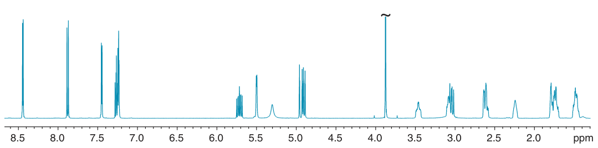

**Fig. 2.10** 500 MHz proton spectrum of quinine (in CDCl3 solution), whose struc- ture is shown in Fig. 2.11. The group of multiplets between 7 and 9 ppm are clearly from the aromatic ring, while those between 4.5 and 6 ppm include the protons on the double bond. The intense peak at 3.8 ppm (which has been truncated) is from the OCH3 group.

### 2.4.1 Heteronuclear NMR and broadband decoupling

In an NMR experiment we can usually only observe one kind of nucleus at a time, such as proton, 13C or 15N. Historically, proton NMR was the first to be exploited widely, and it is still the most recorded nucleus. As a result, all nuclei which are not protons are grouped together and called heteronuclei.

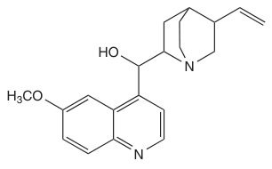

Scalar couplings can occur between any magnetic nuclei which are reasonably close on the bonding network. It is usual to distinguish between homonuclear couplings, which are couplings between nuclei of the same type, and heteronuclear couplings, which are couplings between nuclei of different types.

**Fig. 2.11** The structure of quinine.

While couplings certainly provide useful information, at times they can be troublesome as the presence of many couplings will result in complex broad multiplets. This is particularly the case when observing 13C spectra of organic molecules in which any one 13C is likely to be coupled to several protons.

The effect of all of these 13C–1H couplings can be removed if, while the 13C spectrum is recorded, the protons are irradiated with a broadband decoupling sequence. Such sequences generally involve continuous irradiation of the protons with a carefully designed repeating set of pulses of particular phases and flip angles. The most commonly employed sequence is called WALTZ–16, although there are many more which can be used. Such broadband decoupling essentially sets all of the 13C–1H couplings to zero, so that in the 13C spectrum there is a single peak at each shift. The simplification achieved is very significant, and in addition the signal-to-noise ratio is improved as all of the intensity appears in a single line rather than being spread across a multiplet. This is well illustrated by the comparison of Fig. 2.12 and Fig. 2.13 on the facing page, which are the coupled and decoupled 13C spectra of quinine.

The main issue with broadband decoupling sequences is that, as they are applied continuously during data acquisition, the sample itself may be heated to a significant degree simply by absorbing the RF power. The wider the range of chemical shifts of the nucleus being irradiated, the more power is needed and hence the more serious the heating effect. For protons,

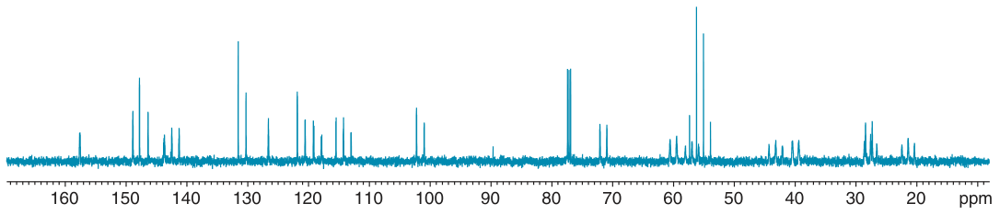

**Fig. 2.12** 500 MHz 13C spectrum of quinine recorded without broadband proton decoupling. The presence of both the large one-bond 13C–1H couplings, and numerous long-range couplings, makes for a rather complex spectrum. The 1:1:1 triplet at 77 ppm is from the CDCl3 solvent.

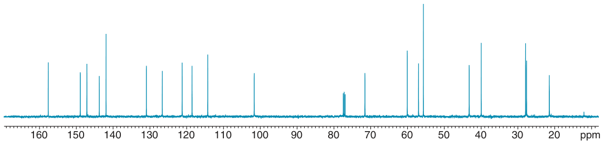

**Fig. 2.13** 500 MHz 13C spectrum of quinine recorded with broadband proton decoupling. The resulting collapse of all the multiplets means that each 13C gives rise to a single line. Compared with the coupled spectrum, Fig. 2.12, both the resolution and the signal-to-noise ratio has improved greatly.

with their modest shift range, this is generally not a problem. However, if we want to observe protons and decouple 13C, the wide range of 13C shifts means that more power is required and so heating can be more of a problem.

## 2.5 Frequency, oscillations and rotations

Quantities with the dimensions of frequency occur a great deal in NMR: for example the frequencies of the lines themselves, offset frequencies and coupling constants. Often, when we specify a frequency we are thinking of it in relation to some kind of oscillation or, as we shall see is more common in NMR, a rotation. In this section we will look at how we specify frequencies, how they are related to rotations and how the resulting motion or oscillation can be expressed mathematically.

### 2.5.1 Motion in a circle

A good way to start is to think about a particle moving with constant speed along the circumference of a circle of radius r. Imagine a line joining the centre of the circle to the particle – this line is best described as a vector. As the particle moves around the circle, the position of the particle changes constantly but we can specify exactly where it is simply by giving the angle through which the vector has rotated.

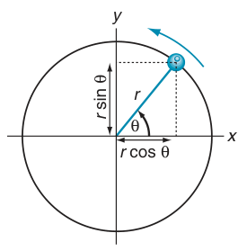

The situation is depicted in Fig. 2.14. At time zero the particle is on the x-axis; after some time, the particle has moved so that the vector joining it to the origin makes an angle θ to the x-axis. From the diagram, it is clear that the x-coordinate of the particle is r cos θ and the y-coordinate is r sin θ.

Another way of looking at this is to say that the x-component of the vector is r cos θ, where by ‘component’ we mean the projection of the vector onto the axis. This projection is found by drawing a line from the tip of the vector and which is perpendicular to the x-axis; where this line cuts the x-axis gives the component along that axis.

**Fig. 2.14** Imagine a particle following a circular path about the origin; here the rotation is anti-clockwise. At time zero, the particle starts on the x-axis and after a certain time it has rotated through an angle θ, measured from the x-axis. If the circle is of radius r, the x- and y-coordinates are r cos θ and r sin θ, respectively. These coordinates are also the x- and y-components of the vector from the origin to the particle.

Figure 2.15 shows these x- and y-components plotted against the angle θ; above the graph is shown the corresponding position of the particle. Rather than specifying the angle in degrees we have chosen to give it in radians. Recall that there are 2π radians in a complete revolution i.e. 360◦. So, θ = π/2 corresponds to one quarter of a revolution or 90◦. Similarly,

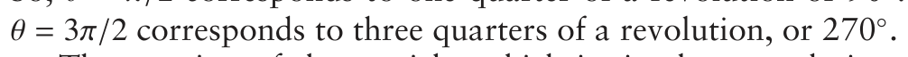

The rotation of the particle, which is simply a steady increase in the angle θ, gives rise to x- and y-components which are oscillating as cosine and sine functions. We see that there is thus a strong connection between rotational and oscillatory motion.

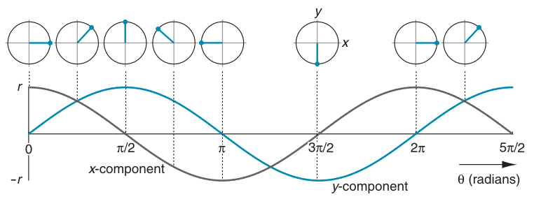

**Fig. 2.15** Illustration of how the x- and y-components of the vector specifying the position of a particle moving round a circular path vary with the angle θ, as defined in Fig. 2.14. The x- and y-components vary as cos θ and sin θ, and are shown by grey and blue lines, respectively. For some selected angles, the position of the particle is shown above the graph; the horizontal axis gives the angle θ in radians, expressed as multiple of π. Note that the x- and y-components can be positive and negative, and that after a complete revolution, θ = 2π, the pattern repeats.

### 2.5.2 Frequency

We started out by supposing that the particle was moving around the circle at a constant speed. Suppose that it takes a time T to complete one revolution – this is called the period. This period is the same for the sine and cosine waves which describe the position of the particle and it is the time after which they repeat.

The frequency of the rotation or oscillation, ν is simply

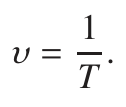

So a fast oscillation or rotation, which has a short period, corresponds to a high frequency. Another way of thinking about the frequency is to see it as the number of cycles or oscillations per unit time.

The period is specified in seconds (s), so the frequency has units s−1 or, equivalently, Hertz (symbol Hz). Thus an oscillation or rotation with a period of 0.0013 s corresponds to a frequency of 769 Hz. In words, this means that in 1 s (that is, a unit of time) the oscillation goes through 769 complete cycles.

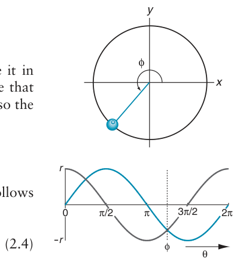

### 2.5.3 Angular frequency

There is another way of expressing the frequency, which is to give it in radians per second; this is called the angular frequency, ω. Suppose that the period is T. During this time the angle θ increases by 2π radians so the angular frequency is

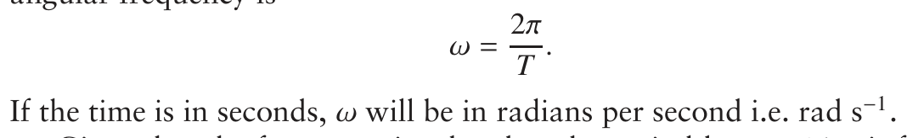

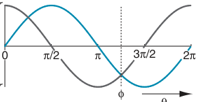

Given that the frequency is related to the period by ν = 1/T, it follows that frequency and angular frequency are related by

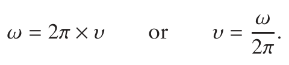

When we begin to explore the theory of NMR in more detail it will be more convenient to use rad s−1 rather than Hz as the unit for frequencies. However, the frequency scales you will find on spectra and the values of coupling constants are invariably quoted in Hz, so we will often need to use Eq. 2.4 to swap back and forth between these two frequency units.

**Fig. 2.16** The position of the particle is described by the angle φ which is called the phase. Here, the phase, measured from the x-axis, is 225◦ or 1.25π radians. Thought of in terms of the oscillating x- and y-components, the phase tells us how far along the wave we have travelled; on the graph, the vertical dashed line shows the phase, φ, corresponding to the diagram above. As before, the grey and blue lines represent the x- and y-components, respectively.

The usual convention is to use the symbols f, F or ν (Greek ‘nu’) to represent frequencies in Hz, whilst ω and Ω (Greek lower and upper case

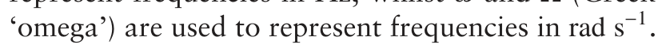

### 2.5.4 Phase

Suppose that our particle depicted in Fig. 2.14 on the facing page starts on the x-axis and then rotates through an angle φ, as shown in Fig. 2.16. We describe this situation by saying that the particle has ‘acquired a phase φ’. In this context, phase is just a way of saying how far the particle has proceeded around the circle. If we think about the sine and cosine functions

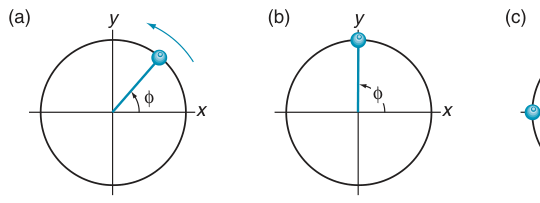

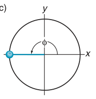

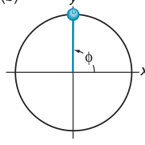

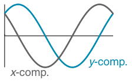

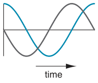

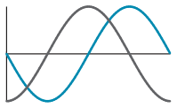

**Fig. 2.17** Illustration of how a phase angle can be used to describe the starting position of our particle. The top row shows the starting positions at time zero; in (a) the phase, φ, is π/4 radians or 45◦, in (b) the phase is π/2 radians or 90◦, and in (c) the phase is π radians or 180◦. The bottom row shows the time dependence of the x- and y-components (grey and blue lines, respectively) as the particle moves from its starting position. Note that in all cases theses components are just those shown in Fig. 2.15 on page 16 shifted to the left by differing amounts.

which represent the x- and y-components, the phase just tells us how far along the oscillation we have proceeded.

If the particle is moving at a constant angular frequency of ω rad s−1, then after time t the angle (in radians) through which the particle has moved is just

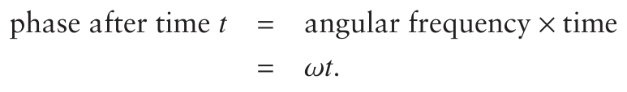

For a particle moving at constant speed, therefore, the phase angle simply increases linearly with time.

So, what we have plotted along the horizontal axis of Fig. 2.15 on page 16 is the phase acquired after a certain time. The axis could just as well be labelled with time, as, for a constant speed, phase and time are directly proportional to one another.

We can also use the idea of phase to specify the starting position of the particle. So far, we have assumed that at time zero the particle is on the x-axis, but this is not necessarily the case. The more general situation is where at time zero the particle starts at a position described by a phase φ (measured, by convention, from the x-axis). Figure 2.17 illustrates this idea for three different phases.

In (a) the starting phase is π/4 radians. So, at t = 0 the x-component is cos (π/4)r which is 0.707 r; similarly the y-component at time zero is sin (π/4)r which is also 0.707 r. Then, as time proceeds the x- and y-components oscillate in the familiar way. However, neither of these components is a sine or cosine wave – rather, they are sine and cosine waves which have been shifted ‘to the left’ by our starting phase of π/4 radians.

Mathematically we can write the two components in the following way:

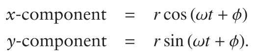

Although the initial phase φ can have any value, there are some special cases which will be of interest. The first is when φ = π/2 radians or 90◦, as depicted in Fig. 2.17 (b) on the facing page. For this phase the graph of the y-component is clearly a cosine wave and, after a bit of thought, it is also clear that the graph of the x-component is minus a sine wave. If we think about the particle rotating from the initial position shown in (b) then clearly the x-component starts at zero and then at first becomes negative; similarly the y-component starts at its maximum and initially decreases. These are the properties of minus a sine function and a cosine function, respectively.

Mathematically we can write the two components as

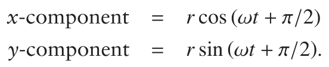

These expressions can be tidied up using the standard identities

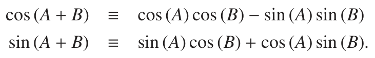

Applying the first of these to the expression for the x-component we find:

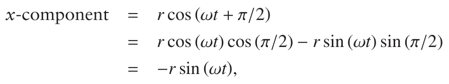

where on the last line we have used the fact that cos (π/2) = 0 and sin (π/2) = 1. So, as expected from the diagram, a phase shift of π/2 does indeed give

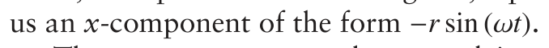

The y-component can be treated in a similar way using the second identity:

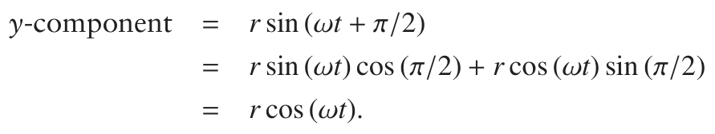

As expected, we see that the y-component is a cosine wave.

Finally Fig. 2.17 (c) on the preceding page shows the case where the initial phase is π radians or 180◦. From the graphs of the x- and y-components it is clear that all that has happened is that both have changed sign relative to the case where the initial phase is zero. We can demonstrate this mathematically:

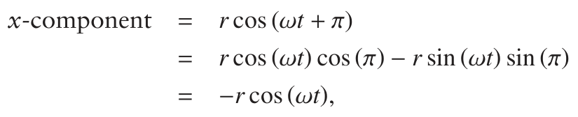

where on the last line we have used the fact that cos (π) = −1 and sin (π) = 0. A similar argument shows that the y-component is −r cos (ωt). Thus, an initial phase of π simply causes the x- and y-components to change sign.

It is also common to describe the situations shown in Fig. 2.17 on page 18 as being the result of a phase shift. So, (a) is a phase shift of π/4, (b) a shift of π/2 and (c) a shift of π. We will encounter this language often.

### 2.5.5 Representation using complex numbers

The position of a particle on a circle is conveniently represented using the complex exponential exp (i θ) or ei θ. This function follows the identity

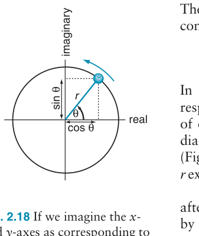

In words, the real and imaginary parts of exp (i θ) are cos θ and sin θ, respectively. This immediately makes us think of the x- and y-components of our rotating particle, Fig. 2.14 on page 16. Indeed, if we redraw this diagram and label the axes ‘real’ and ‘imaginary’, rather than x and y (Fig. 2.18), we see that the position of the particle is described exactly by r exp (i θ), where r is the radius.

Recalling that if the particle is moving at an angular velocity ω then after time t the angle θ is equal to ωt, so the position of the particle is given

**Fig. 2.18** If we imagine the x- and y-axes as corresponding to the real and imaginary parts of a complex number, then the position of the particle is described using the complex exponential as r exp (i θ).

Similarly, if the phase at time t = 0 is φ, the position of the particle becomes

The identity comes about because of the property of exponentials i.e.

This representation of rotational motion or oscillations using complex exponentials turns out to be very convenient, and we shall use it often.

## 2.6 Photons

Electromagnetic radiation can, for some purposes, be thought of as consisting of particles called photons. The energy of a photon is related to its frequency, ν, according to

where h is a universal constant known as Planck’s constant. From this equation we see that the higher the frequency, the more energetic the photon.

If the frequency is expressed in angular units (ω in rad s−1) then, recalling

ℏ is h/2π, a quantity which will appear often in our calculations. It is pronounced ‘h bar’ or ‘h cross’.

## 2.7 Moving on

The scene is now set, and we are ready to start our description of NMR proper. The first topic we will explore is how energy levels and selection rules are useful in thinking about NMR spectra, and how quantum mechanics can be used to find these energy levels.

## 2.8 Further reading

Chemical shifts, scalar couplings and their effect on spectra:

Chapters 2 and 3 from P. J. Hore, Nuclear Magnetic Resonance (Oxford

University Press, 1995).

Broadband decoupling:

Chapter 7 from R. Freeman, Spin Choreography (Spektrum, 1997).

Complex numbers and the complex exponential:

Chapter 7 from D. S. Sivia and S. G. Rawlings, Foundations of Science

Mathematics (Oxford University Press, 1999).

## 2.9 Exercises

2.1 In a 1H NMR spectrum the peak from TMS is found to occur at 500.134 271 MHz. Two other peaks in the spectrum are found at 500.135 021 and 500.137 921 MHz; compute the chemical shifts of these two peaks in ppm. Given that the receiver reference frequency is 500.135 271 MHz, recompute the chemical shifts of the two peaks using Eq. 2.3 on page 8; comment on your answers. What would the frequency separation, in Hz and in rad s−1, be between these two peaks if the spectrum were recorded using a different spectrometer which operates at 400 MHz for protons? The receiver reference frequency for this spectrometer is 400.130 000 MHz.

2.2 Following the approach described in section 2.3.1 on page 10, use a tree diagram to predict the form of the multiplet expected for spin A when it is coupled to two other spins, B and C, with coupling constants JAB = 10 Hz and JAC = 2 Hz. Work out the frequency of each line and label it with the spin states of the coupled spins; assume that the multiplet is centred at 0 Hz. Repeat the process for the cases (a) JAB = 10 Hz and JAC = 12 Hz, and (b) JAB = 10 Hz and JAC = 10 Hz. What special feature arises in the latter case? Predict the form of the A spin multiplet expected when a fourth spin D is introduced, using the coupling constants JAB = 10 Hz,

2.3 A rotation has a period of 2.5 × 10−9 s; compute the corresponding

Compute how long it will take the object to rotate through an angle of: (a) 90◦; (b) 3π/2 radians; and (c) 720◦.

Compute the corresponding frequency in Hz and the period in s.

2.4 Following the style of Fig. 2.17 on page 18, make sketch graphs of the x- and y-components of a rotating particle as a function of time for the case where the starting phase φ is: (a) 0◦; (b) 135◦; (c) 2π radians; (d) 3π/2 radians. In each case, comment on the form of your graphs, noting particularly whether they are simple sine or cosine functions.

2.5 In Fig. 2.17 (c) on page 18 the y-component is r sin (ωt + π). Using the same approach as on page 19, show that this y-component can

