# Energy levels and NMR spectra

In this chapter we will look at how energy levels can be used to understand simple NMR spectra. This approach is of somewhat limited utility when it comes to understanding how NMR experiments work, but it is nevertheless worthwhile exploring as it is a good vehicle for introducing quantum mechanics, gives us some useful ways of thinking about NMR spectra, and introduces the idea of multiple-quantum transitions.

The usual explanation given for the appearance of lines in a spectrum is that they arise as a result of transitions between a set of energy levels possessed by the molecule. The existence of these energy levels is a consequence of the quantization of the energy. In favourable cases, we can use quantum mechanics to calculate what these energy levels are, and find the set of labels or quantum numbers which characterize each level.

The molecule can absorb photons whose energies match the difference in energy between two of these quantized energy levels, as is illustrated in Fig. 3.1. Here we see two energy levels, with energies Eupper and Elower, separated by ΔE:

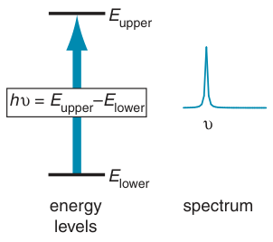

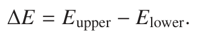

A photon can only be absorbed if its energy, hν, matches the energy separation of the two levels i.e.

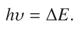

The spectrum thus consists of a series of lines whose frequencies depend on the energy separation between the levels.

**Fig. 3.1** The basic description of spectroscopy in terms of energy levels. A photon may be absorbed provided its energy, given by hν, matches the energy separation between two energy levels, here Eupper − Elower. The result is an absorption line in the spectrum, at frequency ν.

A photon of the correct energy will only be absorbed if the transition between the two energy levels is allowed according to the quantum mechanical selection rules which apply to the system. These rules are usually expressed in terms of the quantum numbers of the levels involved, and typically require that, in going from one level to another, a particular quantum number must change by a specified amount.

This description of how spectra arise is deceptively simple and, for NMR, not really adequate. In the first section in this chapter we will tease out what the problem is and therefore discover the limitations of such an approach. Nevertheless, despite these difficulties, we will see that there are many aspects of NMR which can be understood by thinking about energy levels, and the rest of the chapter is therefore devoted to explaining how these levels are found, and how we can use them to predict the form of spectra.

## 3.1 The problem with the energy level approach

The above description of how a spectrum arises implies that the molecule sits in one energy level and then the absorption of a photon causes it to move to another level. This is certainly not an uncommon or contentious thing to imply. Indeed, in any elementary course of quantum mechanics or spectroscopy we are usually told that ‘the energy is quantized’ and it is then either stated, or implied, that it follows that the molecule must be ‘in one of the energy levels’.

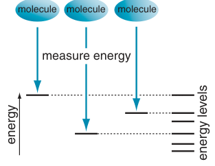

The problem is that quantum mechanics emphatically does not say that a molecule must be in one of the energy levels. What quantum mechanics says about the molecule and its energy is rather more complicated and, on the face of it, rather surprising.

One of the fundamental postulates of quantum mechanics is to do with what happens when we make a measurement. This postulate raises all sorts of practical and philosophical problems, but as far as we know it is correct so we will simply use it and not worry too much about the philosophy. Adapted for the present purpose, the postulate implies that, if we measure the energy of a molecule, the value we will obtain will always correspond to one of the energy levels. Figure 3.2 attempts to illustrate this idea.

**Fig. 3.2** An illustration of the process of measurement in quantum mechanics. A postulate of the theory is that a measurement of the energy yields a value which corresponds to one of the energy levels available to the system. However, it is not the case that the system has to be in one of the energy levels, it is just that a measurement of the energy gives a value corresponding to one of the energy levels.

In essence, spectroscopy is a way of measuring the energy of a molecule, since we determine the frequency, and hence the energy, of the photons which are absorbed. Strictly, it is an energy difference that we are measuring, but we can think of this as two successive measurements of the energy. As described in the previous paragraph, each measurement of the energy will give a value which corresponds to one of the energy levels, so in spectroscopy it appears that transitions take place between these levels.

### 3.1.1 Wavefunctions and mixed states

You might be forgiven for thinking that it is splitting hairs to make a distinction between a molecule actually being in one of the energy levels as opposed to it appearing to be in one of the levels. However, the distinction becomes significant when we start to think about the wavefunction which describes the molecule.

In quantum mechanics, the wavefunction carries within it all of the information needed to compute the properties of the molecule. Later on we will see some examples of such functions, but for now we will just take it that such functions exist. Each energy level has associated with it a different wavefunction and, just as it is commonly implied that the molecule must be in one of the energy levels, it is also often implied that the wavefunction of the molecule must be the one associated with that level.

However, just as it is not true that the molecule must be in one of the energy levels, it is also not true that the wavefunction must be one associated with an energy level. This is a hard idea to come to terms with, as any book on quantum mechanics always has nice diagrams showing the energy levels alongside pictures of the associated wavefunctions (for example, as in Fig. 3.3). We are enticed into slotting the molecule into one of the levels and giving it the associated wavefunction! However, this is not a correct description.

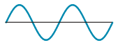

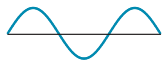

In fact, the wavefunction for the molecule is generally a mixture of the wavefunctions associated with the energy levels: such a wavefunction is often called a mixed state or a superposition state. We will see as the book progresses that NMR experiments, even the simplest ones, work by manipulating and exploiting the properties of these mixed states.

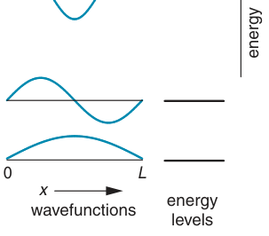

We can legitimately ask why it is not necessary to be concerned about these mixed states when thinking about IR or UV spectroscopy, since for these kinds of spectroscopy the energy level approach is sufficient. There 0 are two reasons for this.

First, mixed states arising from molecular vibrational and electronic energy levels have very short lifetimes so that it is hard (if not impossible) to manipulate them. The reason for these short lifetimes is that the states are changed and perturbed by the very frequent collisions which occur between molecules. In contrast, nuclei lie deeply buried inside the molecules and are little affected by collisions, so the mixed states arising from nuclear spins can be rather long lived. We can thus manipulate and observe them at our leisure.

**Fig. 3.3** The energy levels and associated wavefunctions for a particle constrained so that it can only move between x = 0 and x = L – the so-called ‘particle in a box’. We are tempted to slot the particle into one of the energy levels and hence give it the associated wavefunction. However, this is not what quantum mechanics specifies; rather the wavefunction which describes the particle is in general a mixture of the wavefunctions corresponding to each energy level.

The second reason why mixed states are important in NMR, and not in IR or UV spectroscopy, is that in NMR we have a straightforward way of manipulating these states using RF pulses. The equivalent for other forms of spectroscopy would be extremely short high-powered bursts of laser radiation. Although such sources are available, they are hardly routine.

Thus we really do not need concern ourselves with mixed states when it comes to the description of most kinds of spectroscopy other than NMR. Simply concentrating on the energy levels and supposing, albeit somewhat incorrectly, that the molecules are in one or other of the energy levels will give us a perfectly adequate description of the spectrum. In contrast, in NMR, we do need to take into account the existence and behaviour of these mixed states.

### 3.1.2 Energy levels in NMR

Despite the cautions and caveats of the previous section, energy levels and their associated wavefunctions do play a very important part in the theory of NMR. To start with, the frequencies of the lines in an NMR spectrum can always be predicted by thinking about the allowed transitions between the energy levels – indeed, the rest of this chapter is devoted to this topic.

Later on we will discover that the energy levels determine how the mixed states evolve over time. In NMR, time evolution is of central importance as we detect the FID as a function of time, and multiple-pulse sequences are all about manipulating the spins through different time periods. So, energy levels remain central to our discussion of NMR, even to the most sophisticated level.

### 3.1.3 The way ahead

The time has come to flesh out some of the ideas which have been introduced in this section, and to do this we will need to introduce quantum mechanics. In particular, we need to understand what a wavefunction is, and learn how energy levels and the associated wavefunctions can be found in particular cases. In fact, the quantum mechanics of NMR is surprisingly easy: we rarely, if ever, need to evaluate any integrals or differentials, and most problems can be solved by rather simpler algebra.

To start with we will develop sufficient quantum mechanics to be able to find the energy levels and associated wavefunctions of a single spin one-half. After that, we will discuss the resulting spectrum before moving on to more complex arrangements of spins.

## 3.2 Introducing quantum mechanics

Quantum mechanics is a powerful theoretical framework which provides an essentially complete description of the microscopic world. Quantum mechanical calculations on ‘real’ systems are often so complex that they can only be tackled numerically using powerful computers. This is why elementary courses of quantum mechanics concentrate on very simple model systems, such as the ‘harmonic oscillator’ or ‘rigid rotor’, for which it is possible to make calculations using a pen and paper. Luckily for us, the quantum mechanical description of NMR is particularly straightforward and it turns out to be possible to use it to analyse just about any experiment without the need to resort to computer-based calculations.

To develop the quantum mechanics we need from first principles would be both time consuming and laborious, so we shall not do it. Rather, we will simply state the key ideas and then use them to work forward to the practical results we need.

Wavefunctions and operators are of central importance in quantum mechanics, so we will start out by discussing them in turn.

### 3.2.1 Wavefunctions

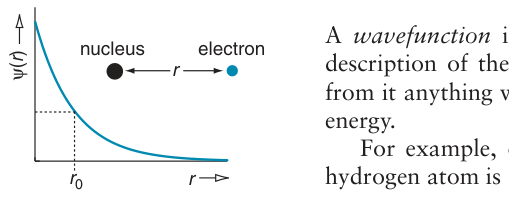

A wavefunction is a mathematical function which contains a complete description of the system: if we know the wavefunction we can deduce from it anything we wish to know, such as the position of a particle or its energy.

For example, one of the possible wavefunctions for an electron in a

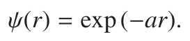

Here, r is the distance from the electron to the nucleus and a is a constant, which is known; the function is illustrated in Fig. 3.4. The wavefunction is written ψ(r) to remind us that the function depends on the variable r. We could substitute any value of r into this expression and then evaluate it to give a number: this is what is meant by ψ being a function of r.

**Fig. 3.4** An example of a possible wavefunction for the electron in a hydrogen atom; r is the distance between the nucleus and the electron, and ψ(r) is the wavefunction. For a particular value of r, r0, the wavefunction evaluates to a number.

We said that the wavefunction tells us everything about the system, but where is this information held and how do we extract it? To do this, we need to introduce quantum mechanical operators.

### 3.2.2 Operators

Mathematically, an operator is something which acts on a function to produce a new function. A good example is the operator d/dx, which means ‘differentiate with respect to the variable x’; let us apply this operator to the function sin x and see what happens. Recalling that the differential of sin x is cos x, the effect of the operator is

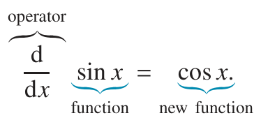

The new function, generated by the action of the operator, is therefore cos x.

Operators are important in quantum mechanics as in this theory they ‘represent observables’. Observables are things we can measure, for example energy – which is our main concern here. The wavefunction contains all the information, but we need the appropriate operator to ‘extract’ this information from the wavefunction. At this stage, we do not need to know the mathematical process by which an operator is used to find the value of some observable quantity, but we will return to this point later on.

A key point about operators is that the order in which they act is important. This is in contrast to functions and numbers, which can be reordered freely – for example

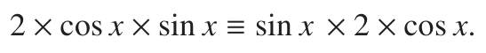

The first point to make is that in general the order of operators and functions cannot be changed. For example consider the operator d/dx and the function sin x:

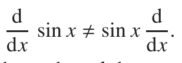

Here we see that changing the order of the operator and the function gives quite a different result.

The second point is that if we have two operators acting one after another on a function the result depends on the order in which the operators act. For example, consider the two operators d/dx, which means ‘differentiate with respect to x’, and x, which means simply ‘multiply by x’. Applying these operators in this order to sin x gives:

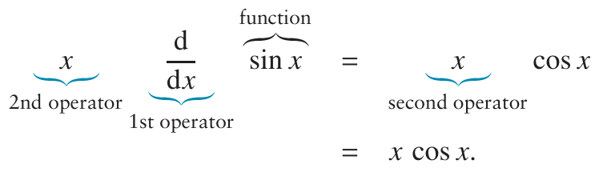

Note that the operator immediately to the left of the function is the one which acts first.

Now let us apply the operators in the other order

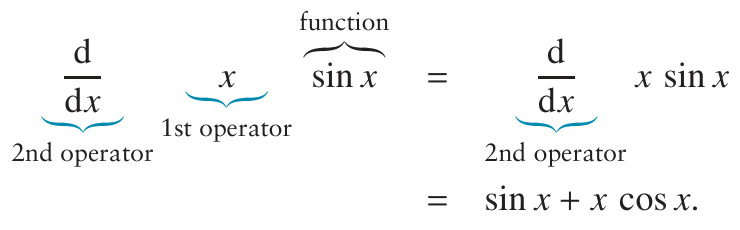

We see that applying the operators in the reverse order gives quite a different result.

Sometimes, the order of operators does not matter, in which case the operators are said to commute. When the order does matter, the operators are said not to commute.

### 3.2.3 Eigenfunctions and eigenvalues of operators

We introduced operators by saying that their effect on a function was to change it to a new function. However, there are some functions which, when a particular operator acts on them, remain unchanged apart from multiplication by a constant.

For example, consider the operator d/dx acting on the function exp (Ax), where A is a constant:

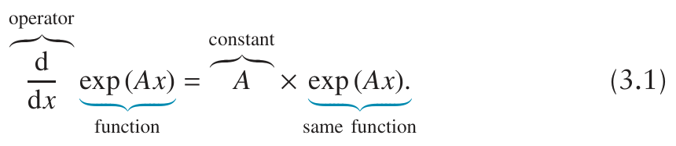

In contrast to the case where the operator acted on the function sin x, the result of it operating on exp (Ax) is for the function to be unchanged with the exception of multiplication by a constant. Functions which have this property are said to be eigenfunctions of the operator, and the multiplying constant is called the eigenvalue. Generally there are several eigenfunctions for a given operator, each with a corresponding eigenvalue.

The eigenfunctions and eigenvalues of an operator have the following relation between them:

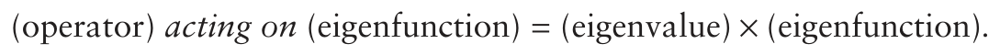

This is called the eigenvalue equation. Equation 3.1 is of the form of the eigenvalue equation, so we can say that exp (Ax) is an eigenfunction of the operator d/dx, with eigenvalue A.

### 3.2.4 Measurement

We mentioned in section 3.1 on page 24 the quantum mechanical postulate which implies that a measurement of the energy of a molecule will always give a value corresponding to one of the energy levels. A more general statement of the postulate is as follows:

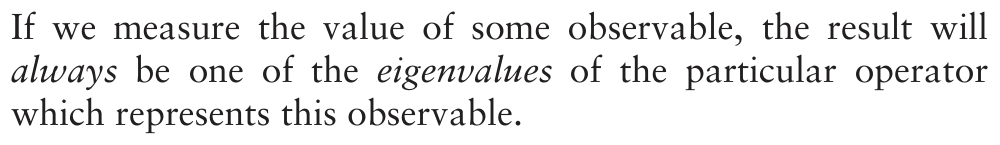

To take a concrete example, if we measure the energy of a system, then the result must be one of the eigenvalues of the operator for energy. It is these eigenvalues which are the ‘energy levels’ of the system which we have been talking about. Further, the eigenfunction associated with a particular eigenvalue is the wavefunction which corresponds to the energy level.

The eigenvalues and eigenfunctions of the energy operator are thus very important as they give us the energy levels of the system and the associated wavefunctions. To find the energy eigenfunctions we first need to know the energy operator, which is what the next section is about.

### 3.2.5 Hamiltonians and angular momentum

The operator which represents the observable quantity energy is so important in quantum mechanics that it has its own name – it is called the Hamiltonian operator. Usually the name is shortened to ‘the Hamiltonian’ and it is commonly represented using the symbols H and H, appropriately festooned with sub- and superscripts as required. A ‘hat’ is often added to remind us that the symbol represents an operator (rather than a function): Ĥ.

Constructing Hamiltonians is something of an art form which will not be discussed here. Rather, we will simply state the form of the various Hamiltonians we need and leave it at that.

For a nuclear spin in a magnetic field of strength B0 applied along the z-axis, the Hamiltonian which represents the energy of interaction between the spin and the magnetic field is

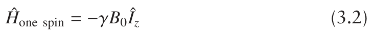

where γ is the gyromagnetic ratio, which is a fundamental property of the nucleus in question.

Îz is an operator which represents the z-component of the nuclear spin angular momentum. Angular momentum is a concept from classical physics where it is associated with rotational motion. For example, a mass following a circular path has angular momentum, which turns out to be a vector quantity having both a magnitude and a direction, as is illustrated in Fig. 3.5.

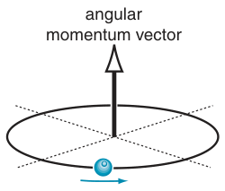

Some nuclei appear to possess an intrinsic source of angular momentum which is usually called nuclear spin angular momentum. The name is something of a problem, as it makes it sound as if the angular momentum arises from a literal spinning of the nucleus, which it certainly does not. Rather, the angular momentum is an intrinsic property of the nucleus, just like its mass or its charge.

**Fig. 3.5** In classical physics, a mass moving around a circular path possesses angular momentum which is a vector quantity, having both a magnitude and a direction. For motion in a circular path, the angular momentum vector points in a direction perpendicular to the plane of rotation.

Like classical angular momentum, the nuclear spin angular momentum is a vector quantity, having both a direction and a magnitude. The operator Îz represents the z-component of this angular momentum and it is this component which interacts with the applied magnetic field which is also along the z-direction.

### 3.2.6 Eigenfunctions and eigenvalues of Îz

Angular momentum operators, such as Îz, turn out to be very important in the theory of NMR, and we will come across them again and again. At this stage, it is the eigenfunctions and eigenvalues of Îz which are of particular importance. Finding these requires a rather subtle argument which we will not go into here; rather we will simply state the result and go on to explore the consequences.

The number of these eigenvalues depends on the spin of the nucleus in question, and this in turn is specified by a quantum number I, called the nuclear spin angular momentum quantum number or, more succinctly, the spin quantum number. I can be integer (0, 1, 2 . . . ) or half-integer (12, 32 . . . ).

It turns out that the operator Îz has (2I + 1) eigenfunctions (with associated eigenvalues), each of which is characterized by another quantum number m, which can only take values between −I and +I in integer steps.

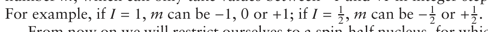

From now on we will restrict ourselves to a spin-half nucleus, for which Îz has just two eigenfunctions, characterized by m = +12 and m = −12. The two corresponding eigenfunctions are ψ+1/2 and ψ−1/2, and these obey the eigenvalue equations:

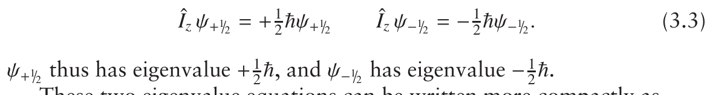

These two eigenvalue equations can be written more compactly as

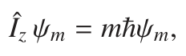

where, as above, m = ±12. We see that the quantum number m is not only a label for the eigenfunctions, but also gives the eigenvalue as mℏ.

You will have noticed that we have not said what the eigenfunctions ψm actually are – the reason for this is that this is a piece of information that we never need to know. All we need to know is that these functions exist and what the associated eigenvalues are. Armed with these eigenfunctions we can now go on to use them to find the eigenvalues of the Hamiltonian for one spin, and hence the energy levels.

### 3.2.7 Eigenvalues for the one-spin Hamiltonian

Not surprisingly, the functions ψ+1/2 and ψ−1/2 are also the eigenfunctions of the Hamiltonian for a single spin, Eq. 3.2 on the previous page:

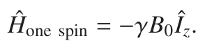

The reason why this is not surprising is that ψ±1/2 are eigenfunctions of Îz, and the only difference between this operator and Ĥone spin is multiplication

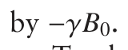

To show that ψ+1/2 is indeed an eigenfunction, and to find the corresponding eigenvalue, we need to work out what the effect of the Hamilto-

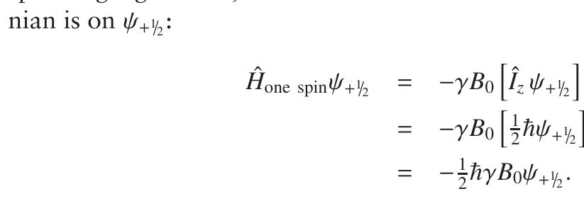

On the first line we note that the expression in square brackets is Îz acting on one of its eigenfunctions. We can therefore use Eq. 3.3 to replace Îzψ+1/2 with 12ℏψ+1/2; this brings us to the second line. On the third line we have just tidied things up by moving the constants to the left.

What we have shown is that when Ĥone spin acts on the function ψ+1/2 the result is to regenerate the function multiplied by a constant (−12ℏγB0). This is exactly the property of an eigenfunction, so

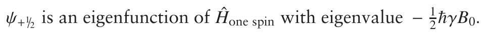

Using the same approach, it is easy to show that ψ−1/2 is also an eigenfunc-

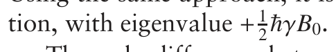

The only difference between Ĥone spin and Îz is multiplication by some constants, the presence of which does not stop an eigenfunction of Îz also being an eigenfunction of Ĥone spin. The eigenvalues of this Hamiltonian are

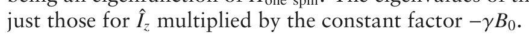

### 3.2.8 Summary

We have covered quite a lot of ground in this introduction to quantum mechanics, so it is worthwhile pausing to summarize the key results.

- Operators represent observable quantities; particularly important is the Hamiltonian operator which represents the energy.

- The eigenvalues of the Hamiltonian are the energy levels available to the system; the eigenfunctions are the associated wavefunctions.

- For a spin one-half, the operator for the z-component of the angular

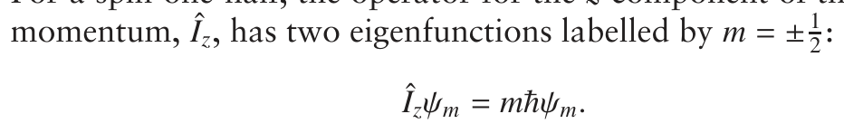

- The Hamiltonian for one spin in a magnetic field is

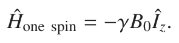

- The eigenfunctions of Îz are also eigenfunctions of this Hamiltonian,

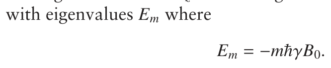

These are the two energy levels of a single spin-half in a magnetic field.

## 3.3 The spectrum from one spin

### 3.3.1 Energy levels

As we have shown in the last section, the two energy levels or states available to a single spin-half are

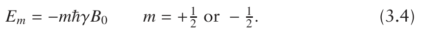

B0 is the magnetic field strength, usually given in Tesla (symbol T), and the gyromagnetic ratio, γ, is usually given in rad s−1 T−1. With these units, the energy comes out in Joules, as expected.

For spin-half nuclei it is traditional (and compact) to give the energy

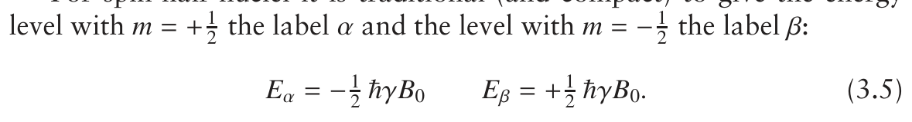

The α state with m = +12 is often described as ‘spin up’, and the β state

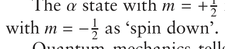

Quantum mechanics tells us that the allowed transitions are ones in which m changes by +1 or −1. So, if we go from the α state, with m = +12,

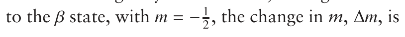

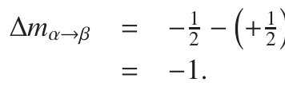

So, the transition from α to β is allowed, and it is easy to work out that for

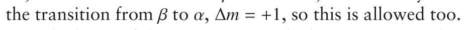

Which out of the α or β state is the lower in energy depends on the sign of the gyromagnetic ratio, γ. For 1H and 13C, γ is found to be positive, but for 15N γ is negative. From now on, unless specifically stated otherwise, we will assume that γ is positive; for such a nucleus the energy levels are as shown in Fig. 3.6.

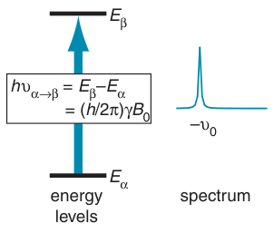

The energy of the allowed transition from α to β is

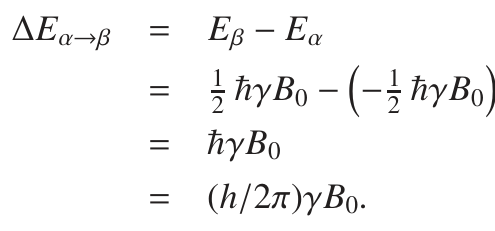

**Fig. 3.6** The two energy levels for a single spin-half nucleus having a positive gyromagnetic ratio. The allowed transition between them gives rise to a single line at minus the Larmor frequency.

Note that to compute ΔE we have taken the energy of the upper state minus that of the lower state, thus making ΔE a positive quantity. We will stick to this convention throughout all that follows.

Recalling that the energy of a photon of frequency ν is hν, it follows that the frequency of the photon corresponding to the above energy gap,

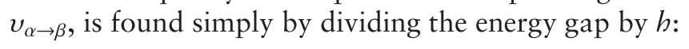

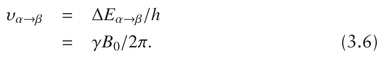

Our prediction is for a line at frequency (γB0)/2π Hz.

### 3.3.2 The Larmor frequency

We now define the Larmor frequency of the spin, ω0 (in rad s−1), in the following way:

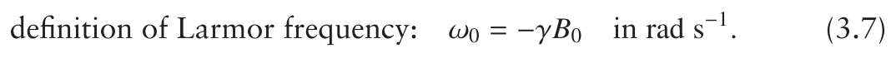

The Larmor frequency in Hz, ν0, is simply ω0/2π:

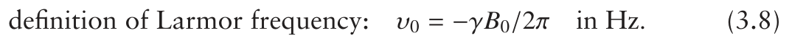

The minus sign in these definitions seems a bit awkward, but it does have a reason, which will become clear when we look at the vector model in the following chapter.

Comparing Eq. 3.6 and Eq. 3.8 we see that the transition from α to β occurs at minus the Larmor frequency:

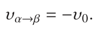

This is a nice simple result. For a single spin, there is one allowed transition which results in a line in the spectrum at minus the Larmor frequency. From Eq. 3.8 on the facing page we see that this frequency is proportional to the magnetic field strength, as we expect, with the constant of proportionality being the gyromagnetic ratio.

We know that nuclei of the same isotope (e.g. protons), but in different chemical environments, give lines at slightly different frequencies on account of the chemical shift. We could accommodate this by allowing the gyromagnetic ratio to be different for different protons, but this is not really convenient. A better way is to keep γ the same for all nuclei of the same isotope and redefine the Larmor frequency to include the chemical shift:

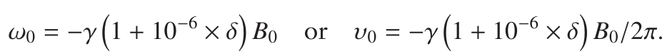

In these expressions δ is the chemical shift in ppm.

The tabulated values for γ are usually for a bare nucleus i.e. in the absence of the influence of the surrounding electrons. However, it is usual to measure chemical shifts relative to an agreed reference compound, so δ = 0 does not correspond to a bare nucleus. As a result, these expressions for the Larmor frequency cannot be used directly. In practice this is of little consequence since the Larmor frequency of a nucleus in a particular environment is invariably determined by experiment.

### 3.3.3 Writing the energies in frequency units

As we are always going to want to convert the energy differences between levels to frequencies, we might just as well express the original energies in frequency units to start with. It might seem strange at first to write an energy in Hz or rad s−1, but remember that energy is in direct proportion to frequency so going from one to the other simply involves multiplication by a constant factor.

As we saw in section 2.6 on page 20, to convert energies from Joules to Hz, all we need to do is divide by Planck’s constant, h, and to convert from Joules to rad s−1 we divide by ℏ. So the energies given by Eq. 3.4 on page 31 can be written in frequency units as:

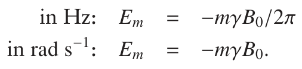

These can be made even simpler by introducing the Larmor frequencies, as defined in Eq. 3.7 and Eq. 3.8 on the preceding page

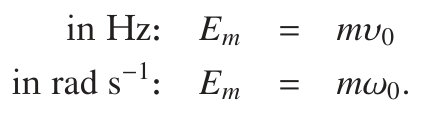

Note that the minus sign has disappeared as the definition of the Larmor frequencies introduces a further negative.

Now the energies, measured in Hz, of the α and β states are simply

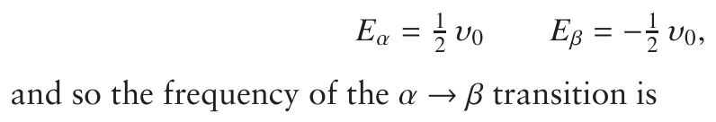

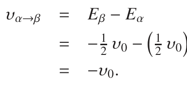

This is exactly the same result we found before, but you can see that writing the energies in frequency units is much simpler and more direct than working in energy units.

## 3.4 Writing the Hamiltonian in frequency units

Just as it is convenient to write the energy levels in frequency units, it would also simplify things if when we find the eigenvalues of the Hamiltonian they came out directly in frequency units, rather than in Joules. If we take an energy in Joules and divide by ℏ, we obtain a frequency in rad s−1, so shifting the Hamiltonian from energy to angular frequency units is simply a matter of ‘losing’ a factor of ℏ.

This is normally done by removing the factor of ℏ from the eigenvalues of the operator Îz. So, rather than Eq. 3.3 on page 30, we have

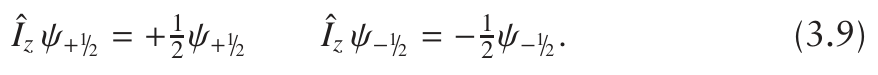

What we are doing is expressing the eigenvalues of Îz in units of ℏ.

Recall that the Hamiltonian for one spin is

Using Eq. 3.9, we can show that ψ1/2 is an eigenfunction of this Hamiltonian in the same way as we did in section 3.2.7 on page 30:

The eigenvalue is thus −12γB0 or, if we introduce the Larmor frequency defined in Eq. 3.7 on page 32, +12ω0. Using the same approach we can

We can also use the definition of the Larmor frequency to write the one-spin Hamiltonian as

If we want the frequencies in Hz, all we would need to do is divide everything by 2π:

where we have used ν0 = ω0/2π. The eigenfunctions of this Hamiltonian are the same as before, but the eigenvalues are ±12ν0. The eigenvalues written in various units are summarized in the following table:

## 3.5 The energy levels for two coupled spins

It is fairly straightforward to extend our treatment of one spin to two. The first thing to do is to write down the Hamiltonian. For one spin it was (in units of Hz)

To extend this to two spins we simply add a similar term for the second spin:

This needs some explanation. Î1z is the operator for the z-component of angular momentum of the first spin, and Î2z is a similar operator referring to the second spin. Similarly, ν0,1 is the Larmor frequency of the first spin, and ν0,2 that of the second spin (they need not be the same). It is important to realize that separate operators are needed for each spin. For the moment we will leave out the coupling between the two spins, but this will be remedied shortly.

Having found the Hamiltonian, we now need to find the eigenfunctions, and this turns out to be rather easy as they are just products of the eigenfunctions of Îz for each spin. For the first spin, the two eigenfunctions of Î1z are given by Eq. 3.9 on the facing page

Note how the subscript 1 has been added to the eigenfunction to indicate that it is an eigenfunction of the spin one operator. Two similar eigenfunctions exist for Î2z:

We will now show that ψα,1ψβ,2 is an eigenfunction of Ĥtwo spins, no coupl. and, as before, we do this by acting on the function with the Hamiltonian operator. There are several steps in the calculation:

**Table 3.1** Eigenfunctions and eigenvalues (in Hz) for two spins, without a coupling between them. Each eigenfunction is labelled with the m value for each spin; in addition the spin-state labels are also given.

To get to the second line we have just multiplied out the bracket. On the third line, the first term is the same but, compared with the previous line, in the second term the order of Î2z and ψα,1 has been swapped. As we noted in section 3.2.2 on page 27, we are not normally allowed to reorder operators and functions, but in this case it is permissible as the operator refers to spin two whereas the function refers to spin one. The operator thus has no effect on the function, so reordering is permissible. It would not, however, be permissible to reorder Î1z and ψα,1 as both refer to the same spin.

Now look at the last line. Using Eq. 3.11 on the preceding page, the first square bracket can be rewritten as +12ψα,1, and using Eq. 3.12 on the previous page the second square bracket can be rewritten as −12ψβ,2. Using these substitutions we find

To go to the final line we have simply factored out ψα,1ψβ,2.

What we have shown is that when Ĥtwo spins, no coupl. acts on the function ψα,1ψβ,2 that function is regenerated multiplied by a constant 12ν0,1 − 12ν0,2. In other words, ψα,1ψβ,2 is an eigenfunction of the Hamiltonian and

It is easy to go on to use the same method to show that there are three more possible eigenfunctions, each consisting of a product of an eigenfunction of Î1z with an eigenfunction of Î2z. The results are summarized in Table 3.1.

As well as labelling the wavefunctions as α or β for each spin, we have also given the value of m for the first and second spins, m1 and m2. The table also lists the ‘spin states’ which is a shorthand way of describing the wavefunction: the first letter gives the spin state of the first spin and the second the spin state of the second spin.

If you look at this table it is easy to spot that the general expression for the eigenvalues (the energy levels) is

### 3.5.1 Introducing scalar coupling

A scalar coupling between the two spins adds a third term to the Hamiltonian:

where J12 is the scalar coupling between spins one and two, in Hz (the Larmor frequencies are also in Hz).

It turns out that the four wavefunctions listed in the Table 3.1 on the preceding page are still eigenfunctions of this Hamiltonian, although with different eigenvalues. As an example we will take the function corresponding to the αβ spin states and show that this is an eigenfunction of just the coupling term, J12 Î1z Î2z. The procedure is, as before, to apply the operators to the wavefunction:

On the first line we have reordered the two terms Î2zψα,1 indicated by the underbrace; as before, we can do this as the operator and function refer to separate spins. Having made this reordering, we recognize that the two expressions in square braces can be substituted using Eq. 3.11 and Eq. 3.12 on page 35. Making these substitutions gives us the second line. Finally, some simple tidying up gives us the third line.

We have shown that operating on ψα,1ψβ,2 with the coupling term of the Hamiltonian regenerates the original function times the constant −14 J12. So, ψα,1ψβ,2 is an eigenfunction with eigenvalue −14 J12. To complete the calculation we need to show that ψα,1ψβ,2 is an eigenfunction of Ĥtwo spins, not just of the coupling term. However, as we have already shown that this

it follows that it is also an eigenfunction of the sum of these terms. The eigenvalue is, not surprisingly, the sum of the eigenvalues of the separate

In fact, it is no coincidence that these ‘product’ functions, such as ψα,1ψβ,2 are eigenfunctions of the coupling term in the Hamiltonian. The underlying reason is that the coupling term commutes with the other terms (see section 3.2.2 on page 27), and there is a theorem in quantum mechanics which states that two commuting operators will have common eigenfunctions.

Applying the same procedure to the other three product functions gives us the complete set of energies shown in Table 3.2 on the following page; for future convenience the levels have been numbered.

Once more it is easy to see that in general the eigenvalues (energies) obey:

If the two spins are of the same type (e.g. both protons) then we have a homonuclear spin system and ν0,1 ≈ ν0,2. Under these circumstances the

**Table 3.2** Eigenfunctions and eigenvalues (energies, in Hz) for two coupled spins.

αβ and βα levels (levels 2 and 3) are very similar in energy, and lie more or less mid way in energy between the other two levels, as is depicted in 4 Fig. 3.7 (a). In contrast, if the two spins are of different types (e.g. one 2 proton and one 13C), all four levels have markedly different energies, as shown in Fig. 3.7 (b).

## 1 3.6 The spectrum from two coupled spins

The selection rule for allowed transitions in the case of two spins is just the same as it was for one spin i.e. m can only change by ±1. However, when applied to two spins the rule has to be supplemented somewhat to say that m of only one of the spins can change by ±1. So, the quantum number of the first spin, m1, may change by ±1, or that of the second spin, m2, may change by the same amount.

**Fig. 3.7** Energy levels, drawn approximately to scale, for two different two-spin systems. (a) The energy levels of a homonuclear system (two protons); on this scale the αβ and βα states have the same energy. (b) The energy levels of a 13C–1H pair. The Larmor frequency of a proton is about four times that of 13C, and this leads to the αβ and βα states having substantially different energies.

Applying these rules means that the allowed transitions are between levels 1 and 2, 3 and 4, 1 and 3, and 2 and 4. The resulting frequencies are easily worked out, as is shown here for that of the 1–2 transition:

The complete set of transitions are:

The energy levels and corresponding schematic spectrum are shown in Fig. 3.8 on the next page. As expected, the spectrum consists of two doublets, each split by J12 and centred at the Larmor frequencies of spins one and two.

As a result of the selection rule, each allowed transition corresponds to one of the spins ‘flipping’ from one spin state to the other, while the state of the other spin remains fixed. For example, transition 1–2 involves a spin two going from α to β whilst spin one remains in the α state. In this

**Fig. 3.8** On the left, the energy levels of a two-spin system; the arrows show the allowed transitions: grey arrows indicate transitions in which spin one flips and blue arrows indicate those in which spin two flips. On the right, the corresponding spectrum; each line is marked according to the two energy levels involved, which spin flips (the active spin) and the spin state of the passive spin. It is assumed that the Larmor frequency of spin two is greater in magnitude than that of spin one, and that the coupling J12 is positive.

transition we say that spin two is active and spin one is passive and in the α spin state. As spin two flips in this transition, it is not surprising that the transition forms one part of the doublet for spin two.

Transition 3–4 is similar to 1–2 except that the passive spin (spin one) is in the β state; this transition forms the second line of the doublet for spin two. This discussion illustrates a very important point, which is that the lines of a multiplet can be associated with different spin states of the coupled (passive) spins. We will use this kind of interpretation very often, especially when considering two-dimensional spectra.

The two transitions in which spin one flips are 1–3 and 2–4, and these are associated with spin two being in the α and β spin states, respectively. Which spin flips and the spin states of the passive spins are shown in Fig. 3.8 for each transition.

If the coupling J12 is negative, working through the calculation gives the same four lines at identical positions as for a positive coupling of the same magnitude. This result is in accord with the observation we made earlier in section 2.3 on page 10 concerning the effect (or lack of it) of changing the sign of the coupling.

However, what does change when the coupling becomes negative are the labels of the lines, as is illustrated in Fig. 3.9. For example, transition 1–2 is now the right-hand line of the doublet, rather than the left line. From the point of view of the spectrum, what swaps over is the spin state of the passive spin associated with each line of the multiplet.

**Fig. 3.9** Illustration of the effect of changing the sign of the coupling on the spectrum of two coupled spins. The top spectrum is for a positive coupling, whereas the lower is for a negative coupling of the same magnitude. Note that the appearance of the spectrum is identical, but that the labels on the transitions change.

### 3.6.1 Multiple-quantum transitions

There are two more transitions in our two-spin system which are not allowed by the usual selection rule and so do not appear in the spectrum; the transitions are illustrated in Fig. 3.10 on the next page. We will discover later on that, using two-dimensional NMR, we can detect these transitions indirectly.

The first forbidden transition is between states 1 and 4 (αα → ββ) in which both spins flip. The usual way of describing such a transition is to specify the change in the quantum number M which is found by adding up the m values for each spin. For two spins, M is simply m1+m2. The M value for each level can be computed in this way to give the following results:

**Fig. 3.10** In a two-spin system there is one double quantum transition (1–4) and one zero-quantum transition (2–3). The frequency of neither of these transitions are affected by the size of the coupling between the two spins.

The change in M, ΔM, for the 1–4 transition is thus −2 and so this transition is called a double-quantum transition. Using the same approach, all of the allowed transitions described above have ΔM = ±1 and so are called single-quantum transitions.

From the table of energy levels (Table 3.2 on page 38) it is easy to work out that the frequency of the 1–4 transition is (−ν0,1−ν0,2) i.e. the sum of the Larmor frequencies. Note that the coupling has no effect on the frequency of this line.

The second forbidden transition is between states 2 and 3 (βα → αβ); again, both spins flip. The ΔM value is 0, so this is called a zero-quantum transition, and its frequency is (−ν0,1 +ν0,2) i.e. the difference of the Larmor frequencies. As with the double-quantum transition, the coupling has no effect on the frequency of this line.

Optional section ⇒

## 3.7 Three spins

### 3.7.1 The Hamiltonian and energy levels

Now we are getting used to writing Hamiltonians, the following should come as no surprise:

The first three terms represent the interactions of spins 1, 2 and 3 with the magnetic field; note that there are three different Larmor frequencies. The next three terms represent all of the possible couplings, with each term being the product of the Îz operator for the relevant two spins.

The eigenfunctions of this Hamiltonian turn out to be products of the eigenfunctions of Îz, ψα and ψβ, for each spin. For example, one such product function is ψα,1ψα,2ψβ,3. Since each spin can be α or β, there are a total of eight separate product functions.

We will not go through the process of showing that these are indeed the eigenfunctions and finding the corresponding eigenvalues, but simply state the general form of the eigenvalues, that is the energies:

**Table 3.3** Eigenfunctions and corresponding eigenvalues (energies, in Hz) for three coupled spins. The first four levels all have the third spin in the α state, whereas for the second four, the third spin is in the β state.

In this expression, m1, m2 and m3 can each be +12 (the α state) or −12 (the β state). The energies and corresponding M values (= m1 +m2+m3) are shown in Table 3.3.

In the table, we have grouped the energy levels into two groups of four: the first group all have spin three in the α state and the second have spin three in the β state. The energy levels (for a homonuclear system) are shown schematically in Fig. 3.11.

### 3.7.2 Single-quantum spectrum

As before, the selection rule is that m of just one spin can change by ±1, which means that ΔM = ±1. Applying this rule we see that there are four allowed transitions in which spin one flips: 1–3, 2–4, 5–7 and 6–8. The frequencies of these lines can easily be worked out from the energy levels given in Table 3.3, and are shown on the following page along with the spin states of the passive spins (two and three in this case).

**Fig. 3.11** Energy levels for a homonuclear three-spin system. The levels can be grouped into two sets of four: those with spin three in the α state (shown on the left with black lines) and those with spin three in the β state (shown on the right with blue lines).

**Fig. 3.12** Energy levels for a three-spin system showing by the arrows the four allowed transitions which result in the doublet of doublets at the shift of spin one. The schematic multiplet is shown on the right, where it has been assumed that ν0,1 = −100 Hz, J12 = 10 Hz and J13 = 2 Hz. The multiplet is labelled with the spin states of the passive spins.

transition state of spin two state of spin three

These four transitions form the four lines of the multiplet (a doublet of doublets) centred at the Larmor frequency of spin one. The schematic spectrum is illustrated in Fig. 3.12. As in the case of a two-spin system, we can label each line of the multiplet with the spin states of the passive spins – in the case of the multiplet from spin one, this means the spin states of spins two and three. In the same way, we can identify the four transitions which contribute to the multiplet from spin two (1–2, 3–4, 5–6 and 7–8) and the four which contribute to that from spin three (1–5, 3–7, 2–6 and 4–8).

### 3.7.3 Multiple-quantum transitions

There are six double-quantum transitions in which two spins flip and in which M changes by 2. Their frequencies are given in the following table.

These transitions come in three pairs. Transitions 1–4 and 5–8 are centred at the sum of the Larmor frequencies of spins one and two; this is not surprising as in these transitions it is the spin states of both spins one and two which flip. The two transitions are separated by the sum of the

**Fig. 3.13** There are two double-quantum transitions in which spins one and two both flip (transitions 1–4 and 5–8). The two resulting lines form a doublet which is centred at the sum of the Larmor frequencies of spins one and two and which is split by the sum of the couplings to spin three. As with the single-quantum spectra, we can associate the two lines of the doublet with different spin states of the third spin.

couplings to spin three (J13 + J23), but they are unaffected by the coupling J12 which is between the two active spins.

We can describe these transitions as a kind of double quantum doublet. spins one and two are both active in these transitions, and spin three is passive. Just as we did before, we can associate one line with spin three being in the α state (transition 1–4) and one with it being in the β state (transition 5–8). A schematic representation of the spectrum is shown in Fig. 3.13.

There are also six zero-quantum transitions in which M does not change. Like the double quantum transitions these group in three pairs, but this time centred around the difference in the Larmor frequencies of two of the spins. These zero-quantum doublets are split by the difference of the couplings to the spin which does not flip in the transitions. There are thus many similarities between the double- and zero-quantum spectra.

In a three-spin system there is one triple-quantum transition, in which M changes by 3, between levels 1 (ααα) and 8 (βββ). In this transition all of the spins flip, and from the table of energies we can easily work out that

We see that the single-quantum spectrum consists of three doublets of doublets, the double-quantum spectrum of three doublets and the triple-quantum spectrum of a single line. This illustrates the idea that as we move to higher orders of multiple quantum, the corresponding spectra become simpler. This feature has been used in the analysis of some complex spin systems.

### 3.7.4 Combination lines

There are three more transitions which we have not yet described. For these, M changes by 1 but all three spins flip; they are called combination lines. Such lines are not seen in normal spectra but, like multiple quantum transitions, they can be detected indirectly using two-dimensional spectra. These lines may become observable in strongly coupled spectra. The following table gives the frequencies of these three lines:

Notice that the frequencies of these lines are not affected by any of the couplings.

## 3.8 Summary

In this chapter we have seen precisely what we mean by ‘energy levels’ and why they are important in NMR. We have seen that these energy levels are the eigenvalues of the relevant Hamiltonian, and we have looked at how Hamiltonians are written and how the eigenvalues (and eigenfunctions) can be found.

Armed with these energy levels and the necessary selection rules, we can predict the spectra we expect from two and three coupled spins. By working from the energy levels, we see where the idea that lines can be associated with particular spin states of coupled spins come from.

Finally, we saw that for coupled spins we have the possibility of multiple quantum transitions which are not allowed in simple experiments but which can be detected indirectly. Like normal spectra, such multiple quantum spectra can contain multiplets, which can be interpreted in a similar way to those in conventional spectra.

## 3.9 Further reading

The origins of nuclear spin:

Chapter 1 from M. H. Levitt, Spin Dynamics (2nd edition, John Wiley

& Sons, Ltd, 2008).

Operators and wavefunctions:

Chapter 1 from N. J. B. Green, Quantum Mechanics 1: Foundations

(Oxford University Press, 1997).

## 3.10 Exercises

3.1 Following the same approach used in section 3.2.7 on page 30, show that ψ−1/2 is an eigenfunction of Ĥone spin with eigenvalue

3.2 Calculate the Larmor frequency (in Hz, MHz and rad s−1) of 13C at a magnetic field strength of 9.4 T; the gyromagnetic ratio of 13C is

is zero.

3.3 Show that ψ±1/2 are eigenfunctions of the one-spin Hamiltonian when it is written in angular frequency units

hence find the corresponding eigenvalues. You should assume that

3.4 Following the approach of section 3.5 on page 35, show that ψα,1ψα,2 is an eigenfunction of the Hamiltonian for two spins with no coupling between them:

Hence find the corresponding eigenvalue (the energy); make sure that each step in your argument is clear and justified. Show that ψα,1ψα,2 is also an eigenfunction of the coupling term J12 Î1z Î2z; find the corresponding energy. Without further detailed calculations explain why ψα,1ψα,2 is an eigenfunction of the Hamiltonian for two spins with coupling

state the corresponding eigenvalue (energy).

3.5 Larmor frequencies are usually tens or hundreds of MHz, but to make the numbers easier to handle in this problem we will assume that the Larmor frequencies are very much smaller. Consider a system of two coupled spins. Let the Larmor frequency of the first spin be −100 Hz and that of the second spin be −200 Hz, and let the coupling between the two spins be 5 Hz. Compute the energies (in Hz) of the four energy levels, according to Table 3.2 on page 38. Using these energies, compute the frequencies of the four allowed transitions; make a sketch of the spectrum, roughly to scale, and label each line with the energy levels involved (i.e. 1–2 etc.). Also, indicate for each line which spin flips and the spin state of the passive spin.

Repeat your calculation, and redraw the sketch, for the case where the coupling is −5 Hz. Comment on the effect of changing the sign of the coupling.

3.6 For a three-spin system, use Table 3.3 on page 41 to work out the frequencies of the four allowed transitions in which spin two flips. Then, taking ν0,2 = −200 Hz, J23 = 4 Hz and the rest of the parameters as in Fig. 3.12 on page 42, compute the frequencies of the lines which comprise the spin two multiplet. Make a sketch of the multiplet (roughly to scale) and label the lines in the same way as is done in Fig. 3.12 on page 42.

3.7 For a three-spin system, use Table 3.3 on page 41 to compute the frequencies of the six zero-quantum transitions; mark these transitions on an energy level diagram. Explain why these six transitions fall into three groups of two. How would you describe the zero-quantum spectrum?
