# The vector model

In the last chapter we made quite a lot of progress towards understanding the form of NMR spectra by working from the energy levels and selection rules. However, this has brought us no closer to understanding how even the simplest pulse–acquire NMR experiment actually works. Ultimately it is only quantum mechanics which will give us the complete understanding we are looking for. However, before we embark on the full rigours of that approach we will spend some time exploring the much simpler vector model.

Strictly speaking, the vector model only applies to uncoupled spins, so you might think that it is of little use. However, the model gives us an excellent start towards understanding RF pulses, and also is a convenient way of thinking about some key experiments, such as the spin echo. In due course, we will discover that many features of the vector model have direct counterparts in the full quantum mechanical treatment, and this common ground between the two approaches will help us to come to grips with the more complex quantum mechanical approach. The final reason for spending some time with the vector model is that much of the language used to talk about pulsed NMR is derived from this model.

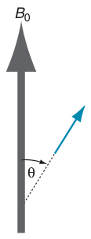

So, although the vector model has its limitations, it is very worthwhile to know where the model comes from and how to use it.

**Fig. 4.1** The energy of interaction between a magnetic moment, represented by the small arrow, and an applied magnetic field, B0, depends on the angle θ between the magnetic moment and the field direction. The lowest energy arrangement is when the magnetic moment is parallel to the field (θ = 0), and the highest energy arrangement is when the moment is opposed to the field (θ = π radians).

## 4.1 The bulk magnetization

In section 3.2.5 on page 29 we described how some nuclei appear to contain a source of spin angular momentum. It turns out that associated with this angular momentum there is always a nuclear spin magnetic moment; what this means is that the nucleus generates a small magnetic field, just as if it were a tiny bar magnet.

When the nucleus is placed in a magnetic field (as we always do to record an NMR spectrum), there is an interaction between the nuclear magnetic moment and the applied field. The energy of the interaction depends on the angle between the magnetic moment and the applied field.

The lowest energy arrangement is when this angle is zero i.e. the magnetic moment is parallel to the field, and the highest energy is when the magnetic moment is opposed to the field (see Fig. 4.1 on the preceding page).

The energy of the spins in our sample is thus minimized if all of the individual magnetic moments align with the field. However, this alignment is opposed by the random thermal motion of the molecules which is trying to drive the system to state where the magnetic moments have random orientations. The energy of this thermal motion is very much greater than the energy of interaction between a nuclear magnetic moment and the applied field, and so the thermal motion easily disrupts the alignment of the magnetic moments.

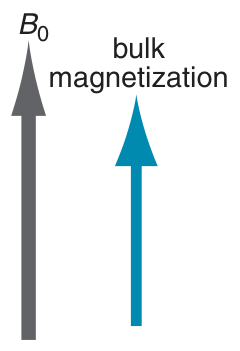

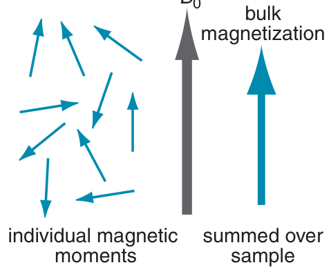

However, the randomizing effect of the thermal motion is not complete since, as we have described, there is a very small energetic advantage for the magnetic moment to be aligned with the field. As a consequence, the magnetic moments are aligned in such a way that, averaged over our sample, there is a slight net alignment of the moments parallel to the magnetic field. One way of describing this alignment is to say that out of 105 spins it is as if just one magnetic moment is aligned with the field and the rest are aligned randomly – you can see why the alignment is described as ‘slight’.

**Fig. 4.2** As a result of the disruption due to thermal motion, the individual magnetic moments are not all able to adopt the lowest energy arrangement in which they align with the field. For nuclear magnetic moments the interaction with the field is so small that, across the sample, the arrangement of the moments is almost random. However, there is a small preference for alignment with the field and this, when averaged over the sample, gives rise to a bulk magnetization of the sample, parallel to the field direction. This magnetization can be represented by a vector, called the bulk magnetization vector.

As a result of this net alignment, the NMR sample becomes magnetized, which means that the sample as a whole acquires a magnetic moment, just as each spin has a magnetic moment; this is illustrated in Fig. 4.2. This magnetization of the sample is along the direction of the applied magnetic field and is represented by a bulk magnetization vector. The description ‘bulk’ is there to remind us that the magnetization is a property of the whole sample. Note that the magnetization is a vector quantity, having a magnitude and a direction.

The vector model is only concerned with what happens to this magnetization vector. The nice thing about the model is that the behaviour of the vector is completely classical – we do not need any quantum mechanics to work out what will happen. The model just involves rotations of the magnetization vector in normal space, and so is intuitive and quite easy to understand. Later on we will discover that for uncoupled spins the predictions of the model are identical to those from a quantum mechanical treatment. For such systems the vector model is exact.

### 4.1.1 Surely the spins can only be ‘up’ or ‘down’?

Figure 4.2 might cause you some difficulties as it shows the magnetic moments from individual spins pointing in all directions, whereas you will read in many elementary accounts of NMR that ‘the spins are either up (state α) or down (state β)’. The problem is that this statement, although oft repeated, is simply not true, for the reasons set out in section 3.1.1 on page 24.

In that section we described how spins are generally in what are called mixed or superposition states which are combinations of the wavefunctions for the α and β states. A consequence of this is that the magnetic moment can point anywhere between up, where it would point for a pure α state, and down, where it would point for a pure β state. We will return to this point when we examine the quantum mechanics of a single spin in more detail in Chapter 6.

### 4.1.2 Axis systems

The rest of this chapter is going to be concerned with the motion of the magnetization vector in three-dimensional space. This is a convenient moment, therefore, to describe the axis system we are going to use, which is the right-handed axis set illustrated in Fig. 4.3.

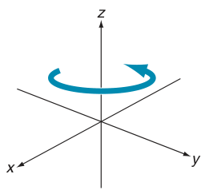

The axes are described as right-handed as if you grasp the z-axis with your right hand, with the thumb pointing along the +z direction, then your fingers curl from the x- to the y-axis. The curl of your fingers also gives the sense of a positive rotation in such an axis system. So, looking down the z-axis from +z towards the origin, a positive rotation is anti-clockwise and takes us from x to y. Similarly, a positive rotation about the x-axis takes us from z to −y since if you imagine grasping the x-axis with your right hand you will find that the curl of your fingers takes you from z to −y.

**Fig. 4.3** The right-handed axis set which will be used throughout this book; the axes are right-handed in the sense that if the z-axis is grasped with the right hand and with the thumb pointing along +z, the fingers curl from x to y. In such an axis system, a positive rotation about a particular axis is defined by the curl of the fingers if that axis is grasped with the right hand and with the thumb pointing in the positive direction. A positive rotation about the +z-axis is shown.

### 4.1.3 The equilibrium magnetization

When a sample is first placed in a magnetic field there is no bulk magnetization along the z-axis; rather, it takes a finite time for this magnetization to build up. If we wait long enough, the magnetization reaches a steady value, and at this point we say that the equilibrium magnetization has been established.

The process by which the sample comes to equilibrium is illustrated in Fig. 4.4 on the next page. In the absence of a magnetic field the moments are oriented randomly because all orientations have the same energy. Consequently, there is no net magnetization of the sample. When a magnetic field is applied there is an energetic preference for the magnetic moments to be oriented parallel to the field, but to start with the magnetic moments are still oriented randomly so there is no net magnetization.

Over time, the random molecular motion ensures that the lower-energy orientations are preferentially populated and, as was described above, this leads to the growth of the net magnetization vector along the z-axis. As more moments adopt lower energy orientations the magnetization grows until it reaches a steady value. At this point there is no further change and the system is at equilibrium.

The process by which the spins come to equilibrium in a magnetic field is called relaxation. For nuclear spins it is a relatively slow process – it can easily take several seconds for the equilibrium net magnetization to build up. In Chapter 9 we will look into the details as to how random molecular motion leads to relaxation.

As we have seen (Fig. 4.1 on page 47), the energy of a particular magnetic moment depends on the angle between it and the applied field. However, it turns out that the energy is independent of the orientation of the moment in the xy-plane. As a result there is no energetic prefer-ence for any particular orientation in the xy-plane, so at equilibrium we expect that the x- and y-components of the individual magnetic moments will be distributed randomly. Averaged over the sample these individual

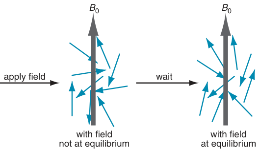

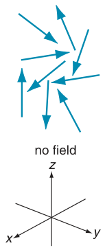

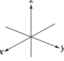

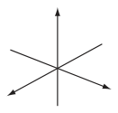

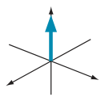

**Fig. 4.4** Illustration of how the equilibrium magnetization builds up. On the left is shown the case where no magnetic field is applied: the individual magnetic moments are at random orientations so that, summed over the sample, there is no net magnetization. In the presence of a magnetic field, there is an energetic preference for moments to be aligned with the field, but it takes time for these orientations to be populated. So, when the magnetic field is first applied there is still no magnetization. However, after waiting sufficient time, the orientations with the moment parallel to the field become more populated as shown (greatly exaggerated) on the right. The result is that, summed over the sample, there is a net magnetization along the field direction.

transverse components will cancel one another out such that there is no bulk magnetization in the transverse plane. Therefore, at equilibrium, the bulk magnetization vector is aligned along the z-axis. We will see in the following sections how bulk transverse magnetization can be created by the application of RF pulses.

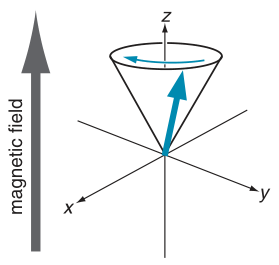

## 4.2 Larmor precession

Once it has formed, the equilibrium magnetization vector is fixed in size and direction – it does not vary over time, which is a particular property of the equilibrium state. However, suppose that by some means (which we will go into later) the magnetization vector has been tipped away from the z-axis, such that the vector makes an angle β to that axis. It turns out that what then happens is that the magnetization vector rotates about the direction of the magnetic field sweeping out a cone with a constant angle β, as shown in Fig. 4.5. This kind of motion is called precession – the vector is said to precess about the field.

**Fig. 4.5** Once tilted away from the z-axis, the magnetization vector rotates about the field direction, sweeping out a cone of constant angle to the z-axis; this motion is called precession. The direction of precession shown is for a nucleus with a positive gyromagnetic ratio and hence a negative Larmor frequency.

If the magnetic field strength is B0, then it turns out that the frequency of the precession is

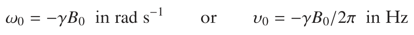

where γ is the gyromagnetic ratio. The precession frequency is the Larmor frequency which we encountered in section 3.3.2 on page 32. For a single spin, we saw that the allowed transition occurs at the Larmor frequency which is exactly the same as the frequency at which the magnetization vector precesses about the applied field; this is not a coincidence. The precession of the magnetization about the field is sometimes called Larmor precession.

For nuclei which have a positive gyromagnetic ratio the Larmor frequency is negative (see section 3.3.2 on page 32) which means that the precession of the magnetization vector about the field corresponds to a negative rotation. Recalling section 4.1.2 on page 49, a negative rotation about z is clockwise when viewed looking down the z-axis from +z to the origin; this is the sense of rotation shown in Fig. 4.5 on the preceding page.

The magnetization will only execute this precessional motion when it is at an angle to the magnetic field direction. So, at equilibrium, where the magnetization is along the z-axis and hence parallel to the field B0, the magnetization remains stationary.

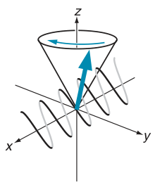

## 4.3 Detection

The precession of the magnetization vector is what we actually detect in a pulsed NMR experiment. All we have to do is to mount a small coil of wire round the sample, with the axis of the coil aligned in the xy-plane, as is illustrated in Fig. 4.6. As the precessing magnetization vector ‘cuts’ the coil a current is induced which we can amplify and then record – this is the free induction signal or, more usually, free induction decay (FID).

The detection process is analogous to the way in which an electric current can be produced by induction. You may recall a demonstration in which a bar magnet thrust into a coil of wire leads to the generation of a current in the wire. If the magnet is moved rhythmically in and out of the coil, or rotated inside the coil, the result is an oscillating current. The magnetization of the sample behaves just like a magnet, so as the vector precesses it leads to the generation of an oscillating current in the coil.

**Fig. 4.6** The precessing magnetization will cut a coil wound round the x-axis, thereby inducing a current in the coil. This current is amplified and then detected to give the free induction signal.

A coil wound round the x-axis detects the x-component of the magnetization, and we can work out what this will be using some simple geometry. Suppose that the equilibrium magnetization vector is of size M0. If this has been tilted through an angle β towards the x-axis, the x-component is M0 sin β, as shown in Fig. 4.7.

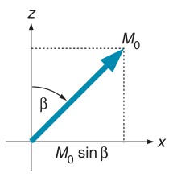

Although the magnetization vector precesses on a cone, we can visualize what happens to the x- and y-components much more simply by just thinking about the projection of the vector onto the xy-plane. At time zero the x-component of this vector is M0 sin β. Then, as the vector precesses at ω0 about the z-axis, this initial x-component rotates at the same frequency in the xy-plane.

This rotation of a vector is exactly of the type we discussed in section 2.5 on page 15. Here the vector is of length r = M0 sin β and starts out at time zero along the x-axis. The vector rotates at frequency ω0 so that at time t the angle through which the vector has rotated is ω0t. The x- and y-components are thus r cos ω0t and r sin ω0t, respectively, as is illustrated in Fig. 4.8 on the next page. The components of the magnetization, denoted

**Fig. 4.7** Tilting the magnetization through an angle β towards the x-axis gives an x-component of size M0 sin β.

**Fig. 4.8** At time zero the magnetization is positioned such that its x-component is M0 sin β and its y-component is zero. After time t, the angle through which the vector has rotated is ω0t, so the x- and y-components of the magnetization are M0 sin β cos ω0t and −M0 sin β sin ω0t, respectively. Plots of these components of the magnetization are given in the lower part of the figure; it is assumed that the Larmor frequency, ω0, is negative.

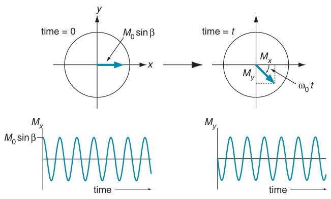

Mx and My, are given by

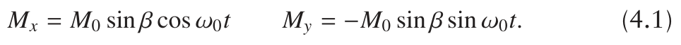

These are simply oscillations at the Larmor frequency and are plotted in Fig. 4.8. Fourier transformation of these signals gives us the familiar spectrum, which in this case is a single line at ω0. The details of how the Fourier transform works will be covered in Chapter 5.

## 4.4 Pulses

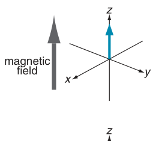

We now turn to the important question as to how we can rotate the magnetization away from its equilibrium position along the z-axis. Conceptually it is easy to see what we have to do. All that is required is to replace the magnetic field along the z-axis with one in the xy-plane (say along the x-axis), as shown in Fig. 4.9. The magnetization is now no longer aligned with the field, and so the magnetization will precess about the field. In this case the precession will be in the yz-plane which will bring the magnetization towards the transverse plane, which is what we require.

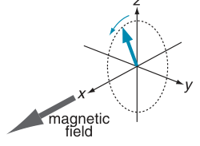

Unfortunately it is all but impossible to switch the magnetic field suddenly in this way. Remember that the main magnetic field is supplied by a powerful superconducting magnet, and there is no way that this can be switched off quickly. We will need to find another approach, and it turns out that the key is to use the idea of resonance.

The idea is to apply a very small magnetic field along the x-axis but – crucially – to make this field oscillate at or near the Larmor frequency; in other words, the oscillating field is resonant with the Larmor precession frequency. We will show that even though B0 is many times greater in size than the oscillating field, the latter can make the magnetization move away from the z-axis provided that the resonance condition is met.

**Fig. 4.9** If the magnetic field along the z-axis is replaced quickly by one along x, the magnetization rotates in the yz-plane as it executes a precessional motion about the field. As a result, the magnetization moves towards the transverse plane.

The coil used to detect the precessing magnetization (Fig. 4.6 on the preceding page) can also be used to generate the oscillating magnetic field. All we do is feed some RF power to the coil and the resulting oscillating current will create the required oscillating magnetic field along

**Fig. 4.10** Illustration of how two counter-rotating fields B+1 and B−1, shown in (a), add together to give a field which is oscillating along the x-axis, shown in (b). The graph shows how the field along x varies with time.

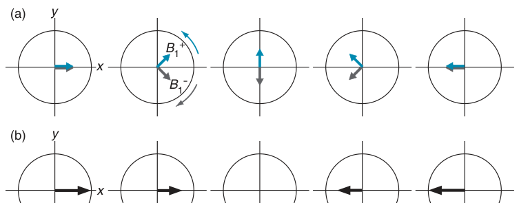

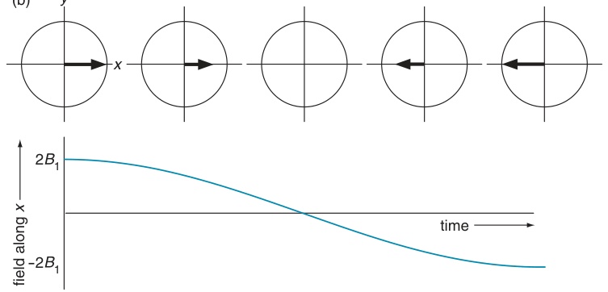

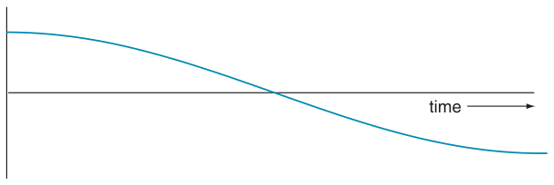

the x-direction. This field is called the radiofrequency or RF field. To understand how this weak RF field can rotate the magnetization we need to introduce the idea of the rotating frame.

### 4.4.1 Rotating frame

When RF power is applied to the coil wound along the x-axis, the result is a magnetic field which oscillates along the x-axis. What we mean by this is that the magnetic field starts out pointing along +x, gradually shrinks to zero and then increases along the −x direction. It then shrinks back to zero and finally increases back to its original value along +x. We will take the frequency of this oscillation to be ωtx (in rad s−1) and the size of the magnetic field to be 2B1; the reason for the 2 will become apparent later. ωtx is called the transmitter frequency for the reason that an RF transmitter is used to produce the power.

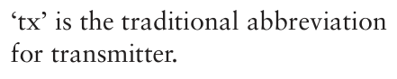

It turns out to be a lot easier to work out the effect of this oscillating field if we replace it, in our minds, with two counter-rotating fields, as is illustrated in Fig. 4.10. The two counter-rotating fields have the same magnitude B1. One, denoted B+1, rotates in the positive sense (from x to y) and the other, denoted B−1, rotates in the negative sense; both are rotating at the transmitter frequency ωtx.

At time zero, B+1 and B−1 are both aligned along the x-axis, and so add up to give a total field of 2B1 along x. As time proceeds, the vectors rotate away from the x-axis and in opposite directions. Since the two vectors have the same magnitude and are rotating at the same frequency, their y-components always cancel one another out. However, their x-components shrink towards zero as the angle through which the vectors have rotated approaches 90◦. Then, as the angle increases beyond this point, the x-components grow once more, but this time along the −x-axis, reaching a

**Fig. 4.11** The top row shows the motion of the field B−1 when viewed in a fixed axis system, or laboratory frame. The field is rotating at −ωtx i.e. in the negative sense, which is clockwise in this view. The bottom row shows the same field, but this time viewed in an axis system which is rotating at −ωtx about the z-axis; in this rotating frame, the field B−1 appears to be static.

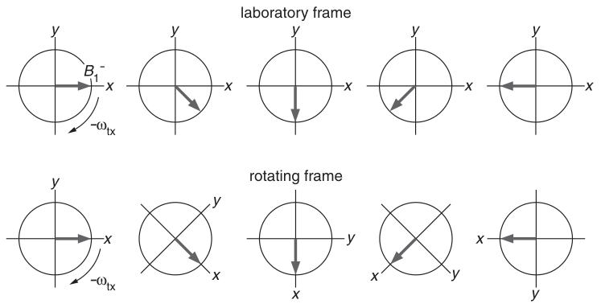

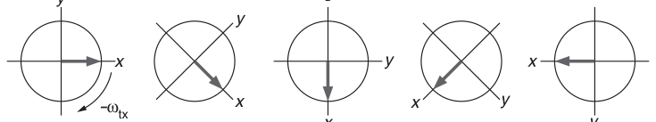

maximum when the angle of rotation is 180◦. B+1 and B−1 continue to rotate, causing the x-component to drop back to zero and rise again to a value 2B1 along the x-axis. Thus we see that the two counter-rotating fields add up to a field oscillating along x – that is a linearly oscillating field.

Suppose now that we think about a nucleus with a positive gyromagnetic ratio; recall that this means the Larmor frequency is negative so that the sense of precession is from x towards −y, which is the same direction as the rotation of B−1. It turns out that the other field, B+1, which is rotating in the opposite sense to the Larmor precession, has no significant interaction with the magnetization and so we will ignore it.

We now employ a ‘trick’ and move to a co-ordinate system which, rather than being static (the laboratory frame), is rotating about the z-axis in the same direction and at the same rate as B−1 (i.e. at −ωtx). As is shown in Fig. 4.11, in this rotating set of axes B−1 appears to be static and directed along the x-axis. This is a very nice result as, when viewed in this rotating frame, the RF field is neither oscillating nor rotating, but is simply stationary. Moving to the rotating frame has therefore removed the time dependence of the field, and this makes it much easier to work out the effect that the field has on the magnetization.

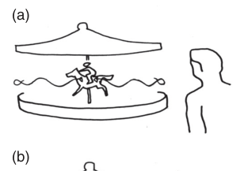

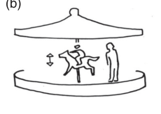

An analogy to help you understand how the rotating frame simplifies things by removing time dependence is shown in Fig. 4.12. In (a) the anxious parent is watching their child riding on a merry-go-round (or carousel). The child’s motion is rather complicated: not only is the horse going round and round, but it is also going up and down.

In (b) the parent is standing on the carousel, and so is going around with the child – in other words the parent has entered a rotating frame going at the same speed as the merry-go-round. Now, from the point of view of the parent, the child is just executing a simple up–down motion. Thus by moving to an appropriate frame of reference, the description of a complex motion is simplified.

**Fig. 4.12** An analogy for the rotating frame. In (a) a child riding on a merry-go-round executes a rather complex motion as seen by a fixed observer. However, if the observer joins the child on the merry-go-round, as in (b), the child appears to be executing a simple up–down motion.

It is important to realize that the purpose of the rotating frame is to remove the time dependence of the RF field, B−1. In the laboratory frame this field is rotating about the z-axis at −ωtx, but in a rotating frame also moving at −ωtx, B−1 appears to be stationary. This is the only choice of rotating frame frequency which will make B−1 stationary. The magnetic field due to the applied RF is often called ‘the radiofrequency field’ or ‘the B1 field’.

We will use the rotating frame to help us work out what effect the RF field has on the magnetization, but before we do this we need to consider how the Larmor precession is affected by viewing things in the rotating frame.

### 4.4.2 Larmor precession in the rotating frame

Suppose that we choose the rotating frame such that it rotates at the same frequency and in the same sense as the Larmor precession. Viewed in this frame, the magnetization will appear to be stationary i.e. the apparent Larmor frequency is zero. Of course the precession has not really stopped, it is just that we are viewing it differently.

More generally, if the rotating frame frequency is ωrot. frame, the apparent frequency of the Larmor precession in such a frame will be (ω0 − ωrot. frame). This difference frequency is called the offset, and is given the symbol Ω:

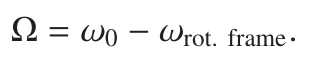

The frequency ω at which magnetization precesses around a magnetic field B is given by

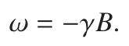

Another way of looking at this relationship is to say that if we know the precessional frequency we can work out the magnetic field B using B = −ω/γ. Following this line of argument we can say that if in the rotating frame the precessional frequency appears to be Ω, then the apparent magnetic field ΔB is given by

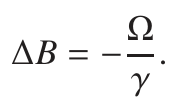

ΔB is called the reduced field in the rotating frame. Clearly if the offset is zero, then so too is the reduced field.

The important conclusion from this section is that, when viewed in the rotating frame, the apparent magnetic field along the z-axis (the reduced field) can be much smaller than the applied magnetic field, B0. Indeed, if the rotating frame is at the Larmor frequency, the apparent field is zero. When the reduced field becomes comparable with the B1 field, the latter can start to influence the motion of the magnetization even though it is very much smaller than the applied field B0. To understand the details of how this works we need to introduce the concept of the effective field.

### 4.4.3 The effective field

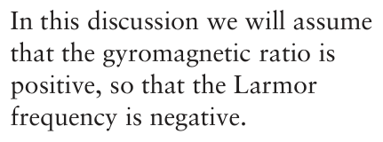

From the discussion so far we can see that when RF power is applied there are two magnetic fields in the rotating frame. First, there is the RF field which, provided we choose ωrot. frame = −ωtx, gives rise to a static field B1 along the x-axis.

Secondly, there is the reduced field, ΔB, given by (−Ω/γ). Since

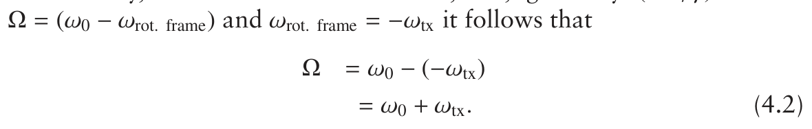

This looks rather strange, but recall that ω0 is negative, so if the transmitter frequency and the Larmor frequency are comparable in magnitude, the offset will be small.

In the rotating frame, the reduced field (which is along z) and the B1 field (which is along x) add vectorially to give an effective field Beff as illustrated in Fig. 4.13. The size of this effective field is given by simple geometry as:

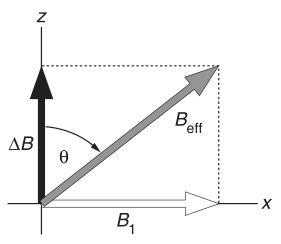

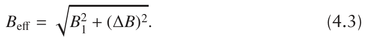

The crucial point is that the magnetization precesses around the effective field, just as in the laboratory frame the Larmor precession takes place around the B0 field. As usual, the precessional frequency about the effective field ωeff is proportional to the field:

**Fig. 4.13** In the rotating frame the effective field Beff is the vector sum of the reduced field ΔB and the B1 field. The tilt angle, θ, is defined as the angle between Beff and ΔB.

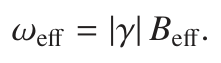

The vertical lines (| |) indicate that we should take the absolute value of the quantity they enclose i.e. ignore the sign. Thus, regardless of the sign of γ, ωeff is always positive.

If the offset is small the effective field will lie close to the x-axis, and so the equilibrium magnetization will be rotated away from the z-axis, which is exactly what we want to achieve. The key point is that, although B0 is very much larger than B1, we can eliminate the effect of the B0 field by setting the transmitter frequency close to the Larmor frequency i.e. by making the offset small. With this condition the reduced field ΔB is small and it is then possible for the small B1 field to begin to exert an influence. In the limit that the offset is zero, ΔB disappears and the B1 field is the only one left in the rotating frame.

The angle between ΔB and Beff is called the tilt angle and is usually given the symbol θ. From Figure 4.13 we can see that:

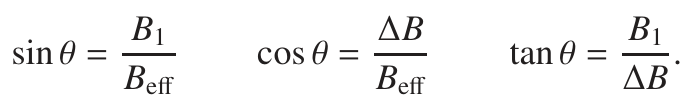

All three definitions are equivalent. When the offset is zero, θ = π/2; when the offset is large, θ approaches zero or π, depending on the sign of the offset and hence of ΔB.

### 4.4.4 The effective field in frequency units

For practical purposes the thing that is important is the precession frequency about the effective field, ωeff. It is therefore convenient to think about the construction of the effective field not in terms of magnetic fields, but in terms of the precession frequencies that they cause.

For each field the precession frequency is proportional to the magnetic field with the constant of proportion being γ, the gyromagnetic ratio. For example, we have already seen that in the rotating frame the apparent Larmor precession frequency, Ω, depends on the reduced field:

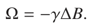

We define ω1 as the precessional frequency about the B1 field (note that the absolute value of γ is taken, so ω1 is always positive):

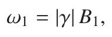

and we already have

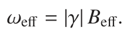

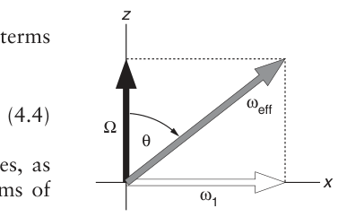

Using these definitions, Eq. 4.3 on the facing page can be rewritten in terms of frequencies to give the following expression for ωeff

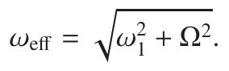

Figure 4.13 on the preceding page can be relabelled with frequencies, as shown in Fig. 4.14, and the tilt angle can also be expressed in terms of frequencies:

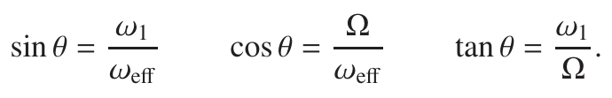

**Fig. 4.14** The effective field can be thought of in terms of frequencies instead of the fields used in Fig. 4.13.

### 4.4.5 Summary

This has been rather a long and involved section which has introduced many new ideas, so it is well to end by summarizing the key points.

- RF power is supplied to a small coil wound round the sample in such

a way that the oscillating current in the coil creates an oscillating transverse magnetic field e.g. along the x-axis.

- This linearly oscillating field can be decomposed into two counter-

rotating fields. Only the field which is rotating in the same sense as the Larmor precession need be considered.

- The rotating field can be made static by moving to an appropriate rotating frame.

- In the rotating frame, the Larmor precession is modified; we interpret

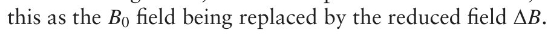

- The magnetization rotates about the effective field which is a vector sum of the RF field B1 and the reduced field.

- The effective field will lie close to the x-axis if the offset is small i.e. the transmitter frequency is close to the Larmor frequency.

## 4.5 On-resonance pulses

The simplest case to deal with is when the transmitter frequency is exactly the same as the Larmor frequency – called an on-resonance pulse. Under these circumstances the offset Ω is zero and so, referring to Fig. 4.14, we see that the effective field lies along the x-axis and is of size ω1. The tilt angle θ of the effective field is π/2 or 90◦.

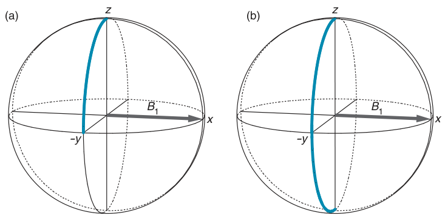

**Fig. 4.15** Three-dimensional representations of the motion of the magnetization vector during an on-resonance pulse. The thick blue line is the path followed by the tip of the vector, which is assumed to start on the +z-axis. The effective field, shown by the grey arrow, is the same as the B1 field and lies along the x-axis; the magnetization therefore precesses in the yz-plane. The rotation is in the positive sense about x, so the magnetization moves toward the −y-axis. In (a) the flip angle is 90◦ and so the magnetization ends up along −y; in (b) the pulse flip angle is 180◦ which places the magnetization along −z.

For an on-resonance pulse the motion of the equilibrium magnetization vector is very simple; all that happens is that it is rotated from the z-axis and in the yz-plane, just as shown in Fig. 4.9 on page 52. The precession frequency is ω1 and so if the RF field is applied for a time tp, the angle β through which the magnetization has been rotated will be given by

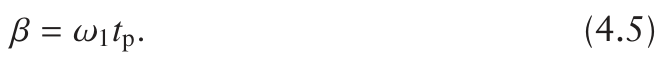

β is called the flip angle of the pulse. By altering the time for which the RF is applied we can alter the angle through which the magnetization is rotated.

The most commonly used flip angles are π/2 (90◦) and π (180◦), and the motion of the magnetization vector during such on-resonance pulses is shown in Fig. 4.15. The 90◦ pulse rotates the magnetization from the equilibrium position to the −y-axis. The magnetization ends up along −y because the rotation is in a positive sense about the x-axis. Imagine grasping the x-axis with your right hand and with the thumb pointing along the +x-direction; your fingers then curl in the sense of a positive rotation,

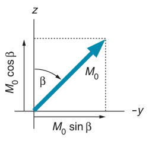

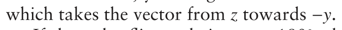

If the pulse flip angle is set to 180◦, the magnetization is taken all the way from +z to −z; this is called an inversion pulse. In general, for a flip angle β simple geometry, illustrated in Fig. 4.16, tells us that the z- and y-components are

**Fig. 4.16** If an on-resonance pulse of flip angle β is applied to equilibrium magnetization we can use simple geometry to work out the resulting y- and z-components.

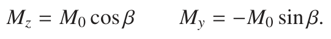

For the pulses we have been describing so far the RF (B1) field is aligned along the x-axis, so such a pulse is properly described as ‘an x pulse’ or ‘a pulse about x’; this is often written 90◦x or 90◦(x). Later on, in section 4.10 on page 66, we will describe the effects of pulses about other axes. Generally the convention in NMR is that, unless otherwise specified, a pulse is assumed to be about the x-axis. However, to start with we will specify the phase of all of the pulses in order to avoid confusion.

### 4.5.1 Hard pulses

In practical NMR spectroscopy we usually have several resonances in the spectrum, each of which has a different Larmor frequency; we cannot therefore be on-resonance with all of the lines in the spectrum. However, it is possible to make the RF (B1) field strength sufficiently large that for a range of resonances the effective field lies very close to the x-axis. Then, to all intents and purposes, the magnetization behaves as if the pulse is on resonance.

This is best illustrated using an example. Suppose that we have a proton spectrum covering a range of about 10 ppm, and that we place the transmitter frequency in the middle of the spectrum. The largest possible offset is 5 ppm which, at a Larmor frequency of 500 MHz, translates to an

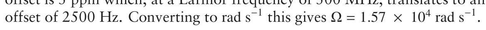

A typical value for the length of a 90◦ pulse might be about 12 μs, and from this we can work out the field strength, ω1, since this is related to the flip angle according to Eq. 4.5 on the facing page

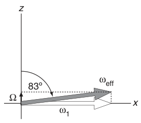

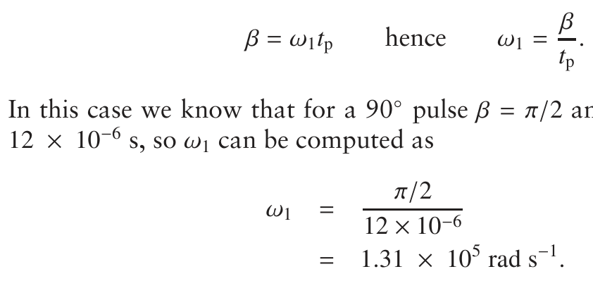

In this case we know that for a 90◦ pulse β = π/2 and the duration, tp, is

**Fig. 4.17** Illustration of the position of the effective field for the example given in the text where the offset is 2500 Hz and the field strength corresponds to a 90◦ pulse of duration 12 μs. These conditions result in the RF field strength ω1 being much greater than the offset Ω, and so the tilt angle is close to 90◦. To all intents and purposes we can assume that the pulse is in fact on resonance, with the effective field lying along the x-axis and of strength ω1.

The tangent of tilt angle is therefore computed as

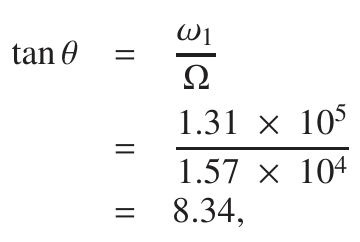

which corresponds to a tilt angle of 83◦, as illustrated in Fig. 4.17. We can use Eq. 4.4 on page 57 to calculate ωeff as 1.32 × 105 rad s−1; as expected, this value is very close to ω1 as ω1 >> Ω.

Recall that for an on-resonance pulse the tilt angle is 90◦. What we have shown in this example is that for a peak at the edge of the spectrum the tilt angle is within a few degrees of that for an on-resonance pulse and so, to a good approximation, we can assume that the magnetization vector will behave as it does for an on-resonance pulse. Such a pulse is called a hard pulse or a non-selective pulse.

In summary, the condition for a hard pulse is that the RF field strength, ω1, must be much greater than the offset, Ω:

We need the modulus signs as the offset might be negative. If this condition holds, the effective field is the same as ω1 and, like ω1, lies along the x-axis.

A spectrometer is designed to have sufficient RF power to create hard pulses over the normal range of shifts of a given nucleus. As the main magnetic field B0 becomes greater, the range of possible offsets increases (recall that these scale with the field), and so for a pulse to be considered ‘hard’ the B1 field must be proportionately stronger i.e. more RF power is needed.

## 4.6 Detection in the rotating frame

It was explained in section 2.1.3 on page 8 that, due to the way most NMR spectrometers are constructed, the frequencies of the lines in the spectrum are measured relative to the receiver reference frequency. The commonest arrangement is to make the receiver reference frequency the same as the transmitter frequency. Recall that we also need to make the rotating frame frequency equal to the transmitter frequency in order to make the B1 field static. If the transmitter, rotating frame and receiver reference frequencies are all the same then the offset frequency described in section 2.1.3 on page 8 and the offset defined in Eq. 4.2 on page 55 will have the same value.

Consider a peak which is 100 Hz from the transmitter frequency, and hence 100 Hz from the receiver reference frequency. In a rotating frame at the transmitter frequency, the magnetization vector from this peak will precess at 100 Hz. One way of looking at this is to say that we are detecting the precession of the magnetization in the rotating frame. So, instead of the detected signal oscillating at the Larmor frequency, the oscillation is at 100 Hz – that is the offset frequency.

From now on we will make the assumption that the receiver reference and transmitter frequencies are the same, and that we are detecting the signal in the rotating frame. With these assumptions the x- and y-magnetizations given in Eq. 4.1 on page 52 are rewritten

where Ω is the offset.

**Fig. 4.18** Timing diagram or pulse sequence for the simple pulse–acquire experiment. The line marked ‘RF’ shows the location of the radiofrequency pulses, and the line marked ‘acq’ shows when the signal is recorded or acquired. The pulse sequence can be divided up into three periods, as shown on the lower line.

## 4.7 The basic pulse–acquire experiment

At last we are in a position to understand how the simple pulse–acquire NMR experiment, introduced in section 2.4 on page 13, actually works. The timing diagram – or pulse sequence as it is usually known – is shown in Fig. 4.18.

The pulse sequence can be divided up into three periods, as shown in the diagram; we will assume that the RF pulse is ‘hard’. During

**Fig. 4.19** Evolution of the magnetization during the acquisition time (period 3) of the pulse–acquire experiment; the xy-plane of the rotating frame is shown. The magnetization starts out along −y and evolves at the offset frequency Ω (here assumed to be positive). The resulting x- and y-magnetizations are shown in the graphs in the lower part of the figure.

period 1 equilibrium magnetization builds up along the z-axis. As was described in section 4.5 on page 57, during period 2 the 90◦(x) pulse rotates this magnetization onto the −y-axis. During period 3 the magnetization precesses in the transverse plane at the offset Ω, as is illustrated in Fig. 4.19.

Some simple geometry, shown in Fig. 4.20, enables us to deduce how the x- and y-magnetizations vary with time. The offset is Ω, so after time t the vector has precessed through an angle Ωt; the x- and y-components are thus proportional to the sine and cosine of this angle:

As we commented on before, Fourier transformation of the detected signals arising from these magnetizations will give a spectrum, with a peak appearing at frequency Ω.

**Fig. 4.20** After a 90◦(x) pulse the magnetization starts out along the −y-axis. It then rotates through an angle Ωt during time t; the x-component is proportional to sin Ωt and the y-component to cos Ωt.

### 4.7.1 Spectrum with several lines

If the spectrum has more than one line, then we can associate a separate magnetization vector with each. If the pulse is hard, then each vector will be rotated into the transverse plane, and then they will precess at their individual offsets. The detected signal will be the sum of contributions from each vector; for example the y-component will be

where M0,1 is the equilibrium magnetization associated with the first line, Ω1 is its offset, and so on for the other lines. Fourier transformation of the resulting detected signal will produce a spectrum with lines at Ω1, Ω2 etc.

## 4.8 Pulse calibration

It is crucial that the pulses we use in NMR experiments have the correct flip angles. For example, to obtain the maximum intensity in the pulse–acquire experiment we must use a 90◦ pulse, and if we wish to invert magnetization we must use a 180◦ pulse – other flip angles will simply not give the required result. Pulse calibration is therefore an important preliminary to

**Fig. 4.21** Illustration of how pulse calibration is achieved using a pulse–acquire experiment in which the flip angle of the pulse, β, is varied. In such an experiment, the signal intensity is proportional to sin β, as shown by the graph. Along the top are the spectra which would be expected for various different flip angles (indicated by the dashed lines). The signal is a maximum for a flip angle of 90◦, goes through a null at 180◦, and after that goes negative. Pulse calibration is achieved by increasing the duration of the pulse until the signal goes through a null; this time corresponds to a 180◦ pulse.

any experiment and is usually carried out using a modified pulse–acquire experiment.

We have already shown that, for a hard or on-resonance pulse applied to equilibrium magnetization, the y-component of magnetization after a pulse of flip angle β is proportional to sin β (Fig. 4.16 on page 58). Recalling that it is this transverse magnetization which is detected, it follows that the intensity of the signal in a pulse–acquire experiment will vary as sin β. A typical outcome of such an experiment in which the pulse flip angle is varied is shown in Fig. 4.21.

The normal practice is to increase the flip angle of the pulse (by increasing its length) until a null is found; the flip angle is then 180◦. There is a maximum in the signal when the flip angle is 90◦, but the maximum is broad and hence rather difficult to locate precisely. In contrast, the null at 180◦ is sharper and easier to locate.

Once the duration of a 180◦ pulse is found, simply halving the time gives a 90◦ pulse. The pulse length for other flip angles can be found by simple proportion.

Suppose that the 180◦ pulse was found to be of duration t180. Since the

where we have remembered to write the flip angle β in radians. Using this expression, we can determine ω1, the RF field strength, from the duration of a pulse of known flip angle.

Sometimes we want to quote the field strength not in rad s−1 but in Hz, in which case all we need to do is divide the above result by 2π:

For example, let us suppose that we found a null in the signal at a pulse length of 15.5 μs. The RF field strength is therefore given by

In frequency units the calculation is

This result is often expressed in words by saying ‘the B1 field is 32.3 kHz’. At first sight this is rather a strange thing to say, as surely B1 is a magnetic field, not a frequency. When we specify the B1 field in Hz, what we are in fact doing is giving the frequency at which the magnetization will precess about the field. In practice, this is a more useful thing to know than the size of the field in Tesla.

## 4.9 The spin echo

We are now able to analyse the most famous pulsed NMR experiment, the spin echo, which is a component of a very large number of more complex experiments. The pulse sequence is shown in Fig. 4.22.

**Fig. 4.22** Pulse sequence for the spin echo experiment. The 180◦ pulse (indicated by an open rectangle as opposed to the closed one for a 90◦ pulse) is in the centre of a delay of duration 2τ, thus separating the sequence into two equal periods, τ. The signal is not acquired until after the second delay τ, or put another way, until 2τ after the beginning of the sequence. The durations of the pulses are in practice very much shorter than the delays τ, but for clarity the length of the pulses has been exaggerated.

The special thing about the spin echo sequence is that, at the end of the second τ delay, the magnetization ends up along the same axis, regardless of the length of τ or the size of the offset Ω. We describe this outcome by saying that ‘the offset has been refocused’, meaning that at the end of the sequence it is just as if the magnetization has not evolved at all i.e. as if the offset is zero.

### 4.9.1 180◦ pulses as refocusing pulses

To understand how the spin echo sequence works we first need to understand the effect of the 180◦ pulse when it is applied to transverse magnetization. Figure 4.23 on the following page shows the effect of a 180◦(x) pulse on three magnetization vectors at different positions in the transverse plane. We see that each vector is carried through a different arc but all end up in mirror image positions with respect to the xz-plane.

**Fig. 4.23** Illustration of the effect of a 180◦(x) pulse on three vectors (coloured in different shades of blue) which start out at different angles from the −y-axis. All three are rotated by 180◦ about the x-axis on the trajectories indicated by the thick lines which dip into the southern hemisphere. After the pulse, the vectors end up in mirror image positions with respect to the xz-plane.

A second view of what is going on is given in Fig. 4.24. The diagram describes the fate of a magnetization vector which has precessed away from the −y-axis through an angle φ i.e. it has acquired a phase φ. To work out the effect of the 180◦ pulse it is convenient first to resolve the magnetization vector into its components along the x- and y-axes, as is shown in the diagram.

The x-component is unaffected by the 180◦(x) pulse as this component is aligned along the same axis as the B1 field. The y-component is simply rotated to the opposite axis, in this case from −y to +y. This is analogous to a 180◦ pulse rotating the equilibrium magnetization from the +z-axis to

**Fig. 4.24** Illustration of the effect of a 180◦(x) pulse on a magnetization vector in the transverse plane; the initial position of the vector is described by a phase angle φ, measured from the −y-axis. The effect of the pulse is best visualized by resolving the vector into its x- and y-components. As the former is aligned with the B1 field, it is unaffected by the pulse; the y-component is simply reversed in direction. The final position of the vector is found by recombining the x- and y-components. We see that the vector ends up in a mirror image position with respect to the xz-plane, with a phase angle (π − φ) radians, measured from the −y-axis.

**Fig. 4.25** Illustration of how the spin echo refocuses the evolution of the offset. The sequence starts with a 90◦(x) pulse (not shown) which places the magnetization along −y. The upper part of the figure shows the position of the magnetization vector at various times; note how the 180◦(x) pulse moves the magnetization to a mirror image position with respect to the xz-plane. The bottom of the diagram shows a graph of how the phase accrued by the magnetization vector (measured from its starting position on the −y-axis) varies throughout the sequence. The 180◦ pulse causes a discontinuity in the phase, changing its value from Ωτ to (π − Ωτ). The evolution of the phase for two different offsets is shown by the blue and dark grey lines. Regardless of the offset or the delay τ, the magnetization ends along the y-axis with a phase of π.

When the two components are recombined to give the final position of the vector, we find that it has been moved to a mirror image position with respect to the xz-plane. Expressed in terms of the phase angle, the effect of the 180◦(x) pulse is to move the vector from a position described by a

### 4.9.2 How the spin echo works

Figure 4.25 illustrates the motion of a typical magnetization vector during the spin echo. The diagram commences after the initial 90◦(x) pulse has placed the magnetization along −y, and the position of the magnetization vector at selected times is shown. In addition, there is a graph giving the phase φ which the magnetization vector acquires as the sequence proceeds. This phase is measured anti-clockwise from the starting position of the vector on the −y-axis.

During the first delay τ the vector precesses from −y towards the x-axis (we are assuming that the offset is positive). The angle through which the vector rotates is simply Ωτ, which is therefore its phase.

As has already been explained, the effect of the 180◦(x) pulse is to move the vector to a mirror image position with respect to the xz-plane. So, after the 180◦ pulse the vector is at an angle Ωτ to the y-axis rather than being at Ωτ to the −y-axis. Measured from the −y-axis, the phase is now (π − Ωτ).

During the second delay τ the vector continues to evolve and will once again rotate through an angle of Ωτ; the additional phase acquired is

**Fig. 4.26** Three-dimensional representations of the effect on equilibrium magnetization of (a) a 90◦ pulse about the y-axis and (b) a 90◦ pulse about the −x-axis. The magnetization starts from the +z-axis and the path followed by the tip of the magnetization vector is shown by the blue line. The pulses are assumed to be on resonance (or hard), with the B1 fields in the positions shown.

thus Ωτ. Just after the 180◦ pulse the phase is (π − Ωτ), and adding to this the phase Ωτ acquired during the second delay τ gives us the phase at the end of the sequence as (π − Ωτ) + Ωτ = π i.e. the magnetization vector is aligned along the y-axis.

Clearly, the final position of the vector is independent of the offset Ω and the delay τ. This is the special feature of a spin echo and why it is described as refocusing the offset. The refocusing comes about because first the phase acquired during the two τ delays is the same, and secondly the intervention of the 180◦ pulse between them causes the phases to cancel one another out.

The 180◦ pulse is called a refocusing pulse because it causes the evolution during the first delay τ to be undone by the second delay. It is interesting to note that the spin echo sequence gives exactly the same result as the sequence 90◦(x) – 180◦(x) with the delays omitted.

Figure 4.25 on the previous page also shows the phase throughout the sequence. Note that there is a discontinuity when the 180◦ pulse is applied since at this point the phase changes from Ωτ to (π − Ωτ). If the offset is smaller the phase evolution is different, as shown by the dark grey line, but the phase at the very end of the sequence is still π.

## 4.10 Pulses of different phases

So far we have only allowed the RF (B1) field to be along the x-axis, but the field can just as well be in any direction in the transverse plane. Commonly, pulses with the field aligned along the four cardinal directions are used i.e. x, y, −x and −y. For example, a pulse with the field along the y-axis is referred to as ‘a y pulse’ or a ‘pulse about y’. A y pulse is sometimes called a pulse ‘phase shifted by 90◦’, indicating that it is about an axis shifted by 90◦ from the x-axis (which is taken as the reference point). Thus a 90◦ pulse about the −y-axis, written 90◦(−y), can be described as a pulse phase shifted by 270◦.

If we apply a 90◦ pulse about the y-axis to equilibrium magnetization we find that the vector rotates in the xz-plane such that the magnetization ends up along the x-axis, as is illustrated in Fig. 4.26 (a). As before, we

**Fig. 4.27** Three-dimensional representation showing the path followed during an x pulse for various different resonance offsets. The duration is chosen so that, on resonance, the flip angle is 90◦; the blue lines show the path followed by the tip of the magnetization vector which is assumed to start on +z. Path a is for the on-resonance case; the effective field lies along x and is indicated by the dashed line A. Path b is for the case where the offset is half the RF field strength (Ω = ω1/2); the effective field is marked B. Paths c and d are for offsets equal to and 1.5 times the RF field strength, respectively; the effective field directions are labelled C and D.

can determine the effect of such a pulse by thinking of it as a positive rotation about the y-axis. A 90◦ pulse about −x rotates the equilibrium magnetization to the y-axis, as is shown in Fig. 4.26 (b) on the preceding page.

As we described in section 4.9.1 on page 63, a 180◦(x) pulse causes the vectors to move to mirror image positions with respect to the xz-plane. In a similar way, a 180◦(y) pulse causes the vectors to move to mirror image positions with respect to the yz-plane. Finally, it is interesting to note that a 180◦ pulse about any axis in the transverse plane will rotate magnetization

## 4.11 Off-resonance effects and soft pulses

⇐ Optional section

So far we have only dealt with the case where the pulse is either on resonance or where the RF field strength is large compared with the offset (a hard pulse, section 4.5.1 on page 59), which is in effect the same situation. We now turn to the case where the offset Ω is comparable in size with the RF field strength ω1. The consequences of this are sometimes a problem to us, but they can also be turned to our advantage for selective excitation.

Referring to Fig. 4.14 on page 57, we see that as the offset becomes comparable with the RF field strength, the effective field begins to move up from the x-axis towards the z-axis (assuming that the offset is positive). As a consequence, rather than the equilibrium magnetization simply being rotated in the yz-plane from z to −y, the magnetization follows a more complex curved path. A series of such paths for increasing offsets are

**Fig. 4.28** Plots of the magnetization produced by a 90◦(x) pulse to equilibrium magnetization (assumed to be of size 1) as a function of the offset; the pulse length has been adjusted so that on resonance the flip angle is 90◦. The horizontal axes of the plots are the offset Ω expressed as a ratio of the RF field strength ω1. Plots (a), (b) and (c) are, respectively, the x-magnetization, y-magnetization, and the absolute value of the transverse magnetization.

shown in Fig. 4.27 on the previous page. In this figure the duration of the pulse has been set so that the flip angle is 90◦ on resonance.

There are two things to note from this diagram. First, although on resonance the magnetization vector ends up along −y, for the off-resonance case the vectors stop short of the transverse plane. This means that the signal we would observe after such a pulse will be weaker than for the on-resonance case, simply because less transverse magnetization has been generated.

The second thing to note is that, whereas the on-resonance pulse produces only y-magnetization, the off-resonance pulses also produce some x-magnetization. We will see later on in section 5.3.4 on page 88 that this leads to phase errors in the spectrum.

In the limit that the offset becomes very much larger than the RF field strength, the effective field lies very close to the z-axis, and so the pulse is incapable of rotating the equilibrium magnetization away from the z-axis. Such a pulse is so far off resonance that it has no effect. For example, pulses applied to 13C have no effect on protons as the resonance offset of any protons would be tens if not hundreds of MHz from the 13C transmitter frequency. For typical RF field strengths of the order of kHz, it therefore follows that proton resonances will not be affected by pulses to 13C.

We can see more clearly what is going on if we plot the x- and y-magnetizations, produced by a nominal 90◦(x) pulse applied to equilibrium magnetization, as a function of the offset; these graphs are shown in Fig. 4.28. In (a) we see the y-magnetization and, as expected, on resonance the equilibrium magnetization ends up entirely along −y. However, as the offset increases the amount of y-magnetization generally decreases but there is an oscillation imposed on this overall decrease. At some offsets the magnetization is zero and at others it is positive. The plot of the x-magnetization, (b), shows a similar story with the magnetization generally falling off as the offset increases, but again with a strong oscillation.

Plot (c) is of the magnitude of the magnetization, which is given by

**Fig. 4.29** Visualization of the selective excitation of just one line in the spectrum. At the top is shown the spectrum that would be excited using a hard pulse. If the transmitter is placed on resonance with one line and the strength of the RF field reduced, then the pattern of excitation we expect is as shown in the middle (see the plot of Mabs in Fig. 4.28 on the preceding page). As a result, the peaks at non-zero offsets are attenuated and the spectrum which is excited will be as shown at the bottom.

This gives the total transverse magnetization in any direction, and it is, of course, always positive. We see from this plot the characteristic nulls and subsidiary maxima in the amount of magnetization as the offset increases.

What plot (c) tells us is that although a pulse can excite magnetization over a wide range of offsets, the region over which it does so efficiently is really rather small. If we want at least 90% of the magnetization to be rotated to the transverse plane (i.e. Mabs ≥ 0.9), the offset must be less than about 1.6 times the RF field strength.

### 4.11.1 Excitation of a range of shifts

There are some immediate practical consequences of these off-resonance effects for RF pulses. Suppose that we are trying to record the full range of 13C shifts (200 ppm) on a spectrometer whose magnetic field gives a proton Larmor frequency of 800 MHz and hence a 13C Larmor frequency of 200 MHz. If we place the transmitter frequency at 100 ppm, the maximum offset that a peak can have is 100 ppm which, at this Larmor frequency, translates to 20 kHz. According to our criterion above, if we are willing to accept a reduction to 90% of the full intensity at the edges of the spectrum we would need an RF field strength of 20/1.6 ≈ 12.5 kHz. This corresponds to a 90◦ pulse width of 20 μs. If the spectrometer has insufficient power to produce this pulse width, the excitation at the edges of the spectrum will fall below the 90% mark.

### 4.11.2 Selective excitation

Sometimes we want to excite just a portion of the spectrum, for example a single line or just the lines of one multiplet. We can achieve this by putting the transmitter on resonance with the line we want to excite (or in the middle of the multiplet), and then reducing the RF field strength until the degree of excitation of the rest of the spectrum is sufficiently small. At the same time as the RF field strength is reduced, the duration of the pulse will have to be increased in order to maintain the flip angle at 90◦. The whole process is visualized in Fig. 4.29 on the preceding page.

Pulses which are designed to affect only part of the spectrum are called selective pulses or soft pulses (as opposed to non-selective or hard pulses). The level to which we need to reduce the RF field depends on the separation between the peak we want to excite and those peaks we do not want to excite. The closer the unwanted peaks are, the weaker the RF field must be made and hence the longer the 90◦ pulse. In practice, a balance has to be made between making the pulse too long (and hence losing signal due to relaxation) and allowing a small amount of excitation of the unwanted signals.

Figure 4.29 on the previous page does not portray one problem with this approach, which is that for peaks away from the transmitter a mixture of x- and y-magnetization is generated (as shown in Fig. 4.28 on page 68). The second problem that the figure does show is that the excitation falls off rather slowly and ‘bounces’ through a series of maxima and nulls, which are sometimes called ‘wiggles’. We might be lucky and have an unwanted peak fall on a null, or unlucky and have an unwanted peak fall on a maximum.

Much effort has been put into getting round both of these problems. The key feature of all of the successful solutions is to ‘shape’ the envelope of the RF pulse i.e. not just switch it on and off abruptly, but with a smooth variation. Such pulses are called shaped pulses. The simplest of these are basically bell-shaped (like a gaussian function, for example). These suppress the wiggles at large offsets and give just a smooth decay, but they do not improve the phase properties. To attack this part of the problem requires an altogether more sophisticated approach (see Further reading).

### 4.11.3 Selective inversion

Sometimes we want to invert the magnetization associated with just one resonance while leaving all the others in the spectrum unaffected; such a pulse would be called a selective inversion pulse. Just as for selective excitation, all we need to do is to place the transmitter on resonance with the line we wish to invert, and reduce the RF field strength until the other resonances in the spectrum are not affected significantly. Of course we will need to lengthen the pulse so that the on-resonance flip angle is maintained.

Figure 4.30 on the next page shows the z-magnetization generated as a function of offset for such an inversion pulse. Compared with the behaviour of a 90◦ excitation pulse (Fig. 4.28 on page 68), we see that the range over which there is significant inversion is somewhat smaller and that the off-resonance oscillations are smaller in amplitude.

This observation has two consequences: one ‘good’ and one ‘bad’. The good consequence is that a selective 180◦ pulse is, for a given field strength, more selective than a corresponding 90◦ pulse. In particular, the weaker off-resonance wiggles are a useful feature. The bad consequence is that, when it comes to hard 180◦ pulses, the range of offsets over which there is anything like complete inversion is much more limited than the range of offsets over which a 90◦ pulse gives significant excitation, something which can be seen by comparing Fig. 4.30 with Fig. 4.28 on page 68. Thus, 180◦ pulses are often the source of problems in spectra with large offset ranges.

**Fig. 4.30** Plots of the z-magnetization produced by a pulse applied to equilibrium magnetization as a function of the offset; the flip angle on resonance has been set to 180◦. Plot (b) covers a narrower range of offsets than plot (a). Comparing these plots with those of Fig. 4.28 on page 68, we see that both show characteristic wiggles as we go off resonance; however, the range of offsets over which inversion is 90% complete is much less than that over which 90% excitation is achieved.

## 4.12 Moving on

Several times now we have referred to the fact that a Fourier transform can be used to turn the measured FID into a spectrum. The next chapter explores this process in more detail and, along the way, introduces some of the useful manipulations which we can subject the FID to before Fourier transforming it. We will also explore in more detail how phase errors manifest themselves in spectra.

## 4.13 Further reading

The origins of microscopic and macroscopic nuclear magnetism:

Chapter 2 from M. H. Levitt, Spin Dynamics (2nd edition, John Wiley

& Sons, Ltd, 2008).

The vector model, spin echoes and selective pulses:

Chapters 2, 4 and 5 from R. Freeman, Spin Choreography (Spektrum, 1997).

Shaped selective pulses:

R. Freeman, Progress in Nuclear Magnetic Resonance Spectroscopy, 32, 59–106 (1998).

## 4.14 Exercises

4.1 A particular spectrometer has a B0 field which gives a Larmor frequency of 600 MHz for 1H; the RF field strength, ω1/(2π), has been determined to be 25 kHz. Suppose that the transmitter is placed at 5 ppm. Compute the offset (in Hz) of a peak at 10 ppm, and hence compute the tilt angle of the effective field, θ, for a spin with this offset. Is this 25 kHz field sufficiently strong to give hard pulses over the full range of 1H chemical shifts? Repeat the calculation for a Larmor frequency of 900 MHz and comment on your result.

4.2 Explain why it is that the maximum signal in a pulse–acquire experiment is seen when the flip angle of the pulse is 90◦. What would you expect to see in such an experiment if the flip angle of the pulse were set to: (a) 180◦; (b) 270◦?

4.3 In an experiment to determine the pulse length, an operator observed a positive signal for pulse widths of 5 and 10 μs; as the pulse was lengthened further the intensity decreased going through a null at 20.5 μs and then becomes negative. Explain what is happening in this experiment and use the data to determine the RF field strength in Hz and in rad s−1, and the length of a 90◦ pulse. A further null in the signal was seen at 41.0 μs; to what do you attribute this?

4.4 Using an approach similar to that of Fig. 4.24 on page 64, show that a 180◦ pulse about the y-axis rotates vectors to mirror image positions with respect to the yz-plane. [Hint: as in this figure, resolve the vector into its x- and y-components; however, for the case of a 180◦(y) pulse, it is the y-component which is unaffected and the x-component which is inverted by the pulse.]

4.5 Use vector diagrams, similar to those of Fig. 4.25 on page 65, to show what happens during the spin echo sequence

Also, draw up a phase evolution diagram appropriate for this sequence. In what way does the result differ from a spin echo in which the 180◦ pulse is about the x-axis? Without drawing up further detailed diagrams, state what the effect of applying the refocusing pulse about the −x-axis would be.

shows a wide range of shifts, covering some 700 ppm. Estimate the minimum 90◦ pulse length you would need to excite peaks over this complete range to within 90% of their theoretical maximum for a spectrometer with a B0 field strength of 9.4 T. [Hint: see section 4.11 on page 67.]

4.7 A spectrometer operates at a Larmor frequency of 400 MHz for 1H and hence 100 MHz for 13C. Suppose that a 90◦ pulse of length 10 μs is applied to the protons. Does this have a significant effect on the 13C nuclei? Explain your answer carefully.

4.8 From the plots of Fig. 4.28 on page 68 we see that there are some offsets at which the transverse magnetization goes to zero. Recall that during the pulse the magnetization starts on +z and is rotated about the effective field; the nulls in the excitation are when the magnetization has been rotated all the way back to +z i.e. when the rotation about the effective field is through 2π radians, or some multiple of this angle. We can work out the offset at which this occurs in the following way. The effective field is given by

To simplify things, we will express the offset as a multiple κ of the RF field strength:

Show that, using this expression for Ω, ωeff is given by:

The null condition is when the rotation is 2π:

where tp is the length of the pulse. The final thing to note is that the on-resonance flip angle is π/2; this means that

Combine the last three equations to show that the null occurs when

The predicted null is at κ = Ω/ω1 = 15 i.e. Ω = 15 ω1. Does this agree with Fig. 4.28 on page 68? Predict the value of κ at which the next null will occur. Further nulls continue to occur at larger offsets; show that at large offsets, which means κ >>1, the nulls occur at κ = 4n, where n is an integer. [Hint: the nulls occur at rotation angles of 2nπ; for κ >> 1, 1 + κ2 can be approximated.]

√

4.9 When calibrating a pulse by looking for the null produced by a 180◦ rotation, why is it important to choose a line which is close to the transmitter frequency (i.e. one with a small offset)?

4.10 Use vector diagrams to predict the outcome of the sequence:

when applied to equilibrium magnetization. In your answer, explain how the x-, y- and z-magnetizations depend on the delay τ and the offset Ω. For a fixed delay, sketch a graph of the x- and y-magnetization as a function of the offset. At what values of Ωτ do any nulls occur?

4.11 Consider the spin echo sequence to which a 90◦ pulse has been added at the end:

The axis about which the pulse is applied is given in brackets after the flip angle. Explain in what way the outcome is different depending on whether the phase φ of the pulse is chosen to be x, y,

4.12 The so-called 1–1 sequence is:

For a peak which is on resonance the sequence does not excite any observable magnetization. However, for a peak with an offset such that Ωτ = π/2 the sequence results in all of the equilibrium magnetization appearing along the x-axis. Further, if the delay is

Use vector diagrams to explain these observations, and make a sketch graph of the amount of transverse magnetization generated as a function of the offset for a fixed delay τ. The sequence has been used for suppressing strong solvent signals which might otherwise overwhelm the spectrum. The solvent is placed on resonance, and so is not excited; τ is chosen so that the peaks of interest are excited. How does one go about choosing the value for τ?

4.13 The so-called 1–1 sequence is:

Describe the excitation that this sequence produces as a function of offset. How could it be used for observing spectra in the presence of strong solvent signals?

4.14 If there are two peaks in the spectrum, we can work out the effect of a pulse sequence by treating the two lines separately. There is a separate magnetization vector for each line.

Suppose that a spectrum has two lines, A and B. Suppose also that line A is on resonance with the transmitter and that the offset of line B is 100 Hz. Starting from equilibrium, we apply the following pulse sequence:

Using the vector model, work out what happens to the magnetization from line A. Assuming that the delay τ is set to 5 ms (1 ms = 10−3 s), work out what happens to the magnetization vector from line B.

Suppose now that we move the transmitter so that it is exactly between the two lines. The offset of line A is now +50 Hz and of

Starting from equilibrium, we apply the following pulse sequence:

Assuming that the delay τ is set to 5 ms, work out what happens to the two magnetization vectors.
