# Fourier transformation and data processing

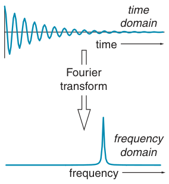

In pulsed NMR spectroscopy we measure what is called a time-domain signal – that is, the measured signal is a function of time. This is in contrast to most other kinds of spectroscopy, in which measurements of absorption or emission are made directly as a function of frequency to give the usual spectrum or frequency-domain signal.

Except in the simplest cases, the time-domain representation is virtu-ally uninterpretable by eye, so it is vital to have a way of generating the frequency-domain representation (i.e. a normal spectrum) from the time-domain signal. This is where the Fourier transform comes in: it is a relatively simple mathematical procedure, well suited to implementation on a computer, which generates the spectrum from the FID. The process is illustrated in Fig. 5.1.

**Fig. 5.1** The Fourier transform is a mathematical process which turns a time-domain signal, the FID, into a frequency-domain signal, the spectrum.

In this chapter we will first explore how the Fourier transform works, and then look in more detail at the relationship between the time and frequency domains. This will naturally bring us to the important topics of lineshapes and the phases of lines in NMR spectra. The chapter closes with a description of the manipulations which can be performed on the FID, prior to Fourier transformation, in order to improve the signal-to-noise ratio or the resolution of the spectrum.

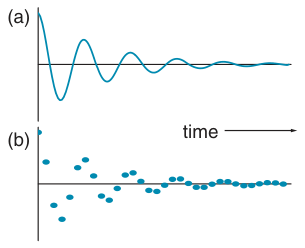

Before proceeding, there is one point we need to clarify about the way in which the FID is actually measured. For a computer to be able to manipulate the time-domain signal (the FID), it has to be converted into a digital form. This digitization process involves measuring the size of the signal, converting this value to a number and then storing it away in computer memory.

In Chapter 13 we will look at this digitization process in more detail, but suffice it to say that digitization involves sampling the signal at regular intervals chosen so as to give a good approximation to the smoothly varying signal. The digital representation of the FID thus consists of several data points, evenly spaced in time, as shown in Fig. 5.2. In this chapter we will, for convenience, represent the FID as if it were a continuous smooth

**Fig. 5.2** The amplitude of the FID, as shown in (a), varies smoothly as a function of time. In order to be able to manipulate this time-domain signal in a computer, the signal has to be digitized at regular intervals, as shown in (b).

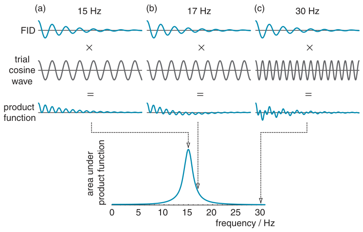

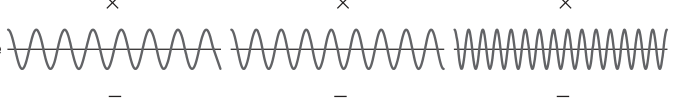

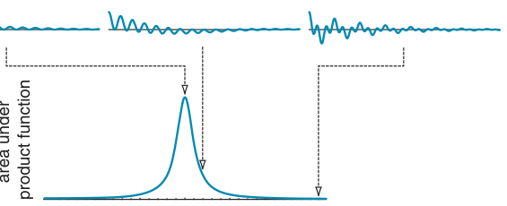

**Fig. 5.3** Illustration of how the Fourier transform works. The FID, shown along the top, is multiplied by trial cosine functions of known frequency to give a product function. The area under this product function corresponds to the intensity in the spectrum at the frequency of the cosine wave. Three cases are shown. In (a) the trial cosine is at 15 Hz which matches the oscillation in the FID; as a result the product function is always positive and the area under it is a maximum. In (b) the trial frequency is 17 Hz; now the product function has positive and negative excursions, but on account of the decay of the FID, the area under the trial function is positive, although smaller than the area in case (a). The intensity of the spectrum at 17 Hz is therefore less than at 15 Hz. Finally, in (c) the trial frequency is 30 Hz; the product function oscillates quite rapidly about zero so that the area under it is essentially zero. As a result, the intensity in the spectrum at this frequency is zero. The spectrum is generated by plotting the area under the product function against the frequency of the corresponding trial cosine wave.

function, rather than being sampled at discrete intervals. Most of the time this distinction makes no practical difference, but when it does we will point this out.

## 5.1 How the Fourier transform works

The best way to see how the Fourier transform works is to start out by considering a particular example. Let us imagine that we have a single resonance at an offset of 15 Hz; the measured FID will thus consist of an oscillation at 15 Hz which decays away over time, as shown across the top of Fig. 5.3. We have assumed that the oscillation is simply a cosine wave – later in this chapter we will discuss other possibilities.

To transform this FID into a conventional spectrum we need to find out the frequency of the oscillation, as this gives the position of the peak in the spectrum. Of course, in this simple case we could determine the frequency from the period of the waveform, but such an approach would

**Fig. 5.4** This diagram is essentially the same as Fig. 5.3 on the facing page with the exception that the FID has a slower decay. As a result, for the case where the trial cosine wave is at 17 Hz, the area under the product function is smaller, and so is the corresponding intensity in the spectrum. The overall result is that the line is narrower.

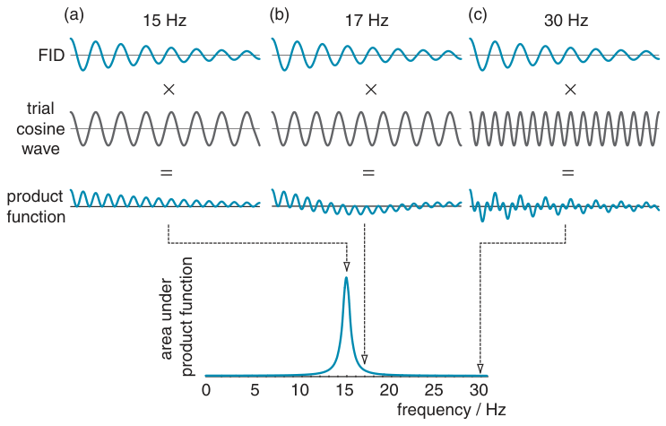

clearly be inapplicable to more complex waveforms. The Fourier transform is a general solution to this problem; it involves comparing the FID with a series of cosine waves in the following way.

Suppose we take our FID and multiply it by a trial cosine wave with a frequency of 15 Hz. As both the FID and the cosine wave have the same frequency, at any time both functions have the same sign and so the product of the two functions is therefore always positive, as shown in Fig. 5.3 (a) on the facing page. The area under this product function represents the ‘amount’ of oscillation at 15 Hz there is in the FID, in other words the area represents the intensity of the spectrum at 15 Hz.

Now suppose we make the frequency of the trial cosine wave 30 Hz. Again this is multiplied by the FID to give a product function, as shown in Fig. 5.3 (c). This time, the FID and the trial cosine do not always have the same sign, and so the product function oscillates about zero. If we recall that an area enclosed by the curve above the horizontal axis is counted as positive and that below is counted as negative, it is clear that the area under the product function is very close to zero. So we say that there is no oscillation at 30 Hz present in the FID i.e. the intensity in the spectrum at 30 Hz is zero.

Finally consider the case, shown in Fig. 5.3 (b), where the frequency of the trial cosine function is 17 Hz. The positive and negative excursions of this function and the FID almost match, so to start with the product function is positive. However, eventually they do get out of step and the product function goes negative. The important point is that because of the decay on the FID the area under the product function is not zero – the positive part at the beginning outweighs the negative part at the end. However, the area under the product function is not as great as when the trial cosine wave is at 15 Hz, so the intensity of the spectrum at 17 Hz is significant, but not as great as that at 15 Hz.

The whole process is repeated with more trial cosine waves covering a range of frequencies. The spectrum is then constructed by plotting the area under the product function against the frequency of the corresponding trial

**Fig. 5.5** This diagram is essentially the same as Fig. 5.3 on page 78 with the exception that the FID is appropriate for a situation where there are two resonances, with offsets of 10 Hz and 20 Hz. Multiplying by trial cosine waves at 10 and 20 Hz, (a) and (b), gives product functions which clearly have non-zero areas; these areas correspond to intensity in the spectrum at 10 and 20 Hz. However, multiplying by a cosine wave at 30 Hz, (c), gives a product function with zero area; this corresponds to their being no intensity in the spectrum at 30 Hz.

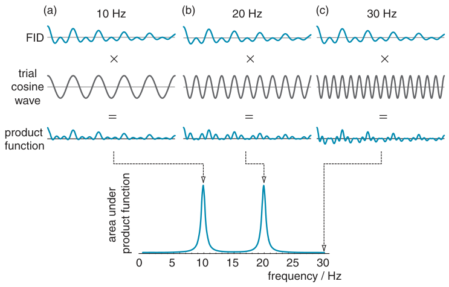

cosine wave, as shown at the bottom of Fig. 5.3. As expected, the spectrum shows a peak centred at 15 Hz, but the peak has a certain width, which is a result of the decay of the FID. We saw above that, when the frequency of the trial cosine function is close to 15 Hz, the area under the product function is still significant, and so there is intensity in the spectrum away from the centre of the peak.

If the decay of the FID is slower, the corresponding peak in the spectrum is narrower; this is illustrated in Fig. 5.4 on the previous page which should be compared with Fig. 5.3 on page 78. In the case of the trial cosine wave at 17 Hz, the negative part of the product function is more significant on account of the slower decay of the FID. As a result, the area under the product function, and hence the intensity in the spectrum at 17 Hz, is reduced. This corresponds to a narrower line.

What happens if the FID is from more than one resonance? In such cases, each gives a separate contribution to the FID so that the time-domain signal is, for example, a sum of decaying cosine waves. A typical situation is illustrated in Fig. 5.5 where two resonances, at 10 Hz and 20 Hz, give rise to a FID with a more complex form. Nevertheless, multiplication by trial cosine waves at either 10 Hz or 20 Hz gives product functions which clearly have finite areas under them, and so there is intensity in the spectrum at these two frequencies. However, multiplication by a trial cosine at 30 Hz gives a product function which oscillates back and forth about zero and so has zero area. There is thus no intensity in the spectrum at 30 Hz.

No matter how complex the original waveform of the FID, this process of multiplying by trial cosine waves will always pick out the intensity at the corresponding frequency. This is the essence of the Fourier transform.

### 5.1.1 Mathematical formulation of the Fourier transform

Written in words, the procedure we have been describing is

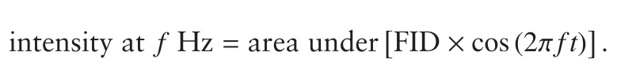

The quantity in the square bracket is the product function described above. Let us call the intensity at frequency f, S spectrum(f), and the amplitude of the FID at time t is S FID(t): the (f) and (t) remind us that these are functions of frequency and time respectively. Next, recall that in calculus, the area under a function is the same as its integral. So, our expression in words can be written more formally as

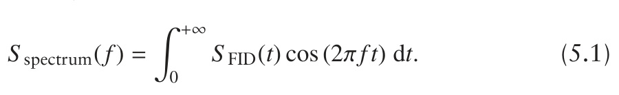

The integral is over time (as shown by dt), which is the horizontal axes of the plots of the FID.

The upper limit of the integral is infinite time. However in practice, as the FID eventually decays to zero, we only need to compute the integral from zero up to some time at which the FID is negligible. Equation 5.1 is one definition of the Fourier transform which allows us to compute the spectrum, S spectrum(f), from the FID, S FID(t). All we need to do is compute the integral for a range of frequencies, thus building up the spectrum.

On the spectrometer the FID is represented by a set of points which have been sampled at regular intervals. To Fourier transform such data, rather than computing the integral we multiply each point in the FID by the value of the trial cosine wave computed for the time corresponding to that point. This gives the product function as a series of data points, and these are then summed to give the intensity in the spectrum at the frequency of the trial cosine wave.

Expressed mathematically the integral of Eq. 5.1 becomes the sum

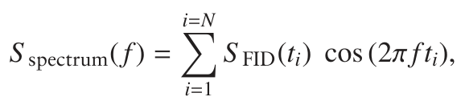

where ti is the time corresponding to the ith data point and S FID(ti) is the value of the FID at this time; N is the total number of data points.

### 5.1.2 Why the Fourier transform works

We have, with the aid of diagrams and words, attempted to explain how the Fourier transform picks out from a complex waveform the component oscillating at a certain frequency. The question is, why does this process work?

The Fourier transform uses two key ideas. The first is that any time-domain function can be represented by the sum of cosine waves of different frequencies and amplitudes. How many cosine waves we need depends on the complexity of the time-domain function. The spectrum, or frequency-domain function, is a plot of the amplitude of these cosine waves as a function of their frequency.

The second point is that these cosine waves are orthogonal to one another. What this means is that the integral, taken between t = 0 and t = ∞, of the product of any two cosine waves of different frequencies is zero. It is for this reason that the integral of Eq. 5.1 is able to pick out the contribution at just one frequency. A good analogy here is to think about the x-, y- and z-coordinates of a point in space: because the three axes are orthogonal, the values of the three coordinates are independent of one another. By analogy, the contribution to the spectrum at one frequency is independent of that at another because the cosine functions at two different frequencies are orthogonal.

## 5.2 Representing the FID

In section 4.7 on page 60 we showed that, in the basic pulse–acquire experiment, the evolution of the x- and y-components of the magnetization generated by a 90◦(x) pulse can be written

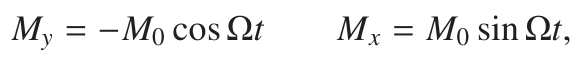

where M0 is the equilibrium magnetization and Ω is the offset (in rad s−1). As described in section 4.6 on page 60, the assumption is made that we are detecting the signal in a rotating frame at the transmitter frequency.

If our pulse–acquire experiment had used a 90◦ pulse about y, rather than about x, the equilibrium magnetization would have been rotated onto the x-axis. As shown in Fig. 5.6, the evolution of the x- and y-components

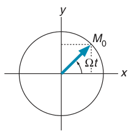

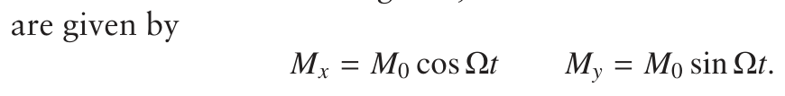

It will suit us for our present purposes to use these forms of Mx and My; later on, we will see that the choice we make is in any case arbitrary.

The precession of the magnetization gives rise to a current in the RF coil which, after various manipulations by the RF electronics in the spectrometer, results in a signal voltage which can be digitized and the result stored away in computer memory. The spectrometer is capable of detecting simultaneously both the x- and y-components of the magnetization, each giving rise to separate signals which we will denote S x and S y.

**Fig. 5.6** A 90◦(y) pulse rotates the equilibrium magnetization onto the x-axis; from there it precesses in the transverse plane, creating x- and y-components M0 cos Ωt and M0 sin Ωt. The diagram assumes that the offset Ω is positive.

These signals are proportional to Mx and My, but their absolute size is not generally of any interest so we will simply write the constant of proportion as S 0, the maximum value:

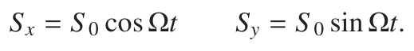

Finally, we need to recognize that the magnetization, and hence the signal, will decay over time. We model this by assuming that the signal decays exponentially:

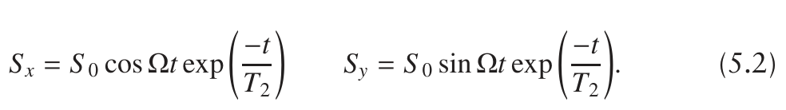

T2 is a time constant which characterizes the decay; the shorter T2, the more rapid the decay. As we will see in Chapter 9, this decay is usually due to relaxation processes.

Rather than dealing with the x- and y-components separately, it is convenient to bring them together as a complex signal, with the x-component becoming the real part and the y-component the imaginary part. The complex signal is written S (t) to remind us that it is a function of time.

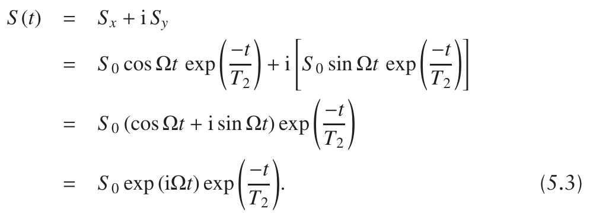

To go from the third to the fourth line we have used the identity

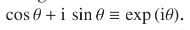

It is convenient to think of this complex signal as being represented by a vector rotating at frequency Ω, as shown in Fig. 5.7. The vector is of length S 0 exp (−t/T2) (i.e. it shrinks over time), and the x- and y-components (the real and imaginary parts) are given by Eq. 5.2 on the preceding page.

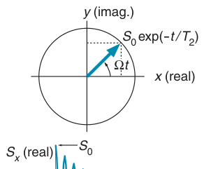

The division by T2 in Eq. 5.3 is sometimes rather inconvenient, so we define

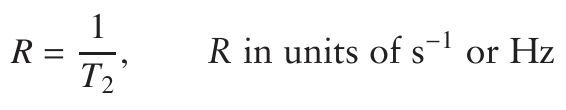

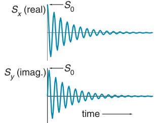

enabling us to write the time-domain signal as

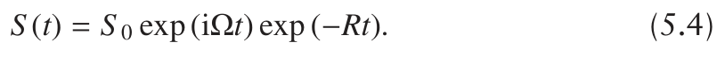

R is the (first-order) rate constant for the decay: as R increases the decay becomes more rapid and so the corresponding line becomes broader.

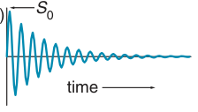

If there are several resonances present, then the complex time-domain signal is a sum of terms such of the type given in Eq. 5.3

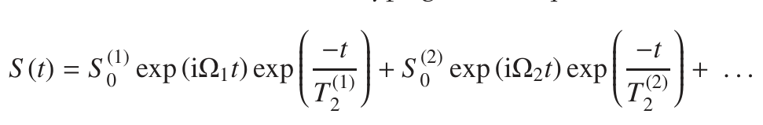

**Fig. 5.7** The complex time-domain signal defined in Eq. 5.3 can be thought of as arising from a rotating vector of length S 0 exp (−t/T2); the x- and y-components of the vector are given by Eq. 5.2 on the preceding page.

where each resonance i has its own intensity S (i)0 , frequency Ωi, and decay

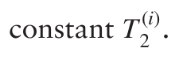

## 5.3 Lineshapes and phase

As has already been outlined, Fourier transformation of the time-domain signal, the FID, gives the required spectrum. In this section we will examine the relationship between the time-domain function and the spectrum in more detail. This will introduce the important topics of the lineshape and phase of the peaks in a spectrum.

### 5.3.1 Absorption and dispersion lineshapes

In section 5.1 on page 78 the Fourier transform was introduced by thinking about a purely real time-domain function and the result of multiplying it by cosine waves. There is an analogous process for complex time-domain functions where, instead of multiplying by cos (2πft) and then integrating,

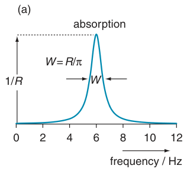

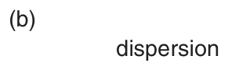

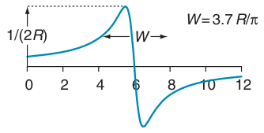

**Fig. 5.8** Fourier transformation of an exponentially decaying time-domain signal (Eq. 5.4 on the preceding page) gives a complex frequency-domain signal or spectrum whose real and imaginary parts have the absorption and dispersion mode Lorentzian lineshapes, shown in (a) and (b) respectively. Here, the peak is centred at 6 Hz and the decay constant R has been chosen such that the width (at half height) of the absorption mode line is 1 Hz; note that the heights of both peaks, as well as their widths, are also functions of the decay constant. The dispersion lineshape is considerably broader than the absorption lineshape; it also has both positive and negative parts, which is an undesirable feature. The width W, at half height, of the absorption mode is R/π Hz; the dispersion mode is almost four times wider.

we multiply by the complex exponential exp (i2π ft). As was explained in section 2.5.5 on page 20, exp (i2π ft) is the way of representing an oscillation using complex numbers.

Not surprisingly, if we start with a complex time-domain signal, Fourier transformation gives a complex frequency-domain signal or spectrum. Normally, the software on the spectrometer only displays the real part of this complex spectrum, but it is important to realize that the imaginary part exists, even if it is not displayed.

Fourier transformation of the complex time-domain signal of Eq. 5.4 on the preceding page gives a complex frequency-domain signal, or spectrum, S (ω):

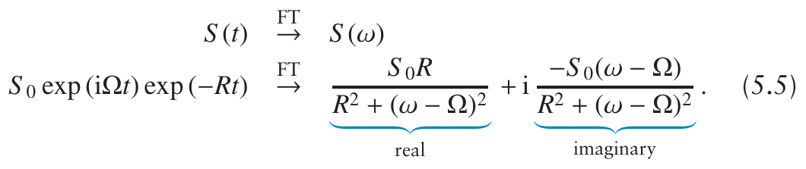

Note that, just as in the FID the running variable is time, in the spectrum

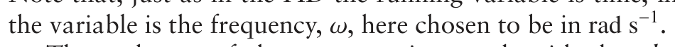

The real part of the spectrum is a peak with the absorption mode Lorentzian lineshape, whereas the imaginary part has the dispersion mode Lorentzian lineshape; the lineshapes are illustrated in Fig. 5.8 for the case S 0 = 1. You will recognize the real part as similar to the lineshape introduced in section 2.2 on page 9. Note that these particular lineshapes are a result of the assumed exponential decay of the time-domain function.

The factor of S 0 in Eq. 5.5 is just an overall scaling, so it is usual to define the Lorentzian absorption and dispersion mode lineshape functions,

A(ω) and D(ω), without this factor:

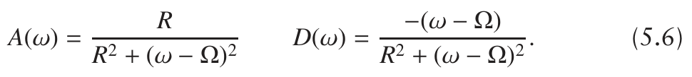

The absorption lineshape is always positive and is centred at Ω. If we let

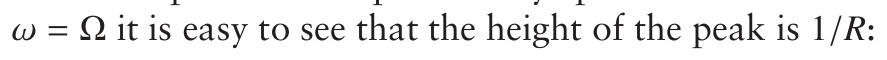

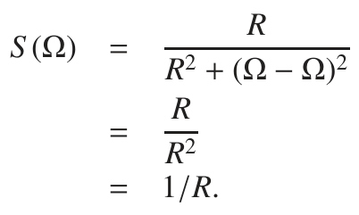

Using these expressions, we can work out the frequency, ω1/2, at which the height of the line has fallen to half this maximum. For example, recalling that the peak height of the absorption lineshape is 1/R, ω1/2 is found by solving the following equation:

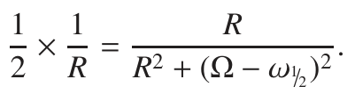

The values for ω1/2 turn out to be (Ω + R) and (Ω − R); there are of course two values as the lineshape is symmetrical about frequency Ω. Thus, the width at half height of the absorption mode lineshape is simply 2R rad s−1 or R/π Hz. These features of the absorption Lorentzian are shown in Fig. 5.8 (a) on the facing page.

These results are exactly what we expected. The larger the decay constant R, the faster the FID decays and hence the broader the line in the spectrum. Also, as R increases the peak height decreases, so as to keep the integral of the line constant (section 2.2 on page 9).

The dispersion lineshape, shown in Fig. 5.8 (b), is not one we would choose for high-resolution spectroscopy. It is broader and half the height of the absorption mode, but the worst feature is that it has both positive and negative parts. A crowded spectrum in which the peaks have the dispersion mode lineshape would very rapidly become quite uninterpretable.

So far we have written the lineshapes in angular frequency units, rad s−1; it is sometimes convenient to rewrite the functions given in Eq. 5.6 in terms of Hz. The results, along with their peak heights and widths are summarized in Table 5.1 on the next page.

Using the definitions of the lineshape functions A(ω) and D(ω) from Eq. 5.6, we can write the result of the Fourier transformation of Eq. 5.5 on the preceding page more compactly as

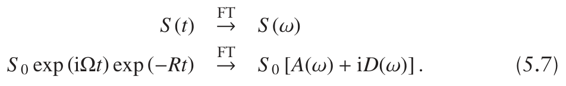

### 5.3.2 Phase

We have already seen that we can influence the form of the x- and y-components of the magnetization by altering the phase of the RF pulse.

**Table 5.1** Definitions of the absorption and dispersion mode Lorentzian lineshape functions, A and D, along with their peak heights and widths, given in both rad s−1 and Hz. The peaks are centred at Ω rad s−1 or F0 Hz.

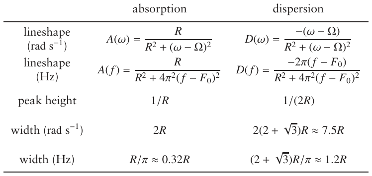

What is more, although the receiver in the spectrometer produces two signals which are labelled as deriving from the x- and y-components of the magnetization, due to the way the RF electronics works there is no guarantee that these outputs correspond to the magnetizations measured in the same axis system used to define the phase of the RF pulses.

As a result, the time-domain signal measured by the spectrometer has an essentially arbitrary (and usually unknown) phase φ associated with it. We saw in section 2.5.5 on page 20 that mathematically such a phase corresponds to multiplication by exp (iφ), so the time-domain signal is

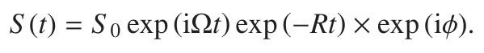

One of the properties of the Fourier transform is that if we multiply the time domain by a constant, the frequency domain is multiplied by the same constant – in other words, the constant propagates through harmlessly. So, following Eq. 5.7 on the previous page, we can just write down the Fourier transform of the time-domain signal with the phase factor as

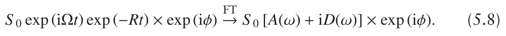

Remember that we usually display just the real part of the frequency domain. To find out what this is, we need to replace exp (iφ) with (cos φ+i sin φ) and then multiply out the brackets:

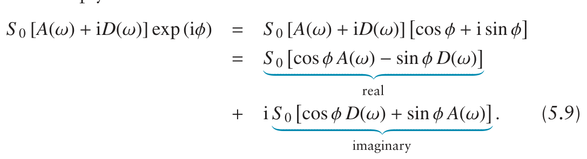

What this says is that in general the real part of the spectrum contains a mixture of the absorption and dispersion lineshapes; likewise, the imaginary part is also a mixture. The relative contributions of absorption and dispersion depend on the phase φ.

**Fig. 5.9** Depiction of the effect of a phase shift on the spectrum. In each case a vector diagram, like that of Fig. 5.7 on page 83, shows how the position of the signal at time zero is specified by a phase angle φ measured anti-clockwise from the x-axis. The corresponding x- and y-components of the time-domain signal are shown, along with the real and imaginary parts of the spectrum. In (a) φ = 0 and, as expected, the real part contains the absorption mode lineshape. In (b) a phase shift of φ = π/4 results in both the real and imaginary parts of the spectrum being a mixture of absorption and dispersion mode lineshapes. Two special cases are also shown: in (c) a phase shift of π/2 moves the absorption mode to the imaginary part of the spectrum; in (d) a phase shift of π simply inverts the spectrum when compared with (a).

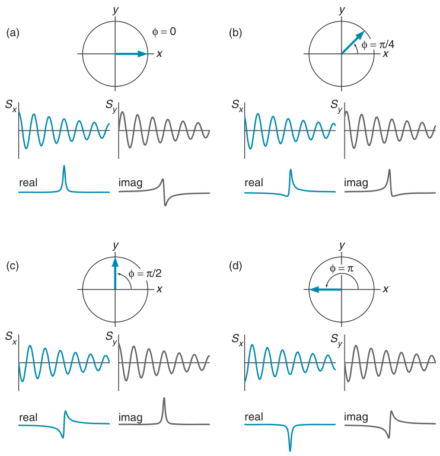

Figure 5.9 illustrates what the real and imaginary parts of the spectrum will look like for various values of the phase. In (a) the phase is zero, so the real part is the absorption mode, as expected. In (b) the phase is π/4 radians or 45◦; the vector diagram shows where the signal starts at time zero. Note that the x- and y-components of the time domain are no longer simple damped cosine and sine waves, but are phase shifted, which is the same thing as being shifted along the time axis. The real part of the spectrum is clearly neither pure absorption nor pure dispersion, but a mixture of the two.

The figure also illustrates some special cases. In (c) the phase is π/2 radians or 90◦, so cos φ = 0 and sin φ = 1. From Eq. 5.9 on the preceding page it is clear that the real part is minus the dispersion lineshape and the imaginary part is the absorption lineshape, which is what is shown in the diagram.

Another special case, shown in (d), is when φ = π radians or 180◦. Now cos φ = −1 and sin φ = 0, so the real part contains minus the absorption mode lineshape and the imaginary part minus the dispersion mode lineshape. In other words, a phase shift of π or 180◦ simply inverts the spectrum.

### 5.3.3 Phase correction

Usually, we want to make sure that the real part of the spectrum (the part which is displayed) has the absorption mode lineshape as this is the lineshape which will give us the narrowest peaks. The problem is that the spectrometer produces time-domain data with an arbitrary phase, and so the real part of the resulting spectrum will not have the pure absorption mode – such a spectrum is described as being ‘not phased correctly’ or ‘un-phased’.

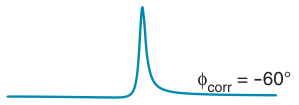

Luckily, the solution to the problem is rather simple. Remember that the spectrum is stored in computer memory, so it is easy to have the computer multiply the spectrum by exp (iφcorr), where φcorr is a phase correction. From Eq. 5.8 on page 86, the spectrum will now be described by the function

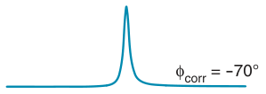

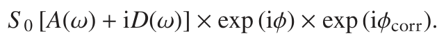

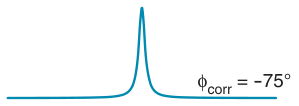

Collapsing the two exponentials together gives

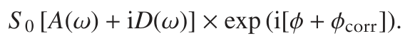

If we choose φcorr = −φ, the exponential term will be exp (0) which is 1, and

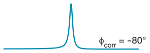

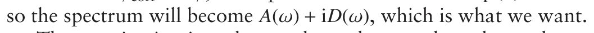

The question is, given that we do not know φ, how do we choose φcorr to obtain the desired result? The answer is, by trial and error. The software on the spectrometer provides a mode in which φcorr can be altered by a ‘click and drag’ operation, and as the phase correction is altered, the display of the real part of the spectrum is updated continuously. All we do is adjust the phase until the peaks appear to have the required absorption lineshape; at this point, it should be that φcorr = −φ. The process is called phasing the spectrum, and it is illustrated in Fig. 5.10.

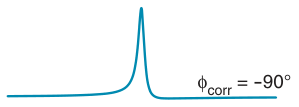

**Fig. 5.10** Illustration of how a spectrum is phased by trial and error. The original spectrum is shown at the top, and beneath it are spectra resulting from various phase corrections. In fact, the appropriate phase correction is −75◦, but at this scale a value within a few degrees of this also looks correctly phased. If we increased the vertical scale, we could inspect the foot of the line in more detail and hence adjust the phase more closely.

Admittedly, the process is somewhat subjective, and no two spectros-copists will come up with the same phase correction for a given spectrum – but the result is close enough for most purposes. Note that a single phase correction is applied to the whole spectrum: the correction is therefore described as a frequency-independent or zero-order phase correction.

The key message of this section is that, after recording the data, we can adjust the phase in the spectrum to obtain the lineshape we require.

### 5.3.4 Frequency-dependent phase errors

Sometimes, the phase is not the same for all the lines in the spectrum, but varies from one edge of the spectrum to the other. There are many reasons why this might be so, but perhaps the commonest is due to the RF pulse used to excite the spectrum.

Look back at Fig. 4.27 on page 67 and Fig. 4.28 on page 68. What these diagrams show is that, whereas an on-resonance 90◦(x) pulse rotates the equilibrium magnetization onto the −y-axis, as we go off resonance the pulse produces more and more x-magnetization. The position of the magnetization just after the pulse thus varies with the offset; in other words, there is a phase error which increases with the offset. Such a phase error is said to be due to an ‘off resonance’ effect of the pulse.

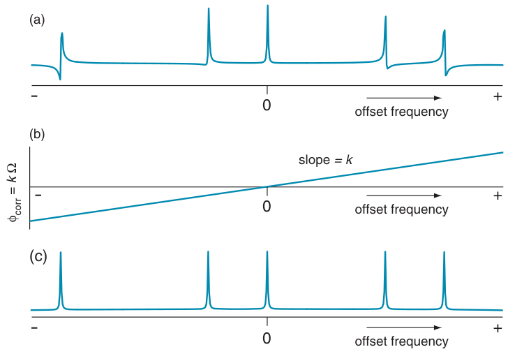

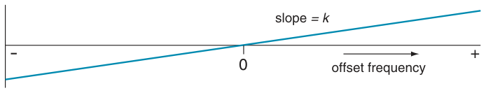

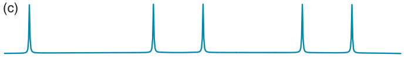

**Fig. 5.11** Illustration of how a spectrum which has a frequency-dependent phase error is phased. In (a) the line which is on resonance (at zero frequency) is in pure absorption, but there is a phase error which increases with offset. Often, it is found that the phase error is proportional to the offset, in which case the whole spectrum can be phased by applying a phase correction which varies with the offset in a linear manner, as shown in (b); all we have to do is to choose, by trial and error, constant of proportion k which determines how quickly the phase correction increases with offset i.e. the slope of the line. With the correct choice, a spectrum with all of the lines in phase, shown in (c), is obtained.

When the resulting FID is Fourier transformed we will find that the phases of the lines are not all the same. If an on-resonance peak is phased to the absorption mode, we will find that other lines have dispersion contributions which increase as the offset increases. This is illustrated in Fig. 5.11 (a).

To a good approximation, the phase error due to this off-resonance effect is directly proportional to the offset from the transmitter, Ω. So, if we multiply the spectrum by a phase correction which is proportional to the offset:

we should be able to phase all of the lines in the spectrum by an appropriate choice of the constant k. As before, the choice of k is made by trial and error. Figure 5.11 (b) shows the phase correction and (c) shows the result of applying this, with the correct choice of k, to the spectrum; all of the lines are now in phase. This type of phase correction is often described as being linear or first order.

The usual convention is to express the frequency-dependent phase correction as the value that the phase takes at the extreme edges of the spectrum. So, for example, a frequency-dependent correction by 100◦ means that the phase correction is zero in the middle (at zero offset) and rises linearly to +100◦ at one edge and falls linearly to −100◦ at the opposite edge.

The phase error due to these off-resonance effects of a nominal 90◦ pulse is of the order of (Ωtp) radians at offset Ω for a pulse of duration tp. For a 13C spectrum recorded at a Larmor frequency of 125 MHz, the maximum offset is about 100 ppm which translates to 12 500 Hz. Let us suppose that the 90◦ pulse width is 15 μs, then the phase error is

which is about 68◦. Note that in the calculation we had to convert the offset from Hz to rad s−1 by multiplying by 2π. So, we expect the frequency-dependent phase error to vary from zero in the middle of the spectrum (where the offset is zero) to 68◦ at the edges; this is a significant effect.

For reasons which we cannot go into here, it turns out that a linear phase correction does not completely remove the phase errors due to off-resonance effects. Provided that the lines in the spectrum are sharp and the frequency-dependent phase correction is not too large, the linear phase correction works well. However, problems arise if the lines are broad and large corrections are used; in particular, the use of such phase corrections can give rise to significant distortions in the baseline of the spectrum.

Optional section ⇒

## 5.4 Manipulating the FID and the spectrum

On the spectrometer, the FID is stored on disc or in memory so it is no trouble at all for the software to perform mathematical manipulations on the time-domain signal prior to Fourier transformation. This section is concerned with some common manipulations of the FID which can be used to enhance the signal-to-noise ratio (SNR) of the spectrum, or to narrow the lines in the spectrum. Correctly applied, these manipulations can be of great utility.

### 5.4.1 Noise

Inevitably when we record a FID we record noise at the same time. Some of the noise is contributed by the amplifiers and other electronics in the RF receiver, but the major contributor is the thermal noise from the coil used to detect the signal. Reducing the noise contributed by these sources is largely a technical matter which will not concern us here.

It is worthwhile spending a moment describing the nature of the noise recorded by an NMR spectrometer. The first thing is that the noise signal wanders back and forth about zero in a random way (it is noise, after all) but that, averaged over time, the positive and negative excursions cancel one another out so that the mean (average) of the noise is zero.

The second characteristic of the noise is that it has an approximately Gaussian distribution. What this means is that the probability of the noise signal reaching a certain value Snoise is proportional to the Gaussian function

where σ is a parameter which characterizes the distribution of the noise. Due to the fact that Snoise appears as the square and as the argument to an exponential, it follows that the probability drops off rather quickly as S noise 0 increases. So, although the noise will be ‘spiky’, large amplitude spikes are much less likely to be found than lower level spikes, whilst small excursions about zero are the most likely. Figure 5.12 shows a typical noise record.

Like the FID, the noise is recorded as a function of time, and then converted to the frequency domain by Fourier transformation. This process does not alter the character of the noise: it retains both the Gaussian distribution and the zero mean. The amplitude of the noise in the spectrum depends on both the amplitude of the noise in the time domain and the total time for which the noise was recorded. The longer the acquisition time, the more noise is recorded and this appears as a greater noise amplitude in the spectrum. This property of the noise in the two domains has some practical consequences which are explored in the following two sections.

**Fig. 5.12** A typical piece of noise, such as would be recorded by an NMR spectrometer. The noise is described as ‘Gaussian with zero mean’, which means that (1) the time average of the noise is zero, and (2) the probability of a certain amplitude occurring is proportional to a Gaussian function of the amplitude. This means that high amplitude noise spikes occur with lower probability (i.e. less often) than lower amplitude ones.

### 5.4.2 Effect of the acquisition time

The free induction signal decays over time, but in contrast the noise just goes on and on. Therefore, if we carry on recording data for long after the FID has decayed, we will just measure noise and no signal. Not surprisingly, the resulting spectrum will therefore have a poor SNR.

Figure 5.13 illustrates how the SNR of the spectrum is affected by altering the acquisition time. In (a) data acquisition is carried on long after the NMR signal has decayed into the noise. Simply halving the acquisition time, as shown in (b), still allows us to record the NMR signal but greatly reduces the amount of noise which is recorded; the result is an improvement in the SNR. Shortening the acquisition time still further means that even less noise is recorded. The result, shown in (c), is a significant improvement in the SNR.

**Fig. 5.13** Illustration of the effect of altering the acquisition time on the signal-to- noise ratio (SNR) in the spectrum; at the top are shown a series of FIDs while the corresponding spectra are shown beneath. In (a) the NMR signal has decayed into the noise within the first quarter of the acquisition time T, but the noise carries on unabated throughout the whole time. Shown in (b) is the effect of halving the acquisition time; the SNR of the spectrum improves as a consequence of the fact that we are acquiring less noise but the same amount of signal. In (c) we see that taking the first quarter of the data gives a more substantial improvement in the SNR of the spectrum.

Of course, we must not shorten the acquisition time to the point where we start to miss significant parts of the the NMR signal. Clearly the acquisition time needs to be chosen with care.

### 5.4.3 Sensitivity enhancement

A typical time-domain signal is strongest at the beginning but, due to the decay, falls away over time; however, the noise remains constant throughout. This gives us the idea that the early parts of the time domain are ‘more important’ as it is here where the signal is the strongest, whereas the latter parts are ‘less important’ as the signal has decayed leaving the noise dominant.

We can favour the early parts of the time domain by multiplying it by a function which starts with the value one and then steadily tails away to zero. The idea is that this function will attenuate the later parts of the time domain where the signal is weakest, but leave the early parts unaffected. If the decay rate of the function is chosen carefully, it is possible to improve the SNR of the corresponding spectrum. In the discussion which follows we will use the term ‘time-domain signal’ to mean the NMR signal plus the noise, whereas the NMR signal alone will be referred to as the FID.

A function used to multiply the time-domain signal is called a weighting function. The simplest example is an exponential:

where RLB is a rate constant which determines how fast the weighting function decays; we are free to choose the value of RLB. Figure 5.14 shows a sketch of the function.

Multiplication by this particular weighting function will make the enve-lope of the FID decay more rapidly, and hence the line in the corresponding spectrum will be broader than in the spectrum from the unweighted FID. It is for this reason that such decaying weighting functions are often called line broadening functions.

**Fig. 5.14** A graph of the decaying exponential function WLB(t) = exp(−RLBt); the decay rate is set by the value of the parameter RLB.

Recall that as the line becomes broader, the peak height is reduced. This will have an adverse effect on the SNR, and so the decay rate of the weighting function therefore has to be chosen carefully. If the decay is too slow, then the noise in the tail of the time-domain signal will not be attenuated sufficiently. If the decay is too fast, then the noise will be attenuated, but the reduction in the peak height may outweigh the reduction in the noise level, thus leading to a degradation in the SNR.

Figure 5.15 on the next page illustrates the effect on the spectrum and its SNR of different choices of this decay constant. The original time-domain signal, shown in (a), has a rather noisy tail which carries on long after the FID has disappeared into the noise and, as a result, the corresponding spectrum (f) is rather noisy. Multiplication of the time domain by the exponential weighting function (b) gives what is called the weighted time domain, (d). Clearly the noise in the tail has been reduced substantially, whereas the FID is little affected. The corresponding spectrum (g) shows a considerable improvement in SNR when compared with (f); note also the reduction in peak height.

**Fig. 5.15** Illustration of how multiplying a time-domain signal by a decaying expo- nential function (a weighting function) can improve the SNR of the corresponding spectrum. The original time-domain signal is shown in (a); Fourier transformation gives the spectrum (f). Multiplying the time domain by a weighting function (b) gives the weighted time-domain signal (d); (g) is the corresponding spectrum. Note the improvement in SNR of (g) when compared with (f). Multiplying (a) by the more rapidly decaying weighting function (c) gives (e); (h) is the corresponding spectrum, which, when compared with (g), shows the expected reduction in peak height caused by the more rapidly decaying weighting function. Spectra (f)–(h) are all plotted on the same vertical scale so that the decrease in peak height can be seen. The same spectra are plotted in (i)–(k), but this time they have been normalized so that the peak heights are all the same; this shows most clearly the improvement in the SNR and the increase in the linewidth.

If the weighting function decays faster, as shown in (c), the resulting weighted time domain (e) shows not only the reduction of the noise in the tail but also a more rapid decay of the NMR signal. The corresponding spectrum (h) shows a small improvement in SNR over (g), but the change is not as dramatic as that from (f) to (g). There is a clear reduction in the peak height of (h) when compared with (g), once more as a consequence of the line broadening.

The way in which the SNR and linewidths are affected by the choice of decay rate for the weighting function is best seen by comparing spectra (i)–(k); these are the same as (f)–(h), but have been plotted so that the peaks are all the same height. The increase in linewidth as we go from (i) to (j) to (k) is evident; it is also clear that despite the increase in linewidth, spectrum (k) has a slightly better SNR than (j).

### 5.4.4 The matched filter

The weighting function which gives the greatest increase in the SNR is called a matched filter, and in this section we will describe how such a filter is selected. As we have seen, the time-domain signal can be represented as (Eq. 5.4 on page 83)

Fourier transformation of such a function gives a peak of width R/π Hz. Suppose we multiply this time-domain signal by an exponential weighting function WLB(t) (Eq. 5.10 on page 92). The result is

where to go to the second line we have simply combined the two exponential decay terms.

The effect of the weighting function is simply to change the decay constant from R to (R+RLB). Thus, Fourier transformation of the weighted time-domain signal will give a line of width (R + RLB)/π. In summary, the use of a weighting function with decay constant RLB increases the linewidth in the spectrum by RLB/π Hz.

It is usual to specify the weighting function, not by giving the value of RLB, but by specifying the extra line broadening that it will cause. So, a ‘line broadening of 5 Hz’ is a function which will increase the linewidth in the spectrum by 5 Hz. Such a function would require RLB/π = 5, which

It can be shown that the best SNR is obtained by applying a weighting function which gives an extra line broadening equal to the linewidth in the original spectrum – such a weighting function is called a matched filter. So, if the linewidth is 2 Hz in the original spectrum, applying an additional line broadening of 2 Hz will give the optimum SNR. If there is a range of linewidths present in the spectrum, then no single value of the line broadening will give the optimum SNR for all the peaks.

The extra line broadening caused by the matched filter may not be acceptable on the grounds of the decrease in resolution it causes. Under these circumstances we have to make a compromise between resolution and SNR, applying as much line broadening as we can tolerate, but perhaps not up to that required for the matched filter. In any case, it is important to use a weighting function which decays sufficiently fast to cut off the noise recorded after the NMR signal has decayed.

### 5.4.5 Resolution enhancement

In the previous two sections we saw that multiplying the time-domain signal by a decaying function results in an increase in the linewidth. This immediately puts in mind the idea of multiplying the time-domain signal by a weighting function which increases over time; this would partly cancel out the decay of the FID and hence decrease the linewidth in the spectrum. Weighting functions of this type are said to lead to resolution enhancement.

A typical example of such a function is an exponential with a positive argument:

This function starts at one when t = 0 and then rises indefinitely; a plot is shown in Fig. 5.16.

The problem with using such a function is that it amplifies the noise in the tail of the time domain, thus degrading the SNR in the corresponding spectrum. To get round this problem it is usual to apply, as well as the rising weighting function, a second decaying weighting function whose purpose is to ‘clip’ the noise at the tail of the time domain. Clearly the decaying function must not decay so fast that it undoes the resolution enhancing effect of the rising function.

**Fig. 5.16** A graph of the rising exponential function WRE(t) = exp(RREt); the function starts at one and then rises indefinitely, at a rate set by the parameter RRE.

A common choice for the decaying function is a Gaussian:

where α is a parameter which sets the decay rate; the larger α, the faster the decay rate. A Gaussian is a bell-shaped curve, symmetrical about its centre. However, the weighting function uses just the right-hand half of the curve i.e. the part for t >0. Like a simple exponential, the Gaussian starts with the value 1 at t = 0 and then tails away smoothly to zero. To start with, a Gaussian decays more slowly than an exponential, but then beyond a certain point the Gaussian drops off more quickly, as is illustrated in Fig. 5.17. With a suitable choice of α, the Gaussian will not at first undo the effect of the rising exponential but will, at longer times, attenuate strongly the noise at the end of the time domain.

The whole process is illustrated in Fig. 5.18 on the following page. The 1 original time-domain signal (a) has been recorded well beyond the point where the signal decays into the noise; the corresponding spectrum is shown in (b). If (a) is multiplied by the rising exponential function plotted in (c), the result is the time-domain signal (d); note how the decay of the FID has been slowed, but the noise in the tail of the time-domain signal has been greatly magnified. Fourier transformation of (d) gives the spectrum 0 (e); the resolution has clearly been improved, but at the expense of a large reduction in the SNR.

Referring now to the bottom part of Fig. 5.18 on the next page we can see the effect of including a Gaussian weighting function. The original time-domain signal (a) is multiplied by the rising exponential (f) and the Gaussian (g); this gives the time-domain signal (h). Note that once again the signal decay has been slowed, but the noise in the tail of the time domain is not as large as it was in (d). Fourier transformation of (h) gives the spectrum (i); the resolution has clearly been improved when compared with (b), but without too great a loss of SNR.

**Fig. 5.17** Comparison of the decaying exponential function exp(−RLBt) and the Gaussian function exp(−αt2). To start with, the exponential decays more quickly than the Gaussian, but at long times the situation is reversed. RLB and α have been chosen so that the functions have decayed to half their initial values at the same time.

Finally, plot (j) shows the product of the two weighting functions (f) and (g). We can see clearly from this plot how the two functions combine together to first increase the time-domain function and then to attenuate it at longer times. Careful choice of the parameters RRE and α are needed to obtain the optimum result. Usually, a process of trial and error is adopted, with the parameters being adjusted until the best result is obtained.

**Fig. 5.18** Illustration of the use of weighting functions to enhance the resolution in the spectrum. The original time-domain signal is shown in (a) and the corresponding spectrum in (b). Multiplication of (a) by the rising exponential (c) gives (d); Fourier transformation of (d) gives the spectrum (e). Comparing (b) and (e) we see that the line has been narrowed, but only at the expense of a serious degradation in the SNR. The situation can be improved by using two weighting functions: a rising exponential (f) and a Gaussian (g); the result of applying both of these is the time-domain signal shown in (h). The corresponding spectrum (i) shows an improvement in resolution without too great a reduction in SNR. Plot (j) is of the product of the two weighting functions (f) and (g).The scales of the plots have been altered to make the relevant features clear.

### 5.4.6 Defining the parameters for sensitivity and resolution

### enhancement functions

On most spectrometers one does not select the values of RLB, RRE and α directly. Rather these values are computed from some other parameters whose values are perhaps rather more intuitive.

For line broadening using a decaying exponential function, we usually enter the value of the extra line broadening (in Hz) which the weighting function will cause. As explained in section 5.4.4 on page 94, the weighting function exp (−RLB/t) causes an extra line broadening of RLB/π. On the spectrometer we specify this additional linewidth L, from which RLB is

For resolution enhancement, the composite weighting function is

If we multiply the time-domain function by this we obtain

If we ignore the Gaussian function for the moment (i.e. put α = 0), then the overall decay rate is (R − RRE), which translates to a linewidth of (R/π − RRE/π) Hz. Now R/π is the linewidth when no weighting functions are used, so RRE/π is the reduction in the linewidth caused by the weighting function.

The way in which RRE is usually specified is to enter the required reduction in the linewidth, L, as a negative number; RRE is then computed as −L/π. This might seem a bit strange, but it is really for compatibility with the line-broadening function: to increase the linewidth by 1 Hz we enter L = 1, to decrease the linewidth by the same amount we enter L = −1. The composite resolution enhancement weighting function of Eq. 5.11 on the preceding page can thus be written:

where L is entered as a negative number, and is the amount by which the linewidth will be reduced, if the effect of the Gaussian function is ignored.

As shown in Fig. 5.19, the product of the rising exponential and Gaussian gives rise to a maximum in the overall weighting function. It is easy to show that this maximum occurs at a time

**Fig. 5.19** Plot of the product of a rising exponential and a Gaussian function. The maximum occurs at tmax = (−Lπ)/(2α) where, as explained in the text, L < 0.

recall that L is negative, so tmax is positive. On some spectrometers the value of tmax (in seconds) at which you want this maximum to occur is specified, and from this α is computed as

On other spectrometers, tmax is expressed as a fraction f of the acquisition time: tmax = ftacq. In this case, once f has been specified, α is computed using

### 5.4.7 ‘Lorentz-to-Gauss’ transformation

A weighting function which combines a rising exponential with a Gaussian can be used to change the lineshape from a Lorentzian to a Gaussian. These two lineshapes are compared in Fig. 5.20. For the same width at half-height, the Gaussian is more compact, a feature which might be preferred to the Lorentzian line which spreads rather more at the base.

The transformation is achieved by choosing the value of RRE so as to cancel exactly the original decay of the FID. Multiplication by the Gaussian then gives the FID a pure Gaussian envelope, the Fourier transform of which gives a Gaussian lineshape. The width of the Gaussian line is set to the required value by varying the parameter α. The overall process is know colloquially as a Lorentz-to-Gauss transformation.

**Fig. 5.20** Comparison of the Lorentzian and Gaussian lineshapes; the two peaks have been adjusted so that their peak heights and widths at half-height are equal. The Gaussian is a more compact lineshape.

In practice, we would again use trial and error to find the appropriate values of the two parameters; whether or not a complete Lorentz-to-Gauss transformation has actually been achieved is somewhat subjective.

**Fig. 5.21** The top row shows sine bell and the bottom row shows sine bell squared weighting functions for different choices of the phase parameter φ, given in radians.

### 5.4.8 Other weighting functions

Many other weighting functions have been developed for sensitivity enhancement or resolution enhancement. Perhaps the most popular are the sine bell functions, which are illustrated in Fig. 5.21.

The basic sine bell is just the function sin θ for θ = 0 to θ = π. The function is adjusted so that it fits exactly over the acquisition time, as is illustrated in the top left-hand plot of Fig. 5.21. In this form, the function will give resolution enhancement rather like the combination of a rising exponential and a Gaussian function shown in Fig. 5.18 (j) on page 96. Mathematically the weighting function is:

The sine bell can be modified by shifting it to the left, as is shown in Fig. 5.21. The further the shift to the left, the smaller the resolution enhancement effect will be, and in the limit that the shift is by π/2 or 90◦ the function is simply a decaying one and so will broaden the lines. The shift is usually expressed in terms of a phase φ. With such a shift the weighting function is:

note that this definition of the function ensures that, regardless of φ, it goes to zero at tacq.

The shape of all of these weighting functions are altered subtly by squaring them to give the sine bell squared functions; these are shown in the lower part of Fig. 5.21. The weighting function is then

Much of the popularity of these functions probably rests on the fact that there is only one parameter to adjust, rather than two in the case of the combination of an exponential and a Gaussian function.

tacq

(a)

**Fig. 5.22** Illustration of the results of zero filling. The time-domain signals along the top row are all the same except that (b) and (c) have been supplemented with increasing numbers of zeroes and so contain more and more data points. Fourier transformation preserves the number of data points, so the line in the corresponding spectrum is represented by more points as more zeroes are added to the end of the FID.

⇐ Optional section

## 5.5 Zero filling

We mentioned right at the start of the chapter that the time-domain signal is sampled at regular intervals and stored away in computer memory in a digital form. When these data are subject to a Fourier transform the resulting spectrum is also represented by a set of data points, this time evenly spaced in frequency. Usually, the number of data points in the spectrum is equal to the number in the original time-domain signal. So, although the spectrometer plots a spectrum that appears to be a smooth line, in fact it is joining together a series of closely spaced points.

This is illustrated in Fig. 5.22 (a) which shows the FID and the corresponding spectrum; rather than joining up the points which make up the spectrum we have just plotted the points. Clearly there are only a few data points which define the line.

If we take the original FID and add an equal number of zeroes to it, the corresponding spectrum will have double the number of points, and so the line is represented by more data points. This is illustrated in Fig. 5.22 (b). Adding a set of zeroes equal to the number of data points is called ‘zero filling once’.

We can carry on with this zero filling process. For example, having added one set of zeroes, we can add another to double the total number of data points (‘zero filling twice’). This results in an even larger number of data points defining the line, as is shown in Fig. 5.22 (c).

Zero filling costs nothing: it is just a manipulation in the computer. This manipulation does not improve the resolution as the measured signal remains the same, but the lines will be better defined in the spectrum. This is desirable, at least for aesthetic reasons if nothing else.

It turns out that the Fourier transform algorithm used by computer programs is most suited to a number of data points which is a power of 2. So, for example, 214 = 16 384 is a suitable number of data points to transform, but 15 000 is not. In practice, therefore, it is usual to zero fill the time-domain data so that the total number of points is a power of 2. It is always an option, of course, to zero fill beyond this point.

**Fig. 5.23** Illustration of how truncation leads to artefacts (called sinc wiggles) in the spectrum. The FID on the left has been recorded for sufficient time that it has decayed almost to zero; the corresponding spectrum shows the expected lineshape. However, if data acquisition is stopped before the signal has decayed fully, the corresponding spectra show oscillations around the base of the peak; these oscillations are called sinc wiggles.

Optional section ⇒

## 5.6 Truncation

In conventional NMR it is almost always possible to record the FID until it has decayed almost to zero (or into the noise). However, in two-dimensional NMR this may not be the case, simply because of the restrictions on the amount of data which can be recorded, particularly in the indirect dimension (see section 8.1.1 on page 185 for further details). If we stop recording the signal before it has fully decayed the FID is said to be truncated; this is illustrated in Fig. 5.23, along with the consequences for the corresponding spectra.

As is shown in the figure, a truncated FID leads to oscillations around the base of the peak in the corresponding spectrum; these are usually called sinc wiggles or truncation artefacts – the name arises as the peak shape is related to a sinc function sin (x)/x. The more severe the truncation, the larger the sinc wiggles. The separation of successive maxima in these wiggles is 1/tacq Hz.

Clearly these oscillations are undesirable as they perturb the baseline and may make it more difficult to discern nearby weaker peaks. Assuming that it is not an option to increase the acquisition time, the only solution is to apply a decaying weighting function to the FID so as to force the signal to go to zero at the end. Unfortunately, this will have the side effect of broadening the lines and reducing the SNR.

Highly truncated time-domain signals are often a feature of multi-dimensional NMR experiments. Much effort has therefore been put into finding alternatives to the Fourier transform which will generate spectra without these truncation artefacts. The popular methods are linear predic-tion and maximum entropy. Both have particular merits and drawbacks, and need to be applied with great care.

## 5.7 Further reading

Fourier transformation and phase correction: Chapter 5 from M. H. Levitt, Spin Dynamics (2nd edition, John Wiley & Sons, Ltd, 2008).

Fourier transformation, weighting functions and sensitivity: Chapter 4 from R. R. Ernst, G. Bodenhausen and A. Wokaun, Principles of Nuclear Magnetic Resonance in One and Two Dimensions (Oxford University Press, 1987).

A comprehensive review on all types of NMR data processing: J. C. Lindon and A. G. Ferrige, Progress in Nuclear Magnetic Resonance Spectroscopy, 14, 27–66 (1980).

Fourier transformation (a comprehensive text): R. N. Bracewell, The Fourier Transform and its Applications (McGraw–Hill, 1978).

## 5.8 Exercises

5.1 In a spectrum with just one line, the dispersion mode lineshape might be acceptable – in fact we can think of reasons why it might even be desirable (what might these be?). However, in a spectrum with many lines the dispersion mode lineshape is very undesirable; why?

5.2 An absorption mode Lorentzian line, centred at frequency Ω is given by

We are going to work out the width of the line at half-height. Clearly, this is independent of the position of the line, so we can

Show that the peak height is S0 and hence, by finding the values of ω (there are two) for which A(ω) = S0/(2R), show that the width of the line at half-height is 2R rad s−1. Give the corresponding expression for the width in Hz.

To find the minima and maxima, we first need to differentiate D(ω) with respect to ω; show that this differential is

The minima and maxima are found by solving

show that ω = ±R are two solutions to this equation. Further show that the peak height at these two frequencies are ∓1/(2R); draw a sketch of the lineshape and mark on it all of the features you have identified. There are two frequencies at which the lineshape has half the maximum peak height; these frequencies are found by solving

Show that the frequencies are given by

Mark these positions on your sketch. Similarly show that there are two frequencies at which the peak height is −1/(4R), and hence show that the overall width of the line√ at half-height is 2(2 + 3)R. Compare this value with that for the absorption mode lineshape.

5.4 Make sketches similar to those of Fig. 5.9 on page 87 for the cases:

5.5 Suppose that we record a spectrum with the simple pulse–acquire sequence using a 90◦ pulse applied along the x-axis. The resulting FID is Fourier transformed and the spectrum is phased to give an absorption mode lineshape. We then change the phase of the pulse from x to y, acquire an FID in the same way and phase the spectrum using the same phase correction as above. What lineshape would you expect to see in the spectrum? Give the reasons for your answer. How would the spectrum be affected by: (a) applying the pulse

shows a wide range of shifts, covering some 700 ppm. Suppose that the transmitter is placed in the middle of the shift range and that a 90◦ pulse of width 20 μs is used to excite the spectrum; the spectrometer has a B0 field strength of 9.4 T. Estimate the size of the phase correction (in radians and in degrees) which will be needed at the edges of the spectrum.

5.7 Why is it undesirable to continue to acquire the time-domain signal after the NMR signal has decayed away? How can weighting functions be used to improve the SNR of a spectrum? In your answer describe how the parameters of a suitable weighting function can be chosen to optimize the SNR. Are there any disadvantages to the use of such weighting functions?

5.8 For a time-domain signal in which the NMR signal has decayed long before the end of the acquisition time, explain why the SNR of the corresponding spectrum can be improved either by shortening the acquisition time, or by applying a suitable weighting function.

5.9 Describe how weighting functions can be used to improve the resolution in a spectrum. In practice, what sets the limit on the improvement that can be obtained? Will zero filling improve the resolution?

5.10 Explain why use of a sine bell weighting function shifted by 45◦ may enhance the resolution of a spectrum, whereas use of a sine bell shifted by 90◦ will not.

5.11 In a proton NMR spectrum the peak from TMS was found to show ‘wiggles’ characteristic of truncation of the FID. However, the other peaks in the spectrum showed no such artefacts. Explain. How can truncation artefacts be suppressed? Mention any difficulties with your solution to the problem.
