# The quantum mechanics of one spin

To make any further progress in our understanding of multiple-pulse NMR, especially as applied to coupled spin systems, we need to develop some more quantum mechanical tools. There is no avoiding this, as the energy level approach and the vector model are simply not up to the task.

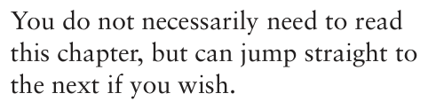

Over the next two chapters we will introduce the product operator approach, which is an exact quantum mechanical treatment well-suited to multiple-pulse NMR on coupled spin systems. This approach is relatively simple to apply, and has the advantage of giving results which can be readily interpreted in terms of the appearance of spectra.

This chapter describes the theoretical background which leads up to the product operator formalism, while the next chapter describes how product operators can be used in practice to predict the outcome of experiments. The good news is that you do not need to read this chapter at all, but can jump straight to the next in which you will find a practical description of how to use product operators. There is nothing in this present chapter which you need to know in order to understand how to use the product operator method.

However, at some point – perhaps after you have had some experience with making your own calculations – you will probably want to know where this operator approach comes from and why it works. At this point you should read this chapter.

## 6.1 Introduction

This chapter is concerned with the quantum mechanical description of first a single spin-half nucleus, and then a non-interacting collection of such nuclei. Of course, this is the system to which the vector model, described in Chapter 4, applies exactly, so in a way we are going over the same ground. However, this repetition will be useful as our knowledge of the vector model will help us in understanding and interpreting the quantum mechanics.

To start with we will work with the wavefunction which describes the spin, and show how the observable magnetization can be computed from a knowledge of this wavefunction. We will then go on to show how the time-dependent Schrödinger equation can be used to predict how the wavefunction, and hence the magnetization, evolves over time.

What we will discover is that, even for this very simple system of non-interacting spins, the quantum mechanical approach seems to be very cumbersome and unintuitive. However, it will be shown that by casting the theory in a different way in which operators are used to represent the motion of the spins, a great deal of simplification is achieved. The practical details of how this simpler operator approach is used, and how it can be extended to coupled spins, is described in the following chapter.

This chapter requires you to have some knowledge of the following mathematical topics: complex numbers, matrices and simple first-order differential equations.

## 6.2 Superposition states

The central idea of this chapter is that the wavefunction of a single spin, ψ, can always be described as a linear combination of the eigenfunctions of the Hamiltonian for a single spin:

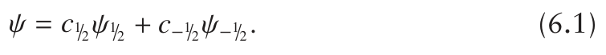

Recall from Eq. 3.10 on page 34 that, when written in frequency units, the Hamiltonian for a single spin is Ĥone spin = ω0 Îz. It was shown in section 3.4

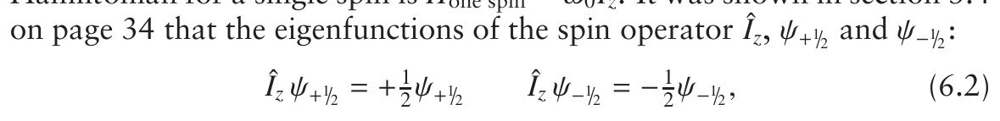

are also eigenfunctions of this Hamiltonian. The corresponding eigenvalues

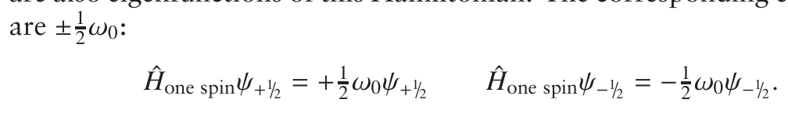

In Eq. 6.1 c1/2 and c−1/2 are coefficients (just numbers) whose values may change over time. We will see in due course that these coefficients determine the observable magnetization from the spin, and we will also see how to predict the way in which the coefficients vary with time.

Equation 6.1 represents what is called a superposition of states or a mixed state of the spin. As was explained in section 3.1 on page 24, quantum mechanics does not require that the wavefunction of the spin be one corresponding to an energy level i.e. ψ1/2 or ψ−1/2. It really is very important to grasp the idea that the spin is in a superposition state: everything else in this chapter flows from this central point.

As was explained in section 3.3.1 on page 31, it is common to denote the eigenfunction of Îz with eigenvalue +12 as α (spin up), and the state with eigenvalue −12 as β (spin down). We will adopt this notation for the remainder of this chapter, as it is rather more compact; using this, the superposition state is written

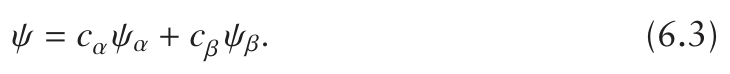

## 6.3 Some quantum mechanical tools

In the rest of this chapter, we are going to need a number of ideas and techniques from quantum mechanics, and so these have been collected together in this section. They may seem a little abstract at this stage, and you might justifiably think ‘so what?’, but rest assured that all of the topics we cover in this section are going to be useful later on.

### 6.3.1 Dirac notation

So far we have written the wavefunctions and eigenfunctions using the symbol ψ, adding subscripts when we need to distinguish different functions e.g. ψ1/2 or ψα. In a way, the ψ is a bit redundant; all it is there for is to give us something to ‘hang’ the subscripts on.

A more compact and useful notation for wavefunctions was developed by Paul Dirac. In his notation, the wavefunction is written as a ‘ket’ | ⟩, and any labels, such as quantum numbers, are written inside the ket. So, for example

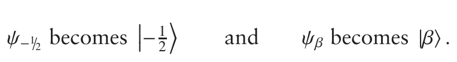

Often, we will need the complex conjugate of a wavefunction, which is denoted by a superscript * e.g. ψ*1/2. In the Dirac notation, the complex

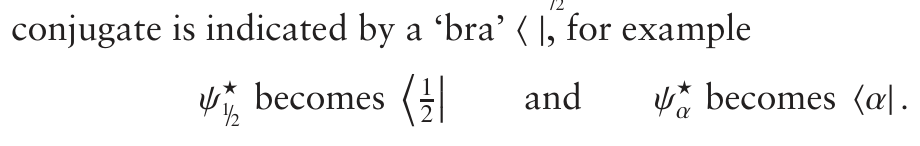

All you have to remember is that the bras and kets are just functions, and so can be manipulated as such.1

If a bra appears on the left and a ket on the right, integration is implied:

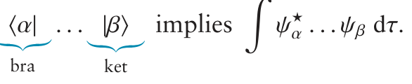

The . . . could be other functions, constants or, as is often the case, operators. The integration is with respect to the variable τ, which in quantum mechanics is a shorthand meaning ‘the full range of all relevant variables’.

It is important to note that integration is only implied if the bra is on the left and the ket on the right. So, the expression

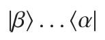

does not imply an integration.

As we have seen, ψα is an eigenfunction of Îz. This property can be expressed in two different ways:

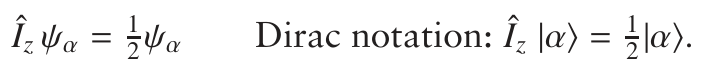

To start with, the Dirac notation might appear to add complication for little benefit, but in fact it is a more compact and elegant way of doing many manipulations. For a while we will use both notations, and move over to using only the Dirac form.

1If you are wondering how to pronounce ‘bra’ and ‘ket’, bra rhymes with car, and ket is pronounced just as it is written.

### 6.3.2 Normalization and orthogonality

A wavefunction is said to be normalized if

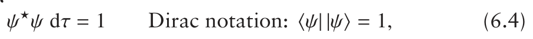

where we have written |ψ⟩ as the Dirac notation for ψ. Admittedly this is a bit redundant, but it does look odd to have an empty ket: | ⟩.

The eigenfunctions of Îz, ψα (Dirac notation: |α⟩) and ψβ (Dirac nota-

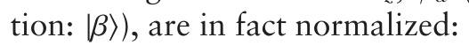

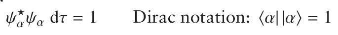

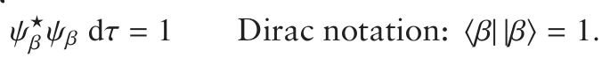

When a bra and a ket appear next to one another, it is common to leave out one of the vertical lines, so the above become

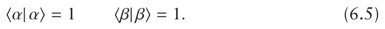

Two wavefunctions, ψ1 and ψ2, are said to be orthogonal if

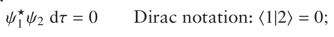

note how the subscripts from the wavefunctions have become the labels in the bra and ket. It turns out that ψα and ψβ are orthogonal

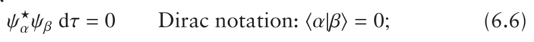

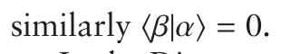

In the Dirac notation the superposition wavefunction is written

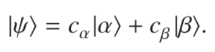

The question we want to address is whether or not this wavefunction is normalized. To answer this, we need to compute the integral of Eq. 6.4, for which we need the complex conjugate of ψ:

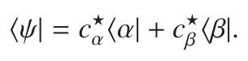

In order to take the complex conjugate of ψ we have had to take the complex conjugates of the coefficients c*α and c*β , as in general these are complex.

In Dirac notation, the integral we need is computed as follows:

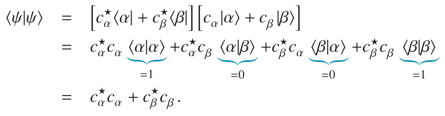

To go to the second line we have just multiplied out the square braces, remembering that the bras and kets are just functions. Then, using the fact that ⟨α| and ⟨β| are normalized, Eq. 6.5 on the facing page, we recognize that ⟨α|α⟩ = 1 and ⟨β|β⟩ = 1. Finally, using the fact that ⟨α| and ⟨β| are orthogonal to one another, Eq. 6.6 on the preceding page, we recognize that ⟨α|β⟩ = ⟨β|α⟩ = 0. Since the integral ⟨ψ|ψ⟩ is not = 1, the wavefunction

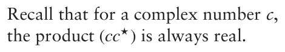

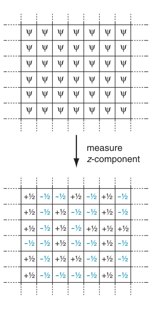

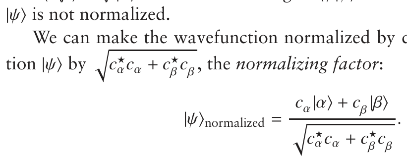

We can make the wavefunction normalized by dividing the wavefunc-

If you repeat the above calculation with this wavefunction, the integral will

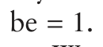

We will show later on in this chapter that the coefficients c*α and c*β change over time. However, it turns out that, no matter what happens, (c*αc*α + c*β c*β ) remains constant – in other words, the normalizing factor remains constant. All this factor does is simply scale the result of any calculation we make by a constant amount. This is not really a significant effect, so to simplify things we will assume that the wavefunction of the superposition state is normalized i.e. c*α and c*β are chosen such that

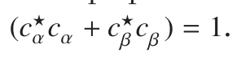

### 6.3.3 Expectation values

In section 3.2.4 on page 28 it was explained that it is a postulate of quantum mechanics that a measurement of some observable quantity will always give one of the eigenvalues of the operator which represents that observable.

**Fig. 6.1** Visualization of the process of taking an expectation value. Suppose that our spin is described by a wavefunction ψ; we imagine duplicating the spin, along with its wavefunction, a very large number of times, as shown at the top of the diagram. Then, we measure the z-component of the angular momentum; quantum mechanics tells us that the outcome of a single measurement is either +1 or −12, as these are the

For example, if we measure the z-component of the angular momentum of a spin-half nucleus, we will find either the value +12 or −12, as these are the two eigenvalues of Îz, the operator which represents the z-component.

The question is which eigenvalue will we find in a particular measurement? Quantum mechanics does not have a direct answer to this, but does give us a way of finding out what the average result of many measurements will be; this average is called the expectation value.

Imagine the following thought experiment. Suppose that the spin is described by a wavefunction ψ, and that we then duplicate this spin many, many times in such a way that each has the same wavefunction. Now we make a measurement on each spin, and then compute the average value of these measurements; the process is visualized in Fig. 6.1. It is a postulate of quantum mechanics that this average value, called the expectation value, is

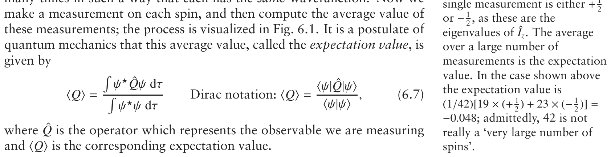

where Q̂ is the operator which represents the observable we are measuring

A good way of seeing how this works is to do a particular example. Suppose that the wavefunction is the superposition state

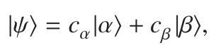

and that we are interested in the expectation value of Îz i.e. the z-component of angular momentum. As was explained in the previous section, we are going to assume that the wavefunction for the superposition state is normalized i.e. ⟨ψ|ψ⟩ = 1. As a result, the bottom of the fraction in Eq. 6.7 on the preceding page is equal to one, so the expectation value can be computed as follows:

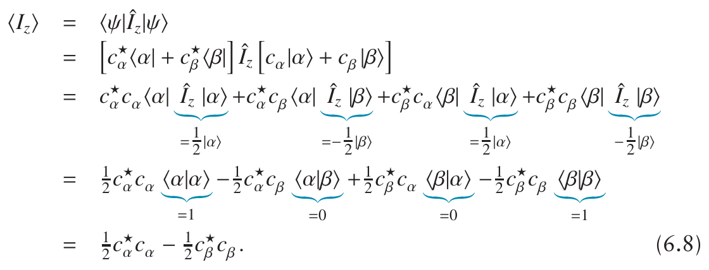

There is quite a lot going on here, so let us take things one line at a time. To go to the second line we have simply substituted ⟨ψ| and |ψ⟩ by the superposition states, and then to go to the next line we have multiplied out the square braces, taking care not to change the order of the functions and the operator. Recall that in section 3.2.2 on page 27 it was pointed out that, in general, the order of functions and operators must not be changed.

To go to the fourth line, we have simply used the fact that |α⟩ and |β⟩ are eigenfunctions of Îz (Eq. 6.2 on page 106):

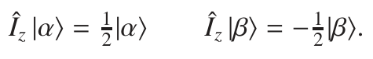

To go to the last line, we have used the fact that |α⟩ and |β⟩ are normalized and orthogonal to one another (Eqs 6.5 and 6.6 on p. 108):

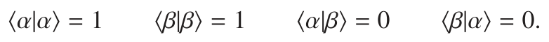

The final result,

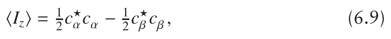

can be interpreted in the following way. Each individual measurement of the z-component gives the result +12 or −12; however, when a large number of measurements are taken, the probability of obtaining +12 is c*αc*α, and the probability of obtaining the result −12 is c*β c*β . The average value of the z-component is thus

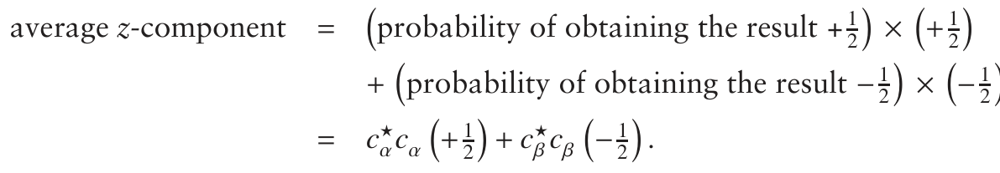

This average z-component is thus the same thing as the expectation value.

### 6.3.4 The x- and y-components of angular momentum

So far we have only referred to the z-component of the angular momentum, represented by the operator Îz. However, angular momentum is a vector property, and so has components in all three directions. The x-component is represented by the operator Îx, and the y-component by the operator Îy.

The important thing to note is that |α⟩ and |β⟩ are not eigenfunctions of Îx, nor are they eigenfunctions of Îy. In fact, it can be shown that these

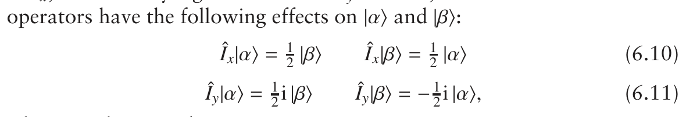

where i is the ‘complex i’.

Using these, we can work out the expectation value of Îx for the case

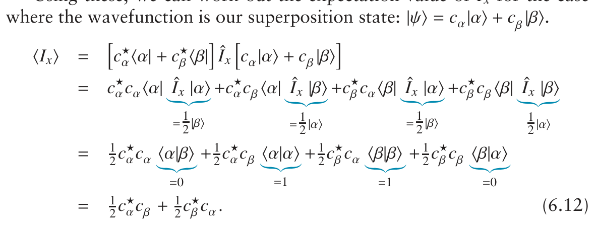

As before, going to the second line is simply a case of multiplying out the square braces, being careful to preserve the ordering of the operators and functions. To go to the third line we use Eq. 6.10 to work out the effect of Îx on |α⟩ and |β⟩. The final step is to use, as we did before, the fact that |α⟩ and |β⟩ are normalized and orthogonal (Eq. 6.5 and Eq. 6.6 on page 108).

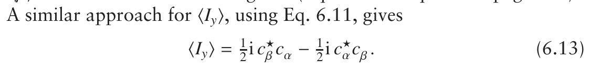

The feature to note here is that the expectation values of Îx, Îy and Îz all depend on the coefficients c*α and c*β which define the superposition state.

### 6.3.5 Matrix representations

Using the two functions |α⟩ and |β⟩ we can construct what is called a matrix representation of an operator Q̂. In this context, the two functions are called the basis functions.

As there are two basis functions, the matrix will have two rows and two columns, i.e. it will be a two-by-two matrix. The element in the ith row and jth column is given by the integral

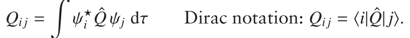

Let us suppose that the first basis function is |α⟩ and the second is |β⟩, then the matrix representation of Q̂ is

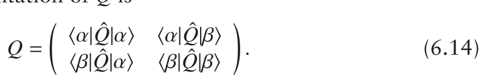

For example, the matrix representation of Îz is

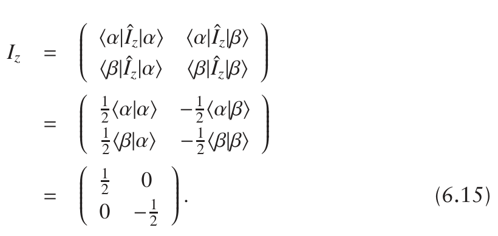

To go to the second line we have used the fact that |α⟩ and |β⟩ are eigenfunctions of Îz, and to go to the last line we have used the fact that these two basis functions are normalized and orthogonal.

Using a similar approach we can find the matrix representations of Îx and Îy as:

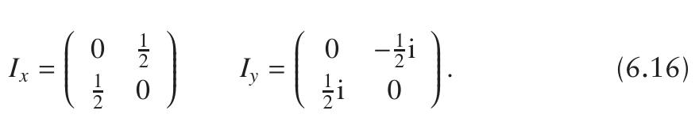

In due course, we will make much use of these matrix representations.

## 6.4 Computing the bulk magnetization

To be useful, our quantum mechanical theory must be able to compute what we actually observe in an NMR experiment, which is the transverse magnetization. In this section, we are going to look into how this is achieved, but to start with we will discuss the z-component of the magnetization as the calculation is somewhat simpler.

When we record an NMR signal it is not from one spin but from the extremely large number of spins in our sample. For example 1 cm3 of a 1 mM solution contains around 6 × 1017 solute molecules – clearly even for this rather dilute solution we are dealing with a large number of spins. Our aim is to be able to compute the bulk x-, y- and z-magnetizations from such a sample.

On the face of it, this appears to be a daunting task as each spin can in principle have a different wavefunction i.e. be in a different superposition state. It would seem that we would need to know all of these wavefunctions – clearly an impossible task. However, as we will see in the following section, the fact that there are so many spins actually makes the calculation rather simple.

### 6.4.1 The ensemble average

As was explained in section 4.1 on page 47, each spin appears to contain a source of angular momentum; associated with this is a magnetic moment, which can point in any direction. The bulk magnetization of the sample in the z-direction is found by adding up the z-component of the magnetic moment of each spin:

bulk z-magnetization = z-comp. of the magnetic moment from spin 1

+ z-comp. of the magnetic moment from spin 2

+ z-comp. of the magnetic moment from spin 3

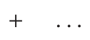

The z-component of the magnetic moment from a single spin is simply proportional to the z-component of the angular momentum, with the constant of proportionality being the gyromagnetic ratio, γ:

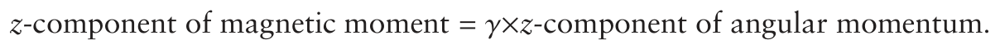

The same applies to the x- and y-components.

As has already been described in section 6.3.3 on page 109, the z-component of the angular momentum is represented by the operator Îz, and the average value of the z-component is given by the expectation value:

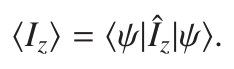

Recall that this expectation value comes from a thought experiment in which we duplicate a single spin, along with its wavefunction, a large number of times and then measure the z-component from each spin; the expectation value is the average of these measurements. However, what we are trying to calculate here is the z-magnetization from a real sample, rather than an imagined set of spins which all have the same wavefunction. In general, in a real sample each spin has a different wavefunction i.e. the coefficients c*α and c*β in the superposition state are different for each spin.

We extricate ourselves from this difficulty in the following way. Although in principle each spin can have a different wavefunction, for a sample containing 1017 spins, there must be a large number of spins which have, to some level of approximation, the same wavefunction. A useful analogy here is to think about the individual weights of all the people in London. If we weighed each person to a precision of 0.25 kg, we would find that there are a lot of people with the ‘same’ weight; if we made the measurement to a precision of 0.5 kg, the numbers with any particular weight would be even higher. The point is that, for a sufficiently large sample, there will always be many people with the ‘same’ weight, regardless of how closely we define what ‘the same’ means.

Consider the first spin, whose superposition state is

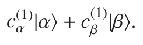

Following the line above, we argue that in our sample there are many spins which have a wavefunction very similar to this. On average, the contribution of each of these spins to the z-component is given by the expectation value:

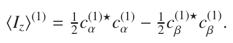

The same argument applies to the second spin, whose superposition state is

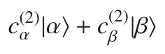

and which contributes

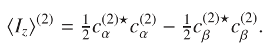

The total z-magnetization is the sum of the z-components of each spin, multiplied by γ

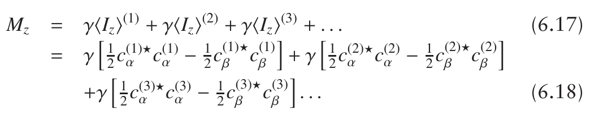

Each spin in the sample contributes to this sum.

The usual way of writing this sum is

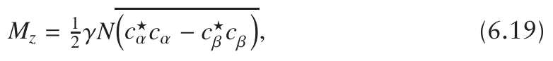

where the line indicates an ensemble average and N is the number of spins in the sample (called the ensemble).

Taking the ensemble average means adding up the contributions from each spin in the ensemble, as shown in Eq. 6.18, and then dividing by the number of spins to obtain an average. To compute the bulk magnetization from the N spins in the sample we need to multiply by N as the ensemble average is the average contribution per spin.

Another way of expressing the z-magnetization is to write Eq. 6.17 as

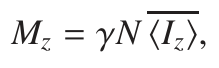

where the bar indicates the ensemble average of the expectation values of Îz from each spin. ⟨Iz⟩ is found, as before, by adding up the contribution from each spin and dividing by the number of spins in order to obtain an average:

Using a similar argument, the x- and y-magnetizations are given by the following ensemble averages (for completeness we include the expression for Mz):

The difficulty we still have not got round is the need to know the wavefunction for each spin, as from these three equations it still looks as if we need to know this in order to compute the magnetization. However, in the next section we will find that by introducing the idea of populations we will finally be in a position to compute Mz.

### 6.4.2 Populations

In section 6.3.3 on page 109 we introduced the interpretation that, when measuring the z-component of angular momentum, the probability of obtaining +1

2 is c*αc*α, and the probability of obtaining the result −12 is c*β c*β . These two values of the z-component are associated with the two energy levels of a single spin, and so we can extend this interpretation by saying that c*αc*α is ‘the probability of finding the spin in the energy level |α⟩’, and

The probability of finding a particular spin in the level |α⟩ is c*αc*α. If we add up these probabilities for all the spins in the sample we will find the number of spins which, on measurement, are in the level α. We can interpret this number as the population of the level α, nα:

Similarly the population of level β is

Recalling that the ensemble average of c*αc*α is found by adding up the contribution from each spin and then dividing by N, it follows that

Using this expression in Eq. 6.22 on the preceding page, we can rewrite the bulk z-magnetization as

In words, the z-magnetization is proportional to the population difference between the two energy levels.

At equilibrium, these populations are predicted by the Boltzmann distribution:

where Eα and Eβ are the energies of the two levels (in J), kB is Boltzmann’s constant, T is the temperature and N is the total number of spins. As (for positive γ) the α state has the lower energy, the Boltzmann distribution predicts that nα,eq > nβ,eq, and so at equilibrium the sample will have a bulk z-magnetization.

Combining Eqs 6.24 and 6.25 we can compute this equilibrium z-magnetization as

The key point here is that, as we have a large number of spins, we can use the Boltzmann distribution to find the equilibrium populations and hence the equilibrium z-magnetization. We do not need to know the wavefunction of each spin in the sample.

### 6.4.3 Transverse magnetization

The next point to address is whether we can say anything useful about the size of the x- and y-magnetizations. Following the same line of argument as above, and using Eq. 6.20 on page 114, the x-magnetization is given by

To make further progress, it is convenient to write the complex coefficients c*α and c*β in terms of a (real) magnitude r and a phase φ:

Note that the complex conjugates are formed by changing the sign of the argument to the exponential. By definition the r are real and so are unaffected by taking the complex conjugate.

Using this way of writing the coefficients, the expectation value of Îx can be written:

This can be tidied up further by using the identity

to give

Using this, the bulk x-magnetization can be written

As before, we have used the overline to indicate an ensemble average.

We now introduce the hypothesis that, at equilibrium, the phases φ are randomly distributed. As a result (φβ−φα) is also randomly distributed, and therefore the average of cos (φβ − φα) over the sample is zero. This comes about because positive and negative values of the cosine function cancel one another out. Therefore, at equilibrium the x-magnetization is zero.

A similar calculation for the y-magnetization gives

It is clear that this is also zero if the phases are randomly distributed.

Another way of looking at this is to say that, as we know from experiment that at equilibrium there is no x- or y-magnetization, the implication is that the phases are randomly distributed.

Just for completeness we will compute the z-magnetization using this form of the coefficients

where to go to the last line we have used exp (0) = 1. In contrast to the case

The z-magnetization is thus

### 6.4.4 A comment on the units

We need to be a little careful here about the units. Recall from section 3.4 on page 34 that we decided it would be convenient to omit a factor of ℏ and write the eigenvalue equation for Îz as

rather than

As a result of this choice, our expression for Mz is also missing a factor of ℏ, and so is dimensionally incorrect. If we put this factor back into our calculations we find

and so

For most purposes, this will make no difference, but it is as well to be aware what is going on. For the remainder of the discussion, we will continue to omit the factor of ℏ.

## 6.5 Summary

We have introduced a lot of new ideas so far, so a quick summary of the really crucial points will not go amiss.

- Each spin is in a superposition state, which can be written as a linear

The coefficients c*α and c*β are complex numbers which vary with time, and are different for each spin in the sample. The coefficients can be chosen (or scaled) so that the wavefunction ψ is normalized.

The functions are also normalized and orthogonal to one another:

- Repeated observation of the variable corresponding to an operator Q̂

- For the superposition state, the expectation values of the three components of angular momentum are

- The components of the bulk magnetization are given by

where the overbar indicates an ensemble average, which means adding up the contributions from each spin in the sample and then dividing by the number of spins.

- The z-magnetization can be written in terms of the populations of the two levels, nα and nβ:

- At equilibrium, the z-magnetization depends on the equilibrium populations, which are predicted by the Boltzmann distribution. The equilibrium x- and y-magnetizations are zero.

## 6.6 Time evolution

So far we have been studiously avoiding the issue of time in quantum mechanics, but we know that time evolution is of central importance in NMR, so it is clearly essential that we extend our understanding of quantum mechanics to include such evolution. The way in which the wavefunction changes over time is predicted by the time-dependent Schrödinger equation:

In this equation we have written ψ(t) to remind ourselves that the wavefunction is a function of time.

The derivative on the left tells us how the wavefunction varies with time, and the equation says that this variation depends on the Hamiltonian. We have met the Hamiltonian before (section 3.2.5 on page 29) as the operator for energy; now we see it playing an even more crucial role in determining the time-evolution of the wavefunction.

As the wavefunction varies with time, so do the expectation values we have computed in the previous section. Thus, working out the time evolution of the wavefunction will enable us to find the time evolution of the magnetization.

We will now try to solve the time-dependent Schrödinger equation (TDSE) for two cases which are of great interest to us. The first is for free precession and the second is for an RF pulse.

### 6.6.1 Free evolution

For a single spin, the Hamiltonian for free evolution (i.e. in the absence of an RF field) is

This Hamiltonian is written in the rotating frame, so the frequency is the offset Ω, rather than the Larmor frequency ω0. As was explained in section 4.4.2 on page 55, the offset is the difference between the Larmor frequency and the rotating frame frequency. We will do all of our calculations in the rotating frame as, just as was the case for the vector model, such a choice makes it possible to analyse the effect of an RF pulse. The Hamiltonian is also written in angular frequency units.

The superposition state of our single spin is

where we have written c*α(t) to remind ourselves that it is the coefficients c*α(t) and c*β (t) which will vary in time. The basis functions |α⟩ and |β⟩, are time independent.

Solving the TDSE in this case is not too difficult, but the algebra is perhaps a little intricate at times. To start with simply substitute Eq. 6.30 and the form of the Hamiltonian (Eq. 6.29) into the TDSE:

Let us look at what we have done line by line. To go to the second line we have just substituted |ψ(t)⟩ using Eq. 6.30 on the preceding page, and the Hamiltonian for the free precession, Eq. 6.29. Multiplying out the brackets takes us to the third line. Then we recognize that |α⟩ is an eigenfunction of

after a little tidying up, to the fourth line.

We now employ a ‘trick’ which is commonly used in quantum mechan-

The derivatives of c*α and c*β , and the quantities in square braces on the right, are all just numbers so we can move them around as we like to give:

To go to the second line we have utilized the by now familiar property that |α⟩ is normalized, hence ⟨α|α⟩ = 1, and that |α⟩ and |β⟩ are orthogonal, hence ⟨α|β⟩ = 0. The result of all of these rather lengthy manipulations is the relatively simple differential equation, Eq. 6.32.

This equation tells us how c*α(t) varies with time, which is what we are trying to work out. The solution to this equation is well known as it occurs in all kinds of physical and mathematical problems; it is

where c*α(0) is the value of the coefficient at time zero.

To show that this is a solution all we need to do is to substitute the expression for c*α(t) into the left of Eq. 6.32, and then compute the derivative:

We have therefore shown that dc* exactly what Eq. 6.32 on the preceding page says, so Eq. 6.33 is the solution

If we go back to Eq. 6.31 on the facing page and left multiply by ⟨β|

Note that all that is different between the expressions for c*α(t) and c*β (t) is the sign in the exponential term.

### 6.6.2 What this all means

**Fig. 6.2** Illustration of the time dependence of the coefficients c*α and c*β during a period of free precession. The real and imaginary parts of the coefficients are plotted along the x- and y-axes, respectively. The blue dots represent the motion of c*α, with the large blue dot representing the value at time zero; the black dots similarly represent c*β. The starting values are arbitrary, and successive dots indicate the coefficients at equal time intervals. Both coefficients follow a circular path which is a result of the phase modulation predicted by Eq. 6.34; each coefficient has constant magnitude, i.e. the distance to the origin, given by c*α(t)c*α(t) or c*β(t)c*β(t), is fixed. Note that the two coefficients proceed in opposite directions on account of the corresponding eigenvalues having different signs.

The problem we set out to solve is how the superposition state

evolves in time under the influence of the free precession Hamiltonian

The solution is that the coefficients vary according to

where cα(0) and cβ(0) are the coefficients at time zero. It is useful to remind ourselves that |α⟩ and |β⟩ are eigenfunctions of the free precession Hamiltonian, ΩÎz:

Recalling these, we can see that Eq. 6.34 says that each coefficient oscillates in phase at a frequency which depends on the corresponding eigenvalue of the Hamiltonian (in fact, the oscillation is as minus the corresponding eigenvalue). This phase oscillation is illustrated graphically in Fig. 6.2.

In the next section we will explore the effect that these oscillations have on the expectation values of the different components of angular momentum, and hence on the magnetization.

### 6.6.3 Effect of free evolution

In section 6.3.3 on page 109 we found that the expectation value of the z-component of angular momentum was (Eq. 6.9 on page 110)

We can now substitute in the values of c*α(t) and c*β (t) from Eq. 6.34 on the previous page so that we can find out how the expectation value changes with time:

To go from the second line to the last we have recognized that

the z-component of angular momentum is not affected by free evolution. This is hardly a surprise: as we have seen in the vector model, free evolution is a rotation about the z-axis, and so we do not expect the z-component to be affected by such a rotation.

The x-component behaves in a more interesting way. The expectation value is given by Eq. 6.12 on page 111:

In contrast to the z-component, the expectation value of the x-component oscillates at frequency Ω. This is, of course, exactly the frequency of precession in the rotating frame, so it should not come as a surprise.

The final expression for ⟨Ix⟩(t) can be simplified by writing the complex exponentials in terms of sines and cosines using the identities:

Then Eq. 6.35 on the preceding page can be re-expressed as

On the third line we recognize that the quantity in the first square brace is simply ⟨Ix⟩ at time zero (Eq. 6.12 on page 111), and similarly the quantity

This says something entirely familiar, which is that if we start out at time zero with a vector along −y, after time t the vector has precessed through an angle Ωt generating an x-component proportional to the sine of this angle.

A similar calculation for the y-component of the angular momentum gives

Again, this is a familiar result as it shows that a vector aligned initially along x rotates through an angle Ωt towards y; this is visualized in Fig. 6.3.

It is important to realize that these expressions refer to the x- and y-components of a single spin. To work out the components of the bulk magnetization we need to multiply by γN and take the ensemble average, as in Eqs 6.20 and 6.21 on p. 114:

**Fig. 6.3** Visualization of the predictions of Eq. 6.36; the horizontal and vertical axes represent the expectation values of the x- and y-components of the angular momentum. The blue vector depicts the initial condition (t = 0) in which the expectation values are ⟨Ix⟩(0) and ⟨Iy⟩(0). After time t, the vector has rotated through an angle Ωt to the position given by the dark grey vector. The y-component of this vector clearly depends on both the x- and y-components at time zero, as given by Eq. 6.36.

These relationships show how the components of the magnetization evolve over time, and they predict an oscillatory interchange of the x- and y-components; these predictions are identical to those of the vector model. We now turn our attention to the somewhat more complex case of the effect of an RF pulse.

## 6.7 RF pulses

As we saw in Chapter 4, an RF pulse results in a transverse magnetic field B1 appearing in the rotating frame, and if we are on resonance (or the pulse is strong) this is the only field present in the rotating frame. We also saw that the magnetization rotates about this field at a frequency ω1 = |γB1|. It should come as no surprise therefore, that the Hamiltonian (in the rotating frame) for an on resonance or strong pulse about the x-axis is

Comparing this with the free precession Hamiltonian Ĥfree = ΩÎz (Eq. 6.29 on page 119), we see that the operator is now Îx rather than Îz; this is because the magnetic field is now along x rather than z. The frequency has changed from the offset Ω to ω1, the rate at which the RF field rotates the magnetization.

To work out what effect this Hamiltonian has on our superposition state all we have to do is solve the TDSE, just as we did before. However, finding the solution turns out to be rather more complex than before as |α⟩ and |β⟩ are not eigenfunctions of Îx (and hence of Ĥpulse). We will not therefore go into all the details, but simply quote the results.

The differential equations for the coefficients turn out to be

Comparing these with the equivalent differential equations for free evolution, Eq. 6.32 on page 120, we see that the additional complication for the effect of the pulse is that the rate of change of cα depends on cβ, and vice versa. The solutions to these equations can be obtained by standard methods and are:

**Fig. 6.4** Illustration of the time dependence of the coefficients c*α and c*β during an RF pulse; the motion of the coefficients is represented in the same form as in Fig. 6.2 on page 121. The motion of the coefficients for the case of a pulse is very different to that for free precession shown in Fig. 6.2. First, the paths are not circular; secondly the magnitude of the coefficients change (i.e. their distance from the origin changes), and finally the paths proceed in the same direction. What this diagram represents is an oscillatory interchange between c*α and c*β.

Compared with free evolution (Eq. 6.34 on page 121), these results are more complex as the value of cα at time t depends on both cα and cβ at time zero. What is happening here is that the Hamiltonian is causing a mixing between the states |α⟩ and |β⟩, resulting in an oscillatory interchange of the two coefficients, which is represented graphically in Fig. 6.4.

It is interesting to compare this figure with the corresponding one for free precession, Fig. 6.2 on page 121. In the case of free precession, the coefficients are simply phase modulated and so proceed on circular paths; their magnitudes, represented by the distance from the origin, remain constant. In contrast, during a pulse the magnitudes of the coefficients change as a result of the oscillatory interchange between the two coefficients.

### 6.7.1 Effect on the components of angular momentum

Now that we have the values of c*α and c*β at any time, we can compute the expectation values of the x-, y- and z-components of the angular momentum, as these are related to the coefficients in the following ways (section 6.3.3 on page 109)

We have written ⟨Ix⟩(t) etc. to remind ourselves that, as the coefficients depend on time, so will the expectation values.

If we substitute the expression from Eqs 6.37 and 6.38 into the above relationships for ⟨Ix⟩(t) etc., we obtain, after some tedious but essentially straightforward manipulation:

These expressions can be simplified greatly if we recognize that the quantities in square braces are the expectation values of the various components of the angular momentum at time zero, i.e.

With these substitutions, things look rather simpler:

These relationships are relatively easy to interpret. First, we see that the x-component simply does not change, but retains the same value it had at time zero. Given that we have chosen the pulse to be about the x-axis, it is not surprising that the x-component is unaffected.

The expression for the y-component, Eq. 6.41, predicts an oscillatory interchange of the y- and z-components. For example, if we choose the

z-component is rotated onto y by a pulse with a flip angle of π/2 radians or 90◦.

Similarly, the z-component, Eq. 6.42, shows an oscillatory interchange of the y- and z-components. In other words, it represents a vector rotating in the yz-plane at frequency ω1.

### 6.7.2 Effect on the components of the bulk magnetization

The results in the previous section tell us how the individual components of the angular momentum from a single spin evolve over time. However, what we want to know is how the bulk magnetization evolves over time. As was explained in section 6.4 on page 112, we find the bulk magnetization by taking the ensemble averages of the expectation values of the individual components of the angular momentum.

From Eqs 6.20, 6.21 and 6.22 on page 114, we have

If we take the expression for ⟨Iy⟩(t), Eq. 6.41 on the preceding page, compute the ensemble average and multiply by γN, we obtain

which, using Eq. 6.43, we recognize is the same thing as

Using the same approach for each of the components, we can use Eqs 6.40 to 6.42 to determine the three components of the bulk magnetization as

These relationships predict exactly the same outcome of an x-pulse as the vector model: x-magnetization is unaffected, whereas y- and z-magnetization are rotated into one another i.e. the magnetization vector rotates in the yz-plane.

If we assume that the magnetization is at equilibrium at time zero, we can write

where M0 is the equilibrium magnetization. Using these values in Eqs 6.44 to 6.46, gives

This is a result we are very familiar with: the equilibrium magnetization is

## 6.8 Making faster progress: the density operator

We have now developed the theory to the point where we can predict the time evolution of the components of the bulk magnetization during free precession and during RF pulses. However, you would be forgiven for thinking that an enormous amount of labour has been needed to derive some essentially trivial results!

The reason that everything is such hard work is that the calculations involve a three-stage process: first, we solve the TDSE using the relevant Hamiltonian; then we compute the components of the angular momentum of a single spin; finally, we compute the ensemble average to find the bulk magnetization.

What we need to find is a way of saving some of this labour. The first step is to notice that the components of the angular momentum are always expressed in terms of particular products of the two coefficients c*α and c*β :

What is more, when we take the ensemble averages, it is these products which are subject to the averaging process.

These observations lead us to wonder if there is some way of reformu-lating the theory so that the products of the coefficients, and their ensemble averages, appear in a more convenient way. It turns out that by introducing the density operator (also called the density matrix) such a simplification can be achieved.

### 6.8.1 Introducing the density operator

The density operator ˆρ is defined as

As before, the overbar indicates taking an ensemble average, which means adding up the contributions from each spin in the sample and then dividing by the number of spins.

You might think that the definition of Eq. 6.47 makes it look as if ˆρ is a function, not an operator. However, we can see that it is indeed an operator by forming its matrix representation, as described in section 6.3.5 on page 111. Following the general form given in Eq. 6.14 on page 111, the matrix representation of ˆρ is

Each of the matrix elements can be evaluated by using Eq. 6.47 and the known properties of |α⟩ and |β⟩. As an example, let us work out the top right-hand element i.e. that in row 1 and column 2, the element ρ12. To avoid clutter, we will leave out the overbar which indicates ensemble averaging until the last line.

To go to the second line, the definition of ˆρ has been inserted, and then on the third line |ψ⟩ and ⟨ψ| have been expressed as the superposition of |α⟩ and |β⟩. The right-hand square bracket is then multiplied out to give line four, and then we use the properties that |α⟩ and |β⟩ are orthogonal and normalized to go to the next line. Repeating the same procedure with the left-hand bracket carries us to the end of the calculation. Finally, we recall that the density operator, and its matrix elements, are defined as an ensemble average, which is why the overbar has been inserted on the final line.

Applying the same procedure gives the other elements as

Thus the complete matrix representation of the density operator is

Remember that the coefficients cα and cβ vary with time, so ˆρ is therefore a function of time. Things are already looking hopeful as the elements of this matrix are the ensemble averages of the products of the coefficients – the quantities which always appear when we compute the components of the bulk magnetization.

### 6.8.2 Calculating the components of the bulk magnetization

The really convenient feature of the density operator is that we can compute the bulk magnetization directly from the matrix form of the operator. For example, the x-magnetization, given by

can be written in terms of the elements of the density operator (Eq. 6.48)

Similarly, My and Mz are

The important point here is that the ensemble averaging is contained within the density operator, so we can compute the bulk magnetization directly from the density operator. This is an important advantage of this approach.

### 6.8.3 Equilibrium density operator

Recall from section 6.4.2 on page 115 that c*αc*α and c*β c*β are related to the populations, nα and nβ, of the two states (Eq. 6.23 on page 115):

The two diagonal elements of the matrix representation of the density operator are thus nα/N and nβ/N.

In section 6.4.3 on page 116 we also argued that, at equilibrium, the ensemble averages c*αc*

β and c*β c*α are zero. So, at equilibrium, the two off-diagonal elements of the matrix form of the density operator are zero.

We can thus write the equilibrium density operator as

where nα,eq and nβ,eq are the equilibrium populations.

This is rather a nice result as it gives us a starting point for the calculation since all of our experiments will start with a sample which has come to equilibrium. The final thing we need to know is how the density operator varies with time.

### 6.8.4 Time evolution of the density operator

Starting from the TDSE, Eq. 6.28 on page 119:

it can be shown that the equivalent equation of motion for the density operator is

this is known as the Liouville–von Neumann equation. The order in which operators act is important, so Ĥ ˆρ is not the same thing as ˆρ Ĥ.

It can be shown that the solution to Eq. 6.50 is

where ˆρ(t) is the density operator at time t and ˆρ(0) is the density operator at time zero.

You would be forgiven for thinking that this does not look like much of a ‘solution’ to the problem. However, it turns out that exp (±i Ĥt) can be expressed in matrix form, just in the same way as is possible for ˆρ. So, the right-hand side of Eq. 6.51 is in fact just the multiplication of three matrices together, which is a trivial task.

However, we are not going to describe how these matrix forms of exp (±i Ĥt) are found, as there is another way to approach the use of the density operator which avoids the need for matrices, and results in a much more intuitive method of calculation. This approach casts the whole problem in operators, as described in the next section.

### 6.8.5 Representing the density operator using a basis of

### operators

We are familiar with the idea that the position of any point in space can be described by specifying its x-, y- and z-coordinates. Part of the reason why this approach is useful is that the x-, y- and z-directions are all orthogonal to one another i.e. the angles between them are all 90◦. This means that, for example, changing the x-component does not change the other components.

Expressed somewhat more formally, we have three orthogonal unit vectors pointing along the x-, y- and z-directions. The vectors have unit length (hence their name), and are denoted ex, ey and ez. Any vector can be expressed as a linear combination of these three unit vectors:

where ax gives the component in the x-direction and similarly ay and az are the components along y and z, respectively. The vectors (ex, ey, ez) are said to be basis vectors.

In a similar way, a matrix can be expressed as a linear combination of a basis set of other matrices. For example, it turns out that the matrix representation of the density operator, for an ensemble of spin-half nuclei, can be expressed as a linear combination of the matrices representing Îx, Îy, Îz and a fourth matrix which we shall call E. These matrix representations were introduced in section 6.3.5 on page 111 (Eq. 6.15 and Eq. 6.16 on page 112), and are repeated here for convenience, along with the definition

These matrices are orthogonal to one another in an analogous way to the unit vectors along x, y and z. Two matrices, A and B, are said to be orthogonal if the trace of their product is zero:

The trace of a matrix, denoted Tr{M}, is the sum of its diagonal elements.

This is best illustrated by way of an example: let us consider the product of the matrix representations of Îx and Îz:

The trace of this final matrix is the sum of the elements along the diagonal i.e. elements 1,1 and 2,2; clearly in this case the trace is zero, so the matrix representations of Îx and Îz are orthogonal. Similar calculations will show that any two of the four basis operators are also orthogonal in this sense.

We now write the density operator in terms of a linear combination of the four basis operators:

If the operators are written in their matrix forms, this combination is

Adding up all of these terms, the matrix form of the density operator is

Note that ax and ay only appear on the off-diagonal elements, whereas aE and az only appear on the diagonal elements.

In section 6.8.2 on page 128 we noted that the really useful feature of the density matrix was that we could compute the bulk magnetizations directly from its elements. Repeating the results from that section, it was shown that

Using the elements of ρ from Eq. 6.53, we find

Now this really is a very nice result, as it says that if we write the density operator as the linear combination of operators, Eq. 6.52 on the preceding page, we can extract the value of the bulk magnetization just by inspecting the values of the coefficients ax etc. Note that the coefficient aE does not contribute to any of the magnetizations.

We will see in the next chapter that, by using this operator expansion we can work out the time evolution of the system without solving the TDSE directly, taking any ensemble averages or working with matrices. The resulting approach is thus very convenient to use, and indeed it is the one we will use exclusively in the rest of the book. The practical details of how calculations are actually made using this approach are described in the next chapter.

### 6.8.6 The equilibrium density operator – again

In section 6.8.3 on page 128 we showed that at equilibrium the matrix representation of the density operator, ˆρeq, was

where nα,eq and nβ,eq are the equilibrium populations of the two levels.

These equilibrium populations can be computed using the Boltzmann distribution (Eq. 6.25 on page 115):2

2The factor of 12 in these expressions is 1/q, where q is the partition function. In this case

The energy of interaction of the spins with the magnetic field is very much less than the thermal energy, which means that Em/kBT is very small. As a result, the exponential terms can be well approximated using exp (x) = 1+ x to give

This can be further simplified by recalling that the energies are (in J)

From these it follows that the average population, nav = 12(nα,eq + nβ,eq), is

The populations of the two levels can therefore be written

and so the equilibrium density operator becomes

This equilibrium density matrix can be written in terms of the matrix representations of Ê and Îz in the following way:

It turns out that the matrix Ê never leads to any observable magnetization, so this term can simply be omitted without causing any problems to our calculations. So, the equilibrium density operator (sometimes called the reduced density operator on account of the missing Ê term) is simply

where kI = Δn/N. The value of the constant kI depends on the number of spins in the sample, the temperature and the exact spacing between the two energy levels.

Referring back to the operator expansion of ˆρ, Eq. 6.52 on page 130, we see that at equilibrium only the coefficient az is non-zero:

Using Eq. 6.54 on page 131, we can therefore write the z-magnetization as

All experiments start with equilibrium magnetization, so in calculating the result of any experiment every term will be prefaced by the constant factor (γNkI). All this factor does is set the overall size of the equilibrium magnetization and hence the subsequent size of the signal we observe. In NMR, we have no useful way of measuring the absolute size of the signal – rather what we are interested in is how the signal evolves over time. So, for simplicity and convenience we usually ignore the factor kI which sets the size of the equilibrium density matrix, and write:

Similarly, when computing the components of the magnetization we ignore the factor γN which simply scales the value. As a result, we can write very simply, but rather informally:

### 6.8.7 Summary

In this section we have shown how the density operator is an alternative to working directly with the wavefunction. The density operator includes the effects of ensemble averaging in such a way that the components of the bulk magnetization can be computed directly. We went on to show that an operator expansion of the density operator makes it particularly straightforward to extract the value of the components of the bulk magnetization. In the next chapter we will go on to show how practical calculations can be performed using this operator approach, and how it can be extended straightforwardly to coupled spin systems.

Here is a summary of the key points.

- The density operator is defined as

note that ensemble averaging is included in this definition.

- The density operator evolves in time according to

- The density operator can be expanded as a linear combination of

- To within a constant scaling factor, the components of the bulk

magnetization are given simply by the coefficients in this expansion

- At equilibrium the density operator is simply Îz.

## 6.9 Coherence

In section 6.4.3 on page 116 we noted that, at equilibrium, the x- and y-components of the bulk magnetization are zero on account of the randomly distributed phases of the contributions from each spin in the ensemble. For example,

However, we saw in section 6.7 on page 123 that transverse magnetization is generated when an RF pulse is applied to equilibrium magnetization. In quantum mechanics this transverse magnetization is described as being the result of the presence of a coherence in the sample. In this section we will explore what this term coherence means.

In section 6.7.1 on page 124 we saw that, after an RF pulse, the expectation value of the y-component of angular momentum was given by (Eq. 6.39 on page 125):

Remember that this refers to a single spin. The equation predicts that from this single spin there is a y-component, whose size depends on the coefficients c*α and c*β at time zero, i.e. before the pulse.

However, what we are able to detect is the bulk magnetization, which is the sum of the contributions from each spin; to compute this sum, we take the ensemble average

Now if the spins are at equilibrium at time zero, the first term in square braces is zero on account of the random distribution of the phases at equilibrium. However, the second term in square braces is not zero, but in fact equal to (nα − nβ)/N, as was explained in section 6.4.2 on page 115. So, the y-magnetization is

In words, what all of this says is as follows. At equilibrium, the phases of the superposition states are randomly distributed, so there is no bulk transverse magnetization. However, as the two energy levels (α and β) are not equally populated, there is z-magnetization; we can describe this as a polarization of the sample along the z-direction. When a pulse is applied, y-magnetization is generated and, according to Eq. 6.56, this magnetization is proportional to the original polarization along the z-axis, (nα − nβ). If there was no polarization along z at time zero (i.e. nα = nβ), then the pulse would not generate any y-magnetization. All the pulse really does is to rotate the axis along which the polarization is aligned from z to y.

Transverse magnetization is described as being the result of a coherence amongst the spins. Sometimes it is implied that a coherence is an ‘alignment of the spins’ which is brought about by the pulse – phrases such as ‘the pulse brings the spins into alignment’ or ‘the wavefunctions are aligned by the pulse’ are commonly encountered. However, all of these phrases are misleading since, as we have seen, the pulse does not create an alignment or alter the phases of the spins in some magic way: all the pulse does is to rotate a polarization from z to y.

It is important that each spin in the ensemble experiences the same RF field. If this is the case, then each spin behaves in a way described by Eq. 6.55 on the facing page, so that when the ensemble average is taken the second term is indeed the z-magnetization. If, for example, the value of ω1 were to vary across the sample, then the sine and cosine terms would vary from place to place, and it would be quite easy for the ensemble average of both terms to be zero. When there is a coherence present in the sample, this has been generated by the individual spins in the sample all experiencing the same interaction with the applied RF field in such a way that a polarization along z has been rotated to another direction. Without the initial polarization along z, a pulse cannot generate a coherence.

## 6.10 Further reading

A detailed discussion of the quantum mechanics of a one-spin system:

Chapters 6–11 from M. H. Levitt, Spin Dynamics (2nd edition, John

Wiley & Sons, Ltd, 2008).

The postulates of quantum mechanics; angular momentum:

Chapters 1 and 4 from P. W. Atkins and R. Friedman, Molecular

Quantum Mechanics (4th edition, Oxford University Press, 2005).

## 6.11 Exercises

To really get to grips with the material in this chapter, it is very instructive to work through every line in all the equations. By doing this, you can be sure that you have understood the logic of the argument, and each step in a derivation or proof. Just reading the equations and saying ‘I see what is going on’ is not the same thing as actually working through things for yourself.

6.1 Write the following in Dirac notation:

Express the following statements in Dirac notation: (a) ψα is normalized; (b) ψα and ψβ are orthogonal; (c) ψα is an eigenfunction of Îz with eigenvalue 12; (d) ψ can be expressed as a linear combination of ψα and ψβ.

6.2 If the wavefunction for a single spin is given by

6.3 Using the approach of section 6.3.5 on page 111, show that

6.4 Given that

and expressing the coefficients in r/φ format:

show that

Hence show that the bulk y-magnetization is given by

What value do you expect this to take at equilibrium?

6.5 Using the approach of section 6.6.1 on page 119, show that

Show, by substituting Eq. 6.58 into Eq. 6.57, that the solution to this differential equation is

6.6 Using the approach of section 6.6.3 on page 122, show that, during a period of free evolution, the expectation value of Îy evolves according to

Give a graphical interpretation of this result.

6.7 Using the approach described in section 6.8.1 on page 127, show that for a spin described by the wavefunction

the matrix representation of the density operator is given by

