# Product operators

In this chapter we are going to introduce a quantum-mechanical method for calculating the outcome of a multiple-pulse NMR experiment by representing the state of the spin system using a combination of operators. The background as to how and why this approach works was given in the previous chapter; however, in this chapter we will simply present the method as a recipe which you can apply systematically. The method is exact, and is capable of dealing with the majority of modern pulse sequences.

To start with we will consider a system of uncoupled spins. This is the same system to which the vector model applies, so we will be able to verify our calculations by comparing them with what we found in Chapter 4. However, the real strength of the operator approach is its ability to deal with coupled spin systems, so we will spend some time showing how this is done and illustrating the method with various applications. For coupled spin systems it turns out that we need to use products of operators, hence this approach is usually called the product operator method.

Using product operators we will be able to understand most of the important building blocks from which modern multi-pulse NMR experiments are constructed, such as the J-modulated spin echo and coherence transfer by pulses. Once we have grasped how these key elements work, the analysis of even rather complex pulse sequences becomes quite straightforward.

## 7.1 Operators for one spin

We are going to start out by thinking about a spin system which consists of just a single spin one-half, without any couplings to other spins. Our sample will contain a very large number of these spin systems, which we will assume are not interacting with one another. This collection of identical spin systems is called an ensemble, so our NMR sample can be described as an ensemble of non-interacting single spins.

Based on the discussion in Chapter 6, we assert that everything about this ensemble can be calculated from a knowledge of the density operator ˆρ. Furthermore, for a one-spin system, this operator can be expressed as a linear combination of the operators Îx, Îy and Îz:

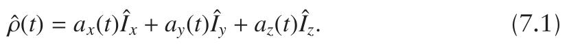

The operator Îz represents the z-component of the spin angular momentum; we met this operator before in section 3.2.5 on page 29 where we used it to write the Hamiltonian. Similarly, Îx and Îy represent the x- and y-components of the spin angular momentum.

The coefficients ax(t), ay(t) and az(t) are just numbers which vary with time. The really useful thing about writing the density operator in this way is that the amount of x-, y- and z-magnetizations are very simply related to these coefficients:

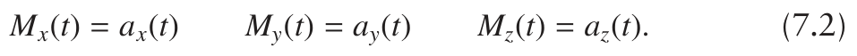

So, once we know the coefficients we can work out the components of the magnetization from the sample, and how these vary with time: this represents a complete knowledge of the state of the spin system at any time.

To be entirely correct, we should note that Mx is proportional to ax, not equal to it. However, the constant of proportion is the same for all the components and has no real effect on our calculation other than to scale the answer. In NMR we have no practical way of measuring the absolute size of the magnetization, so this scaling is of no consequence; for simplicity it is therefore usual just to ignore the constant of proportion and write Mx = ax.

We need to know how the density operator evolves in time, and it turns out that this is given by

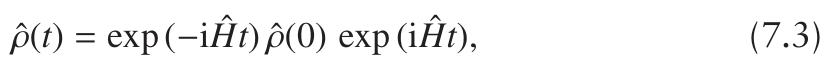

where ˆρ(0) is the density operator at time t = 0, and ˆρ(t) is the operator after time t. Ĥ is the Hamiltonian which is relevant for the period of time 0 to t; we will specify what these relevant Hamiltonians are in the following section. Although it looks daunting, it turns out that the right-hand side of Eq. 7.3 is quite straightforward to evaluate using a simple recipe which we will introduce shortly.

### 7.1.1 Hamiltonians for free precession and pulses

The idea of the Hamiltonian as the operator for energy was introduced in section 3.2.5 on page 29. However, the Hamiltonian plays a far more important role than simply determining the energy: it is the operator which determines how the spins evolve in time. For pulsed NMR, time evolution is of central importance, so a knowledge of the Hamiltonian is crucial.

A key point to grasp is that the Hamiltonian is different during pulses and periods of free precession. This should not come as a surprise, since during free precession there is simply a magnetic field along the z-direction, whereas during a pulse there is an additional transverse magnetic field. It is these fields which interact with the spin and modify the energy.

In writing our Hamiltonians we will employ the quantum mechanical equivalent of the rotating frame introduced in section 4.4.1 on page 53. Recall that this is an axis system which is rotating about the z-axis at the frequency of the applied RF power, and in the same sense as the Larmor precession. In such a frame, the transverse magnetic field due to a pulse appears to be static and the applied field along the z-axis is reduced in size.

During a period of free precession the Hamiltonian is

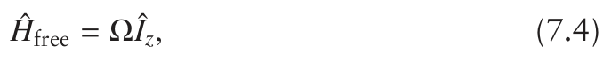

where, as before (section 4.4.2 on page 55), Ω is the offset of the spin, which is the difference between its Larmor frequency and the rotating frame frequency.

During a pulse in which the RF field is applied along the x-axis, there is an additional term in the Hamiltonian which represents this field:

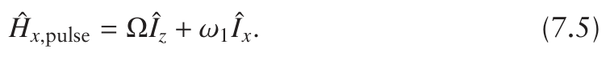

As before, ω1 is the RF field strength which determines the rate at which the magnetization rotates about the field along the x-axis.

It was shown in section 4.5.1 on page 59 that if the RF field strength ω1 is much greater in size than the offset Ω, the evolution of the magnetization is dominated by the transverse field. If these conditions hold, we have a hard (or non-selective) pulse, for which the Hamiltonian is simply

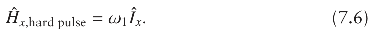

If the pulse is about the y-axis, then the operator simply becomes Îy:

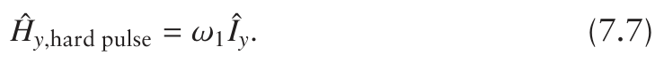

Throughout this chapter we will assume that all pulses are hard.

### 7.1.2 Rotations

To understand how the density operator changes with time we need to consider how we are going to work out the right-hand side of Eq. 7.3 on the facing page. We will illustrate the procedure by considering a specific case, and then go on to generalize the approach.

Imagine at time zero the density operator is simply Îx i.e. ax = 1, ay = 0

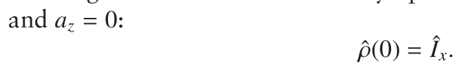

Suppose that we now want to work out the effect of a period of free precession, for which the Hamiltonian is given by Eq. 7.4. So, using Eq. 7.3 on the facing page the density operator after evolution for time t is

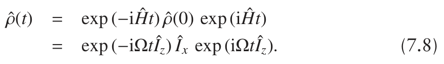

The last line can be evaluated using an identity which is well-known in the theory of angular momentum operators:

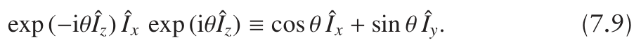

In the present case the angle θ is equal to Ωt. This identity is interpreted as starting with the operator Îx and then rotating it through an angle θ about the z-axis. Not surprisingly, this rotation generates a y-component proportional to sin θ, leaving an x-component proportional to cos θ. The analogy with x-magnetization rotating towards the y-axis is complete and entirely appropriate.

If we set θ = Ωt and apply the identity Eq. 7.9 on the previous page to Eq. 7.8 we find

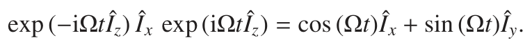

Overall the effect of a period of free precession can be written as

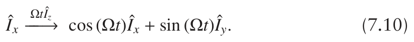

This is a notation we will use often: the time evolution is represented by a right arrow connecting ˆρ(0) to ˆρ(t), and over the arrow we write ( Ĥt), where Ĥ is the relevant Hamiltonian which acts for time t:

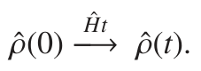

As there is a one-to-one correspondence between the coefficients in front of the operators and the components of the magnetization (Eq. 7.2 on page 140), our interpretation of Eq. 7.10 is that the magnetization at time zero is along x, and after time t the magnetization has a component

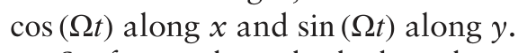

So far we have looked at the particular example of Îx being rotated about z, but we will now go on to show that the rotation of any operator about any axis essentially behaves in the same way.

Since we are writing the density operator as a linear combination of the operators Îx, Îy and Îz, and as the Hamiltonians are also expressed in terms of these operators, every time we want to work out what exp (−i Ĥt) ˆρ(0) exp (i Ĥt) is it will boil down to relationships of the type given in Eq. 7.9 on the preceding page. There are only six possible versions of these rotations, and they are all given in Table 7.1 on the next page.

You might notice that there are some combinations missing from this table such as the rotation of Îz about the z-axis. However, such a rotation has no effect:

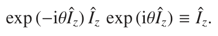

Based on what we know from the vector model, this is hardly a surprise: rotating a vector about its own axis does not affect the vector in any way.

Armed with this table of identities and a knowledge of the Hamiltoni-ans, we are in a position to calculate the outcome of any pulse sequence. However, before we do that we should just remind ourselves of the limita-tions of this approach.

### 7.1.3 Limitations

The substantial effect which is missing from this operator approach is relaxation. We know that over time the transverse components of the

**Table 7.1** Table showing how the rotation through angle θ about a particular axis affects the operators Îx, Îy and Îz. For convenience, the lines in the table are numbered.

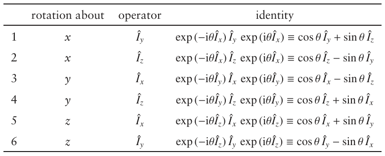

magnetization will decay to zero, and the longitudinal components will return to their equilibrium values; neither of these effects are included. Later on, in Chapter 9, we will look at how the effects of relaxation can be taken into account, but for the moment we will just have to accept this limitation.

The other main limitation of the product operator approach is that it only applies to weakly coupled spin systems. Remember from section 2.3.2 on page 12 that a spin system is weakly coupled if the difference between the Larmor frequencies of two coupled spins is much greater than the size of the coupling constant between them.

## 7.2 Analysis of pulse sequences for a one-spin system

All of our NMR experiments start with equilibrium magnetization, which is along the z-axis. We will therefore write the equilibrium density operator

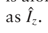

### 7.2.1 Pulse–acquire

The pulse sequence for the basic pulse–acquire experiment is shown in Fig. 7.1. Let us assume that we start at equilibrium, so that the initial density operator is simply Îz. We then apply an x-pulse of duration tp using a field strength ω1, for which the relevant Hamiltonian is given in Eq. 7.6 on page 141:

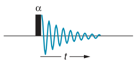

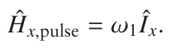

**Fig. 7.1** Pulse sequence for the basic pulse–acquire experiment. A pulse of flip angle α and of phase x is applied to equilibrium magnetization. Data acquisition, indicated by the damped cosine-wave FID, starts immediately after the pulse.

To work out the evolution we need to solve Eq. 7.3 on page 140

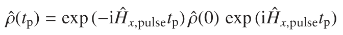

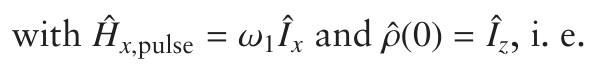

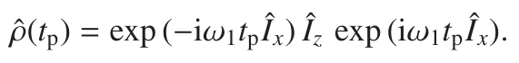

The right-hand side can be evaluated using the identity on line 2 of Table 7.1 on the preceding page:

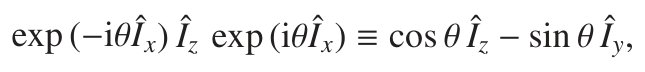

with θ replaced by ω1tp. Doing this gives

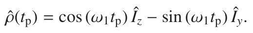

Of course, ω1tp is simply the flip angle α, so the result can be written:

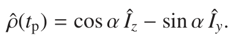

The result is entirely what we expected: the pulse rotates the magnetization from z towards −y, and if the flip angle is π/2 (90◦), then the magnetization is rotated entirely onto the −y-axis. For other flip angles the y-component

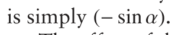

The effect of this pulse on equilibrium magnetization can be represented using the arrow notation in the following way:

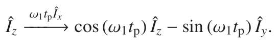

Over the arrow we have written the relevant Hamiltonian multiplied by the time tp, Ĥx,pulsetp, which in this case is ω1tp Îx.

Since ω1tp = α, the term over the arrow can also be written αÎx, and the sine and cosine can be written in terms of α

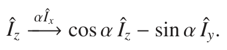

This arrow notation is so much more compact than writing out all the exponential operators that we will use it from now on.

After the pulse, there is a period of free precession, for which the Hamiltonian is Ĥfree = ΩÎz. This is a rotation about the z-axis, and so the term cos α Îz present after the pulse is not affected by free precession. In contrast, the term in Îy is affected, and using the arrow notation the effect of free precession on this term can be written

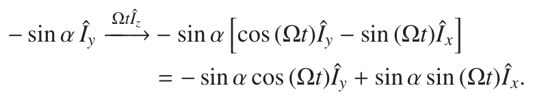

The term over the arrow is Ĥfreet, which is ΩtÎz.

The way in which this calculation works needs a little more explanation. The factor (− sin α), which in the initial state is multiplying Îy, is just a number, and as such is unaffected by the rotation about z. This factor is simply carried forward and multiplies the final result. All we need to do is consider the rotation of Îy about z, for which the appropriate identity is (line 6 of Table 7.1 on the previous page)

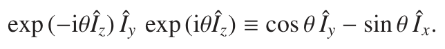

This identity, with θ = Ωt, is used on the first line. To go to the second, we have simply multiplied out the bracket.

The final result is that at time t after the pulse the state of our system is

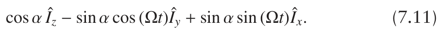

The observable x- and y-components of the magnetization are thus:

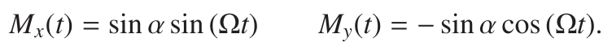

This is in agreement with the predictions we made using the vector model.

### 7.2.2 The spin echo

Using the vector model we saw that the spin-echo pulse sequence, shown in Fig. 7.2, resulted in the magnetization appearing on the y-axis, regardless of the offset and the time τ. We will now reproduce this result using the operator approach.

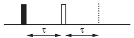

The first part of the sequence is simply 90◦– delay, which is what we have already computed in the previous section. So we can use the result of Eq. 7.11 with α → π/2 and t → τ to give us the state of the spin system just prior to the π pulse as

**Fig. 7.2** Pulse sequence for the spin echo. The filled-in rectangle indicates a 90◦ pulse, whereas the open rectangle indicates a 180◦ pulse; unless otherwise indicated, the phase of the pulses is x. In practice, the duration of the pulses is negligible when compared with the delay τ. The sequence ends after the second delay τ, as indicated by the dashed line; the overall delay between the first pulse and the end of the sequence is thus 2τ.

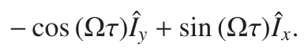

The π pulse is about the x-axis, and so the term sin (Ωτ)Îx is unaffected. The effect of the pulse, of duration tπ, on the other term is:

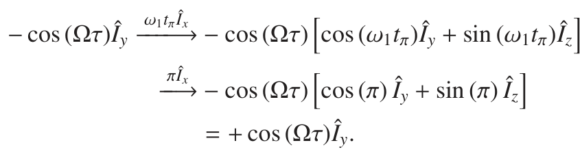

On the first line, the term over the arrow is Ĥpulsetπ, which is equal to ω1tπ Îx. We have also used the identity from line 1 of Table 7.1 on page 143:

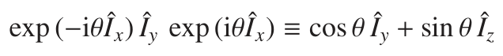

with θ = ω1tπ. As before, the factor − cos (Ωτ) is unaffected by the rotations and simply multiplies the result.

To go to the second line, we have used ω1tπ = π which is the case for a π pulse, and to go to the last line we have used cos π = −1 and sin π = 0. Overall, the result is that the term − cos (Ωτ)Îy is inverted in sign – entirely as expected on the basis of the vector model.

In summary, after the π pulse the state of the spin system is

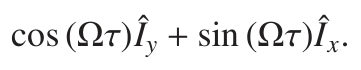

Now we need to consider the evolution during the second delay. Each term has to be considered separately, so we will start with cos (Ωτ)Îy. Recall that the factor cos (Ωτ) will just multiply our answer, so for simplicity we can set it aside during the calculation and then reintroduce it at the end.

Using this approach, the term Îy evolves during the delay τ according to

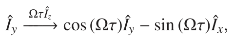

where we have used Ĥfreeτ = ΩτÎz and the identity from line 6 of Table 7.1 on page 143 with θ = Ωτ. Reintroducing the factor cos (Ωτ) the overall result of the evolution of the term cos (Ωτ)Îy is

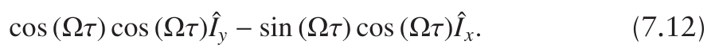

We now have to consider the evolution of the term sin (Ωτ)Îx:

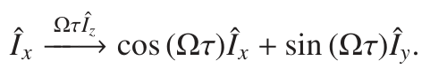

This time we have used the identity from line 5 of Table 7.1 with θ = Ωτ.

Reintroducing the factor sin (Ωτ), the overall result of the evolution of

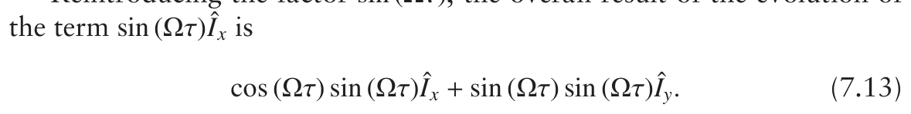

At the end of the spin echo the state of the system is found by adding together Eq. 7.12 and Eq. 7.13. The first thing to note is that the terms in Îx cancel one another. The terms in Îy are:

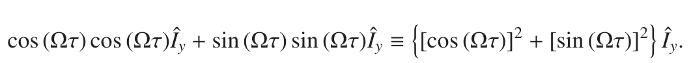

Using the identity:

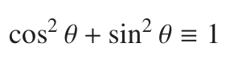

we see that the final state of the spin system is Îy. As we predicted using the vector model, the magnetization ends up along the y-axis, regardless of the offset and the delay τ.

## 7.3 Speeding things up

Calculations using this operator approach can become rather laborious, so it is important to simplify things where we can, and to develop strategies for using the rotations from Table 7.1 on page 143 in an efficient way. We introduce two such strategies here.

### 7.3.1 90◦ and 180◦ pulses

The effect of pulses with flip angles of 90◦ or π/2 radians is rather simple as

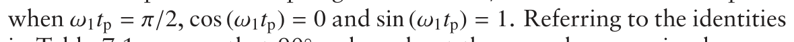

in Table 7.1, we see that 90◦ pulses about the x- and y-axes simply cause the transformations:

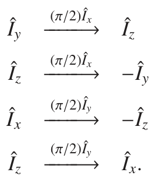

The rotations caused by 180◦ pulses are even simpler. For such pulses

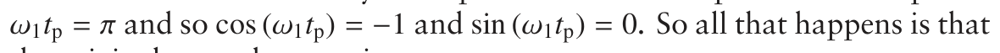

the original term changes sign:

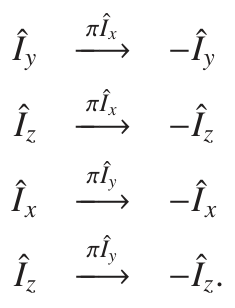

Note that both 90◦ and 180◦ pulses about a particular axis have no effect on operators along that axis e.g. a pulse about x has no effect on Îx.

### 7.3.2 Diagrammatic representation

The identities in Table 7.1 on page 143 simply represent rotations in a three-dimensional space where the x-, y- and z-axes represent the three operators Îx, Îy and Îz. For example, the identity

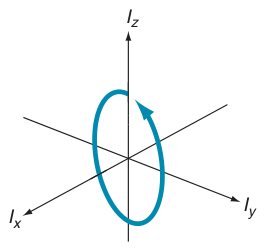

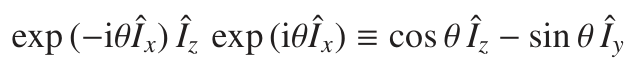

can be interpreted as a vector which starts on the z-axis and then is rotated about the x-axis. As a result, the vector moves in the yz-plane, initially setting off towards the −y-axis i.e. a positive rotation about x, as is illustrated in Fig. 7.3. All of the identities in Table 7.1 can be interpreted as rotations in this way.

**Fig. 7.3** A rotation of the operator Îz about x takes it towards −Îy, which is the same motion as a positive rotation of a vector which starts along +z. Remember that the sense of a positive rotation about x is found by grasping the x-axis with your right hand and with your thumb pointing along the +x-direction. The curl of your fingers then gives the sense of a positive rotation.

A further feature of these identities is that they all have the same form. Rotation of an operator  results in a state which has two terms: the first is  multiplied by the cosine of an angle, and second is a ‘new’ operator, B̂, multiplied by the sine of the same angle. In general, the right-hand side takes the form:

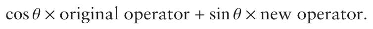

We can work out what the ‘new operator’ will be by looking at Fig. 7.3. For example, if we start with Îy and imagine rotating it in a positive sense about x, the vector initially moves towards z, so the ‘new operator’ is Îz. The corresponding identity is therefore

Similarly, if we start with −Îz and rotate in a positive sense about x, from the figure we can see that the initial movement is towards y, so the ‘new operator’ is Îy, and the corresponding identity is

This identity is not in Table 7.1, but can be found by multiplying the identity from line 2 by −1:

**Fig. 7.4** Diagrams for determining the result of rotating any operator about x, y or z. To use the diagrams you simply locate the one for the axis about which the rotation is taking place. The initial operator is then located on the diagram, and the ‘new operator’ is then found by following the arrow. The result of the rotation is cos θ times the original operator plus sin θ times the ‘new’ operator. For a negative rotation about x, we simply use (a) but with the rotation clockwise e.g. z is rotated to y; similarly, (b) can be used for a negative rotation about y.

The effect of any rotation about x can be worked out using using the diagram shown in Fig. 7.4 (a). To use this, you simply locate the initial operator and then move in the sense of the arrow to find the ‘new operator’.

Rotations about y and z can be handled in a similar way using diagrams (b) and (c). It is also worth noting that for 90◦ pulses, the result is a complete transformation to the ‘new’ operator.

### 7.3.3 The 1 − 1 sequence

To illustrate how we can use the simplifications set out in the previous two sections, we will analyse the 1 − 1 sequence, which is used for observing signals in the presence of a very strong solvent resonance.

The pulse sequence is shown in Fig. 7.5. It starts with a 90◦ pulse about x, followed by a delay τ, and then a 90◦ pulse about −x. Data acquisition follows immediately after the second pulse.

**Fig. 7.5** Pulse sequence for the 1 − 1 sequence used to suppress a single strong resonance (e.g. a solvent), thus allowing weaker signals from solutes to be observed. It is shown in the text that a line which is on resonance (Ω = 0) is not excited, whereas lines with offsets close to π/(2τ) are excited significantly. By choosing τ, this region of excitation can be adjusted to cover the solute peaks of interest.

The first pulse simply rotates the equilibrium magnetization Îz to −Îy. Free evolution is a rotation about z, and we see from Fig. 7.4 (c) that −Îy is rotated towards Îx, so that after the delay the state of the system is

The effect of the final 90◦ pulse about −x can be worked out by using Fig. 7.4 (a) but, since the pulse is about −x, the rotation goes clockwise i.e. in the opposite sense to that shown. Thus, for this 90◦ rotation, −Îy goes

The final result is

What we have here is a pulse sequence which produces transverse magnetization along the x-axis whose size is proportional to sin (Ωτ). A line at zero offset is therefore not excited, whereas a line with an offset such that

The sequence can thus be used to suppress an unwanted strong line, such as one from a solvent, by placing it on resonance i.e. with Ω = 0. Lines further off resonance are excited according to the function sin (Ωτ), and by choosing τ such that (Ω′τ) = π/2, lines at (or near) offset Ω′ will be excited efficiently. The optimum value for the time τ is therefore π/(2Ω′). If

## 7.4 Operators for two spins

The product operator method comes into its own when we want to work with coupled spins. Whereas for one spin we only need the three operators Îx, Îy and Îz, we will need a total of sixteen operators to describe the two-spin system. The density operator can be expressed as a linear combination of these sixteen operators, just as the density operator for a one-spin system could be expressed as a linear combination of Îx, Îy and Îz.

The sixteen operators are constructed from the following four operators for spin one:

and the corresponding four operators for spin two:

Note the subscript 1 to indicate that the operator is for spin one, and the subscript 2 to indicate that the operator is for spin two. Ê1 and Ê2 are ‘unit operators’ for spins one and two, respectively.

The sixteen product operators needed to describe a two-spin system, are constructed from all possible products consisting of an operator for spin one and an operator for spin two. For example, if the operator for spin one is Ê1, then the four possible products are

It turns out that the product Ê1 Ê2 does not give rise to any observable magnetization. Ê1 Î2x and Ê1 Î2y correspond to observable x- and y-magnetization on spin two; such terms are also described as single-quantum coherence. As we shall see later, this type of magnetization is referred to as in-phase. Ê1 Î2z corresponds to z-magnetization on spin two.

If the operator for spin one is Î1x, then the four products are

We have inserted a factor of 2 into any product involving two x, y or z operators. This is for normalization purposes, which we will simply have to accept. The product Î1x Ê2 is simply in-phase x-magnetization on spin one, just in the same way that Ê1 Î2x is in-phase x-magnetization on spin two.

Later on, we will show that products such as 2Î1x Î2x and 2Î1x Î2y, in which both operators are x or y (transverse), represent multiple-quantum coherences.

The product 2Î1x Î2z will turn out to be very important; we will show that it represents what is called anti-phase magnetization on spin one. This is observable, and leads to a spin-one doublet in which the two lines are of opposite sign – hence the description ‘anti-phase’.

Carrying on, the next four products have Î1y as the spin-one operator:

As before, the first of these terms is in-phase y-magnetization on spin one, the second and third are multiple quantum, and the final term is anti-phase magnetization on spin one, aligned along y.

The final set of four products have Î1z as the spin-one operator:

The first term is simply z-magnetization on spin one; the second and third terms are anti-phase magnetization on spin two, aligned along x and y, respectively. The final term, 2Î1z Î2z, represents a non-equilibrium population distribution which does not lead to observable magnetization.

For brevity, it is usual to omit the operators Ê1 and Ê2. Also, the product Ê1 Ê2 never appears in any practical sequence, so we can set it to one side. This leaves fifteen operators, which can be grouped as follows:

Our task is now to understand precisely what the difference is between in-phase and anti-phase magnetization: this turns out to be due to the evolution of scalar coupling.

### 7.4.1 Effect of coupling

Scalar coupling acts, along with offsets, during periods of free evolution. To describe such evolution we need to know the corresponding Hamiltonian, which was introduced in section 3.5.1 on page 37; here it is written in angular frequency units:

Ω1 and Ω2 are the offsets of spin one and two, respectively. J12 is the scalar coupling constant between spins one and two, and is given in Hz. However, as we are writing the Hamiltonian in angular frequency units, we have to multiply J12 by 2π in order to put everything into rad s−1. This is a bit awkward, but the well-established convention is always to write scalar coupling constants in Hz, so we will have to put up with the factor of 2π.

There are three terms in this Hamiltonian. These describe, in turn: the evolution of the offset of spin one; the offset of spin two; and the scalar coupling between the two spins. It turns out that we can consider the effect of these three terms one at a time, and in any order (this is because the operators commute with one another). So, in the arrow notation, the result of a period of free precession

can be worked out by three successive transformations (in any order):

The first two of these transformations are simply rotations about z, and we can work out the effect of these using the approach which has already been described. The new thing we need to deal with is the effect of the term

The effect of this term on the operators Î1x and Î1y can be deduced from the following identities:

The important thing to notice here is that the sine and cosine terms are of half the angle θ. This is in contrast to all the identities we have come across before, which depend on the full angle θ. These identities tell us that the effect of coupling is to cause the in-phase terms Î1x and Î1y to evolve into the anti-phase terms 2Î1y Î2z and 2Î1x Î2z. Note the shift of axis: an in-phase term along x becomes an anti-phase term along y.

For example, suppose we start with the term Î1x and allow it to evolve under coupling for a time τ. In the arrow notation the transformation is

To work out the effect of this we need the identity of Eq. 7.15 with

There will be complete conversion to the anti-phase term when the

In a similar way, anti-phase terms become in-phase according to the following identities:

For example, by using the second identity we can see that

**Fig. 7.6** Diagrams, similar to those of Fig. 7.4 on page 148, for working out the effect of the evolution of scalar coupling on in-phase and anti-phase terms. The letters x and y represent the in-phase terms about the corresponding axes, whereas xz and yz represent anti-phase terms about these axes. To work out the evolution of a term, we simply locate it in (a) or (b); this term will evolve into the term indicated by the arrow, and with the coefficient sin (πJt). For example, −2Î1x Î2z is located in (b), and the arrow takes us to the term −Î1y; the result of evolution of the coupling is therefore cos (πJt) times the original term plus sin (πJt) times the new term, i.e. −cos (πJt)2Î1x Î2z − sin (πJt)Î1y.

There is thus complete conversion of the anti-phase to the in-phase operator when τ = 1/(2J12). We saw above that the same value of the delay gives complete conversion of in-phase to anti-phase.

This interconversion of in-phase and anti-phase magnetization can be summarized in the diagrams shown in Fig. 7.6, which are similar to those of Fig. 7.4 on page 148.

The evolution of the in-phase and anti-phase terms of spin two follows the same pattern as that for spin one: all we have to do is swap the indices 1 and 2. So, for example, Eq. 7.17 on the preceding page

becomes

We can also use Fig. 7.6 provided we interpret x and y as referring to Î2x

For example, the evolution of the term −Î2x is found from (a), where we

We are now in a position to explore more closely why Î1x is called an in-phase term and 2Î1x Î2z an anti-phase term.

## 7.5 In-phase and anti-phase terms

We mentioned above that operators like Î1x are called in-phase terms and products such as 2Î1x Î2z are called anti-phase terms. Now that we understand how to deal with the evolution due to coupling, we are in a position to explain just precisely what in- and anti-phase mean. As our discussion progresses, we will see that these anti-phase terms play a pivotal role in multiple-pulse NMR experiments.

### 7.5.1 In-phase terms

Let us imagine that at time zero we just have the operator Î1x. We then allow this to evolve freely for a time t, all the time observing the x-and y-magnetizations. What we are going to do is work out how these magnetizations vary with time, and hence the form of the time-domain signal and the corresponding spectrum.

The evolution is controlled by the Hamiltonian we introduced before (Eq. 7.14 on page 150):

We need to work out the effect of the three terms in turn. The first is simply a z-rotation due to the offset term for spin one, Ω1 Î1z, which we see from (c) in Fig. 7.4 on page 148 takes Î1x to the new operator Î1y:

The next term we need to consider is the offset term for spin two, Ω2 Î2z; as the operator here refers to spin two it has no effect on any spin one operator. This is a general principle which we will use often.

Finally, we need to consider the effect of the scalar coupling, 2πJ12 Î1z Î2z, on each term on the right of Eq. 7.19. For the term Î1x we need (a) from Fig. 7.6 on the preceding page to see that the new operator is 2Î1y Î2z; for the term Î1y we need (b) to see that the new operator is −2Î1x Î2z. The overall result is

At time t the observable x-magnetization (on spin one) is given by the coefficient multiplying the operator Î1x. Similarly, the y-magnetization is given by the coefficient multiplying the operator Î1y.

As explained in section 5.2 on page 82, we usually represent the NMR signal as a complex number, the real part being proportional to the x-magnetization and the imaginary part proportional to the y-magnetization. Thus, the signal at time t, S (t), is

We have used quite a lot of manipulations here. To go to the second line we have used the identity cos θ + i sin θ ≡ exp (iθ), and to go to the third line we have rewritten the cosine in terms of complex exponentials using the

The time-domain signal is the sum of two exponential terms, one oscillating at frequency (Ω1 + πJ12) and one at (Ω1 − πJ12); these two terms are both positive and have the same size. In practice, these signals will not only oscillate but will also decay over time due to relaxation. If we assume, for simplicity, that the decay is exponential, then the signal is of the form

As we saw in section 5.3 on page 83, Fourier transformation of such a signal will give rise (in the real part of the spectrum) to two absorption mode lines of the same height, one centred at (Ω1 + πJ12t), and one centred at (Ω1 − πJ12t). These are, of course, the two lines of the spin-one doublet; the spectrum is illustrated in Fig. 7.7. Remember that we are working here in angular frequency units, so the lines are separated by 2πJ12 rad s−1, which

We can now see why the term Î1x is described as ‘in-phase’, since if we observe its evolution it gives rise to a spectrum consisting of the spin one doublet, with both lines positive and of the same intensity. A calculation along the same lines starting with Î1y gives the result

**Fig. 7.7** The term Î1x evolves over time to give an observable signal whose Fourier transform consists of the two lines of the spin-one doublet i.e. a line at (Ω1 + πJ12) and a line at (Ω1 − πJ12). In the real part of the spectrum the lines have the absorption lineshape, whereas in the imaginary part the lineshape is dispersive. The important thing is that the two lines of the doublet both have the same sign; this is why the term Î1x is described as ‘in-phase’.

This is the same as for Î1x, apart from the factor i, which is simply a phase factor, corresponding to a phase shift of π/2 radians or 90◦ (see section 5.3.2 on page 85). In practice this means that if the spectrum obtained from the evolution of Î1x is phased to give absorption mode lines in the real part, that from Î1y will give dispersion mode lines. Remember that the relative phase is arbitrary, so we could just as well phase the spectrum so that the doublet from Î1x is dispersive, and that from Î1y is absorptive. The important thing is that Î1x and Î1y both give rise to in-phase doublets.

Similar calculations for Î2x and Î2y show that these two operators give rise to in-phase doublets centred on the offset of spin two; both lines in the doublet have the same sign. If one doublet is phased to absorption, the other will be in dispersion.

### 7.5.2 Anti-phase terms

We now turn to the anti-phase operators. Strictly speaking, these are not observable in the sense that they do not give rise to transverse magnetization. However, we will show in this section that over time anti-phase operators evolve into in-phase operators which are observable.

Imagine that at time zero we have just 2Î1x Î2z, and that we allow this to evolve for time t, observing the x- and y-magnetizations as time proceeds. Once again, we need to consider the effect of the offset of spin one, the offset of spin two, and the coupling.

The term in the Hamiltonian which represents the offset of spin one is Ω1 Î1z. This spin-one operator has no effect on any of the spin-two operators, so its effect on 2Î1x Î2z is the same as its effect on Î1x. In the following, we emphasize this by placing curly braces around Î2z in the following:

essentially, the operator Î2z carries through as a harmless factor, and Î1x evolves into Î1y.

The next term to consider is that for the offset of spin two: Ω2 Î2z. This has no effect on the spin-one operators and, as the spin-two operator is Î2z, this is also unaffected as a z-operator is unaffected by a z-rotation.

Finally, we have to consider the coupling, which gives the following result (check it for yourself using Fig. 7.6 on page 152):

As before, Mx is given by the coefficient of Î1x and My by the coefficient

We have used the same manipulations as in the case of the evolution of the in-phase term, except that to go to the fourth line the identity

**Fig. 7.8** The term 2Î1x Î2z evolves over time to give an observable signal whose Fourier transform consists of the two lines of the spin-one doublet. However, in contrast to the in-phase term Î1x, the two lines from 2Î1x Î2z have opposite signs – hence the description of this term as ‘anti-phase’.

As with the term Î1x, we find a term oscillating at (Ω1 + πJ12) and one at (Ω1 − πJ12). These are the two lines of the spin-one doublet. However, the crucial thing here is that one of the terms is multiplied by a minus sign. So, on Fourier transformation, one peak will be positive and one will be negative, as shown in Fig. 7.8. This is why the operator 2Î1x Î2z is referred to as an anti-phase operator.

In section 3.6 on page 38 it was explained how the two lines of the spin-one doublet could be associated with spin two being in the α or β state. What we see in the case of the anti-phase term is that the sign of the peak (i.e. whether it is positive or negative) also depends on the spin state of spin two.

A similar calculation for 2Î1y Î2z shows that this is also an anti-phase doublet on spin one, but with the opposite lineshape to that for 2Î1x Î2z. Similarly, 2Î1z Î2x and 2Î1z Î2y correspond to anti-phase doublets on spin two.

**Fig. 7.9** Spectra resulting from the four observable operators of spin one. The complete spectrum is shown in black at the top of the diagram; on the left, the spectra are phased such that x-magnetization gives rise to absorption mode lines, whereas on the right the phase is such that y-magnetization gives absorption mode lines i.e. there is a phase shift of 90◦ between the two sets of spectra.

**Fig. 7.10** Spectra resulting from the four observable operators of spin two; the format is the same as for Fig. 7.9.

### 7.5.3 Observable terms

Strictly speaking, the only terms which give rise to observable magnetization are Î1x, Î1y, Î2x and Î2y. However we have shown that if we start with the operator 2Î1x Î2z at time zero, this evolves in such a way as to give observable signals. So, it is usual to ‘pretend’ that the anti-phase terms such as 2Î1x Î2z are observable, in the sense that over time they will evolve into observable signals.

So, when we make a calculation on a pulse sequence we only need to carry it on up to the very beginning of data acquisition. At this point we simply inspect the terms we have, pick out those which are observable and simply deduce the form of the spectrum by realizing which spin they are on, and whether or not they are in-phase or anti-phase.

We also need to take into account the axes along which the operators are aligned, as this affects the lineshape in the spectrum. So, for example, if we have adjusted the phase in the spectrum so that Î1x gives an absorption mode in-phase doublet, then 2Î1x Î2z will give an absorption mode anti-phase doublet, whereas 2Î1y Î2z will give a dispersion mode anti-phase doublet. On the other hand, we could just as well phase the spectrum so that Î1y gives an absorption mode in-phase doublet, in which case 2Î1x Î2z will give a dispersion mode anti-phase doublet.

Figures 7.9 and 7.10 show the spectra arising from the observable operators on spin one and spin two, respectively. Each set of spectra appear twice: once phased such that x-magnetization gives rise to absorption mode lineshapes, and once such that y-magnetization gives rise to the absorption mode.

## 7.6 Hamiltonians for two spins

We have already introduced and discussed the free-precession Hamiltonian for two spins (Eq. 7.14 on page 150):

It was also described how the evolution caused by this Hamiltonian can be worked out by considering the effect of the three terms in turn, and in any order. We have already seen that, as spin-one operators are unaffected by rotations due to spin-two operators (and vice versa), it is often the case that one of these three terms has no effect on the evolution.

For hard RF pulses, the Hamiltonian is analogous to that for a single spin (Eq. 7.6 on page 141), except that there is a term for spin one and a term for spin two:

Once more, these two terms commute, so that the evolution caused by this Hamiltonian can be worked out by considering each term in turn. In the arrow notation this evolution for time tp is represented:

Noting that the flip angle α is given by ω1tp means that we can write these two arrows as

If the pulse is applied only to one of the spins, then only the operator for that spin is present in the Hamiltonian. For example, a pulse to spin one has the Hamiltonian

As before, for a pulse about y, the operators in the Hamiltonian are changed to Îy:

## 7.7 Notation for heteronuclear spin systems

As far as the product operator approach is concerned, it makes no difference whether the two spins are of the same type (e.g. both protons), or of different types (e.g. one proton and one 13C). However, when we are analysing heteronuclear pulse sequences it is sometimes useful to modify the operator notation somewhat so as to create a stronger distinction between the spin-one and spin-two operators.

The usual way to do this is to call one of the spins the ‘I spin’ and the other the ‘S spin’. The operators for the I spin are

and those for the S spin are

This is only a change of notation, so everything we have done up to now still holds. All we have to do is replace the operators Î1γ with Îγ, where

In this notation, instead of writing the offsets of spins one and two as Ω1 and Ω2, we write the offsets of the I and S spin as ΩI and ΩS . The coupling between the two spins, which was J12, becomes JIS . Using this notation, the free precession Hamiltonian is

For an x-pulse to the I spin the Hamiltonian is

whereas for a y-pulse to the S spin the Hamiltonian is

## 7.8 Spin echoes and J-modulation

In section 4.9 on page 63 we used the vector model to explain how it is that the spin echo refocuses the evolution of the offset (chemical shift), and earlier in this chapter (section 7.2.2 on page 145) we repeated the analysis of the spin echo using operators. However, in both cases we only considered the evolution of the offset; we were not in a position to consider what happens when a scalar coupling is present – which is precisely what we are going to do now.

What we will find is that, in contrast to what happens to the offset, the evolution of the scalar coupling is not refocused in a spin echo. In fact, it appears that the coupling evolves throughout the entire duration of the spin echo, just as if the refocusing pulse were not there. This feature of the spin echo turns out to be absolutely crucial in multiple-pulse NMR experiments.

To start with, we will consider the case where the two spins which are coupled are of the same type e.g. two protons: this is called a homonuclear spin system. Then, we will go on to consider the case where the two spins are different e.g. 13C and proton: this is called a heteronuclear spin system. The key difference in this second case is that we can choose whether to apply the 180◦ pulse to either one of the spins, or to both. We shall see that this flexibility allows us to choose whether the coupling is refocused or not, a property which turns out to be very important in heteronuclear multiple-pulse experiments.

So far, we have used the term spin echo as the name for the whole sequence (90◦ – delay – 180◦– delay –). However, the initial 90◦ pulse is just there to excite transverse magnetization, the behaviour of which during the spin echo is what we are really interested in. So, from now on we will use the term spin echo for the element (delay – 180◦– delay), and simply imagine that some transverse magnetization is present at its start.

### 7.8.1 Spin echo in a homonuclear spin system

First, we are going to analyse the evolution during a spin echo applied to a homonuclear two-spin system. The pulse sequence is shown in Fig. 7.11. As the spin system is homonuclear, the π pulse is applied to both spins, and to start with we will assume that this pulse is applied along the x-axis.

During the delays τ, both offsets and the scalar coupling affect the evolution. We have already shown that the offset is refocused, so to simplify the calculation here we will simply ignore the offset entirely, safe in the knowledge that it has no overall effect. You might legitimately object to this simplification, as it could be that the presence of the coupling somehow interferes with the refocusing of the offset. Rest assured that this is in fact not the case. The technical reason for this is that the terms in the Hamiltonian which describe offsets and coupling commute with one another, and so act entirely independently.

**Fig. 7.11** Pulse sequence for the spin echo. From now on, we will regard the (delay – 180◦ – delay) sequence i.e. that part between the dashed lines, as the spin echo. The initial 90◦ pulse, included in Fig. 7.2 on page 145, is not considered to be part of the spin echo. The duration of the 180◦ pulse, indicated by the open rectangle, is negligible compared with the delays τ.

Let us imagine that at the start of the echo sequence we have in-phase x-magnetization of spin one: Î1x. The first thing to consider is the evolution of the coupling during the delay τ. To work out what happens, all we need to do is refer to Fig. 7.6 (a) on page 152, and note that Î1x evolves into

Next comes the π pulse, applied about the x-axis. The effect of this pulse is determined by treating it as a π rotation of spin one and then of spin two (section 7.6 on page 157). As was described in section 7.3.1 on page 146, such π pulses simply invert the sign of some terms. The term Î1x is unaffected, as an x-pulse does not affect x-operators. In the product 2Î1y Î2z, Î1y changes sign to −Î1y, and the same is true for Î2z which goes to −Î2z. Since −1 × −1 = +1, the net result is that the product 2Î1y Î2z is unaffected by the π pulse. Overall, therefore, nothing happens:

Finally, we have to consider the evolution during the second delay τ. Taking the terms one at a time, the evolution of Î1x is just as before:

For the evolution of the term 2Î1y Î2z we need Fig. 7.6 (a) to see that it

The result of this evolution is therefore

This looks a little complicated until we spot that the expression multiply-

can therefore be used to simplify it to cos (2πJ12τ). Similarly, the expression multiplying 2Î1y Î2z is of the form 2 sin θ cos θ; the identity

simplifications gives us the the final result:

Compare this final result with Eq. 7.20 on the previous page which gives the result of evolution of the coupling for time τ. If you replace τ in Eq. 7.20 by 2τ you obtain Eq. 7.21. What we see is that the overall effect of the spin echo is the same as allowing the coupling to evolve for time 2τ. The evolution of the coupling is not affected by the sequence – in contrast to the offset which is refocused.

You will remember that, arbitrarily, we assumed that there was just in-phase x-magnetization present at the start of the spin echo. We need to check that our conclusion that the coupling is not refocused applies generally, and not just to this particular starting case. First, let us consider in-phase y-magnetization: the calculation proceeds as before, although this

This time the π pulse inverts the first term Î1y, and also inverts Î2z from the

For the evolution during the second delay τ, each term is considered separately:

where we have used Fig. 7.6 (b) to see that −Î1y evolves to 2Î1x Î2z. Using the same diagram, we see that 2Î1x Î2z evolves to Î1y, giving

So, the final result is:

Applying the identities for cos (2θ) and sin (2θ) we used before, this simpli-fies to

Once again, we see that the evolution of the coupling has not been refocused. Comparing Eq. 7.23 with Eq. 7.22, the result of evolution for time τ, we see that the result of the spin echo is the same as evolution for 2τ together with an overall change of sign. We will have more to say about this sign change in a moment.

Finally, we should consider the effect of the spin echo on the anti-phase terms 2Î1x Î2z and 2Î1y Î2z. We will not go through the calculation step-bystep (this is something you can do for yourself), but simply quote the results; for convenience, they are summarized in the following table. Note that each initial state evolves into two terms, one multiplied by cos (2πJ12τ) and one

For all initial states, the coupling evolves for time 2τ. Careful inspection of this table will show that the result of the spin echo is equivalent to (in either order)

- evolution of the coupling for time 2τ

- a 180◦ pulse (here about x).

This is a very handy way of dealing with the evolution due to spin echoes – we will use it often.

For example, consider starting with Î1x: evolution for 2τ gives

A 180◦ pulse about x leaves the terms unaffected

this is exactly the result we obtained before, and is given on the first line of the table.

As another example, consider starting with 2Î1x Î2z: evolution for 2τ gives

A 180◦ pulse about x changes the signs of both terms

which is the result on line three of the table. If we change the phase of the 180◦ pulse from x to y, the same principle applies: the result of the spin echo is evolution for time 2τ, followed by a 180◦ pulse, this time about y.

Of course, we might just as well start with magnetization on spin two rather than spin one. The general result we have found above still applies

### 7.8.2 Summary

It is useful at this point to summarize the properties of the spin echo when applied to homonuclear spin systems:

- The offset is refocused i.e. it can be ignored.

- The coupling is not refocused.

- The overall result of the spin echo is equivalent to evolution of the

coupling for time 2τ followed by a 180◦ pulse (of the appropriate phase).

The homonuclear spin echo is said to be modulated by the coupling, in the sense that the result depends, in an oscillatory way, on the coupling. You will also encounter the term J-modulated spin echo as a description of this effect.

### 7.8.3 Spectra from a J-modulated spin echo

A good way of seeing what this J-modulation means in practical terms is to consider an experiment where we start with in-phase x-magnetization, Î1x, apply a spin echo sequence and then observe the result straight away. A suitable pulse sequence is shown in Fig. 7.12. Just after the spin echo, and right at the start of acquisition, we have shown in the previous section that the terms present are

**Fig. 7.12** A simple sequence for observing J-modulated spin echoes. The initial 90◦ pulse about y generates in-phase x-magnetization; a spin echo of total duration 2τ follows, and then the signal is recorded.

From the discussion in section 7.5 on page 152, we know that the term Î1x will give rise to the spin-one doublet in which both lines have the same sign and amplitude i.e. they are in-phase. The term 2Î1y Î2z will give the same doublet, but this time with one line positive and one line negative i.e. anti-phase. In addition, if we phase the spectrum such that magnetization initially along x gives absorption mode lineshapes, the in-phase doublet will be in absorption but the anti-phase doublet will be in dispersion.

The spectrum will therefore consist of a superposition of two doublets: there will be an in-phase absorption doublet, with intensity proportional to cos (2πJ12τ), and an anti-phase dispersion doublet with intensity proportional to sin (2πJ12τ). Clearly, as the delay τ changes, the ratio between the in-phase and anti-phase contributions changes.

This effect of changing the spin-echo delay τ is shown in Fig. 7.13 on the facing page. At the top, we have τ = 0, and so see just the in-phase absorption multiplet. As τ increases, the proportion of the in-phase

**Fig. 7.13** Illustration of the result expected for the spin echo sequence of Fig. 7.12 on the preceding page. Different values of the delay τ are shown, starting with τ = 0 at the top. On the left the spectra are phased so that x-magnetization gives rise to absorption mode lineshapes, whereas on the right the phase is such that y-magnetization gives rise to absorption mode lineshapes. For τ = 0 we start with in-phase magnetization along x, Î1x; as τ increases, the amount of anti-phase magnetization increases, and when τ = 1/(4J12) there is complete conversion to anti-phase magnetization along y, 2Î1y Î2z. As τ increases beyond this point, the amount of in-phase magnetization increases, but in the negative sense; when τ = 1/(2J12) there is complete conversion to negative in-phase magnetization, −Î1x.

contribution decreases and that of the anti-phase term increases. Note that in-phase magnetization along x becomes anti-phase magnetization along y, so there is a change in lineshape from absorption to dispersion (or vice versa).

We can work out the value of the delay which will give complete conversion to anti-phase by noting that this will be when

the delay, the amount of in-phase magnetization is cos (2πJ12/[4J12]) = cos (π/2) = 0, so there is indeed complete conversion to anti-phase, as can be seen in Fig. 7.13.

As τ increases beyond 1/(4J12), the amount of anti-phase decreases and the amount of in-phase increases, but this time the in-phase doublet is negative. Complete conversion to the inverted doublet occurs when

If we imagine starting the experiment not with in-phase magnetization, but with the anti-phase state 2Î1x Î2z, then the effect of the spin echo is to give

This time, anti-phase magnetization evolves into in-phase and, as before,

- The J-modulation during a spin echo causes an oscillatory interchange between in-phase and anti-phase terms.

- The in-phase and anti-phase terms are along orthogonal axes e.g. x and y.

- Complete conversion of in-phase to anti-phase, or vice versa, requires

Spin echoes are useful in that they allow us to interconvert in-phase and anti-phase terms in a way which is independent of the offset (which is refocused). Such manipulations are very important in multiple-pulse NMR.

### 7.8.4 Spin echoes in heteronuclear spin systems

In section 4.11 on page 67 it was noted that, whereas in practice it is possible to apply a sufficiently high-power RF pulse so that all of the resonances of a single type of nucleus (e.g. proton or 13C) are affected, such a pulse applied to one type of nucleus will not affect another. So, for example, a hard pulse set to cover the range of 13C chemical shifts will have no effect on protons, and vice versa.

Therefore, when it comes to forming a spin echo in a heteronuclear spin system, we can choose to which type of nucleus the 180◦ pulse is applied. In a two-spin system there are three possibilities, shown in Fig. 7.14. For the discussion in this section we will switch to calling the two spins I and S, rather than one and two, as this is the usual notation for heteronuclear spin systems (see section 7.7 on page 157). Typically I will be proton, and S will be a heteronucleus, such as 13C, 31P or 15N.

In sequence (a) 180◦ pulses are applied to both spins. This is exactly the same as in the homonuclear spin system, so we can immediately deduce that the offsets of both spins are refocused, whereas the coupling evolves for time 2τ. In (b) and (c) there is a single 180◦ pulse applied to either the I spin or the S spin. We will now work out what happens in these two sequences.

**Fig. 7.14** Three different spin echo pulse sequences which can be applied in heteronuclear spin systems where we have the option of applying 180◦ pulses to: (a) both spins; (b) only the I spin; and (c) only the S spin. Sequence (a) gives an identical result to a homonuclear spin echo i.e. the offset is refocused and the coupling is not. Sequence (b) refocuses the offset of the I spin (but not of the S spin), and also refocuses the coupling. Sequence (c) refocuses the coupling, leaves the offset of the I spin unaffected, but refocuses the offset of the S spin. In all cases the start and end of the echo sequence is indicated by the dashed lines.

### 180◦ pulse to the I spin only – sequence (b)

From all we have done so far, it is clear that in this sequence the offset of the I spin is refocused by the action of the 180◦ pulse applied to that spin. So, if there are terms such as Îx or 2Îy Ŝz present at the start of the sequence, we expect that at the end of the sequence they will be unaffected by the offset of the I spin.

On the other hand, we do not expect the offset of the S spin to be refocused as there is no 180◦ pulse applied to this spin. Thus terms such as Ŝx or 2Îz Ŝy will simply continue to evolve under the influence of the offset throughout the whole period 2τ.

To work out what happens to the coupling requires an explicit calculation. Let us start with the term Îx, and follow its fate through the sequence. The evolution during the first delay τ is exactly as before:

The 180◦ pulse is only applied to the I spin, so it is only the I-spin operators whose sign can be changed. As before, the x-pulse does not affect Îx but the operator Îy in the product 2Îy Ŝz is inverted. The overall result is

We now allow each term to evolve once more for delay τ under the coupling.

Collecting the terms together we see that the two anti-phase terms cancel one another out, whereas the in-phase terms are

Using the identity that cos2 θ + sin2 θ ≡ 1, we see that the result is simply Îx. In other words, at the end of the sequence it appears that the coupling does not affect the evolution of Îx i.e. the coupling is refocused.

Repeating the calculation with different initial states shows the following overall results:

It is clear from these that, for transverse I-spin operators, the overall outcome is the same as a 180◦ pulse about the x-axis applied to the I spin.

We now turn to transverse S spin operators; first we will consider Ŝx:

The 180◦(x) pulse applied to the I spin inverts only the operator Îz in the

Comparing this result with Eq. 7.24 on the preceding page, we see that the terms on the right are the same apart from the fact that the I and S operators have been swapped. We do not therefore need to complete the rest of the calculation as it will be the same as before, giving the final result Ŝx. The coupling is refocused.

Working through all of the other S-spin transverse operators shows us that the coupling is refocused in each case. Do not forget, however, that these transverse S-spin terms will still evolve under the offset of that spin for the entire duration 2τ.

It is interesting to note that, as far as transverse operators of the S spin are concerned, the only effect of the 180◦ pulse to the I spin is to invert the operator Îz when it appears in anti-phase terms. For this reason, when thinking about the S-spin operators, the 180◦ pulse to the I spin is often called an inversion pulse, rather than a refocusing pulse.

### 180◦ pulse to the S spin only – sequence (c)

Working out what happens here need not detain us for long. We can re-use all of the calculations for the echo with the 180◦ pulse applied to the I spin simply by swapping the I and S operators. So, we expect that transverse operators of the S spin will be affected neither by the coupling nor the offset – both are refocused. For these operators, the overall effect of the sequence is just the 180◦ pulse to the S spin. Transverse operators on the I spin will evolve under the offset of the I spin, but the coupling is once again refocused.

### 7.8.5 Summary

In summary, the echo sequence shown in Fig. 7.14 (a) on page 164 refocuses the offset, but allows the coupling to evolve. The effects of sequences (b) and (c) on transverse operators for different spins are summarized in the following table:

transverse operator on

coupling

not refoc. refoc.

refoc.

It is clear that in a heteronuclear spin system we will be able to control the evolution of the coupling and offset separately by choosing the appropriate kind of spin echo. This freedom is exceptionally important in the operation of heteronuclear multiple-pulse experiments.

## 7.9 Coherence transfer

We are now in a position to understand one of the key building blocks of multiple-pulse NMR experiments – coherence transfer. The idea is remarkably simple: suppose that we have generated some anti-phase magnetization of spin one, aligned along the y-axis, 2Î1y Î2z. From what we have seen so far, such a state can easily be generated by allowing the scalar coupling to evolve for an appropriate time. We now apply a 90◦ pulse (to both spins), about the x-axis. The result is

The key point here is that the term which started out as transverse magnetization on spin one, 2Î1y Î2z, ends up transverse on spin two, 2Î1z Î2y. This process is called coherence transfer as transverse magnetization, which is a coherence, is transferred from one spin to another.

An in-phase term cannot be transferred from one spin to another by the action of a pulse – such a transfer is a unique feature of anti-phase terms. As we have seen, anti-phase terms arise because of the evolution of a scalar coupling, so it is only if such a coupling exists between two spins that we can have coherence transfer via the anti-phase state. Therefore, the existence of coherence transfer between two spins is indicative of a coupling between those spins; this connection is very important in two-dimensional spectroscopy.

## 7.10 The INEPT experiment

The INEPT experiment is an excellent demonstration of how coherence transfer using anti-phase states can be used to great advantage. In addition, the basic idea used in this experiment is used over and over again in many more complex heteronuclear multiple-pulse experiments. However, to understand the motivation for developing the INEPT experiment, we need to back-track somewhat and discuss the factors which influence the size of the equilibrium magnetization.

### 7.10.1 Why the experiment was developed

In section 4.1.3 on page 49 we described how, at equilibrium, the bulk z-magnetization arose due to the preferential population of the lower energy orientations of the individual magnetic moments. The closer the magnetic moment lies to the applied field (which is along the +z-axis), the lower the energy, so preferential population of lower energy orientations leads to bulk z-magnetization.

The energy of interaction between an individual magnetic moment and the applied field is proportional to the gyromagnetic ratio of the nucleus and the applied magnetic field strength. Increasing either of these factors increases the energetic preference for orientations lying close to the field direction, and hence increases the size of the equilibrium magnetization.

The size of the signal we detect at the end of an experiment ultimately depends on the size of the equilibrium magnetization from which we start: the larger the equilibrium magnetization, and the larger the observed signal. This is one of the reasons why so much effort has been put into increasing the strength of the applied magnetic field, as doing so increases the equilibrium magnetization and hence the strength of the signals. As a result, the sensitivity is improved.

For a fixed magnetic field strength, nuclei with higher gyromagnetic ratios will have larger equilibrium magnetizations, and hence – all other things being equal – have higher sensitivity. The INEPT experiment was conceived as a way of enhancing the signals observed from a low gyromagnetic ratio nucleus by transferring to it the larger equilibrium magnetization of a higher gyromagnetic ratio nucleus. Typically, the high gyromagnetic ratio nucleus is a proton, whose magnetization is transferred to nuclei such

### 7.10.2 Analysis of the INEPT experiment

The pulse sequence for INEPT is shown in Fig. 7.15. Broadly speaking, what happens is that during period A an anti-phase state is generated on the I spin. The two pulses in period B transfer this anti-phase state to S, and then during period C the anti-phase state evolves back into an in-phase state; it is then observed on the S spin. Let us now see, in detail, how this all works.

As the two spins will have different gyromagnetic ratios, we want to keep track of the fact that their equilibrium magnetizations are different. So, rather than writing the equilibrium magnetization on spin one as Îz, we will write it as kI Îz, where kI is a parameter which gives the overall size of the equilibrium magnetization. Similarly, the equilibrium magnetization on spin two will be written kS Ŝz.

**Fig. 7.15** Pulse sequence for the INEPT experiment; note that the second 90◦ pulse to the I spin is of phase y. The experiment results in an observable signal on the S spin whose size depends on the equilibrium magnetization of the I spin. By choosing the I spin to have a higher gyromagnetic ratio than the S spin, the signal observed on S will be larger than for a simple pulse–acquire experiment on that spin. The sequence works by generating an anti-phase state on the I spin during period A, and then transferring it to the S spin using the two pulses in period B. During period C the anti-phase state evolves into an in-phase state; it is then observed. The optimum value for both delays τ1 and τ2 is 1/(4JIS ).

To start with, we are going to consider the fate of the equilibrium magnetization on spin one. The initial 90◦(x) pulse rotates this to −kI Îy. Looking at the pulse sequence, we recognize that period A is a spin echo; as both spins experience a 180◦ pulse, it follows that the offsets are refocused but the coupling continues to evolve for the whole of the period 2τ1. It was shown in section 7.8.1 on page 159 that the overall effect of such a spin echo is evolution of the coupling for 2τ1, followed by a 180◦ pulse to both spins. So, at the end of period A the state of the spin system is

Period B consists of the two 90◦ pulses, but note that the pulse to the I spin is about the y-axis; these are the pulses which cause the coherence transfer. The order in which they act is not important as they are on different spins.

The operator Îy will not be affected by either the y-pulse to I, or the pulse to S. We can therefore discard this term right away as there are no more coherence transfer steps and therefore it will not contribute to any observable signal on the S spin. Remember that in this heteronuclear experiment we are only going to observe the signals from S.

The term 2Îx Ŝz is affected by the two pulses as follows:

These two pulses have transferred our anti-phase state from the I spin to the S spin. We could observe it immediately, resulting in a spectrum with anti-phase doublets; the resulting simplified INEPT pulse sequence is shown in Fig. 7.16 (a) on the facing page. However, it is more common to allow the anti-phase state to evolve into an in-phase state before it is observed.

Continuing with the INEPT pulse sequence of Fig. 7.15, we recognize that, like period A, period C is a spin echo, during which offsets are refocused, and the coupling continues to evolve. As before, we can compute the overall effect of this spin echo by allowing the coupling to evolve for 2τ2, and then applying a 180◦ pulse to both spins. Thus, at the end of this period we have

The in-phase signal on the S spin, Ŝx, is largest when both of the sine terms multiplying it are = 1, which is when the argument of the sine is π/2:

This tells us that τ1, opt = 1/(4JIS) gives us the strongest signal; the optimum value for τ2 is the same. These delays are those which result in complete interconversion of in- and anti-phase magnetization during the two spin echoes.

With this optimum value for the delays τ1 and τ2, the final observable term is

**Fig. 7.16** Two modified INEPT experiments. In sequence (a) the S-spin signal is observed immediately after it has been transferred from I; as a result, the S-spin multiplet will appear in anti-phase. Sequence (b) is identical to that shown in Fig. 7.15 on the preceding page, except that broadband decoupling of the I spin (denoted by the blue rectangle) is applied during acquisition of the signal on S. As a result, the S-spin multiplet collapses to a single line.

compare this with the result of a simple pulse–acquire experiment directly on the S spin, which would give the term

Apart from the trivial difference in phase (and sign) between these two signals, the key thing is that in the INEPT experiment the signal is proportional to kI, whereas in the pulse–acquire experiment the signal is proportional to kS . If the I spin has a greater gyromagnetic ratio than the S spin, the result will be a stronger signal from the INEPT experiment by a

Note that because offsets are refocused throughout the pulse sequence, the enhancement produced by the INEPT experiment is independent of the offset of either spin. So, for example, in a molecule all of the 13C nuclei bearing an attached proton can have their signals enhanced at the same time by the transfer of magnetization from the attached protons.

The final thing to note is that the transverse magnetization present during the two periods A and C will decay due to relaxation. As a result, not all of the equilibrium magnetization will be transferred from I to S i.e. the enhancement will be less than the theoretical maximum.

### 7.10.3 Decoupling in the INEPT experiment

As we described in section 2.4.1 on page 14, when observing heteronuclei such as 13C, it is usual to employ broadband decoupling of the protons so as to remove any splittings from the 13C spectrum due to 13C–1H couplings. There are two reasons for doing this: first, the spectrum is simplified by collapsing the multiplets to single lines; secondly, the sensitivity is improved as all of the intensity which was spread across a multiplet is now concentrated in one line.

If we have an in-phase state on the S spin, then applying broadband decoupling to the I spin will cause the in-phase doublet to collapse to a single line. However, if we have an anti-phase state, decoupling I will simply make the multiplet disappear; these different outcomes are illustrated in Fig. 7.17. We can think of this as a result of the decoupling effectively setting the coupling to zero, so that the positive and negative lines of the anti-phase multiplet cancel one another.

In the INEPT experiment, if we wish to observe the S-spin signal in the presence of broadband decoupling of the I spin, then it is essential to allow the anti-phase term which appears at the end of period B to evolve into an in-phase term. This is achieved during the second spin echo, period C. At the end of this period, it is possible to turn on the broadband decoupling and observe the S-spin signal, see Fig. 7.16 (b) on the preceding page.

**Fig. 7.17** Illustration of the effect of broadband decoupling of the I spin on the S spin multiplet. An in-phase multiplet collapses to a single line of twice the intensity; an anti-phase doublet collapses to nothing. This can be thought of as a result of setting the coupling to zero.

Assuming that only the in-phase signal will be observed during decoupled acquisition, the only term at the end of period C, given by Eq. 7.25 on the previous page, which is important is

It was noted above that the optimum values of both of the τ delays is 1/(4JIS); any value other than this will result in a reduction in the intensity of the signal, and so reduce the advantage of the INEPT experiment.

In a real molecule not all of the couplings have the same value, so a compromise has to be made when it comes to choosing the values of the delays τ. As a result, not all of the spins will experience the same enhancement.

Generally, the INEPT experiment is most successful when large one-bond heteronuclear couplings are used to transfer the magnetization from one spin to another. Not only do such large couplings keep the delays τ short, thus reducing any losses due to relaxation, but they also tend to have a limited range of values, making it possible to choose a good compromise value for τ.

### 7.10.4 Suppressing the signal from the equilibrium

### magnetization on the S spin

So far we have not considered the fate of the equilibrium magnetization on the S spin, kS Ŝz. This is inverted by the first 180◦ pulse to the S spin and then rotated onto the +y-axis by the 90◦ pulse, to give Ŝy. During the spin echo, period C, this in-phase term evolves to give:

As usual, we have worked this out by allowing the coupling to evolve for 2τ and then applying a 180◦ pulse to both spins. If we assume that we are using broadband decoupling of the I spin during acquisition, then only the first term is observable. Furthermore, if τ2 is set to the optimum value of 1/(4JIS), the cosine term will be zero, so this in-phase term disappears i.e. there is no visible contribution due to the S-spin equilibrium magnetization.

However, we may not be able to use the optimum value of τ2, so there is the possibility of some of this term in Ŝy being present at the start of acquisition. The problem is that this term is along y, whereas the term transferred from the I spin is along x. The result will therefore be a phase distortion of the spectrum. It is therefore desirable to remove the contribution from equilibrium magnetization on spin two, so as to remove the phase distortion.

The way this is done is to repeat the experiment twice. In the first experiment, everything is as we have described, so the two in-phase signals are

In the second experiment, we change the phase of the very first pulse from x to −x. If you work through the calculations again, you will find that this alters the sign of the terms which arise from the equilibrium magnetization of the I spin. However, the terms which arise from the equilibrium magnetization of the S spin are not affected, simply because this first pulse has no effect on the S-spin terms. So, the outcome of the second experiment is

All we have to do is to subtract the data from these two experiments; the terms arising from the S-spin equilibrium magnetization will cancel, whilst those arising from the I-spin equilibrium magnetization will add:

This procedure is an example of an idea called difference spectroscopy, in which we separate out a wanted from an unwanted term by shifting the phase of a pulse in such a way that one term changes sign and the other does not. If we understand how the pulse sequence works, we can work out which pulse phase we need to alter.

The INEPT pulse sequence combines all of the key ideas we have introduced in this chapter: spin echoes are used to interconvert in- and anti-phase terms, independent of offset, and pulses are used to cause anti-phase terms to be transferred from one spin to another.

## 7.11 Selective COSY

In this section we are going to describe a simple experiment which is an analogue of the very important two-dimensional COSY experiment; both experiments enable us to identify which spins are coupled to one another. The experiment we are going to describe uses a selective pulse, which is a pulse with such a weak RF field that, even in a homonuclear spin system, only one multiplet is affected. More details about such pulses can be found in section 4.11.2 on page 69.

The pulse sequence is show in Fig. 7.18 on the next page. To start with we will consider only the fate of the equilibrium magnetization of spin one. The first pulse is made selective so that only spin one is excited; we will also put the transmitter on resonance with this spin, so that its offset is

During the delay τ the coupling evolves but, as we have assumed that spin one is on resonance (Ω1 = 0), there is no evolution of the offset. So, at the end of the delay we have a mixture of in- and anti-phase magnetization:

The second pulse is non-selective, and so affects both spin one and spin two; note that the pulse is about the y-axis. After this pulse we have

As expected, the in-phase term is unaffected, but the anti-phase term has been transferred to spin two.

**Fig. 7.18** Pulse sequence for the selective COSY experiment. The first pulse, indicated by a small filled-in rectangle, is made selective so that it only affects one multiplet, here spin one. After a delay τ, in which anti-phase magnetization develops, a non-selective 90◦ pulse is applied, followed by acquisition. The experiment is repeated twice, once with the first pulse phase x, sequence (a), and once with this pulse phase −x, sequence (b). Subtracting the two sets of data gives a spectrum in which only the multiplet from spin one, and multiplets from any spin coupled to it, are present.

We must also consider the fate of the equilibrium magnetization of spin two. This is unaffected by the first pulse, and simply rotated to x by the second. In summary, at the start of acquisition we have:

The term 2Î1z Î2x arises from coherence transfer from spin one to spin two. However, the term Î2x simply comes from the equilibrium magnetization of spin two, and its presence (on top of the anti-phase term) serves only to confuse the spectrum. This is illustrated in Fig. 7.19 (a) on the facing page, where we see the superposition of the operators Î2x and 2Î1z Î2x leads to an odd-looking multiplet on spin two.

As with INEPT, this unwanted signal is suppressed simply by repeating the experiment using the sequence of Fig. 7.18 (b), in which the first pulse has phase −x. Working through the calculation shows that this changes the sign of both of the terms which arise from spin one, but leaves the sign of the term arising from spin two unaffected. This is, of course, because spin two is unaffected by the initial selective pulse.

The outcome of the second experiment is therefore

this is shown in Fig. 7.19 (b). Subtracting the two experiments, Eq. 7.27 − Eq. 7.26, gives us just the required signals which arise from spin one:

This difference spectrum is shown in Fig. 7.19 (c).

The difference spectrum shows an in-phase multiplet from the spin we originally excited, here spin one. In contrast, the multiplet from the coupled spin, here spin two, appears in anti-phase and shifted in phase by 90◦.

The presence of this anti-phase multiplet in the spectrum shows that there is a coupling between the spin associated with this multiplet and spin one. We can see this as if J12 = 0 the intensity of the anti-phase term, sin (πJ12τ), goes to zero. More generally, the intensity of the anti-phase term depends on the choice of τ and the coupling present in the system; typically one chooses a value of τ of the order of 1/(2J12) for the largest couplings expected.

**Fig. 7.19** Spectrum (a) is the outcome of the selective COSY experiment of Fig. 7.18 (a) on the preceding page in which spin one experiences the selective pulse; the spectrum is phased such that x-magnetization gives absorption lines. On spin one we see a dispersive in-phase doublet arising from the term Î1y. Two operators contribute to the spin two multiplet: the first is sin (πJ12τ) 2Î1z Î2x, which arises from coherence transfer from spin one, the second is Î2x which simply arises from the equilibrium magnetization on spin two. The superposition of these two operators results in the unsymmetrical spin two multiplet. Spectrum (b) was recorded using sequence (b) in Fig. 7.18; in this spectrum, the signals derived from the equilibrium magnetization of spin one are inverted, but those arising from equilibrium magnetization on spin two are unaffected. Taking the difference (b) − (a) gives spectrum (c), which contains only signals which derive from the equilibrium magnetization of spin one: we see a nice anti-phase doublet on spin two. The peak marked with a * is from another spin, not coupled to spins one or two; this peak is also eliminated from the difference spectrum, (c). In summary, (c) contains signals only from spin one or those spins coupled to it.

The difference procedure also makes sure that signals from any spins not coupled to spin one do not appear in the final spectrum. Thus what we have in the difference spectrum is just the multiplet of the initially excited spin (spin one), and the multiplets from any spins coupled to spin one. You can see how this could be useful for tracing out the network of couplings in a molecule.

This experiment once more demonstrates coherence transfer via an anti-phase state, and also the use of difference spectroscopy to suppress unwanted signals.

## 7.12 Coherence order and multiple-quantum

## coherences

When we introduced the product operators for two spins we noted that operators such as Î1x and Î2y corresponded to transverse magnetization (or single-quantum coherence), whereas operator products such as 2Î1x Î2y corresponded to unobservable multiple-quantum coherence. Now is a good time to explore how we can go about working out what kind of coherence a particular product operator represents. This will lead us to the concept of coherence order, an idea which we will use often, especially in two-dimensional experiments.

At the end of this section we will also look at how these multiple-quantum coherences evolve over time. There are some differences between this evolution and that for the simple operators Îx and Îy, but we will find that with some ingenuity a geometrical picture of the evolution of multiple-quantum coherences can be developed.

### 7.12.1 Raising and lowering operators: the classification of

### coherence order

The coherence order, given the symbol p, is defined by what happens to a particular state (e.g. an operator or product operator) when a z-rotation through an angle φ is applied. A state of coherence order zero is unaffected by the rotation. From what we know already we can deduce that the operator Îz must be of coherence order zero as it is not affected by a z-rotation.

A state of coherence order +1 rotates through an angle −φ under this z-rotation, whereas a state of coherence order +2 rotates through an angle −2φ. Coherence order is a signed quantity, so there also exist states of order −1 and −2. The z-rotation rotates these states through angles of +φ

In order to work out the coherence order of a particular operator or product operator, we need to introduce the raising operator Î+, and the

The point of introducing these operators is that it turns out that, more or less by definition, Î+ has coherence order +1 and Î− has coherence order −1. We can work out the coherence order of other operators by expressing them in terms of the raising and lowering operators.

If we add together the definitions in Eq. 7.28, the term in Îy cancels; similarly, if we subtract the two equations the term in Îx cancels. So, we can write:

Therefore, both Îx and Îy are equal mixtures of coherence orders +1 and −1; these operators therefore represent single-quantum coherence. Recalling that Îx and Îy also represent observable transverse magnetization, we can see that such magnetization has coherence order ±1.

To classify the product operators for two spins we simply introduce raising and lowering operators for each spin, defined in an identical way to Eq. 7.28:

These can be rearranged to give analogous expressions to those of Eq. 7.29 on the facing page:

Using Eq. 7.30, a product such as 2Î1x Î2z can be written

To work out the overall coherence order, we sum the coherence order for spin one and that for spin two. As Î2z has coherence order zero, the

The product 2Î1x Î2x is more interesting:

The term Î1+ Î2+ has coherence order +1 for spin one, and also +1 for spin two; so, the overall coherence order is +1 + 1 = +2. The coherence orders p of the other terms are given underneath each. We see that 2Î1x Î2x is an equal mixture of coherence orders +2 and −2, double-quantum coherence, and coherence order 0, zero-quantum coherence.

Similar calculations show that all of the products involving two transverse operators are likewise mixtures of double- and zero-quantum coherence. The results are summarized in the following table:

We can look at the contents of this table in another way. Suppose we take the sum (2Î1x Î2x + 2Î1y Î2y); we can see that the double-quantum parts will cancel, and the zero-quantum parts will add, so (2Î1x Î2x + 2Î1y Î2y) is pure zero-quantum. Similarly, for the difference (2Î1x Î2x − 2Î1y Î2y) the zero-quantum parts cancel and the double-quantum parts add, so

By adding and subtracting the rows in the table we can construct two pure double-quantum operators, denoted D̂Qx and D̂Qy, and two pure zero-quantum operators, denoted ẐQx and ẐQy. The definitions are given in the table on the following page.

The designations D̂Qx and D̂Qy are arbitrary, but as we shall see soon, quite useful.

### 7.12.2 Generation of multiple-quantum coherence

Multiple-quantum coherence is generated by applying a pulse to an anti-phase state. For example, if we have the state 2Î1x Î2z and apply a non-selective 90◦(x) pulse the result is the generation of a mixture of zero- and double-quantum coherence:

It is interesting to note that the same anti-phase term undergoes coherence transfer if the 90◦ pulse is applied about the y-axis:

Anti-phase states are thus crucial in both coherence transfer and the generation of multiple-quantum coherence.

### 7.12.3 Evolution of multiple-quantum coherence

Having generated a multiple-quantum state, we now need to know how it will evolve under the free precession Hamiltonian, Eq. 7.14 on page 150,

It turns out that both double- and zero-quantum states are unaffected by the coupling term between the two spins involved in the coherence. In the case of two spins, it means that the coupling term 2πJ12 Î1z Î2z does not affect the evolution. This leaves just the offset terms which can, as usual, be treated sequentially.

As an example, we will consider the evolution of the pure double-

Collecting together the terms we have:

Using the identities:

we can rewrite the result as

This can be further tidied up by inserting the definitions of ˆ from the table on the previous page to give:

So, overall the evolution of DQx isˆ

Overall, DQx evolves intoD̂Qy at a rate determined by the frequency [Ω1 + Ω2]. We call this sum of the offsets the double quantum precession frequency, ΩDQ:

ˆ

Using this, the evolution of DQx becomes:ˆ

There is a complete analogy between this evolution of the double-quantum term and that of a simple operator such as Îx:

This is why we chose the symbols ˆ

DQx and DQy. Similarly, we can useˆ diagrams such a those in Fig. 7.4 on page 148 to determine the way in which ˆ

DQx and DQy evolve into one another; a suitable diagram is shownˆ in Fig. 7.20 (a) on the following page. Using this we can determine very simply that:

and so on.

In section 3.6.1 on page 39 we found that, in a two-spin system, the frequency of the double-quantum transition between levels αα and ββ was the sum of the Larmor frequencies of the two spins. Here, we have found that double-quantum coherence evolves at the sum of the offsets of the two spins. The difference comes about as for the present discussion we are

**Fig. 7.20** Diagrams, analogous to those of Fig. 7.4 on page 148, for determining the evolution of (a) double quantum, and (b) zero quantum, during a delay. As before, having located the old operator, we find the new operator as the next one round the circle, indicated by the arrows. In the case of the double-quantum coherences, diagram (a), the old operator is multiplied by the term cos (ΩDQt) and the new by sin (ΩDQt), where ΩDQ = (Ω1 + Ω2). For the zero-quantum coherences, (b), the terms are multiplied by cos (ΩZQt) and sin (ΩZQt), where ΩZQ = (Ω1 − Ω2).

working in the rotating frame, rather than the laboratory frame used in Chapter 3, so the Larmor frequencies are replaced by the offsets.

The zero-quantum terms evolve in an analogous way, except this time the frequency is the difference of the offsets: ΩZQ = [Ω1 − Ω2]. Figure 7.20 (b) shows how the operators evolve into one another, for example:

## 7.13 Summary

We have covered a great deal of ground in this chapter, but in doing so we have laid the basis for understanding just about any multiple-pulse NMR experiment. Straight away in the next chapter we will use all that we have developed here to help us to understand how two-dimensional NMR works. We will find that we can make fast progress with understanding such experiments now that we have the product operator method ‘under our belts’.

The key points of the method are summarized here:

- There are fifteen product operators needed to describe a two-spin

system: they are listed, along with their interpretation, in the table on page 150.

- The way in which the operators evolve under pulses, offsets and

coupling can be deduced from Fig. 7.4 on page 148 and Fig. 7.6 on page 152.

- The distinction between in-phase and anti-phase operators is particularly important; Figs 7.9 and 7.10 on page 156 illustrate these.

- The evolution of coupling interconverts in- and anti-phase terms.

Spin echoes are a convenient way of achieving such interconversions

independent of the offset.

- Anti-phase terms can be transferred to other spins or to multiple-

quantum coherences by the action of pulses.

## 7.14 Further reading

Product operators for two spins: Chapters 3 and 4 from P. J. Hore, J. A. Jones and S. Wimperis, NMR: The Toolkit (Oxford University Press, 2000). Chapter 3 from R. Freeman, Spin Choreography (Spektrum, 1997).

The quantum mechanics of two coupled spins, including product operators: Chapters 15 and 16 from M. H. Levitt, Spin Dynamics (2nd edition, John Wiley & Sons, Ltd, 2008). Chapter 2 from F. J. M. van de Ven, Multidimensional NMR in Liquids (VCH, 1995).

A full account of the product operator method: O. W. Sørensen, G. W. Eich, M. H. Levitt, G. Bodenhausen and R. R. Ernst, Progress in Nuclear Magnetic Resonance Spectroscopy, 16, 163–192 (1983).

## 7.15 Exercises

7.1 Using Fig. 7.4 on page 148, determine the result of the following rotations:

Write each of these transformations using the arrow notation introduced in section 7.1.2 on page 141.

7.2 Following the same approach as in section 7.2.2 on page 145, show that (for a single spin) a spin-echo sequence in which the 180◦ pulse is about y

7.3 Determine the outcome of the following rotations:

7.4 A variant on the 1 − ¯1 sequence, described in section 7.3.3 on page 148, is the sequence:

Show that, for a one-spin system, this sequence gives rise to transverse magnetization which varies as cos (Ωτ). Hence show that there is a null in the excitation at Ω = π/(2τ); give the position of this null in frequency units (Hz). At what offsets is the excitation a maximum?

7.5 Using Fig. 7.6 on page 152, determine the outcome of the following, all of which involve the evolution of coupling:

7.6 Following the approach of section 7.5 on page 152, show that the observable signal arising from Î1y is of the form

Hence describe the spectrum you expect to see. Similarly, determine the observable signal arising from 2Î1y Î2z, and hence the form of the spectrum.

7.7 Assuming that magnetization along the y-axis gives rise to an absorption mode lineshape, draw sketches of the spectra which arise from the following operators:

Describe each spectrum in words.

7.8 Give the outcome of the following evolution due to pulses or delays. In each case, describe the overall transformation in words.

7.9 Using the same approach as in section 7.8.1 on page 159, show that the effect of a spin echo (in a homonuclear system) on the

Using the idea that a spin echo is equivalent to evolution of the coupling for time 2τ, followed by a 180◦ pulse, draw up a table similar to that on page 161 for a spin echo in which the 180◦ pulse is applied about the y-axis. Extend both your table and that on page 161 to include in- and anti-phase operators on spin two.

7.10 For a homonuclear two-spin system, what delay τ in a spin-echo sequence would you use to achieve the following overall transformations? (Apart from in the last transformation, do not worry about the sign of any term.)

7.11 Consider the spin-echo pulse sequence shown in Fig. 7.14 (c) on page 164. By considering the evolution of the operators Ŝx and 2Îz Ŝx, show that the coupling is refocused, and that, from the point of view of the evolution of these operators, the sequence is equivalent to a 180◦ pulse to the S spin. Without detailed calculations, state what effect you expect sequence (c) to have on the evolution of the operators Îx and 2Îx Ŝz.

7.12 Why does the second 90◦ pulse to spin one in the INEPT experiment (Fig. 7.15 on page 168) have to be about the y-axis? Show that changing the phase of the first 90◦ pulse from x to −x results in the following observables on the S spin at the start of acquisition:

7.13 Specify the coherence order (or orders) of the following operators:

7.14 By expressing Îx and Îy in terms of Î+ and Î−, verify the relationships given in the table on page 175.

7.15 Consider the pulse sequence shown below.

Starting with equilibrium magnetization on spin one, Î1z, show that the sequence generates a mixture of double- and zero-quantum coherence. Find the value of τ which gives the maximum amount of multiple-quantum coherence. [Hint: can you spot the spin echo? If so, the calculation is much simpler.] Show that if we start with equilibrium magnetization on both spins one and two, i.e. Î1z + Î2z, the sequence generates only double-quantum coherence.

7.16 Show that

