# Two-dimensional NMR

There can be little doubt that the introduction of two-dimensional NMR has made structure determination by NMR much easier, and has also greatly increased the complexity of problems which can be tackled. Two-dimensional NMR has now become so routine that we think nothing of requesting a two-dimensional COSY or HMQC experiment in order to help us unravel a problem. Such experiments are straightforward to interpret, and have proved to be very reliable, which accounts for their popularity.

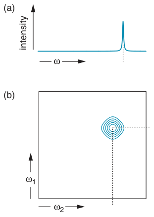

Two-dimensional spectroscopy has also made it possible to use NMR to determine the structures of biomolecules, such as proteins, DNA and RNA – tackling molecules of this size would have been quite unthinkable before the advent of two-dimensional techniques. Once the idea of two dimensions was firmly established, the extension to three or even four dimensions followed on quite naturally, and such experiments open up the possibility of studying even larger biomolecules.

In this chapter we are going to be concerned with the simplest and most frequently used two-dimensional experiments. These will serve as our introduction to the key ideas in two-dimensional NMR which are the basis of more elaborate experiments.

**Fig. 8.1** In conventional (one-dimensional) NMR we plot the intensity of absorption against frequency, as shown in (a); each peak has a single frequency coordinate. In two-dimensional NMR, (b), each peak has two frequency coordinates, measured along the ω1 and ω2 axes. It is usual to present two-dimensional spectra as contour plots in which points of equal intensity are joined by lines, just as in a topographic map.

The basic idea behind two-dimensional NMR is quite simple, but it is one of those simple ideas capable of great elaboration. As shown in Fig. 8.1, in conventional (one-dimensional) NMR we have a plot of intensity against frequency, whereas in two-dimensional NMR we plot intensity against two frequency axes; each peak in a two-dimensional spectrum thus has an intensity and two frequency co-ordinates. What these two co-ordinates represent depends on the experiment in question.

Probably the most useful two-dimensional experiments are those in which the position of the peak shows a correlation between two quantities. For example, in the COSY experiment the frequency co-ordinates of the peaks give the chemical shifts of coupled spins. Another example is the HMQC experiment, in which one frequency co-ordinate gives the 13C chemical shift, while the other gives the chemical shift of the attached proton.

In this chapter we will look in detail at a number of important two-dimensional experiments, and will analyse them using the product operator method introduced in the previous chapter. At this stage, we will restrict the discussion to two-dimensional experiments which involve transfer of magnetization through scalar couplings. Discussion of the important NOESY experiment, in which the magnetization transfer arises due to relaxation effects, is delayed until the next chapter which is devoted to relaxation.

For the whole of this chapter we will restrict ourselves to discussing just two coupled spins. Although this is the simplest system in which magnetization transfer through scalar couplings can be seen, all of the important ideas about how two-dimensional NMR experiments work can be understood by considering this simple spin system. There are, however, some additional features which can only be seen if we have three or more spins; for a selected set of experiments, these are discussed in Chapter 10.

Before embarking on our discussion of specific experiments, we will consider the general scheme for two-dimensional NMR, and discuss the important topic of lineshapes.

## 8.1 The general scheme for two-dimensional NMR

A general way of representing just about all two-dimensional experiments is shown in Fig. 8.2. We start with the preparation period, during which the equilibrium magnetization is transformed into some kind of coherence which then evolves for the evolution period, t1.

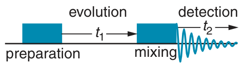

The preparation period might be something as simple as a 90◦ pulse, which would generate transverse magnetization (single-quantum coherence). However, this period could be a more complicated set of pulses and delays. For example, it might be a sequence designed to generate multiple-quantum coherence, or an INEPT-style sequence designed to transfer magnetization from another type of nucleus.

**Fig. 8.2** The general scheme for two-dimensional NMR. The preparation and mixing periods may be as simple as a single pulse, or may consist of much more complex arrangements of pulses and delays. The coherence generated during the preparation period evolves for time t1, but there is no detection during this time. After the mixing period, the signal is detected during time t2.

The evolution period, t1, is not a fixed time; rather, t1 is incremented systematically in a series of separate experiments. We will have more to say about how this is done in the next section. The second important thing about the evolution period is that no observations are made during it. So, the coherence which evolves during t1 need not be observable e.g. it could be multiple-quantum coherence. This ability to follow the evolution of unobservable coherences is an important feature of two-dimensional NMR.

Next comes the mixing period, during which the coherence present at the end of t1 is manipulated into an observable signal which can be recorded during the detection period, t2. For example, if multiple-quantum coherence is present during t1, then the mixing period needs to be devised in such a way as to transform the multiple-quantum coherence into an observable signal. During the mixing time it is also common for magnetization to be transferred from one spin to another, for example through a scalar coupling. Ultimately, it is the form of the mixing period which determines the information content of the spectrum.

### 8.1.1 How two-dimensional spectra are recorded

At the start of Chapter 5, we described how the FID is recorded at regular time intervals, leading to a series of data points which represent the time-domain function. In a two-dimensional experiment, the same approach is used, with data being recorded at regular intervals in both t1 and t2.

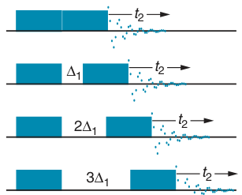

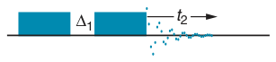

The process of acquiring a two-dimensional time-domain data set is illustrated in Fig. 8.3. First, t1 is set to zero, the pulse sequence is executed and the FID recorded as a series of data points in the usual way. The resulting set of data is stored away (in memory or on computer disc). This set of data is called the first t1 increment.

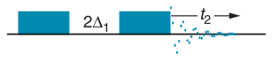

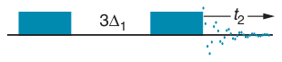

Next, t1 is set to Δ1, the sampling interval in that dimension. Once again, the sequence is executed, the data recorded and stored away separately. These data form the second t1 increment.

**Fig. 8.3** Illustration of how a two-dimensional data set is recorded for the general sequence of Fig. 8.2 on the facing page. First, t1 is set to zero, the sequence is executed and the FID is digitized at regular intervals as a function of t2; the resulting time-domain signal is stored away. Next, t1 is set to the sampling interval Δ1. The sequence is then executed and the data (as a function of t2) are recorded and stored away. The whole process is repeated for the next increment of t1, in which t1 = 2Δ1 and so on for as many increments of t1 as are required.

The process is repeated with t1 = 2Δ1, t1 = 3Δ1 . . . until sufficient data in the t1 dimension have been built up. We can imagine all these data as forming a matrix. The first row is the t2 data for t1 = 0, the second row is the t2 data for t1 = Δ1, the third for t1 = 2Δ1 and so on. This two-dimensional data set can be represented as the time-domain function

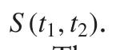

The t2 data are recorded in real time, just as in a conventional experiment. It is therefore not time consuming to record thousands of data points, should we wish to. However, in t1 it is rather a different story, as for each data point (each increment) we have to execute the whole pulse sequence. So, data as a function of t1 is rather more time consuming to record. It is therefore uncommon to record more than a few hundred increments of t1.

### 8.1.2 How the data are processed

In conventional (one-dimensional) NMR we take the time-domain function S (t), and subject it to a Fourier transform to give the frequency-domain function, or spectrum, S (ω). In two-dimensional NMR we have a time-domain function which depends on t1 and t2, so in order to arrive at the spectrum, we need to Fourier transform with respect to both times.

The way in which this is done is visualized in Fig. 8.4 on the following page. We start with the time-domain data which can be thought of as a matrix. A row in the matrix corresponds to a particular value of t1, whereas a column corresponds to a particular value of t2. Remember that the data are sampled at regular intervals, so that the first row corresponds to t1 = 0, the second to t1 = Δ1, the third to t1 = 2Δ1 and so on. Similarly, the data in the first column correspond to t2 = 0, the second to t2 = Δ2 and so on (Δ2 is the sampling interval in t2).

The first step is to extract each row from the matrix in turn, subject it to the usual Fourier transform, and then construct a new matrix out of these transformed rows. What this process gives us is a series of spectra, with the running frequency variable ω2 (in angular frequency units). Each row in the new matrix corresponds to a different t1 value.

We now take each column in turn from this new matrix. A column corresponds to a particular ω2 frequency, and the data points in the column correspond to increasing values of t1; these time-domain data are often

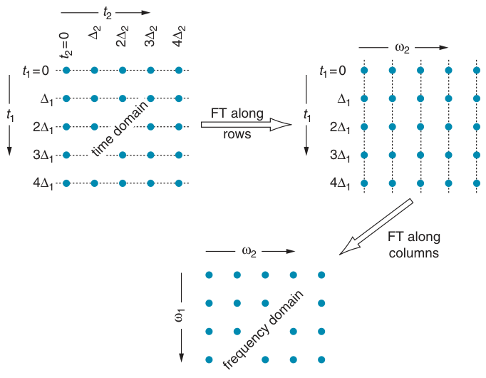

**Fig. 8.4** Visualization of how a two-dimensional time-domain matrix is converted to a two-dimensional spectrum. The original data, top left, are arranged in a matrix with successive rows corresponding to longer t1 values, and successive columns corresponding to longer t2 values. The data along t2 are sampled at intervals of Δ2, whereas those along t1 are sampled at intervals of Δ1. The first step is to take the rows, Fourier transform them and then construct a new matrix (top right). In this matrix, successive rows still correspond to increasing values of t1, but the columns now correspond to different ω2 frequencies, resulting from the Fourier transformation with respect to t2. In the second step, columns from the top right matrix are subjected to a Fourier transform. The data in these columns correspond to increasing values of t1, and so Fourier transformation gives a spectrum with running frequency variable ω1. These transformed columns are used to construct the bottom matrix, which is the two-dimensional frequency-domain spectrum.

called interferograms. Each column is subject to a Fourier transform and then used to construct the final matrix. The columns of this matrix have the running frequency variable ω1 (in angular units). Figure 8.5 on the next page shows an example of the result of these two separate transforms on a simple time-domain data set.

This final matrix is our two-dimensional spectrum, with frequency axes ω1, corresponding to the evolution in t1, and ω2, corresponding to the evolution in t2. Just as for one-dimensional spectra, the time-domain data can be manipulated using weighting functions, and the final spectrum subject to phase correction. The only difference here is that we need separate weighting and phasing in each dimension.

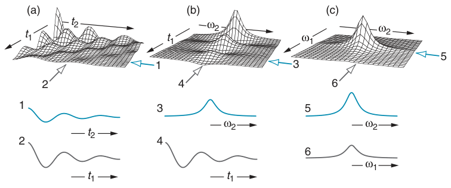

**Fig. 8.5** Illustration of the process of double Fourier transformation on a simple data set. The original time-domain data, shown in (a), consists of a damped cosine wave in each dimension. Fourier transformation with respect to t2 gives the data shown in (b), and then the second Fourier transform with respect to t1 gives the two- dimensional spectrum shown in (c); as expected, the spectrum shows a single line. Two typical cross-sections, taken through each data set at the positions indicated by the numbered arrows, are shown beneath each data set. Cross-sections 1 and 2 are taken parallel to t2 and t1, respectively, and show damped cosine waves. In data set (b), cross-section 3, which is taken parallel to ω2, shows a peak. However, cross- section 4, which is taken parallel to t1, still shows a cosine wave. The peak is said to be modulated in t1 by the cosine wave. In the final spectrum (c), cross-sections 5 and 6 both show a single peak. The intensity in any particular cross-section depends on the coordinate at which it is taken.

## 8.2 Modulation and lineshapes

In section 5.3 on page 83 we saw that Fourier transformation of an exponentially damped time-domain function gives a spectrum with the absorption mode Lorentzian lineshape in its real part (Eq. 5.7 on page 85):

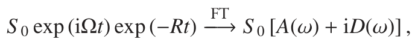

where A(ω) is the absorption mode Lorentzian and D(ω) is the corresponding dispersion mode lineshape. We now need to work out what to expect when we subject a two-dimensional time-domain data set to a two-dimensional Fourier transformation.

### 8.2.1 Cosine amplitude modulated data

As we will see when we analyse some particular experiments, a typical two-dimensional time-domain function is of the form:

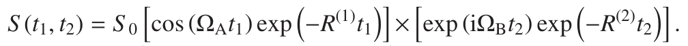

modulation in t1

In this expression, S 0 gives the overall amplitude of the signal, ΩA is the modulating frequency in t1, and R(1) is the decay constant in this dimension. Similarly, ΩB and R(2) are the frequency and the decay constant in t2. The

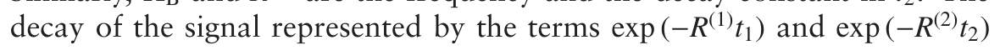

is in fact due to transverse relaxation – a topic considered in detail in the next chapter. R(1) and R(2) are therefore transverse relaxation rate constants; however, for the present purposes it does not really matter what the origin of these decay terms is.

This time-domain signal is described as being cosine amplitude modulated with respect to t1. The name arises because the t1 modulation is of the form of a cosine, which simply varies the amplitude, but not the phase, of the signal.

If we Fourier transform this time-domain signal with respect to t2 we obtain, just as before, a spectrum whose real part contains an absorption mode Lorentzian centred at ΩB, and whose imaginary part contains the corresponding dispersion mode lineshape.

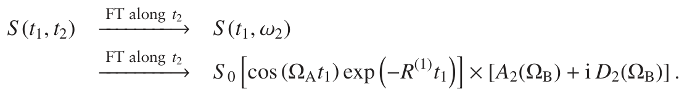

The notation here is that A2(Ω) represents an absorption Lorentzian in the ω2 dimension, centred at frequency Ω; similarly, D2(Ω) represents the corresponding dispersion lineshape.

The next step is to Fourier transform S (t1, ω2) with respect to t1. In contrast to the modulation in t2, which is of the form of a complex exponential exp (iΩt), the modulation in t1 is simply a cosine wave. As a consequence, to generate the spectrum we need to use a slightly different kind of Fourier transform, called a cosine Fourier transform.

The cosine Fourier transform of a damped cosine wave gives the absorption mode Lorentzian:

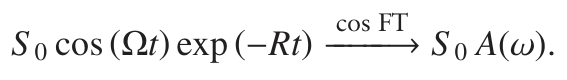

Note that, in contrast to the transform of the complex exponential, the resulting spectrum is real.

Using this, we can determine the result of the cosine transform with respect to t1:

where A1(Ω) represents an absorption mode Lorentzian centred at Ω in the ω1 dimension.

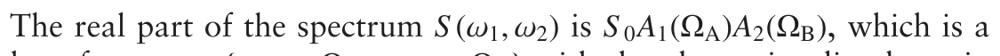

peak at frequency {ω1 = ΩA, ω2 = ΩB} with the absorption lineshape in each dimension. This lineshape is called a double absorption Lorentzian, and is illustrated in Fig. 8.6 on the facing page. The imaginary part has a lineshape which is dispersive in the ω2 dimension. Such a lineshape is not suitable for high-resolution spectra, so we simply choose to display the real part.

**Fig. 8.6** Two views of the double absorption mode Lorentzian lineshape, commonly encountered in two-dimensional spectra. On the left is shown a perspective view, and on the right is shown a contour plot. A cross-section through this lineshape taken parallel to either axis shows an absorption mode line whose intensity depends on where the cross-section is taken.

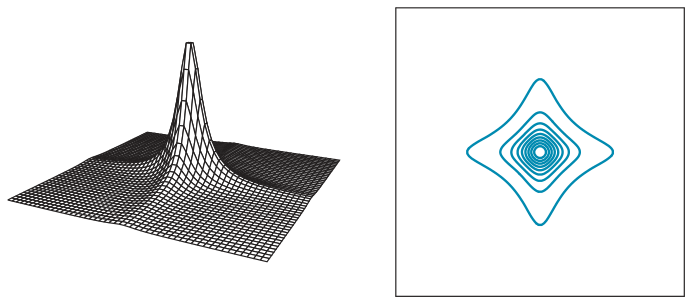

### 8.2.2 Sine amplitude modulated data

Another commonly encountered two-dimensional time-domain function has sine, rather than cosine, amplitude modulation:

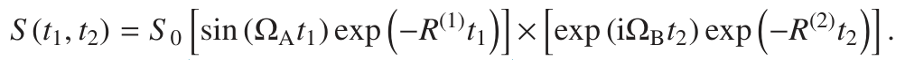

modulation in t1

The transform with respect to t2 gives the absorption and dispersion mode lineshape, just as in the case of the cosine modulated data:

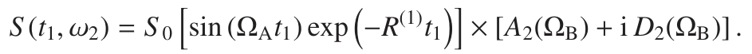

This time, the modulation with respect to t1 is of the form of sine, so to transform the data in t1 we need a sine Fourier transform. Such a transform of a damped sine wave again gives the absorption mode Lorentzian:

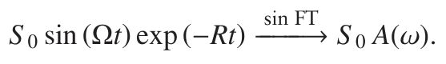

Using this for the transform with respect to t1, we can work out the form of the resulting spectrum:

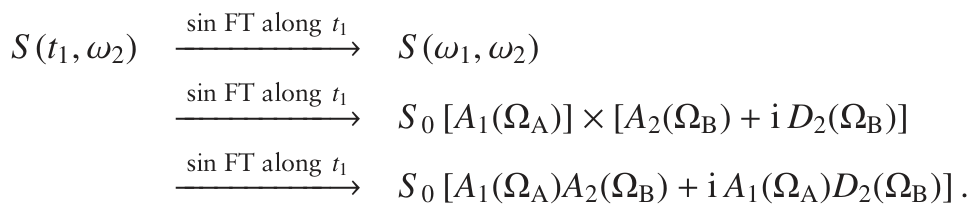

As before, the real part of the spectrum contains the required double absorption lineshape.

### 8.2.3 Mixed cosine and sine modulation

If the data are either cosine or sine modulated, we can obtain the desired double absorption lineshape by selecting the appropriate type of transform in the t1 dimension. Unfortunately, there are cases where, in a single experiment, some of the data are cosine and some are sine modulated, so it is not possible to choose the appropriate transform for all of the data.

A cosine Fourier transform of a sine modulated signal gives the dispersion lineshape:

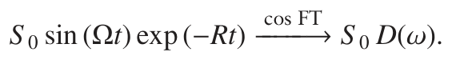

A sine Fourier transform of a cosine modulated signal also gives the dispersion lineshape:

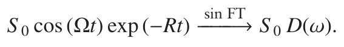

So, if we select the kind of Fourier transform which results in the cosine modulated data giving the desired absorption mode lineshape, then the sine modulated data will give peaks with the undesirable dispersion lineshape. Similarly, selecting the correct transform for the sine modulated data will result in dispersion mode lineshapes for the cosine modulated data. There is no way round this problem, although we will see in due course that it is sometimes possible to modify an experiment so as to obtain one kind of modulation.

### 8.2.4 Labelling the axes of two-dimensional spectra

In all of the theoretical approaches we use to analyse NMR experiments, it is generally more convenient to express any frequencies in rad s−1, rather than in Hz. This is why we so far have labelled the frequency axes of our two-dimensional spectra as ω1 and ω2, so as to indicate that they are in angular frequency units.

However, when we are interpreting and working with practical spectra, we are certainly going to be using Hz or ppm, and not rad s−1. Of course, ppm is not really a frequency scale at all, but such values can readily be converted into frequencies.

Since this chapter is concerned with using theoretical methods to predict and understand the form of two-dimensional spectra, we will label the axes ω1 and ω2 i.e. implying angular frequency units. This gives us a common unit for the axes and quantities such as the offsets of the two spins, Ω1 and Ω2. However, when we give experimental examples of two-dimensional spectra we will label the scales in ppm, as is clearly most natural.

Often, we will want to indicate that the splitting between two peaks in a two-dimensional spectrum is given by the coupling between the two spins, J12 (Hz). As the frequency scale is in rad s−1, the splitting should be labelled 2πJ12, so that it too will be in rad s−1. Although this is technically correct, we will not do it as the result would be cumbersome and fussy. So, even though the scale is in rad s−1, we will mark the splitting as J12; from the context, it will always be clear what is going on.

## 8.3 COSY

The COSY experiment, and its variants, is one of the most popular and useful of all two-dimensional experiments. It is a homonuclear experiment, mostly used for analysing proton spectra. From a COSY spectrum it is possible to identify the chemical shifts of spins which are scalar coupled to

COSY: COrrelation SpectroscopY one another, thus enabling us to trace out the J-coupling network in the molecule.

Figure 8.7 shows a schematic COSY spectrum; broadly speaking it contains two kinds of peaks: cross peaks, here shown in blue, and diagonal peaks show in dark grey. Cross peaks have different frequency coordinates in ω1 and ω2. Such a peak appearing at frequency ω1 = ΩA, ω2 = ΩB shows that a spin at offset (chemical shift) ΩA is coupled to another spin at offset (chemical shift) ΩB. Thus, the spectrum in Fig. 8.7 shows the presence of the following couplings: A–B, B–D and C–E. Diagonal peaks have the same frequency coordinates in ω1 and ω2, and are centred at the offset (chemical shift) of each spin. These peaks do not convey any particular information about the connectivity of the spins, but serve to locate the shifts in the spectrum.

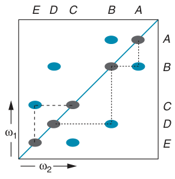

We will see shortly that the ‘blobs’ used in Fig. 8.7 to represent cross and diagonal peaks are not single lines but collections of peaks which form a two-dimensional multiplet. So, to be more precise we should refer to cross-peak multiplets and diagonal-peak multiplets.

**Fig. 8.7** A schematic COSY spectrum, indicating how it is used to determine the chemical shifts of coupled spins. In this example there are five spins, A–E, with the offsets indicated. Two kinds of peaks appear in the spectrum: diagonal peaks, shown in dark grey, and cross peaks, shown in blue. Diagonal peaks have the same frequency coordinates (chemical shifts) in each dimension, whereas for cross peaks the coordinates are different. The appearance of the cross peak at the ω1 frequency of B and the ω2 frequency of A indicates that A and B are coupled. Using the same interpretation for the other cross peaks, we find that B is further coupled to D (connections indicated by the dashed lines in the lower triangle). Similarly, C is coupled to E, but not to any of the other spins (the dashed lines in the upper triangle show this connection). Overall, the COSY spectrum allows us to trace out the network of coupled spins in the molecule. Note that the spectrum has symmetry about the diagonal, shown by the blue line.

### 8.3.1 Overall form of the COSY spectrum

The pulse sequence for the COSY experiment in shown in Fig. 8.8 on the following page. Although the pulse sequence is very simple, working out the detailed form of the spectrum is quite an involved process, so we will go through the calculation slowly.

We will start with equilibrium magnetization on spin one, Î1z, which is rotated to −Î1y by the first 90◦ pulse. During t1 this magnetization evolves under the offset of spin one and the coupling between the two spins. Evolution of the offset gives:

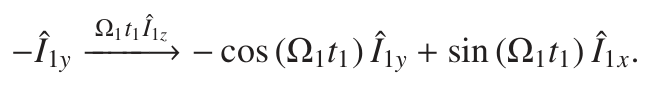

Each term evolves under the coupling to give :

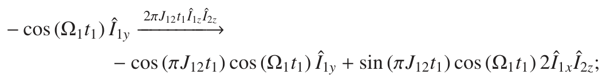

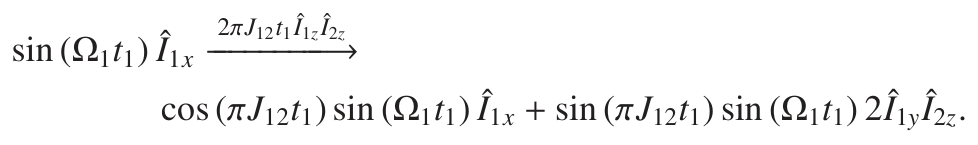

Finally, each of these four terms is rotated by the second 90◦ pulse:

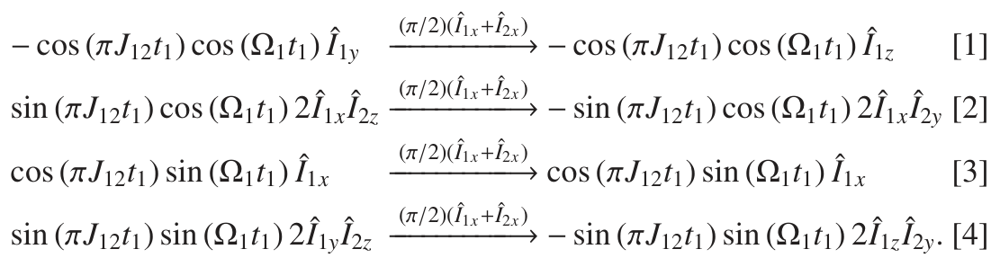

This brings us to the start of t2, so from now on we need only consider the observable terms, which are [3] and [4]. Term [1] represents z-magnetization, and term [2] is multiple-quantum coherence, neither of which is observable.

The operator in term [3] is Î1x, which will give rise to a doublet on spin one in the ω2 dimension. This term is modulated in t1 by sin (Ω1t1) i.e. it is modulated at the offset of spin one, Ω1. Thus, in the two-dimensional spectrum, term [3] gives rise to a feature centred at the offset of spin one in ω2, and the offset of spin one in ω1: in other words, a diagonal peak (or more precisely a diagonal-peak multiplet). The position of the peak is shown in Fig. 8.9.

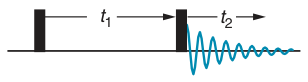

**Fig. 8.8** The pulse sequence for the COSY experiment. Filled in rectangles indicate 90◦ pulses; unless otherwise indicated, it is assumed that the phase of the pulses is x.

In contrast, the operator in term [4] is 2Î1z Î2y; this gives rise to an anti-phase doublet centred at the shift of spin two in the ω2 dimension. Like term [3], [4] is also modulated in t1 according to sin (Ω1t1). So, overall, term [4] gives rise to a feature centred at Ω1 in ω1 and Ω2 in ω2; this is a cross-peak multiplet. Once again, the position of the peak is shown in Fig. 8.9.

We started the calculation with equilibrium magnetization on spin one, Î1z. If we repeat the calculation starting with equilibrium magnetization on spin two, Î2z, the resulting observable terms are

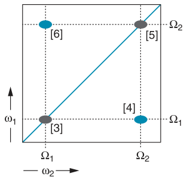

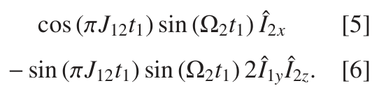

Using the same interpretation as above, term [5] is the diagonal-peak multiplet centred at Ω2 in each dimension, and [6] is the cross-peak multiplet centred at Ω2 in ω1 and Ω1 in ω2. So, the complete COSY spectrum consists of two diagonal-peak multiplets and two cross-peak multiplets, as shown schematically in Fig. 8.9.

**Fig. 8.9** Schematic COSY spectrum for two-spin system. There are two diagonal-peak multiplets, shown in dark grey, centred at {ω1, ω2} = {Ω1, Ω1} and {Ω2, Ω2}. In addition, there are two cross-peak multiplets, shown in blue, centred at {Ω1, Ω2} and {Ω2, Ω1} (the internal structure of the multiplets is not shown). The numbers in square braces refer to the terms in the calculation which give rise to each feature. If the coupling between the spins goes to zero, the cross-peak multiplets disappear.

Looking back through the calculation we can see that the cross peak, term [4], arises from magnetization on spin one which went anti-phase during t1 and was then transferred to spin two by the second 90◦ pulse. In other words, the cross peaks arise due to coherence transfer via the coupling.

If the coupling J12 is zero, no such anti-phase magnetization is generated, and so there is no cross peak. We can see this from the calculation as term [4],

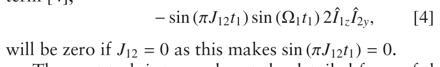

The next task is to work out the detailed form of the two-dimensional multiplets. We will find that each consists of four separate peaks, but that the phase and sign of the four peaks is significantly different between the cross- and diagonal-peak multiplets.

### 8.3.2 Detailed form of the two-dimensional multiplets

### The cross-peak multiplet

The cross-peak multiplet arises from term [4]:

As was shown in section 7.5.2 on page 154, evolution of the term 2Î1z Î2y during t2 gives rise to a time-domain signal of the form

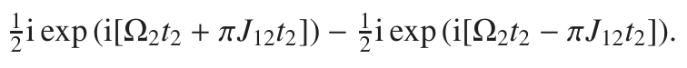

As expected, we have terms oscillating at (Ω2 + πJ12) and (Ω2 −πJ12), which are the frequencies of the two lines of the spin-two multiplet.

If we impose an exponential decay on this time-domain signal, we obtain

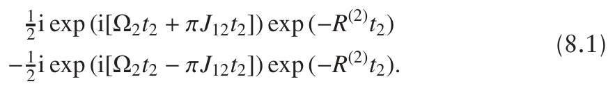

The Fourier transform of an exponentially decaying oscillation gives the usual spectrum, with the absorption mode in the real part:

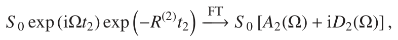

so Fourier transformation of the time-domain signal in Eq. 8.1 gives:

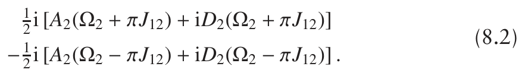

As expected, there are two peaks, one at (Ω2 + πJ12) and one at (Ω2 − πJ12). Most importantly, the peak at (Ω2 + πJ12) is positive whereas that at (Ω2 − πJ12) is negative, so what we have is an anti-phase doublet, just as expected for the term 2Î1z Î2y.

Due to the factor of 12i which is multiplying the whole expression in Eq. 8.2, the desirable absorption mode lineshape appears in the imaginary part of the spectrum. The normal practice is to adjust the phase of the spectrum so that the absorption mode lineshape appears in the real part. In this case the required phase correction is −90◦ or (−π/2) radians; such a correction is achieved by multiplying by exp (−i[π/2]) ≡−i. Noting that

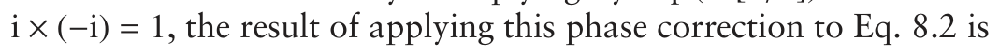

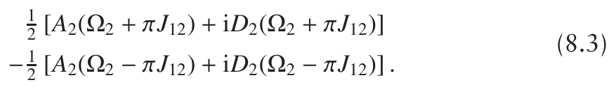

Now the absorption mode lineshape appears in the real part of the spectrum.

For term [4], the modulation with respect to t1 is of the form

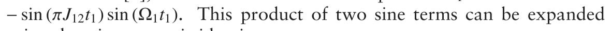

using the trigonometric identity

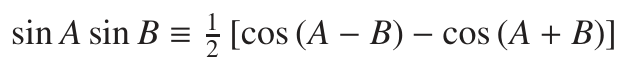

to give

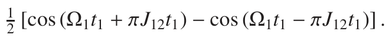

As before, we impose an exponential decay to give

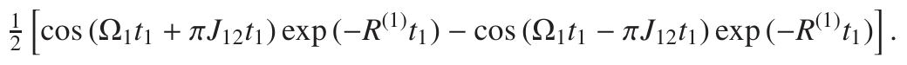

**Fig. 8.10** Contour plot of the cross-peak multiplet centred at ω1 = Ω1 and ω2 = Ω2. Positive contours are shown in blue and negative ones are shown in dark grey. Alongside each axis is plotted an anti-phase doublet, and the four peaks in the two-dimensional spectrum can be constructed by ‘multiplying together’ these two anti-phase doublets. For example, the top right-hand peak is positive, as the peaks along ω1 and ω2 from which it is derived are both positive. In contrast, the top left-hand peak is negative, as it is constructed from the product of a positive peak (along ω1) and a negative peak (along ω2).

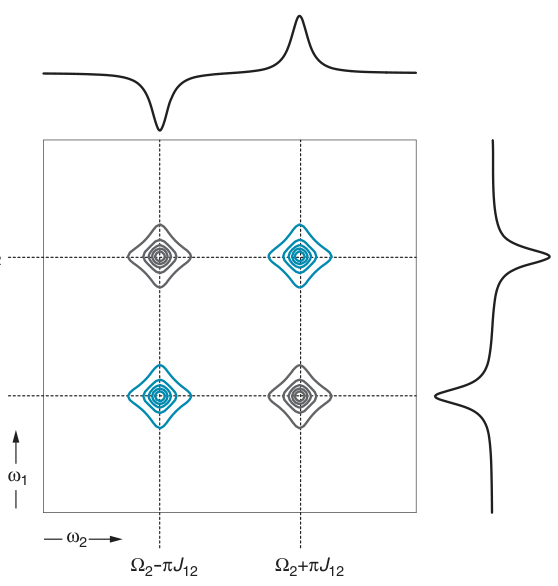

Ω1+πJ12

Ω1-πJ12

The cosine Fourier transformation of this with respect to t1 gives two absorption mode peaks:

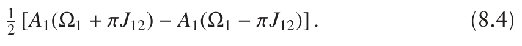

What we have here are the two lines of the spin-one doublet; one line is positive and one is negative i.e. the doublet is in anti-phase.

Equation 8.3 on the preceding page gives the spectrum in the ω2 dimension, and Eq. 8.4 gives the spectrum in the ω1 dimension. Multiplying the two together will give us the overall form of the two-dimensional spectrum. If we take just the real part of the ω2 spectrum (as this has the absorption mode lineshape), the result is

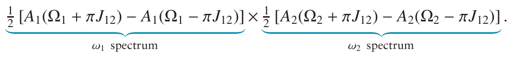

Multiplying this out gives us four lines, each with the double absorption lineshape:

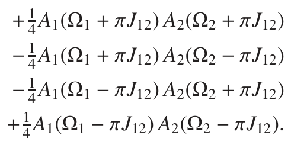

Figure 8.10 shows a contour plot of these four peaks. This pattern is called an anti-phase square array, on account of the sign alternation of the peaks in each dimension. The array of peaks is centred at ω1 = Ω1 and

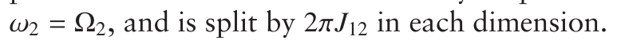

The process of finding the frequencies and signs of the four peaks is, to say the least, rather convoluted, but can be speeded up by using the following approach.

In term [4] the operator is 2Î1z Î2y, and we already know that this gives rise, with suitable phasing, to an anti-phase doublet on spin two. In t1, we saw that the modulation of the signal, − sin (πJ12t1) sin (Ω1t1), could be expressed as

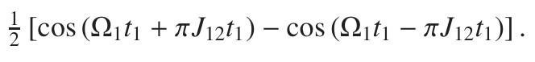

The Fourier transform of this gives an anti-phase doublet on spin one.

The two-dimensional multiplet can be found by imagining these two anti-phase doublets along the ω1 and ω2 axes, as show in Fig. 8.10 on the facing page, and then multiplying them so as to create the two-dimensional multiplet. To describe this process in words makes it sound very complicated, but if you look at Fig. 8.10 it should be clear what the process is.

If the coupling J12 goes to zero, then the four peaks in the anti-phase square array will fall on top of one another and cancel completely. So, if the coupling is zero, there is no cross-peak multiplet.

### The diagonal-peak multiplet

The diagonal-peak multiplet is represented by term [3] from page 191:

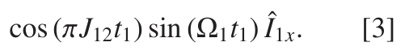

From section 7.5.1 on page 153 we know that evolution of the term Î1x during t2 will give the following signal

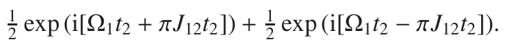

If we assume that this is decaying exponentially, then Fourier transformation with respect to t2 gives the following frequency-domain signal:

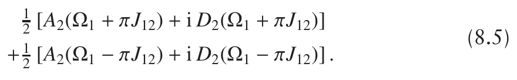

This time, the real part contains the required double absorption lineshape, so no phase correction is required. As expected for the term Î1x, the spectrum is an in-phase doublet of spin one.

The modulation of the signal with respect to t1 is the product of a cosine and a sine term. This can be expanded using the trigonometric identity

to give

Again assuming an exponential decay, a sine Fourier transform with respect to t1 gives two absorption mode peaks of the same sign:

**Fig. 8.11** Contour plot of the diagonal-peak multiplet centred at the offset of spin one in both dimensions; positive contours are indicated by blue lines. Note that, in contrast to the cross-peak multiplet shown in Fig. 8.10 on page 194, all four peaks have the same sign. Alongside each axis is plotted an in-phase doublet; the two-dimensional multiplet can be constructed by multiplying these together.

Ω1+πJ12

Ω1-πJ12

These two lines form the in-phase doublet on spin one.

The two-dimensional spectrum is the product of the ω2 part, Eq. 8.5 on the preceding page, and the ω1 part, Eq. 8.6 on the previous page. Taking just the real part of Eq. 8.5 on the preceding page we find:

Multiplying this out gives four double absorption lines, which are all positive.

Figure 8.11 shows a schematic contour plot of these four peaks. The array of peaks is centred at ω1 = Ω1 and ω2 = Ω1, and is split by 2πJ12 in each dimension. Note that, in contrast to the cross-peak multiplet, all of the lines in the diagonal-peak multiplet have the same sign. If the coupling goes to zero, these four peaks fall on top of one another, but in contrast to the cross-peak multiplet, the four lines reinforce one another.

As before, we can speed things up by realizing that the spectrum in ω2 is an in-phase doublet on spin one. The form of the modulation in t1

tells us that the spectrum in ω1 is also an in-phase doublet on spin one. Multiplying these two together, in the manner shown in Fig. 8.11, gives the four positive lines of the diagonal-peak multiplet.

**Fig. 8.12** Two views of the double dispersion mode Lorentzian lineshape: on the left is shown a perspective view, and on the right is shown a contour plot (positive contours are blue, negative contours are dark grey). A cross-section through this lineshape taken parallel to either axis shows a dispersion mode line.

### 8.3.3 Phase properties of the COSY spectrum

Looking back through the previous section, you will see that we used rather different processing to obtain the cross- and diagonal-peak multiplets shown in Figs 8.10 and 8.11.

- For the cross peak, we applied a 90◦ phase correction in the ω2 dimension and used a cosine Fourier transform in t1.

- For the diagonal peak, no phase correction was used in ω2, and a sine Fourier transform was used in t1.

We can, of course, choose to process the data any way we like, but the whole spectrum is processed at the same time: we cannot choose one kind of processing for the cross peaks, and a different one for the diagonal peaks. It turns out that, if we choose the processing which results in the cross peaks appearing in double absorption, then the diagonal peaks will appear in double dispersion.

The reason for this can be seen by looking at the terms which give rise to the cross and diagonal peaks. The diagonal-peak term is

expanding the trigonometric terms as we did before gives

The cross-peak term is

which expands to

Comparing Eqs 8.7 and 8.8, we see that in the first the magnetization observed during t2 appears along the x-axis, whereas in the second it appears along the y-axis; this accounts for the 90◦ phase shift in the ω2 dimension. Similarly, the t1 modulation in the first appears as a sine, whereas in the second it appears as a cosine; this accounts for the change in lineshape in the ω1 dimension.

**Fig. 8.13** Schematic COSY spectra of a two-spin system. In (a) the processing has been chosen so that the cross peaks have the double absorption lineshape and the diagonal peaks have the double dispersion lineshape; in (b), the processing has been chosen so that the lineshapes are the other way round. The anti-phase square arrays are clearly visible in (a), but harder to spot in (b). On account of their dispersion lineshape, the diagonal peaks in (a) spread much more than in (b).

The double dispersion lineshape is illustrated in Fig. 8.12 on the previous page. As the dispersive line has positive and negative parts, the two-dimensional lineshape alternates sign in a four-fold pattern; furthermore, compared with the double absorption lineshape, the peak height is reduced by a factor of 14. The combination of the broad wings of the dispersion lineshape, and the alternating signs, makes this lineshape very undesirable for high-resolution work. The double absorption lineshape, illustrated in Fig. 8.6 on page 189, is much preferred.

Figure 8.13 shows schematic COSY spectra processed in such a way as to have either the cross peaks or the diagonal peaks in double absorption. It is clear from these plots that the double dispersion lineshape, whether it appears on the diagonal or the cross peaks, is simply not desirable.

### 8.3.4 How small a coupling can we detect with COSY?

We commented above that, if the coupling goes to zero the cross peak disappears due to the cancellation of the anti-phase lines. However, what happens if the coupling is not zero, but just small: will the cross peak be detectable?

The answer to this question is illustrated in Fig. 8.14 on the facing page, which shows cross-sections through a series of cross-peak multiplets in which the coupling constant is successively halved. Thus if the coupling constant for the left-most doublet is Jmax, for the next it is Jmax/2, for the next it is Jmax/4 and so on; the linewidth has been kept constant, and is about one-fifth of Jmax.

As the coupling constant becomes smaller and smaller, the two lines begin to overlap and, since they are of opposite sign, they begin to cancel one another out. So, as we go from left to right in the diagram, the overall intensity of the cross peaks gets smaller and smaller. However, in (a) the anti-phase multiplet is still clearly visible even on the far right-hand side where the coupling has been reduced by a factor of 1/64.

The spectra shown in (a) are unrealistic, though, as unlike experimental spectra they contain no noise. The series of spectra (b) are the same as (a)

**Fig. 8.14** Both (a) and (b) show cross-sections taken through a series of cross-peak multiplets in which the coupling constant has been halved in each successive step. Since the two lines are in anti-phase, once the coupling constant becomes comparable with the linewidth, cancellation starts to occur, leading to an overall reduction in intensity. The series of spectra in (b) differ in that noise has been added to them. In these spectra we see that as the coupling constant decreases, the signal-to-noise ratio decreases, indeed the effect is sufficient to make it impossible to discern the anti-phase doublet in the right-most spectrum. The smallest coupling which can be detected thus depends on the linewidth and the noise level in the spectrum.

except that noise has been added. Now, as the overall intensity decreases, we see that the signal-to-noise ratio also decreases. In fact, for the right-most spectrum, the anti-phase doublet is not really visible.

The amount of cancellation in an anti-phase doublet depends on the size of the coupling relative to the linewidth. If the coupling is much larger than the linewidth, there will be no cancellation, but as the two become comparable a significant amount of cancellation occurs. Once the linewidth becomes larger than the coupling, the amount of cancellation will be very significant.

For a given combination of linewidth and coupling constant, whether or not a cross peak is visible above the noise depends on the signal-tonoise ratio. Therefore, to detect cross peaks due to the smallest coupling constants we need to make sure that the linewidth is minimized and the signal-to-noise ratio maximized.

### 8.3.5 The problem with COSY

The basic COSY experiment is undoubtedly extraordinarily useful, but it does suffer from two drawbacks, both of which are associated with the detailed form of the cross- and diagonal-peak multiplets.

The first problem is a consequence of the anti-phase structure of the cross-peak multiplet, which contrasts with the in-phase structure of the diagonal-peak multiplet. In the cross-peak multiplet the lines tend to cancel one another out, leading to a reduction in intensity, whereas in the diagonal-peak multiplet the lines tend to reinforce one another. As a result, there can be a considerable difference in the overall intensity of the cross and diagonal peaks, particularly when the coupling is comparable with, or smaller than, the linewidth. The presence of intense diagonal peaks can make it difficult to locate the weaker cross peaks, especially if they lie close to the diagonal.

The second problem is to do with the lineshapes in the spectrum. As was illustrated in Fig. 8.13 on page 198, if we phase the cross peaks to absorption, the diagonal peaks will be in double dispersion. The latter lineshape is rather broad and results in the diagonal peaks spreading out into the spectrum, possibly obscuring nearby cross peaks. The alternative, shown in Fig. 8.13 (b) on page 198, is to phase the diagonal to double absorption, which reduces its tendency to spread into the spectrum. However, the cross peaks are then in double dispersion, which further reduces their intensity and makes it more difficult to spot the characteristic anti-phase square arrays.

Both of these problems are neatly avoided (in large part) by a simple modification of COSY called double-quantum filtered COSY (DQF COSY). As we shall see in the next section, in the modified experiment both the diagonal- and cross-peak multiplets are in anti-phase and have the same lineshape.

## 8.4 DQF COSY

The pulse sequence for DQF COSY is shown in Fig. 8.15. The key point about this sequence is that we arrange things so that the signals observed during t2 all derive from double-quantum coherence present between the second and third 90◦ pulses. In other words, all of the observed signals have been passed through, or been filtered through, a state of double-quantum coherence – hence the name of the experiment.

**Fig. 8.15** The pulse sequence for double-quantum filtered COSY (DQF COSY). In this experiment it is arranged that the only signal observed comes from double-quantum coherence present between the second and third 90◦pulses – hence the name ‘double-quantum filtered’.

The way in which we ensure that the observed signals all derive from double-quantum coherence is to use a coherence selection method such as phase cycling or pulsed field gradients. These methods are described in detail in Chapter 11. For the present purposes we will simply assume that the selection can be made, and leave the details of how to later.

Starting with equilibrium magnetization on spin one, Î1z, the evolution during t1 and the effect of the second 90◦ pulse are exactly as for COSY: we thus obtain the four terms [1]–[4] listed on page 191. Of these, it is only term [2] which contains double-quantum coherence, so this is the only term of interest to us at present:

We saw in section 7.12.1 on page 174 that 2Î1x Î2y is a mixture of double- and zero-quantum coherence. In the table on page 175 the pure double-quantum operator ˆ

DQy and the pure zero-quantum operator ZQyˆ were defined as

From these definitions we can see that

**Fig. 8.16** Comparison of a conventional COSY, (a), and a DQF COSY, (b), for a two-spin system. The conventional COSY has been processed so that the cross peaks have the double absorption lineshape; as a result, the diagonal peaks have the double dispersion lineshape. The overall result is that the broad dispersive diagonal peaks rather dominate the spectrum. In contrast, both the diagonal- and cross-peak multiplets of the DQF COSY spectrum are anti-phase square arrays of absorption mode peaks. This results in the diagonal-peak multiplets being much less dominant.

or put the other way round

It follows that the pure double-quantum part of 2Î1x Î2y is 12 D̂Qy:

Using this result we see that the pure double-quantum part of term [2] is

The third 90◦ pulse rotates both of these terms into observable anti-phase magnetization:

This brings us to the start of t2.

The two terms 2Î1x Î2z and 2Î1z Î2x represent anti-phase magnetization on spins one and two, respectively; both terms are modulated in t1 at Ω1. Thus, the first term represents the diagonal-peak multiplet and the second the cross-peak multiplet. The really important thing is that both terms have the same modulation in t1, and both appear along the x-axis; it will thus be possible to choose processing which results in all the lines in the spectrum

**Fig. 8.17** Experimental COSY and DQF COSY spectra of quinine, recorded at 500 MHz; only a small part of the spectrum is shown and the conventional proton spectrum is plotted along the two axes. The COSY spectrum is dominated by the in-phase dispersive diagonal-peak multiplets. In contrast, in the DQF COSY spectrum both the diagonal- and cross-peak multiplets are in anti-phase and have absorption mode lineshapes. This results in a much better balance of intensity between the diagonal and cross peaks. The intense singlet at around 3.9 ppm does not appear in the DQF COSY spectrum since the methyl group responsible for this peak has no couplings to other spins.

having the double absorption mode lineshape. This is in contrast to the simple COSY experiment where the cross and diagonal peaks cannot be phased to have the same lineshape.

Expanding the t1 modulation in the usual way gives:

This corresponds to an anti-phase doublet on spin one. So, we conclude that both the diagonal- and cross-peak multiplets show anti-phase structure in both dimensions. This is the second important property of the DQF COSY experiment. However, it should be noted that there is a price to pay, which is the loss of signal intensity by the factor of one half which arose from taking only the double-quantum part of the coherence present between the second and third pulses.

If we repeat the calculation starting with equilibrium magnetization on spin two, Î2z, we find a further diagonal- and cross-peak multiplet, this time centred at Ω2 in the ω1 dimension. These multiplets have the same phase properties as those already described.

Figure 8.16 on page 201 compares a conventional COSY spectrum with a DQF COSY spectrum – the difference is dramatic. In the conventional COSY spectrum, the diagonal-peak multiplets are rather dominant and, due to their dispersive lineshapes, spread into the spectrum. In contrast, in the DQF COSY spectrum all of the multiplets are in anti-phase and all the peaks are in absorption mode. This results in a much nicer looking spectrum, with a better balance of intensity between the cross and diagonal peaks.

For systems involving several coupled spins the multiplets are of course more complex than those shown here for a two-spin system. However, the phase properties of the diagonal- and cross-peak multiplets remain substantially the same. We will return to this point in section 10.2 on page 325 which describes the detailed form of these multiplets for three and more coupled spins.

An additional benefit of the DQF COSY experiment is that singlets (i.e. peaks from uncoupled spins) do not appear in the spectrum. This is because the creation of double-quantum coherence requires the presence of a coupling in order to generate the anti-phase terms. The magnetization from uncoupled spins cannot therefore pass through the double-quantum filter, and so such spins do not contribute to the spectrum. Often, such singlets arise from solvents and the suppression of what can be rather intense peaks is a useful feature of the DQF COSY experiment.

Generally, the DQF COSY experiment is to be preferred to COSY as it gives a much nicer spectrum for hardly any complication of the experiment. The only case where one might not choose DQF COSY is when sensitivity is at a premium.

Figure 8.17 on the preceding page compares the experimental COSY and DQF COSY spectra of quinine. We immediately see how the COSY spectrum is dominated by the intense diagonal peak multiplets which, on account of their dispersive lineshapes, spread far out into the spectrum and thus obscure some of the cross peaks. In contrast, in the DQF COSY spectrum both the diagonal- and cross-peak multiplets are in absorption and have anti-phase multiplet structures. The result is that the diagonal-peak multiplets do not spread out so much, and there is a much more even balance in the intensity between the two types of peaks. In addition, the strong singlet at around 3.9 ppm is absent from the DQF COSY spectrum since there are no couplings to the methyl group which is responsible for this peak. However, due to experimental imperfections this strong peak does leave a trace of so-called ‘t1 noise’ parallel to ω1 in the spectrum.

## 8.5 Double-quantum spectroscopy

It is important to remember that in two-dimensional NMR no observations are made during the evolution time t1. It is therefore possible to follow the evolution of unobservable coherences, such as multiple-quantum coherence, using such experiments. Indeed, the advent of two-dimensional NMR opened up the possibility of studying such multiple-quantum coherences and led to a growing interest in their properties.

In structure determination, the only two-dimensional experiment involving multiple quantum evolution which has widespread application is a double-quantum experiment. In this section we will describe how the experiment works, and the useful information which can be gleaned from the spectrum.

A simple pulse sequence for following the evolution of multiple-quantum coherence is shown in Fig. 8.18. Broadly speaking, what happens is the following:

(a) Transverse magnetization is generated by the first pulse.

**Fig. 8.18** Pulse sequence for recording two-dimensional spectra in which multiple-quantum coherence evolves during t1. Anti-phase magnetization, generated during a spin echo (period A), is transferred into multiple-quantum coherences by the second 90◦ pulse. After evolution for t1, the multiple-quantum coherence is transferred into observable magnetization by the final 90◦ pulse. As usual, filled in rectangles represent 90◦ pulses, whilst the open rectangle represents a 180◦ pulse.

(b) During the following spin echo, period A, some anti-phase magneti-

zation is generated, the amount depending on the delay τ and the size of the coupling.

(c) The second 90◦ pulse converts this anti-phase magnetization to multiple-quantum coherence, which then evolves for time t1.

(d) The final 90◦ pulse converts the multiple-quantum coherence back into observable magnetization, which is then recorded for t2.

We thus expect to see a spectrum in which there are multiple-quantum frequencies in ω1, and the frequencies of the normal spectrum in ω2.

### 8.5.1 Detailed analysis of the pulse sequence

We will start with equilibrium magnetization on spin one, Î1z, which is rotated by the first 90◦ pulse to −Î1y. Next, we have a spin echo covering period A. As has been described in section 7.8.1 on page 159, the spin echo refocuses the offset, but the coupling evolves for time 2τ. The overall result of the spin echo is equivalent to evolution of the coupling for time 2τ, followed by a 180◦ pulse. So, at the end of period A we have

The 90◦ pulse rotates these two terms to give

We will suppose that we are able to select just the double-quantum part of the coherence at this point. This is the same thing that we did when analysing the DQF COSY (section 8.4 on page 200), where it was shown that:

So, at the start of t1 we have

The evolution of this double-quantum term during t1 can be worked out using the rules from section 7.12.3 on page 176:

where

Therefore, at the end of t1 we have

The final thing to consider is the effect of the third 90◦ pulse. The terms DQx andD̂Qy are affected differently by this pulse:

ˆ

and

From these we see that the term DQx does not lead to any observableˆ magnetization, whereas the term DQy gives two anti-phase terms, one onˆ each spin. So, at the start of t2 the observable terms are

In the ω2 dimension we have an anti-phase doublet on spin one, and a similar doublet on spin two. There is just one modulating frequency in t1, which is the double-quantum frequency (Ω1 + Ω2). The result is that all four peaks have this as the ω1 frequency. A schematic spectrum is shown in Fig. 8.19. Since both the observable terms appear along the x-axis, and there is just one modulating frequency in t1, it is possible to process the spectrum in such a way that all of the peaks are in absorption.

The overall intensity of the peaks in the spectrum depends on, amongst other things, the factor sin (2πJ12τ) which arose in our calculation. This factor determines the amount of anti-phase magnetization present at the end of the spin echo (period A), and hence the overall amount of double-quantum coherence which is created. As we saw before, if τ = 1/(4J12) there is complete conversion to anti-phase, and in the present context this choice of τ will give the maximum amount of double-quantum coherence, and hence the strongest peaks in the spectrum. Since we have used a spin echo to create the anti-phase magnetization, the result is independent of the offsets of either spin.

**Fig. 8.19** Schematic double-quantum spectrum, recorded using the pulse sequence of Fig. 8.18 on the preceding page, of a two-spin system. In the ω2 dimension we have anti-phase doublets on both spin one and spin two. All four peaks have the same ω1 frequency, (Ω1 + Ω2), which is the double-quantum frequency. From our detailed calculation, the overall intensity of these peaks is proportional to sin (2πJ12τ).

### 8.5.2 Interpretation and application of double-quantum spectra

From the double-quantum spectrum we can determine the double-quantum evolution frequency, (Ω1 + Ω2). However, as this is just the sum of the two offsets, which we already know, it is not a very significant piece of information.

What is more useful is to note that the peaks from coupled spins must share the same double-quantum frequency in the ω1 dimension. This is because the double-quantum coherence present during t1 is transferred back to both of the spins involved. Furthermore, if the coupling is zero, no anti-phase magnetization is created, and so no double-quantum coherence is generated. As a result, there are no peaks in the spectrum.

The double-quantum spectrum therefore enables us to identify which pairs of spins are coupled. This is exactly the same information as we can find from a COSY spectrum, it is just that in the double-quantum spectrum the information is presented in a slightly different way.

If all we want to know is which spins are coupled to which, then a COSY spectrum is probably a better choice than a double-quantum spectrum, as the former is simpler to interpret and does not suffer from any complications. However, there are some special circumstances in which the double-quantum spectrum is useful – one of which we will look at in the next section.

### 8.5.3 INADEQUATE

The two-dimensional INADEQUATE experiment is a very elegant way of identifying the chemical shifts of directly bonded 13C atoms. In favourable cases, it is possible to trace out the entire network of C–C bonds from such a two-dimensional spectrum. The experiment simply involves recording a two-dimensional double-quantum spectrum, just as was described in the previous section. However, instead of observing protons we observe 13C.

The INADEQUATE experiment relies on two key ideas. The first is to note that the natural abundance of 13C is rather low, about 1%. This means that the probability of any one carbon in a molecule being 13C is 0.01, whereas the probability of there being two 13C atoms in a molecule is 0.01 × 0.01 = 0.0001 = 10−4. Experimentally, it is possible to detect spectra from molecules containing two 13C atoms, but we can ignore molecules containing three such atoms as the probability of these occurring is simply too low.

The second point is that the one-bond carbon–carbon coupling constant is quite large, and covers a modest range (40–60 Hz); this coupling is also much larger than that for two- or three-bond couplings. It is therefore possible to generate double-quantum coherence between two adjacent 13C atoms by setting the delay τ in the pulse sequence of Fig. 8.18 on page 204 to 1/(4 1JCC) ≈ 0.005 s. The resulting double-quantum spectrum will contain only responses from adjacent pairs of 13C atoms.

**Fig. 8.20** Illustration of the occurrence of molecules containing two adjacent 13C atoms in 2-butanol, whose structure is shown at the top. There are three possible isotopomers in which two 13C atoms occupy adjacent positions: these are shown in structures A, B and C (the presence of a 13C is indicated by the blue dot). In each isotopomer it is possible to generate double-quantum coherence between the two adjacent 13C atoms.

How these ideas enable us to trace out the carbon framework is best described using an example. Let us consider the simple molecule 2-butanol, shown in Fig. 8.20. There are three ways in which two 13C atoms can appear in adjacent positions, and these three isotopomers (as they are called) are illustrated in the diagram.

The form of the INADEQUATE spectrum for 2-butanol is shown in Fig. 8.21 on the next page. In this diagram, the offsets of the 13C atoms in the molecule are denoted Ω1, Ω2, Ω3 and Ω4, according to the numbering shown in Fig. 8.20. This spectrum can be understood by realizing that each of the three isotopomers A, B and C gives rise to a pattern of peaks of the form shown in Fig. 8.19 on the previous page.

The spectrum from isotopomer A thus shows, in the ω2 dimension, two anti-phase doublets centred at Ω1 and Ω2, and in the ω1 dimension

**Fig. 8.21** Schematic double-quantum (INADEQUATE) spectrum of 2-butanol. The offsets of the carbons are denoted Ω1, Ω2 etc. according to the numbering shown in Fig. 8.20 on the facing page. Each of the three isotopomers shown in that figure gives rise to a pattern of peaks of the form shown in Fig. 8.19 on page 205. The peaks which belong to the same isotopomer can be identified as they all have the same ω1 frequency; in addition, the ω1 frequency must be the sum of the offsets of the two doublets in the ω2 dimension. Using this approach, the peaks from each of the three isotopomers can be identified, and are indicated by the boxes. In the ω2 dimension the peaks appear in anti-phase, which is indicated schematically by the blue and dark grey ovals.

a single peak at the double-quantum frequency (Ω1 +Ω2). As was explained above, the fact that these peaks share the same double-quantum frequency indicates that spins one and two are coupled, which in the INADEQUATE experiment implies that they are directly bonded.

Isotopomer B gives anti-phase doublets at Ω2 and Ω3 in ω2, and (Ω2 + Ω3) in ω1. This pattern of peaks implies that spins two and three are coupled, and hence that carbons two and three are directly bonded. Finally, isotopomer C gives doublets at Ω3 and Ω4 in ω2, and (Ω3 + Ω4) in ω1, which implies that carbons 3 and 4 are directly bonded.

Thus, by looking for peaks which share a common ω1 frequency, we can identify pairs of adjacent 13C atoms, and hence trace out the C–C framework of the molecule. Note that we can be sure that this process identifies only directly bonded 13C atoms as we have set the delay in the pulse sequence so that double-quantum coherence is generated only as a result of the evolution of the large one-bond coupling.

The technical problem with this experiment is that the signals due to molecules containing two 13C atoms are around 100 times weaker than those from molecules containing one such atom. However, double-quantum coherence cannot be generated in molecules containing only one 13C, so signals from such molecules do not contribute to the spectrum. Thus, by recording a double-quantum spectrum we are able to focus on the signals from the molecules containing two 13C atoms, and reject all others.

As we have already mentioned, the required double-quantum coherence is selected, and unwanted signals are suppressed, using either phase cycling or gradient pulses (see Chapter 11). This suppression has to be very effective if the wanted signals are not to be swamped by the much more intense signals from molecules containing only one 13C atom.

## 8.6 Heteronuclear correlation spectra

It is possible to use two-dimensional NMR to correlate the shifts of different types of nuclei, such as 13C and proton, or 15N and proton. These heteronuclear correlation spectra can be recorded in such a way that cross peaks arise due to transfer through the relatively large one-bond heteronuclear coupling, thus making it possible to identify the shifts of directly attached nuclei. Such spectra are very useful for tackling assignment problems.

It is also possible to arrange for the correlations to occur via smaller long-range couplings (typically over two or three bonds). The resulting spectra are more complicated than those from one-bond correlation experiments as there are likely to be many more couplings, and hence more cross peaks. Nevertheless, long-range correlation spectra have proved to be invaluable in tackling more difficult assignment problems.

In principle, any pair of heteronuclei can be correlated in a two-dimensional experiment, but by far the most popular combinations include protons as one of the nuclei. In the description which follows it is helpful to keep in mind that the I spin is likely to be a proton and the S spin a heteronucleus.

Before looking at particular experiments, we first need to consider which of the two nuclei we are going to observe, which is the topic of the next section.

### 8.6.1 Normal or inverse correlation

If we are going to use two-dimensional NMR to correlate protons and 13C, then we have the choice of devising an experiment in which we observe either 13C or proton. The question therefore arises as to which is the best choice.

Usually, achieving the highest sensitivity is the most important thing. In this regard, it turns out that observing the nucleus with the highest Larmor frequency gives the best sensitivity. So in the case of proton and 13C, it is best to observe the protons.

However, there is a big problem when it comes to observing the protons, which derives from the fact that the natural abundance of 13C is only 1%. So, only 1% of the molecules in the sample contain any 13C atoms, and it is this small fraction which contributes signals to the two-dimensional correlation experiment. These wanted signals are all too easily overwhelmed by the much more intense contribution from the 99% of molecules containing no 13C.

When we look at particular experiments we will see that there are ways of suppressing these unwanted signals. However, they must be suppressed very well if they are not to swamp the much weaker signals we are interested in. In the early days of two-dimensional NMR, achieving the required degree of suppression was, for technical reasons, beyond the capabilities of most spectrometers. However, the situation has now changed and it is possible to achieve excellent suppression on a routine basis.

If 13C observation is used, then no such problems arise as molecules not containing 13C simply do not contribute to the signal. So, the original heteronuclear correlation experiments all used 13C detection, despite the fact that this gives lower sensitivity.

When they were first introduced, experiments using proton observation were termed inverse in order to distinguish them from the then ‘normal’ experiments which involved 13C observation. The current state of play is that proton-observe experiments have become routine and practically the norm, so to describe them as ‘inverse’ is not entirely logical. However, this historic term is still widely used to describe heteronuclear experiments with proton observation.

## 8.7 HSQC

The HSQC experiment is widely used for recording one-bond correlation spectra between 13C and proton, with the proton being the observed nucleus (i.e. it is an inverse experiment). It is also much used for correlating 15N and proton in molecules of biological interest (peptides, proteins and nucleic acids) which can quite easily be enriched in 15N.

The HMQC experiment, described in the next section, gives an essentially identical spectrum to HSQC. However, the way in which relaxation affects the two experiments is somewhat different. It is generally held that HSQC is the superior experiment for larger molecules, whereas for small to medium-sized molecules the two experiments give comparable results.

Two HSQC pulse sequences are shown in Fig. 8.22 on the following page; they are identical up until the end of period D and only differ in the details of how the I-spin signal is observed. Broadly speaking the sequence works by first transferring magnetization from the I spin to the S spin using the same method as in INEPT (section 7.10 on page 167). The S-spin magnetization then evolves for t1, during which time it acquires a frequency label according to the offset of S. Finally this magnetization is transferred back to I, where it is observed. The resulting spectrum thus has peaks centred at the offset of the S spin in the ω1 dimension, and at the offset of the I spin in the ω2 dimension.

Let us start our analysis with equilibrium magnetization on the I spin, Îz. This is made transverse by the first pulse, and there then follows a spin echo, period A, during which the coupling evolves, but the offset is refocused. Thus, at the end of this period we have:

The subsequent two 90◦ pulses, period B, transfer the anti-phase term to the S spin, and leave the in-phase term unaffected. We are only interested

**Fig. 8.22** Pulse sequences for heteronuclear correlation using the HSQC experiment. Both sequences start with equilibrium magnetization on the I spin, which is first transferred to the S spin using an INEPT-like sequence formed by periods A and B (see section 7.10 on page 167). The S-spin magnetization then evolves for t1, with the centrally placed I spin 180◦ pulse refocusing the evolution of the coupling. Finally, this magnetization is transferred back to the I spin, where it is observed. In sequence (a), the signal is observed immediately. In sequence (b), a spin echo, period E, allows the anti-phase signals to become in-phase, so that they can then be observed using broadband S spin decoupling (indicated by the blue rectangle). The optimum value for both τ1 and τ2 is 1/(4JIS ).

in the term which is transferred to S:

Note that the pulse to the I spin must be about the y-axis for there to be any transfer. Periods A and B of the HSQC sequence are identical to those in the INEPT sequence, Fig. 7.15 on page 168, and so this initial part of the HSQC pulse sequence is often called an INEPT transfer.

Period C is the t1 evolution, but note that the centrally placed 180◦ pulse to the I spin forms a spin echo, so that the evolution of the coupling during period C is refocused (see section 7.8.4 on page 164). Thus, the evolution during this period is the same as the offset evolving for t1, followed by a 180◦ pulse to I.

Next follows 90◦ pulses to both spins; these transfer the term 2Îz Ŝy to −2Îy Ŝz, which is anti-phase magnetization on the I spin. The term 2Îz Ŝx becomes 2Îy Ŝx, which is unobservable multiple-quantum coherence. So, at the start of period E we have

### 8.7.1 Coupled or decoupled acquisition

There are two alternatives at this point. The first is to observe the signal straight away, using pulse sequence (a) from Fig. 8.22 on the facing page. Looking at Eq. 8.9 on the preceding page, we can see that in the ω2 dimension there is an anti-phase doublet centred at the shift of the I spin. There is a single modulating frequency in t1, so that both components of the doublet appear at the offset of the S spin in the ω1 dimension; a schematic

The peaks in this spectrum show the correlation between the offsets (shifts) of the two spins. Note, too, that the intensity of these peaks depends

This is not surprising, as it is this value of the delay which gives complete conversion to anti-phase magnetization during period A.

Using sequence (a) results in a spectrum in which each correlation gives rise to two peaks, separated by JIS in the ω2 dimension. The spectrum can be simplified if we apply broadband decoupling of the S spin during acquisition, but recall from the discussion in section 7.10.3 on page 169 that we cannot simply apply decoupling after the final two 90◦ pulses as the anti-phase multiplet would collapse to zero. Rather we need to interpose another spin echo, period E of sequence (b), in order to allow the anti-phase terms to become in-phase.

**Fig. 8.23** Schematic HSQC spectra arising from pulse sequences (a) and (b) of Fig. 8.22 on the preceding page. In sequence (a), there is no spin echo just prior to acquisition, so that an anti-phase doublet is seen in the ω2 dimension, as shown in spectrum (a). Sequence (b) uses broadband decoupling of the S spin during acquisition, so the I-spin doublet collapses to a single line, as shown in spectrum (b).

As before, during this spin echo the coupling evolves, but the offset does not, so at the end of period E we have

If the signal is now observed while broadband decoupling is applied to the S spin, then just the term in Îx contributes. This results in a single peak at ΩI in the ω2 dimension, and ΩS in ω1, as shown in Fig. 8.23 (b). As before, the optimum value for τ2 is 1/(4JIS ). The overall result of sequence (b) is a very simple spectrum containing just one peak, whose coordinates allow us to read off the offsets (shifts) of the two coupled spins.

### 8.7.2 Suppressing unwanted signals in HSQC

We remarked at the beginning of this section that HSQC is usually an inverse experiment, with the proton being the observed nucleus (the I spin). If the S spin has low natural abundance, then we have to address the issue of how to suppress the intense signals which arise from protons which are not coupled to the heteronucleus. This can be achieved by using a difference experiment, an idea we have encountered before in the context of the INEPT experiment (section 7.10.4 on page 170).

Looking at the pulse sequences of Fig. 8.22 on the facing page, and the analysis we made of them, it can be seen that the first 90◦ pulse applied to the S spin only affects the I-spin magnetization which has become anti-phase with respect to the coupling. This pulse has no effect on in-phase I-spin magnetization, which will include all of the magnetization from nuclei which are not coupled to S.

Thus, if we change the phase of this first S spin 90◦ pulse from x to −x, the sign of the wanted terms will be inverted, whereas the unwanted signals will be unaffected. So, all we need to do is repeat the experiment twice, once with the phase of the first S spin 90◦ pulse set to +x, and one with the phase set to −x. Subtracting the signals recorded from the two experiments will suppress the unwanted signals, and preserve the wanted ones.

The same effect can also be achieved by shifting the phase of the second I spin 90◦ pulse from +y to −y, or of the second S spin 90◦ pulse from +x to −x. Which of these is chosen in practice is largely a technical matter.

### 8.7.3 Sensitivity

If we step back and take a broad-brush look at the HSQC experiment we see that it involves three steps:

(a) Transfer of the equilibrium magnetization of the I spin to the S spin.

(b) Evolution of the S-spin magnetization for t1.

(c) Transfer of the S-spin magnetization back to the I spin for observation.

It has already been explained that, if the I spin is proton, it is advantageous from the sensitivity point of view to make it the observed nucleus. However, the question arises as to why we need the first step, the transfer from I to S. After all, there is equilibrium magnetization on the S spin which could simply be excited and allowed to evolve for t1.

In our discussion of the INEPT sequence (section 7.10 on page 167), it was explained that the equilibrium magnetization is larger for spins with higher Larmor frequencies. It is for this reason that we want to start with the equilibrium magnetization on proton, rather than on the heteronucleus. Ultimately, we will observe stronger signals, and therefore have higher sensitivity, by starting with the larger equilibrium magnetization.

There is one further advantage to starting with proton equilibrium magnetization. This is that, generally speaking, the proton magnetization returns to its equilibrium value somewhat more quickly than does the magnetization from heteronuclei, such as 13C or 15N. Between experiments, we need to allow sufficient time for the spins to come back to equilibrium; by starting with proton magnetization this time is minimized. So, we are able to repeat the experiment more quickly, and thus achieve greater signal-to-noise per unit time, by starting with proton magnetization.

## 8.8 HMQC

The pulse sequence for the HMQC experiment is shown in Fig. 8.24 (a) on the facing page. A detailed analysis of this sequence will show that it gives a spectrum identical to that for the decoupled HSQC experiment, Fig. 8.22 (b) on page 210. However the HMQC sequence works in rather a different way to HSQC.

**Fig. 8.24** Pulse sequence for: (a) the HMQC experiment; and (b) the HMBC experiment. In both experiments, equilibrium magnetization of the I spin is excited and allowed to become anti-phase during period A. It is then transferred to multiple-quantum coherence by the first S-spin pulse, period B. After evolution for t1, the coherence is transferred back into anti-phase magnetization on the I spin by the second S-spin pulse, period D. In HMQC, the anti-phase magnetization evolves back into in-phase magnetization during period E. It is then observed under conditions of broadband S-spin decoupling. In HMBC, the signals are observed immediately after the coherence transfer step, and no broadband decoupling is used. The optimum value for τ is 1/(2JIS ).

Broadly speaking the HMQC sequence consists of three steps:

(a) I-spin equilibrium magnetization is excited and then allowed to become anti-phase (period A).

(b) In period B this anti-phase magnetization is converted into heteronu-

clear multiple-quantum coherence, which then evolves for t1 (period C).

(c) The multiple-quantum coherence is converted back into observable

magnetization on the I spin, the coupling is allowed to rephase

(period E), and then the signal is acquired under conditions of broadband S-spin decoupling.

A step-by-step analysis of this pulse sequence is rather involved, as both the offset and the coupling evolve during periods A and E. In addition, we need to cope with the multiple-quantum evolution during period C. However, things are simplified greatly by realizing that the 180◦ pulse which is placed in the centre of t1 in fact creates a spin echo over the whole of period F, from the first pulse to the start of acquisition. The offset of the I spin is therefore refocused over the whole of this period, and so can be ignored in our calculations. You might be concerned that the pulses to the S spin will interfere with this refocusing, but it turns out that, because these pulses are disposed symmetrically about the 180◦ pulse, they do not cause a problem.

The detailed analysis is as follows. The first pulse creates −Îy, which then evolves during period A under the coupling to give

note that, as explained above, we can ignore the evolution of the I-spin offset. The 90◦ pulse to S has no effect on the first term, but rotates the second term into multiple quantum, to give − sin (πJIS τ) 2Îx Ŝy. We will ignore the first term as it does not give rise to any useful peaks in the spectrum.

The multiple-quantum term is not affected by the evolution of the coupling between the I and S spins (see section 7.12.3 on page 176), and we have already argued that the offset of the I spin is refocused, so that just leaves the evolution under the offset of the S spin to consider. This just affects the S spin operator, Ŝy:

Next comes a 90◦ pulse to S, period D. As this is about the x-axis, this pulse has no effect on the term 2Îx Ŝx, but rotates −2Îx Ŝy into −2Îx Ŝz, which is anti-phase magnetization on the I spin. So, the only observable term at the start of period E is

During period E the coupling evolves, converting the anti-phase term to in-phase:

As we are using broadband decoupling of the S spin during acquisition, only the in-phase term is observable. Hence the sole observable term is

Apart from a trivial phase shift from x to y, the result is identical to that for the decoupled HSQC experiment, and so the spectrum will be just as shown in Fig. 8.23 (b) on page 211.

The intensity of the peaks depends on the delay τ, for which the optimum value is 1/(2JIS ), as this makes sin (πJIS τ) = 1. As with HSQC, the optimum value for these fixed delays is that which leads to a complete interconversion of in- and anti-phase magnetization. Note that in HSQC the coupling evolves for 2τ1 or 2τ2, whereas in HMQC it evolves for τ; this is why the optimum value of τ1 or τ2 is 1/(4JIS ), whereas that for τ is

As with HSQC, we need to think about how we are going to suppress signals from protons (the I spin) which are not coupled to the heteronucleus

**Fig. 8.25** 1H–13C HMQC spectrum of quinine recorded at 500 MHz for proton and with broadband 13C decoupling during t2; the conventional proton and 13C spectra have been plotted along the relevant axes. Some carbons, such as the one at 57 ppm, have two inequivalent attached protons, and so show correlations to two different proton shifts.

(the S spin). Once again, we can use a difference experiment and, based on the earlier discussion, it is easy to spot that changing the phase of either of the S-spin pulses from +x to −x will change the sign of the wanted signals, but leave those from uncoupled spins unaffected. A simple difference experiment will therefore suppress these unwanted signals.

The HMQC experiment starts with equilibrium magnetization on the I spin so, if this is proton, all the sensitivity advantages that we described for HSQC will also apply to HMQC.

Figure 8.25 shows a 1H-13C HMQC spectrum of quinine, recorded using broadband 13C decoupling during acquisition. The decoupled 13C spectrum is plotted along the ω1 axis, and tracing across at each carbon shift, we can find the shift of the attached proton; note that some of the carbons are quaternaries, and have no cross peak associated with them. The spectrum shows, in a very clean way, the connection between the 13C and 1H assignments.

## 8.9 Long-range correlation: HMBC

In both HMQC and HSQC, there are fixed delays whose durations need to be set according to the value of the coupling constant between the two nuclei which are being correlated. The values of one-bond 13C–1H or 15N– 1H couplings cover quite a small range, so it is possible to find a value for these fixed delays which is a reasonable compromise for all pairs of nuclei.

**Fig. 8.26** Plot (a) shows the theoretical intensity of the correlations in an HMBC experiment as a function of the delay τ for three different values of the coupling constant. It is clear that there is no value of τ which will ensure good intensity for all three couplings. Plot (b) compares the functions sin2 (πJIS τ) and sin (πJISτ) for JIS = 3 Hz. It is clear that when the delay τ is much less than its optimum value,

However, long-range coupling constants are much smaller than one-bond couplings, and also cover a much wider range. In order to see correlations through these smaller couplings it is necessary to lengthen the fixed delays considerably, but the presence of a wide range of couplings causes difficulties in choosing a suitable value for these delays.

It was shown above that, for the HMQC sequence, the intensity of the correlations goes as sin2 (πJIS τ). In Fig. 8.26 (a) this function is plotted against τ for JIS of 3, 7 and 11 Hz. From these plots, we see that τ ≈ 0.055 s will give near to maximum intensity for the correlations through couplings of 7 and 11 Hz, but that the correlation through the 3 Hz couplings will be rather weak. Lengthening the delay to around 0.17 s increases the intensity of the latter correlation to near its maximum, but such a value of τ results in low intensity for the other two couplings. It is clear that there is no single value of τ which will give good intensity over such a wide range of couplings.

The only sure way around this problem is to record several spectra with different values of τ. If time does not permit this, then another approach is to set the value of τ according to the largest expected long-range coupling, and accept that much smaller couplings will lead to low intensity correlations.

There are two further problems with the HMQC experiment. The first arises from the fact that the intensity of the correlations goes as sin2 (πJIS τ). If τ is considerably less than its optimum value, then sin (πJIS τ) will be much less than one, and so its square will be very much less than one. This point is illustrated in Fig. 8.26 (b). The second problem is that relaxation during the long τ delays causes a loss of magnetization, and hence a reduction in the intensity of the correlations.

One way of minimizing these two problems is to use the modified HMQC sequence, usually known as HMBC, shown in Fig. 8.24 (b) on page 213. In HMBC the second τ delay is omitted, acquisition is started immediately after the final pulse, and broadband decoupling is not used. As a result of omitting the second delay τ, the intensity of the correlations

Furthermore, the losses due to relaxation are reduced as the total fixed delay is halved from 2τ to τ.

However, there is a price to pay for these two advantages. First, we cannot use decoupling during acquisition as the wanted operators are in anti-phase and so would collapse to zero. Secondly, although the centrally placed 180◦ pulse refocuses the evolution of the offset of the I spin during t1, the evolution of the offset during τ is not refocused. The correlation peaks thus acquire a phase in ω2 which depends on their offset and the value of τ. These phase distortions and the presence of the anti-phase terms simply have to be tolerated as a by-product of the improved sensitivity of HMBC. We return to this point in section 10.6 on page 347, where the effect of proton–proton couplings on the appearance of the HMBC multiplets is also considered.

The final point we need to make about the HMBC experiment is how relaxation affects the choice of the delay τ. In the absence of relaxation, the intensity of the correlations goes as sin (πJIS τ), but when relaxation is taken into account there will be a reduction in intensity which can be modelled by adding an exponential damping term:

In this expression, faster relaxation corresponds to an increase in R.

Figure 8.27 illustrates the effect of this relaxation term. The plot shows the above function, with JIS = 3 Hz, plotted against τ for different amounts of relaxation i.e. values of R.

**Fig. 8.27** In the presence of relaxation, the intensity of the correlations in an HMBC goes as sin (πJISτ) exp (−Rτ), where R is a relaxation time constant. This function is plotted against τ for JIS = 3 Hz. The black line is for the case of no relaxation, and as expected the maximum occurs at τ = 1/(2JIS ) or 0.17 s. The dark grey and light grey lines are for increasing rates of relaxation. As the rate of relaxation increases, the maximum moves to shorter values of τ and its height is reduced.

If there is no relaxation (black line) the optimum value for τ is simply 1/(2JIS ), or 0.17 s in this case. However, when relaxation is included, the maximum intensity is reached for a shorter value of τ. The faster the relaxation, the shorter the value of τ at which the maximum occurs and the lower the height of the maximum. What this implies is that to observe correlations through small couplings with the greatest intensity, one needs to use a value of τ which is significantly shorter than 1/(2JIS).

In principle, we can imagine modifying the HSQC experiment in a similar way we did for HMQC in order to optimize the observation of correlations through long-range couplings. However, in practice it is found that the resulting experiment has no particular advantages over HMBC.

Figure 8.28 on the following page shows part of the 1H–13C HMBC spectrum of quinine, recorded using the pulse sequence of Fig. 8.24 (b) on page 213 with a value of X ms for the delay τ. Some of the carbon atoms show correlations to more than one proton as a result of the large number of long-range C–H couplings present. The correlations to quaternary carbons are particularly useful, as such carbons do not appear in the HMQC spectrum.

Also present in this spectrum are some correlations through one-bond couplings; these features have been picked out in grey boxes. These correlations are easy to spot as the large one-bond coupling is present in the ω2 dimension, resulting in two symmetrically placed features, of opposite sign, either side of the proton shift. Sometimes the presence of these peaks causes problems in that they overlap the wanted long-range

**Fig. 8.28** Part of the 1H–13C HMBC spectrum of quinine recorded at 500 MHz for proton. The sequence of Fig. 8.24 (b) on page 213 has been used, with a delay τ of 33 ms (the optimum value for a 15 Hz long-range coupling). In this spectrum a number of the carbons, such as those at 143.5 ppm and 149 ppm, show several correlations due to long-range couplings. The grey boxes highlight correlations due to transfer through one-bond couplings. These features are distinctive as they are split by the large one-bond coupling in the proton dimension.

correlations. Fortunately, it is easy to suppress these one-bond correlations, as is described in the next section.

### 8.9.1 Suppressing one-bond peaks in HMBC spectra

In HMBC we make τ long enough that long-range I–S couplings will have gone anti-phase, and so give rise to cross peaks in the spectrum. However, in our sample, there are still I–S spin pairs which have a one-bond coupling between them, and these will also give rise to cross peaks whose intensity depends on sin (πJIS τ) in the usual way. This intensity will be a maximum

n = 1, 3, 5 . . .. Depending on the exact values of τ and the one-bond coupling, it is quite possible that one-bond cross peaks will have significant intensity in an HMBC spectrum, as can be seen in Fig. 8.28.

If we know the value of the one-bond coupling 1JIS , we can simply choose τ to be an even multiple of 1/(2 1JIS ), as this makes sin (π1JIS τ) go to

τ = 20 × 3.125 = 62.5 ms will ensure that the one-bond cross peak has zero intensity.

The problem is that there is a range of values for the one-bond coupling. The function sin (π1JIS τ) will have gone through so many oscillations by the time τ is large enough to generate long-range correlations, that even a small difference in the values of the one-bond couplings will result in the zero crossings of the corresponding sine curves getting out of step with

**Fig. 8.29** Modified HMBC pulse sequence in which one-bond correlations are suppressed. The delay τ1 is set to 1/(21JIS), and τ is the usual long delay needed for generating long-range correlations. One-bond coupled I–S pairs will give rise to anti-phase magnetization at the end of time τ1, and this will be turned into multiple-quantum coherence by the first S-spin pulse. The sequence is repeated twice, with the phase of this pulse set to +x and then to −x; as explained in the text, adding together the results of these two experiments cancels the one-bond correlations, but leaves the long-range correlations unaffected.

one another. There is therefore no way of choosing a single value of τ at which sin (π1JIS τ) will be close to zero for a range of values of the one-bond coupling.

Luckily, there is a simple modification to the HMBC pulse sequence which suppresses these one-bond correlations rather effectively; the modified pulse sequence is shown in Fig. 8.29. The idea is quite simple: after the initial I spin pulse, we leave a delay τ1 which is set to 1/(2 1JIS ), just as we would in an HMQC experiment. This means that at the end of this delay, the magnetization from an I spin which is one-bond coupled to an S spin will be anti-phase, and so the first S spin 90◦ pulse will transform this magnetization into multiple-quantum coherence.

In contrast, any magnetization from an I spin which is long-range coupled to an S spin will be unaffected by the first S-spin pulse, as the delay τ1 will be insufficient for any anti-phase magnetization to develop. So, this I-spin magnetization continues to evolve through the rest of the pulse sequence, which, from this point on, is identical to HMBC.

We need to make sure that the heteronuclear multiple-quantum coherence generated by this extra S-spin pulse does not, as a result of the effect of some later pulse, contribute to the spectrum. This aim is achieved by repeating the experiment twice, once with the phase of this S-spin pulse set to +x, and once with it set to −x; the results from the two experiments are then added together. From the point of view of long-range coupled I–S pairs, this pulse has no effect, and so changing its phase is unimportant. However, for one-bond coupled pairs, this pulse creates multiple-quantum coherence, whose sign will be altered by altering the phase of the pulse. As a result, adding the signals recorded with this phase set to +x and −x will cancel any signals arising from this multiple-quantum coherence.

The extra delay τ1 and associated S-spin pulse is often called a ‘low-pass J filter’ as only magnetization from spin pairs with low (small) values of the coupling passes through to the rest of the sequence.

**Fig. 8.30** Pulse sequence for the HETCOR experiment; note that, in contrast to HSQC and HMQC, the signal is observed on the S spin – the heteronucleus. Equilibrium magnetization of the I spin is excited by the first pulse, and then evolves under the influence of the offset of I for t1. Period B is a spin echo, during which anti-phase magnetization develops. This magnetization is transferred to the S spin by the two 90◦ pulses which form period C. A further spin echo, period D, allows the anti-phase terms to become in-phase. They are then observed under conditions of broadband decoupling of the I spin. The optimum values for the delays τ1 and τ2 are both 1/(4JIS ).

## 8.10 HETCOR

The last heteronuclear correlation experiment we will consider is the HET- COR experiment. In contrast to HSQC and HMQC, it is the heteronucleus (e.g. 13C) which is observed in a HETCOR experiment. Generally speaking, this results in lower sensitivity than for the inverse experiments, which accounts for the popularity of the latter. Nevertheless, HETCOR is historically important in the development of two-dimensional NMR and remains in use to a significant extent.

The HETCOR pulse sequence is shown in Fig. 8.30. Broadly speaking the way the sequence works can be summarized as follows:

(a) Transverse magnetization of the I spin, excited by the first pulse,

evolves for time t1; the centrally placed 180◦ pulse refocuses the coupling.

(b) Anti-phase magnetization develops during the spin echo which con-

stitutes period B, and then this magnetization is transferred to the S spin by the two 90◦ pulses of period C.

(c) The anti-phase terms evolve back into in-phase terms during the spin

echo which forms period D. Finally, these in-phase terms are observed while broadband decoupling is applied to the I spin.

The detailed analysis proceeds as follows. We start with equilibrium magnetization of the I spin, which is rotated to −Îy by the first pulse. Period A is a spin echo in which the coupling is refocused, but the offset continues to evolve for the whole time t1. So, at the end of t1 we have

These in-phase terms cannot be transferred to the S spin. They need to be made anti-phase, which is the purpose of the spin echo which forms period B. During this echo the coupling evolves, but the offset is refocused. Following the usual procedure of replacing the echo by evolution of the coupling for 2τ1 followed by 180◦ pulses to both spins, we find the following state at the end of period B:

Next comes 90◦ pulses to both spins. Of the four terms above, only the last leads to observable magnetization on the S spin, becoming

Finally we have the spin echo of period D, during which this anti-phase term goes in-phase. As we are going to observe the signal in the presence of broadband decoupling of the I spin, it is only the in-phase term present at the end of this period that is relevant. This term is

**Fig. 8.31** Schematic HETCOR spectrum. As for HSQC, Fig. 8.23 (b) on page 211, there is a single peak whose coordinates give the offsets of the I and S spins. However, compared with HSQC, the two dimensions are swapped round.

The resulting spectrum shows a single peak at ΩI in the ω1 dimension and at ΩS in ω2, as shown schematically in Fig. 8.31. This is the same as HSQC or HMQC, with the exception that the two dimensions are swapped around.

## 8.11 TOCSY

TOCSY (TOtal Correlation SpectroscopY) is a homonuclear experiment, generally used for protons, which gives a spectrum in which a coupling between two spins is indicated by the presence of a cross-peak multiplet. To this extent, TOCSY is similar to COSY. However, in TOCSY we also see cross peaks between spins which are connected by an unbroken chain of couplings. So, for example, if spin A is coupled to spin B, and B is coupled to spin C, then in a TOCSY spectrum we will see a cross peak between A and C, even though there is no coupling between these two spins. This idea is illustrated in Fig. 8.32, which shows the TOCSY spectrum of the same spin system whose COSY spectrum is shown in Fig. 8.7 on page 191.

**Fig. 8.32** Schematic TOCSY spectrum for the same spin system as for the COSY spectrum shown in Fig. 8.7 on page 191. The couplings present are A–B, B–D and C–E. Despite there being no coupling between A and D, the TOCSY spectrum contains a cross peak between these two spins as they are connected by an unbroken chain of couplings. A cross-section taken parallel to ω1 at the shift of spin A in ω2 shows multiplets from all of the spins which are in the same network of couplings as A.

TOCSY is very useful for identifying the spins which belong to an extended network of couplings. In principle, such information is available by tracing out the sequence of cross peaks in a COSY, but in complex overlapping spectra it is not always possible to identify unambiguously such a series of related cross peaks. In TOCSY, a single cross-section taken at the shift of one spin should, in principle, show the multiplets of all of the spins which are part of the network of couplings to which this spin belongs. TOCSY also differs from COSY in one further important respect. As we shall show, both the diagonal- and cross-peak multiplets are in-phase and can be phased to pure absorption.

The pulse sequence for TOCSY is shown in Fig. 8.33 on the following page. The key part of the experiment is the period of isotropic mixing, for time τmix, which forms the mixing period in this sequence. In a two-spin system, such a period of isotropic mixing causes the following evolution of z-magnetization:

The important thing here is that z-magnetization on spin one is transferred to z-magnetization on spin two at a rate which depends on the coupling and the mixing time, τmix. It is this transfer which gives rise to cross peaks in the spectrum.

In addition to transfer to Î2z, isotropic mixing generates zero-quantum coherence, specifically the term ZQy. This is not of any particular interestˆ and, as we will see later, its presence causes phase distortions in the spectrum.

**Fig. 8.33** Pulse sequence for the TOCSY experiment. The heart of the sequence is the period of isotropic mixing, indicated by the blue rectangle, which transfers magnetization between spins which are connected via an unbroken network of couplings. In practice, isotropic mixing is achieved by the use of a specially designed multiple-pulse sequence, such as DIPSI-2. As explained in the text, it is arranged that only z-magnetization present at points A and B contributes to the spectrum.

In practice, isotropic mixing is achieved by using specially designed pulse sequences, such as DIPSI-2. Such sequences involve applying a carefully crafted set of pulses of various phases and flip angles in a repetitive sequence. The way in which these sequences are designed is outside the scope of this book.

The reason why this kind of mixing is called ‘isotropic’ is that it transfers not only z-, but also x- and y-magnetization between spins in an essentially identical way. So, for example, the evolution of x-magnetization under isotropic mixing can be found from Eq. 8.10 by making the cyclic permutation of z to x, x to y, and y to z:

We will see in due course that it is generally only desirable to transfer one component of the magnetization between spins, and here we choose this to be the z-component.

### 8.11.1 TOCSY for two spins

We will now analyse the pulse sequence of Fig. 8.33 in detail so that we can determine the expected form of the spectrum. In the pulse sequence, we have to arrange things so that only z-magnetization present at points A and B, just before and just after the period of isotropic mixing, contributes to the spectrum. Why this is necessary is easier to understand once the analysis has been completed.

The required z-magnetization can be selected at these points by using one of the coherence selection methods which will be described in Chapter 11. However, it turns out that separating the z-magnetization from the zero-quantum coherence is quite a difficult, but not impossible, task. Again, we defer discussion of this to section 11.15 on page 426.

In the sequence, the state of the system at point A is just the same as after the COSY sequence (90◦ – t1 – 90◦), so we can reuse the results of our earlier calculation. Of the four terms given on page 191, only term [1] contains the required z-magnetization:

As expected, the size of this magnetization reflects the evolution of the offset and coupling during t1 i.e. the magnetization is modulated by these parameters.

The effect of isotropic mixing on Î1z is given by Eq. 8.10 on the facing page. However, we are only interested in the terms in Î1z and Î2z produced at point B, which are

For brevity we have introduced the transfer functions A1→1 and A1→2, defined as

The final pulse rotates both Î1z and Î2z into in-phase observable magnetization:

The first term is modulated at the offset of spin one in t1 and appears on spin one during t2: it therefore gives rise to the diagonal-peak multiplet. The second term has the same modulation in t1, but appears on spin two during t2: this gives the cross-peak multiplet.

The overall intensity of the cross-peak multiplet depends on A1→2. From its definition, we can see that this term is at a maximum when

In fact, with this optimum value of τmix, the diagonal peak intensity (A1→1) goes to zero.

We can determine the detailed form of the cross- and diagonal-peak multiplets by analysing the modulation using the same approach as in section 8.3.2 on page 192. What we will find is that the diagonal- and cross-peak multiplets are in-phase in both dimensions, and can be processed in such a way that all the peaks have the double absorption lineshapes.

The fact that the cross-peak multiplets are in-phase is a substantial difference to COSY, where the multiplets are anti-phase. As was commented on in section 8.3.4 on page 198, the cancellation caused by this anti-phase structure reduces the overall intensity of the cross peak, and so places a lower limit on the size of the coupling which can be detected by COSY.

On the face of it, the absence of such cancellation in TOCSY cross peaks means that we might expect to be able to detect smaller couplings using TOCSY than we can using COSY. However, two extra factors must be taken into account. First, the overall intensity of the TOCSY cross peaks depends on the transfer function A1→2; secondly, relaxation will take place during the period of isotropic mixing, leading to loss of signal intensity.

If we are trying to detect a correlation through a small coupling, we will need to use a long period of mixing. The losses due to relaxation will thus be more severe than when looking for correlations through larger couplings. Whether or not the overall intensity of the COSY or TOCSY cross peaks is greater depends intimately on the choice of the experimental parameters and on the molecule being studied. However, the general experience is that for small to medium-sized molecules, COSY is the preferred experiment for detecting small couplings.

Before moving on to consider the TOCSY spectra of more extended spin systems, it is worthwhile looking at what would happen to the zero-quantum terms which are created by the isotropic mixing. At point B in the sequence, these terms will be

The final 90◦ pulse results in two anti-phase terms:

What we have, therefore, is an anti-phase contribution to both the cross- and diagonal-peak multiplets. Furthermore, this contribution is along x, whereas the in-phase term is along y, so the anti-phase contributions will be in dispersion (assuming the in-phase contribution is in absorption), resulting in a phase distorted spectrum with a mixed lineshape. It is to avoid this undesirable outcome that it is necessary to suppress the contributions from zero-quantum coherence (see section 11.15 on page 426).

It was mentioned above that the isotropic mixing sequence affects x-, y- and z-magnetization in essentially the same way. In the pulse sequence, we chose to allow only z-magnetization at point A to contribute to the spectrum, and it has been shown that this results in a spectrum with in-phase absorption multiplets. It is interesting to consider what would happen to x-magnetization present at this point.

From page 191, the x-magnetization is given by term [3]

After the period of isotropic mixing this term goes to

Both of these terms are unaffected by the final pulse (which is about x), and so contribute directly to the spectrum.

If we determine the detailed form of the multiplets arising from these terms (using the approach of section 8.3.2 on page 192), we find that as before both the cross- and diagonal-peak multiplets are in phase. However, the problem is that the lineshapes of the peaks from the x-magnetization are 90◦ out of phase with those from the z-magnetization.

We can see this by comparing Eqs 8.11 and 8.12. The terms arising from z-magnetization appear along the y-axis in t2, and are modulated in t1 as cos (Ω1t1). In contrast, the terms arising from x-magnetization appear along the x-axis and have t1 modulation which goes as sin (Ω1t1). There is thus a 90◦ shift in each dimension. So, if the peaks arising from z-magnetization

**Fig. 8.34** Part of the TOCSY spectrum of quinine, recorded at 500 MHz and using a mixing time of 20 ms. Zero-quantum contributions present before and after the mixing time have been suppressed using the method described in section 11.15 on page 426.

are phased to double absorption, those arising from x-magnetization will give peaks in double dispersion.

Therefore, if we are to retain absorption mode lineshapes, we must restrict the transfer to either the z-magnetization or the x-magnetization. It has been shown that the relaxation losses during the mixing time are somewhat less for the mixing of z-magnetization, which is why we chose this in the first place.

### 8.11.2 TOCSY for more extended spin systems

Our analysis of TOCSY for two spins does not reveal what is probably the most interesting feature of the experiment which is the appearance of cross peaks between spins which are not directly coupled. Unfortunately, for more than two coupled spins, the evolution under isotropic mixing is rather complicated and cannot be expressed in such a simple form as Eq. 8.10 on page 222. It is, however, possible to make numerical calculations (e.g. with a computer) of the behaviour of particular spin systems.

Generally speaking it is found that cross peaks due to direct couplings build up to their maximum intensity in a time which is of the order of 1/(2J). Peaks which arise from transfer through two successive couplings take longer to build up, and if three successive couplings are involved, even longer mixing times are needed.

If we are only interested in seeing cross peaks between directly coupled spins, then a relatively short mixing time is used – say of the order of 1/(2J) for the largest expected coupling. However, if we are interested in seeing the cross peaks due to transfer through two or more couplings, then we might use a mixing time of 100 or even 200 ms.

As with the two-spin system, the cross- and diagonal-peak multiplets are in phase in each dimension, and the spectra can be processed so that all of the peaks have the absorption mode lineshape. Generally speaking, all of the peaks in the spectrum have the same sign (e.g. positive), although in some more extended spin systems it is possible for peaks to be negative at certain mixing times.

Figure 8.34 on the preceding page shows part of the TOCSY spectrum of quinine; the region shown is similar to that plotted in the COSY spectrum shown in Fig. 8.17 on page 202. In contrast to COSY, the TOCSY multiplets are in phase, which makes a substantial difference to the appearance of the spectrum.

Optional section ⇒

## 8.12 Frequency discrimination and lineshapes

We now need to tackle the somewhat awkward and technical matter of frequency discrimination and its relation to lineshape selection. Up to now, we have been skirting around this problem in our discussion of two-dimensional NMR, but when it comes to any practical spectroscopy it is an issue which must be considered.

The problem arises because the offset Ω of a peak can be positive or negative. Recall from section 4.4.2 on page 55, that the offset is the difference between the Larmor frequency and the receiver reference frequency. In a multi-line spectrum, it is usual to set the receiver reference frequency to be somewhere in the middle of the spectrum, so there will be peaks with both positive and negative offsets, as shown in Fig. 8.35.

**Fig. 8.35** In a one-dimensional spectrum the receiver reference frequency ωref is usually placed somewhere in the middle of the spectrum. As was explained in section 4.6 on page 60, a peak gives rise to a detected signal oscillating not at the Larmor frequency, ω0, but at the offset frequency Ω, which is the difference between the Larmor frequency and the receiver reference frequency: Ω = ω0 − ωref. As a result, there are peaks with both positive and negative offsets present in the spectrum.

In one-dimensional NMR this does not represent a problem as we detect both the x- and y-components of the magnetization, and use them to construct a complex time-domain function of the form

Fourier transformation of this signal gives, in the real part of the spectrum, an absorption mode peak at frequency Ω.

In the spectrum arising from Fourier transformation of a complex time-domain function, positive and negative frequencies are clearly separated. The spectrum is usually plotted with the scale running from negative frequencies, through zero, to positive frequencies. A peak at frequency +Ω will appear in a different place to a peak at frequency −Ω. Such a spectrum is said to be frequency discriminated. It is clear that this frequency discrimination arises from the fact that exp (+iΩt) and exp (−iΩt) are different functions, i.e. the time-domain data are sensitive to the sign of the offset.

As we have seen, in two-dimensional NMR the modulation in the t1 dimension is typically either of the form cos (Ωt1) or sin (Ωt1). Let us start out by considering the cosine modulated signal. Due to the property of a

In a spectrum containing peaks with both positive and negative offsets, the inability to discriminate the sign of the offset will lead to confusion. Each peak will appear twice, and we have no way of knowing whether a peak at 100 Hz is from a spin with an offset of +100 Hz or from one with

If the data are sine modulated, the situation is a little different. Recalling

What this means is that a peak at −Ω is indistinguishable from a peak at +Ω but with negative intensity. In a spectrum with peaks at both positive and negative offsets the result will be very confusing. Not only could a negative peak overlap with, and so cancel out, a positive peak, but additional confusion could arise in spectra which genuinely have both positive and negative peaks.

Overall, we can see that two-dimensional experiments which have cosine or sine modulation with respect to t1 are going to lead to problems in spectra containing peaks with positive and negative offsets. Modulation as cosine or sine in t1 lead to spectra which are said to lack frequency discrimination in the ω1 dimension.

However, all is not lost as there are straightforward ways of remedying this problem. These methods all rely on the ability to generate both sine and cosine modulated data; how this is done is the topic of the next section.

### 8.12.1 Obtaining cosine and sine modulated data

We saw in section 8.7 on page 209 that in the HSQC experiment the modulation in t1 was of the form cos (Ωt1). If we repeat the analysis of the pulse sequence with the phase of the first 90◦ pulse applied to the S spin changed from x to y we will find that the modulation changes from

In fact, in any of the experiments we have described so far, we can always change the t1 modulation from cosine to sine (or vice versa) by shifting the phase of a suitably chosen pulse or pulses. Generally a 90◦ phase shift of all of the pulses which precede t1 usually has the desired effect. In heteronuclear experiments, it is usually only necessary to shift the phases of the pulses on one of the spins. For example, in HMQC all we need to do is change the phase of the first 90◦ pulse to the S spin.

The overall result is that we will be able to record two data sets, one with cosine and one with sine modulation, simply by changing the phase of one or more pulses. The simplest form of these two data sets is:

From now on, we will work with these prototype data sets. It is the availability of these two data sets which makes it possible to achieve frequency discrimination.

### 8.12.2 P- and N-type selection: phase-twist lineshapes

The simplest way to achieve frequency discrimination is to make the t1 modulation of the form exp (iΩt1) i.e. of the same form as it is in t2. As was explained above, this kind of modulation is sensitive to the sign of Ω, and so frequency discrimination is achieved.

Noting that exp (iθ) ≡ cos θ + i sin θ, we form the new time-domain

Thus, simply by combining the cosine and sine modulated data in this way we can generate modulation with respect to t1 of the form exp (iΩt1), which is sensitive to the sign of the offset. The resulting spectrum will be frequency discriminated.

We now need to work out the detailed form of the two-dimensional spectrum which arises from this time-domain signal. The first step is a Fourier transform with respect to t2, to give the function SP(t1, ω2). As we saw in section 8.2 on page 187, this gives an absorption mode line in the real part and the corresponding dispersion mode line in the imaginary part:

As before, A2(Ω) is an absorption mode peak at frequency Ω in the ω2 dimension, and D2(Ω) is the corresponding dispersion mode peak.

Next we compute the Fourier transform with respect to t1. In contrast to the approach we took earlier in this chapter, we need to use the regular Fourier transform, as opposed to the cosine or sine transform, as the data are of the form exp (iΩt1). As in the ω2 dimension, we obtain an absorption mode line in the real part and a dispersion mode line in the imaginary part. The resulting spectrum, SP(ω1, ω2), is

where A1(Ω) is an absorption mode peak at frequency Ω in the ω1 dimension, and D1(Ω) is the corresponding dispersion mode peak.

Multiplying out the bracket and separating the result into real and imaginary parts gives

The real part of the spectrum, contained in the first square braces, consists of a double-absorption line centred at {ω1, ω2} = {ΩA, ΩB} and a double dispersion line at the same frequency. This combination is called the phase-twist lineshape, and is illustrated in Fig. 8.36 on the facing page.

As can readily be appreciated from the diagram, this lineshape is not really suitable for high-resolution work on account of it having both positive

**Fig. 8.36** Two views of the phase-twist lineshape: on the left is shown a perspective view, and on the right is shown a contour plot (positive contours are blue, negative contours are dark grey). This lineshape is the sum of a double absorption line (Fig. 8.6 on page 189) and a double dispersion line (Fig. 8.12 on page 197). The central part of the lineshape is dominated by the double absorption mode line, but as we move further away from the centre the absorption mode tails away leaving the broader double dispersion lineshape dominant. A cross-section taken parallel to either axis and through the centre of the peak shows the absorption mode lineshape, but as we move away from the centre of the peak, the lineshape becomes a mixture of absorption and dispersion. This phase-twist lineshape is very unsuitable for high- resolution work.

and negative parts, and also as a result of the broadness of the dispersion mode contribution. The phase-twist lineshape is an inevitable consequence of Fourier transforming a data set such as SP(t1, t2) in which the modulation is of the form exp (iΩt) in each dimension. Thus, although we have achieved the desired frequency discrimination, an unwanted by-product has been the appearance of the phase-twist lineshape.

A data set which is modulated as exp (iΩt1) in the t1 dimension is said to be phase modulated on account of the fact that as t1 increases it is the phase of the observed signal which changes. Double Fourier transformation of such a phase modulated data set gives a frequency discriminated spectrum, but inevitably yields the phase-twist lineshape.

When the cosine and sine modulated data sets were combined, we chose the combination Sc(t1, t2) + i Ss(t1, t2). However, we could just as well have

Following through the same argument as before, the resulting spectrum is

This is just the same as before, except that the sign of the frequency of the peak in the ω1 dimension has changed. The difference is essentially a trivial one.

SP(ω1, ω2) is called the P-type spectrum (P for positive), as the modulation is in the same sense in each dimension i.e. both are of the form exp (iΩt). SN(ω1, ω2) is called the N-type spectrum (N for negative), as the modulation is in opposite senses in each dimension i.e. one is of the form

Sometimes the N-type spectrum is called the echo and the P-type the anti-echo. The origin of these names is described in section 11.3 on page 389.

### 8.12.3 The States–Haberkorn–Ruben method

The States–Haberkorn–Ruben (SHR) method is a way of processing the sine and cosine modulated data sets such that frequency discrimination is achieved but without giving rise to the unfavourable phase-twist lineshape.

We start by Fourier transforming the cosine modulated data set with respect to t2, resulting in the usual absorption and dispersion lineshapes:

We then take the real part of the signal:

The same process is repeated for the sine modulated data set:

imaginary part, of a new data set SSHR(t1, ω2):

The modulation in t1 is of the form exp (iΩt1), so frequency discrimination in the ω1 dimension has been achieved.

In the last step we compute the usual Fourier transform with respect to t1 to give the final spectrum:

The real part of S SHR(ω1, ω2) contains the required double absorption lineshape, A1(ΩA)A2(ΩB). Therefore overall the SHR method achieves frequency discrimination without introducing the unwanted phase-twist lineshape.

The data processing for the SHR method is slightly more complex than for generating the N- or P-type spectrum, but the software on modern spectrometers offers such processing as a standard option. Note, however, that we need to record and store away separately a cosine and a sine modulated data set for each t1 increment.

It is probably worth noting at this point that the SHR method does not get round the problem in COSY that the cross- and diagonal-peaks have different lineshapes. This is a fundamental property of the experiment, and not a function of the way the data are processed.

### 8.12.4 The TPPI or Redfield method

Suppose we knew that the offsets of all the peaks are positive, then we would not need to worry about frequency discrimination as there would be no ambiguity about the sign of the offset of a particular peak. Since we are at liberty to place the receiver reference frequency where we like, we can ensure that all of the offsets are positive by placing the receiver reference frequency just to the side of the peaks, as shown in Fig. 8.37.

Appealing though this simple method is, there are two good reasons not to use it. The first is that half the spectrum – the part where peaks with negative offsets normally appear – will be empty; this is a waste of data space. The second point is that it is usual to make the transmitter frequency the same as the receiver reference frequency, so the transmitter would end up being placed to the side of all of the resonances. This is unfavourable as it increases the maximum offset present in the spectrum, making off-resonance effects more likely.

**Fig. 8.37** If we deliberately place the receiver reference frequency to one side of all of the peaks, then all of the offsets will be positive. There is then no ambiguity over the sign of the offsets, and so frequency discrimination is not an issue. However, half of the spectrum is now empty – a waste of data space. Furthermore, as the transmitter is usually at the same frequency as the receiver reference, placing the latter to the side of the spectrum increases the likelihood of off-resonance effects being a problem with the RF pulses.

The TPPI or Redfield method is a neat trick which enables us to leave the receiver reference frequency (and hence the transmitter frequency) in the middle of the spectrum, but make it look as if all of the offsets in the ω1 dimension are positive. The method involves incrementing the phase of one of the pulses in the sequence in concert with the incrementation of t1 – hence the name, time proportional phase incrementation, TPPI. We will show that such an approach adds a constant frequency to the offsets of all of the lines in the spectrum. By choosing this frequency appropriately, we can make it appear that all of the offsets are positive.

Like the SHR method, TPPI relies on the ability to change the form of the modulation in t1 by changing the phase of an appropriate pulse (or pulses) in the sequence. Recall from section 8.12.1 on page 227 that we have access to cosine and sine modulated data sets of the form

Although cosine and sine are different functions, they are related by a simple shift in time (or phase). This is illustrated in Fig. 8.38 on the following page, where we see that shifting a cosine to the right by one quarter of a period gives us a sine wave. Recall that in a whole period the phase changes through 360◦, so a shift by one quarter of a period is the same thing as a phase shift of 90◦ or π/2 radians.

We saw in section 2.5.4 on page 17 that a cosine wave phase shifted by φ can be written

From this it is clear that a phase shift of φ = −π/2 results in sine modulation:

If we use this idea to write a sine wave as a phase shifted cosine wave, then the cosine and sine modulated data sets can be written in a single expression

where φ = 0 for the cosine modulated data set, and φ = −π/2 for the sine modulated data set.

We saw that shifting the phase of an appropriate pulse (or pulses) in the pulse sequence enables us to change the t1 modulation from cosine to sine. Another way of describing this is to say that the phase φ in Eq. 8.14 can be changed by altering the phase of an appropriate pulse in the sequence. We can make φ any value we like by choosing an appropriate phase for the pulse. For example in HSQC, φ = π can be achieved by shifting the phase of the first S-spin pulse by π or 180◦.

**Fig. 8.38** Illustration of the relationship between a cosine and sine wave. At the top is shown a cosine wave; if this is shifted to the right by one quarter of a period, the result is a sine wave, shown underneath. Shifting the cosine wave to the right brings in data from negative times, here indicated in pale blue. A shift by one quarter of a period is equivalent to a phase shift of 90◦ or π/2 radians.

The final, and key, step is to make φ proportional to t1: φ ∝ t1 or φ = ωaddt1, where ωadd is the constant of proportion between the phase and t1. It is clear that ωadd must be a frequency since phase = (frequency × time). Substituting this expression for φ into Eq. 8.14 we have

What we have achieved is the addition of a frequency ωadd to the modulation frequency in t1.

This is the essence of how the TPPI method works. By making the phase φ proportional to t1 we can add a constant frequency to the offsets of all of the peaks, and if this frequency is chosen appropriately we can make it appear that all of the offsets are positive. Our final task is to work out exactly how the phase has to be varied.

The data in t1 are recorded at regularly spaced intervals of time, so in successive experiments t1 take the values 0, Δ1, 2Δ1 . . . , where Δ1 is the t1 sampling interval. For reasons which are explained in section 13.5.2 on page 490, the maximum frequency which can be represented correctly by such a sampled signal is 1/(2Δ1) Hz; we will call this frequency fmax.

If we have frequency discrimination in t1, then the range of offsets which can be represented correctly is from −fmax to +fmax. In such a situation we would choose the receiver reference frequency and Δ1 so that all of the offsets present fall within this range.

However, the problem is that we do not have frequency discrimination, and so need to make sure that all of the offsets are positive. We can do this by adding fmax to all of the offsets, as shown in Fig. 8.39 on the next page.

**Fig. 8.39** If we have frequency discrimination then all we need to do is choose the receiver reference frequency and the t1 sampling interval, Δ1, such that all of the peaks have offsets which fall in the range −fmax to + fmax, as shown in the top spectrum. Adding fmax to all of the offsets makes sure that they are all positive, but increases the maximum offset to 2fmax, as shown in the lower spectrum.

Now the maximum frequency is 2 fmax, so to represent this range properly the value of Δ1 will need to be halved, giving a new value of Δ′1 = 1/(4 fmax).

We saw above that the frequency of all the peaks can be shifted by ωadd by making the phase proportional to t1: φ = ωaddt1. The additional frequency we require is fmax Hz, which is 2πfmax rad s−1. So, the phase is given by

Recall that t1 is incremented through the series of values 0, Δ′1, 2Δ′1 . . . , which can be written (i −1)Δ′1 where i = 1, 2, 3 . . .. So the phase for the ith increment of t1 is

What this says is that as t1 is incremented in steps of Δ′1, the phase must be incremented in steps of π/2. So, as t1 goes through the series of values 0, Δ′1, 2Δ′1, 3Δ′1 . . . , the phase moves in synchrony through the values 0, π/2,

For the case of the COSY experiment, incrementing the phase of the first pulse by π/2 results in the phase φ changing by π/2. So, in the TPPI method the phase of first pulse is incremented by π/2 each time t1 is incremented.

Once the TPPI method has been applied, all of the offsets in ω1 will appear to be positive, and so we can process the data in the t1 dimension using a cosine (or sine) Fourier transform. Such a transform only computes that part of the spectrum with positive frequencies, and so no data space is wasted on the empty part of the spectrum covering negative frequencies.

**Fig. 8.40** Illustration of how the TPPI method is applied to the COSY pulse sequence. Each time that t1 is incremented, the phase of the first pulse is incremented by π/2 radians or 90◦.

### 8.12.5 The States–TPPI method

Two-dimensional spectra often contain what are called axial peaks, which are a series of peaks at ω1 = 0. The origin of these peaks is described in more detail in section 11.7 on page 403, as is a way of suppressing them.

The signals which give rise to axial peaks come from magnetization which has recovered due to relaxation during the pulse sequence. As a result, these signals are not phase shifted when the pulses prior to t1 are phase shifted as part of the SHR or TPPI methods. In the SHR approach, this does not make any difference as the axial peaks have zero frequency in t1, so frequency discrimination is not an issue. In the TPPI method, as the signals which give rise to the axial peaks do not experience the phase shift, they are not shifted by fmax and so remain at ω1 = 0, which is the edge of the spectrum (see Fig. 8.39 on the preceding page).

The way in which axial peaks appear in the spectrum is thus different according to whether or not we have used the SHR or TPPI methods. In SHR the peaks appear at ω1 = 0 which is the middle of the spectrum. In contrast, in TPPI the peaks appear at the edge of the spectrum. Having axial peaks in the middle of the spectrum is not really acceptable, as they might well fall on top of peaks we are interested in. However, having axial peaks at the edge of the spectrum, where there are probably no real peaks of interest, is acceptable.

The realization that TPPI is advantageous because of where the axial peaks appear led to the development of the States–TPPI procedure. In this, frequency discrimination is achieved by the usual SHR method i.e. we record separate sine and cosine modulated data sets and process them in the way already described. The new feature is that each time t1 is incremented, we invert the phase of the pulses which precede t1, and at the same time change the sign of the data we have recorded. Of course, these two things cancel one another out, and so make no difference, except for the signals which give rise to the axial peaks which are not inverted when the phase of the pulses prior to t1 are inverted.

As a result, the sign of the signals which give rise to the axial peaks alternate each time t1 is advanced. The effect of this phase alternation is similar to that used in TPPI, except that as the phase changes by 180◦ each time t1 advances by Δ1, the frequency shift is by fmax. As a result, the axial peaks are shifted to the edge of the spectrum and hence out of the way.

### 8.12.6 Phase in two-dimensional spectra

The prototype data sets given in Eq. 8.13 on page 227 are idealized in that there are no phase errors in either dimension. As we saw in section 5.3.2 on page 85, for instrumental reasons there is often a phase error in the acquisition dimension (here t2), and the same applies to the t1 dimension. So, a more realistic representation of the two data sets includes a phase error of φ1 in t1, and φ2 in t2:

To obtain absorption mode lineshapes, we will need to apply phase corrections to the final two-dimensional spectrum in just the same way as we do to one-dimensional spectra. The only difference is that there are two phases to adjust, one for each dimension.

The software provided with modern spectrometers makes it possible to apply such phase corrections. However, phasing a two-dimensional spectrum is not quite so straightforward as phasing in one dimension, as it is not feasible to recompute the whole spectrum after each trial phase correction is applied – to do so would simply be too time consuming. So, we cannot ‘drag the mouse’ to alter the phase and see right away how the two-dimensional spectrum changes in the way we are accustomed to for one-dimensional spectra.

The way two-dimensional spectra are phased in practice is to take out some selected cross-sections parallel to one of the dimensions, determine the correct phase using these, and then apply the correction to the whole spectrum. The process is then repeated for the other dimension.

Sometimes, particularly in routine work, it is not considered worthwhile going to all the trouble of using the SHR or TPPI methods to obtain absorption mode lineshapes, and then in addition having to phase correct the two-dimensional spectrum. Rather, the simpler approach, involving calculating the absolute value spectrum, is used. How this works is considered in the next section.

### 8.12.7 Absolute value spectrum

The simplest way to achieve frequency discrimination is to use P- or N-type data selection. The resulting time-domain signal, including phase errors, is of the form

expression to

As was shown in section 8.12.2 on page 228, double Fourier transformation of this time-domain function gives the spectrum

Note that the phase factor exp (iφtot) simply multiplies the whole spectrum.

Finally, we compute the magnitude of this spectrum which is defined as

where S*P is the complex conjugate of the spectrum, found by changing the sign of the imaginary part:

**Fig. 8.41** Two views of the absolute value lineshape: on the left is shown a perspective view, and on the right is shown a contour plot. The lineshape is strictly positive, but has broad features which derive from the dispersion contributions to the lineshape.

A few lines of algebra show us that

The lineshape is rather an involved mixture of absorption and dispersion in each dimension. However, the nice thing about it is that it is not affected by the phase errors: these cancel out when computing the magnitude.

Figure 8.41 shows two views of this lineshape, known as the absolute value lineshape. As can be seen, it has undesirable broad features which continue well away from the centre of the peak – these are due to the dispersion mode contributions. In addition, because of the calculation of the square root, all of the peaks in the spectrum will turn out positive, which results in a loss of useful information in spectra such as COSY.

The combination of computing a P-type spectrum and then plotting the absolute value gets round some of the complexities of processing and phasing two-dimensional spectra. For routine work on unchallenging molecules, this approach is certainly convenient and probably sufficient. However, for more difficult problems, or where the highest resolution is required, there is really no substitute for computing a proper absorption mode spectrum.

## 8.13 Further reading

Two-dimensional NMR:

Chapter 5 from P. J. Hore, J. A. Jones and S. Wimperis, NMR: The

Toolkit (Oxford University Press, 2000).

Chapter 8 from R. Freeman, Spin Choreography (Spektrum, 1997).

Chapters 5 and 16 from M. H. Levitt, Spin Dynamics (2nd edition,

John Wiley & Sons, Ltd, 2008).

Chapter 4 from F. J. M. van de Ven, Multidimensional NMR in Liquids

(VCH, 1995).

Chapters 6 and 8 from R. R. Ernst, G. Bodenhausen and A. Wokaun,

Principles of Nuclear Magnetic Resonance in One and Two Dimensions

(Oxford University Press, 1987).

Low-pass J-filters: T. Schulte-Herbrüggen, A. Meissner, A. Papanikos, M. Meldal and O. W. Sørensen, J. Magn. Reson., 156, 282–294 (2002).

TOCSY: Chapter 6 (and references therein) from J. Cavanagh, W. J. Fairbrother, A. G. Palmer III, M. Rance and N. J. Skelton, Protein NMR Spectroscopy (2nd edition, Academic Press, 2007).

The SHR and TPPI methods: J. Keeler and D. Neuhaus, J. Magn. Reson., 63, 454–472 (1985).

## 8.14 Exercises

8.1 Identify the preparation and mixing periods for each two-dimensional pulse sequence described in this chapter.

8.2 The diagram below is the same as Fig. 8.5 (b) on page 187 i.e. the result of Fourier transforming the time-domain data along t2. Sketch the form of the cross-sections indicated by the arrows at positions 1, 2 and 3, and 4, 5, and 6. Explain carefully any differences and similarities between these cross-sections.

8.3 Starting with equilibrium magnetization on spin two, Î2z, determine the form of the observable operators present at t2 = 0 in the COSY sequence. Describe the kinds of peaks (cross or diagonal) which each observable term gives rise to, and work out the detailed form of the two-dimensional multiplets. In each case, choose phase corrections and appropriate Fourier transforms so as to give absorption mode peaks.

8.4 Repeat the previous exercise, but this time for the DQF COSY pulse sequence.

8.5 A two-dimensional zero-quantum spectrum can be recorded using the same pulse sequence as for double-quantum spectroscopy, Fig. 8.18 on page 204. The only difference is that zero-quantum coherence is selected during t1. Given that

determine the form of the two-dimensional spectrum. The evolution of this zero-quantum term is given in section 7.12.3 on page 176. Compare the form of the zero-quantum and double-quantum spectra. What information is available from the zero-quantum spectrum?

8.6 Why must the second I spin 90◦ pulse in the HSQC sequence be applied about the y-axis? What would the effect be of applying this pulse about the −y-axis?

8.7 For the HSQC sequence of Fig. 8.22 (a) on page 210, show that changing the phase of the first 90◦ pulse to the S spin from x to y results in the modulation of the observed signal changing from

8.8 For the HMQC sequence, as applied to proton and 13C, explain how difference spectroscopy can be used to suppress the contributions from protons which are not coupled to 13C. Make an explicit calculation to demonstrate that your proposal works.

8.9 Explain why, in an HMQC, the peaks will have their maximum

8.10 Discuss how you would modify the HSQC pulse sequence to make it suitable for detecting correlations through long-range 13C–1H couplings.

8.11 It was shown that for the TOCSY sequence (applied to a two-spin system) the observable signals at the start of t2 are given by Eq. 8.11 on page 223:

Using the same approach as in section 8.3.2 on page 192, show that both the cross- and diagonal-peak multiplets in a TOCSY are in phase in each dimension and can be processed in such a way that the peaks in both multiplets have the absorption lineshape.

8.12 A peak in the P-type spectrum can be represented as

The real part of this phase-twist lineshape is plotted in Fig. 8.36 on page 229. What does the imaginary part look like? Sketch a contour plot.

8.13 Describe how you would apply (a) the SHR, and (b) the TPPI method to the HSQC sequence.

8.14 For the double-quantum experiment whose pulse sequence is shown in Fig. 8.18 on page 204, it turns out that shifting the phase of all the pulses which precede t1 by φ results in the t1 modulation

Describe how you would implement the TPPI method in this sequence so as to generate a frequency discriminated spectrum.
