# Relaxation and the NOE

In this chapter we are going to look at the phenomenon of relaxation, which is how the bulk magnetization from the spins reaches its equilibrium value. As we have already seen, at equilibrium we have magnetization along z, but none in the transverse plane: it is relaxation which drives the spins to this equilibrium state.

This chapter starts out by describing how relaxation comes about, and how its rate is determined by molecular properties, such as shape and motion. We then move on to consider some important applications of relaxation phenomena, such as the nuclear Overhauser effect (NOE) and cross correlation.

Relaxation in NMR is unusually slow when compared with that of other molecular energy levels. For example, the lifetime of an excited electronic state is typically a few microseconds, and the vibrational and rotational energies of molecules are likely to change at every collision, giving them lifetimes of a few nanoseconds. In contrast, it takes between milliseconds and seconds for the equilibrium magnetization to be established; in extreme cases this process can take minutes.

The slow relaxation is at once both an advantage and a disadvantage. The advantage of slow relaxation is that it means that any transverse magnetization (or, more generally, coherences) we generate will survive for long enough for it to be manipulated and observed. Multiple-pulse NMR, with its sequences of pulses and delays lasting many milliseconds, would simply not be possible if relaxation were not so relatively slow. Furthermore, slow relaxation means that the FID persists for long enough for us to obtain high-resolution spectra – that is, the linewidths are narrow.

The disadvantage of slow relaxation is that it sets a lower limit on the rate at which an experiment can be repeated. Remember that, in even the simplest pulse–acquire experiment, we usually repeat the experiment several times in order to improve the signal-to-noise ratio. The problem is that, before we can repeat the experiment, we have to allow sufficient time for the equilibrium magnetization to be re-established. If we do not do this, the z-magnetization will be reduced in size, and so will the observed signal.

We will see in this chapter that in NMR the rate of relaxation is sensitive to the physical environment the nuclei find themselves in and the nature of the motion which the molecule is undergoing. Thus relaxation can be used as a probe for studying both of these things. It turns out that, when compared with other techniques, NMR is sensitive to rather slow molecular motions, and so NMR can be a unique source of such information.

When it comes to structural studies, the one really important manifes-tation of relaxation is the NOE. This allows us to identify which nuclei are close in space (for protons, say within 5 to 6 Å), thus providing complementary information to scalar coupling, which relates to the bonding network. Although the NOE is only semi-quantitative when it comes to estimating distances, it nevertheless forms a key element in the NMR spectroscopist’s arsenal of techniques. Much of this chapter will therefore be devoted to understanding the origin of the NOE, and to describing the experiments which are used to measure it.

We will start with a description of what relaxation is, focusing on how what is happening to the individual spins leads to a particular behaviour of the bulk magnetization of the sample. Our discussion will reveal the importance of the timescale of molecular motions, and introduce the key idea of the correlation time, which is used to characterize these motions.

Having established the underlying physical phenomena which are responsible for relaxation, we will go on to describe the origin of the NOE. To do this we will need to consider in detail the relaxation properties of a pair of spins, something which is conveniently described using the Solomon equations. These equations are also a convenient way of understanding how the experiments used to detect the NOE work.

Having discussed the NOE, we then go on to look at the relaxation of transverse magnetization; this kind of relaxation has some similarities and some important differences to the relaxation of z-magnetization. The chapter closes with a discussion of the phenomena of cross correlation which results from the interference between different sources of relaxation.

Describing the effects of relaxation is relatively straightforward, but understanding the origin of relaxation and its dependence on motion is rather more difficult. It is probably the part of NMR theory that most people, including the author, find most difficult to grasp. Do not be surprised, therefore, if you find this chapter more challenging than those which have preceded it.

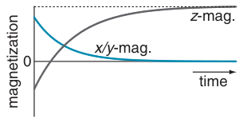

## 9.1 The origin of relaxation

Relaxation is the process by which, over time, the bulk magnetization returns to its equilibrium position. We have already established that at equilibrium there is no transverse magnetization, but there is z-magnetization along the direction of the applied magnetic field. The size of this equilibrium z-magnetization depends on the number of spins, their gyromagnetic ratio and the size of the applied field.

**Fig. 9.1** Relaxation drives the z-magnetization to its equilibrium value, indicated here by the dashed line, and the transverse (x or y) magnetization to its equilibrium value of zero.

Thus, relaxation drives the transverse magnetization to zero and the longitudinal (that is, along z) magnetization to a particular steady value, as illustrated in Fig. 9.1. The description of the equilibrium magnetization as being ‘steady’ is important, as by definition at equilibrium all quantities cease to be time dependent i.e. nothing is changing.

However, this description tells us nothing about what is happening to the individual spins which results in this behaviour of the bulk magnetization. How the two are connected is the topic of the next few sections.

### 9.1.1 Behaviour of individual magnetic moments

It is helpful at this point to remind ourselves how the bulk magnetization of the sample is related to the magnetic moments of individual spins. Recall the discussion in section 4.1 on page 47, where we described how each spin has associated with it a magnetic moment. This moment is a vector quantity, having a particular magnitude and direction. The magnitude is determined by the gyromagnetic ratio of the nucleus, but there are no restrictions on the direction in which a particular moment can point, so in general each moment has an x-, y- and z-component.

The bulk z-magnetization is found by adding together the z-components of the magnetic moment from each spin. Similarly, the x- and y-magnetizations are found by adding together the corresponding components from each spin. At equilibrium, the x- and y-components of the individual spins are distributed randomly, so adding them up results in no bulk transverse magnetization.

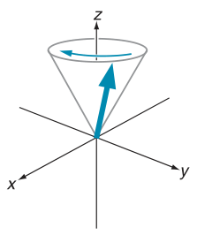

For the z-magnetization the story is rather different. As was described in section 4.1 on page 47, there is an energetic preference for the z-component of the magnetic moment to be aligned along the field direction. However, the energy preference is rather small and so the alignment is easily disrupted by the thermal motion. Nevertheless, when summed over the whole sample there is a net magnetization along the z-direction.

When an RF pulse is applied to equilibrium magnetization, the z-magnetization is rotated towards the transverse plane. As a result, the z-component is reduced in size. After the pulse, the resulting transverse magnetization precesses about the field direction, and it is this precession which we detect in the form of the FID.

**Fig. 9.2** Each spin has associated with it a magnetic moment, which is a vector quantity, having a magnitude and a direction. The moment can point in any direction, with its energy being determined by the angle between the moment and the applied magnetic field, which is along z. The moment precesses about the z-axis at the Larmor frequency, describing a cone of constant angle. As a result, the x- and y-components of the moment oscillate at the Larmor frequency. If a transverse magnetic field, oscillating at the Larmor frequency, is applied, the magnetic moment will be rotated in such a way that the angle it makes to the z-axis will be altered.

The question is, what is happening to the magnetic moments of the individual spins during the pulse and period of free precession? It turns out that each magnetic moment behaves in exactly the same way as the bulk magnetization. That this is true can be seen from a quantum mechanical treatment of the motion of a single spin – the details of which are given in Chapter 6. However, even without looking into the details of the quantum mechanics, it seems reasonable that each magnetic moment behaves in the same way as the bulk magnetization, as the latter is composed of the former.

For example, if we apply a 90◦ pulse about the x-axis, the z-component of the magnetic moment is rotated to −y, the x-component is unaffected, and the y-component is rotated to +z. During free precession, the magnetic moment precesses about the z-axis at the Larmor frequency, sweeping out a cone of constant angle, as illustrated in Fig. 9.2. As a result we have a constant z-component, and oscillating x- and y-components.

At equilibrium, there is a net alignment of the individual moments along the z-axis. The effect of a 90◦(x) pulse is to rotate the z-component of each magnetic moment onto the −y-axis. Therefore, after the pulse there is net y-magnetization. The crucial thing is that the pulse affects each magnetic moment in the same way, so all the z-components are rotated onto −y. It is for this reason that the pulse is able to rotate the net z-magnetization into the transverse plane.

After the pulse, the magnetic moments of the individual spins precess about the z-axis at the Larmor frequency. Once again, the key thing is that each magnetic moment is precessing at the same frequency, so they do not get out of alignment with one another as a result of this precessional motion. The alignment between the moments is therefore maintained.

After the 90◦ pulse the spins are definitely not at equilibrium. The question is, how can equilibrium be restored? One simple option is to apply another 90◦ pulse which, if its phase is chosen correctly, will rotate the magnetization back to its equilibrium position along the z-axis. However, this is not relaxation – this is just us manipulating the spins. Relaxation is a natural process which takes place without any intervention from us, so we must identify another way in which the magnetization can be driven to its equilibrium position.

### 9.1.2 Local fields

From all we have seen so far, it is clear that to rotate the magnetization towards the z-axis we need a transverse magnetic field which is oscillating at or near to the Larmor frequency. During an RF pulse we apply such a field deliberately, but it turns out that such oscillating fields also occur naturally within the sample. These fields can interact with the individual magnetic moments, and thus rotate them to new positions, in just the same way as an RF pulse.

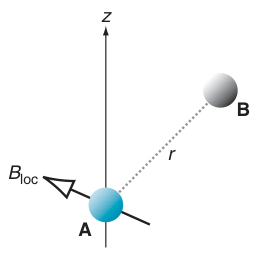

There are various mechanisms which lead to the generation of magnetic fields within the sample, and we will discuss these in more detail later on. At this stage it is helpful to describe just one source of these fields, which is from other spins in the sample. Each spin has a magnetic moment which, as we have noted before, behaves like a small bar magnet, generating its own magnetic field. A spin therefore experiences not only the static applied field but also magnetic fields from nearby spins; this is illustrated in Fig. 9.3

**Fig. 9.3** Spin A experiences a local field, Bloc, due to the magnetic moment of a nearby spin B. The magnitude and direction of the local field depends on the distance r between the two spins, and the orientation of the vector joining the two spins (shown dashed) with respect to the applied field, which is along the z-axis.

This field generated by a spin – called the local field – falls off rapidly with distance, and even at the closest approach, is many orders of magnitude weaker than the applied field. The local field varies in magnitude and orientation as the molecules move around due to thermal agitation. If this motion results in the transverse component of the field oscillating at close to the Larmor frequency, a magnetic moment which experiences the local field will be rotated to a new direction, just as it would be by a pulse.

The local field acts like a pulse but, rather than all of the spins being affected in the same way, the effect is highly localized. The local field is different in different parts of the sample, so each spin is affected in a different way. This is in complete contrast to a pulse, which affects all of the spins in the same way.

As these local fields can change the orientation of individual magnetic moments, both the magnitude and orientation of the bulk magnetization will be affected. What we now need to explore is how these local fields drive the bulk magnetization to its equilibrium position.

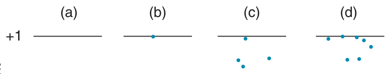

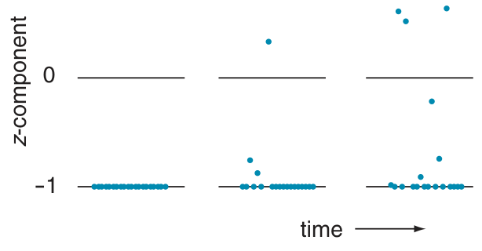

**Fig. 9.4** Visualization of how the bulk z-magnetization is driven to zero by random changes in the z-component of the magnetic moments of individual spins. The z-component of each of 20 spins is represented by a dot; if the spin is aligned along +z, the component takes the value +1, whereas if the spin is aligned along −z, the component takes the value −1. The initial state, shown in (a), has all of the z-components along −z, such that the total z-magnetization, found by adding up the individual z-components, is −20. After a short time, some of the individual magnetic moments will be reoriented, thus changing their z-components. This is shown in (b), where the z-magnetization is −16. If we wait longer, more of the magnetic moments will have been reoriented, giving the arrangement shown in (c), for which the z-magnetization is −12. After sufficient time the z-magnetization will become zero, as is the case for arrangement (d). See text for discussion of why the magnetization is driven to zero, rather than to its proper equilibrium value.

If we assume, not unreasonably, that the local fields are varying randomly in their magnitude and orientation, then we expect that the bulk z-magnetization will eventually be driven to zero. The reason for this assertion is that if the individual magnetic moments are rotated by random amounts at random time intervals, after sufficient time the moments will be randomly oriented, resulting in no bulk magnetization.

This idea is illustrated in Fig. 9.4, in which we see how the z-components of just 20 spins are affected by random reorientations of the individual moments. So that we can see more clearly what is going on, at time zero the magnetic moments of all of the spins have been aligned along −z, as shown in (a). After some time, the magnetic moments of a few of the spins have been reoriented, leading to a change in their z-components; this is shown in (b). It is clear that the result of these reorientations is to reduce the size of the z-magnetization.

Leaving longer times, as shown in (c) and (d), results in more of the magnetic moments being reoriented, and so a further reduction in the total z-magnetization. It is clear that, after sufficient time, these random reorientations will drive the z-magnetization to zero.

There is clearly a problem with this description, as it predicts that at equilibrium there is no z-magnetization, which is certainly not the case. To resolve this problem with our argument we need to think about what it is that the spins are coming to equilibrium with, which is the topic of the next section.

### 9.1.3 Coming to equilibrium with the lattice

Recall that the local fields are varying on account of the random thermal agitation of the molecules in the sample. We describe this by saying that the local fields provide a mechanism by which the thermal motion of the molecules can be experienced by the spins – in other words it puts the spins into contact with the thermal motion.

We know from everyday experience that if we put two objects in contact, they will come to thermal equilibrium by exchanging heat energy. For example, if a hot lump of metal is dropped into a bucket of water the metal cools down as energy flows from the hot metal to the cooler water. As the metal cools, the water is heated, and eventually both come to the same temperature. They are then in thermal equilibrium with one another.

In our NMR sample, the nuclear spins have a certain amount of energy on account of the interaction of the magnetic moments with the applied magnetic field. Of course, the nuclei have other sorts of energy as well, but we are not concerned with these here, and so when we talk about the ‘energy of the spins’ we will just mean this energy of interaction between the spins and the field.

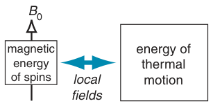

The interaction between the spins and the field can therefore be thought of as leading to a reservoir of (spin) energy. The thermal motion of the molecules is also a reservoir of energy, which is put in contact with the spin energy reservoir via the mediation of the local fields, as is illustrated in Fig. 9.5. As a result, the two reservoirs are able to come to thermal equilibrium with one another, just in the same way that two physical objects can come to thermal equilibrium.

**Fig. 9.5** The interaction of the spins with the applied magnetic field, and the thermal motion of the molecules, can both be thought of as leading to reservoirs of energy. The two reservoirs are able to come to equilibrium as a result of the mediation provided by the local fields i.e. the local fields create thermal contact between the two reservoirs.

When the bulk magnetization is rotated away from the z-axis, the energy of the spins is increased. This is because the number of spins whose magnetic moments are aligned with the z-axis, the low energy arrangement, is decreased. For the spins to come back to equilibrium they therefore need to lose energy.

The amount of energy that the spins need to lose to come to equilibrium is minuscule when compared with the energy of thermal motion. Bringing the spins back to equilibrium is analogous to dropping our hot metal into a swimming pool rather than a bucket.

The process by which the z-magnetization is returned to its equilibrium value is called longitudinal relaxation. You will also find it referred to as spin–lattice relaxation. This latter term arises from the understanding that this kind of relaxation involves the flow of energy between the spins and the molecular motion. The ‘lattice’ is a generic term used to describe a reservoir of energy, which in this case is the molecular motion.

### The equilibrium z-magnetization

In the previous section we discussed a simple picture in which the reori-entation of individual magnetic moments by random fields drove the bulk z-magnetization to zero – a result which is plainly wrong, as we know that relaxation results in the establishment of a finite z-magnetization at equilibrium. It is not that this picture of the magnetic moments being reoriented is wrong, it is just that there is an additional subtlety which we need to take account of in order to arrive at the correct equilibrium position.

If the local field at a particular spin results in its magnetic moment being rotated towards the z-axis, the energy of interaction between the spin and the applied field is reduced, and so there must be a flow of energy from the spin to the surroundings. In contrast, if the magnetic moment is turned away from the z-axis, the magnetic energy of the spin increases, and so there must be a flow of energy from the surroundings to the spin.

The key point to understand here is that there is a higher probability for a certain amount of energy to flow into the surroundings than there is for the same amount of energy to flow out of the surroundings. The reason for this is connected to the fact that the surroundings are at thermal equilibrium, a situation described by the Boltzmann distribution. This distribution tells us that as the energy of a particular state (i.e. energy level) of the surroundings goes up, the probability of that state being occupied goes down.

When energy is absorbed, the surroundings move from a lower energy state to a higher energy one; in contrast, when energy is given out, the surroundings move from a higher energy state to a lower energy one. As the lower energy state is the more occupied of the two, it follows that it is more probable that the surroundings will absorb, rather than give out, a certain amount of energy.

The overall result of this asymmetry between the probability of giving out and receiving energy is that events in which the magnetic moments are moved towards the z-axis are more probable than those in which the moment moves away from the z-axis. As a result, after many such events, the z-components of the moments are not distributed randomly, but in such a way as to lead to a net z-magnetization.

This discussion relies on the fact that the energy of interaction between the spins and the magnetic field is minuscule compared with the energy associated with the thermal motion of the molecules. We can therefore safely assume that once the surroundings are at equilibrium, the flow of energy to and from the spins will not perturb this equilibrium in any perceptible way. It also follows that the difference in the probability of these tiny amounts of energy flowing into or out of the surroundings is very small, so that the distribution of the z-components of the magnetic moments is only slightly perturbed from a random arrangement.

### 9.1.4 Transverse relaxation

The process by which transverse magnetization decays away to its equilibrium value of zero is called transverse relaxation. It is also called spin–spin relaxation, a confusing and unhelpful term which we will avoid.

When we talk about the individual magnetic moments changing orientation as a result of interacting with an oscillating transverse local field, it is not only the z-, but also the transverse components of the moments which can be changed. For example, if the local field has a component along x, then the y-component of the magnetic moment can be changed. Similarly, a local field along y can change the x-component. Overall therefore, these local fields not only drive the z-magnetization to its equilibrium value, but also do the same for the transverse magnetization. This is called the non-secular contribution to transverse relaxation.

There is, however, a second way in which the transverse magnetization is driven to equilibrium. Remember that the magnetic moments from individual spins precess about the applied magnetic field B0 at the Larmor frequency (Fig. 9.2 on page 243). However, the field experienced by a particular spin is not just B0, but is this field plus the z-component of the local field. As a result the precession frequency is changed, albeit by rather a small amount as the local field is much smaller than B0.

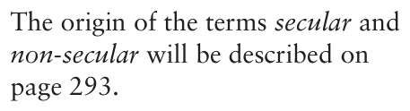

The local field varies from spin to spin, so the precession frequency is slightly different for each spin. Consequently, over time the precession of the individual moments will get out of step with one another, and thus the net transverse magnetization will shrink. This is the secular contribution to transverse relaxation.

If the local fields did not change over time, then this decay of the transverse magnetization could be reversed using a spin echo. This comes about because the frequency at which each spin is evolving is constant, so a spin echo will refocus this, in just the same way that an offset term is refocused. However, it is not the case that the local fields are time independent – on the contrary, they are changing rapidly due to molecular motion. As a result, a spin echo cannot refocus the evolution at this ever changing frequency, and so the decay of the transverse magnetization cannot be reversed. A more detail discussion of transverse relaxation is deferred to section 9.8 on page 286.

### 9.1.5 Summary

Rather a lot of new ideas have been introduced in this section, so it is helpful to summarize the key steps in the discussion.

- The magnetic moment from each individual spin behaves in the same

way as the bulk magnetization i.e. it can be rotated by a transverse

field oscillating at the Larmor frequency, and precesses about the field along the z-axis.

- In the sample there are sources of local magnetic fields which vary

randomly in orientation and magnitude. These fields are highly localized.

- If the local field experienced by a spin has a transverse component

which is oscillating at the Larmor frequency, then the orientation

of the magnetic moment of the spin will change. In particular, the

components of the magnetic moment which are perpendicular to the transverse local field will be changed.

- These changes in orientation of the magnetic moments of individual spins result in changes in the bulk magnetization of the sample.

- The local fields provide a thermal contact between the spins and

the random thermal motion of the molecules. This drives the z-magnetization back to its equilibrium value.

- The return of the z-magnetization to its equilibrium value is called

longitudinal relaxation. Such relaxation is brought about by the

transverse components of local magnetic fields which are oscillating at the Larmor frequency.

- The decay of transverse magnetization to its equilibrium value of zero is called transverse relaxation.

- There are two contributions to transverse relaxation: the non-secular

contribution, like longitudinal relaxation, is brought about by the

transverse components of local fields which are oscillating at the

Larmor frequency; the secular contribution is caused by there being a distribution of the z-components of the local fields.

Our task now is to describe in more detail the various sources of these local fields, and then to go on to investigate how we can characterize the random motions which give rise to the required time dependence.

## 9.2 Relaxation mechanisms

A particular source of a local magnetic field is called a relaxation mechanism. While there are quite a lot of these, two tend to be dominant for spin-half nuclei: the dipolar mechanism and the chemical shift anisotropy mechanism. We will therefore largely confine our attention to these mech-anisms.

### 9.2.1 The dipolar mechanism

In this mechanism the local field is due to the magnetic moment (or magnetic dipole, as it is sometimes called) of another spin, as was outlined in section 9.1.2 on page 244 and illustrated in Fig. 9.3 on the same page. There are thus two spins, or dipoles, involved: one generating the field, and one experiencing it. This is why the mechanism is also called the dipole–dipole mechanism.

The local field due to the neighbouring spin depends on a number of parameters:

- The distance r between the two spins: in fact, the interaction falls off

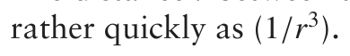

- The gyromagnetic ratio of the spin: the larger the gyromagnetic ratio,

the larger the magnetic moment and the larger the local field. So, for example, protons give rise to larger local fields than 13C nuclei.

- The orientation of the vector joining the two spins relative to the applied magnetic field (the z-axis).

With this strong distance dependence, the dipolar mechanism is only effective over rather short distances, say less than 5 Å for two protons. However, note that local fields can be contributed by more than one spin, so equally effective relaxation can be brought about by either a single nearby spin or a larger number of more remote spins.

The final point to note is that the effect of a given local field Bloc on the nucleus depends on the gyromagnetic ratio of that nucleus. This is because the rate at which the local field rotates the magnetic moment goes as γBloc, in just the same way that an RF field B1 causes the bulk magnetization to precess at a frequency γB1. Therefore overall the strength of the dipolar interaction depends on the gyromagnetic ratio of the spin which is generating the local field, and the gyromagnetic ratio of the spin which is experiencing that local field.

### 9.2.2 Chemical shift anisotropy

The usual description given for the chemical shift is to say that, in the presence of a strong applied field, the electrons in the molecule give rise to a small induced (local) field at the nucleus. The nucleus therefore experiences the sum of the applied field and this induced field, thus shifting the Larmor frequency by an amount which depends on the size of the induced field.

For most molecules, the size of the induced field, and hence the size of the chemical shift, depends on the orientation of the molecule with respect to the applied magnetic field. This is described by saying that the chemical shift is anisotropic. In liquid samples the molecules are tumbling so rapidly that the nuclei see an average local field, and hence have an average chemical shift, called the isotropic shift. Nevertheless, at any instant, the local field is different for molecules at different orientations.

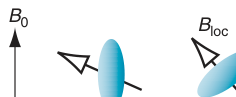

What is not usually commented on is that the local field due to the chemical shift is not necessarily parallel to the applied field – in fact in general this local field can point in any direction, as illustrated in Fig. 9.6. We see that this local field is therefore a relaxation mechanism.

**Fig. 9.6** When placed in a strong applied field B0, a local field is generated as a result of the interaction between the electrons and B0. It is this field which is responsible for the chemical shift. However, on account of the anisotropy of the electron distribution, the local field varies in direction and size as the molecule tumbles in solution. The resulting variation in the local field can be a source of relaxation.

The extent to which the local field varies as the molecule tumbles depends on the anisotropy of the chemical shift i.e. the extent to which the shift varies with orientation. With the exception of nuclei at sites of high symmetry, such as isolated atoms or nuclei in octahedral or tetrahedral sites, all chemical shifts are anisotropic. The extent of the anisotropy does, however, vary greatly between different isotopes.

As a rough guide, the shift anisotropy is of the order of the chemical shift range for that nucleus. So, for protons the shift anisotropy is rarely more than a few ppm, whereas for 13C the anisotropy can easily be 100 ppm, or more. Nuclei such as 31P, which have wide chemical shift ranges, can also have large anisotropies.

The local field due to the chemical shift is proportional to the applied field. In turn the interaction of this field with the nucleus depends on the gyromagnetic ratio of the nucleus, so overall the interaction goes as γB0.

### 9.2.3 Relaxation by paramagnetic species

In the dipolar mechanism, the source of the local field is the magnetic moments of other nuclear spins in the sample. Unpaired electrons also generate local fields in an analogous way, and so are a potential source of relaxation. The magnetic moment of the electron is very much greater than that of the proton, so the local field generated by an electron is correspondingly much greater. Unpaired electrons can, therefore, be a particularly efficient source of relaxation, causing a significant effect even when present at low concentrations.

In preparing an NMR sample it is inevitable that small amounts of O2 gas are dissolved in the solvent, and since O2 has unpaired electron spins (i.e. it is paramagnetic), the dissolved oxygen is a source of relaxation. Sometimes, the sample is ‘degassed’, for example by bubbling pure nitrogen gas through the sample, in order to remove the oxygen and hence reduce the rate of relaxation.

## 9.3 Describing random motion – the correlation time

The next task is to work out how to describe and quantify the random thermal motion which provides the all-important time dependence to the local fields. Recall from our previous discussion that to cause longitudinal relaxation the transverse component of the local field must be oscillating at or near the Larmor frequency.

A molecule is likely to be executing two distinct kinds of motion: vibrations and overall rotation. During a vibration, the individual bonds and bond angles are oscillating back and forth about their equilibrium positions, and in principle this will modulate the dipolar interaction as the distance, and possibly the angle between the internuclear vector and the field direction, will change. However, such oscillations typically take place at frequencies of 1011 to 1013 Hz, which is much higher than even the highest achievable Larmor frequency of around 109 Hz. We can thus discount such vibrations as being effective sources of relaxation.

The overall rotation of a molecule will result in the modulation of the local fields due to both the dipolar interaction and the chemical shift anisotropy (CSA), therefore such motion can be a source of relaxation. The question is, are these motions at the right frequencies to cause relaxation?

In a gas, small molecules rotate freely at frequencies of around 108 to 109 Hz, which is certainly in the right ball-park for relaxation. However, in liquids the picture is quite different, and it is certainly not the case that even small molecules are free to rotate. The density of a liquid means that the frequency of collisions between molecules is rather high, but the high density, combined with the interactions between the molecules, means that the ability of a molecule to rotate is rather constrained. So, each collision is only capable of changing the orientation of a molecule by a small amount.

One way of visualizing this situation is to imagine that the solvent exerts a viscous drag on the molecule which is so large that even an energetic collision is only able to rotate the molecule by a small amount, if at all. An analogy would be trying to make a floating football rotate by throwing ping-pong balls at it.

Let us concentrate on just one molecule, and place an imaginary vector in it, such that the arrow starts out pointing along +z. As the molecule experiences collisions it will start to be rotated, in small steps, away from its starting position. However, since the collisions are random, the vector will not move steadily away from +z, but will execute a jerky motion in which the direction it moves, and the angle through which it moves, is different on each step. Such motion is called rotational diffusion.

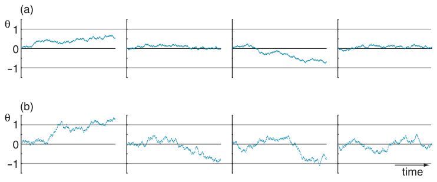

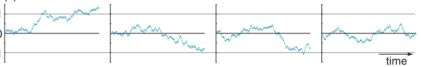

**Fig. 9.7** Plots of the orientation, specified by the angle θ (rad), of a disc undergoing rotational diffusion. Each graph contains 300 equally spaced time steps, and the angle always starts at zero. In (a) the maximum allowed change in the angle on each step is ±0.04 radians, with the actual change being chosen at random in this interval. For the plots shown in (b) the maximum change is ±0.08 radians. Each plot (trajectory) is different on account of the random nature of the process. However, on average the trajectories shown in (b) deviate further from the starting position, as a result of the greater change in the angle allowed on each time step. The rotational correlation time for motion of which (a) is a representative sample of trajectories is therefore longer than for those shown in (b).

If we wait a ‘long time’, the vector will have wandered through more or less all possible orientations, whereas after a ‘short time’ the vector will barely have moved. What ‘long’ and ‘short’ mean can be quantified by defining a rotational correlation time τc, which is the average time it takes for a molecule to end up at an orientation about 1 radian from its starting position. Remember that the molecule does not jump to this new position in a few steps, but takes a tortuous and wandering path of many tiny steps before it finally finds itself 1 radian from where it started.

Figure 9.7 provides a visualization of the nature of rotational diffusion and the meaning of the correlation time. To make this diagram, we have simplified things by considering a two-dimensional case, for which only one angle is needed to specify the orientation i.e. we are thinking about the rotational diffusion of a disc rather than a sphere. Each graph shows the angle for 300 time steps, where at each step the angle is allowed to change by a random amount.

For the plots shown in (a), the maximum change in the angle allowed on any one step is ±0.04 radians, whereas in (b) the maximum change is ±0.08 radians. On any one time step, the size of the change is chosen at random within the permitted range.

The first thing to note is that, although the maximum change in the angle allowed on each step was the same for all the plots shown in (a), the actual sequence of angles is different in each case. This is expected as it is a random process, so each molecule heads off on its own unique trajectory. In none of the trajectories does θ reach one radian, so the correlation time must be somewhat longer than the time represented by these 300 steps.

For the plots shown in (b), the maximum change in the angle on each step is twice that for (a), so not surprisingly the excursions away from the starting position are greater. In fact, within the time frame the angle reaches 1 radian for two of the trajectories, and almost makes it for a third. It is clear that the correlation time for this set of trajectories must be shorter than that for those shown in (a).

It is important to realize that the correlation time is the average time needed to achieve an orientation 1 radian away from the starting position, not the time taken by one particular molecule to achieve this orientation. This average is taken over a large number of molecules in the sample.

For small molecules τc turns out to be around 10 ps, rising to 10 ns for small proteins. The reciprocal of the correlation time, 1/τc, is a rough estimate of the ‘average frequency’ of the motion (in rad s−1), so 1/(2π τc) gives this frequency in Hz. Correlation times in the range 10 ns to 10 ps give average frequencies in the range of 107 to 1010 Hz, which is comparable with typical Larmor frequencies. Rotational diffusion therefore appears to give motion in the right range to cause relaxation.

The problem we have is in trying to quantify the amount of this motion which is actually at the right frequency – that is, at the Larmor frequency. To do this we need to introduce the correlation function and the spectral density.

### 9.3.1 The correlation function

The correlation function is a way of characterizing the time dependence of the random motion in our sample, and hence finding out how much of the motion is present at the Larmor frequency. We will start out by describing what the correlation function is, and then, in the following section, explain how this function can be used to assess the amount of motion at particular frequencies.

Imagine that a particular spin i experiences a local field Bloc,i(t) which is varying in time, so that at a time τ later the local field is Bloc,i(t + τ). The correlation function G(t, τ) is defined as the average over the sample of the

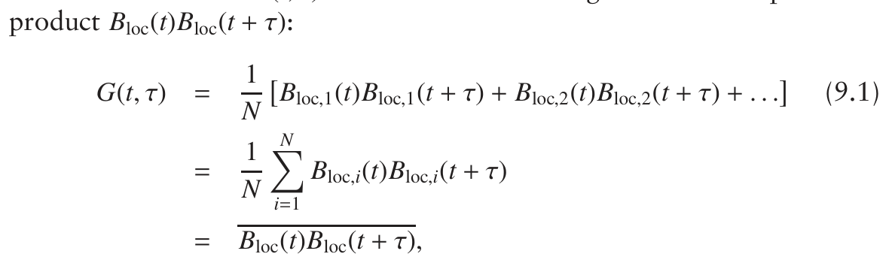

where N is the number of spins in the sample. On the last line we have used the overbar to indicate the average over the sample, known as the ensemble average.

Generally Bloc(t) can take positive or negative values, which are equally distributed either side of zero, so that its average over the sample is zero. It is also usually the case that the magnitude of the local field from a particular source has a maximum value.

The local field varies due to the thermal motion in the sample, so Bloc(t) is a random function of time. It turns out that the properties of this random function do not depend on the point from which time is measured; such functions are said to be stationary random functions. For such a random

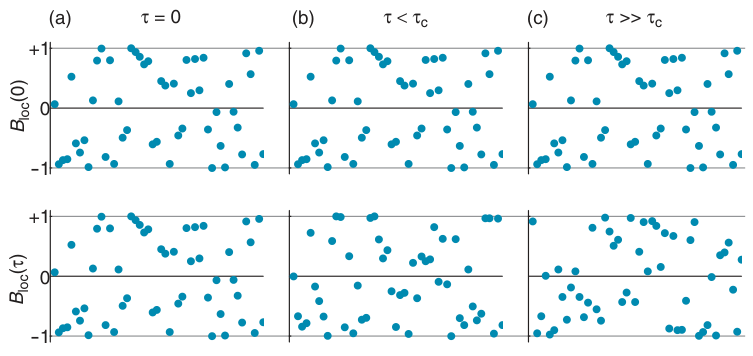

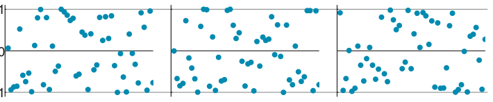

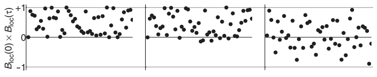

**Fig. 9.8** Visualization of the behaviour of the correlation function G(τ) as a function of the time interval τ. In each of (a), (b) and (c), the data points represent: in the top row, Bloc(0); in the middle row, Bloc(τ); and in the bottom row, the product Bloc(0)Bloc(τ). The values for each of 50 spins are represented by a dot, and it has arbitrarily been assumed that Bloc can only take values between −1 and +1. Note that the horizontal axis is not time, but is just used to spread out the values from the 50 spins. G(τ) is found by summing the points Bloc(0)Bloc(τ) (shown in the bottom row), and dividing by the number of points. In (a) τ = 0, so Bloc(τ) = Bloc(0), and as a consequence all of the points in the lower plot are positive. G(τ) is therefore a maximum when τ = 0. In (b) τ is shorter than correlation time τc, and so although for each spin Bloc(τ) is different to Bloc(0), the change is not large. Most of the points in the lower plot are positive, but in the few cases where the local field has changed sign between time 0 and time τ, the point is negative, and as a result G(τ) is less than G(0) (in this case 0.87 × G(0)). Finally, in (c) τ >>τc, so that the local field of each spin has changed significantly between time zero and time τ. As a result, there are a significant number of negative points in the lower plot, and so G(τ) is significantly less than G(0).

function, the value of the correlation function does not therefore depend on the time t, but only on the time interval τ. So, from now on we will write the correlation function as G(τ).

Figure 9.8 helps us to visualize how the correlation function varies with τ. The points in this figure represent the values of Bloc(0), Bloc(τ), and the product Bloc(0)Bloc(τ) for different values of τ, and for 50 spins. For each value of τ, the top graph shows Bloc(0), the middle shows Bloc(τ), and the lower shows Bloc(0)Bloc(τ). If follows from the definition of G(τ), Eq. 9.1 on the preceding page, that the value of G(τ) is found by summing the values of Bloc(0)Bloc(τ) in the lower plot and then dividing by the number of values.

The plots shown under (a) are for the case τ = 0. Here Bloc(0)Bloc(τ) = B2loc(0), so all of the points in the lower plot are positive, and hence G(τ) will be a maximum. In general, we can see that it will always be the case

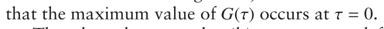

The plots shown under (b) are computed for a value of τ which is shorter that the correlation time. Careful comparison of the plots of Bloc(0) and Bloc(τ) will show that, although the local fields have changed between the two times, the change is small. As a result Bloc(0)Bloc(τ) is still positive for most spins, but there are a few where the local field has changed sign, and for these Bloc(0)Bloc(τ) is negative. So, when G(τ) is found by computing the sum of the points in the lower plot the result will be somewhat less than G(0).

Finally, the plots shown under (c) are for the case where the time τ is much longer than the correlation time. Now the local fields have changed significantly between time zero and time τ, so there are a significant number of negative points in the lower plot. Summing these points, that is computing G(τ), gives a value which is much less that G(0).

Our overall picture for how the correlation function varies with τ is that it starts at a maximum at τ = 0, and then falls away smoothly to zero at a rate determined by the value of the correlation time τc. The value of G(0) can be computed from the definition of G(τ) given in Eq. 9.1 on page 253:

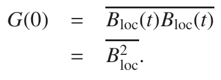

This value is simply the average of the square of the local field. The time at which we compute this average is irrelevant for a stationary random function, so G(0) just depends on the average size of the interaction.

The exact form of the correlation function depends on the details of the interaction between the molecule and the solvent. The simplest case to analyse is where the molecule is assumed to be spherical and the solvent simply provides a medium with a certain viscosity. Rotational diffusion in such a case, turns out to be described by a correlation function which is a simple exponential whose decay rate is set by τc:

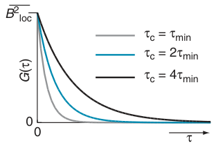

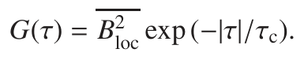

A plot of this function for three different correlation times is shown in Fig. 9.9. Note that the smaller the correlation time, the faster G(τ) decays. The function depends on the modulus of the time τ, as the same behaviour is expected for positive times τ as it is for negative times i.e. the behaviour for a particular time interval in the future is the same as for the same interval of time in the past.

**Fig. 9.9** Plot of the correlation function G(τ) = B2loc exp (−|τ|/τc) for three different values of the correlation time, τc. The curve for shortest value of τc, τmin, is shown in grey, the blue line is for a τc of twice this value, and the black line is for twice this value again. Note that for all three cases, G(τ) has the same maximum value of B2loc at τ = 0.

The exponential part of the correlation function is independent of the source of the local fields, which only determines the overall magnitude of G(τ) via the term B2loc. It is therefore common to define a reduced correlation function, g(τ), which is independent of the size of the local fields:

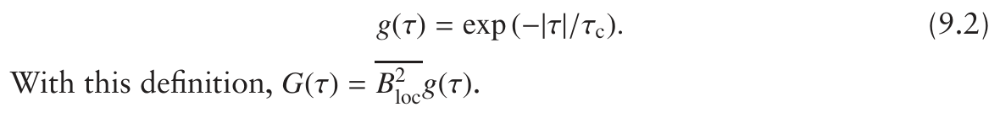

### 9.3.2 The spectral density

From the discussion in section 9.1.2 on page 244, you will recall that, in order to be effective at causing longitudinal relaxation, the local field must be oscillating close to the Larmor frequency. We have now seen that the time dependence of the local field results from molecular motion, specifically rotational diffusion, and that this motion can be characterized by a correlation function. The next task is to find out exactly how much of the motion is present at the required frequency. We will see in this section that the spectral density function, which is related to the correlation function, provides this information.

The correlation function is a function of time, analogous to the FID we observe in an NMR experiment. If we Fourier transform the FID we obtain a function of frequency, the spectrum, which tells us how much intensity there is at each frequency. In an analogous way, if we Fourier transform the correlation function we will obtain a function of frequency, and from this we will be able to find the amount of motion which is at the Larmor frequency.

The Fourier transform of the correlation function is called the spectral density, J(ω):

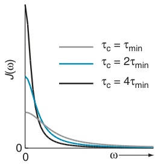

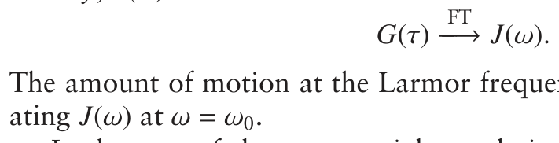

The amount of motion at the Larmor frequency is simply found by evalu-

In the case of the exponential correlation function, the Fourier trans-

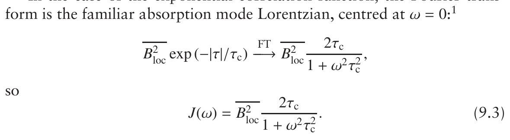

**Fig. 9.10** Plots of the spectral density function, J(ω), for three different values of the correlation time, τc; the graph is plotted only for positive values of ω. The grey line is for the shortest value of τc, τmin, the blue line for the case where τc = 2τmin, and the black line for the case where τc = 4τmin. Note that the shorter τc becomes, the higher the frequencies to which J(ω) spreads. As explained in the text, it turns out that the areas under these curves are all the same.

Figure 9.10 shows plots of this function for different values of the correlation time; only positive frequencies are shown. The spectral density has its maximum value of 2B2locτc at ω = 0, and then falls off steadily as ω increases, with the rate of the fall-off being determined by τc. As τc becomes shorter, the spectral density spreads out to higher frequencies. Note also that the value of J(0) increases as τc increases.

A particularly important feature of the spectral density is that, if we plot it against ω, we find that the area under the curve is independent of τc. Expressed mathematically, the area under J(ω) is the integral

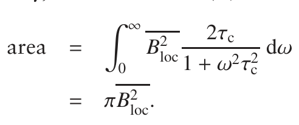

A consequence of the area being constant is that, although J(ω) is always a maximum at ω = 0, as τc becomes smaller the size of the maximum

1The factor of two comes in as an FID only exists for time greater than zero, whereas the

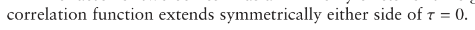

decreases and at the same time the spectral density spreads out to higher frequencies. This can be seen in Fig. 9.10 on the preceding page.

This behaviour has an important consequence if we think about the value of the spectral density at the Larmor frequency as a function of the correlation time. Remember that it is J(ω0) which will determine the rate of longitudinal relaxation.

The spectral density at the Larmor frequency is given by

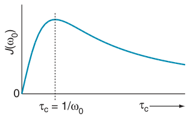

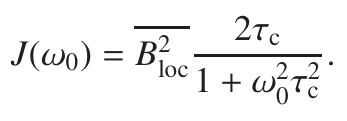

If we make a plot of this as a function of τc, as is shown in Fig. 9.11, we see that there is clearly a value of the correlation time which makes J(ω0) a maximum. It is a relatively easy calculation to show that this maximum

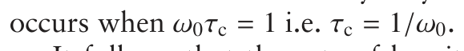

It follows that the rate of longitudinal relaxation will also be a maximum when τc = 1/ω0, as this is the value of the correlation time which gives the maximum spectral density at the Larmor frequency. So, both correlation times which are shorter or longer than this optimum value will give slower relaxation. Just like Goldilocks and the porridge, for the most efficient longitudinal relaxation the correlation time must be neither too long nor too short, but ‘just right’.

**Fig. 9.11** A plot of the spectral density at the Larmor frequency, J(ω0), as a function of the correlation time, τc. The plot shows a maximum at τc = 1/ω0. This implies that the rate of longitudinal relaxation will be a maximum for this value of the correlation time.

In the previous section we introduced (Eq. 9.2 on page 255) the idea of the reduced correlation function g(τ), which does not depend on the size of the local fields. The Fourier transform of this reduced correlation function is the reduced spectral density, j(ω):

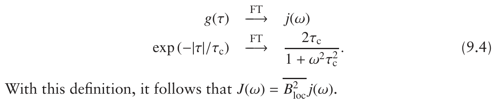

### 9.3.3 Motional regimes

The comparison between the Larmor frequency and the correlation time turns out to be rather important in the theory of relaxation – indeed, we have already seen an example of this in Fig. 9.11 where the maximum in

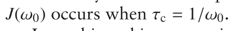

In making this comparison it is usual to distinguish two motional regimes. The first is called fast motion or extreme narrowing, and is defined mathematically as when ω0τc << 1. Physically, this is the limit in which motion is very fast i.e. the correlation time is very short, such as would be the case for small molecules.

The reduced spectral density at the Larmor frequency is given by

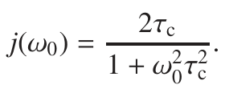

If the fast motion limit applies, ω0τc << 1, it follows that (1 + ω20τ2c) ≈ 1, and so j(ω0) is given by

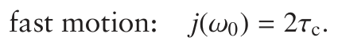

In words, what this fast motion limit means is that the spectral density is independent of the Larmor frequency. It should also be noted that as j(0) = 2τc (for all values of τc), in the fast motion limit it follows that

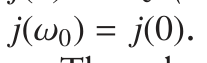

The other limit is called the slow motion or spin diffusion limit, and is

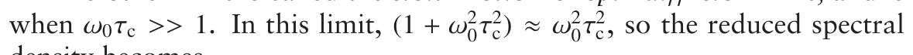

density becomes

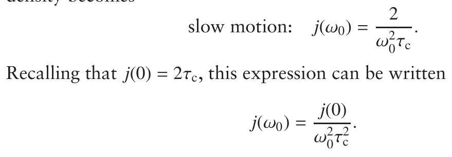

As ω20τ2c >> 1, it follows that j(ω0) is very much smaller than j(0).

For a Larmor frequency of 500 MHz (ω0 = 3.1 × 109 rad s−1), a small molecule with a correlation time of 10 ps has ω0τc = 0.03, which is clearly in the fast motion limit. In contrast, a small protein with a correlation time

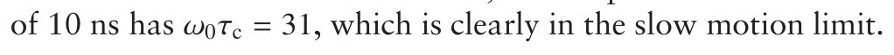

### 9.3.4 Summary

To summarize what we have found so far:

- Rotational diffusion in a liquid causes the local fields to vary at rates which are suitable for causing relaxation.

- This random diffusive motion can be described using a correlation

time τc, which is the average time it takes for a molecule to move to a position at an angle of about 1 radian from its starting position.

- The spectral density gives the frequency distribution of the motion. The simplest example of such a spectral density function is

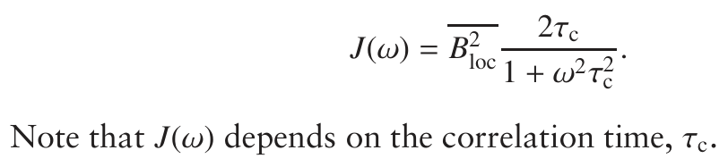

- The rate of longitudinal relaxation depends on the spectral density at

the Larmor frequency. The relaxation is most rapid when ω0τc = 1.

We are now in a position to explore the details of how the z-magnetization behaves as a result of relaxation. To do this, we will first need to introduce the concept of the populations of energy levels.

## 9.4 Populations

In section 4.1 on page 47 we were at pains to point out that the magnetic moment from a single spin-half can point in any direction, and that its energy depends on the angle between the magnetic moment and the applied field. However, if we measure the energy of a particular spin, we will always find a value which corresponds to one of the two energy levels of a spin-half i.e. that corresponding to the α state or the β state (see section 3.1 on page 24 for a discussion of this point). It turns out that there is a certain probability pα of finding the energy corresponding to the α state, and a certain probability pβ of finding the energy corresponding to the β state.

If we imagine measuring the energy of every spin in the sample, then for each there is a probability pα,i of finding the energy corresponding to the state α. The sum of all these probabilities is the same as the number of spins in the sample which were found to have the energy of the α state. This number can be identified as the population of this state, nα:

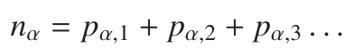

In a similar way, we can compute the population of the β state, nβ.

This language is rather dangerous, as the moment we start talking about the ‘populations of the α and β states’, it is easy to fall into the trap of imagining that each spin is in one of these states, which is certainly not true. Nevertheless, thinking about the sum of these individual probabilities as a population is a very useful concept when it comes to describing relaxation and so we will use it throughout the rest of this chapter.

### 9.4.1 The z-magnetization in terms of populations

If we accept this description of the spins in terms of the populations of the α and β states, it is easy to determine the bulk z-magnetization. A spin in the α state contributes +12ℏγ to magnetization, and one in the β state

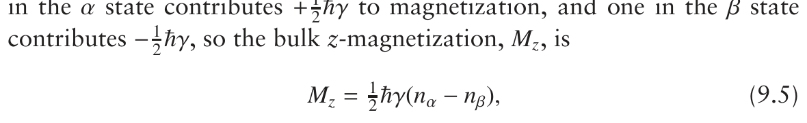

where nα and nβ are the populations of the α and β states, respectively. What this equation says is that the magnetization is proportional to the population difference and to the gyromagnetic ratio. This latter factor comes about because the magnetic moment of each individual spin is proportional to its gyromagnetic ratio.

At equilibrium we know that the populations must be those given by the Boltzmann distribution, which in this case predicts the following:2

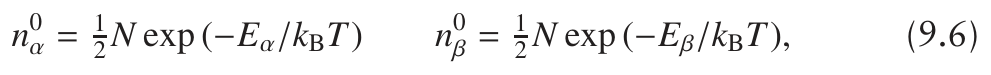

where Eα and Eβ are the energies of the α and β states, kB is Boltzmann’s constant, and n0α and n0β are the equilibrium populations.

The energies Eα and Eα are tiny compared with kBT, so the fraction (Eα/β/kBT) is very much less than one. We can therefore approximate the exponential by taking just the first two terms of the series expansion

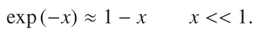

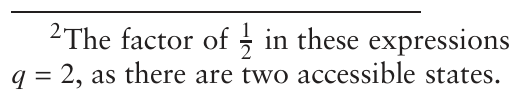

2The factor of 12 in these expressions is 1/q, where q is the partition function. In this case

Using this, the populations are

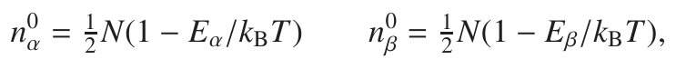

and hence the equilibrium z-magnetization, M0z , is

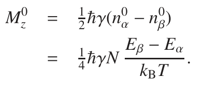

Not surprisingly, the population difference depends on the energy difference between the two levels. The energies of these two levels were given in section 3.2.7 on page 30 as

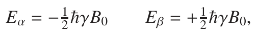

where we have included a factor of ℏ so that the energies are in Joules, rather than in rad s−1. Using these, the equilibrium magnetization can be written

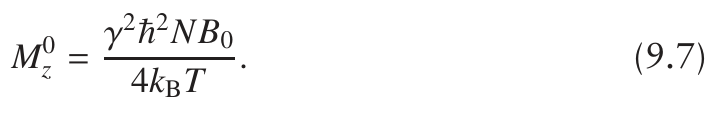

This expression says that the bulk magnetization is proportional to the number of spins, the square of the gyromagnetic ratio, and the strength of the applied field. Consequently the largest equilibrium magnetization, and hence the strongest signals, come from nuclei with the greatest gyromagnetic ratios and from using the highest magnetic field strengths.

The expression for M0z given in Eq. 9.7 goes as γ2. This is because the energies of the states, which determine their populations, are proportional to γ, and the magnetic moment contributed by each spin is also proportional to γ.

Since it is not possible to measure that absolute size of an NMR signal, the absolute size of the z-magnetization is not important in our calculations. As a result it is usually acceptable to drop all the constants in Eq. 9.5 on the previous page and simply write

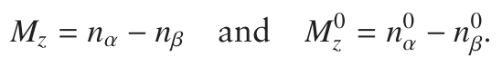

Although these expressions are not correct in a formal sense, they capture the essence of the situation, which is that the magnetization is proportional to the population difference.

### 9.4.2 Relaxation in terms of populations

Longitudinal relaxation drives the z-magnetization towards its equilibrium value, and we have now seen that the z-magnetization is proportional to the population difference between the α and β energy levels. It therefore follows that the approach to equilibrium involves changing the populations of the two levels, so that longitudinal relaxation can be described as arising from transitions between the two levels. For example, a transition from α to β will decrease the population difference and hence reduce the z-magnetization, whereas a transition from β to α will increase the population difference, and hence increase the z-magnetization.

The simplest assumption we can make is that the rate of transitions from α to β is proportional to the population of the α state, nα:

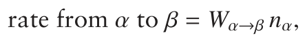

where we have written the constant of proportion as Wα→β. This constant is in fact a rate constant, entirely analogous to a first-order rate constant in

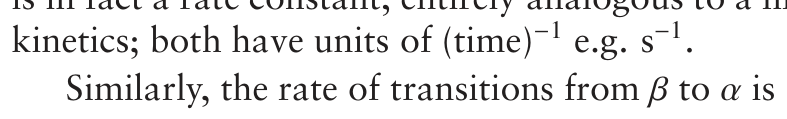

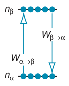

Note that this time the rate is proportional to the population of the β state, as it is from this state that the transitions originate, and that we have also allowed the rate constant to be different. The two processes are illustrated in Fig. 9.12.

**Fig. 9.12** The population of the energy level associated with the spin being in the α state, nα, will be decreased by transitions from the α to the β state, and increased by transitions in the reverse sense. The (first-order) rate constants for these two processes are Wα→β and Wβ→α, respectively.

Transitions from α to β decrease the population of the α state, whereas transitions from β to α increase the population of the α state. Therefore the overall rate of change of the population of the α state is:

The first term is positive as it describes the rate of a process which increases the population of the α state, whereas the second term is negative as it describes a process which reduces the population of the state.

We can write an analogous equation for the rate of change of the population of the β state:

At equilibrium the populations will be constant i.e. the rate of change will be zero. In addition, these populations will have their equilibrium values, as predicted by Eq. 9.6 on page 259. Applying these two conditions to the expressions of Eqs 9.8 and 9.9, we have

From either of these it follows that

There is a difficulty with this expression, in that the theory most commonly used to predict values for the rate constants Wβ→α and Wα→β comes up with the answer that these two are equal. As a result, it follows from Eq. 9.10 that n0α = n0β i.e. the equilibrium populations are equal, which is certainly not correct.

The problem here turns out to be a deficiency in the theory, in which the spins are treated quantum mechanically, but the surroundings (the lattice) are treated classically. To obtain the correct result, consistent with the expected equilibrium populations, a much more complete theory is needed which treats both the spins and the lattice quantum mechanically. However, such an approach is both complicated and laborious.

What we are going to do is avoid this problem entirely by rewriting the rate equations, Eq. 9.8 and Eq. 9.9 on the previous page, in the following way:

What we have done is made all the rate constants equal (Wαβ), and instead of these multiplying the populations they multiply the deviation of the populations from their equilibrium values i.e. (nα − n0α) and (nβ − n0β). You can see immediately from Eq. 9.11 that, if nα = n0α and nβ = n0β, the rate of change of both nα and nβ are zero, as is required at equilibrium.

As the z-magnetization is equal to the population difference (nα − nβ), the rate of change of the z-magnetization is equal to the difference between the rate of change of nα and that of nβ:

We can then use Eq. 9.11 to substitute in expressions for the rates of change of the populations:

This equation predicts what we expect: when Mz = M0z the rate of change is zero.

The usual way to write this equation is using the language of calculus, in which we identify the rate of change of Mz as its derivative with respect

We have written the z-magnetization as Mz(t) to remind ourselves that it is a function of time. Rz, the rate constant for longitudinal relaxation, is equal

This equation is often written

where T1 is the time constant for longitudinal relaxation: T1 = 1/Rz. The use of the symbol T1 for this time constant is so ubiquitous that longitudinal relaxation is often called ‘T1 relaxation’.

The rate of relaxation, and hence the value of the relaxation rate constant Rz, will depend, as we have seen, on the average of the square of the local fields, and the spectral density at the Larmor frequency. For the moment we will not look in detail at the calculations which lead to a prediction of the rate constant, but rather look at the implications of Eq. 9.12 for the behaviour of the z-magnetization.

## 9.5 Longitudinal relaxation behaviour of isolated spins

In this section we are going to investigate the practical consequences of the fact that the z-magnetization relaxes according to

This differential equation says that the rate of change of the z-magnetization is proportional to the deviation of the magnetization from its equilibrium value. The minus sign ensures that the z-magnetization changes in such a way that it approaches its equilibrium value as time increases. The rate constant Rz determines the rate at which equilibrium is approached. All this can best be seen by using an example.

Suppose that at time zero the z-magnetization is Mz(0). What we will now work out, by integrating the above differential equation, is precisely how the z-magnetization moves back to its equilibrium position. We start by separating out the parts of the differential equation so that the variable Mz(t) is on the left, and time is on the right:

We can now integrate the left-hand side with respect to Mz(t) and the right-hand side with respect to t:

To compute the integrals we have used the fact that M0z and Rz are constants. As usual, a constant of integration has been included, but we can find out its value by noting that at t = 0 the magnetization is Mz(0). So

Putting this value of the constant back into Eq. 9.13 we have

Tidying this up gives

If we take exponentials of both sides we have

**Fig. 9.13** Plots showing the way in which the z-magnetization approaches equi- librium, starting from a particular value, as predicted by Eq. 9.15. The quantity plotted along the vertical axis is Mz(t)/M0z, which takes the value one when the z-magnetization is at equilibrium. In (a), the three lines are computed for different values of the z-magnetization at time zero. Note that the further the system is from equilibrium, the more rapidly the magnetization changes. The plot in (b) shows the effect of increasing the rate constant Rz. The black line has the smallest value of Rz, the blue line has twice the value of the rate constant, and the grey line twice the value again. As expected, the greater the rate constant, the more rapidly the z-magnetization approaches its equilibrium value.

which can be rearranged to

Figure 9.13 shows plots of Mz(t), as predicted by this equation, for different initial z-magnetizations, Mz(0), and for different values of the rate constant Rz. The common feature of all of these plots is that eventually the magnetization ends up at its equilibrium value. However, as shown in Fig. 9.13 (a), the further the magnetization is away from equilibrium, the faster the initial rate of change of the magnetization. Also, as shown in (b), the time that it takes the magnetization to reach its equilibrium value becomes shorter as the rate constant Rz becomes larger. This behaviour is in agreement with the qualitative predictions we made earlier.

### 9.5.1 Estimating the rate constant for longitudinal relaxation

It is often important to have an estimate for the rate constant for longitudinal relaxation, Rz, and we will see in this section that the analysis which led to Eq. 9.15 provides a convenient framework for doing this.

The method most commonly used for estimating Rz is the inversion– recovery experiment, whose pulse sequence is shown in Fig. 9.14. Initially, the magnetization is inverted by a 180◦ pulse, so that Mz(0) = −M0z . This inverted magnetization is then allowed to relax for a time τ. Using Eq. 9.15 with t = τ and Mz(0) = −M0z , we can see that the z-magnetization at time τ

**Fig. 9.14** Pulse sequence for the inversion–recovery experiment, used to estimate the value of the rate constant for longitudinal relaxation, Rz (or, alternatively, the time constant T1).

After time τ a 90◦ pulse is applied, the resulting FID observed, and then Fourier transformed to give the spectrum. A typical set of spectra

**Fig. 9.15** Typical set of spectra that would be recorded using the inversion–recovery pulse sequence of Fig. 9.14 on the preceding page. The spectrum recorded for τ = 0 has been phased so that the peak is negative, and then the same phase correction has been applied to all of the other spectra.

increasing τ

recorded for different values of τ is shown in Fig. 9.15. Note how the line starts negative, passes through zero and then becomes more positive as τ increases.

The height, S (τ), of the peak in the spectrum will be proportional to the size of the z-magnetization present just before the 90◦ pulse. Thus, S (τ) can be written

where c is some constant of proportion.

From Eq. 9.16, it follows that the peak height at time τ = 0, S (0), is −c.

which can be tidied up to

This can be rearranged into a form which will give a straight-line plot in the following way:

where, to go to the last line, we have taken natural logarithms of both sides.

will obtain a straight line of slope −Rz. So, all we need to do is repeat the experiment over a suitable range of τ values, measure the peak heights, and make this plot.

### 9.5.2 Making a quick estimate of the relaxation rate constant

Sometimes, all we want is a rough estimate of Rz, so doing a complete inversion–recovery experiment, and then plotting a graph would be rather a waste of time. One method for obtaining such a rough estimate is to use the inversion–recovery pulse sequence, but rather than varying the delay τ systematically, we just try a few values until we locate the time at which the signal goes through a null. As we will see in a moment, this null time is simply related to the value of Rz.

It is quite easy to find the null point as, for short times τ, the signal is negative, whereas for longer times it will be positive. A couple of quick experiments are therefore usually sufficient to ‘bracket’ the null point, and then a few more trial values usually enables us to home in on the precise value of the delay, τnull, which gives a null.

From Eq. 9.16 on the previous page, the peak height S (τ) will be zero when

This can be rearranged to

So, simply by finding the value of τnull, we can obtain an estimate of Rz. If

### 9.5.3 How long do I have to leave between experiments?

As we noted at the start of this chapter, the rate of longitudinal relaxation determines the time we have to leave between experiments in order to allow the system to come to equilibrium. We can now make some estimates, in terms of Rz (or T1), as to how long this time actually has to be.

The first thing to realize is that the time it takes to get back to equilibrium depends on where you start from. For example, if we start out with the magnetization being inverted (i.e. along −z), then it will take longer to get back to equilibrium than if we start out with no z-magnetization.

Just exactly where the magnetization ends up at the end of a pulse sequence depends on the details of that sequence, so we cannot come to any general conclusions. However, assuming that there is no z-magnetization at the end of the sequence is a reasonable choice, as most sequences finish with a 90◦ pulse followed by data acquisition. The chances are that this pulse will rotate all of the magnetization into the transverse plane.

Let us suppose, therefore, that at the end of data acquisition there is no z-magnetization i.e. Mz(0) = 0. What we are going to work out is the relaxation delay, tr, needed for the z-magnetization to return to a fraction f of its equilibrium value, that is when Mz(tr) = f M0z . For complete return to equilibrium f = 1, whereas for a return to 90% of the equilibrium

This simplifies to

What this tells us is that it takes an infinite amount of time for the spins to return completely to equilibrium ( f = 1), a result which comes about because the rate of change of the magnetization gets slower the closer the magnetization is to equilibrium.

If, however, we lower our sights and accept 99% of the equilibrium magnetization, then the above expression predicts for f = 0.99 that

Therefore leaving a delay of around five times T1 will guarantee that, to all intents and purposes, the magnetization has recovered to equilibrium. If we are more impatient, then three times T1 will give us 95% of the magnetization – a value which is often regarded as being an acceptable compromise. Note that the time during which the FID is recorded can actually be counted into the relaxation delay tr, as longitudinal relaxation is taking place during the FID.

Difficulties arise when not all of the spins in the sample have the same relaxation time T1. The most conservative approach is to set the relaxation delay according to the longest T1, but if this results in an unacceptably long delay, we might choose to set the relaxation delay according to an average value of T1.

**Fig. 9.16** Illustration of how long it takes to recover a certain proportion of the equilibrium z-magnetization, starting from Mz = 0. The horizontal time axis is expressed as a multiple of the longitudinal relaxation time, T1. For the magnetization to recover to 99% of its equilibrium value (i.e. Mz/M0z = 0.99) takes almost 5 × T1, but recovery to 95% only takes about 3 × T1. The difference in these values arises from the fact that the rate of change of the z-magnetization gets slower the closer we are to equilibrium.

Often it is the solvent which has the slowest relaxation, and hence the longest T1. Since we are not usually interested in the solvent signal, it is common to set the relaxation delay according to the behaviour of the interesting solute signals, and simply ignore the behaviour of the solvent.

## 9.6 Longitudinal dipolar relaxation of two spins

We now turn to a very important topic which is the relaxation behaviour of two spins which are interacting via the dipolar mechanism described in section 9.2.1 on page 249. The relaxation in this system has features which do not occur in a one-spin system, in particular it is only in a two-spin system that the phenomenon of cross relaxation, which gives rise to the very important nuclear Overhauser effect (NOE), is seen. We will therefore spend quite some time exploring dipolar relaxation and its consequences.

### 9.6.1 Energy levels and transition rates

We introduced and derived the energy levels for two coupled spins in section 3.5 on page 35. For the present discussion, it is not necessary for the spins to be coupled, but as we saw in section 3.5, the presence of the scalar

**Fig. 9.17** Dipolar relaxation causes transitions between all four energy levels of a two-spin system. Four of the transitions involve a change in the total magnetic quantum number, M, by ±1. The corresponding rate constants are thus given a subscript ‘1’, and a superscript showing which spin is flipping and the spin state of the passive spin. So the transition from βα to ββ has rate constant W(2,β)1 as spin two is flipping, and spin one is in the β state. There is one double-quantum transition, with rate constant W2, and one zero-quantum transition, with rate constant W0; as before, the subscript gives the value of ΔM. The arrangement of the energy levels shown here is appropriate for a homonuclear spin system; in a heteronuclear system the αβ and βα levels will not have the same energy. However, the same set of relaxation-induced transitions occur.

coupling does not change the wavefunctions associated with the levels, but only shifts their energies very slightly.

These four energy levels can be labelled with the spin states of each spin, so the level αα has spin one and spin two in the α state, whereas βα has spin one in the β state and spin two in the α state.

The dipolar interaction between two spins can lead to relaxation-induced transitions between any of these four levels, as is illustrated in Fig. 9.17. To demonstrate that this is so we would need to look at the detailed form of the Hamiltonian which describes the dipolar interaction – something which is beyond the level of this text.

Each transition has associated with it a rate constant, WΔM, where the subscript gives the change, ΔM, in the total magnetic quantum number associated with the transition. Four of the transitions can be characterized as single quantum, ΔM = 1, and we can further distinguish them according to which of spin one or spin two is flipping, and the spin state of spin which is not flipping (the passive spin). So, the transition from αα to βα has rate constant W(1,α)1 as it is spin one which is flipping, and spin two is in the α state. Similarly, the transition from αα to αβ has rate constant W(2,α)1 as spin two is flipping, and the passive spin is in the α state.

The single-quantum relaxation rates depend on the spectral density at the frequency corresponding to the transition, which are, of course, the Larmor frequencies of the spin which is flipping. So W(1,α)1 depends on the spectral density at the Larmor frequency of spin one, ω0,1, whereas W(2,β)1 depends on the spectral density at the Larmor frequency of spin two, ω0,2.

There is one double-quantum transition, between states αα and ββ, with transition rate constant W2. This depends on the spectral density at the sum of the Larmor frequencies of spins one and two: (ω0,1 + ω0,2). The zero-quantum transition rate constant, between states αβ and βα, is W0, and this depends on the spectral density at the difference of the two Larmor

### 9.6.2 Rate equations for the populations and z-magnetizations

Just as we did for a single spin, we can work out differential equations for the rate of change of the population of each level. Assuming that the rate is proportional to the deviation from the equilibrium population, we can write the rate of change of the population of level 1 as

where ni is the population of the ith level, and n0i is the equilibrium population of that level. The first three terms are all negative as they represent processes in which population is lost from level 1. In addition, the rates all depend on the deviation of the population of level 1 from its equilibrium value, as it is from this level that the transition is coming.

The first positive term represents a process by which the population of level 1 is increased as a result of transitions from level 2. The rate of the process therefore depends on the population of level 2. Similarly, the second and third positive terms all represent transitions in which the population of level 1 is increased.

We can write similar differential equations for each of the populations. The resulting four equations, although simple to construct, are certainly rather complex in form. However, things can be improved by rewriting the populations in terms of the z-magnetization of the two spins.

For example, following what we did before for a single spin, the z-magnetization of spin one depends on the population difference between levels 1 and 3, and between 2 and 4. Both of these population differences contribute to the spin one z-magnetization, as both transitions belong to spin one. Leaving out any constants of proportion, we can write the z-magnetization of spin one as

We have written this as I1z rather than M1,z in order to emphasize the connection between this z-magnetization and the operator Î1z, which represents it in quantum mechanics.

Recognizing that transitions 1–2 and 3–4 belong to spin two, we can write

for the z-magnetization from the second spin. It turns out that we need another magnetization term which depends on the difference between the population differences across the two spin-one transitions:

As with I1z and I2z, this term is denoted 2I1zI2z as it is related to the product operator 2Î1z Î2z. In fact, simply by rearranging the populations on the right of this equation, we can see that 2I1zI2z is also the difference between the population differences across the two spin-two transitions.

2I1zI2z is often called a ‘zz term’.

The magnetizations also have equilibrium values defined in terms of the equilibrium populations:

and similarly for I02z. It turns out that the equilibrium value of 2I1zI2z is zero.

After a lot of tedious algebra, the rate equations for the populations can be rewritten in terms of rate equations for the magnetizations:

The various rate constants are defined as follows in terms of the rate constants for the individual transitions:

The rate constant R(1)z describes the self relaxation of spin one, meaning that this rate constant simply determines the rate at which the magnetization I1z approaches equilibrium without the involvement of I2z and 2I1zI2z. Similarly, R(2)z is the self-relaxation rate constant for spin two.

The rate constant σ12 describes the rate at which magnetization from spin one is transferred, by relaxation processes, to spin two. We make this interpretation as, in the differential equation for I1z, there is a term σ12(I2z − I02z) which says that the rate of change of I1z is proportional to I2z, with σ12 as the constant of proportion. There is a similar process which transfers magnetization from spin one to spin two; it turns out to have the same rate constant.

This relaxation-mediated transfer of z-magnetization from one spin to another is called cross relaxation. It is an (almost) unique feature of dipolar relaxation and is, as we shall see shortly, responsible for the NOE. It is interesting to note that in scalar coupled systems we saw that it was possible to transfer transverse anti-phase magnetization from one spin to another using RF pulses. Now we have a second mechanism for transfer, but this time it involves dipolar relaxation and z-magnetization; no scalar coupling is required.

Following the same discussion as above, R(1,2)z is the rate constant for self relaxation of the 2I1zI2z term. Finally Δ(1) and Δ(2) are the rate constants for the interconversion of I1z with 2I1zI2z, and of I2z with 2I1zI2z. These various relaxation pathways are visualized in Fig. 9.18.

For dipolar relaxation between two spins it turns out that W(1,α)1 = 1 and W(2,α)1 = W(2,β)1 ; however, in more complex situations, such as that discussed in section 9.11 on page 306, these rate constants can be different. Writing these rate constants as W(1)1 and W(2)1 , respectively, the above differential equations and expressions for the rate constants simplify

**Fig. 9.18** Visualization of the relaxation pathways between different kinds of z-magnetization for two spins undergoing relaxation via the dipolar mechanism. The dark grey arrows pointing to the edges of the diagram show the self-relaxation processes i.e. those in which the magnetization simply returns to its equilibrium value. In addition, there are processes, indicated by the blue arrows, which connect the z-magnetization terms of the two spins. The most important of these is cross relaxation, with rate constant σ12, which transfers magnetization between the two spins.

The rate constants simplify to:

We now see that there is still cross relaxation between I1z and I2z, but there is no relaxation-induced transfer between 2I1zI2z and either of I1z or I2z. Equations 9.18 are often called the Solomon equations; we will use them extensively in the following discussion.

### 9.6.3 Relaxation rate constants

The theory of how the rate constants W for transitions between individual levels are computed is beyond the scope of this text. No new quantum mechanical concepts are needed to make these calculations – it is just that the details are rather involved because we are dealing with time-dependent random processes.

What we find is that the theory predicts that the transition rate constant between two levels i and j, Wi j, is always the product of three terms:

We will consider each of these terms in turn.

Ai j is a number which arises from the details of the Hamiltonian which represents the particular interaction which is causing relaxation. Y2 is a term which is related to the magnitude of the local fields which are causing relaxation. The term is quite deliberately written as the square since it turns out that the rate of relaxation always depends on the average of the square of the local fields. Generally, Y2 depends on the physical details of the interaction, such as the distance between two spins or the size of the chemical shift anisotropy.

Finally, j(ωi j) is the reduced spectral density at the frequency of the transition between the two energy levels. As we have already seen in section 9.3.2 on page 256, this is a measure of the amount of the random motion which is at the correct frequency, here ωi j, needed to cause transitions between the two levels.

In the case of dipolar relaxation between two spins, the rate constants defined above are given by:

where b is

In this expression μ0 is a physical constant called the permeability of vacuum and which has the value 4π × 10−7 H m−1; ‘H’ stands for Henries, the unit of inductance. γ1 and γ2 are the gyromagnetic ratios of the two spins, and r is the distance between them. As described above, each rate constant consists of the product of a number, the square of a size factor and a spectral density.

Note that W2 depends on the spectral density at the sum of the Larmor frequencies of the two spins, as this is the frequency of the transition between the αα and ββ states, which are connected by W2. Similarly, W0 depends on the spectral density at the difference of the two Larmor

Using these expressions for the various rate constants between levels, the rate constants given in Eq. 9.19 on the preceding page can be written

Note how each rate constant depends on the spectral density at more than one frequency.

### 9.6.4 Cross relaxation in the two motional regimes

The self-relaxation rate constants R(1)z and R(2)z are always positive, as they are the sum of positive terms. However, the cross-relaxation rate constant σ12 is the difference of two terms, and so it may be positive or negative. As we will see in this section, it turns out that the sign of σ12 depends on an interplay between the sizes of the Larmor frequencies and the correlation time. We will also discover in a subsequent section that the sign of the cross-relaxation rate constant is of considerable importance in the theory of the NOE.

The situation which is of most interest is when the two spins are of the same type e.g. both protons, in which case they both have the same Larmor frequency (the tiny difference due to chemical shifts is of no significance

becomes j(0). So, from Eq. 9.20 on the preceding page the cross-relaxation rate constant is

The underbraces remind us of the origin of the two terms. It is interesting to examine the value of σ12 in the two motional regimes, described in section 9.3.3 on page 257.

In the fast motion limit, the reduced spectral density is simply 2τc at all frequencies, so:

From the final expression we see that in the fast motion limit σ12 is clearly positive. Looking back through the calculation we can see that this comes about because W2 > W0.

In the slow motion limit j(0) is still 2τc, but j(2ω0) is negligible compared with j(0), so:

Now, σ12 is negative, which we can see comes about because W0 > W2.

Simply by substituting in the expression for j(ω) (Eq. 9.4 on page 257) we can see that this cross-over occurs when

**Fig. 9.19** Illustration of how the cross-relaxation rate constant, σ12, changes sign from positive to negative as the correlation time is increased. The graph is computed for two protons with a Larmor frequency of 500 MHz, so the cross-over point is at τc ≈ 360 ps.

For protons at a Larmor frequency of 500 MHz, the correlation time at this cross-over point is 360 ps, as is illustrated in Fig. 9.19. This value of the correlation time is typical of a medium-sized molecule in a more viscous solvent such as water. Small to medium-sized molecules in less viscous solvents, such as CDCl3, will have smaller correlation times than this, whereas large molecules, such as proteins and polysaccharides, will have much longer correlation times than this.

In the next section we will discover that the sign of the cross-relaxation rate constant has important consequences when it comes to the NOE.

## 9.7 The NOE

The differential equation of the rate of change of the z-magnetization:

tells us that if spin two is not at equilibrium i.e. (I2z − I02z) 0, the rate of change of the z-magnetization on spin one will have a contribution which is proportional to the cross-relaxation rate constant, σ12. This rate constant will only be non-zero if there is dipolar relaxation between the two spins, so if we find that the behaviour of the z-magnetization of spin one is affected by the amount of z-magnetization on spin two, we can deduce that cross relaxation must be taking place.

In section 9.6.3 on page 271, we saw that σ12 ∝ b2, so that the cross-relaxation rate goes as 1/r6. The rate thus falls off rather rapidly with distance, so in practice we are only likely to be able to observe the effects of cross relaxation between spins which are reasonably close to one another. In practice, for two protons, this means a distance of less than about 5 Å. Thus, if we see evidence of cross relaxation between two spins, we can be sure that they are reasonably close in space.

**Fig. 9.20** Pulse sequence for the simple transient NOE experiment. There are two parts of the experiment. In the first part, (a), the z-magnetization of spin two is inverted by a selective 180◦ pulse. There then follows a delay τ during which cross relaxation takes place, and finally the z-magnetization is made observable by a non-selective 90◦ pulse. Experiment (a) leads to what is called the irradiated spectrum. The second experiment, (b), is simply a pulse–acquire sequence; this gives us the reference spectrum. By subtracting the reference spectrum from the irradiated spectrum, we obtain an NOE difference spectrum in which the presence of any cross relaxation to spin two is revealed.

Cross relaxation leads to what is called the nuclear Overhauser effect (NOE), which is an exceptionally important tool when it comes to structural studies by NMR. In the following sections we will look at different ways in which cross relaxation, and hence the NOE, can be detected. All of these experiments have it in common that one spin is perturbed away from equilibrium, and then the effect of this on the z-magnetization of the other spin is determined.

### 9.7.1 The transient NOE experiment

The pulse sequence for the simplest transient NOE experiment is shown in Fig. 9.20. This is a difference experiment, in which the spectrum arising from sequence (b) is subtracted from that arising from sequence (a). As we shall see, taking this difference reveals the presence of the NOE in a particularly convenient way.

In sequence (a) the first thing which happens is that the z-magnetization from spin two is inverted by a selective 180◦ pulse (see section 4.11 on page 67); the z-magnetization from spin one is not affected by the pulse. Therefore immediately after this pulse (time τ = 0) the z-magnetization of the two spins can be written as

These are the initial conditions which we would need to take into account in solving the differential equation, Eq. 9.21 on the facing page, which describes how I1z varies with time.

Solving this differential equation in general terms is not fundamentally very difficult, but is a more complex task than we want to get involved in here. We are going to take a simpler approach, by solving the equation in what is called the initial rate limit, which only applies at short times. In this approach we assume that on the right-hand side of Eq. 9.21 I1z and I2z have their initial values i.e. the values at time zero given in Eq. 9.22 on the preceding page. Applying this idea gives

We have had to put the subscript ‘init’ on the differential to remind us that this expression only applies in the initial rate limit. This approximation is valid for times short enough that the z-magnetizations have not changed by very much from their initial values.

It is now easy to separate the variables (as we did in section 9.5 on page 263) in Eq. 9.23, and then integrate both sides:

In these manipulations we have written I1z(t) to remind ourselves that I1z depends on time. To go to the second line, we have simply taken the term dt over to the right: this separates the variables into I1z(t) on the left and t on the right. The two integrals are easy to compute as σ12I02z is just a constant.

We can find the constant of integration since we know that at time zero I1z(0) = I01z; the constant is therefore I01z. Thus overall the z-magnetization

What this says is that there will be a contribution to the z-magnetization of spin one which is proportional to the time τ and the cross-relaxation rate constant σ12: this is what leads to the NOE.

The next step is to work out what has happened to the z-magnetization from spin two. Again, we start with the differential equation

This has the same form as Eq. 9.23 on the preceding page, but with a different rate constant. Integrating as before gives

The initial condition is I2z(0) = −I02z, so the constant of integration is −I02z. Thus, the z-magnetization from spin two as a function of the time τ is given

Since R(2)z τ is positive, this equation says that as τ increases the initially inverted z-magnetization becomes less negative, which is the expected result as the magnetization is moving towards equilibrium.

So far we have computed the z-magnetization for each spin as a function of the time τ in pulse sequence (a) of Fig. 9.20 on page 274. For pulse sequence (b), the situation is very simple as both spins are at equilibrium just prior to the 90◦ pulse. The results for both experiments are summarized in the following table:

The 90◦ pulse in both experiments rotates any z-magnetization into the transverse plane, where it is observed as an FID. Fourier transformation of the FID will give us a spectrum in which there is one peak at the offset (shift) of spin one, and similarly a peak at the offset of spin two.

The height of the peak for spin one, S 1(τ), will be proportional to I1z(τ), and similarly the height of the spin-two peak, S 2(τ), will be proportional to I1z(τ). Furthermore, if both spins are of the same type (e.g. proton), their equilibrium z-magnetizations will be equal: I01z = I02z. Thus, the data in the table above can be converted into peak heights (in the table, c is the constant of proportion):

Spectrum (a) is called the irradiated spectrum, as it is from the experiment in which one of the spins was inverted. Spectrum (b) is called the reference spectrum; it is simply the normal spectrum. The table also shows the peak heights in what is known as the NOE difference spectrum, found by taking (a) − (b).

To interpret these results we will assume, for the sake of argument, that σ12 is positive. We must also remember that these results are only valid in the initial rate limit, which in practice means that σ12τ << 1 and R(2)z τ << 1.

In spectrum (a), the peak for spin one is, as a result of cross relaxation, a little higher than the corresponding peak in the reference experiment, (b). We say that the peak has received an NOE enhancement or, more loosely, that the peak ‘has an NOE’. The presence of this enhancement is revealed by subtracting the reference spectrum (b) from the irradiated spectrum (a), as doing so just leaves the intensity which arose due to cross relaxation i.e. the NOE enhancement. The difference (a) − (b) is called the NOE difference spectrum.

The peak for spin two in spectrum (a) is negative, on account of the fact that the spin was inverted, with a peak height which is very close to minus the peak height in the reference experiment (b). Thus, in the NOE difference spectrum, the spin-two peak is negative, with a peak height of more or less twice that in the reference spectrum. The process of computing the NOE difference spectrum is shown in Fig. 9.21.

If there is no cross relaxation i.e. σ12 = 0, then the intensity of the spin-one peak in the irradiated spectrum (a) will be the same as in the reference spectrum (b), and so the spin-one peak will not appear in the NOE difference spectrum. This difference spectrum is therefore a very direct way of seeing which spins are cross relaxing with the spin which is inverted (in this case, spin two). In this spectrum, the only peaks we will see are those which receive an NOE enhancement and the one which was initially irradiated.

**Fig. 9.21** Illustration of how NOE difference spectra are constructed. Spectrum (a) is the irradiated spectrum, recorded using sequence (a) of Fig. 9.20 on page 274. Spin two has been inverted, as indicated by the arrow and the negative intensity of the corresponding peak. In fact, in this spectrum the peak from spin one is slightly higher than in the reference spectrum, (b), on account of there being cross relaxation from spin two. This increase in peak height is most simply visualized by computing the NOE difference spectrum, (c), as (a) − (b). Now we can clearly see that spin one has received an NOE enhancement. In the difference spectrum, the irradiated peak appears with negative intensity. It has been assumed that the cross-relaxation rate constant is positive, so the NOE enhancement is positive.

In practice, it is rather difficult to record high-quality NOE difference spectra using the simple pulse sequence described in this section. However, by replacing the selective 180◦ pulse with an alternative inversion sequence which uses pulsed field gradients, it is possible to obtain excellent spectra on a routine basis. The details of this modified experiment are given in section 11.16 on page 432.

### The NOE enhancement

The size of the NOE enhancement, η, is expressed as a fraction in the following way:

η = peak height in irradiated spectrum − peak height in reference spectrum.

peak height in reference spectrum

For the above example the enhancement is computed as

For molecules in the fast motion limit, σ12 is positive and so is the enhancement. In the slow motion limit, σ12, and therefore the enhancement, is negative.

The larger the cross-relaxation rate constant σ12, the greater the enhancement. Recall from section 9.6.3 on page 271 that σ12 ∝ r−6, so spins which are closer will have faster cross relaxation, and hence show larger enhancements. It is possible, therefore, to use the size of the enhancement as an indicator of the internuclear distance.

To use the NOE enhancement as a quantitative measure of the distance turns out to be rather difficult due to a number of theoretical and practical limitations. To find out more about this, you should refer to the excellent text by Neuhaus and Williamson (see Further reading).

### Longer mixing times

Remember that all of our calculations so far are in the initial rate limit. To work out what happens at longer times, we need to integrate the Solomon equations without making the restrictive assumptions we used above. We will not go into the details here but just describe the outcome.

To start with, the NOE enhancement increases linearly – this is what we predicted using the initial rate approximation. However, at longer times, the rate of increase of the enhancement starts to slow down, and eventually it reaches a maximum. After this, the enhancement steadily falls to zero.

The maximum value of the enhancement, and the time at which this occurs, is a function of the cross-relaxation and self-relaxation rate constants. Not surprisingly, the greater σ12, the greater the maximum and the earlier time at which it occurs. The effect of increasing the self-relaxation rate constants is to decrease the maximum enhancement.

### 9.7.2 The steady-state NOE experiment

In this experiment, rather than inverting one of the spins, and then letting cross relaxation take place, the target spin is irradiated continuously with a weak RF field. The field is chosen to be weak enough that only the spin with which it is on-resonance is affected.

The result of this irradiation is to saturate the target spin, which means that its z-magnetization is forced to zero. The term saturation comes about from thinking about the populations of the two energy levels. Continuous irradiation eventually equalizes these populations, a situation which in spectroscopy is described as saturation. The population difference, and hence the z-magnetization, thus goes to zero.

**Fig. 9.22** Pulse sequence used to record a steady-state NOE difference spectrum. Two experiments are needed: in (a) the target spin (here spin two) is irradiated with a weak field so as to saturate it. The irradiation is applied for long enough for a new steady state to be reached. Experiment (b) is just a normal pulse–acquire sequence, which leads to the reference spectrum. The NOE difference spectrum is found by taking (a) − (b).

The pulse sequence used to measure a steady-state NOE is shown in Fig. 9.22. As for the transient experiment, two spectra are recorded: one in which the target spin (here spin two) is saturated, and a reference spectrum in which all spins are at equilibrium.

As before, we can analyse the experiment using the Solomon equations. However, the approach is a little different to that used for the transient experiment. There are two key ideas needed here. The first is that as spin two is irradiated continuously it is kept saturated, and so we can assume that there is no spin-two magnetization i.e. I2z = 0 at all times. The second is that if we saturate spin two for long enough we will reach a new steady state in which the spin-one magnetization is not changing with time, i.e.

the subscript ‘SS’ indicates the new steady state. As before we start with the Solomon equation for the spin-one magnetization (Eq. 9.21 on page 274):

Applying the two conditions we have described gives

where I1z,SS is the steady-state value of the z-magnetization on spin one. Rearranging this last expression gives

As with the transient experiment, the z-magnetization on spin one is altered as a result of cross relaxation.

If we assume, as we did before, that I01z = I02z, then the peak height of the spin-one resonance in the steady-state spectrum is c(1+σ12/R(1)z ). Since spin two is saturated, no spin-two peak appears in the irradiated experiment. In the reference spectrum, both peaks have height c. Therefore in the NOE difference spectrum the spin-one peak will have height cσ12/R(1)z , and the spin-two peak will have height −c; this is illustrated in Fig. 9.23. As before, the difference spectrum reveals the presence of cross relaxation in a very convenient way.

**Fig. 9.23** Illustration of how a steady-state NOE difference spectrum is constructed. The spectra are similar to those of Fig. 9.21 on page 277 except that spin two is saturated, so does not appear in the irradiated spectrum (a). Subtracting the reference spectrum (b) from the irradiated spectrum (a) gives the NOE difference spectrum (c). As before, the peak from the irradiated spin is negative, and the enhancement is visible on spin one. It has been assumed that the cross-relaxation rate constant is positive.

The NOE enhancement is given by

As in the transient experiment, an NOE enhancement will only be seen if the cross-relaxation rate constant is non-zero. However, in contrast to the transient experiment, the steady-state NOE depends not just on σ12, but the ratio of this cross-relaxation rate constant to the self-relaxation rate constant of spin one (i.e. the spin which is enhanced).

Thus the size of the steady-state NOE does not simply reflect the amount of cross relaxation, but rather the balance between cross and self relaxation. Cross relaxation must be from the dipolar mechanism, but self relaxation can be from this and other sources (such as dissolved oxygen). We therefore have no way of relating the self-relaxation rate constant, and hence the NOE enhancement, to the internuclear distance. Steady-state NOE measurements can therefore only be used qualitatively.

The final point is to estimate how long it takes the spins to come to the new steady state once we start irradiating one of them. As we have seen, the steady-state enhancement depends on a balance between the self and cross relaxation of spin one, so the rate at which the system comes to a steady state clearly has something to do with these rate constants. It turns out that the smaller of these is always σ12, so the value of this rate constant is the limiting factor in determining the rate at which the steady state is achieved.

For a first-order process, the reciprocal of the rate constant gives a related parameter known as the time constant. It can be shown that equilibrium is only reached after waiting several times this time constant. So, in the case of the steady-state NOE, we need to wait several times 1/σ12. This can easily be several seconds. However, since there is little quantitative information that we can derive from the size of the steady-state NOE enhancements, it is not necessary to wait until the steady state has been reached.

### 9.7.3 Heteronuclear steady-state NOE

An important application of the steady-state NOE is to enhance the intensity of signals recorded from heteronuclei such as 13C. The idea is that by irradiating the protons, the z-magnetization of the 13C nuclei will be enhanced as a result of cross relaxation. Thus, when the z-magnetization is rotated into the transverse plane, stronger 13C signals will be observed as a result of the NOE enhancement.

Since this is a heteronuclear experiment, we will switch to the IS notation, where the I spins are typically protons. Adapting the result of the previous section, the enhanced z-magnetization on the S spin (13C) as a result of saturating the I spin (proton) is:

In section 9.6.2 on page 269 we defined Iz in terms of the population difference across the I spin transitions, so I0z depends on the equilibrium population difference. It was shown in section 9.4.1 on page 259 that this difference is proportional to the gyromagnetic ratio of the spin, and so it follows that

Therefore as γ for proton is about four times γ for 13C, the equilibrium magnetization of proton is four times that of 13C.

If we use Eq. 9.25 to write I0z in terms of S 0z in Eq. 9.24, we find that the steady-state magnetization on the S spin is

Using this we can determine that the NOE enhancement of the S spin is

An estimate for this enhancement can be made if it is assumed that, for a 13C with a directly attached proton, the self relaxation of the 13C is dominated by its dipolar interaction with the proton. We will also assume that we are in the fast motion limit, so that all spectral densities are simply 2τc.

With these assumptions, the relevant expressions for the rate constants given in Eq. 9.20 on page 272 simplify to:

Substituting these into the expression for ηSS we find

which, in the case of spin I being proton and spin S being 13C, gives ηSS ≈ 2. Clearly, there is a substantial enhancement of the 13C signal to be obtained in this way.

In practice, the enhancement we obtain will be less than this estimate. There are two main reasons for this. First, there are probably other sources of relaxation of the S spin (the 13C) than the attached proton. As a result, R(S )z is increased and the enhancement is reduced. Secondly, we rarely have the patience to wait the rather long time which is needed for the steady state to be reached. Nevertheless, useful enhancements can be achieved with somewhat shorter times.

### 9.7.4 Two-dimensional NOESY

A two-dimensional NOESY spectrum looks very similar to a COSY spectrum, with the important exception that the cross peaks are generated, not by coherence transfer through couplings, but by cross relaxation. Thus, the appearance of a NOESY cross peak at {Ωi, Ω j} tells us that there is cross relaxation between spins i and j – in other words, the two spins must be reasonably close in space. COSY and NOESY are therefore complementary experiments: the former tells us which spins are coupled, and so connected by the bonding network, whereas the latter tells us which spins are close in space.

The NOESY pulse sequence is shown in Fig. 9.24. We will analyse it for the case of two spins which are undergoing dipolar relaxation and, for simplicity, we will assume that there is no scalar coupling between the two spins.

The first part of the sequence, 90◦– t1 – 90◦, has already been analysed in detail when discussing the COSY experiment. We are only interested in the z-magnetization present after the second pulse, as it is such magnetization which can undergo transfer due to cross relaxation. Therefore we need term [1] from page 191:

**Fig. 9.24** The NOESY pulse sequence. During t1, transverse magnetization acquires a phase label according to the offset; this transverse magnetization is rotated onto the z-axis by the second pulse. During the mixing time τ cross relaxation may transfer this labelled z-magnetization to other spins. The final pulse rotates the z-magnetization into the transverse plane, allowing a signal to be detected.

As we are assuming that there is no coupling, J12 = 0 and hence

This term arises from the equilibrium magnetization on spin one; there is an analogous terms arising from the spin-two equilibrium magnetization:

Therefore, just after the second pulse (τ = 0) the z-magnetizations on the two spins are:

Essentially what we have here are z-magnetizations which carry a label with them, in the form of the modulation cos (Ωit1), identifying them as being from spin one or spin two. During the mixing time, these magnetizations may be transferred to another spin, carrying with them the label which identifies their source. We will see that such transfers are the origin of the cross peaks in the spectrum.

We are going to assume that the two spins are of the same type, so that their equilibrium z-magnetizations are equal; we will write these as I0z . Also, to save space we will use the notation

Further, as there is only one cross-relaxation rate constant, we will write it as σ, and we will also assume that the two self-relaxation rate constants are equal, with value Rz.

With all of these simplifications, the Solomon equations (Eq. 9.18 on page 271) become

We are going to solve these using the initial rate approximation, just as we did for the transient NOE experiment in section 9.7.1 on page 274. The initial conditions are

Inserting these on the right-hand sides of Eq. 9.26 gives, in the initial rate limit,

These equations can be integrated, just as we did before, to give

The initial conditions given in Eq. 9.27 enable us to find the constants as:

Putting these constants back into the integrated equations, tidying up and finally setting the time to τ (the mixing time) gives the following expressions for the z-magnetizations at the end of the mixing time:

The final pulse in the sequence rotates this z-magnetization into the transverse plane, where it is then observed during t2. Without any detailed calculations we can see that the spin-one z-magnetization in Eq. 9.28 on the facing page will give rise to peaks at the offset of spin one, Ω1, in the ω2 dimension. From the right-hand side of Eq. 9.28 on the preceding page, we can see that there are three terms modulating this peak in t1. Writing out c1 and c2 in full, these terms are:

The first term is modulated at Ω1 in t1 and is therefore a diagonal peak, which will appear at {ω1, ω2} = {Ω1, Ω1}; its intensity is (Rzτ −1). Recall that in this initial rate limit Rzτ << 1, so this peak is negative. Our interpretation of the diagonal peak is that it arises from z-magnetization which started out on spin one and remained on that spin during the mixing time.

The second term is modulated at Ω2 in t1, and so gives rise to a cross peak at {Ω2, Ω1}. The intensity of this peak is (στ), which means that if σ is positive, it will be small and positive i.e. of opposite sign to the diagonal. On the other hand, if we are in the slow motion limit, which gives σ < 0, the cross peak will have the same sign as the diagonal. This term arises from magnetization which started on spin two at the beginning of the mixing time and was then transferred to spin one as a result of cross relaxation. If

**Fig. 9.25** Schematic NOESY spectrum for two spins undergoing cross relaxation. Positive peaks are shown in blue and negative in dark grey; the spectrum is shown for a molecule in the fast motion limit i.e. σ > 0. The spectrum is closely analogous to a COSY, except that in NOESY the cross peaks arise due to cross relaxation during the mixing time. In addition to the diagonal peaks and cross peaks, the spectrum shows axial peaks which appear at ω1 = 0.

Finally, the third term has no modulation in t1, and so will appear at ω1 = 0; such peaks are called axial peaks. The magnetization responsible for the axial peak has lost its frequency label as this is the magnetization which has recovered as a result of relaxation during the mixing time. The intensity of the axial peaks goes as (Rz+σ)τ, and as it turns out that Rz > |σ|, these peaks will be positive, i.e. opposite in sign to the diagonal. Figure 9.25 illustrates the way in which all three types of peaks appear in the spectrum.

From Eq. 9.29 on the preceding page we can see that there is a complementary set of peaks arising from the z-magnetization on spin two present at the end of the mixing time: a diagonal peak at {Ω2, Ω2}, a cross peak at {Ω1, Ω2}, and an axial peak at {0, Ω2}. The intensities of these peaks are the same as their counterparts appearing at Ω1 in ω2.

In many ways, NOESY is the two-dimensional counterpart of the transient NOE experiment described in section 9.7.1 on page 274. As in that experiment, at first increasing τ increases the intensity of the cross peaks. Then, the rate of increase decreases until we reach a maximum, after which the intensity falls off.

### Suppression of axial peaks

The axial peaks convey no useful information and can be somewhat troublesome if they obscure the wanted cross peaks. It would be a good idea, therefore, to have a method of suppressing them.

Looking back over the calculation, you can see that the distinguishing feature of the terms which give rise to the axial peaks is that they have no modulation as a function of t1. The reason why this is so is that the magnetization which gives rise to the axial peaks is created as a result of relaxation during τ.

**Fig. 9.26** Part of the NOESY spectrum of quinine, recorded at 500 MHz and with a mixing time of 1 s. As expected for this small molecule, the cross and diagonal peaks have opposite signs. The region shown is the same as for the DQF COSY spectrum shown in Fig. 8.17 on page 202. The contribution from zero-quantum coherence present during the mixing time has been suppressed using the method described in section 11.15 on page 426.

If the phase of the first pulse in the sequence in changed from x to −x, then the sign of the z-magnetization at the start of the mixing time is also changed. This sign change propagates through the subsequent calculations, and results in both the diagonal and cross peaks changing sign. However, the axial peaks do not change sign as they arise from recovered magnetization.

So, we can use a simple difference method to suppress the axial peaks. The experiment is repeated twice, once with the phase of the first pulse set to x and one with the phase set to −x. Subtracting the two experiments results in the cancellation of the axial peaks, while the cross and diagonal peaks add up.

Figure 9.26 shows part of the NOESY spectrum of quinine. For this small molecule the cross-relaxation rate constant is positive, and so the diagonal and cross peaks have opposite sign. Some of the cross peaks are quite strong, whereas others are much weaker, implying that they are between more distant spins.

### 9.7.5 The NOE in more extended spin systems

The dipolar interaction involves a pair of spins, so even in an extended spin system we can still think of the cross relaxation between two particular spins, and hence the NOE which will be seen between them. The presence of other spins does affect the NOE, however, as they provide additional sources of relaxation. An NOE is always a competition between the transfer due to cross relaxation and the general loss of magnetization caused by self relaxation of the two spins involved. If the self relaxation is fast enough, then it will outcompete the cross relaxation, and no NOE will be seen. It is essentially this competition which sets a limit on the maximum distance over which we are able to observe the effects of cross relaxation.

In an extended spin system it is possible that NOE enhancements between spins which are not cross relaxing one another will be observed. This comes about in the following way. Suppose we have three spins, A, B and C. A is close to B, so there is cross relaxation between them. Similarly, B and C are close to one another, and so cross relax. However, there is no cross relaxation between A and C; the situation is depicted in Fig. 9.27.

Let us assume that we are in the fast motion limit, so σ is positive. If we selectively invert A in a transient NOE experiment, then we will see a positive NOE enhancement on B. This enhancement means that the z-magnetization on spin B has been made greater than its equilibrium value.

Consequently, as spin B is no longer at equilibrium, cross relaxation with spin C will cause magnetization from B to be transferred to C. As a result, an NOE enhancement will be seen on spin C. Since the magnetization on B is greater than the equilibrium value, cross relaxation to C results in a negative enhancement of that spin, even though σ is positive. Figure 9.27 shows the resulting NOE difference experiment.

**Fig. 9.27** Schematic NOE difference spectrum for three spins, A, B and C, in a line. Cross relaxation between the spins is indicated by the double-headed arrows; note that there is no cross relaxation between A and C. The lower part of the figure shows the NOE difference spectrum expected for the case where A is irradiated. As it is assumed that the cross-relaxation rate constant is positive, we see a positive NOE enhancement on B. Even though A and C are not cross relaxing one another, we see a negative enhancement on C. This is due to a two-stage transfer, first from A to B, and then from B to C. The NOE on C is described as a relayed NOE. Note that for the purposes of the diagram, the size of the relayed NOE has been greatly exaggerated.

The overall result is that inversion of A results in a positive NOE enhancement of B, and a negative NOE enhancement on the remote spin C, even though this latter spin is not cross relaxing with A. Spin C is said to receive a relayed NOE from A. It turns out that in the slow motion limit, where σ is negative, both the direct and relayed NOE enhancements are negative.

Such relayed NOEs are potentially confusing as they break the simple interpretation that observation of an NOE between two spins means that they must be close in space. However, in the fast motion limit, the sign of the NOE enhancement does give us a way of distinguishing the direct from the relayed NOEs. In the slow motion limit, all the NOEs are negative, and therefore cannot be distinguished by their signs.

The final point is that these relayed NOEs generally build up much more slowly than the direct NOEs. This is because the relayed NOE requires first that a normal direct NOE be generated, and then that this enhancement causes a second NOE to the remote spin. By restricting ourselves to modest mixing times, it is rather unlikely that such transferred NOEs will have had time to build up.

In the slow motion limit, the cross-relaxation rate constant depends only on W0, which in turn depends on j(0), where j(0) = 2τc. As the correlation time gets longer and longer, the cross-relaxation rate therefore also increases. So, for large molecules with long correlation times, such as proteins, cross relaxation can be quite efficient. In such cases, relayed NOE enhancements can build up quickly, and indeed multiple relays along a chain of spins are also possible. This phenomenon, in which magnetization is spread amongst the spins by efficient cross relaxation, is called spin dif-fusion. The presence of this effect leads to ambiguities in the interpretation of the observed NOE enhancements.

## 9.8 Transverse relaxation

We now turn our attention to a more detailed discussion of transverse relaxation. In section 9.1.4 on page 247 it was noted that there are two contributions to transverse relaxation: the non-secular part, which arises from the same fluctuations in the local magnetic fields which give rise to longitudinal relaxation, and the secular part, which arises from the z-components of these fields. Unsurprisingly, the rates of relaxation due to both of these contributions can be described in a similar way to that we have already used for longitudinal relaxation, with the spectral density and the correlation time playing a central role. However, there are some subtle differences between the secular and non-secular contributions, and so we first turn to a discussion of these. A useful way of understanding the origin of the secular contribution is to draw an analogy between it and the process of chemical exchange, which is therefore the topic of the next section.

### 9.8.1 Chemical exchange

Chemical exchange is exemplified by the simple equilibrium illustrated in Fig. 9.28. The fluorine in the axial position is expected to have a different chemical shift from that in the equatorial position. However, what we see in the spectrum of this molecule depends on the comparison between the rate constant for the exchange process and the frequency separation between the resonances corresponding to the two fluorine environments.

If the rate constant for exchange is much less that the frequency separation we expect in the (proton-decoupled) 19F spectrum to see two lines, one from Fax and one from Feq. However, if the rate constant is much greater than the frequency separation we expect to see just one line at a position somewhere between the shifts of Fax and Feq. The former situation is called slow exchange, whereas the latter is called fast exchange.

**Fig. 9.28** In fluorocylohexane the fluorine can be either axial or equatorial, and these two conformers are in dynamic equilibrium with one another. Fax and Feq will have different chemical shifts, but if the exchange rate between the two conformers is fast compared with the frequency separation between the two fluorine resonances a single line is seen in the spectrum: this is called fast exchange. If the exchange rate is slow compared with the frequency separation, then separate lines are seen for the two fluorine environments: this is called slow exchange.

Figure 9.29 on the facing page is a simulation showing how the spectra for a simple A ⇌ B equilibrium change as the rate constant for the exchange process is increased. In the simulation it is assumed that the equilibrium populations of A and B are the same, so the rate constants for the forward and back processes are the same (kex). When there is no exchange (kex = 0 s−1, shown on the bottom left) we see two lines, one at the shift of A and one at the shift of B. The width of these lines is determined by the rate constant for transverse relaxation, which has simply been set to some convenient value.

The spectra on the left-hand side of the figure show that as the exchange rate constant increases the two lines first begin to broaden, then overlap, and eventually merge to give a single line. The theory indicates that this coalescence of the two lines occurs when the exchange rate constant is 2.22 times the frequency separation of A and B. In this case the separation is

Further increases in the exchange rate constant cause this single merged line to become narrower, as is illustrated in the spectra on the right-hand side of Fig. 9.29. Eventually, when the exchange rate constant becomes very much larger than the frequency separation, the line has the same width as it did in the absence of exchange. The position of the merged line depends on

**Fig. 9.29** Simulated spectra showing the effect of exchange between two species A and B. In the absence of exchange (kex = 0 s−1, bottom left), separate lines are seen for the two species and the widths of these lines are determined by the transverse relaxation rate constant; in this simulation their frequency separation is 160 Hz. It is assumed that the populations of A and B are equal, so the two lines have the same intensity. As the exchange rate constant increases the lines first broaden and then merge into one, as shown in the left-hand series of spectra. A further increase in the exchange rate constant causes the merged line to narrow, as shown in the right-hand series of spectra. In the limit that the exchange rate constant is very much larger than the frequency separation the exchange process has no effect on the linewidth. Note that scale expansions have been used for some of the spectra on the left.

the populations of A and B, and since we have assumed these to be equal, the merged line lies halfway between the two separate resonances.

An increase in the linewidth as a result of an exchange process is called exchange broadening. If we start out from the slow exchange limit, increasing the rate constant for the exchange process increases the amount of exchange broadening. However, after coalescence further increases in the rate constant cause a reduction in the linewidth. This phenomena is called exchange narrowing.

#### Exchange processes from the point of view of single spins

So far we have described the overall spectra which arise from species undergoing chemical exchange. Necessarily, these spectra are observed on macroscopic samples containing vast numbers of spins, so what we see is the average behaviour of all of these spins. What we are now going to explore is the microscopic behaviour, at the level of an individual spin, which explains the spectra we observe from the whole sample.

As before, we will consider the simple equilibrium between two species A and B, but this time focus in on the behaviour of a particular nuclear spin. Let us assume that this nucleus finds itself in an A molecule. As a result, the magnetic moment of this spin will precess at the Larmor frequency ω0,A appropriate for this environment, and this tiny contribution will be added to that made by all of the other spins so as to give the FID. At some point, the A molecule may undergo a chemical transformation to B. All this involves is a rearrangement of the nuclei, so our spin now finds itself in a B molecule and the magnetic moment now precesses at the Larmor frequency

**Fig. 9.30** Simulations showing how the behaviour of individual spins can account for the form of the spectra seen for the A ⇌ B exchange system. At the top of (a), (b) and (c) are shown the contributions from four typical spins. Underneath, labelled FID, is the sum of the contributions from 1000 spins: this is a reasonable approximation to the FID which would be observed from a macroscopic sample. Beneath each FID is shown the corresponding spectrum. In (a) the number of transformations between A and B are rather few so distinct periods of oscillation at the two Larmor frequencies can be seen. The result is two clear lines in the spectrum, corresponding to the slow exchange limit. In (b) the transformations are more frequent, and as a result the contributions of the individual spins soon cancel one another out, leading to a quickly decaying FID and broad lines in the spectrum. In (c) the transformations are so frequent that each spin appears to be evolving at the average frequency of A and B. The individual contributions do not cancel one another as quickly as in (b), leading to a sharper line.

ω0,B, thus making a contribution to the FID at this frequency. At some time later, the molecule may transform back into A once again carrying the spin with it; now the spin makes a contribution at ω0,A.

Therefore, at the level of a single spin all that happens is that, as the molecule transforms back and forth between A and B, the Larmor frequency of the spin hops back and forth between ω0,A and ω0,B. For a given spin, the time between transformations is essentially random, but the faster the overall rate of the chemical process the shorter the average time between transformations.

Figure 9.30 visualizes this process by showing the contribution from individual spins, as well as the sum of the contributions from many spins. Consider first the left-hand side of the diagram, (a). Shown at the top are the contributions to the transverse magnetization made by four individual spins. The Larmor frequencies in the two environments have been chosen to be sufficiently different that in the diagram they can be discerned by eye.

The abrupt change in the frequency of the oscillation comes about when the molecule transforms from A to B, or vice versa. Over the timescale of the diagram, only a few transformations take place, and as a result we can see extended periods during which an individual spin is precessing at one of the two Larmor frequencies. Note that the changes take place at random times and are not correlated between the different spins.

In order to work out what the spectrum looks like from a macroscopic sample we need to add together the contributions from a very large number of spins. In the figure, this has been done for just 1000 spins (in order to make the simulation feasible), giving the time-domain function marked FID. The Fourier transformation of this gives the spectrum shown.

Not surprisingly, for (a) the time-domain signal clearly shows the presence of two frequencies, as is confirmed by the two peaks in the spectrum. What is going on here is that each individual spin spends long enough precessing at one or other of the two Larmor frequencies that distinct contributions to the overall time-domain signal are seen at these two frequencies.

Now consider Fig. 9.30 (b), in which the transformations between A and B are more frequent than they were in (a). However, we can still just about discern periods of oscillation at the two different frequencies. Adding up 1000 of these contributions from individual spins gives the time-domain signal labelled FID. What has happened here is that the frequent jumps from one frequency to another have led the contributions from the individual spins to cancel one another out, leading to a rapidly decaying FID and hence broad lines in the spectrum.

Finally consider part (c). Here the A ⇌ B transformations occur so frequently that we cannot see periods of oscillation at either of the two frequencies. Rather, what we have for each spin is an oscillation at a single frequency, intermediate between the two seen in (a), arising from the fact that the frequency at which the spin is evolving is alternating rapidly between ω0,A and ω0,B. Admittedly the oscillation is not a pure cosine wave, but its period is nevertheless clear. Adding up contributions from 1000 such spins gives some cancellation at later times, but nothing like the extent seen in (b); in addition, it is clear that there is a single frequency present in the FID. The resulting spectrum has a line broader than in (a), but much narrower than in (b).

The interpretation of these results is that Fig. 9.30 (a) corresponds to slow exchange, (b) corresponds to a situation approaching coalescence in which there is considerable line broadening, and (c) corresponds to a regime in which, although the two lines have collapsed to give one, there is still a significant exchange contribution to the linewidth. The spectra are analogous to those shown in Fig. 9.29 on page 287, although they were generated by a completely different method. We can therefore explain the spectra arising from chemically exchanging systems in terms of the behaviour of individual spins.

#### The conditions for slow and fast exchange

It has already been mentioned that whether or not we are in the fast or slow exchange region depends on the comparison between the rate constant for exchange and the difference in the Larmor frequencies between the two sites. However, Fig. 9.30 perhaps does not quite convey the impression that it is this frequency difference which is the important parameter.

To explore this further consider a ‘thought’ experiment in which we are required to tell the difference between a wave oscillating at 10.0 Hz and one oscillating at 10.5 Hz. The question is, for how long would we need to observe these oscillations before we could be certain which was which?

The answer to this question is illustrated in Fig. 9.31. In (a) we see a plot of the two waves over a time interval of 0.1 s. Each oscillation barely completes one cycle, and we would have to look very hard to spot which is which. If there were any appreciable noise present, we surely would not be able to discern any difference between the two curves.

In contrast, if the oscillations are observed for a longer time, such as the 1.0 s shown in (b), it is quite easy to spot that the two oscillations have different frequencies since we can see that they are getting out of step 1.0 with one another. By the time one second has elapsed the blue trace has completed almost half a cycle more than the black trace, so the former must be the higher frequency oscillation. Put more formally, by the end of the time period in (b) there is a significant phase difference between the two oscillations, whereas in (a) there is not. It is this difference in phase which makes it possible to tell the two waves apart.

**Fig. 9.31** Illustration of the time needed to differentiate between two cosine waves of different frequencies. In both (a) and (b) two cosine waves with frequencies 10.0 Hz and 10.5 Hz are plotted in black and blue, respectively. If the cosine waves are observed for 0.1 s, as in (a), it is very hard to see that they have different frequencies. However, if the observation is made for 1.0 s, as in (b), it is immediately obvious that the frequencies of the two waves are different.

The phase difference which develops over a time τ is 2πΔ × τ, where Δ is the difference in frequency (in Hz) between the two sites. For this phase difference to be significant τ must be comparable with or greater than 1/Δ. In other words, to be able to differentiate two frequencies we need to observe for a time which is greater than the reciprocal of the difference between the two frequencies.

In the case of chemical exchange characterized by a first-order rate constant kex, the average time before A is converted to B (or vice versa) is of the order of 1/kex: this is often called the lifetime of the reaction, τex. We are only able to observe the oscillations at a particular frequency for this time, because on average this is how long there is before the frequency changes.

If the rate of the process is such that τex >>1/ΔAB, where ΔAB is the difference in frequency between the two sites, then it will be possible to distinguish between these two frequencies and so we expect to see two lines in the spectrum: this is the slow exchange limit. Replacing τex with 1/kex and rearranging gives the condition in its familiar form:

Conversely, if τex << 1/ΔAB the time is insufficient to distinguish between the two frequencies, and so we expect there to be one line in the spectrum: this is the fast exchange limit. As before, substitution for τex and rearrangement gives the familiar result

### 9.8.2 The secular contribution to transverse relaxation

We can now draw on this discussion of the effects of chemical exchange to understand the origin of the secular contribution to transverse relaxation. Imagine a sample consisting of many spins, each of which experiences a local field due, for example, to interactions with nearby spins. The z-component of the local field at a particular spin will determine the Larmor frequency of that spin. Since we expect there to be a distribution of local fields, there will be a distribution of Larmor frequencies across the sample.

**Fig. 9.32** Simulations showing the effect on the lineshape of exchange between spins with a continuous range of Larmor frequencies. In (a) is depicted the situation in which there is no exchange between the spins. As a result the line is broad, reflecting the range of Larmor frequencies present. Spectra (b)–(e) show the effect of increasing the exchange rate between the spins. The faster the exchange, the narrower the line becomes in a way analogous to two-site exchange after coalescence. In (e), although the line in much narrower than in (a), there is still a contribution arising from the original spread of Larmor frequencies shown in (a): this is the origin of the secular part of transverse relaxation.

First consider the situation in which the local fields do not change with time. Each spin will make a contribution to the FID at its own Larmor frequency, and so the distribution of Larmor frequencies across the sample will result in the spectrum consisting of a very broad line. This is shown schematically in Fig. 9.32 (a). The width of the line depends on the spread of values of the local field. For example, in the case where the fields are caused by dipolar interaction between two protons, the line could easily be 100 kHz wide.

Of course, in a liquid the local fields are not constant but, as described in section 9.3 on page 251, change rather rapidly as a result of the thermal motion (rotational diffusion) in the sample. An individual spin therefore experiences a local field which, on average, changes after a time of the order of the correlation time τc. The change in the component of the local field along the z-axis results in a change in the Larmor frequency. This is entirely analogous to chemical exchange in which the transformation of the molecule results in a change in the Larmor frequency experienced by a spin. The only difference is that rather than the spin experiencing two Larmor frequencies it can experience a whole range of Larmor frequencies.

In the previous section it was noted that the rate of an exchange process could be characterized by a lifetime τex which is simply 1/kex. In the case of rotational diffusion we can identify τex with the correlation time τc, since both characterize the timescale of the process. For a non-viscous liquid τc might be around 100 ps, which corresponds to a ‘rate constant’ of 1/(100 × 10−12) = 1010 s−1 – a very large value. The rate constant is very much larger than the spread of Larmor frequencies due to the local fields, we are clearly in the exchange narrowing region. Therefore we expect the rapid motion to result in significant narrowing of the broad line. The faster the motion, that is the shorter the correlation time, the greater the narrowing effect, as shown in Fig. 9.32 (b)–(e).

For the simple A ⇌ B exchange it can be shown that, after coalescence, the exchange contribution to the linewidth is

We can use this expression to make a very rough estimate of the width to which our initial broad line is reduced by the motion. Replacing kex by 1/τc and ΔAB by W, the width of the distribution of Larmor frequencies (in Hz), we obtain

This estimate is so rough that we have simply dropped the factor of π/2 as being irrelevant.

Putting W = 100 kHz and τc = 100 ps, we obtain a value of 1 Hz for the width of the line. Clearly the motion has had a dramatic narrowing effect, taking the linewidth from 100 kHz in the absence of motion to just 1 Hz when motion is taken into account. However, for high-resolution NMR of liquids, 1 Hz is still a significant contribution to the linewidth. Note that the linewidth scales directly with the correlation time. Therefore if τc = 10 ns, a value typical for a medium-size protein, the linewidth becomes 100 Hz, which is very significant.

In section 9.3.2 on page 256 we introduced the reduced spectral density j(ω) which gives a measure of the amount of motion at frequency ω. For the simplest kind of rotational diffusion this spectral density is given by:

The spectral density at zero frequency is therefore 2τc. The rough estimate given in Eq. 9.30 can therefore be written as

where j(0) is the reduced spectral density at zero frequency.

We can now see that the origin of the secular part of transverse relaxation lies in the distribution of local fields along the z-axis, and hence in the resulting distribution of Larmor frequencies. However, rapid motion in the liquid means that the observed line is very much narrower than the original distribution of Larmor frequencies. By drawing an analogy with chemical exchange we have been able to predict that the width of the narrowed line will be proportional to τc i.e. the value of the reduced spectral density at zero frequency, j(0).

This brings us back to the discussion at the start of section 9.1.4 on page 247 in which the two contributions to transverse relaxation were described. The non-secular contribution involves reorientation of the magnetic moments of individual spins and so is identical to the process which leads to longitudinal relaxation. It therefore depends on the spectral density at the Larmor frequency. In contrast, the secular contribution arises from the motionally narrowed distribution of Larmor frequencies arising from the z-components of the local fields. The motionally narrowed linewidth, and hence the contribution to transverse relaxation, depends on the spectral density at zero frequency.

### Terminology

The terms secular and non-secular come from quantum mechanics. In this theory, a secular perturbation is one which changes the energy, but not the wavefunction, whereas a non-secular perturbation changes both. An oscillating transverse magnetic field causes an individual magnetic moment to change orientation, and so changes the wavefunction – it is thus a non-secular effect. A field along the z-axis will alter the rate of precession of the magnetic moment, which is the same as altering the energy, but does not alter the orientation with respect to the z-axis – this is a secular effect.

### 9.8.3 Effect of transverse relaxation

In section 9.4.2 on page 260 we showed that, for a sample consisting of single spins, the relaxation behaviour of the z-magnetization is given by (Eq. 9.12 on page 262)

This equation predicts that relaxation will drive the z-magnetization to its equilibrium value of M0z .

The transverse magnetization, for example the x-magnetization, obeys the following differential equation:

where Rxy is the rate constant for transverse relaxation and, for simplicity, it has been assumed that the offset is zero. There is a similar equation for the y-magnetization, with the same rate constant. We will now show that this equation predicts that the x-magnetization decays exponentially to its equilibrium value of zero.

All that we have to do is to integrate Eq. 9.31 using the same approach as in section 9.5 on page 263:

We can find a value for the constant by taking the value of the x-magnetization at time t = 0 to be Mx(0). Substituting this into the last line shows that the constant of integration is ln Mx(0), so the solution to the differential equation is

This can be rearranged as follows:

What the last line says is that the x-magnetization decays from its initial value to the equilibrium value of zero at a rate determined by the rate constant Rxy; typical examples of such a decay are shown in Fig. 9.33. The y-magnetization behaves in exactly the same way.

The reciprocal of the rate constant Rxy is the time constant for the decay of transverse magnetization. Usually this time constant is denoted T2, where T2 = 1/Rxy. The use of this symbol is so widespread that transverse relaxation is often called ‘T2 relaxation’.

If the offset is not zero then, in addition to decaying due to transverse relaxation, the x- and y-components of the magnetization are interconverted due to their precession in the transverse plane. If we are only interested in the relaxation part of this process, we can eliminate the effect of precession by defining Mxy as

**Fig. 9.33** Transverse magnetization decays exponentially at a rate determined by the transverse relaxation rate constant, Rxy. Curves are shown for two values of the rate constant, with the blue curve having twice the rate constant of the dark grey curve.

The value of Mxy does not change as a result of precession, so its time dependence is just determined by relaxation:

### 9.8.4 Relaxation by random fields

One of the simplest problems we can deal with in the theory of relaxation is to imagine that our spin experiences a random local field. We do not ask where the field comes from, but just accept that it is there.

To make things as simple as possible we will also assume that the mean square of the local field is the same in the x-, y- and z-directions:

With these assumptions, it can be shown that the rate constant for longitudinal relaxation is given by:

where γ is the gyromagnetic ratio and ω0 is the Larmor frequency (we are not able to go into the details of the theory used to compute these rate constants). As expected, the rate of longitudinal relaxation depends on the spectral density at the Larmor frequency.

The rate constant for transverse relaxation, Rxy, can be shown to be given by

As expected, the rate constant has a secular part, depending on j(0), and a non-secular part, depending on j(ω0). For the secular part the term γ2B2loc is analogous to the square of the width of the distribution of Larmor frequencies caused by the local fields, as described in section 9.8.2 on page 290.

The new feature which these calculations reveal is that the non-secular part is precisely half the value of the longitudinal rate constant given in Eq. 9.32 on the facing page:

It turns out that for any relaxation mechanism it is always true that there is a contribution to the transverse relaxation rate constant which is equal to one-half of the longitudinal rate constant. This factor of one-half cannot be a coincidence, so where does it come from? One argument goes along the following lines.

Imagine that a particular spin experiences a local field, the transverse component of which is aligned along the x-axis and oscillating at the Larmor frequency. The z-component of the magnetic moment of the spin will thus be rotated, as will its y-component. However, the x-component is unaffected, as it is parallel with the local field. Thus, the z-component of the moment is altered, leading to longitudinal relaxation, but only one of the transverse components is altered. We interpret this by saying that the field is half as effective at causing transverse relaxation as it is at causing longitudinal relaxation, as only one of the two transverse components of the moment is affected.

### Relaxation rates in the two motional limits

It is interesting to see how the longitudinal and transverse relaxation rate constants compare in the fast and slow motion limits. Recall that in the fast motion limit j(ω0) = 2τc and, independent of the motional regime,

and

Therefore, in the fast motion limit the two rate constants are equal, which is a consequence of the spectral density being independent of frequency.

In the slow motion limit j(0) is still 2τc, and as described in section 9.3.3 on page 257, j(ω0) is given by

So, the rate constant for longitudinal relaxation becomes

Note that this rate constant decreases as the correlation time increases.

In contrast, the rate constant for transverse relaxation goes on increasing as τc increases on account of the secular term:

On the second line we have simply set j(ω0) to zero, as it will be negligible compared with j(0).

Figure 9.34 shows a plot of the two rate constants as a function of the correlation time. The fast motion limit, in which the two rate constants are equal, is seen when τc is small. As the correlation time increases, the longitudinal relaxation rate constant eventually reaches a maximum. It was shown in section 9.3.2 on page 256 that j(ω0) is a maximum when ω0τc = 1, so this is the condition for Rz being a maximum. As the correlation time increases further, Rz falls off steadily. In contrast, the transverse relaxation rate constant goes on increasing with τc.

**Fig. 9.34** Plot of the rate constants for longitudinal (Rz) and transverse (Rxy) relaxation, caused by random fields, as a function of the correlation time, τc. In the fast motion limit (ω0τc << 1), the two rate constants are equal, and increase with τc. However, as the correlation time increases further the rate constant for longitudinal relaxation reaches a maximum and then falls off. In contrast, the rate constant for transverse relaxation goes on increasing indefinitely, eventually becoming a linear function of τc.

The practical consequence of these observations is that for large molecules, which tumble slowly and so have long correlation times, transverse magnetization decays away to zero much more quickly than the z-magnetization recovers to equilibrium.

### 9.8.5 Transverse dipolar relaxation of two spins

For two spins relaxing by the dipolar interaction the following relaxation behaviour is found:

where

and

As before, the non-secular contribution is equal to one-half of the corresponding longitudinal rate constant, expressions for which were given in Eq. 9.20 on page 272.

Of the two terms which have been labelled secular, the first needs no comment since, as in the case of random fields, it depends on the spectral density at zero frequency. In the expression for R(1)xy , that is the transverse relaxation rate constant for spin one, the second secular term depends on the spectral density at the Larmor frequency of spin two, ω0,2. Our interpretation of this term is as follows.

Spin one sees a magnetic field due to spin two and, as we have seen, this field depends on the distance between the two spins and the orientation of the vector joining them. However, the field at spin one also depends on the spin state of spin two i.e. whether it is up or down. Flipping spin two causes the local field experienced by spin one to change, thus making a contribution to the spread of local fields. The rate of flipping of spin two depends on the spectral density at the Larmor frequency of this spin, as it is motion at this frequency which is needed to flip the spin.

As with relaxation by random fields, in the fast motion limit Rxy = Rz, and in addition Rxy is the same for both spins involved in the dipolar interaction.

### 9.8.6 Transverse cross relaxation: ROESY

For two spins undergoing dipolar relaxation, we saw that the behaviour of the z-magnetization of spin one depends on the deviation of spin two from equilibrium, and vice versa. This effect appears in the Solomon equations via the cross-relaxation term depending on σ12:

However, for transverse relaxation, no such cross term is seen between the two transverse terms:

The question is, why not?

The answer to this question is that, in principle, there is such a cross-relaxation term between I1x and I2x – it is just that we cannot observe the effect of this term. To see why this is, imagine that spin one is on resonance and that its transverse magnetization is stationary along the x-axis. Spin two, however, does have an offset and so its transverse magnetization precesses around in the transverse plane.

Cross relaxation can cause some of the spin-two transverse magnetization to become spin-one transverse magnetization. This new contribution to spin one will appear in the direction in which the spin-two magnetization is pointing. A little time later, further cross relaxation generates some more spin-one transverse magnetization. As the spin-two magnetization has precessed around, the new contribution to spin one will be in a different direction to the first. As this process goes on, the overall result is that the contributions to the spin-one magnetization which come from cross relaxation of spin two are just spread around the transverse plane, and so simply cancel one another out. This is why, although there is cross relaxation, we cannot see its effect.

We can see from this description that if the two spins had the same offset, their transverse magnetizations would precess at the same frequency and so be aligned at all times. In such a situation, we would expect there to be net transfer of transverse magnetization due to cross relaxation. The problem is that as the two spins have the same offset, they will not be separated in the spectrum.

However, there is a way – called spin locking – of making it appear for a period of time that two spins have the same offset. How this works is the topic we will turn to next.

### Spin locking

The idea of spin locking is quite simple. Imagine starting at equilibrium and first applying a 90◦ pulse about the y-axis; this brings the magnetization down along the x-axis. Immediately after the pulse, we apply a strong RF field, just as we would use for a pulse, along the x-axis; the sequence is shown in Fig. 9.35. If this field is sufficiently strong it is found that it ‘locks’ the magnetization and keeps it aligned with the RF field. Effectively, this strong RF field suppresses the offset term, thus keeping the magnetization stationary along the x-axis.

**Fig. 9.35** A simple pulse sequence illustrating the idea of spin locking. The initial pulse rotates the equilibrium magnetization onto the x-axis. Immediately after the pulse, a strong RF field is applied along the x-axis. Provided the field is strong enough, the magnetization remains locked along x, even if the spin has an offset.

For the spin-locking field to be ‘sufficiently strong’ its field strength, as determined by the frequency ω1, must be much larger than the greatest offset present. Clearly, if there is only one line in the spectrum, we can satisfy this condition with any field simply by placing the transmitter on resonance with the line. However, in general there will be more than one line on the spectrum, and hence a range of offsets.

As an example, consider a proton spectrum recorded at 500 MHz. If we place the transmitter in the middle of the spectrum, the largest offset is about 5 ppm, which corresponds to 2500 Hz. To be effective across the spectrum, the spin-locking field strength, ω1/(2π), would need to be two or three times this maximum offset; three times the maximum offset gives ω1/(2π) = 7500 Hz, which is quite feasible. Of course, we can only hope to spin lock spins of the same isotope (e.g. both protons), as the frequency separation between spins of different isotopes would be too large.

If we assume that the transverse magnetization from both spins is spin locked, then the differential equations which describe the relaxation behaviour will include a cross-relaxation term:

The transverse cross-relaxation rate constant is given by

In this expression, ω0 is the Larmor frequency of both spins – the difference caused by chemical shifts is too small to be important.

The really important thing about σxy is that, as it is the sum of two terms, it is positive for all values of the correlation time. This is in contrast to the corresponding cross-relaxation rate constant for z-magnetization which, as was described in section 9.6.4 on page 272, changes sign as τc changes, and therefore has a zero-crossing. This key observation is exploited in the two-dimensional ROESY experiment.

### ROESY

ROESY is analogous to the NOESY experiment, except that instead of generating cross peaks by cross relaxation between the z-magnetization of different spins, the cross peaks in ROESY arise from cross relaxation between spin-locked transverse magnetization. The experiment is a useful alternative to NOESY as the cross peaks in a ROESY spectrum always have the same sign, regardless of the value of the correlation time. ROESY is therefore used to look for NOE enhancements in molecules whose correlation times make the conventional NOE zero or close to zero (see section 9.6.4 on page 272).

The pulse sequence for the two-dimensional ROESY experiment is shown in Fig. 9.36. It is quite similar to the NOESY pulse sequence (Fig. 9.24 on page 281) in that frequency-labelled magnetization is prepared during t1. The difference comes in the mixing time. In NOESY, the frequency-labelled magnetization is rotated onto the z-axis, where cross relaxation takes place. In ROESY, it is the x-magnetization present at the end of t1 which is spin-locked so that transverse cross relaxation can take place.

**Fig. 9.36** Pulse sequence for the two-dimensional ROESY experiment. The mixing time consists of a period of spin locking during which cross relaxation between transverse magnetization takes place.

At the start of the mixing time (i.e. the spin locking), τ = 0, the x-magnetizations of the two spins are

where we have assumed that the equilibrium z-magnetizations of the two spins are the same. Following the same approach as we used to analyse the NOESY experiment in the initial rate limit, we can show that at the end of the mixing time the magnetizations are:

As before, we have two cross peaks, both with intensity (−σxyτ), and two diagonal peaks, with intensity (1 − R(1)xy τ) and (1 − R(2)xy τ). In the initial rate limit Rxyτ << 1, so the diagonal peaks are positive, and the cross peaks are negative. The transverse cross-relaxation rate constant σxy is positive for all values of the correlation time, so it is always the case that the cross and diagonal peaks will have the opposite signs.

## 9.9 Homogeneous and inhomogeneous broadening

The picture we have developed so far is that transverse magnetization decays at a rate determined by the transverse relaxation rate constant, Rxy, so that a typical FID would be described by the function

Fourier transformation of this function will give a peak of width (at half-height) 2Rxy rad s−1 or Rxy/π Hz. The faster the relaxation, the greater Rxy, and hence the broader the line.

A line whose width is determined by the transverse relaxation rate is said to be homogeneously broadened. Such broadening is a fundamental property of the molecule, its environment and motion, as it is these at-tributes which determine the rate of relaxation.

However, rapid relaxation is not the only way in which a line can become broad. For example, if the applied magnetic field is not uniform across the sample (i.e. the field is not the same everywhere), then spins in different parts of the sample will have different Larmor frequencies. As a result, there will be a spread of frequencies across the sample which will result in a broad line. A familiar example of this is when the shims are poorly adjusted, resulting in a lineshape which reflects the inhomogeneity of the B0 field.

The way we usually think about the effect of a non-uniform field is to imagine dividing up the sample into volumes which are small enough that over each separate volume the magnetic field is uniform. Each of these little volumes thus contributes a line to the spectrum whose width is determined by the transverse relaxation rate constant Rxy, but whose Larmor frequency is determined by the precise value of the magnetic field in that volume. Therefore when we think about the spectrum from the whole sample, the lineshape we see is the sum of the lines from each of the separate volumes. As a consequence, the width of the overall line will be greater than the width of the line from each individual volume; Fig. 9.37 on the facing page illustrates this idea. The width and shape of the line from the whole sample will thus depend on the details of the non-uniformity of the applied field.

This kind of line broadening is called inhomogeneous. The term conveys the idea that different parts of the line are from different parts of the sample, rather than in the case of homogeneous broadening where the entire line comes from the whole sample. As the diagram illustrates, we can think of an inhomogeneous lineshape as resulting from the addition of many homogeneously broadened lines which are centred at slightly different frequencies.

Another way of thinking about this difference between homogeneous and inhomogeneous line broadening is to consider how the behaviour of the transverse magnetization is affected by the presence of these two types of line broadening.

In the case of inhomogeneous line broadening it is convenient to think, as we did before, about the sample being divided into small volumes, each of which has a different Larmor frequency. The transverse magnetization from each small volume therefore precesses at a different frequency. The total magnetization is found by adding up these individual contributions,

magnetic field varies along z-direction

**Fig. 9.37** Illustration of the idea of an inhomogeneously broadened lineshape. The NMR sample is shown on the left, and we imagine that the magnetic field is not uniform along the z-axis. Thus, at each position along z the magnetic field, and hence the Larmor frequency, is different. We can imagine a small volume, shown here as a disc, in which the magnetic field is uniform. Each disc gives rise to a homogeneously broadened line, as shown on the right. However, discs at different positions give lines at different frequencies. A range of such lines is shown on the right; their intensities are not equal, as it is typically the case that the extremities of the sample do not contribute as much signal. What we actually observe is the spectrum from the whole sample. This spectrum, shown at the bottom, is the sum of the lines contributed by each of the discs; note that the line from the whole sample is broader than the lines from each of the small regions. The line we observe is said to be inhomogeneously broadened as it is the sum of (homogeneously broadened) lines with different frequencies. Note that parts of the inhomogeneous line which appear at different frequencies correspond to different parts of the sample.

and it is clear that, on account of the spread of Larmor frequencies, the contributions from each volume will get out of step with one another. As a result, cancellation will occur, leading to a decay of the total magnetization.

The key thing is that this decay can be reversed simply by using a spin echo. Recall that the special property of the spin echo sequence –τ–180◦–τ– is that, at the end of the second τ delay, all the magnetization ends up in the same position regardless of the frequency at which it evolves during τ. So, although the magnetization from different parts of the sample is evolving at different frequencies, and so getting out of step with one another, at the end of the spin echo the magnetization from each part of the sample will be aligned in the same direction. This is usually described by saying that the decay due to the inhomogeneity has been refocused.

However, the decay of the transverse magnetization due to homogeneous broadening is quite different: it cannot be reversed by a spin echo. The reason for this is that the decay is due to transverse relaxation, which is a natural process, rooted in the random molecular motion and the approach to equilibrium. There is no way we can reverse its effects.

**Fig. 9.38** Demonstration of the different behaviour of transverse magnetization under the influence of homogeneous and inhomogeneous broadening. Each plot shows the evolution of transverse magnetization as a function of time; at the mid point, that is after time τ, a 180◦ pulse is applied. The decay seen in (a) is due to homogeneous broadening, and so continues throughout, unaffected by the 180◦ pulse. In (b) the decay is due to inhomogeneous broadening; to help visualize the effect, the decay rate has been made faster than in (a). By the time the 180◦ pulse is applied, the magnetization has decayed to almost zero; this decay is attributed to the magnetization from different parts of the sample getting out of step with one another. However, after the 180◦ pulse, the overall magnetization grows back, and by time 2τ it has returned to its initial value. This is because the evolution due to the offset is refocused at time 2τ, so at this point there is no dephasing due to there being a spread of offsets. Decay (c) is the same as (a), i.e. homogeneous. In (d) we see the effect of having both inhomogeneous and homogeneous broadening. As in (b), the magnetization decays at first, but after the 180◦ pulse the magnetization grows back. However, at time 2τ the magnetization does not reach its initial value on account of the decay due to the homogeneous broadening. Note that at time 2τ, the magnetization in (c) and (d) are the same i.e. its size at this point is determined solely by the homogeneous term.

Figure 9.38 illustrates the different way in which transverse magnetization behaves during a spin echo, depending on whether the broadening is homogeneous or inhomogeneous. The magnetization in (a) decays due to homogeneous broadening i.e. relaxation; as a result, the 180◦ pulse has no effect on the decay. In contrast, the magnetization shown in (b) decays due to inhomogeneous line broadening. The 180◦ pulse reverses the decay, so that at time 2τ, when the refocusing is complete, the magnetization has the same size as it did at time zero.

Plot (d) shows what happens when homogeneous and inhomogeneous broadening are both present. During the time up to the 180◦ pulse we see decay due to both kinds of broadening. After the pulse, the decay due to the inhomogeneous broadening is reversed, and completely removed at time 2τ. However, the decay due to homogeneous broadening is not refocused, and continues throughout the echo, as shown in (c). At time 2τ, therefore, the size of the magnetization is determined only by the homogeneous broadening. At this time, the magnetization in (c) and (d) are therefore the same.

Seen in the time domain the crucial difference between homogeneous and inhomogeneous broadening is that the effects of the latter can be undone by a spin echo, whereas nothing can be done about the former.

### 9.9.1 Describing inhomogeneous broadening: T 2*

As we noted above, a typical time-domain function which decays due to relaxation can be written as

Such a decay due to relaxation leads to homogeneous broadening. It is commonly assumed that inhomogeneous broadening can also be described by an exponential decay, with rate constant Rinhom, giving a time-domain signal of the form

This assumption is convenient as the overall decay of the signal is determined by the sum of the two rate constants, (Rxy + Rinhom), so the corresponding linewidth is simply (Rxy + Rinhom)/π Hz. In other words, the overall linewidth is the sum of a homogeneous contribution, Rxy/π, and an inhomogeneous contribution, Rinhom/π.

This assumption that the inhomogeneous broadening can be described by an exponential decay, as in Eq. 9.33, is simply not valid. The reason is that the inhomogeneous lineshape, and hence the corresponding decay of the time-domain function, depends in detail on how the applied magnetic field varies across the sample. There is absolutely no reason to assume that the result of this will be an exponential decay. We only have to think about the odd-looking lineshapes that we obtain when the shims are poorly adjusted to realize that the inhomogeneous part of the decay is certainly not exponential.

Notwithstanding this, NMR spectroscopists are fond of measuring the linewidth in the spectrum, and then assuming that this is equal to (Rxy + Rinhom)/π Hz. Although not correct in any real sense, provided the lineshape is something like a Lorentzian, such an approach is probably not a bad way of estimating the inhomogeneous contribution to the decay.

As we noted above, it is common to specify the relaxation rate constant Rxy in terms of its associated time constant T2 = 1/Rxy. Similarly, the time constant 1/Rinhom is often denoted T†2. Using these, Eq. 9.33 becomes

where

T*2 gives the overall decay rate, due to both homogeneous and inhomogeneous contributions. It is also not uncommon for people to talk of ‘T*2 relaxation’, which is rather a loose term as the inhomogeneous part of the decay is not due to relaxation.

### 9.9.2 Measuring the transverse relaxation rate constant

In the absence of inhomogeneous broadening, a good estimate of the rate constant for transverse relaxation can be obtained by measuring the width of the corresponding line at half height. Rxy is simply π times the width in Hz. However, if there is a significant inhomogeneous contribution to the linewidth, we cannot use this method.

**Fig. 9.39** The simple spin echo pulse sequence used for measuring the rate constant for transverse relaxation. The spin echo refocuses any decay due to inhomogeneous contributions to the lineshape, so that at the start of acquisition the size of the magnetization only depends on the transverse relaxation which has taken place during 2τ. Therefore, the peak height also reflects just this relaxation-induced decay.

To get round this problem of the inhomogeneous contribution, we use the simple spin echo pulse sequence of Fig. 9.39 to measure Rxy . As was explained above, any effects of inhomogeneous broadening are refocused at the end of the echo, so the size of the transverse magnetization present at the start of data acquisition (after the second τ delay) only depends on the transverse relaxation rate constant and the time 2τ.

The experiment simply involves executing the pulse sequence, and recording the FID, for a series of times τ. The peak height in the spectrum, S (τ), will simply follow the decay of the transverse magnetization i.e.

where S (0) is the peak height at time τ = 0. Taking logarithms of both sides of this equation gives

Optional section ⇒

## 9.10 Relaxation due to chemical shift anisotropy

The way in which chemical shift anisotropy (CSA) can become a relaxation mechanism was outlined in section 9.2.2 on page 250. In the present section, we will look in more detail first at how the size of the CSA is specified, and secondly at the resulting relaxation rate constants. Part of the reason for doing this is that CSA relaxation is important for heteronuclei such as 13C, 15N and 31P, and also because the cross correlation between CSA and dipolar relaxation, which we will consider in the following section, is an important phenomenon in NMR of large (biological) molecules.

### 9.10.1 Specifying the CSA

When a molecule is placed in a static magnetic field, in order to work out the size and direction of the local field at a particular nucleus we need to know first the chemical shielding tensor of that nucleus, and secondly the orientation of the tensor with respect to the applied field. A full description of what a tensor is, how the shielding tensor can be measured, and the details of how the local field is calculated is beyond the level of this text.

However, for present purposes the important thing we need to know is that the ‘size’ of the tensor is specified by its three principal components, usually denoted σxx, σyy and σzz. Like the chemical shift, these components are quoted in ppm. The orientation of the tensor is fixed within the molecule, so that as the molecule tumbles, the tensor moves with it. To complete our description, we also need to know the orientation of the tensor with respect to the molecular framework.

Things become somewhat simpler if we have what is called an axially symmetric tensor, which is one in which two of the principal components are equal, but the third is different. Such a tensor can be represented by a three-dimensional ellipsoid, as shown in Fig. 9.40. The distance along the symmetry axis from the centre of the ellipsoid to the edge gives the parallel component of the shielding tensor, denoted σ||. The distance from the centre to the edge, measured perpendicular to the symmetry axis, gives the perpendicular component of the tensor, denoted σ⊥.

When the tensor is oriented so that the symmetry axis is along the direction of the applied field, the chemical shift is σ||, whereas if the symmetry axis is perpendicular to the field, the chemical shift is σ⊥. At other orientations, the shift is between these two values. Similarly, the direction and size of the local field depends on the orientation of the tensor with respect to the applied field.

**Fig. 9.40** Representation of an axially symmetric shielding tensor as a three-dimensional ellipsoid i.e. a sphere which has been ‘stretched’ along one axis; the symmetry axis is shown dotted. The distance between the centre and the edge of the ellipsoid, measured along the symmetry axis, is σ||. The distance measured in a perpendicular direction is σ⊥. On account of the axial symmetry, this latter distance is the same in any direction which is perpendicular to the symmetry axis. In this diagram, σ|| > σ⊥, but it can just as well be the other way round.

It is often found that the chemical shielding tensor of the 13C in a C–H group, or of the 15N in an N–H group is, to a good approximation, axially symmetric, with the symmetry axis pointing along the direction of the C–H or N–H bond. We will have more to say about the significance of this in the subsequent section concerned with cross correlation.

### 9.10.2 Relaxation rate constants due to CSA

CSA relaxation only involves one spin, so there is no possibility of cross relaxation and hence transfer of magnetization between spins. The magnetizations thus decay with simple exponentials, just as for the case of relaxation by random fields (section 9.8.4 on page 294):

For an axially symmetric shielding tensor, the rate constants are as follows:

where

As we have come to expect, Rz only depends on j(ω0), whereas Rxy has a secular contribution depending on j(0) and a non-secular contribution, equal to 12Rz, depending on j(ω0).

The rate constants go as (γB0)2, and so this kind of relaxation is likely to be more significant at higher field, and for higher gyromagnetic ratio nuclei. Finally, note that the rate constants depend on the difference between σ|| and σ⊥, often rather loosely called the ‘anisotropy’, and is sometimes given the symbol Δ.

In contrast to the other mechanisms we have considered, the two rate constants are not equal in the fast motion limit. In fact, in this limit,

Optional section ⇒

## 9.11 Cross correlation

A particular nucleus in a molecule is likely to experience random fields from more than one source, for example by dipolar interaction with several other nuclei, from its CSA or from paramagnetic species. The simplest assumption we can make is that these different sources of relaxation are independent, and so the total relaxation rate constant is the sum of the rate constants due to each source of local fields:

where Ri is the rate constant for relaxation caused by local fields from source i.

For two sources of relaxation to be independent of one another, the time dependence of the associated random fields must be completely different. In other words, there must be no correlation between these random functions. Whether or not this is the case will depend on the kind of molecular motion which is causing the fields to vary.

If it turns out that the random fields from two separate sources are not independent, then we say that there is cross correlation (or relaxation interference) between the relaxation mechanisms giving rise to the fields. As we shall see, the presence of such an effect alters the relaxation rate constants in rather a subtle way.

For the remainder of this section we are going to discuss cross correlation between dipolar and CSA relaxation in the 15N–1H fragment, such as would be found in the amide bond of a polypeptide (protein). We choose this example as it is a case where cross correlation has led to some very important applications in the area of biological NMR.

### 9.11.1 Cross correlation in longitudinal relaxation

The 15N nucleus in an N–H group is relaxed by two mechanisms: the dipolar interaction with the proton and the CSA of the 15N itself. In both cases, the time dependence of the local field experienced by the 15N derives from the rotational reorientation of the molecule due to thermal motion. Such motion alters the orientation of both the N–H vector and the 15N shift anisotropy tensor with respect to the applied field. It is therefore clear that the variations of the random fields arising from these two sources must be correlated to some extent as both are modulated by the same motion.

Once more, the details of how the rate constants are calculated for such a case is beyond the level of this text, so we will simply have to quote some results, and then discuss their interpretation. To start with, we will consider the longitudinal relaxation of our N–H pair, the dipolar part of which was discussed in section 9.6 on page 267. In our discussion, spin one will be the 15N and spin two will be the proton; we will also assume, for simplicity, that only the 15N has a significant CSA.

It turns out that, in the presence of cross correlation, the relaxation rate constants W(1,α)1 and W(1,β)1 , defined in Fig. 9.17 on page 268, are different. This is in contrast to the case of pure dipolar relaxation (section 9.6.3 on page 271), where these two rate constants are equal. The theory shows us that the rate constants are given by

In these expressions, Wdipolar is the contribution from pure dipolar relaxation, WCSA is the contribution from pure CSA relaxation, and P2(cos θ) is the second-order Legendre polynomial, given by

θ is the angle between the symmetry axis of the chemical shielding tensor (which is assumed to be axially symmetric) and the N–H vector. The constants b and c1 are those we have defined before when discussing dipolar relaxation and CSA relaxation:

we have added the subscript 1 to c1 in order to indicate that it describes the CSA of spin one.

The crucial thing to note is that the cross-correlation term has the opposite sign in W(1,α)1 to that in W(1,β)1 . What this means is that the presence of cross correlation decreases the rate of relaxation for one of the transitions, and increases it for the other. Remember that the only thing that is different between these two spin-one transitions is the spin state of spin two (the passive spin), so what we have here is a spin-one relaxation rate constant whose value depends on the spin state of spin two.

This behaviour can be interpreted in the following way. Spin one experiences two local fields, one deriving from its CSA and one from the dipolar interaction with spin two; due to cross correlation the fluctuations in these random fields are partly correlated. Depending on the way in which the fields are correlated, they might reinforce one another to some extent, thus increasing the relaxation rate constant, or they might cancel one another to some extent, thus reducing the relaxation rate constant.

We commented before (section 9.8.5 on page 296) that the direction of the local field at spin one depends on, amongst other things, the spin state of spin two. Therefore if when spin two is in the one state (i.e α or β), the dipolar and CSA derived fields reinforce to some extent, we expect that when spin two is in the opposite state (i.e. β or α), the two local fields will cancel to some extent, simply as the direction of the dipolar-derived field has changed. This is the origin of the difference in the sign of the cross-correlation terms in Eq. 9.34.

The degree of cross correlation between the two random fields depends, via the P2(cos θ) term in Eq. 9.34, on the orientation of the shift anisotropy tensor with respect to the N–H vector. This term can be positive or negative, and has its maximum when θ = 0◦ or 180◦ i.e. when the tensor is aligned with, or against, the direction of the N–H bond. In practice the tensor and the bond vector are usually quite closely aligned, making the cross-correlation effect a maximum.

The question arises as to which of W(1,α)1 and W(1,β)1 is the greater: referring to Eq. 9.34 on the preceding page we see that this depends on the signs of P2(cos θ), b and c1. The sign of b depends on the signs of the two gyromagnetic ratios, γ1 and γ2. The sign of c1 depends on the sign of γ1 and of (σ1,|| − σ1,⊥). So, although it is clear that in the presence of cross correlation W(1,α)1 and W(1,β)1 will be different, which is the greater depends on the type of nuclei and the details of the CSA. Note that pure dipolar relaxation depends on b2, and pure CSA relaxation of spin one depends on c21, so in these cases the signs of b and c1 are not important.

The effect of W(1,α)1 and W(1,β)1 not being the same can best be seen by looking at the Solomon equations in the form given in Eq. 9.17 on page 270:

result there is no transfer between I1z and 2I1zI2z. However, in the presence of cross correlation Δ(1) is not zero but, from Eq. 9.34 on the preceding page, is given by

Note that this rate constant can be positive or negative. Δ(2) is still zero as we are assuming that there is no CSA on this spin. So the Solomon equations become

In these equations the rate constants R(1)z and R(1,2)z have contributions from both the dipolar and CSA relaxation mechanisms.

What these particular Solomon equations tell us is that, in the presence of cross correlation, there will be a relaxation-induced transfer between I1z and 2I1zI2z; there is no such transfer in the case of pure dipolar relaxation. The observation of this transfer is thus a convenient way of detecting the presence of cross correlation.

### 9.11.2 Cross correlation in transverse relaxation

We now turn to the effect of cross correlation on transverse relaxation, and again restrict our attention to the 15N–1H spin pair. In this case, the theory predicts that the effect of cross correlation is to make the transverse

**Fig. 9.41** Illustration of the effect of cross correlation on the spin-one doublet. In the absence of cross correlation, the two lines of the doublet have the same width, and hence the same intensity, as shown in (a). Cross correlation results in one of the lines becoming narrower, and the other becoming broader, as shown in (b); arbitrarily, we have assumed that the line associated with the α state of spin two is the broader of the two. Since the peak height goes inversely with the linewidth, the narrow line is rather dominant in this doublet. If the spin-one doublet is observed under conditions of broadband decoupling of spin two we will see a single line, whose width is the average of the widths of the two lines of the doublet. In the case of the symmetrical doublet (a), decoupling gives a line of the same width and twice the height, shown in (c). However, for the asymmetric doublet (b), decoupling gives a line of intermediate width, shown in (d). The advantage of having a narrow line in (c) is completely lost if decoupling is used.

relaxation rate constants different for the magnetization associated with different lines of the 15N doublet. As with longitudinal relaxation, what we have here is relaxation of spin one which depends on the spin state of spin two (recall that the two lines of the doublet are associated with different spin states of spin two).

As the magnetization associated with the two lines relaxes at different rates, in the spectrum the two lines will have different widths. So, rather than having the usual doublet in which both lines have the same width and height, as shown in Fig. 9.41 (a), the presence of cross correlation results in an asymmetric doublet where one line has become broader, and the other has become sharper, as shown in Fig. 9.41 (b). Narrowing a line increases its peak height, whereas broadening the line decreases the height, so in the doublet shown in (b) the sharp line is very much taller than the broad line.

It turns out that the asymmetry increases as the correlation time becomes greater. In the slow motion limit, in which we can set all of the spectral densities to zero except that at zero frequency, the relaxation rate constants for the two lines are

As before, we are assuming that spin one is the 15N and spin two is the proton, and we are also assuming that only the 15N has a significant CSA.

The crucial thing to note here is that the cross-correlation term is of different sign in the two expressions. So, for one line the presence of cross correlation increases the rate of relaxation, whereas for the other it decreases the rate i.e. one line will be broadened and one will be narrowed. As before, which line is narrowed and which is broadened depends on the signs of b, c1 and P2(cos θ). Physically, what is happening is that for the line which is narrowed, the random fields from the dipolar and CSA interactions are correlated in such a way that they partly cancel one another, whereas for the other line the two fields reinforce.

By some quirk of nature, it turns out that for the 15N–1H groups which occur in the peptide linkages in proteins this line narrowing effect is particularly pronounced at high magnetic fields. Indeed, for typical values of the N–H bond length and 15N CSA, it turns out that for one line the relaxation rate constant goes to zero at field strengths of around 25 T (assuming the slow motion limit). At the currently highest available field strengths of around 20 T the amount of line narrowing is still very significant, with the narrow line typically being one-twentieth of the width of the broad line. The presence of such unexpectedly narrow lines for large molecules greatly improves the sensitivity, and therefore makes it much easier to obtain structural information; the effect has been given the name TROSY.

In the 15N–1H group the proton also has a CSA, albeit a factor of ten or more smaller than that of the 15N. However, as the gyromagnetic ratio of proton is some ten times larger than than of 15N, the effect, in relaxation terms, of the CSA of the proton is comparable with that of the 15N. As a result, the two lines of the proton doublet (due to the coupling to 15N) also have different widths due to the presence of cross correlation. Once again, by some quirk of nature, the conditions which maximize the effect for the 15N doublet also result in significant narrowing of one line of the proton doublet. The fact that both the proton and 15N doublets contain a sharp line has been exploited extensively in devising high-sensitivity N–H correlation experiments, such as those discussed in section 10.9 on page 358.

Note that we can only see this difference in the linewidth between the two lines of the multiplet if the splitting is resolved. If there is no splitting, for example as a result of applying broadband decoupling to spin two, what we see is one line with a width determined by the average of the widths of the two lines of the doublet. This average linewidth will be much larger than the width of the narrow line, so there will be a large reduction in peak height, and we therefore lose any advantage in signal-to-noise ratio gained from having a tall sharp line. This idea is illustrated in Fig. 9.41 on the previous page. It is therefore important that experiments which are designed to exploit this TROSY effect retain the splitting throughout; we return to a discussion of suitable pulse sequences in section 10.9 on page 358.

## 9.12 Summary

- Local fields, generated by mechanisms such as the dipolar interaction or CSA, are responsible for relaxation. The time dependence of these local fields is characterized by the correlation function, which depends on the correlation time. The spectral density j(ω), which is the Fourier transform of the correlation function, gives the amount of motion present at frequency ω.

- The rate constant for longitudinal relaxation depends on the spectral density at the Larmor frequency. The rate constant for transverse relaxation depends on the spectral density at both the Larmor frequency and at zero frequency.

- The rate constant for longitudinal relaxation reaches a maximum when ω0τc ≈ 1. The rate constant for transverse relaxation increases indefinitely as the correlation time increases.

- Two motional limits can be distinguished: fast motion, when ω0τc << 1, and slow motion, when ω0τc >> 1. In the fast motion limit the spectral density is independent of frequency and is given by

- Dipolar relaxation is unique in giving rise to cross relaxation, a process which leads to the transfer of magnetization from one spin to another and hence the NOE. The cross-relaxation rate constant is positive in the fast motion limit and negative in the slow motion limit.

- The size of a steady-state NOE enhancement is determined by the competition between cross relaxation and self relaxation.

- We distinguish between homogeneous and inhomogeneously broadened lines. Homogeneous broadening is due to relaxation, and the corresponding decay of the magnetization cannot be reversed. In contrast, the dephasing due to inhomogeneous broadening can be reversed by a spin echo.

## 9.13 Further reading

Molecular motion and relaxation: Chapters 19 and 20 from M. H. Levitt, Spin Dynamics (2nd edition, John Wiley & Sons, Ltd, 2008).

Theory of relaxation: Chapter 6 from F. J. M. van de Ven, Multidimensional NMR in Liquids (VCH, 1995). Chapter 5 from J. Cavanagh, W. J. Fairbrother, A. G. Palmer III, M. Rance and N. J. Skelton, Protein NMR Spectroscopy (2nd edition, Academic Press, 2007).

All aspects of the NOE, both theoretical and experimental: D. Neuhaus and M. P. Williamson, The Nuclear Overhauser Effect in Structural and Conformational Analysis (2nd edition, John Wiley & Sons, Ltd, 2000).

Relaxation and the NOE, in the context of larger molecules: Chapter 5 from J. Cavanagh, W. J. Fairbrother, A. G. Palmer III, M. Rance and N. J. Skelton, Protein NMR Spectroscopy (2nd edition, Academic Press, 2007).

TROSY: C. Fernández and G. Wider, Current Opinion in Structural Biology, 13, 570–580 (2003).

## 9.14 Exercises

Data:

9.1 Suppose that an NMR sample containing 1013 protons is placed in a magnetic field of 9.4 T. Using the Boltzmann distribution, calculate the equilibrium populations of the α and β levels, assuming that the temperature is 298 K. When the sample is first placed in the magnetic field, half the protons will be in the α level and half will be in the β level. Calculate the total energy change of the spins when they go from this initial state to equilibrium. Compare your answer with the typical thermal energy possessed by N molecules, which is of the order of NkBT.

9.2 Show that, for a fixed frequency ω, the maximum in the reduced spectral density function j(ω) occurs at τc = 1/ω. What is the significance of this result?

9.3 For a sample consisting of isolated spins, explain in words why it is necessary for the rate constant for the relaxation-induced transitions from the α state to the β state to be less than the rate constant for the transitions in the opposite direction.

9.4 In an inversion–recovery experiment the following peak heights S (τ) (arbitrary units) were measured as a function of the delay τ:

Use a graphical method to analyse these data and hence determine a value for the rate constant for longitudinal relaxation and the corresponding value of the relaxation time, T1.

9.5 In an experiment to estimate T1 using the inversion–recovery sequence, three peaks in the spectrum were observed to go through a null at 0.5, 0.6 and 0.8 s, respectively. Explain how an estimate for T1 can be obtained from such measurements, and give the value of T1 for each line. A solvent resonance was still inverted after a delay of 1.5 s; what does this tell you about the relaxation time of the solvent?

9.6 An alternative to the inversion–recovery method for estimating Rz is the saturation–recovery experiment. This starts with the spin being irradiated for a long time so that it becomes saturated, i.e. Mz = 0. There then follows a delay τ, followed by a 90◦ pulse and then observation of the FID. Show that the z-magnetization at the end of τ is given by

make a sketch of Mz(τ) as a function of τ. Explain how the data from a series of experiments recorded with increasing values of τ can be used, in conjunction with a graphical method, to estimate Rz.

9.7 Using the approach of section 9.6.2 on page 269, write down expressions for dni/dt for each of the four levels in terms of the populations and the transition rate constants, W.

9.8 In this exercise we will use the expressions given in section 9.6.3 on page 271 and in section 9.8.5 on page 296 to calculate the relaxation rate constants which arise from the dipolar relaxation of two spins. In principle these calculations are just a question of substituting in the appropriate values into the formulae, but in doing so it is all too easy to make mistakes, particularly over the units of the various quantities. This exercise takes you through the calculations step-by-step so that you can check your results at each stage.

(a) Consider the two protons in a CH2 group, which are sep-

arated by 1.8 Å. Remembering to put r in m, show that

(b) Assuming that the molecule is in the fast motion limit, so that

j(ω) = 2τc, and taking τc = 20 ps, show that the transition rate

constants have the following values (all in units of s−1): W(1)1 =

(c) Use Eq. 9.20 on page 272 to calculate R(1)z , R(2)z and σ12; you

should, of course, obtain the same values as you did in the previous part.

(d) Use the expressions in section 9.8.5 on page 296 to deter-

mine R(1)xy and R(2)xy ; you should find that both have the value 0.335 s−1.

(e) Comment on the values you have calculated, and the comparison between them.

(f) The next task is to repeat all of these calculations for a

correlation time of 500 ps, and for a magnetic field strength

of 11.74 T (a proton Larmor frequency of 500 MHz). Such

a correlation time places the motion well outside the fast

motion limit, so you will need to compute the reduced

spectral densities explicitly for each frequency. First, show

Use these values for the reduced spectral density, along with

the value of b2 computed earlier, to show that R(1)z = 2.025,

(g) Comment on the values you have obtained for the longer

correlation time, and compare them with those obtained in the extreme narrowing limit.

9.9 The typical separation of a directly bonded 13C–1H pair is 1.1 Å. Assuming a correlation time of 20 ps (i.e. the fast motion limit), calculate values for the rate constants R(1)z , R(2)z , σ12, R(1)xy and R(2)xy (take spin one to be 13C and spin two to be 1H). [If you have completed the previous exercise, then all you have to do is recognize that, in the fast motion limit, the only difference between a 1H–1H pair and a 13C–1H pair is the value of the constant b.] Compare your answers with those in parts (b)–(d) of the previous exercise.

9.10 For a bonded 13C–1H pair a typical value of the chemical shift anisotropy (σ|| − σ⊥) is 100 ppm. Assuming a correlation time of 20 ps (i.e. the fast motion limit), compute the contribution which CSA relaxation makes to the 13C at static magnetic field strengths of 4.7 T and 11.74 T. In computing the constant c, remember to put (σ|| − σ⊥) = 100 × 10−6 on account of the fact that the value quoted is in ppm. Comment on the values you obtain at the two fields, and compare them with the dipolar contributions calculated in the previous question. [The values you should find at 4.7 T are c2 = 1.00 × 109 s−2,

9.11 Protons have much smaller chemical shift anisotropies than heteronuclei, but at the very high magnetic fields which are now becoming available CSA relaxation may be significant. Assuming that a proton has (σ|| − σ⊥) = 10 ppm, calculate the CSA contribution to its transverse relaxation at fields of 4.7 T, 11.74 T and 23.5 T (the latter field corresponds to a proton Larmor frequency of 1000 MHz); in your calculation, assume that the fast motion limit applies, and take τc = 20 ps. Compare your values with the rate constants for dipolar relaxation calculated for the same correlation time in exercise 9.8.

9.12 An alternative to the transient NOE experiment described in section 9.7.1 on page 274, is one in which rather than spin two being inverted by a selective 180◦ pulse at the start of the experiment, it is saturated. After this, there is a delay τ and then a 90◦ pulse followed by observation, just as in the experiment described in section 9.7.1 on page 274. In this modified experiment, the initial conditions are:

Using these initial conditions, analyse the experiment using the same approach as in section 9.7.1 on page 274. You should find that the NOE enhancement is given by η = σ12τ. Sketch the expected form of the irradiated, reference and NOE difference spectra.

9.13 Why is an NOE difference spectrum a convenient way of visualiz-ing which resonances are receiving an NOE enhancement?

9.14 Explain the following observations, in words, concerning the NOE in a two-spin system.

(a) In a transient NOE experiment, and in the initial rate, the

NOE enhancement depends only on the cross-relaxation rate constant.

(b) At longer times, the NOE enhancement in this transient ex-

periment depends on the self-relaxation rate constants of both spins as well as on the cross-relaxation rate constant.

(c) In a steady-state NOE experiment, the NOE enhancement

of spin two, observed when spin one is saturated, depends

on the ratio of the cross-relaxation rate constant to the self-

relaxation rate constant of spin two; the self-relaxation rate

constant of spin one does not affect the size of the enhancement.

9.15 For the molecule shown opposite, a transient NOE experiment (recorded in the initial rate limit) in which HB was inverted gave equal NOE enhancements (in the initial rate limit) on HA and HC. If HA was inverted, the enhancement on HB was the same as in the first experiment; no enhancement was seen on HC. In steady-state experiments, irradiation of HB gave equal enhancements on HA and HC. However, irradiation of HA gave a much smaller enhancement on HB than for the case where HB was the irradiated spin and the enhancement was observed on HA. Explain these observations.

9.16 For a two-spin system, and in the initial rate, show that in the NOESY experiment, changing the phase of the first pulse from x to −x, changes the sign of the diagonal and cross peaks, but leaves the axial peaks unaffected. Explain how the latter peaks can be suppressed.

9.17 In the case of relaxation caused by random fields, calculate the value of B2loc needed to give a proton T1 of 1 s at a Larmor frequency of 500 MHz and for a correlation time of 10 ps. Comment on your answer.

9.18 In a spin echo experiment designed to measure the value of Rxy, the following peak heights S (τ) were measured as a function of the spin echo delay τ. Use a graphical method to estimate the value of

Explain why it is not usually possible to estimate Rxy by simply measuring the linewidth in the spectrum.
