# 10

# Advanced topics in two-dimensional NMR

This chapter is something of a rag-bag of different experiments and techniques, with rather little connection between them. However, everything in this chapter is of importance to some particular application of two-dimensional NMR, and so the chances are that at some stage you will come across one or other of the techniques described here.

Some of the ideas we want to discuss in this chapter only show up in spin systems consisting of three or more coupled spins, so we will first have to extend the product operator approach of Chapter 7 from two to three spins. In addition, we will also introduce another operator basis, polarization operators, which provides a more convenient description of some experiments than do product operators.

The topics which are covered in this chapter are:

10.1 Product operators for three spins. This is a straightforward extension

of the two-spin case discussed in Chapter 7.

10.2 COSY for three spins. In this section particular attention will be

focused on the detailed form of the cross-peak multiplets. We will

find that in these multiplets the splittings due to active and passive couplings appear in distinct, and potentially useful, ways.

10.3 Reduced multiplets in COSY spectra. It will be shown that, un-

der some circumstances, the cross-peak multiplets in COSY can be

simplified in a particularly useful way which makes it possible to

determine the relative signs of coupling constants and, under some

circumstances, measure the values of rather small coupling constants.

10.4 Polarization operators. This alternative operator expansion is par-

ticularly useful for understanding the detailed form of cross-peak multiplets, such as those seen in COSY and ZCOSY experiments.

10.5 ZCOSY. This is a modified COSY experiment which is the best

practical method for recording reduced multiplets.

10.6 HMBC. The important HMBC experiment is revisited to see what effect the presence of proton–proton couplings has on the appearance of the spectrum. We will discover that such couplings result in rather complex cross-peak multiplets.

10.7 Sensitivity-enhanced experiments. In this section we will look at the way in which the sensitivity of some heteronuclear experiments can be improved by relatively simple modifications to the pulse sequence. Such an approach has proved to be very useful in biomolecular NMR.

10.8 Constant time experiments. The constant time pulse sequence element makes it possible to remove, from the ω1 dimension, the splittings due to homonuclear couplings. Again, this is a modification which has proved to be particularly popular in biomolecular NMR, especially in three- and four-dimensional experiments.

10.9 TROSY. The TROSY technique exploits the fact that, due to cross correlation between CSA and dipolar relaxation, the two lines of a doublet can have very different linewidths – an effect which is very pronounced in the spectra of 15N–1H pairs in large biomolecules. Ex-periments such as HSQC can be modified so that only the correlation between the two narrow lines is seen, thus leading to a significant improvement in sensitivity and resolution.

10.10 Double-quantum spectroscopy of a three-spin system. Although we have already looked at double-quantum spectroscopy for two spins in Chapter 8, several new features arise for a three-spin system.

## 10.1 Product operators for three spins

In section 7.4 on page 149 we described how the product operators for two spins were constructed by taking any one of the four operators for spin one:

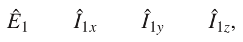

and multiplying it by any one of the four operators for spin two

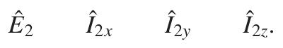

To extend this approach to three spins, all we need to do is to further multiply by any one of the four operators for spin three:

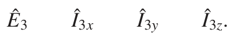

Recall that the Ê are unit operators which, for brevity, we do not bother to write out each time. For example, Î1x Ê2 Ê3 would usually be written as Î1x. With four operators for each spin, we can see that there will be a total of 43 = 64 possible product operators for a three-spin system. This is rather a lot of operators to deal with, but we will find that in most calculations only a small sub-set of the operators are important, so that things are not as complex as they might appear at first.

Just as in the two-spin case, normalization factors are needed for some of the product operators. Those containing two operators which are not Ê have a factor of 2, whereas those with three such operators have a factor of 4. For example, Î1x Î2z Ê3 has a normalization factor of 2 and becomes

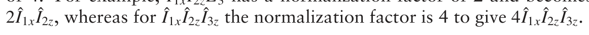

### 10.1.1 Interpretation of the product operators for three spins

In thinking about the interpretation of the product operators for a three-spin system, it is useful to keep in mind what the spectrum of such a spin system looks like. As was discussed in section 3.7 on page 40, each spin gives rise to a doublet of doublets and, as is illustrated in Fig. 3.12 on page 42, each line in the multiplet can be labelled with the spin states of the two coupled spins. It is also important to remember that the appearance of the multiplet, and the labelling of the lines, depends on the relative sizes and signs of the coupling constants present.

As for two spins, Î1z represents z-magnetization on spin one and, setting aside any constant (see section 6.8.6 on page 131), the equilibrium z-magnetization on this spin can be written Î1z. Similarly, Î2z and Î3z represent z-magnetization on spins two and three, respectively.

Î1x represents in-phase x-magnetization on spin one. If this operator is allowed to evolve, and the resulting FID Fourier transformed, the spectrum will consist of the spin-one multiplet (a doublet of doublets) in which all of the lines have the same phase. Just exactly what this multiplet looks like will depend on the size of the coupling constants to spins two and three, a point which is illustrated in Fig. 10.1 on the following page where the multiplets for three different combinations of couplings are shown. Note in particular that the multiplet shown in (c) is for the case J12 = J13, and so appears as a 1:2:1 triplet.

2Î1x Î2z gives rise to a multiplet in which those lines associated with spin two being in the α spin state are negative, while those associated with spin two being in the β state are positive. The result, also illustrated in Fig. 10.1 on the next page, is described as being anti-phase with respect to the coupling to spin two. Note once again that the detailed appearance of the multiplet depends on the relative size of the two coupling constants. If, as is shown in (a), J12 >J13, the intensity pattern is −− ++, whereas if J13 >J12, as shown in (b), the pattern is − + −+. If the two coupling constants are equal, shown in (c), the two centre lines cancel to give what appears to be an anti-phase doublet. However, it is important to realize that this is not a doublet, but a doublet of doublets in which two of the lines have cancelled one another.

In a similar way, 2Î1x Î3z represents x-magnetization on spin one which is anti-phase with respect to the coupling to spin three. The signs of the lines in the corresponding multiplet are affected by the spin state of spin three. Therefore, as is shown in Fig. 10.1 on the following page, we see a pattern of two positive and two negative lines, the exact form of which depends on the relative size of the two coupling constants. Once again, if these two coupling constants are equal, the two inner lines cancel.

Finally, the operator 4Î1x Î1z Î3z gives rise to a multiplet in which lines associated with spins two and three being in the same spin state are positive,

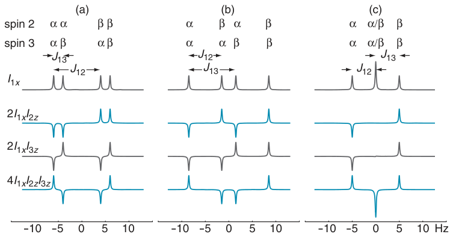

**Fig. 10.1** Illustration of the form of the spin-one multiplets expected for four product operators which lead to observable signals on spin one; it has been assumed that x-magnetization will give rise to an absorption mode lineshape, and that the offset of spin one is 0 Hz. In (a) J12 = 10 Hz and J13 = 2 Hz, in (b) J12 = 7 Hz and J13 = 10 Hz, and in (c) J12 = 5 Hz and J13 = 5 Hz. Each line is labelled with the spin state of the two coupled spins, spins two and three. Î1x is described as an in-phase operator as it gives rise to multiplets in which all four lines have the same phase i.e. all positive. 2Î1x Î2z is described as being anti-phase with respect to the coupling to spin two; lines associated with spin two being in the α spin state are negative, while those associated with the β spin state are positive. Similarly, 2Î1x Î3z is anti-phase with respect to the coupling to spin three, and the signs of the lines are determined by the spin states of that spin. Finally, 4Î1x Î2z Î3z is described as being doubly anti-phase; lines in which the spin states of the two coupled spins are the same are positive, whereas those in which the spin states are opposite are negative. Note that for the multiplets shown in (c), in which J12 = J13, the in-phase multiplet becomes a 1:2:1 triplet, whereas the singly anti-phase multiplets appear to be anti-phase doublets on account of the cancellation of two of the lines. However, the doubly anti-phase term results in a +1 : −2 : +1 ‘triplet’, as the two centre lines reinforce.

whereas if the spins are in different states the lines are negative; such an arrangement is said to be doubly anti-phase. As can be seen in Fig. 10.1, the resulting pattern of intensities is +−−+. In contrast to the singly anti-phase terms, if the two coupling constants are equal, two of the lines reinforce

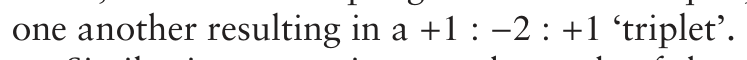

Similar interpretations can be made of the operators Î2x, 2Î1z Î2x, 2Î2x Î3z and 4Î1z Î2x Î3z: they all represent spin-two multiplets which are, respectively, in-phase, anti-phase with respect to the coupling to spin one, anti-phase with respect to the coupling to spin three, and doubly anti-phase with respect to the couplings to spins one and three. The corresponding operators

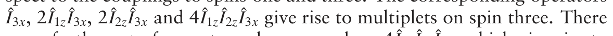

are a further set of operators along y, such as 4Î1y Î2z Î3z, which give rise to multiplets which are phase shifted by 90◦ compared with those along x. It is usual to call product operators such as 2Î1x Î2z singly anti-phase, and those such as 4Î1x Î2z Î3z doubly anti-phase.

The only observable product operators are those already described i.e. those containing just one transverse operator Îx or Îy. Products containing two such transverse operators correspond to double- and zero-quantum coherence, and products containing three such operators correspond to triple-quantum coherence and a kind of single-quantum coherence associated with combination lines; none of these operators are observable.

### 10.1.2 Evolution due to offsets and pulses

The evolution under the influence of offsets and pulses follows the same rules as were established for two spins, and are summarized in Fig. 7.4 on page 148. As before, although we need a separate term for the offset of each spin, these can simply be applied one after another, in any order. So, for example, the evolution during a delay due to the offset is given by

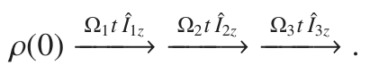

Often, calculating the effect of these three rotations will be simpler than it might seem at first sight, as the offset for spin one only affects operators of that spin and not the operators for the other two spins. The effect of a pulse can similarly be calculated by considering three successive rotations; for example, for a 90◦ pulse about x:

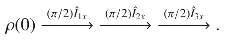

### 10.1.3 Evolution of couplings

The effect of coupling is in principle the same as for two spins, and is summarized in Fig. 7.6 on page 152. However, the results are a little more complicated than for two spins, and how this all turns out is best illustrated by means of an example.

Let us start with in-phase magnetization on spin one Î1x, and allow it to evolve first under the coupling to spin two, and secondly under the coupling to spin three. We do not need to consider the coupling between spins two and three as this cannot affect the evolution of a spin-one operator.

The evolution due to the 1–2 coupling is just as before, leading to an anti-phase term along y:

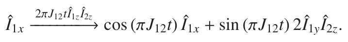

We will now consider the effect of the 1–3 coupling separately on each of the terms on the right of the previous equation. For the term in Î1x it is just the same as before, except that the coupling is between spins one and three, thus generating the anti-phase term 2Î1y Î3z rather than 2Î1y Î2z:

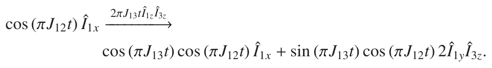

The evolution of the term sin (πJ12t) 2Î1y Î2z is a little more complicated. The first thing to realize is that the spin-two operator Î2z is unaffected by the 1–3 coupling, so as far as this part of the calculation is concerned, the operator Î2z is just a constant, like the factor of 2 and the sine term. So, it is just the term Î1y which will evolve under the 1–3 coupling; as before, in-phase along y gives rise to anti-phase along x:

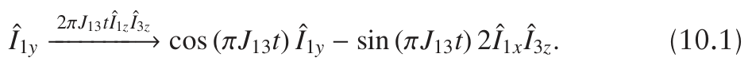

Note that the anti-phase term which is produced is 2Î1x Î3z, as it is the 1–3 coupling which is evolving.

The evolution of sin (πJ12t) 2Î1y Î2z due to the 1–3 coupling is therefore found by multiplying both sides of Eq. 10.1 by 2 sin (πJ12t) Î2z:

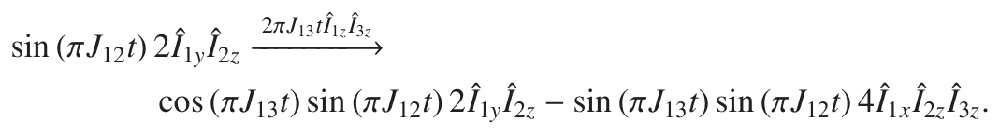

The factor of 4 in the last term arises from one factor of 2 in the starting operator 2Î1y Î2z, and a second factor of 2 from Eq. 10.1.

The overall result of the evolution of Î1x under coupling is best summarized in a table:

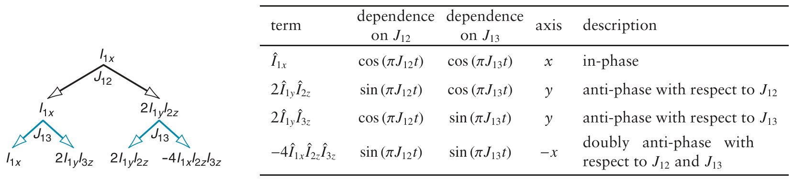

The size of the singly anti-phase terms depends on a factor sin (πJactivet), where Jactive is the coupling with respect to which the term is anti-phase, and a factor cos (πJpassivet), where Jpassive is the coupling to the other spin. The in-phase term has two such cosine factors, whereas the doubly anti-phase term depends on two such sine factors. Note also that if the in-phase term starts along x, the singly anti-phase terms appear along y, and the doubly anti-phase term appears along −x.

**Fig. 10.2** Representation of the evolution of Î1x under the influence of coupling to spin two and spin three. An arrow to the left implies a factor of cos (πJijt), whereas an arrow to the right implies a factor of sin (πJijt). The top set of arrows is for the coupling between spins one and two, and the lower set for the coupling between spins one and three. The way in which each term splits up (including the sign) is found by following round the diagrams in Fig. 7.6 on page 152. From the diagram we can see that the factors associated with the term 2Î1yÎ2z are sin (πJ12t) and cos (πJ13t), as to arrive at this term we first split to the right and then to the left.

There are lots of nice patterns here, which can also be expressed diagrammatically as shown in Fig. 10.2. At the top of the diagram we have the starting operator Î1x. Under the influence of the 1–2 coupling, two operators are generated: the original operator, Î1x, and the anti-phase operator 2Î1y Î2z. Then, each of these operators splits into two as a result of the evolution of the 1–3 coupling. The cascade is arranged so that an operator which has split to the left has associated with it a cosine factor, whereas an operator which has split to the right has a sine factor. The signs of the operators are found simply by following around the rotations in Fig. 7.6 on page 152. Such a diagram is a convenient way of keeping track of the operators, their signs and the trigonometric factors.

We will do one more example, which is to start with the doubly anti-phase term 4Î1z Î2z Î3y and allow it to evolve under the coupling between spins one and three, and between spins two and three; we need not concern ourselves with the coupling between spins one and two as this cannot affect a spin-three term.

The evolution of the 1–3 coupling is best determined by regarding

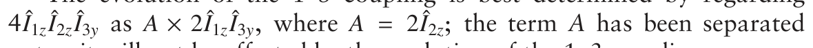

out as it will not be affected by the evolution of the 1–3 coupling.

Allowing 2Î1z Î3y to evolve under the 1–3 coupling gives

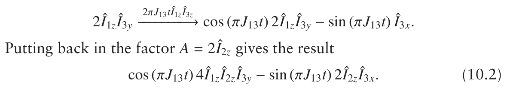

Now we need to consider the evolution of each term on the right-hand side of Eq. 10.2 under the 2–3 coupling. From the first term we can take out a factor B = cos (πJ13t) 2Î1z which will be unaffected by the evolution of this coupling; the remaining operator product evolves according to

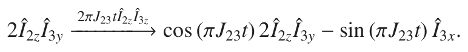

Putting back in the factor B gives

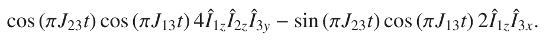

Finally, we need to consider the evolution of the term − sin (πJ13t) 2Î2z Î3x from Eq. 10.2 under the 2–3 coupling; this is straightforward and gives

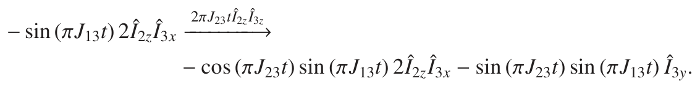

In summary, after the evolution of both couplings we have the four terms:

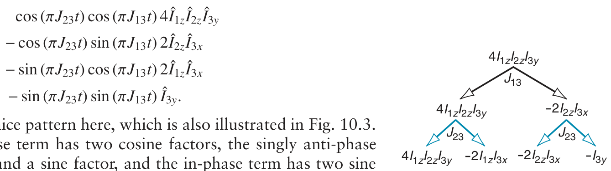

As before, there is a nice pattern here, which is also illustrated in Fig. 10.3. The doubly anti-phase term has two cosine factors, the singly anti-phase terms have a cosine and a sine factor, and the in-phase term has two sine factors. Note also that the doubly anti-phase term is along y, the singly

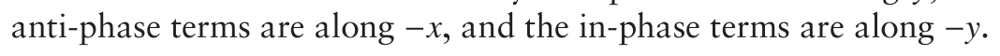

**Fig. 10.3** Representation of the evolution of 4Î1z Î2z Î3y under the influence of the coupling of spin three to spins one and two. The diagram is interpreted in the same way as Fig. 10.2 on the facing page.

## 10.2 COSY for three spins

Based on our previous discussion of COSY (section 8.3 on page 190), we know what to expect for three mutually coupled spins. Assuming that all the couplings are non-zero, there will be cross peaks centred at {ω1, ω2} = {Ω1, Ω2}, {Ω1, Ω3} and {Ω2, Ω3}, along with a symmetry-related set of cross peaks which have the ω1 and ω2 coordinates transposed. In addition, there will be diagonal peaks centred at {Ω1, Ω1}, {Ω2, Ω2} and {Ω3, Ω3}. The overall form of the spectrum is shown in Fig. 10.4 on the following page.

What we are going to look at in this section is the detailed form of the cross-peak multiplets. We will see that they have rather an aesthetically pleasing arrangement of peaks, from which we can determine something about the relative size of the coupling constants which are responsible for the cross peak (the active coupling), and the other (passive) couplings.

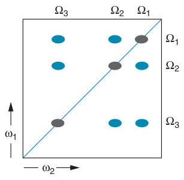

Starting from equilibrium magnetization on spin one, Î1z, and applying the COSY pulse sequence of Fig. 8.8 on page 192, gives us the following

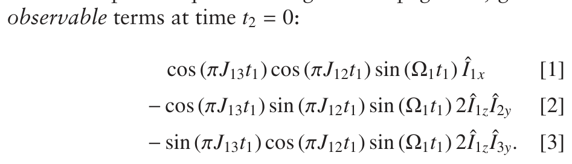

**Fig. 10.4** Schematic COSY spectrum for three mutually coupled spins. The cross peaks are shown in blue, and the diagonal peaks in dark grey; multiplet structures are not shown.

Looking at these, we can see that term [1] is the diagonal peak as it is modulated at the offset of spin one, Ω1, in t1, and appears as observable magnetization on spin one. Term [2] is also modulated at Ω1 in t1, but appears as observable magnetization on spin two: it therefore gives rise to the cross peak at {Ω1, Ω2}, which for short we will call the 1–2 cross peak. Similarly, term [3] gives rise to the cross peak at {Ω1, Ω3}, i.e. the 1–3 cross peak.

Note that if J12 = 0, term [2] goes to zero on account of the factor sin (πJ12t1) being zero. Just as expected, there will be no 1–2 cross peak if the coupling between spins one and two is zero. On the other hand, having J12 = 0 does not force term [3] to be zero, so the 1–3 cross peak is still present.

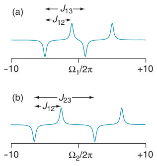

### 10.2.1 Structure of the cross-peak multiplets

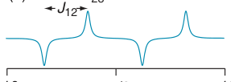

We will now focus on the 1–2 cross-peak multiplet, represented by term [2]. The ω1 frequencies of the peaks in this multiplet are found by examining the modulation with respect to t1. Just as we did for the two-spin case, we can use the usual trigonometric identities to transform the t1 modulation,

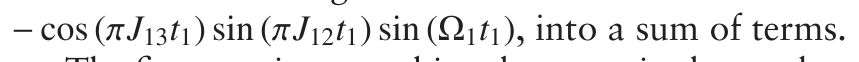

The first step is to combine the terms in the product sin (πJ12t1) sin (Ω1t1) using the identity

**Fig. 10.5** Examples of the form of the multiplets expected along the two dimensions for the 1–2 cross peak. These multiplets have been computed for the particular case J12 = 4 Hz, J13 = 6 Hz and J23 = 9 Hz. Multiplet (a) is that along ω1, and is from spin one; the multiplet is anti-phase with respect to the 1–2 coupling, but in-phase with respect to the 1–3 coupling. Multiplet (b) is that along ω2, and is from spin two; the multiplet is also anti-phase with respect to the 1–2 coupling, but in-phase with respect to the 2–3 coupling.

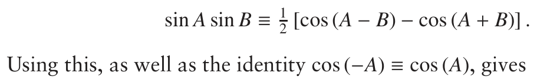

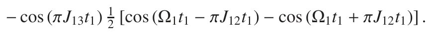

We then multiply out the square bracket and combine the product of two cosines using the identity

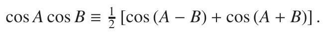

The result of all these manipulations is four terms:

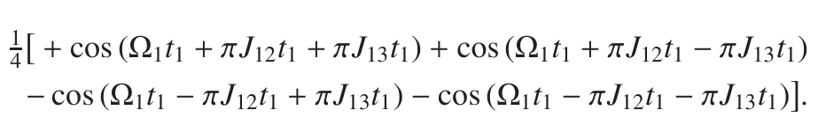

**Fig. 10.6** Contour plot of the COSY cross-peak multiplet between spins one and two in the three-spin system; positive contours are shown in blue, and negative in dark grey. The couplings are J12 = 4 Hz, J13 = 6 Hz and J23 = 9 Hz, and the whole plot covers ±10 Hz from the centre of the multiplet. The multiplets plotted along the top and at the side are those shown in Fig. 10.5 on the preceding page. The cross-peak multiplet consists of four anti-phase square arrays, which are picked out by the grey boxes.

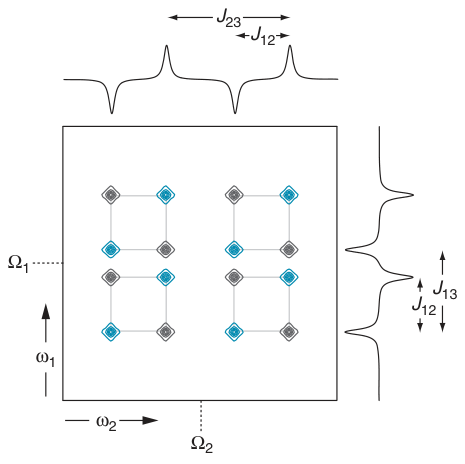

The four frequencies are the four lines of the spin-one multiplet (a doublet of doublets); however, two of the lines are positive and two are negative. The lines which are separated by J12 have opposite signs, whereas those which are separated by J13 have the same signs. Figure 10.5 (a) on the facing page shows an example of such a multiplet for a particular set of couplings; the multiplet is described as being anti-phase with respect to J12, and in-phase with respect to J13.

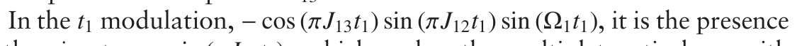

of the sine term, sin (πJ12t1), which makes the multiplet anti-phase with respect to J12. The cosine term, cos (πJ13t1), results in an in-phase splitting with respect to J13.

The operator in term [2] is 2Î1z Î2y. Following the discussion in section 10.1.1 on page 321, this operator gives, in ω2, a multiplet on spin two which is anti-phase with respect to the coupling to spin one, and in-phase with respect to the coupling to spin three. Figure 10.5 (b) shows an example of such a multiplet for a particular set of couplings. Comparing the two multiplets shown in (a) and (b), we see that both are anti-phase with respect to the 1–2 coupling, which is the coupling responsible for forming the cross peak, but are in-phase with respect to the coupling to the third spin.

Now that we have identified the form of the multiplets in each dimension, we can work out the detailed form of the cross peak by ‘multiplying together’ the ω1 and ω2 multiplets in the way which was introduced in Fig. 8.10 on page 194. Figure 10.6 shows the resulting two-dimensional multiplet.

Looking at the multiplet we can see immediately that it consists of four anti-phase square arrays of the type pictured in Fig. 8.10; in Fig. 10.6 these four arrays are picked out by the grey boxes. In each dimension, the peaks in the anti-phase square array are separated by J12, which is the coupling responsible for the cross peak – termed the active coupling.

Relative to the centre of the cross-peak multiplet at {Ω1, Ω2}, the four anti-phase square arrays are centred at the following frequencies (for

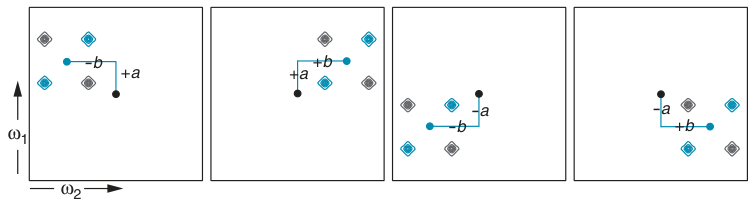

**Fig. 10.7** Illustration of how the cross-peak multiplet shown in Fig. 10.6 on the preceding page is constructed from four anti-phase square arrays. The centre of the multiplet is indicated by the black dot and, relative to this point, the anti-phase square arrays are shifted by ±12 J13 Hz in the ω1 dimension, and ± 12 J23 Hz in the ω2 dimension. These shifts are indicated by the blue lines which connect the centre (the black dot) to the centre of each anti-phase square array (the blue dot); in the diagram a = 12J13 and b = 12 J23.

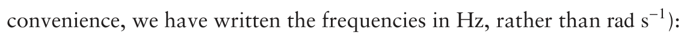

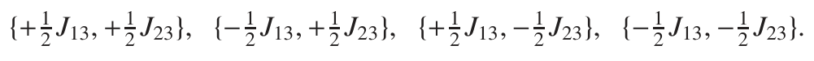

The location of these four anti-phase square arrays is illustrated in Fig. 10.7.

In the ω1 dimension, the coupling J13 is described as passive as it it not responsible for the cross peak, but does involve one of the two spins the coupling between which is responsible for the cross peak. In the same way, in ω2 the coupling J23 is passive.

The exact appearance of the multiplet depends on the relative sizes of the couplings involved. It is particularly easy to spot the four anti-phase square arrays in Fig. 10.6 on the preceding page, as the active coupling is smaller than both of the passive couplings. Other arrangements of couplings lead to cross-peak multiplets which are a little more difficult to disentangle.

Figure 10.8 on the next page shows a series of different 1–2 cross-peak multiplets all of which have the same active coupling, but in which the passive couplings are different; the values are given in the following table:

cross peak J12 / Hz J13 / Hz J23 / Hz comment

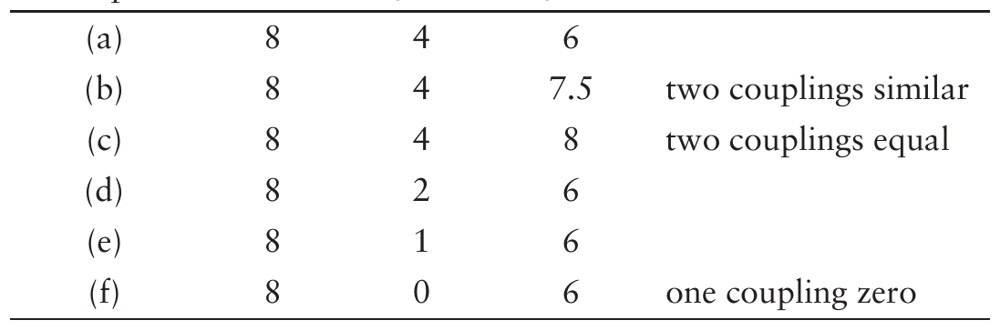

Multiplet (a) should be compared with that in Fig. 10.6 on the preceding page. The difference between these two multiplets is that in (a) the active coupling is larger than either of the two passive couplings, whereas in Fig. 10.6 on the previous page the active coupling is smaller than the passive couplings. The anti-phase square arrays in multiplet (a) are thus not

**Fig. 10.8** Illustration of how the appearance of the 1–2 cross-peak multiplet depends on the relative sizes of the active and passive couplings. For each multiplet the active coupling, J12, is 8 Hz; the passive couplings have the values given in the table in the text. In all cases, the area plotted is ±10 Hz from the centre of the cross-peak multiplet. In each multiplet, one of the four anti-phase square arrays is indicated by a grey box.

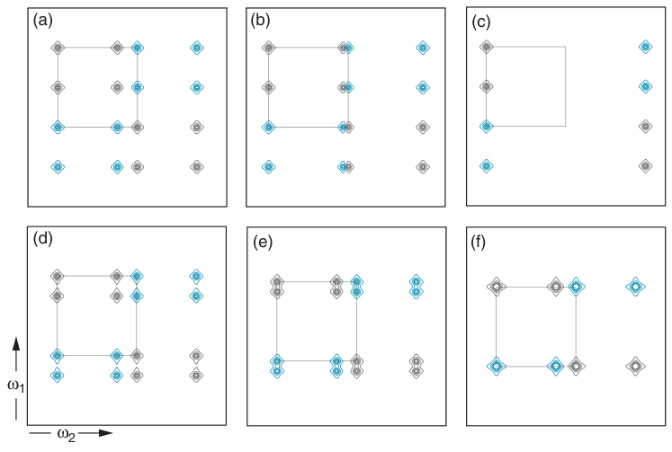

separate from one another, but overlap (to avoid confusion, in the diagram only one of the squares is indicated).

In multiplet (b) the passive coupling in the ω2 dimension, J23, is similar in size to the active coupling, J12. As a result, the two columns of peaks in the centre of the multiplet come quite close together, and so the adjacent positive and negative peaks begin to cancel. In the limit that J23 = J12, multiplet (c), this cancellation is complete and so the multiplet consists of only eight peaks, rather than the usual sixteen. This multiplet looks rather strange until you realize that, because of cancellation, some of the peaks which form the anti-phase square arrays are missing. For the case shown in (c), the spin-two multiplet in the conventional one-dimensional spectrum would be a 1:2:1 triplet.

Multiplets (d), (e) and (f) illustrate what happens as the passive coupling J13 gets smaller and smaller. As expected, the individual multiplet components move closer together, but as the peaks which become adjacent have the same sign they reinforce one another. In the limit that J13 = 0, multiplet (f), two of the anti-phase square arrays lie on top of one another and so there are only eight individual peaks in the multiplet.

You can see from these examples that, although in principle each cross-peak multiplet is composed of four anti-phase square arrays, what the multiplet actually ends up looking like depends in detail on the relative sizes of the coupling constants. In addition, the extent to which individual peaks will cancel or reinforce one another depends on the linewidth, which may be different in the two dimensions. As a result, in practical spectroscopy one often needs a sharp eye and an inventive mind to disentangle the structure of a particular cross-peak multiplet.

If we are able to understand the form of the cross-peak multiplet, then it gives us extra information on the relative sizes of the couplings involved. However, in general we need to be cautious about actually trying to measure the values of couplings from these cross peaks since, as noted in section 8.3.4 on page 198, cancellation between nearby peaks results in the splittings between peaks of opposite signs not being equal to the coupling constants.

The extension to more complex spin systems is straightforward. All that happens is that each passive coupling further duplicates the anti-phase square arrays. So if spin one was further coupled to spin four, then the 1–2 cross peak would consist of eight anti-phase square arrays, shifted by ±12 J13

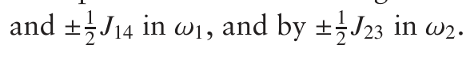

## 10.3 Reduced multiplets in COSY spectra

As we have seen, for a system of three mutually coupled spins, each cross-peak multiplet contains sixteen separate peaks, which can be grouped into four anti-phase square arrays. In this section we will look at the ways in which the number of peaks in the multiplet can be reduced, leading to what are called, not surprisingly, reduced multiplets.

It turns out that from these reduced multiplets we can determine the relative signs of the two passive couplings. In addition, under favourable circumstances, we can measure the values of the coupling constants to the passive spins to high accuracy. The latter feature, often called the ECOSY principle, has been used very widely to measure values of coupling constants in labelled proteins and nucleic acids.

It is easiest to see how reduced multiplets arise by first thinking about a three-spin system in which one of the spins is of a different type to the others e.g. a heteronucleus. Once we have examined this case, we will go on to explain how reduced multiplets can be generated in homonuclear spin systems.

### 10.3.1 COSY for a three-spin system containing one

### heteronucleus

Imagine that, in our three-spin system, spin three is of a different type to the other two e.g. spins one and two are protons, whereas spin three is a heteronucleus, such as 13C, 15N, 31P, or 19F. Furthermore, in recording our COSY spectrum, we will apply pulses only to the first type of nucleus (spins one and two); spin three, being a heteronucleus, does not experience any pulses. For compatibility with the next section, we will denote the operators of the third spin Î3x, Î3y and Î3z, rather than Ŝx, Ŝy and Ŝz, as would be usual for a heteronucleus.

If we repeat the calculation at the start of section 10.2 on page 325, we will find that, starting from Î1z, the following observable terms on spin two are present at the beginning of t2:

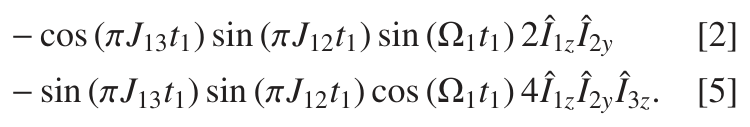

Both of these terms are modulated at Ω1 in the ω1 dimension: they therefore both contribute to the 1–2 cross peak.

Term [2] is exactly the same as the one we found before on page 326. As is shown in Fig. 10.6 on page 327, this term gives rise to a cross-peak multiplet which is anti-phase with respect to J12 in each dimension, but is

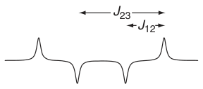

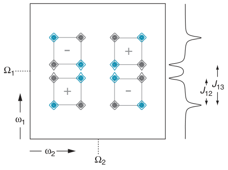

**Fig. 10.9** Contour plot of the contribution made by term [5] to the cross-peak multiplet between spins one and two; the parameters of the spin system are the same as in Fig. 10.6 on page 327. The ω1 multiplet, which is on spin one and doubly anti-phase with respect to the 1–2 and 1–3 couplings, is shown down the side. Similarly, along the top is shown the ω2 multiplet, which is on spin two and doubly anti-phase with respect to the 1–2 and 2–3 couplings. Multiplying these two multiplets together gives us the form of the two-dimensional multiplet. As in Fig. 10.6 we can pick out four anti-phase square arrays, however the overall sign of two of these are opposite to those in Fig. 10.6. The overall sign of each anti-phase square array is shown by the symbol in the middle of the array.

in phase with respect to J13 in the ω1 dimension, and with respect to J23 in the ω2 dimension.

Term [5] did not appear in our original calculation because in that case the final 90◦ pulse was applied to all three spins, whereas in the present case this final pulse is not felt by spin three. You can see that if we did apply a 90◦(x) pulse to spin three, this last term would be rotated from 4Î1z Î2y Î3z to −4Î1z Î2y Î3y, which is unobservable. Therefore the consequence of spin three being a heteronucleus is the presence of an additional contribution to the cross peak, as represented by term [5].

We now need to work out the form of the two-dimensional multiplet which arises from term [5]. As before, we have to expand the modulation

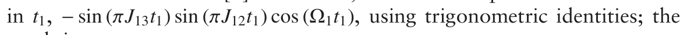

result is

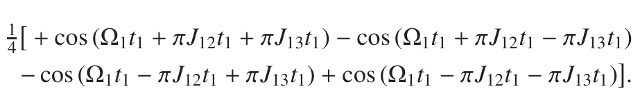

The four lines are clearly those of the spin-one multiplet, however the pattern of intensities is that for a doubly anti-phase state (see Fig. 10.1 on page 322), this is in contrast to the multiplet from term [2], which is singly anti-phase with respect to the active coupling, J12. The t1 modulation of term [5] has sine factors depending on J12 and J13: it is these which make the multiplet anti-phase with respect to both of these couplings.

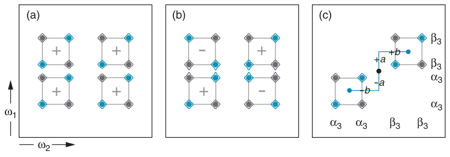

**Fig. 10.10** Contour plots of the 1–2 cross peak showing: (a) the contribution made by term [2] on page 326; (b) the contribution made by term [5]; (c) the sum of these two contributions, which is what will be observed in the spectrum. As a result of adding (a) and (b), two of the anti-phase square arrays cancel, so that there are only two arrays in multiplet (c), which is described as a reduced multiplet. The two anti-phase square arrays are displaced from the centre by {+12 J13, + 12 J23}, and

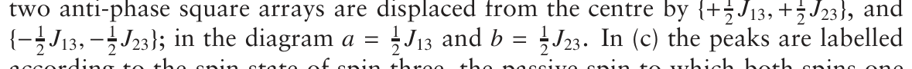

according to the spin state of spin three, the passive spin to which both spins one and two are coupled; note that all the peaks present have the same spin state in both dimensions. The value of the coupling constants are the same as for Fig. 10.9 on the previous page.

In ω2, the operator in term [5] is 4Î1z Î2y Î3z. This gives rise to a spin-two multiplet which is doubly anti-phase with respect to J12 and J23. Now that we have worked out the form of the multiplets in the two dimensions we can ‘multiply’ them together in the way we did in Fig. 10.6 on page 327; the result is shown in Fig. 10.9 on the previous page.

Just as for term [2], the multiplet from which is shown in Fig. 10.6, there are four anti-phase square arrays, but this time two are of opposite overall sign to those in Fig. 10.6. Apart from these sign changes, the multiplets from terms [2] and [5] are identical.

The difference between the two multiplets, and the way in which they combine to give the overall form of the cross peak, is illustrated in Fig. 10.10. Here, multiplet (a) is from term [2] – note that the four anti-phase square arrays all have the same overall sign. Multiplet (b) is from term [5], and in this case two of the anti-phase square arrays are of opposite overall sign to the other two. In the COSY spectrum what we will see is the sum of the two contributions (a) and (b), which is what is shown in (c). Two of the anti-phase square arrays have cancelled one another, and two have reinforced. The result is called a reduced multiplet.

The form of the reduced multiplet can be described in the following way. There are two anti-phase square arrays, split by the active coupling, J12, in each dimension. One array is shifted away from the nominal centre

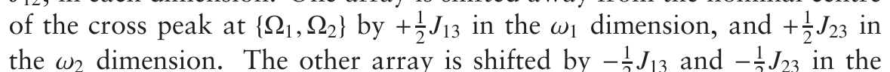

the ω2 dimension. The other array is shifted by −12 J13 and −12 J23 in the respective dimensions. Note that the anti-phase square array is split by the active coupling, whereas the shifts are determined by the sum of the passive couplings.

In Fig. 10.10 (c) the peaks are labelled according to the spin state of spin three, which is the passive spin to which both spins one and two are coupled. We see that the only peaks which are present in the two-dimensional multiplet are those in which the spin state of spin three is the same in both dimensions.

This observation gives us a way of thinking about what a reduced multiplet is. We imagine that one anti-phase square array comes from molecules in which spin three is in the α state, and as a result this array

2 J23}.1 The other array comes from molecules in which spin three is in the β state, and is centred at {ν1 + 12 J13, ν2 + 12 J23}.

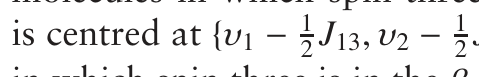

This way of thinking about a reduced multiplet also indicates in what sort of experiments we can expect to find such multiplets. The key point is that to have a reduced multiplet, the spin state of the passive spin (here spin three) must remain the same throughout i.e. it must not change between the t1 and t2 periods. Therefore, no pulses can be applied to the passive spins, as these will scramble the spin states (an exception would be a 180◦ pulse which simply swaps the spin states, but does not scramble them). This is why a COSY of a homonuclear three-spin system does not show reduced multiplets, whereas if one of the spins is heteronuclear, and so is unaffected by the pulses, we do find reduced multiplets.

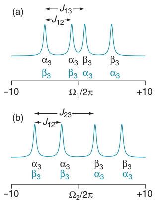

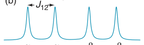

The final point to make is that for a reduced multiplet to appear between spins one and two, both must be coupled to the same third spin. If only spin one is coupled to spin three, then we will not see a reduced multiplet.

### 10.3.2 Determining the relative signs of the passive couplings

In section 3.6 on page 38 we explained that changing the sign of a coupling constant has no visible effect on the normal one-dimensional spectrum, but does affect the labelling of the lines in the multiplet according to the spin states of the coupled spins. This is illustrated in Fig. 10.11, where we see the effect on the labelling of the spin-one and spin-two multiplets of changing the sign of the coupling to the third spin.

**Fig. 10.11** Illustration of the effect on the spin-one and spin-two multiplets of changing the sign of the passive couplings to spin three. These multiplets have been computed for the particular case |J12| = 4 Hz, |J13| = 6 Hz and |J23| = 9 Hz. Multiplet (a) is for spin one, and each line is labelled according to the spin state of spin three (denoted α3 or β3). The labels in black are for the case where J13 = +6 Hz, and those in blue are for J13 = −6 Hz; note that the multiplet does not change, but the labels do. Multiplet (b) is for spin two, and is similarly labelled for the case J23 = +9 Hz (in black), and J23 = −9 Hz (in blue).

In a reduced multiplet, the only peaks which appear are those in which the spin state of the third spin (the passive spin) is the same in each dimension. Where these peaks appear will therefore depend on the sign of the coupling constants to this passive spin since, as we have seen, this affects the labelling of the peaks. We therefore expect the appearance of the reduced multiplet to be affected by the signs of the coupling constants to the passive spins.

Figure 10.12 on the following page illustrates how the appearance of the reduced multiplet between spins one and two is affected by the signs of J13 and J23. What we see here is that it is the relative signs of the couplings which is important. If both couplings have the same sign, then the two anti-phase square arrays are arranged such that the multiplet is ‘tilted’ to the right, whereas if they have opposite signs, the multiplet is tilted to the left. It is thus possible to determine the relative signs of the coupling constants simply by inspecting which way the reduced multiplet is tilted.

It is not possible to determine the absolute sign of the coupling constants by this method: only their relative signs can be determined. However, the sign of some couplings are known unambiguously from other consider-

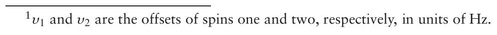

**Fig. 10.12** Illustration of how the form of the reduced cross-peak multiplet between spins one and two is affected by the signs of the two passive couplings to spin three. The spin-one multiplet appears along ω1, and the spin-two multiplet along ω2; as in Fig. 10.11 on the preceding page, |J12| = 4 Hz, |J13| = 6 Hz and |J23| = 9 Hz, and a range of ±10 Hz is plotted from the centre of the cross peak. The spin state of the third (passive) spin is denoted by α3/β3. Note that the only components of the cross peak which will be present are those which have the same spin state of the passive spin in the two dimensions. If the two passive couplings J13 and J23 have the same sign, shown in (a) and (b), the reduced multiplet ‘tilts’ to the right. In contrast, if the couplings have opposite signs, as in (c) and (d), the multiplet tilts to the left.

ations, and if such a coupling is one of the passive couplings, then the absolute sign of the other passive coupling can be determined. For example, one-bond 13C–1H couplings are known to be positive, so from a reduced multiplet in which one passive coupling is a one-bond C–H coupling, and the other is a long-range C–H coupling, it will be possible to determine the sign of the long-range coupling.

### 10.3.3 Measuring the size of the passive coupling constants

We have already noted that, because of the way in which the positive and negative components of a cross-peak multiplet interfere with one another, it is not usually possible to measure values of coupling constants simply by measuring the splittings between the peaks in the multiplet (section 8.3.4 on page 198). However, in a reduced multiplet it is possible, under some circumstances, to measure the size of the coupling constants to the passive spin.

The idea is illustrated in Fig. 10.13 on the facing page. In (a) we have the 1–2 cross-peak multiplet as would be seen in a simple COSY spectrum of a homonuclear spin system. The 1–3 passive coupling is rather small (0.5 Hz), whereas the 2–3 passive coupling is large. As a result, two pairs of the anti-phase square arrays overlap extensively, and it is only just possible to see the splitting in the ω1 dimension due to the 1–3 coupling.

Multiplet (b) is the corresponding reduced multiplet, as would be seen for the case where spin three is a heteronucleus. As has been described above, the two remaining anti-phase square arrays are shifted by

J23 is so large, the two arrays are well separated in the ω2 dimension, and as a result there is no overlap or interference between the two arrays. It

**Fig. 10.13** Illustration of the use of a reduced multiplet to facilitate the measurement of a small coupling constant. Multiplet (a) is the normal 1–2 COSY cross peak, computed for the couplings J12 = 4 Hz, J13 = 0.5 Hz and J23 = 9 Hz; the spin-one multiplet appears along ω1, and the spin-two multiplet along ω2. The splitting due to the small passive coupling in the ω1 dimension is barely visible. Shown in (b) is the corresponding reduced multiplet for the case where spin three is a heteronucleus, and so is unaffected by the final pulse of the COSY sequence. The remaining two anti-phase square arrays are clearly separated as a consequence of the large passive coupling J23. As the two arrays no longer interfere with one another, it is now possible to measure J13 from the displacement, in the ω1 dimension, between the two arrays.

is therefore possible to measure the small coupling J13 by measuring the displacement of the two arrays in ω1, as is shown in the figure. Similarly, it is possible to measure the large coupling J23 in the other dimension.

Essentially what we are doing here is to use the large passive coupling to ‘drag apart’ the two anti-phase square arrays. Once they are well separated, there is no longer any interference between them, and so we can find the value of the small passive coupling by measuring the displacement between the two arrays.

This idea has been used to great effect in the NMR of proteins and nucleic acids. It is possible to label such samples with 100% 13C and 15N, thus making it relatively straightforward to see the effect of couplings to these nuclei on the proton spectra. Typically, the one-bond C–H or N– H coupling takes on the role of the ‘large’ passive coupling, enabling us to measure the much smaller long-range heteronuclear couplings from the reduced multiplets.

### 10.3.4 Reduced multiplets in homonuclear spin systems

We now turn to how reduced multiplets can be generated for purely homonuclear spin systems. A clue as to how this might be achieved comes from the heteronuclear case we have been discussing so far, in which we noted that the important thing was for the spin state of spin three to remain the same throughout the experiment. Any pulse (other than a 180◦ pulse) applied to spin three will violate this condition, but suppose we use a pulse with rather a small flip angle – this will not change the spin states ‘very much’ and so we might expect to generate reduced multiplets.

The simplest implementation of this idea is the small flip angle COSY experiment, whose pulse sequence is shown in Fig. 10.14. All we do is make the flip angle of the final pulse significantly less than 90◦; 20◦ is a typical value. Starting from Î1z, and working through the sequence, we find the following observable terms on spin two at the beginning of t2:

**Fig. 10.14** Pulse sequence for small flip angle COSY. If the flip angle of the final pulse is significantly less than 90◦, the resulting spectrum shows reduced multiplets.

where θ is the flip angle of the final pulse. In the basic COSY experiment described before the final pulse has flip angle 90◦ i.e. θ = π/2. In this case term [5′] disappears since cos (π/2) = 0, and term [2′] becomes exactly the same as term [2] on page 326 since sin (π/2) = 1. We therefore regain the previous result.

In general the two terms [2′] and [5′] do not have the same overall size on account of their different dependence on the flip angle θ. They will not therefore combine to give a reduced multiplet in the same way as terms [2] and [5] on page 330. However, we will now show that if the flip angle θ is small, the two terms will have the same size, and so combine to give a reduced multiplet.

We first note that sin θ and cos θ can be expressed as power series in θ (here θ must be in radians):

We have only written out the first three terms in each case. If θ is small (i.e. θ << 1), then θ2 is even smaller, and θ3 even smaller still. Under these circumstances we can discard all of the terms in θ2 and higher powers of θ. This gives the approximate results

If we now return to terms [2′] and [5′], and assume that θ is small

Both terms now have the same dependence on the flip angle θ and, apart from the factor θ2, they are identical to terms [2] and [5] on page 330. Therefore the resulting cross peak will have a reduced multiplet structure of precisely the form described in section 10.3.1 on page 330.

There are some practical difficulties with using small flip angle COSY as a way of generating reduced multiplets. The overall intensity of the cross peak goes as θ2 which, as it is necessary that θ << 1, means that the cross peaks will be much weaker than in a COSY where the final pulse is 90◦. Recalling the discussion in section 8.3.2 on page 192, one of the problems with COSY is that the diagonal peaks tend to be stronger than the cross peaks and, on account of their lineshape, the diagonal peaks tend to spread well away from the main diagonal. In a small flip angle COSY these problems are even worse as the cross peaks become weaker as the flip angle is reduced whereas, as we will show in section 10.4.4 on page 340, the components of the diagonal-peak multiplet which lie exactly on the diagonal get stronger. Thus for a small flip angle, the cross peaks can easily be swamped by intense tails from the diagonal peaks.

Generally speaking, small flip angle COSY is not a convenient method of generating reduced multiplets in homonuclear spin systems. Luckily, there are other experiments, such as ZCOSY and ECOSY which generate such multiplets, and largely side-step the problems which stem from the diagonal peaks in a conventional COSY.

ZCOSY is most simply described using a different set of operators to the ones we have been using so far. In the next section we will introduce these operators, and first illustrate how they can be used to describe small flip angle COSY. Then, we will use the same operators to show how ZCOSY works.

## 10.4 Polarization operators

Product operators are generally speaking an excellent way of analysing the outcome of multiple-pulse experiments, but they are perhaps not best-suited to analysing multiplet structures, or dealing with the effects of pulses whose flip angles are not 90◦ or 180◦. Under some circumstances, a useful alternative is to construct our product operators from a different set of operators, called polarization operators. To keep the distinction clear, we will call the product operators we have been using so far cartesian product operators.

In this section we will introduce these operators, and then go on to see how they provide a convenient description of experiments such as small flip angle COSY and ZCOSY.

### 10.4.1 Construction and interpretation of polarization operators

The state of each spin is represented by one of four polarization operators; for spin one these are

We have come across the operators Î1+ and Î1− before in section 7.12.1 on page 174. Î1+ is called the raising operator, and Î1− the lowering operator; they are defined in terms of Î1x and Î1y as follows:

These identities can be expressed the other way round:

The operators Î1α and Î1β are related to the unit operator Ê1 and Î1z:

A similar set of four operators are needed for spins two, three and so on.

The basis operators are formed by making all possible products consisting of one of the operators of the type given in Eq. 10.3 on the preceding page for each spin. For example, in a three-spin system, we can have products such as:

Only products containing one operator of the type Î+ or Î− are in principle observable. Therefore, of the three product operators in Eq. 10.6, only the first gives rise to observable magnetization and, since the operator is Î1−, the magnetization appears on spin one. For reasons which will be described in section 11.1.4 on page 386, only operator products containing

The second product in Eq. 10.6 is zero-quantum coherence between spins one and two as it contains the operators Î1+ and Î2− (see section 7.12.1 on page 174). The final product represents the population of the αβα energy level.

### 10.4.2 Free evolution

The really nice thing about these products of polarization operators is that free evolution simply results in a phase factor. In contrast to cartesian product operators, the number of operators does not increase.

In each case the operator simply acquires a phase factor which depends on the frequency in the square brace and the time. Since the operator is Î1−, the frequencies all include the offset of spin one. If the operator for spin two is Î2α then a term −πJ12 is included, whereas if the operator is Î2β a term +πJ12

The corresponding operators containing Î1+ simply evolve in the opposite sense, meaning that the argument of the exponential has a factor of −i rather than +i; for example

The same rules apply to operator products containing Î2− and Î2+; for example

The offset term is Ω2, as the raising operator present is for spin two. Since the spin-one operator is Î1α we include a term −πJ12 in the frequency, and as the spin-three operator is Î3β we include a term +πJ23. Note that the latter term involves the coupling between spins two and three, as spin two is present as the raising operator.

You will have noticed by now that each of the four operators

evolves at the frequency of one of the four lines of the spin-one multiplet. Each operator represents observable magnetization which corresponds to one of the four lines of the multiplet. In the same way the four operators

represent the four lines of the spin-two multiplet.

### 10.4.3 Pulses

The effect of pulses on these operators is rather more complex than for cartesian product operators. For an x-pulse of flip angle θ to spin one we have:

The effect of a pulse is to interconvert all the operators in a fairly complex way which depends on trigonometric functions of θ and 12θ. There are a similar set of relations for the operators of spins two, three and so on.

Two special cases are of interest. For a 180◦ pulse, θ = π, the transformations become rather simple:

The second case we are going to be interested in is when the flip angle θ is small. As we discussed in section 10.3.4 on page 335, in such circumstances we can write sin θ ≈ θ and cos θ ≈ 1. Under these circumstances the trigonometric terms in the above equations become

With these approximations, the effect of a small flip angle pulse is

We are now in a position to use these polarization operators in some practical calculations.

### 10.4.4 Small flip angle COSY

As we did before, let us imagine a homonuclear three-spin system and start out with z-magnetization on spin one, Î1z. We are going to assume that the phase of the first pulse is y, so that the operator generated by this pulse is Î1x. This simplifies the calculation slightly when compared with starting with a 90◦(x) pulse; the form of the spectrum is not changed, apart from an overall phase shift.

To express Î1x in terms of polarization operators we first have to realize that Î1x is really a shorthand for Î1x Ê2 Ê3 (see section 10.1 on page 320). These three operators can be expressed in terms of polarization operators by using Eq. 10.4 and Eq. 10.5 on page 338:

Substituting in these expressions gives

Multiplying this all out we find

The four operators in the first bracket correspond to the four lines of the spin-one multiplet, which is hardly a surprise as we know from section 10.1.1 on page 321 that the cartesian operator Î1x represents an in-phase multiplet on spin one. Similarly, the four operators in the second bracket also correspond to the four lines of the multiplet: all that is different about this second group of four, as compared with the first, is a change in the sense of the evolution.

To predict the form of the spectrum we first have to allow each of these operators to evolve for time t1, and then work out the effect of the final small flip angle pulse. This is not quite as complicated as it seems, since once we have done a couple of terms a pattern will develop, which means that we do not really have to work through them all.

To start with we will just consider the term Î1+ Î2α Î3α; during t1 this term simply acquires a phase factor:

The final pulse will transfer this term, along with its modulation, to the other spins, thereby generating the cross peak. We will focus on the transfers to spin two, which lead to the 1–2 cross peak.

### The 1–2 cross-peak multiplet

In order to contribute to the 1–2 cross peak, the final pulse must transfer Î1+ Î2α Î3α into an operator product containing Î2− (recall that only Î− operators are observable). In addition, for the term to be observable the spin-one and spin-three operators must be Î1γ and Î3γ′, where γ and γ′ can be α or β:

The effect of the small flip angle pulse is given by Eq. 10.7 on the preceding page, from which we see that the transformation from Î2α to Î2− carries

For spin one, if the operator goes from Î1+ to Î1α there is a coefficient of +12iθ, whereas if the final operator is Î1β, the coefficient is −12iθ. For spin three, if the operator remains the same (Î3α), there is a coefficient of 1, whereas the transformation to Î3β gives a coefficient of 14θ2. In summary, we have the following four possibilities

If the flip angle is small, we can discount the last two terms as they go as θ4, which will give them very low intensity compared with the first two terms, which go as θ2; we will therefore ignore the terms in θ4.

Note that the first two terms are the ones in which the spin-three operator is unchanged, whereas in the second two terms this operator changes from Î3α to Î3β. What is happening is that the small flip angle pulse is discriminating in favour of transfers in which spin three, the passive spin, does not change spin state.

Multiplying out the brackets for the first two terms gives us

Notice that there is a sign change depending on whether spin one ends up

As we saw above, during t1 the product Î1+ Î2α Î3α acquires a phase label

with respect to t1 there will be a peak at −[Ω1 − πJ12 − πJ13] in the ω1

Overall, the term Î1+ Î2α Î3α present during t1 gives rise to two components in the cross-peak multiplet:

We now need to work through the remaining three operator products of the form Î1+ Î1γ Î2γ′ present during t1. It turns out that these follow a very similar pattern, in which the final pulse causes each to split into two products which are observable on spin two. The results are summarized in the table below.

Down the side of the table are the operator products present at the start of t1, and along the top are the four possible operator products which result in observable signals on spin two. The entries in the table give the coefficient for the transfer between the operator in the corresponding row and column.

Recall that each of the product operators down the side represents a line from the spin-one multiplet, whereas those along the top represent a line from the spin-two multiplet. Thus the table is in fact a direct picture of the 1–2 cross-peak multiplet.

The operators have been ordered in the table in a way which will match the line positions for the case where the active coupling is smaller than either of the passive couplings, which is the situation illustrated in Fig. 10.10 (c) on page 332. The pattern of intensities shown in the table therefore matches this diagram. What we have here is a reduced multiplet, with the two anti-phase square arrays appearing in the top right, and bottom left, quadrants of the table.

coefficient of

This transfer gives rise to a peak which is not part of the reduced multiplet. We can compare the intensity of this unwanted peak with that of the wanted peaks, which go as 14θ2:

Thus if θ is 20◦, which is 0.35 radians, this ratio is 0.03 i.e. the unwanted peaks will be 3% of the intensity of the wanted peaks. For most purposes, this degree of suppression of the unwanted peaks is probably sufficient.

### Lineshapes for the cross-peak multiplet

We saw above that a typical component of the cross-peak multiplet arises

ing t2 the term Î1α Î2− Î3α will acquire a phase modulation of the form

component of the cross-peak multiplet will be

Referring to Eq. 10.8 on page 340, we see that during t1 there are, in addition to the terms of the form Î1+ Î2γ Î3γ′, an equivalent set of terms of the form Î1− Î2γ Î3γ′. The only difference in the behaviour of these terms is that the sign of the evolution frequencies in t1 are reversed. For

the time-domain signal of the form

contribute to the observed signal:

Overall, we have cosine modulation, so the spectrum can be processed in the usual way to give absorption mode lineshapes (see section 8.12 on page 226).

### The diagonal-peak multiplet

If the final small flip angle pulse does not transfer the operators Î1± Î2γ Î3γ′ to another spin, but leaves them on spin one, the result will be a contribution to the diagonal-peak multiplet. As was the case for the cross peak, we will find that only a sub-set of the sixteen possible components of the diagonal peak multiplet have significant intensity.

If we start with the operator product Î1+ Î2α Î3α present during t1, we can see that contributions to the diagonal peak will arise from transfers of the form

Referring to Eq. 10.7 on page 340, the intensity of the four possible transfers of this type are:

Of these four transfers, the first goes as θ2, and so will be of comparable intensity with the components in the cross peak. All of the other transfers go as θ4 or θ6, and so will be of negligible intensity.

Thus, starting from Î1+ Î2α Î3α, the only transfer of significant intensity is that to Î1− Î2α Î3α; note that the spin states of spins two and three remain the same in this transfer. The result is a contribution to the time-domain signal of the form,

Such a phase modulated signal gives rise to a phase-twist lineshape, intensity 14 θ2, at frequency

Apart from the sign change, the ω1 and ω2 frequencies are the same, so this

The other operators of the form Î1+ Î2γ Î3γ′ also give rise to peaks which have, apart from the sign change, identical frequencies in the two dimen-sions. Thus, the diagonal-peak multiplet consists of just four peaks, all of which lie on the diagonal line ω1 = −ω2, and whose frequencies are just the four lines of the spin-one multiplet. The four peaks are all positive.

These four components of the diagonal-peak multiplet are those in which the spin states of spins two and three, which are both passive, remain the same. Once again, the small flip angle pulse discriminates in favour of terms in which the spin states of the passive spins are preserved.

The terms of the type Î1− Î2γ Î3γ′ present during t1 do not need any transfer to make them observable in t2. For example,

**Fig. 10.15** Schematic diagonal-peak multiplet, for spin one, from a small flip angle COSY. These peaks arise from operators of the form Î1−Î2γ Î3γ′ present during t1. Out of the sixteen possible components of the multiplet, only four survive, and these are the peaks which lie directly on the diagonal line ω1 = ω2. These four peaks have the same spin state of the passive spins, spins two and three, in the two dimensions. As explained in the text, in practice the lines would have the phase twist lineshape.

This transfer will give rise to a phase-twist peak of overall intensity 1, and

note that this lies on the diagonal line ω1 = ω2. The four operators of the type Î1− Î2γ Î3γ′ thus give rise to four components of the diagonal peak, all of

The key difference between the diagonal- and cross-peak multiplets is that for the cross-peak multiplet there are equal contributions from signals evolving at +Ω and −Ω during t1, leading to overall cosine modulation and hence an absorption mode lineshape. In contrast, for the diagonal-peak multiplet, the two contributions are not equal, so we do not have cosine modulation, and hence cannot obtain an absorption mode lineshape.

### The problem with small flip angle COSY

A small flip angle COSY does indeed generate reduced cross-peak multiplets, the individual peaks of which have the absorption mode lineshape. The overall intensity of the cross-peak components is 14θ2, which makes them much less intense than the diagonal-peak components, which have intensity 1.

Recall as well that the diagonal-peak components have the un-favourable phase-twist lineshape. This, combined with the much greater intensity of the diagonal peaks, means that the cross-peak multiplets are easily swamped by the spreading diagonal. For these reasons, small flip angle COSY is not a particularly useful experiment.

However, the ZCOSY experiment, which we will describe next, gets around these problems in rather a neat way. In ZCOSY, the cross and diagonal peaks are of comparable intensity, and both have the absorption mode lineshape.

## 10.5 ZCOSY

The pulse sequence for the ZCOSY experiment is shown in Fig. 10.16. The mixing period consists of two small flip angle pulses separated by a small delay, and it is arranged that only population terms present between these two pulses contribute to the final spectrum. We will see that the resulting spectrum looks very similar to a small flip angle COSY, with the important difference that all peaks are in absorption mode.

**Fig. 10.16** Pulse sequence for the ZCOSY experiment. The final two pulses have small flip angles, typically of about 20◦, and it is arranged that only population terms present between these two pulses contribute to the spectrum.

The way in which this sequence works is easily appreciated using polarization operators. Let us start with the term Î1+ Î2α Î3α present at the end of t1 and see how it can be transferred to population terms by the first small flip angle pulse. Such population terms are represented by polarization operators of the form Î1γ Î2γ′ Î3γ′′, where γ, γ′ and γ′′ can be α or β. Starting from Î1+ Î2α Î3α and applying the transformations given in Eq. 10.7 on page 340, we can show that the pulse generates four population terms in which spin one is Î1α:

We can see that, of these four possibilities, only the first will be significant if the flip angle is small. There are also four possibilities in which spin one is Î1β, but again only one of these will be significant for small flip angles:

The second small flip angle pulse has to generate observable terms from Î1α Î2α Î3α, so one of the operators must be rotated to Î−. To contribute to the 1–2 cross peak, the spin-two operator must be transformed to Î2−; the operators for spins one and three may also be changed from Î1α to Î1β, and

Again, of these only the first term will have significant amplitude if the flip angle is small. A corresponding transfer arises from the term Î1β Î2α Î3α

In summary, the result of the two small flip angle pulses acting on the term

Leaving out the intermediate stage these transformations are

These are identical to the transfers we computed for the small flip angle COSY as shown in the table on page 342. Working through the rest of the operators, we will find exactly the same results as in the table, so the 1–2 cross peak will show the required reduced structure.

It is also easy to show that terms of the form Î1− Î2γ Î3γ′ present during t1 also give rise to a similar cross-peak multiplet, but with the sign of the ω1 frequencies reversed. It will therefore be possible to process the spectra to give absorption mode lineshapes.

### 10.5.1 The diagonal-peak multiplet

We can go through the same procedure for the diagonal peak. For the first small flip angle pulse, the same considerations apply as for the cross peak, and the only two significant terms will be

The second pulse must make these observable on spin one. The transfers which are significant for a small flip angle pulse are

The overall transfers caused by the two small flip angle pulses are

Both of the transfers give rise to a peak at

this is a component of the diagonal-peak multiplet which lies directly on

Working through the same calculation starting with the operator Î1− Î2α Î3α we find that it gives rise to the same contributions to both the cross- and diagonal-peak multiplets as did Î1+ Î2α Î3α, with the sole exception that the frequencies evolving during t1 are of opposite sign; the amplitudes all go as 14θ2. Therefore, all of the signals have cosine modulation in t1, and so we can obtain an absorption mode lineshape.

ZCOSY is superior to small flip angle COSY first because the cross and diagonal peaks have similar intensities, and secondly because the spectra can be processed in such a way as to obtain absorption mode lineshapes. One practical difficulty is that it is vital to ensure that only population terms present between the two small flip angle pulses contribute to the observed signal; how this can be achieved effectively is discussed in section 11.15 on page 426.

## 10.6 HMBC

The HMBC experiment was discussed, for the case of two spins, in section 8.9 on page 215. In the present section we are going to investigate the form of the HMBC spectrum for a three-spin system containing two protons and one heteronucleus, such as 13C. The two protons (I1 and I2) are coupled and, for simplicity, we will assume that only I1 is long-range coupled to 13C (the S spin). The topology of the spin system is shown in Fig. 10.17.

**Fig. 10.17** The arrangement of spins considered in this discussion of the HMBC experiment. Spins I1 and I2 are protons, and are coupled, but only I1 is (long-range) coupled to the S spin, 13C. The coupling between the two I spins will be denoted J12, and that between I1 and S will be denoted JI1S .

The pulse sequence for the HMBC experiment is shown in Fig. 10.18. As usual, we will start our analysis with equilibrium magnetization on spin I1; we do not need to consider the magnetization on spin I2 as this spin is not coupled to the heteronucleus. The 90◦ pulse generates −Î1y, and then this term evolves for time τ under the influence of the offset of spin I1, and the couplings of this spin to spins I2 and S.

The result is rather a lot of terms, but based on the analysis for a two-spin system, we know that only those which are anti-phase with respect to the heteronucleus, the S spin, will be transformed into multiple quantum by the next S spin pulse. Therefore we will discard all of the other terms, leaving:

**Fig. 10.18** Pulse sequence for the HMBC experiment.

Note that all the terms include the factor sin (πJI1S τ) which comes from the evolution needed to create magnetization which is anti-phase with respect to the I1–S coupling. For simplicity, these factors which depend on τ will be written A1, A2 . . ., so that the situation at the end of τ is:

This brings us to the start of t1. What we have here is a combination of various different types of heteronuclear multiple-quantum coherence between I1 and S i.e. the long-range coupled proton and 13C.

The 180◦ pulse placed in the middle of t1, and applied to the I spins, will refocus the offset of I1, so we do not need to consider its evolution. Furthermore, from the discussion in section 7.12.3 on page 176 we know that the evolution of multiple quantum between I1 and S is not affected by the coupling between these spins, so we do not need to consider the evolution of JI1S .

The coupling between I1 and I2 (the two protons) will affect the evolution during t1. However, we are going to ignore this evolution for two reasons. First, for the typical resolution that can be achieved in the ω1 dimension of an HMBC spectrum (remember that it is the range of 13C shifts which have to be covered in this dimension), it is unlikely that the splittings due to proton–proton couplings will be resolved. Secondly, ignoring the evolution of J12 simplifies the calculation considerably.

Therefore during t1 we only need to consider the evolution due to the offset of the S spin (the heteronucleus). The result of this is

We must not forget the 180◦ pulse to the I spins, which will simply change the sign of the operators Î1y and Î2z:

The final pulse to the S spin makes some of these multiple-quantum terms observable on I1. It is clear that as this pulse is about x, only the terms containing the operator Ŝy will become observable i.e. those in the first square brace:

All four of these terms contribute to the spin-one multiplet, and they are all modulated at the offset of the S spin as a function of t1. We will therefore see a two-dimensional multiplet centred at {ΩS , Ω1} which, although only having one frequency in ω1, has a complex multiplet structure in ω2.

All of the contributions to the spin-one multiplet are anti-phase with respect to the coupling to the heteronucleus, the S spin. There are, in addition, contributions which are both in-phase and anti-phase with respect to the coupling to I2, the other proton. Finally, all of these different contributions appear along both the x- and y-axes, in a complex mixture which depends on the factors Ai.

Figure 10.19 on the facing page shows examples of the I1 spin multiplet structure that would be observed in the ω2 dimension of an HMBC; the

**Fig. 10.19** Illustration of typical multiplet structures in the ω2 dimension expected for HMBC cross-peak multiplets from the spin system shown in Fig. 10.17 on page 347. In each case, the contributions from the four product operators which contribute to the multiplet are shown separately, as well as their sum (marked ‘total’), which is what would actually be observed in the spectrum. Note that the contribution from each operator depends on the values of the coupling constants and the offset. It has been assumed that x-magnetization will give the absorption lineshape. For all three multiplets, the offset of I1 has been taken as 80 Hz, the linewidth is 0.5 Hz, and the delay τ is 40 ms. In (a) the coupling constants are J12 = 2 Hz, JI1S = 7.5 Hz; in (b) they are J12 = 5 Hz, JI1S = 6 Hz; and in (c) they are J12 = 7 Hz, JI1S = 3 Hz.

diagram also shows the individual contributions from the four operators. It is clear from this diagram that the multiplets have complex phase properties which will certainly defeat any attempt to measure the value of the long-range heteronuclear coupling, JI1S .

## 10.7 Sensitivity-enhanced experiments

Sensitivity is always at a premium in NMR spectroscopy, so those developing new multiple-pulse experiments must always pay close attention to ensuring that as much of the original equilibrium magnetization as possible ends up contributing to the observed signal. Inevitably, along the way magnetization will be lost due to relaxation, or due to delays not being at their optimum values, such as 1/(2J). It is also important to make sure that we are not losing magnetization by poor design of the pulse sequence.

It turns out that many two-dimensional experiments have a feature which results in a loss of sensitivity: this is that, at the end of t1 only one component of the magnetization is transferred by the mixing period into observable signals. Generally, at the end of t1 the magnetization will be somewhere in the xy-plane, such that it has a component along one axis (say x) which goes as cos (Ω1t1), and a component along the orthogonal axis (y) which goes as sin (Ω1t1). What usually happens is that only one of these components is transferred into observable magnetization; the other is discarded. Sensitivity is therefore lost as not all of the magnetization present at the end of t1 leads to observable signals.

Of course, we can determine whether we transfer the sine or the cosine component by altering the pulse sequence, usually by shifting the phase of a pulse. However, this does not improve the situation as it is still the case that only one component is transferred.

For some types of experiments – principally heteronuclear ones – it turns out that a suitable modification of the pulse sequence will allow both components to be transferred. As a result, the signal-to-noise ratio√ of the spectrum can be increased by up to a factor of 2. Such modified experiments are described as being sensitivity enhanced (SE).

We will describe how this sensitivity-enhancement scheme can be applied to the HSQC experiment for the case of a two-spin system. The same approach is used in the more complex pulse sequences used to record three- and four-dimensional experiments for the study of labelled proteins and nucleic acids.

### 10.7.1 Sensitivity-enhanced HSQC

The HSQC experiment was described in section 8.7 on page 209, and its pulse sequence is given in Fig. 8.22 (b) on page 210. At the end of t1 (period C), we showed that the following operators were present:

We see that we have an anti-phase term along y, with cosine modulation as a function of t1, and an anti-phase term along −x with sine modulation. The subsequent 90◦ pulses (about x) transfer the first term to anti-phase on the I spin, but turn the second term into unobservable multiple-quantum coherence

As we commented on above, only one of the components (here the cosine modulated term) present at the end of t1 ends up being observed. If we change the phase of the 90◦ pulse to the S spin at the end of t1 from x to y, it will be the sine modulated component which is transferred to the I spin, but the cosine component will be transferred into unobservable muliple-quantum coherence.

The modified HSQC pulse sequence shown in Fig. 10.20 on the next page achieves transfer of both components present at the end of t1. We will first describe what happens to each component, and once we have done this the general idea of how such a sequence works should become clear.

For simplicity we will assume that the delays τ1 and τ2 have their optimum values of 1/(4JIS); this means that during the spin echoes there will be complete conversion of in-phase to anti-phase, or vice versa. Up to the end of t1 the pulse sequence is the same as a conventional HSQC, so from our previous analysis of that experiment we have, at point a, two anti-phase terms:

**Fig. 10.20** Pulse sequence for sensitivity-enhanced HSQC. The operators present at each of the points a–f for both the cosine and sine modulated components are shown beneath the sequence. All of the pulses are of phase x unless otherwise noted; the second 90◦ pulse to the S spin has phase φ, which is +x or −x as described in the text.

First, we will follow the fate of the cosine component. Taking the phase φ of the second S spin 90◦ pulse to be +x, we find at point b that the anti-phase magnetization has been transferred to anti-phase on spin I:

The spin echo, period A, results in complete conversion of this anti-phase term to in phase. As usual, we can work out the effect of the echo by ignoring the offset, allowing the coupling to evolve for time 2τ2, and then applying both 180◦ pulses. Recalling that τ2 = 1/(4JIS ), the result is, at point c,

The 90◦(y) pulse to the I spin rotates this in-phase term onto the z-axis:

During period B this z-magnetization does not evolve, but is just inverted by the 180◦ pulse. Therefore at the end of this period we have

Finally, the last 90◦ pulse to the I spin makes this term observable as an in-phase term along the y-axis:

Now let us turn to the sine modulated component. Once more assuming that φ = x, we find that at point b there is a state of multiple-quantum coherence:

During the spin echo, period A, the offsets are refocused and, as we have seen before, the multiple-quantum coherence between the I and S spins is unaffected by the coupling between these two spins (see section 7.12.3 on page 176). So, all that happens during this period is an inversion as a result of the 180◦ pulse to the I spin (the Ŝx term is unaffected by the 180◦(x) pulse):

The 90◦(y) pulse to the S spin rotates this multiple-quantum term to anti-phase y-magnetization on the I spin:

During the spin echo, period B, this anti-phase magnetization evolves into in phase along x:

The final 90◦(x) pulse to the I spin has no effect on Îx, so we are left with

The overall result is that both the cosine and sine modulated signals are transferred, in a single experiment, to in-phase magnetization on the I spin. In summary, the process is

If we change the phase φ of the second S spin 90◦ pulse to −x and work through the calculation again we will find that the cosine component changes sign, whereas the sine component does not. This is because the term 2Îz Ŝx present at point a is unaffected by this pulse.

Having analysed the sequence we can ‘stand back’ and see how it works. The cosine component is transferred to the I spin by the first pair of 90◦ pulses, the resulting anti-phase magnetization becomes in-phase during the spin echo A, and then this magnetization is rotated onto the z-axis. It remains there during period B, and is then made observable by the final pulse.

The sine component is first transferred into multiple-quantum coherence, which does not evolve during period A. The multiple-quantum coherence is then transferred to anti-phase on the I spin, and is finally rephased during period B, ending up along x so that it is unaffected by the final 90◦ pulse.

The key point is that for the cosine component the magnetization is ‘stored’ along z during period B, while the sine component rephases. Similarly, the sine component is stored as multiple quantum during period A, while the cosine component rephases. At the end, both components have been transferred from S to I and rephased.

In order to process the spectrum in the usual way we need to disentangle the sine and cosine modulated signals. We do this by repeating the experiment twice for each t1 value, once with the phase φ set to +x, and once with the phase set to −x. The resulting data are kept separate.

Referring to Eqs 10.9 and 10.10, we can see that adding the result of the two experiments gives just the sine modulated term − sin (ΩSt1) Îx, whereas subtracting the two gives just the cosine modulated term − cos (ΩS t1) Îy. Note that these terms appear along different axes in the t2 dimension; it will therefore be necessary to phase shift one of them by 90◦ to compensate for this. Having made all these manipulations, we have a cosine and a sine modulated data set which can be processed according to the SHR procedure, described in section 8.12.3 on page 230.

You might think, quite reasonably, that this sensitivity-enhanced experiment should improve the signal-to-noise ratio by a factor of two, since we are transferring both components of the magnetization present at the end of t1, rather than just one of them. However, in order to be able to separate these components, we need to record two experiments, each of which comes with its own noise. When the data sets are combined, the signal increases by a factor of two, but the noise also increases, by a smaller√ factor of 2 (see section 2.4 on page 13). Overall, the signal-to-noise ratio√ therefore increases by a factor of 2.

### 10.7.2 Practical aspects of sensitivity-enhanced experiments

√

In practice we may not obtain the factor of 2 improvement in the signalto-noise ratio: this is for two reasons. First, the sequence is longer and more complex. As a result, more magnetization will be lost due to relaxation, and there is also the possibility of further losses due to pulse imperfections.

Secondly, there will only be complete transfer of both components if the delays τ2 are at their optimum values of 1/(4JIS). For a molecule containing a range of one-bond C–H or N–H couplings, a compromise value will have to be chosen, resulting in less that the full sensitivity gain for some resonances.

The sensitivity-enhanced HSQC experiment, and more complex sequences based on the same idea, have proved to be very popular in the NMR of large biomolecules. No doubt this is because in such systems there is such a premium on sensitivity. In addition, it turns out that selection using pulsed field gradients can be implemented into these sensitivity-enhanced sequences without further loss of sensitivity.

## 10.8 Constant time experiments

The ‘constant time’ method gives us a way of removing the splittings, in the ω1 dimension, due to homonuclear couplings. Removing heteronuclear couplings is quite easy – we can use broadband decoupling, or a strategi-cally placed 180◦ pulse to the heteronucleus – but removing homonuclear decouplings has proved to be difficult, and the constant time approach is one of the few practical ways of achieving this.

**Fig. 10.21** The ‘constant time’ pulse sequence element, used to remove the splittings in the ω1 dimension due to homonuclear coupling. The element occupies a fixed time period T, and contains a 180◦ pulse which forms a spin echo over the time (T − t1) (period A). As a result, the offset evolves only during period B (time t1). In contrast, the coupling evolves for the whole time T, unaffected by the size of t1. As a result, the evolution during t1 depends only on the offset, so there are no splittings in the ω1 dimension due to homonuclear coupling.

There are two reasons why we might want to remove the splittings due to homonuclear coupling. First, the collapse of multiplets to single lines will simplify the spectra, and therefore increase the effective resolution. Secondly, if all the intensity of a multiplet is concentrated into one line, the signal-to-noise ratio will increase. However, we will see that in practice although the first aim can be achieved, it is not always the case that the constant time method leads to an improvement in the signal-to-noise ratio.

The basic idea of a constant time period is illustrated in Fig. 10.21. The constant time is the period T between the dashed lines, and t1 is the usual evolution time. Within this time T there is a 180◦ pulse, which is not placed centrally, but occurs a time 12(T − t1) from the beginning. As a result, a spin echo forms at a time (T − t1) (indicated by the blue line). The remaining

The evolution of the offset (chemical shift) is refocused by the spin echo (period A), but during period B the offset evolves as normal. Therefore the overall result is that the offset evolves for time t1, just as it would in a normal two-dimensional experiment.

Homonuclear coupling is not refocused by the spin echo, and so continues to evolve throughout the whole of the constant time period T. Thus, as t1 is increased, the magnetization present at the end of the constant time is modulated by the offset, but the evolution of the coupling does not change. As a result, couplings do not modulate the signal as a function of t1, and so there are no splittings in the ω1 dimension.

Figure 10.22 illustrates the behaviour of the constant time element as t1 increases. The value of t1 = 0 is achieved by placing the 180◦ pulse in the middle of the constant time, and then t1 is increased by moving the 180◦ pulse to the left (or, equivalently, to the right). The maximum value which t1 can take is T.

**Fig. 10.22** Illustration of how the location of the 180◦ pulse in the constant time element changes as t1 increases. The value t1 = 0 is achieved by having the 180◦ pulse in the centre of the constant time T, as shown at the top. As t1 increases, the 180◦ pulse moves to the left. When this pulse reaches the start of the constant time, t1 is at its maximum value of T. An equivalent result is achieved by moving the 180◦ pulse to the right.

### 10.8.1 Constant time COSY

The simplest experiment in which we can include this constant time element is COSY; the resulting pulse sequence is shown in Fig. 10.23. The sequence starts with a 90◦ pulse, and then the constant time period follows. At the end of the constant time we have the usual mixing pulse, followed by detection.

The analysis of this pulse sequence for a two-spin system is straightforward. Starting with equilibrium magnetization on spin one, Î1z, the 90◦ pulse generates −Î1y. As we have explained, the coupling evolves for time T, giving the following result:

We need to take account of the 180◦(x) pulse, which inverts the operators

We now have to let these two terms evolve under the offset, which only acts for time t1. This gives the following result:

**Fig. 10.23** Pulse sequence for the constant time COSY experiment.

The final 90◦ pulse results in the following two observable terms:

Term [1] gives the diagonal peak, as it is modulated in t1 at frequency Ω1, and appears on spin one in t2. In ω2 we expect an in-phase doublet (arising from Î1x), whereas in ω1 there is just one modulating frequency. Therefore the diagonal-peak multiplet will consist of just two lines at {Ω1, Ω1 ± πJ12}. Note that there is no splitting in the ω1 dimension, which is just what we expect from a constant time experiment.

**Fig. 10.24** Schematic constant time COSY spectra for a two-spin system; the absence of any splitting in the ω1 dimension is immediately evident. In (a) the spectrum has been phased so that, in the ω2 dimension, the cross peaks are in absorption and the diagonal peaks in dispersion. The anti-phase structure of the cross-peak multiplets is clear. In (b), the opposite phasing has been used, with the diagonal peaks in absorption and the cross peaks in dispersion. Now, the in-phase nature of the diagonal peaks is plain. The lineshape in the ω1 dimension is the same for both diagonal and cross peaks. In these simulations, the constant time T has been set to a value which gives similar intensity for the cross and diagonal peaks; the diagonal is indicated by the blue line.

Term [2] gives the cross peak, as it appears on spin two. In contrast to the diagonal peak, the multiplet in ω2 is in anti-phase (arising from 2Î1z Î2y), but as for the diagonal peak there is one modulating frequency in ω1. The

Note that both the diagonal- and cross-peak terms have the same modulation, sin (Ω1t1), in t1: they can therefore both be phased to absorption in ω1. However, in t2 the magnetization which gives rise to the diagonal peak appears along x, whereas that for the cross peak appears along y. The lineshapes will therefore be different in ω2.

The equilibrium magnetization on spin two will give rise to an equiv-

of the spectrum is illustrated in Fig. 10.24. Note the lack of any splitting on the ω1 dimension, and the different lineshapes of the cross and diagonal peaks in the ω2 dimension.

Referring to terms [1] and [2] in our calculation we see that, although the value of the coupling J12 does not affect the frequency of the modulation in t1, it does affect the intensity of the peaks via the factors cos (πJ12T) for the diagonal peak and sin (πJ12T) for the cross peak. The reason for this intensity effect is easy to see. Cross peaks only arise from magnetization which is anti-phase at the time of the final 90◦ pulse. The amount of anti-phase magnetization at this point depends on the evolution of the coupling prior to this pulse, which in this experiment has occurred for time T; this is the origin of the factor sin (πJ12T). Similarly, the diagonal peaks arise from in-phase magnetization present at the time of the final pulse, and the amount of this magnetization goes as cos (πJ12T).

**Fig. 10.25** Schematic constant time COSY spectra of a two-spin system showing the effect of increasing the constant time T. For spectra (a)–(d) the value of T is 1/(8J12), 1/(4J12), 3/(8J12) and 1/(2J12), respectively.

From our calculations we can see that the cross peaks will have maximum intensity when T = n/(2J12) where n = 1, 3, 5 . . ., and zero intensity

the diagonal peaks. This variation is illustrated in Fig. 10.25. Herein lies the fundamental problem with constant time experiments. In exchange for removing the splittings from the ω1 dimension, we now have a situation where the intensity of the cross peak depends on the value of T and the size of the coupling constant. In a real molecule, there will inevitably be a range of coupling constants present, and so it will not be possible to choose a single value of T which will give the greatest intensity for all peaks. If we are unlucky, a cross peak could be entirely missing just because of an unfortunate choice of T.

The second problem with the constant time experiment is that the losses due to relaxation can be severe, since for every value of t1 the time between the start of the experiment and the acquisition of the signal is always T. This is in contrast to normal COSY, where the time during which the magnetization decays due to relaxation starts from zero and increases steadily with t1. Thus, the relaxation losses will be much greater in a constant time COSY than they are in a regular COSY experiment.

### Linewidths in the ω1 dimension

Constant time COSY experiments have the rather unusual feature that, in the ω1 dimension, the linewidth is limited only by the inhomogeneous broadening. The way this comes about is as follows.

In the pulse sequence the presence of the spin echo means that, at the end of period A, the decay of the magnetization is due only to the homogeneous part of the linebroadening – any inhomogeneous decay will have been refocused (section 9.9 on page 300). Therefore, noting that the duration of period A is (T − t1), the magnetization present at the end of this period will be reduced by a factor

where Rxy is the rate constant for transverse relaxation i.e. the homogeneous decay.

During period B, which is of duration t1, the magnetization will decay due to both the homogeneous and inhomogenous contributions. This introduces a further factor

where Rinhom is the rate constant for the inhomogeneous decay.

**Fig. 10.26** Pulse sequence for the constant time HSQC experiment; this sequence should be compared with that for conventional HSQC shown in Fig. 8.22 (b) on page 210. The usual t1 evolution has been replaced by the constant time period of Fig. 10.21 on page 353, so as a result in the ω1 dimension there are no splittings due to homonuclear couplings. This is a useful feature for the case where the S spin is 13C and where the sample is uniformly labelled with 13C. Note that, as in conventional HSQC, a 180◦ pulse to the I spin is placed in the middle of t1. This pulse is needed to refocus the evolution of the I–S coupling during t1.

Thus, at the end of the constant time the magnetization will have been reduced by a factor

The decay as a function of t1, which is what will determine the linewidth in the ω1 dimension, is therefore determined only by Rinhom. The homogeneous decay does affect the overall intensity, via the term exp (−RxyT), but this decay does not affect the linewidth.

If well adjusted (‘shimmed’), modern NMR magnets give exceptionally homogeneous fields, and so the inhomogeneous contribution to the linewidth is very small. As a result, the linewidth in the ω1 dimension of a constant time experiment can be very small. In practice, though, the linewidth in this dimension is likely to be limited by the maximum value which t1 can reach.

### 10.8.2 Constant time HSQC

Constant time COSY experiments have never proved to be particularly popular. However, in the area of biomolecular NMR, where the proteins and nucleic acids which are being studied have been globally labelled with 13C and 15N, the constant time element is often used as part of the complex three- and four-dimensional pulse sequences. We will illustrate such applications by describing a constant time HSQC experiment, the pulse sequence for which is shown in Fig. 10.26.

The constant time element is inserted between the two 90◦ pulses which transfer the magnetization to the S spin, and the two 90◦ pulses which transfer the magnetization back to the I spin. As before, the offset of the S spin is refocused over the period A, but evolves during period B, which is t1.

In this heteronuclear experiment, the S spin 180◦ pulse in the middle of period A, and the I spin 180◦ pulse in the middle of period B, refocus the evolution of the heteronuclear coupling over these two times. Overall, for a two-spin system the appearance of the constant time HSQC experiment will be identical to that of the normal HSQC.

Suppose now that we are dealing with a biological sample which has been globally labelled with 13C. In a conventional 1H–13C HSQC spectrum, with proton observation, we would therefore expect to see splittings due to the 13C–13C couplings which evolve during t1. However, if we used the constant time version of the experiment, the splittings in the ω1 (13C) dimension due to these homonuclear couplings will be removed, thus simplifying the spectrum.

At the end of the constant time period, any 13C magnetization which is anti-phase with respect to 13C–13C couplings will not be transferred back to proton, but will be transferred to other carbons or into multiple-quantum coherence by the final 90◦ pulse to the S spin (13C). The magnetization which is in-phase with respect to the C–C couplings will be transferred to proton and, since the 13C–13C coupling has evolved for the whole of the constant time T, these in-phase terms will go as cos (πJCCT). It is therefore important to choose T so as to maximize this term, which means that

present are the one-bond 13C–13C couplings. These do not vary that much with structure, so it is possible to find a value of T which is a reasonable compromise.

A constant time HSQC would be a completely pointless experiment for a natural abundance sample, in which there is a very small probability of finding two 13C nuclei in one molecule.

## 10.9 TROSY

In section 9.11.2 on page 308 we described how cross correlation between CSA and dipolar relaxation can result in the two lines of a doublet having different linewidths. The effect is particularly pronounced for 15N–1H pairs in large molecules when the spectra are recorded at high field. In such cases, it is not uncommon for there to be a twenty-fold difference in the widths of the two lines of the doublet, both in the 15N and 1H spectra.

In conventional HSQC spectra it is usual to collapse, in both dimen-sions, the splittings due to the heteronuclear couplings. In ω1 this is achieved by the 180◦ pulse applied to the I spins in the middle of t1; in ω2, the splittings are removed by observing the signal in the presence of broadband decoupling of the S spins.

As was explained in section 9.11.2 on page 308, collapsing the splittings in this way results in a line whose width is the average of the widths of the two lines of the doublet. In the case that one line is much broader than the other, the result will be a considerable reduction in peak height when the decoupled line is compared with the sharp line of the doublet (see Fig. 9.41 on page 309), and hence a reduction in the signal-to-noise ratio.

These observations lead to the idea that, in cases where cross-correlation effects are substantial, it is best not to remove the splittings due to the heteronuclear couplings. We will then obtain a higher signal-to-noise ratio on account of the greater peak height of the sharp line. This is the fundamental idea behind TROSY.

Experimentally, it is easy to modify the HSQC sequence so as to retain the splittings in each dimension. All we need to do is to remove (i) the

180◦ pulse to the I spin which is applied in the middle of t1, and (ii) the broadband decoupling of the S spin during acquisition. The resulting pulse sequence is shown in Fig. 10.27.

Rather than giving a single peak at {ΩS , ΩI}, this modified sequence gives a multiplet centred at this frequency and split by JIS in each dimension; all of the peaks are in phase. An example of such a multiplet is shown in Fig. 10.28 for two different cases.

**Fig. 10.27** Modified HSQC pulse sequence in which the IS coupling is retained in each dimension. Compared with conventional HSQC, Fig. 8.22 (b) on page 210, the changes are simply the removal of the 180◦ pulse to I in the middle of t1, and the omission of broadband decoupling of the S spin during t2.

In (a) the width of the two lines of the doublet are the same, and we see the familiar pattern of four peaks. However in (b) one line of the doublet (in both dimensions) has been made ten times broader than the other. The four components of the multiplet now all have different combinations of the linewidths in each dimension.

One peak (here the top right) is narrow in each dimension, two peaks are broad one way and sharp the other: they are just visible in the top left and bottom right positions. The final peak is broad in each dimension, and is invisible at the contour levels chosen. As the broad lines increase in width, the intensity of all but the top right-hand peak decreases, and in the limit only this peak is seen.

However, it is not always the case that the difference in the linewidths is such that only one out of the four peaks is seen. The presence of the other three peaks can cause confusion and crowding of the spectrum, so it is necessary to devise experiments in which all the unwanted peaks

**Fig. 10.28** Schematic multiplets, as would be recorded using the modified HSQC experiment of Fig. 10.27; note that the coupling is retained in both dimensions. In (a) the linewidths of all the peaks are the same, and we see the familiar square array of peaks. In (b) the width of one of the lines of each doublet has been increased by a factor of ten; the one-dimensional spectra plotted at the edges of the two- dimensional plots illustrate clearly the large reduction in the height of the broad peak. Of the four components of the multiplet, one – that at the top right – is unaffected as it is still narrow in each dimension. Two of the peaks are broad in one dimension and narrow in the other: they are just visible in the contour plot. The fourth peak is broad in each dimension, and is invisible in this contour plot. A cross peak of the type shown in (a) is characteristic of a small molecule, whereas that shown in (b) would be expected for a large molecule.

are suppressed deliberately. In the next section, we turn to how these experiments are designed.

### 10.9.1 Line-selective transfer

The key to designing a TROSY experiment is to understand the relationship between the four lines of the two-dimensional multiplet and the energy level diagram of a two-spin system: this is illustrated in Fig. 10.29. At the top of the figure are shown the four energy levels of a two-spin system, labelled with the spin states of each spin, the state of the I spin being given first. Transitions 1–3 and 2–4 involve flipping the I spin, and so are the two lines of the I-spin doublet which appear in the ω2 dimension. Transitions 1–2 and 3–4 are the S-spin transitions, and correspond to the S-spin doublet which appears in the ω1 dimension.

In the schematic two-dimensional multiplet, shown in the lower part of the figure, the ω1 frequency of the sharp peak is that of the 3–4 transition, and in ω2 the sharp peak is at the frequency of the 2–4 transition. Therefore we see that the sharp line arises from a transfer from a specific line of the S-spin doublet (here 3–4), to a specific line of the I-spin doublet (here 2–4).

If we want to devise an experiment in which only this sharp peak appears, what we need to do is cause the selective and exclusive transfer of coherence from the 3–4 transition to the 2–4 transition. It is important that the transfer is just between these two transitions: if it spreads elsewhere we will lose intensity from the wanted sharp peak, and other unwanted peaks will appear in the spectrum.

**Fig. 10.29** At the top are shown the four energy levels of a two-spin system. Each level is labelled according to the spin states of the two spins I and S; for example, level 2 is labelled αβ, which means that spin I is in the α state, and spin S is in the β state. The two S-spin transitions, 1–2 and 3–4, are shown in blue: these correspond to the two lines of the S-spin doublet. Similarly, the two lines of the I-spin doublet correspond to the transitions 1–3 and 2–4, which are shown in dark grey. The lower part of the diagram shows a typical multiplet which would be observed in an I–S correlation spectrum. The ω1 and ω2 frequencies of the lines in this multiplet correspond to the transitions in the energy level diagram, as shown. In this case, the sharp peak in the multiplet arises from the transfer from the S-spin transition 3–4 to the I-spin transition 2–4.

It turns out that this exclusive transfer from one transition to another can be achieved by using two line-selective 180◦ pulses. By line-selective, we mean a pulse whose RF field strength has been made so low that it affects only the line which it is on resonance with, and no other lines in the spectrum. In the context of an IS spin system, such a line-selective pulse would be required to affect just one line from the I- or S-spin doublet, so the RF field would have to be weak enough that a line JIS Hz away would be unaffected.

The way in which the required transfer is brought about by these two selective pulses is illustrated in Fig. 10.30 on the facing page. Here we see the four energy levels for the IS spin system, just as in Fig. 10.29. Coherences (transitions) between particular energy levels are indicated by wavy lines, and the selective 180◦ pulses are indicated by double-headed arrows.

In Fig. 10.30 (a) we start out with coherence between levels 3 and 4 i.e. one of the lines of the S-spin doublet. The first 180◦ pulse is applied at the frequency of transition 1–3, which is one of the lines of the I-spin doublet: note that the transition (the wavy line), and the pulse (the double-headed arrow) share a common energy level, level 3. It turns out that the effect of this 180◦ pulse is to transfer the coherence from 3–4 to 1–4, as shown in the middle set of energy levels. We can think of this process as the pulse ‘moving’ the end of the curly line from level 3 to level 1. Just exactly why these line-selective 180◦ pulses work in this way is most readily appreciated using single transition operators; see the Further reading section at the end of the chapter for appropriate references.

**Fig. 10.30** Illustration of how coherence transfer from one transition to another can be brought about by the successive application of two line-selective 180◦ pulses. The diagram shows the four energy levels of an IS spin system, as in Fig. 10.29 on the preceding page. Coherences corresponding to particular transitions are indicated by wavy lines, and the selective 180◦ pulses are indicated by double-headed arrows. In (a) we see the transfer from 3–4 to 2–4 by application of selective pulses at the frequencies of transitions 1–3 and then 1–2. The effect of the first pulse is to ‘move’ the end of the curly line from energy level 3 down to level 1; in the same way, the second pulse moves the end of the curly line from level 1 to level 2. Shown in (b) is the transfer from 3–4 to 1–3 brought about by selective 180◦ pulses applied at the frequency of transition 1–3 and then at that of 3–4.

The second 180◦ pulse is applied at the frequency of transition 1–2, which is one of the lines of the S-spin doublet. As is shown in the diagram, this ‘moves’ the end of the curly line from level 1 to level 2, so the coherence ends up between levels 2 and 4 i.e. one of the lines of the I-spin doublet.

The overall effect can be summarized:

Using this diagrammatic approach, we can show that this sequence of two selective 180◦ pulses will also cause the transfer

Therefore, coherence associated with each line of the S-spin doublet ends up on a particular line of the I-spin doublet.

It may be that we wish the transfer to go to the other line of the I-spin doublet, so instead of 3–4 going to 2–4, we want it to go to 1–3. As is shown in Fig. 10.30 (b), this transfer can be achieved by applying the first selective 180◦ pulse to 1–3, and the second to 3–4. The overall transfer is

The same sequence of pulses also causes transfer from 1–2 to 2–4

There are two problems with this approach. First, the transfer is not exclusive. In Fig. 10.29 on page 360 the transfer we are interested in is from 3–4 to 2–4, but we have seen that the two selective 180◦ pulses which cause this transfer will also transfer from 1–2 to 1–3, which we do not want. The second problem is that in a sample with many different IS spin systems, it will be extremely inconvenient – if not next to impossible – to apply these selective pulses to all the doublets. Luckily, there is a way of achieving the same result as these selective pulses which applies to all the IS spin systems in the sample at the same time; we describe this approach in the next section.

### 10.9.2 Implementation of line-selective 180◦ pulses

Imagine that we start with the operator Îz, apply a 90◦(y) pulse to the I spin, and then observe the result. The pulse will generate the term Îx, which gives an in-phase doublet, the two lines of which correspond to the transitions 1–3 and 2–4, as is shown in Fig. 10.31.

Now suppose we start with the operator 2Îz Ŝz, and once again apply a 90◦(y) pulse to the I spin. This time the pulse will generate 2Îx Ŝz, which corresponds to an anti-phase doublet in which one of the lines is positive and one is negative, as is shown in the figure. We can say, therefore, that in going from Îz to 2Îz Ŝz one of the lines has been inverted, i.e. it has experienced a line-selective 180◦ pulse. Similarly, if we start with the state −2Îz Ŝz, we will also find an anti-phase doublet, but this time it is the other line which has been inverted.

Overall then, if we can find a pulse sequence which takes us from Îz to 2Îz Ŝz, this will correspond to a 180◦ pulse to one of the lines of the I-spin doublet. Similarly, a sequence which takes us from Îz to −2Îz Ŝz will correspond to a 180◦ pulse to the other line.

**Fig. 10.31** Illustration of the form of the I-spin doublet which would arise from the application of an I spin 90◦(y) pulse to the operators Îz, 2Îz Ŝz and −2Îz Ŝz. For the latter two operators, one of the two lines of the doublet has been inverted. It therefore follows that the transformation Îz →±2Îz Ŝz can be thought of as being due to a selective 180◦ pulse to one of the lines of the I-spin doublet.

Such a pulse sequence is shown in Fig. 10.32 (a) on the facing page. We recognize that this sequence is a simple spin echo, flanked by a 90◦(x) pulse to the I spin on one side, and a 90◦(±y) pulse to the I spin on the other side. The delay τ is set to 1/(4JIS ), so the spin echo causes complete interconversion of in-phase and anti-phase magnetization.

Starting with Îz, the first pulse generates −Îy. During the spin echo of total duration 1/(2JIS ), −Îy evolves into the anti-phase state 2Îx Ŝz, and the 180◦ pulses change this to −2Îx Ŝz. The final 90◦ pulse, if it is about +y,

Thus, overall the sequence of Fig. 10.32 (a) achieves the transformation Îz →±2Îz Ŝz, with the sign depending on the phase of the final pulse. The sequence is therefore equivalent to a selective 180◦ pulse to one of the lines of the I-spin doublet; which line is inverted depends on the phase of the last pulse. A similar analysis shows that sequence (b) has the same effect on the lines of the S-spin doublet.

These sequences are very useful as, due to the presence of the spin echo, their effect is independent of the offset. So, all IS spin systems in the sample, regardless of their offsets, experience the appropriate line-selective 180◦ pulses. The slight difficulty is that the sequences only work as described if τ = 1/(4JIS ). If there is a range of values for the coupling constant JIS , a compromise value for τ must be chosen, and as a result the inversion will not be perfect for all the spin systems.

**Fig. 10.32** Pulse sequences which achieve line-selective 180◦ pulses to: (a) one of the lines of the I-spin doublet; and (b) one of the lines of the S-spin doublet. Which line is inverted depends on the phase of the final pulse. The delay τ must be set to 1/(4JIS ).

### 10.9.3 A TROSY HSQC sequence

We can now include these two selective pulses into an HSQC-type sequence, to give the experiment whose pulse sequence is shown in Fig. 10.33. The sequence starts out, as in conventional HSQC, with magnetization being transferred from the I to the S spin. There is no I-spin 180◦ pulse placed in the middle of t1 so that, as explained above, the splitting due to the I–S coupling is retained in ω1.

At the end of t1 the transfer back to the I spin is achieved by two selective 180◦ pulses, which are implemented using the sequences of Fig. 10.32. Period A is a 180◦ pulse to one of the I-spin transitions, either 1–3 or 2–4, depending on the phase φI. Period B is a 180◦ pulse to one of the S-spin transitions, either 1–2 or 3–4, depending on the phase φS . After these two periods, the magnetization is back on the I spin, where it is observed.

As was explained in section 10.9.1 on page 360, these line-selective 180◦ pulses do not achieve the exclusive transfer between two transitions. In addition, as it stands the pulse sequence will not produce data which

**Fig. 10.33** HSQC-type pulse sequence using line-selective 180◦ pulses to implement the transfer from the S to the I spin. Up to the end of t1, the sequence is the same as conventional HSQC, with the exception that there is no I-spin 180◦ pulse in the middle of t1. Period A is a selective 180◦ pulse to one of the transitions of the I-spin doublet (i.e. 1–3 or 2–4, depending on the phase φI), implemented using the sequence of Fig. 10.32 (a). Period B is a 180◦ pulse to one of the transitions of the S-spin doublet (i.e. 1–2 or 3–4, depending on the phase φS ); the pulse is implemented using the sequence of Fig. 10.32 (b). The overall effect of these two selective pulses is to transfer the magnetization to the I spin. The optimum value for τ is 1/(4JIS ). Further processing, as described in the text, is needed to generate a spectrum in which only one peak is present in the two-dimensional multiplet.

can be processed to give an absorption mode spectrum. To get round these problems, it turns out that we need to repeat the experiment with different values of the phases φI and φS , and then combine the data in a fairly involved way. The details of exactly how this is done are described in the next section.

### 10.9.4 Processing the TROSY HSQC spectrum

Assuming that τ = 1/(4JIS ), at the end of t1 we have the following four terms

To find the frequencies which are modulating t1 we need to combine the trigonometric terms in the usual way. When we do this, four trigonometric factors keep appearing which, for brevity, we will replace with the following symbols:

The frequencies in the square brackets are just those of the two lines of the S-spin doublet.

Using these replacements, the four terms at the end of t1 can be written

We will drop the factor of 12, as it makes no difference to the final result.

Each of these four terms gives rise to an observable I-spin operator. Working through all the details is rather tedious, but is made easier by recognizing the spin echoes in periods A and B, and also by noticing that, if τ = 1/(4JIS), there is a complete interchange of in-phase and anti-phase magnetization during these spin echoes. The overall result also depends on the phases φI and φS , as is summarized in the following table:

The entries in the table give the coefficients which multiply the operator heading the column for each of the four possible combinations of the phases φI and φS . Any one of the four experiments (a)–(d) creates a mixture of x-and y-magnetization, which will result in lines which have complex phase

**Fig. 10.34** Schematic form of the multiplets arising from terms A–D in Eqs 10.12 and 10.13. Adding together the multiplets from terms A and B results in two of the peaks cancelling, to give a multiplet containing just two negative peaks: this is the multiplet expected for combination S1. In a similar way, combination S2 contains the same two peaks as S1, but in S2 one peak is positive and one is negative. Multiplets with just one line can be created by further combining S1 and S2, as shown. Positive peaks are indicated by blue circles, and negative peaks by dark grey circles.

properties. Our first task is therefore to separate these two components of the magnetization.

After looking at the table for a while we realize that two useful combinations are

Note that we now have a clean separation of x- and y-magnetization. Combination S1 is processed to give a spectrum which is then phased to absorption. Combination S2 is processed separately and also phased to absorption, which will require an additional phase correction on 90◦ in each dimension. This is on account of the observable magnetization appearing along y, rather than x, and the modulation in t1 being of the form of a sine, rather than a cosine.

Each of the terms A . . . D will give rise to a two-dimensional multiplet centred at {ΩS , ΩI} and split by JIS in each dimension. However, the pattern of signs is different in each case. For example, term A is in phase in the ω2 dimension, and both lines in the ω1 dimension have the same sign, which happens to be negative. So, all four lines of the multiplet are negative.

In contrast, term B is anti-phase in both dimensions, and so gives rise to the familiar anti-phase square array. The multiplets arising from all of the four terms are shown schematically in Fig. 10.34.

The appearance of the spectrum from combination S1 is found by adding together the multiplets from terms A and B. As shown in the diagram, the result is that two of the peaks cancel. Similarly, for combination

S2 we need to add the multiplets from terms C and D; again, the same two peaks cancel, but this time the remaining two peaks have opposite signs.

We can obtain multiplets containing just one peak by forming the further combinations (S1 + S2) and (S1 − S2), as shown in Fig. 10.34 on the preceding page. After this rather tortuous process, the one-line multiplet we were aiming for has at last been generated.

Using the data from experiments (b) and (c), we can generate multiplets in which only the bottom left or top right peak is present. In an analogous way, multiplets containing the other peaks can be generated from experiments (a) and (d) by forming the combinations:

Having processed these data separately, and phased them both to absorption, the further combinations (S3 + S4) and (S3 − S4) will give one-line multiplets, with the single line in either the top left or bottom right.

You may have noticed that this discussion has rather evaded the point as to exactly which combinations are needed to generate the multiplet containing just the sharp peak. With such a complex experiment and data processing, it is probably best to determine which combination is needed by trying them all and then picking the one that gives the sharp peak. Once the correct combination has been determined, it will remain the same for all spin systems of the same type e.g. all N–H pairs in a protein or nucleic acid.

The TROSY experiment, and the associated data processing, are somewhat involved, but the rewards, in terms of the gains in resolution and sensitivity, are very great in the case of large molecules at high field. The technique has proved to be very useful for 15N–1H pairs, and has also been used for 13C–1H pairs. Just like the sensitivity enhancement modification, TROSY-type transfer can be implemented into the more complex pulses sequences used to generate the three- and four-dimensional spectra used in biomolecular NMR.

## 10.10 Double-quantum spectroscopy of a three-spin

## system

In section 8.5 on page 203 we showed that the double-quantum spectrum of a two-spin system consisted of two anti-phase multiplets in ω2 which shared a common frequency, the double-quantum frequency, in the ω1 domain. In such a spectrum the observation that the two multiplets share a common ω1 frequency indicates that the two spins are coupled. The double-quantum spectrum from a system of three mutually coupled spins is rather more complex than for the two-spin case, and as a result its interpretation is less straightforward. Nevertheless such a spectrum does have some useful features, so it is worthwhile spending some time to unravel the details.

**Fig. 10.35** The pulse sequence for two-dimensional double-quantum spectroscopy.

The relevant pulse sequence is shown in Fig. 10.35. To analyse the outcome of this sequence we recognize that the section –τ–180◦–τ– is a spin echo during which the offset is refocused but the coupling continues to evolve. Starting from equilibrium magnetization on spin one, Î1z, we can therefore easily work out that the terms present at the end of the second delay τ are

As expected, the result is a mixture of in-phase, singly anti-phase and doubly anti-phase terms. The size of each of these terms depends on the values of the coupling constants and the delay τ.

The second 90◦ pulse rotates the singly anti-phase terms into a mixture of double- and zero-quantum coherence

The doubly anti-phase term is rotated into a multiple-quantum term of a type which we have not encountered before

Terms [1] and [2] give rise to what are known as direct peaks in the double-quantum spectrum whereas term [3] gives rise to what is known as a remote peak. These two types of peaks have rather different properties, so we will examine them separately.

### 10.10.1 Direct peaks

As described in section 7.12.1 on page 174, term [1] is a mixture of double-and zero-quantum coherence involving spins one and two. We now need to generalize the notation we introduced in that section in order to be able to deal with three spins. To do this, we define the following pure double-and zero-quantum operators

The superscript (ij) indicates that the double- or zero-quantum coherence involves spins i and j. Using this notation 2Î1x Î2y can be written as

therefore the pure double-quantum part of term [1] is 12 D̂Q(12)y . We will assume from now on that only double-quantum operators contribute to the observed spectrum.

We now need to work out how this term evolves during t1 under the influence of both the offset and the couplings. In section 7.12.3 on page 176 it was shown how double-quantum terms evolve under the influence of the offset, and this evolution was summarized in the form of the diagram given in Fig. 7.20 on page 178. Using this, we find that DQˆ (12)y evolves according

where Ω(i j)DQ is the double quantum frequency between spins i and j:

As we noted before, the double-quantum coherence between spins i and j does not evolve due to the coupling between these two spins. It does, however, evolve under the couplings to a third spin, k. For the double-quantum operators ˆ (12)

DQx and DQˆ (12)y evolution under this coupling results in the following transformations

where

Σ12,3 is the sum of the couplings between the passive third spin and the two spins (here 1 and 2) involved in the double-quantum coherence. This double-quantum evolution is analogous to evolution of the in-phase term

can describe terms such as 2 D̂Qy Î3z and 2 D̂Q(12)x Î3z as being ‘anti-phase’ double quantum.

The evolution during t1 under the influence of the couplings can now be computed. The first term on the right of Eq. 10.14 evolves to give

Similarly, the second term gives

This brings us to the end of t1.

The role of the final 90◦ pulse is to convert these double-quantum terms into observable signals. To determine the action of the pulse, we need to

DQx and DQˆ (12)y , and their anti-phase counterparts, in terms of the individual operators, and then act on these with the 90◦ pulse. It turns

**Fig. 10.36** Part of the double-quantum spectrum of a three-spin system showing the two multiplets which arise from the term DQˆ (12)y present at the end of t1. In ω1 both multiplets share the same double-quantum frequency and have an in-phase splitting of Σ12,3 = J13 + J23. The spin-one multiplet is centred at Ω1 in ω2, is anti-phase with respect to J12, but in-phase with respect to J13. The spin-two multiplet is centred at Ω2 and is again anti-phase with respect to J12, but in-phase with respect to J23. The couplings have been chosen such that J23 >J13 >J12; the frequency scales in the two dimensions are not the same.

out that, of all the operators present at the end of t1, only DQˆ (12)y is made observable by a 90◦ pulse:

Thus the final observable signal is

The factor in square braces comes from the spin echo and determines the overall intensity of the peaks. The product of the two trigonometric terms which depend on t1 can be expanded in the usual way to give

Each anti-phase term in Eq. 10.15 gives rise to a two-dimensional multiplet, as shown in Fig. 10.36. The first multiplet is centred as {Ω(12)DQ , Ω1} and comes from the term 2Î1x Î2z. The ω2 frequencies are therefore those is the spin-one multiplet (a doublet of doublets), anti-phase with respect to the 1–2 coupling, but in phase with respect to the 1–3 coupling. The ω1 frequencies are Ω(12)DQ ± πΣ12,3 i.e. ‘doublet’ centred on the double-quantum frequency and split by 2πΣ12,3; note that the splitting in this dimension is in phase.

The second two-dimensional multiplet comes from the term 2Î1z Î2x, and is centred at {Ω(12)DQ , Ω2}. It has the same structure in ω1 as the first multiplet, but in ω2 the frequencies are those of the spin-two multiplet, anti-phase with respect to the 1–2 coupling, and in phase with respect to the 2–3 coupling.

These two-dimensional multiplets are directly analogous to those seen in the double-quantum spectrum, shown in Fig. 8.19 on page 205, of a two-spin system. In both cases the multiplets are centred at the same frequency – the double-quantum frequency Ω(12)DQ – in the ω1 dimension and are anti-phase with respect to the 1–2 coupling in the ω2 dimension. However, in the three-spin case in each dimension there is an additional in-phase splitting which can be attributed to the passive couplings to the third spin. These multiplets are described as direct peaks since they arise from double-quantum coherence between spins i and j which is observed on either spin i or spin j.

Term [2] on page 367 is analogous to term [1] except that it represents double-quantum coherence between spins one and three. Term [2] evolves in an analogous way and gives rise to two more multiplets centred at

the ω1 dimension of Σ13,2 = J12 + J23, and in ω2 have an in-phase splitting with respect to the coupling to spin two, which is the passive spin. These multiplets are also categorized as direct peaks.

### 10.10.2 Remote peaks

Term [3] on page 367 contains the operator product 4Î1z Î2y Î3y which has a double-quantum part and so contributes to the spectrum. This term can be written as

and, using the table on page 367, we can rewrite the term 2Î2y Î3y in the following way

What we have here is double- and zero-quantum coherence between spins two and three, but the presence of the term Î1z indicates that the coherence is anti-phase with respect to the coupling to spin one. As before, we are just interested in the double-quantum part, 2Î1z D̂Q(23)x . Note that although we started with equilibrium magnetization on spin one we have generated double quantum between spins two and three.

The evolution of this term under the influence of the offset is straightforward as the operator Î1z is unaffected. We can therefore use Fig. 7.20 on page 178 to give

where the double-quantum frequency is

We saw before that under the influence of the couplings a term such as DQx evolves to an anti-phase term such as 2 D̂Q(12)y Î3z; this is closely

ˆ (12)

analogous to Î1x evolving to 2Î1y Î2z. In the same way, under the influence of the couplings, the anti-phase term 2Î1z D̂Q(23)x evolves into the in-phase term

where

As before, Σ23,1 is the sum of the couplings to the passive spin, spin one, which is not involved in the double-quantum coherence.

If we allow the two terms on the right of Eq. 10.16 on the preceding page to evolve under the influence of the coupling, we find the following four terms present at the end of t1:

As before, we need to expand these terms out into their individual operators in order to work out the effect of the final 90◦ pulse. If we do this we find that only the terms ˆ (23) signals. We will consider each in turn.

The effect of the final 90◦ pulse on DQˆ (23)y is to give two anti-phase terms:

The t1 modulation for this term can be expanded to

ˆ (23) gives rise to two two-dimensional note that minus sign. Thus DQy

anti-phase with respect to the 2–3 coupling, and in phase with respect to the passive coupling to spin one. Since the double-quantum coherence leading to these peaks involved spins two and three, and the observable signals appear on spin two and on spin three, these multiplets are classified as direct peaks.

However, compared with the direct peaks which arose from terms [1] and [2] on page 367 there are some significant differences. First, the splitting in the ω1 dimension is in anti-phase; secondly, the modulation is of the form of sine, rather than cosine, so the lineshape is different.

The overall intensity of the direct peaks arising from term [3] goes as

Again this is in contrast to the direct peaks arising from terms [1] and [2]

Now we turn to the term 2Î1z D̂Q(23)x from Eq. 10.17 on the preceding page. This also leads to an observable term as a result of the effect of the final 90◦ pulse:

The observable term, 4Î1y Î2z Î3z, appears on spin one as a doubly anti-phase multiplet. The modulation in t1 can be expanded to

which means that the two-dimensional multiplet is centred at {Ω(23)DQ , Ω1}, and in ω1 is split into an in-phase ‘doublet’ of separation Σ23,1 = J12 + J13. The overall intensity of this peak is

This multiplet is described as a remote peak since the frequency in ω1 is that of the double-quantum coherence involving spins two and three, but the frequency in ω2 is that of spin one i.e. the spin which is not involved in the double-quantum coherence. Significantly, since the intensity of this term has no dependence on the coupling between spins two and three the remote peak will be present even if J23 is zero. These properties are in direct contrast to those shown by the direct peaks.

### 10.10.3 Summary

The double-quantum spectrum from three spins is therefore rather complex, with different kinds of peaks having subtly different dependences on the couplings, as well as different lineshapes. The following table summarizes the features of the five two-dimensional multiplets which arise from equilibrium magnetization on spin one.

In the table the following abbreviations are used: Si j = sin (2πJi jτ), Ci j = cos (2πJi jτ). IP: (. . . ) indicates that a multiplet is in-phase with respect to the coupling(s) given in the bracket, and AP: (. . . ) indicates that a multiplet is in anti-phase.

**Fig. 10.37** Schematic two-dimensional double-quantum spectra for two different three-spin systems; only peaks which arise from equilibrium magnetization on spin one are shown. In (a) all three spins are coupled to one another, whereas in (b) there is no coupling between spins two and three. In both spectra the letters indicate the multiplets whose properties are listed in the table on the facing page. Direct peaks are shown in blue and indirect peaks in dark grey. In spectrum (b), the number of two-dimensional multiplets is reduced: there are no direct peaks between spins two and three, but the remote peak remains.

Multiplets A–F are all classed as direct peaks since in each case the frequency in ω2 is that of one of the spins contributing to the double-quantum frequency in ω2. Of these direct peaks, A and B arise from term [1] on page 367, C and D arise from term [2], and E and F arise from term [3]. Multiplet G is the remote peak which also arises from term [3].

There are an equivalent set of multiplets arising from Î2z which can be found by simply permuting the indices cyclically (e.g. 1 → 2, 2 → 3, 3 → 1). A further permutation will give the multiplets arising from Î3z.

Figure 10.37 shows schematic double-quantum spectra for three-spin systems with two different coupling topologies; note that only peaks which arise from equilibrium magnetization on spin one are shown. The two-dimensional multiplets are labelled A–G, according to the entries in the table on the facing page. Spectrum (a) is for the case where all three spins are coupled to one another. In this case, all seven two-dimensional multiplets listed in the table are present in the spectrum.

If there is no coupling between spins two and three, the spectrum becomes much simpler, as is shown in (b). Referring to the table, we can see that the direct multiplets A–D will still occur, but multiplets E and F will vanish as in ω2 they are anti-phase with respect to J23, which is zero. Most interestingly multiplet G, the indirect peak, remains, as its intensity is independent of J23.

The presence of the remote peak in spectrum (b) tells is that although spins two and three are not coupled, they must both have a coupling to spin one. This is more subtle information about the topology of the coupling network than we find from a simple COSY spectrum, and this feature of double-quantum spectra has proved to be useful in a number of contexts.

### 10.10.4 Lineshapes

Looking back through the calculations, we can see that the different types of peaks will have different lineshapes in the two dimensions. The multiplets A–D from the table on page 372 are cosine modulated in t1, and appear along the x-axis in t2: arbitrarily, we will assign the absorption mode lineshape to these in both dimensions. Multiplets E and F are sine modulated in t1, and appear along x in t2: these peaks will therefore be dispersive in ω1 and absorptive in ω2. Finally, the remote peak given by entry G in the table is cosine modulated in t1 and appears along y in t2. These peaks will therefore be absorptive in ω1 and dispersive in ω2. You can see that the spectrum has rather a mixture of lineshapes.

## 10.11 Further reading

Product operators for more extended spin systems:

Chapter 18 from M. H. Levitt, Spin Dynamics (2nd edition, John Wiley

& Sons, Ltd, 2008).

A full account of the product operator method:

O. W. Sørensen, G. W. Eich, M. H. Levitt, G. Bodenhausen and

R. R. Ernst, Progress in Nuclear Magnetic Resonance Spectroscopy, 16, 163–192 (1983).

Polarization and single transition operators:

Chapter 2 from R. R. Ernst, G. Bodenhausen and A. Wokaun, Principles

of Nuclear Magnetic Resonance in One and Two Dimensions (Oxford

University Press, 1987).

Small flip angle COSY and ECOSY:

Chapter 6 from J. Cavanagh, W. J. Fairbrother, A. G. Palmer III,

M. Rance and N. J. Skelton, Protein NMR Spectroscopy (2nd edition,

Academic Press, 2007).

ECOSY:

C. Griesinger, O. W. Sørensen and R. R. Ernst, J. Magn. Reson., 75, 474–492 (1987).

ZCOSY:

H. Oschkinat, A. Pastore, P. Pfändler and G. Bodenhausen,

J. Magn. Reson., 69, 559–566 (1986).

Constant time experiments and sensitivity-enhanced experiments: Chapters 6 and 7 from J. Cavanagh, W. J. Fairbrother, A. G. Palmer III, M. Rance and N. J. Skelton, Protein NMR Spectroscopy (2nd edition, Academic Press, 2007).

TROSY: C. Fernandez and G. Wider, Current Opinion in Structural Biology, 13, 570–580 (2003).

## 10.12 Exercises

10.1 Draw sketches, roughly to scale, of the multiplets represented by

that the couplings constants are: (a) J12 = 2 Hz, J23 = 6 Hz; and (b) J12 = 6 Hz, J23 = 6 Hz. Label each line of the multiplet according to the spin states of the passive spins. (You should assume that y-magnetization gives rise to an absorption mode lineshape.)

10.2 Starting with the operator Î2y, work out the result of evolution of the 1–2, 1–3 and 2–3 couplings for a time t. Comment on the operators you obtain and the trigonometric factors associated with each. Draw up a ‘tree diagram’, of the type shown in Fig. 10.2 on page 324, which represents the results of your calculation.

10.3 Starting with the operator 2Î2y Î3z, draw up a tree diagram to show the evolution under first the 2–3 coupling, and then the 1–2 coupling. You do not need to work out all the sines and cosines to draw up the diagram, but just need to ‘split’ each operator into the appropriate pair which arise from evolution of the coupling. By inspecting your tree diagram, write down the trigonometric factors which multiply the operator 4Î1z Î2x Î3z.

10.4 In a COSY of a three-spin system, the diagonal peak of spin one is represented by term [1] on page 326. From this term, work out the detailed form of the diagonal-peak multiplet, using the same approach as was used for the cross peak. Sketch the form of the multiplet and compare it with the cross peak. You will need the identities

10.5 Identify all four anti-phase square arrays in each of the multiplets shown in Fig. 10.8 on page 329. Sketch the form of the 1–2 cross peak for the following combinations of couplings: (a) J12 = 8 Hz, J13 = 7 Hz, J23 = 4 Hz; (b)

identify the four anti-phase square arrays.

10.6 Assuming that spin three is a heteronucleus, sketch the form of the reduced 1–2 cross-peak multiplets which would be expected for the cross peaks shown in Fig. 10.8 on page 329. Identify the two anti-phase square arrays in each case.

10.7 Explain why, whereas it is not usually possible to measure a value for the active coupling constant responsible for a cross peak, it is sometimes possible to measure values of the passive coupling constants.

10.8 In a three-spin system, give an interpretation of each of the following products of polarization operators. State, with reasons, which of the products are observable.

Give the time evolution of the first and fourth operator products.

10.9 In a small flip angle COSY experiment, work out the contribution which the operator product Î1+ Î2β Î3α, present during t1, makes to the 1–2 cross peak. You should follow the same approach as used

Without further detailed calculations, state the contribution to the

10.10 In the ZCOSY experiment, work out the contribution which the operator product Î1+ Î2β Î3α, present during t1, makes to the 1–2 cross peak. Compare your answer with that in the previous question.

10.11 The pulse sequence for a constant time version of double-quantum filtered COSY is shown below.

Show that, for a two-spin system and starting from Î1z, the double quantum present between the final two pulses is given by

Determine the effect of the final pulse on this double-quantum state, and hence predict the form of the diagonal- and cross-peak multiplets. Does double-quantum filtration have any practical benefits in this experiment?

10.12 Starting from Î1z, determine the form of a constant time COSY spectrum for a three-spin system. Comment on the choice of the fixed time T for such a spin system.

10.13 Consider the three-spin system opposite which consists of a proton I coupled to a 13C, S1, with coupling constant JIS1; S1 is further coupled to a second 13C, S2, with coupling constant JS1S2. Note that there is no coupling between I and S2.

For the constant time HSQC pulse sequence shown in Fig. 10.26 on page 357, and starting with equilibrium magnetization in the I spin, work out the S-spin operators present at the end of the

Determine which of these operators become observable on the I spin at the end of the sequence, and hence predict the form of the spectrum. How do the peaks vary in intensity as a function of the constant time T? What is the optimum value for this time?

10.14 Using the same approach as in Fig. 10.30 on page 361, verify that the following transfers take place:

Work out which two line-selective 180◦ pulses you could need to cause transfer from: (a) 1–3 to 3–4; (b) 1–3 to 1–2. How could these be implemented in a practical sequence?

10.15 Verify that the operators given at the start of section 10.9.4 on page 364 are indeed those present at the end of t1. By combining the trigonometric functions in the usual way, also verify that Eq. 10.11 on page 364 is correct. Follow the fate of the term Ŝx, present at the end of t1, through the rest of the TROSY HSQC sequence, for the case where both φI and φS are y. Check your answer against the table on page 364.

10.16 Using the same approach as in section 10.9.4 on page 364, determine the form of the two-dimensional multiplets arising from the combinations S3 and S4, and hence verify that by further combining these you can generate multiplets with one peak in the top left or bottom right.

10.17 Can you think of any disadvantages of the TROSY HSQC sequence, when applied to 15N–1H correlation?

10.18 In the pulse sequence for double-quantum spectroscopy (Fig. 10.35 on page 366), verify that, at the end of the second delay τ, the operators present are those stated on page 366.

10.19 Write out the following double-quantum operators in terms of the cartesian operators Îix, Îiy and Îiz (you will need to use the table on page 367):

Verify that, if a 90◦(x) pulse is applied to all three spins, only the double-quantum term DQˆ (12)x results in observable magnetization.

10.20 Without performing detailed calculations, predict the form of the double-quantum spectrum of a three-spin system which would arise from equilibrium magnetization on spin two for the cases: (a) all three spins coupled; (b) no coupling between spins one and three. Make a sketch of the spectrum in each case. (You should be able to determine everything you need to know by cyclically permuting the indices in the table on page 372.) Do the same for equilibrium magnetization starting on spin three and hence determine the form of the spectrum, in the two cases listed above, for a real experiment in which we start with equilibrium magnetization on all three spins.
