# 11

# Coherence selection: phase cycling and field gradient pulses

We now turn to a topic which has been rather glossed over up to this point, especially when discussing two-dimensional experiments, which is exactly how we can select different kinds of coherences at different points in our pulse sequences. The ability to make such a selection is very important, as is well illustrated by the three pulse sequences shown in Fig. 11.1. Each of these pulse sequences consists of three 90◦ pulses arranged in different ways, but what really makes them different is our wish to restrict the type of coherence or magnetization present at each stage.

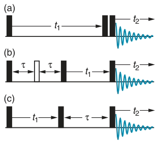

Sequence (a) is DQF COSY, so we want single-quantum coherence to be present during t1, and double quantum to be present between the final two pulses. Sequence (b) is double-quantum spectroscopy: here we want single quantum during the spin echo, and double quantum during t1. Finally, (c) is NOESY, in which we want single quantum during t1, and z-magnetization during τ.

**Fig. 11.1** Three different pulse sequences, all of which consist of three 90◦ pulses: (a) is DQF COSY, (b) is double-quantum spectroscopy, and (c) is NOESY. All that is really different between these experiments is the type of coherence or magnetization we want to be present at each stage.

The spins in the sample have no way of knowing, nor come to that do they care, what we want from the pulse sequence. They will just evolve according to the sequence of pulses and delays, and coherences other than the ones we want will certainly be generated. The result will be confused two-dimensional spectra, rather than the clean results which were presented in Chapter 8. It is therefore essential that, at each point, we have some way of selecting the coherences we want and rejecting all the others.

There are two ways of achieving this selection. The first is phase cycling. In this method, we repeat the pulse sequence (for the same value of t1) several times over, each time shifting the phase of certain pulses in a predetermined way. The results from these separate experiments are then combined, probably using additional receiver phase shifts, in such a way that the signals arising from the wanted coherences add up, while those arising from unwanted coherences cancel. In this chapter, we will discover how to devise the sequence of phases, called phase cycles, that are needed to select particular coherences.

We have, in fact, already come across a simple form of phase cycling, which we called difference spectroscopy. For example, in the HMQC experiment described in section 8.8 on page 212, we saw that we were able to suppress unwanted signals by repeating the experiment twice, once with the phase of one of the pulses shifted by 180◦, and then subtracting the results. This difference experiment is essentially a two-step phase cycle. In this chapter we will develop longer phase cycles capable of greater discrimination than simple difference spectroscopy.

The second method for coherence selection is to use pulsed field gradients. During such a gradient the main magnetic field is deliberately made inhomogeneous for a short time. As a result, any coherences present dephase rapidly: this is exactly the same process as the inhomogeneous dephasing described in section 9.9 on page 300. However, it turns out that this dephasing can be reversed by applying a second field gradient, but – and this is the key part – by careful choice of the duration and position in the pulse sequence of the two gradients, we can make sure that only the required coherence is rephased. Later on in this chapter we will look in detail at exactly how these gradient pairs are designed.

Before getting into the details of how to construct phase cycles and gradient sequences, we will introduce the idea of coherence order and the coherence transfer pathway. These provide a convenient and unified framework for discussing both phase cycles and gradient sequences.

## 11.1 Coherence order

The idea of coherence order was introduced in section 7.12.1 on page 174, but this idea is so important for the present chapter that it is worth restating the key ideas once more. The coherence order, given the symbol p, is defined by what happens to an operator (or product of operators) when a z-rotation through an angle φ is applied. If, as a result of this rotation, the operator acquires a phase of (−p × φ), the operator is classed as having order p:

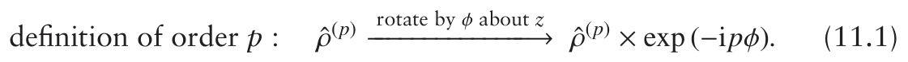

In Eq. 11.1, ˆρ(p) is an operator of order p.

The order can take both positive and negative integer values, including zero. An operator with p = ±1 is called single quantum, whereas one with p = ±2 is called double quantum, and so on. Operators with p = 0 are either zero quantum or z-magnetization.

Our usual product operators can be classified according to coherence order by expressing them in terms of the raising operator, Îi+, and the

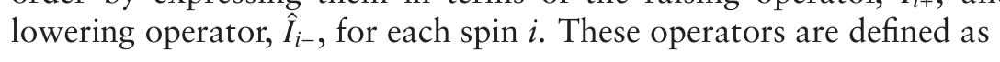

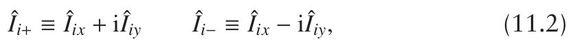

where Îix and Îiy are the usual x and y operators for spin i.

The operator Îi+ has coherence order p = +1, something we can easily demonstrate by seeing how it is affected by a z-rotation:

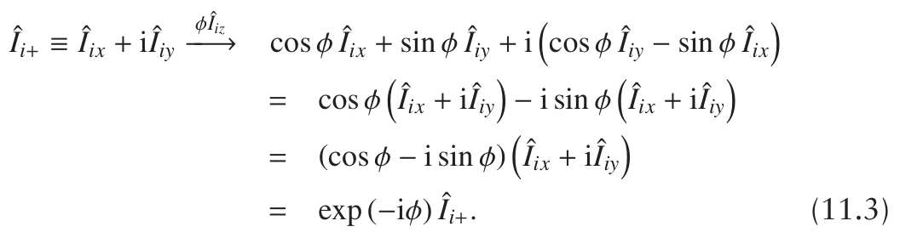

This shows that under a z-rotation Îi+ acquires a phase of (−φ). Therefore, from Eq. 11.1 on the preceding page, the operator must have coherence order +1. Using a similar approach we can show that Îi− has coherence order −1. The operator Îiz is unaffected by a z-rotation, and so has p = 0.

The definitions of the raising and lowering operators given in Eq. 11.2 on the facing page, can be turned round so as to express Îix and Îiy in terms

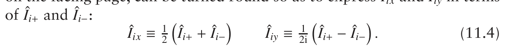

From these we see that both Îix and Îiy are equal mixtures of coherence

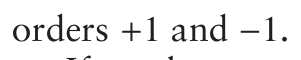

If we have a product operator, then each operator can be classified according to coherence order, and in addition we can define an overall order, which is the sum of the individual coherence orders. For example the operator 2Î1x Î2z can be expanded as

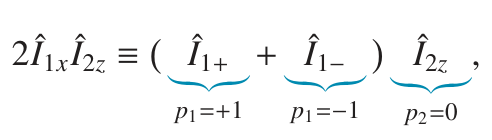

from which we have p1 = +1 or −1, and p2 = 0. The overall order, (p1 + p2),

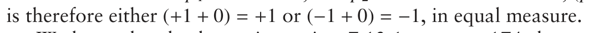

We have already shown in section 7.12.1 on page 174 that products

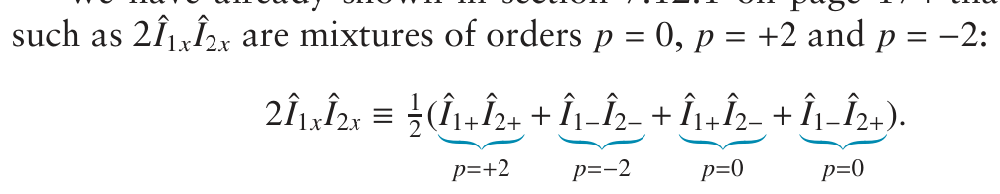

Note that the operator contains an equal mixture of p = +2 and p = −2 terms.

### 11.1.1 Possible values of the overall coherence order

For any one spin the maximum coherence order is +1, so in a spin system composed of N spins the maximum overall coherence order that can be present is +N. For example, in a three-spin system the maximum coherence order is +3, such as would be represented by the operator product Î1+ Î2+ Î3+; this is triple-quantum coherence.

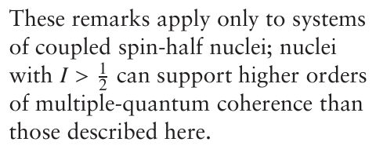

In the same way, the most negative value of the overall coherence order is −N, which would be achieved by having all of the operators in the product of the type Îi−. Overall a system of N spins can give rise to

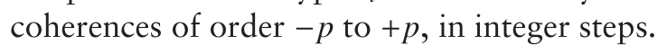

We should just note here that in order to generate triple-quantum coherence one spin has to be coupled to two others, and to generate quadruple-quantum coherence, one spin needs to be coupled to three others. The generation of higher and higher orders of coherence therefore becomes increasingly unlikely as it requires the presence of more and more couplings to a single spin.

### 11.1.2 Evolution of operators of particular coherence orders

Under the influence of the offset term we know that an operator such as Îix evolves into Îiy according to

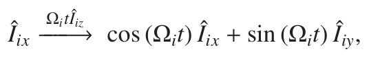

where Ωi is the offset of spin i. Evolution under the offset is just a z-rotation through an angle (Ωit), so from Eq. 11.3 on the preceding page, we can see

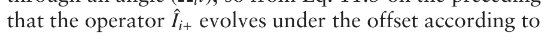

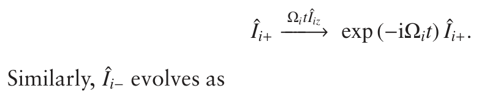

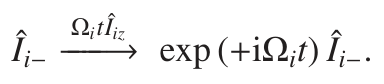

From these it follows that a product such as Î1+ Î2−, which has p = 0, evolves according to

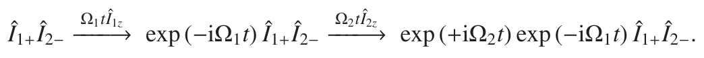

The overall result is

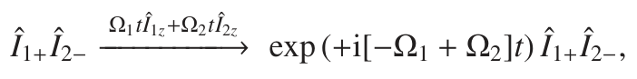

from which we recognize [−Ω1 + Ω2] as the zero-quantum frequency.

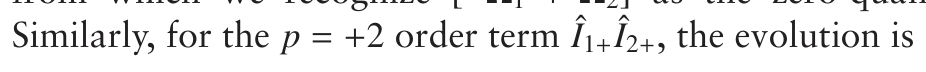

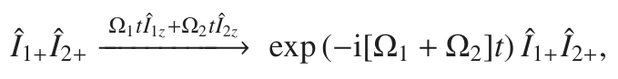

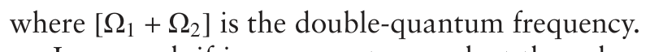

In general, if in an operator product the coherence order of spin one is p1, and that of spin two is p2, the product will evolve over time according

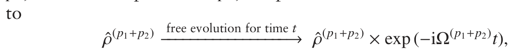

where

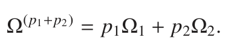

If scalar coupling is taken into account the evolution becomes more complex, but for the present purposes we can ignore evolution of the coupling as it does not lead to a change in the coherence order, and so does not affect the process of coherence selection.

### 11.1.3 The effect of pulses

In principle, an RF pulse will cause any coherences present to be transferred to all possible coherence orders: there are no selection rules as to which transfers are allowed. However, at the detailed level, we know that whether or not a pulse will actually generate a certain coherence depends on the presence or otherwise of anti-phase states. For example, Î1x has coherence order ±1, but a 90◦ pulse will not transfer this state to double quantum. On the other hand, 2Î1x Î2z, which is also p = ±1, will be transferred into double- and zero-quantum coherence by a 90◦(x) pulse.

A special case which will be of some interest to us is that a pulse applied to equilibrium magnetization, such as Î1z (coherence order zero), can only generate coherence orders ±1. This is immediately clear as we know that a pulse can only generate Î1x or Î1y from Î1z. It is not possible to generate multiple quantum directly from the equilibrium z-magnetization.

In some cases, the amount of a particular coherence order which is generated by transfer from another order depends on the flip angle of the pulse. Such effects turn out to be important in two-dimensional spectroscopy, so we will investigate them here.

Let us start with Îiz, p = 0, and consider the effect of applying a pulse of flip angle θ about the x-axis:

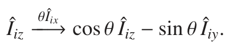

The operator Îiy can be rewritten in terms of Îi+ and Îi− using Eq. 11.4 on page 383 to give

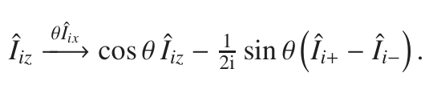

This equation tells us that, when applied to Îiz, a pulse of any flip angle generates equal amounts of coherence orders ±1.

If we apply a pulse to Îi+ the situation is a little more complex. Writing Îi+ as Îix + iÎiy allows us to work out the effect of the pulse in the usual way:

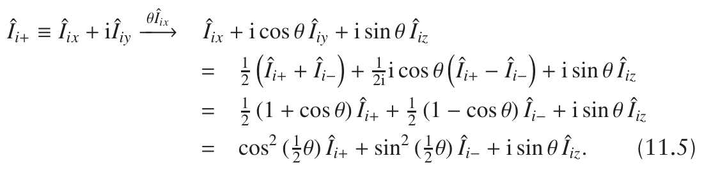

In this calculation, to go to the second line we have used the identities of Eq. 11.4 on page 383, and to go to the last line we have used the identities

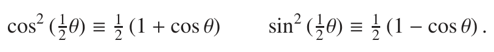

Using a similar approach we can show that

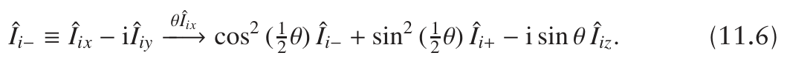

What Eqs 11.5 and 11.6 tell us is that the amount of transfer from Îi+ to Îi− (and vice versa) depends on the flip angle of the pulse. For the special

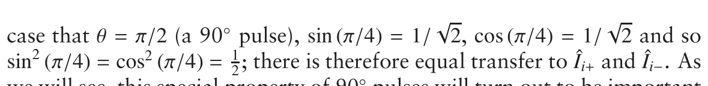

we will see, this special property of 90◦ pulses will turn out to be important in two-dimensional spectroscopy.

### 180◦ pulses

The effect of 180◦ pulses is rather simple, as in Eqs 11.5 and 11.6 for the

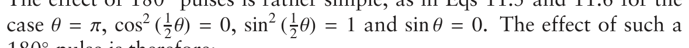

180◦ pulse is therefore:

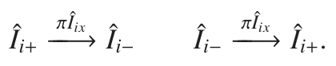

We see that all a 180◦ pulse does is to reverse the sign of the coherence order.

An operator product with an overall order of +2 is thus changed to −2 by a 180◦ pulse:

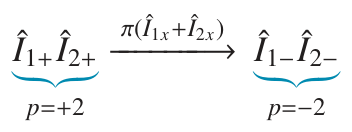

### 11.1.4 Observables

In an NMR experiment, it is the x- and y-magnetizations which we ulti-mately observe, and these magnetizations are represented by the operators Îix and Îiy. As we have seen, these operators both have coherence orders +1 and −1, so it is clear that p = ±1 are the only observable coherences. This is hardly a surprise, as we are used to the idea that we can only observe single-quantum coherence.

In section 5.2 on page 82 we saw that the usual procedure is to combine the observed signals from the x- and y-magnetizations into a complex time-domain signal, S (t):

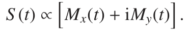

Constructing the observable signal S (t) in this way can be shown to be

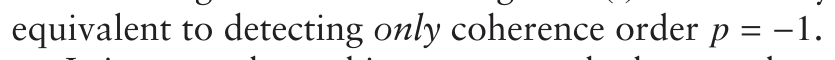

It is somewhat arbitrary as to whether we detect p = −1 or p = +1. However, if a complex signal S (t) is constructed in the way described, it is definite that only one out of p = ±1 is observed. We will assume that it is

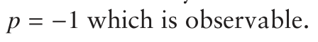

### 11.1.5 Summary

Coherence order is a key concept in this chapter, so let us summarize its properties.

- Coherence order, p, is defined by the response of an operator to a

rotation about the z-axis. An operator of order p acquires a phase of

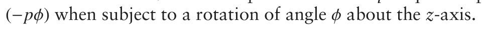

- The operators Îiz, Îi+ and Îi− have coherence orders 0, +1 and −1, re-

spectively. The overall coherence order of a product of operators can

be found by adding together the coherence orders of each operator in the product.

- The following identities are useful in assigning coherence orders:

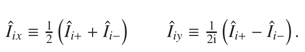

- For a system of N coupled spins one-half, the coherence order can

take all values between −N and +N, in integer steps, including zero.

- Under free evolution, an operator (or product of operators) sim-

ply acquires a phase factor exp (−iΩ(p1+p2+...)t), where the frequency

Ω(p1+p2+...) is determined by the offsets and coherence orders of the

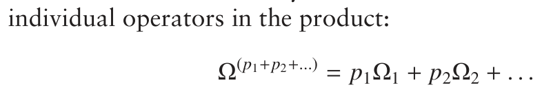

- A pulse applied to equilibrium magnetization generates equal

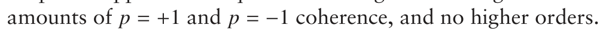

- A 90◦ pulse has the special property of causing equal amounts of

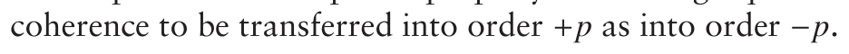

- A 180◦ pulse simply reverses the sign of the coherence order.

- Only coherence order −1 is observable.

## 11.2 Coherence transfer pathways

A convenient way of describing which coherences are desired at each stage in a pulse sequence is to draw a coherence transfer pathway (CTP) underneath the pulse sequence. Several examples of such pathways are shown in Fig. 11.2 on the following page.

The thick blue line in the CTP shows the coherence order, or orders, which we want to be present at each point in the sequence, and the transfers between these orders caused by the pulses. Note that during a delay the order remains constant, but that a pulse causes the orders to change. It is important to realize that the specified CTP is the one which we want to contribute to the spectrum. There will be many other pathways, not shown, which will also contribute. By using phase cycling or gradient pulses it is our task to select the required CTP and reject all others.

Sequence (a) is for DQF COSY. We start with coherence order p = 0, corresponding to equilibrium z-magnetization, from which the first 90◦ pulse generates p = ±1. Recall that this 90◦ pulse creates equal amounts of p = +1 and p = −1, and for reasons which will be discussed below it is

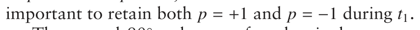

The second 90◦ pulse transfers the single quantum into double quantum, p = ±2. Note that we have allowed for all possible transfers by this

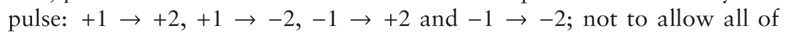

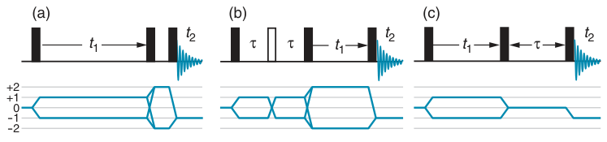

**Fig. 11.2** Three pulse sequences with their corresponding coherence transfer path- ways shown underneath. The grey ‘tram lines’ show the possible coherence orders, p, that can be present, which in this case we have restricted to the range −2 to +2, shown on the left. The thick blue line shows the desired order, or orders, of coherence present at each point in the sequence. During the delays the coherence order remains constant; in contrast, pulses cause a change in coherence order. The sequences are: (a) DQF COSY, (b) double-quantum spectroscopy, and (c) NOESY.

these transfers would result in a loss of signal. Finally, the third 90◦ pulse transfers p = ±2 to p = −1. Since only p = −1 is observable, we need only concern ourselves with the pathway that ends up with this order.

Sequence (b) is for double-quantum spectroscopy. Again, we start with p = 0, and the first pulse generates p = ±1. The 180◦ pulse just swaps the sign of the coherence order, so +1 →−1 and −1 → +1. The second 90◦ pulse generates double quantum and, as for DQF COSY, we allow all possible transfers between ±1 and ±2. As the pulse is 90◦, equal amounts of p = +2 and p = −2 will be generated. The final pulse transfers the double

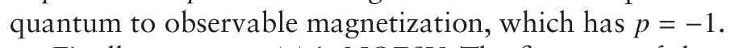

Finally, sequence (c) is NOESY. The first part of the sequence is as for DQF COSY, but this time the second 90◦ pulse is required to generate z-magnetization, which has p = 0. After the mixing time τ, the final 90◦ pulse generates observable p = −1. We can see that these coherence transfer pathways are convenient ways of expressing the desired outcome of an experiment.

### 11.2.1 Coherence transfer pathways in heteronuclear

### experiments

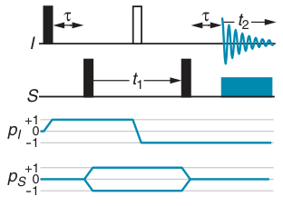

In heteronuclear experiments it is sometimes convenient to write a separate coherence transfer pathway for each type of nucleus. As an example, Fig. 11.3 shows the pulse sequence and separate CTPs for the HMQC experiment. The coherence order for the I spin (typically proton) is given by the pathway labelled pI, and that for the S spin (the heteronucleus) is given by the pathway labelled pS .

There are several things to note about these pathways. The first is that the coherence order of the I spin only changes when pulses are applied to that spin: pulses to the S spin have no effect on the coherence order pI. Secondly, as we observe the I-spin magnetization in this experiment, the CTP for this spin must end up at pI = −1. In addition, the CTP for the S spin must end up at pS = 0, so that the overall order, (pI + pS ), is −1. If pS were not zero, then we would have a state of heteronuclear multiple-quantum coherence, which is not observable.

**Fig. 11.3** Pulse sequence and coherence transfer pathways for the HMQC experiment. Note that separate coherence orders, pI and pS , are specified for the I and S spins, respectively.

After the first pulse to the S spin, we have pI = +1 and pS = ±1; the overall order is therefore 0 or 2, which corresponds to heteronuclear double- and zero-quantum coherence. The 180◦ pulse to I simply inverts the sign of pI, which in this case is equivalent to interchanging the double-and zero-quantum coherence. Note that the pI = −1 coherence generated by the first pulse will be switched to pI = +1 by the 180◦ pulse, and so will not be observable – this is why this pathway is not shown. The final 90◦ pulse to S transfers pS = ±1 to ps = 0, thus making the signal observable on the I spin.

Before we get down to the nitty-gritty of how these desired pathways are selected we need to explore the important topic of how a CTP is related to frequency discrimination and lineshape in two-dimensional spectra.

## 11.3 Frequency discrimination and lineshapes

This topic has been discussed before in section 8.12 on page 226, but we now need to revisit the topic in order to see how it is related to CTPs. It is helpful first to summarize the key results from section 8.12:

- Most two-dimensional experiments generate time-domain functions

which are cosine or sine modulated as a function of t1 i.e. data of the

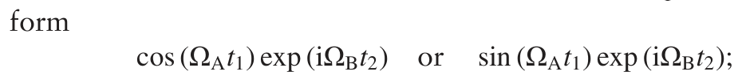

such data sets are said to be amplitude modulated in t1. Fourier trans-

formation of such data gives spectra which lack frequency discrimi-

nation in the ω1 dimension, i.e. peaks at ±ΩA are not distinguished, which leads to confusion in the spectrum.

- It is usually possible, by simple modifications to the pulse sequence,

to record both a cosine and a sine modulated data set in separate experiments.

- The cosine and sine modulated data sets can be combined to give a phase modulated signal of the form

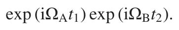

Such a signal gives a spectrum with frequency discrimination in the

ω1 dimension, but which has the unfavourable phase-twist lineshape.

- If cosine and sine modulated data sets are available, it is possible to

process the data in such a way as to obtain both frequency discrimi-

nation and absorption mode lineshapes (i.e. avoiding the phase-twist lineshape).

The way in which these important ideas are related to CTPs is best illustrated by the example of a simple COSY spectrum. The COSY pulse sequence, along with three different CTPs, is shown in Fig. 11.4 on the next page. All pathways start with p = 0, and end with the p = −1, which is the observable coherence order. The difference between the pathways is in the coherence order(s) present during t1: in (a) p = +1 is present, in (b)

p = −1 is present, and in (c) both p = +1 and p = −1 are present. As we shall see, these differences have a large influence on the detailed form of the spectrum.

Let us first consider CTP (a). From the discussion in section 11.1.2 on page 384, we know that the evolution of the p = +1 coherence during t1 results in the signal acquiring a phase exp (−iΩAt1), where ΩA is the modulating frequency in t1.

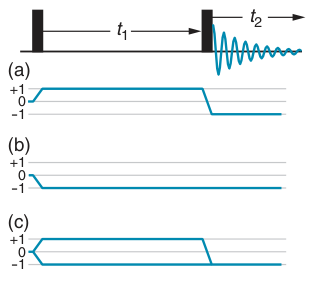

The final pulse transfers the coherence to order −1, and then evolution during t2 gives a signal of the form exp (+iΩBt2); we have written the frequency in t2 as ΩB, to allow for the possibility that it might be different to that in t1. The really important point here is that the sense of the modulation in t1 and t2 is opposite, on account of the change in the sign of the coherence order between t1 and t2.

The overall form of the two-dimensional time-domain signal will therefore be

**Fig. 11.4** The COSY pulse sequence, with three possible coherence transfer pathways. Pathway (a) gives the N-type or echo spectrum, (b) gives the P-type or anti-echo spectrum, and (c) gives amplitude modulated data.

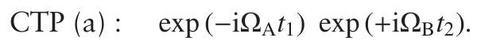

This signal is phase modulated in t1, and so the spectrum will be sensitive to the sign of ΩA i.e. the spectrum will be frequency discriminated. From the discussion in section 8.12.2 on page 228, we can deduce that Fourier transformation of this time-domain signal will give rise to a peak at {ω1, ω2} = {−ΩA, ΩB}, and that this peak will have the phase-twist lineshape.

For CTP (b) all that is different from (a) is that the coherence order present during t1 is −1 rather than +1. This simply alters the sense of the phase modulation in t1, so that the overall two-dimensional signal is of the form:

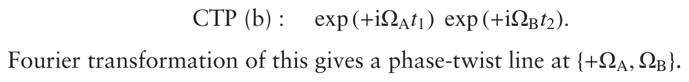

### 11.3.1 N- and P-type spectra

CTP (a) gives rise to what is called the N-type or echo spectrum. The N stands for ‘negative’, which comes from the observation that the coherence order in t1 is of opposite sign to that in t2. The term ‘echo’ comes from the fact that the final 90◦ pulse causes a change in coherence order from +p to −p. This is the same effect as a 180◦ pulse, which is associated with the formation of a spin echo.

CTP (b) gives rise to the P-type or anti-echo spectrum. The P stands for ‘positive’, the name coming from the fact that the coherence order in t1 and in t2 have the same sign. The term ‘anti-echo’ indicates that, with no change of the sign of the coherence order, an echo will not be formed.

### 11.3.2 Amplitude modulated spectra

We now turn to CTP (c) of Fig. 11.4. Here, both p = +1 and p = −1 are present during t1, so the modulation in this dimension is the sum of two phase modulations

where we have assumed that p = +1 and p = −1 contribute equally. Of course, the sum of these two is just 2 cos (ΩAt1), so the overall two-dimensional time-domain function is of the form

This signal is amplitude modulated in t1, and so, as described in section 8.12 on page 226, the result will be a spectrum which lacks frequency discrimination.

However, assuming that we have access to the sine modulated data (which we usually do), the cosine and sine modulated data sets can be combined in such a way as to give frequency discrimination and at the same time retain absorption mode lineshapes. How this is done is described in section 8.12.3 on page 230 and in the following section 8.12.4 on page 231.

The important point here is that in order for the signals from the p = +1 and p = −1 pathways to combine to give cosine (or sine) modulation in t1, the two pathways must have the same overall amplitude.

### 11.3.3 Summary

In summary, we have shown that if one coherence of order either +p or −p is present during t1, the resulting spectrum will be frequency discriminated, but will have the unfavourable phase-twist lineshape.

If coherence of both orders +p and −p is present during t1, and if the two contribute equally, the resulting data will be amplitude modulated. As a result the spectrum will lack frequency discrimination. However, assuming that both cosine and sine modulated data sets can be recorded, it is possible to process the data in such a way as to achieve frequency discrimination and retain absorption mode lineshapes.

Selecting a CTP in which both orders +p and −p are present and contribute equally during t1 is referred to as selecting symmetrical pathways. You will note that all of the pathways shown in Fig. 11.2 on page 388 have this property, and so all the spectra can be processed to give frequency discriminated spectra with absorption mode lineshapes.

## 11.4 The receiver phase

The ability to change the phase of our RF pulses is very important in multiple-pulse NMR experiments, and is of course crucial in the whole process of phase cycling. There is a further phase which is under our control in an NMR spectrometer, the receiver phase, and this too plays a vital part in the implementation of phase cycles.

In section 5.2 on page 82 we saw that the spectrometer is capable of making simultaneous measurements of the x- and y-components of the magnetization, and that the resulting detected signals are used to form the real and imaginary parts of a complex time-domain signal. To avoid the confusion of having too many x’s and y’s, we will call the outputs of these two detectors A and B, rather than referring to them as the x and y detectors.

**Fig. 11.5** Vector diagrams showing the result of a pulse–acquire experiment for different phases of the pulse. The position of the vector, which has offset Ω, is shown after free precession for time t, such that it has rotated through an angle (Ωt). The phase of the pulse is shown beneath each vector diagram. The magnetization along the x-axis gives rise to the detected signal A, and the magnetization along the y-axis gives rise to the signal B. Beneath each vector diagram is shown the real part of the spectrum which would result from Fourier transformation of the time-domain signal (A + iB). Note how the phase of the line in the spectrum changes in response to the phase of the pulse.

Imagine a simple pulse–acquire experiment, in which the phase of the pulse is y, and where we have one line in the spectrum with offset Ω. The pulse rotates the magnetization onto the x-axis, and then free precession for time t results in the vector rotating through an angle (Ωt) towards the y-axis. The situation is depicted in Fig. 11.5 (a).

If for simplicity we assume that the equilibrium magnetization is of size

The detected signal A is thus cos (Ωt), and B is sin (Ωt). If we construct the

Assuming the usual damping of this signal due to relaxation, Fourier transformation of this function will give rise to a spectrum in which the real part has an absorption mode line at frequency Ω. This is shown in the diagram, beneath the vector picture.

Now suppose that we shift the phase of the pulse from y to −x: the result is shown in Fig. 11.5 (b). It is now evident that the detected signal A

we computed before, is now

The factor exp (i π/2) is a phase shift by (π/2), and so the real part of the spectrum arising from this signal will show the dispersion mode lineshape (see section 5.3.2 on page 85); this is shown in the diagram. Not surprisingly, the phase of the line in the spectrum has been changed as a result of shifting the phase of the pulse.

However, we do not have to form the time domain from the combination (A+iB), but can choose any combination we like. Suppose that for the case of the 90◦(−x) pulse, (b) in the figure, we form the time-domain signal

Now we have exactly the same time-domain signal as we did for the 90◦(y) pulse, and so will obtain an absorption mode lineshape in the real part of the spectrum.

In a similar way we can find a combination of signals A and B arising from the experiment with a 90◦(−y) pulse, and with a 90◦(x) pulse, which will give an absorption mode lineshape in the real part of the spectrum. All four combinations are summarized in the following table (the labels in the first column refer to the parts of Fig. 11.5 on the facing page):

What we are seeing here is that, although changing the phase of the pulse changes the detected signals A and B, we can always find a combination of these signals which, after Fourier transformation, will give us an absorption mode spectrum. Changing the combinations in this way is usually described as changing the phase of the receiver.

The four combinations of A and B listed in the table are related to one another simply by multiplying the entry on the previous row by −i. For example, to go from the second to the third row we would simply compute:

Given that exp (−i π/2) = −i, multiplying by −i is the same thing as applying a phase shift of (−π/2). Thus, the combinations of A and B in the table can be regarded as arising from a shift in the phase of the receiver by (−π/2) each time we move from one row to the next. The total receiver phase shift, relative to that in the first experiment, is also shown in the table under the column headed ‘rx phase’. Arbitrarily, we will assign a receiver phase of zero to the combination A + iB; such a phase can also be described as ‘having the receiver along x’.

**Fig. 11.6** Illustration of how both the phase of the pulse and of the receiver affects the lineshape in the spectrum; the black dot • indicates the phase of the receiver. The vector diagrams in (a) are the same as those in Fig. 11.5 on page 392. Since the receiver phase is fixed the four spectra have different lineshapes. In (b) the pulses go through the same phases as in (a), but this time the receiver phase is shifted by −90◦ each time the phase of the pulse advances (receiver phase shifts are measured clockwise from the x-axis). Consequently the magnetization is in a fixed position relative to the receiver phase and as a result each spectrum has the same lineshape.

If we record four separate pulse–acquire experiments in which the phase of the pulse goes through the sequence [y, −x, −y, x], each will give a different lineshape, as shown in Fig. 11.5 on page 392. Adding up the results of these four experiments will result in complete cancellation, as the lines for pulse phases y and −y, and for phases −x and x, are equal and opposite.

However, if the receiver phase goes through the sequence of phases [0, −π/2, −π, −3π/2] in the four experiments, each will give the absorption mode lineshape, and so the spectra from all four experiments will add up. Figure 11.6 illustrates this idea. In (a) the phase of the receiver, indicated by the black dot •, remains fixed, so changing the phase of the pulse changes the phase of the spectrum. In (b), the receiver changes phase by −90◦ each time the pulse phase changes. As a result, the angle between the axis denoted by the black dot and the magnetization is fixed, and so the four spectra all have the same lineshape. We say that in (b) the receiver phase follows the phase shift of the magnetization, which in turn comes from the phase shift of the pulse.

It is rather inconvenient that, for the receiver phase to follow the magnetization, when the pulse phase advances in the sequence [y, −x, −y, x], we have to move the receiver phase in the opposite direction through the sequence of phases [0, −π/2, −π, −3π/2]. To get round this, the spectrometer software is configured so that requesting the receiver phases [0, π/2, π, 3π/2] will result in the signals adding up when the pulse goes through the sequence [y, −x, −y, x]. In other words, the software sorts out the minus sign for us.

### 11.4.1 Specifying the receiver phase

We can specify the receiver phase in any way we like, either in radians – as we have been doing up to now – or in degrees. So the sequence [0, π/2, π, 3π/2], can be written [0◦, 90◦, 180◦, 270◦]. Equally well, rather than specifying the angle we can specify the axis, so that the sequence of

The absolute receiver phase is not important, all that matters is by how much the phase advances in each step. Therefore in the pulse–acquire experiment we have been discussing, the sequence of receiver phases can just as well be [−x, −y, x, y] or [y, −x, −y, x] or [270◦, 0◦, 90◦, 180◦]. The absolute phase will affect the lineshape, but we can always adjust it to what we want by phasing the spectrum.

### 11.4.2 The take-home message

The key point to take away from this section is that if the signal generated by the pulse sequence acquires a phase shift, we can compensate for this by shifting the receiver phase by the same amount. If we do this, the signal will add up: this is a crucial part of how phase cycling works.

## 11.5 Introducing phase cycling

Coherence selection by phase cycling relies on the following property in relation to the general pathway illustrated in Fig. 11.7 (a):

**Fig. 11.7** Two examples of a single coherence transfer step brought about by a pulse. In (a) the change is from coherence order p1 to order p2, such that the change in coherence order, Δp, is (p2 − p1). If the phase of the pulse is shifted by Δφ, the coherence following the pathway shown acquires a phase −Δp × Δφ. Pathway (b) is for the particular case of +2 →−1, which has Δp = −3, and is discussed in the text.

This property means that pathways with different Δp acquire different phase shifts: as a result it is possible for us to differentiate between pathways. In practice, the way we do this is to repeat the experiment several times, with different values of Δφ, and then combine the results in such a way that the signals which derive from the wanted pathway add up, whereas signals from all other pathways cancel.

It is important to realize that the phase which a coherence acquires as a result of following a particular pathway is carried forward with that coherence through the rest of the pulse sequence. So, if the coherence ends up contributing to the observed signal, then this signal will have the phase shift which the coherence acquired earlier in the sequence.

Our ability to alter the receiver phase is important in making sure that the wanted signals from different experiments add up. As we saw in section 11.4 on page 391, if we adjust the receiver phase so that it ‘follows’ the phase shifts of the signal, then these will add up. On the other hand, if the receiver phase does not follow that of the signal, the latter will cancel.

How this all works is best seen using an example, which will be the

### 11.5.1 Selection of a single pathway

In this section we will concentrate on devising a phase cycle which selects the pathway +2 →−1, which has Δp = −3. Imagine that we advance the phase of the pulse through the sequence x, y, −x, −y, or in degrees 0◦, 90◦, 180◦, 270◦. The phase shifts experienced by the pathway will be

The fourth column, headed ‘equiv(3 Δφ)’, is just the phase in the third column reduced to the range 0–360◦. The idea here is that a phase of φ + n × 360◦, where n is an integer, is equivalent in every way to a phase of φ. We can therefore add or subtract multiples of 360◦ from any phase until it is in the range 0–360◦ without any loss of information. For example 540◦ is the same as 180◦ since 540◦ − 360◦ = 180◦, and 810◦ is the same as 90◦ since 810◦ − 2 × 360◦ = 90◦. Reducing the phases in this way makes them a lot easier to comprehend.

What the table tells us is that as the phase of the pulse goes

If we want the signals in these four steps to add up, all we need to do is to make the receiver phase shift match that acquired by the Δp = −3 pathway on each step i.e. the sequence

Now that we have seen how to select a particular pathway, we need to check that other pathways are rejected, as this is ultimately what we are trying to achieve. Let us consider the pathway with Δp = −2, for which the phase shift experienced will be −(−2 × Δφ) = 2 Δφ; the table below gives the result for each step in the phase cycle:

**Fig. 11.8** Diagrammatic way of working out whether or not a particular set of receiver phase shifts will result in the selection or rejection of a particular pathway. The blue arrow indicates the phase shift acquired by the signal from a particular pathway as the pulse phase goes through the four steps [0◦, 90◦, 180◦, 270◦]. The phase of the receiver is shown by the black dot •, and both the receiver and signal phases are measured anti-clockwise from 3 o’clock. In (a) is shown the signal phases for Δp = −3, as given in the first table on page 396. The receiver phase goes [0◦, 270◦, 180◦, 90◦], so that the arrow and the black dot are always aligned: the signals from this pathway will therefore add up. In (b) the signal phases are for the pathway Δp = −2, as given in the second table on page 396, but the receiver phases are those used to select Δp = −3. Now the receiver phase no longer follows the phase of the signal, and in fact steps (1) and (3), and (2) and (4) cancel one another. The pathway with Δp = −2 is therefore rejected. It is important to realize that these are not vector diagrams in the NMR sense, but simply diagrammatic representations of various phase shifts.

The phase shifts given in the last column are, of course, different from those computed for the pathway Δp = −3. The question is, if we use the receiver phase shifts [0◦, 270◦, 180◦, 90◦] will the pathway with Δp = −2 cancel?

One way of determining this is shown in Fig. 11.8. In this figure, the blue vector represents the phase which the coherence has acquired as a result of shifting the phase of the pulse, and the phase of the receiver is indicated by the black dot. Both phases are measured anti-clockwise from 3 o’clock.

In (a) the arrows show the phases acquired by the pathway with Δp = −3 as the pulse is advanced through the four steps [0◦, 90◦, 180◦, 270◦] i.e. the phases from the final column in the first table on page 396. The receiver phases, indicated by the black dot, go through the sequence [0◦, 270◦, 180◦, 90◦], which is what we determined would result in the signals from the pathway with Δp = −3 adding up. It is clear from the diagram that, since the receiver phase follows the phase of the signal, the signals from all four steps will add up.

In Fig. 11.8 (b) we see the signal phases for the pathway with Δp = −2 (given in the second table on page 396), and the set of receiver phases which we determined would select Δp = −3. First, it is clear that the receiver is no longer following the signal phase. Secondly, we can see that step (1) will cancel with step (3), as the signal and the receiver are aligned in the first step, and 180◦ apart in the second. In addition, the signals from steps (2) and (4) will cancel, as in the first case the receiver is 90◦ ahead of the signal, whereas in the second it is 90◦ behind the signal i.e. an effective shift of 180◦.

Overall we find that if the pulse phase goes [0◦, 90◦, 180◦, 270◦], and the receiver phase goes [0◦, 270◦, 180◦, 90◦], the pathway with Δp = −3 is

We will do one more example, which is to consider the pathway with

This time the phases in the fourth column, headed ‘equiv(−Δφ)’, were obtained by adding 360◦ to the phases in the third column.

The phase shifts in the final column of the above table are identical to those in the first table on page 396, which were computed for the pathway Δp = −3. Therefore if we used the sequence of receiver phases [0◦, 270◦, 180◦, 90◦] the signals from both pathways will add up.

If we work through more values of Δp, we will find that this four-step

A convenient way of specifying this selectivity is to write out the possible values of Δp in a line, putting brackets around those which are rejected and emboldening those which are selected:

Note that the selected values of Δp differ by four, which is no coinci-dence as this is the number of steps in the phase cycle. We can understand how this comes about in the following way.

Suppose that we have a pathway with a particular value of Δp, and that we then shift the phase of the pulse by π2 (90◦). This pathway will therefore experience a phase shift of (−Δp × π2). Now consider a second pathway which has a change in coherence order of (Δp + 4). The effect of a π2 phase shift of the pulse on such a pathway is:

To go to the last line we have used the fact that a phase shift of 2π (360◦) has no effect. What we see here is that a pathway with (Δp + 4) experiences the same phase shift as one with Δp. Therefore, selecting one will automatically select the other.

Put more generally, this property of a phase cycle can be expressed as follows:

This lack of selectivity of a phase cycle might at first appear to be something of a drawback, but we will see that it turns out to be quite useful to be able to select more than one pathway at the same time.

### 11.5.2 Combining phase cycles

Suppose that we have a pulse sequence containing two pulses, and we want to select Δp = +1 for the first pulse, and Δp = −2 for the second, as shown in Fig. 11.9. For the first pulse the phase acquired by the pathway is −Δp × Δφ1 = −Δφ1. Using this we can construct a four-step cycle to select

**Fig. 11.9** A coherence transfer pathway involving two changes of coherence order, one with Δp = +1, and one with Δp = −2. The phase shifts of the two pulses are Δφ1 and Δφ2.

For the second pulse, the phase acquired by the pathway is −Δp × Δφ2 = 2 Δφ2. The table below gives the results for a four-step cycle:

To select both pathways, we need to complete both four-step phase cycles independently of one another. This means that as Δφ1 goes through the sequence [0◦, 90◦, 180◦, 270◦] and the receiver follows with [0◦, 270◦, 180◦, 90◦], the phase of the second pulse must be held constant.

Having completed these four steps, the phase of the second pulse can be shifted by 90◦, and this is then held constant as the first pulse is again shifted through [0◦, 90◦, 180◦, 270◦]. However, this time the phase shift of 180◦ which results from shifting the phase of the second pulse, must be added to phase shifts which come from shifting the first pulse.

**Table 11.1** Construction of the 16-step phase cycle needed to select the pathway shown in Fig. 11.9 on the preceding page.

The result of this is the following set of phases

Reducing these to the range 0–360◦ gives [180◦, 90◦, 0◦, 270◦].

In the next four steps, the phase of the second pulse is shifted to 180◦, and once again the first pulse is cycled through the four phases. Shifting the second pulse by 180◦ results in no shift in the phase of the signal, so for these four steps the total phase is [0◦, 270◦, 180◦, 90◦], just as it was for the first four steps.

Finally, the second pulse is shifted to 270◦, which results in a phase shift of 180◦, so the total phase for the last four steps is the same as for the second four: [180◦, 90◦, 0◦, 270◦]. Table 11.1 summarizes all of this for the 16 steps of the cycle.

In the table, the column headed ‘total phase’ is the phase acquired as a result of shifting both of the pulses. It is found by adding together the phases equiv(−Δφ1) and equiv(2 Δφ2), and reducing the result to the range 0–360◦ in the usual way. To select these two pathways, the receiver phase would need to match the phases given in the right-hand column.

If we wanted to select three separate values of Δp, this would require 43 = 64 independent steps: clearly, we want to avoid this if we can, as the experiment will become rather long. The next section explains how we can judiciously minimize the length of our phase cycles.

## 11.6 Some phase cycling ‘tricks’

We need to be intelligent about how we go about applying phase cycling otherwise we will end up with absurdly long phase cycles which will be quite impractical. This section is about some ‘tricks’ which we can use in order to minimize the number of pulses which we need to cycle, and hence minimize the length of the phase cycle.

### 11.6.1 The first pulse

We noted in section 11.1.3 on page 385 that a pulse applied to equilibrium magnetization can only generate coherence orders ±1. Often, this is exactly what we want – for example, it is a common feature of all the coherence transfer pathways in Fig. 11.2 on page 388. If this is the case, then there is no need to apply a phase cycle to the first pulse at all.

### 11.6.2 Grouping pulses together

In the previous section we described how a phase cycle can be constructed to select a particular value of Δp caused by a pulse. However, exactly the same considerations apply to the overall transformation brought about by a group of pulses: all that we have to do is to shift the phases of all the pulses at the same time. Any delays present between the pulses are not important, as the coherence order does not change during such periods.

A good example of the application of this idea is in the sequence used to generate double-quantum coherence, shown in Fig. 11.10. This sequence takes equilibrium magnetization, p = 0, and transforms part of it into double-quantum coherence which has p = ±2. The overall transformation

A four-step cycle in which all three pulses move through the steps [0◦, 90◦, 180◦, 270◦] and the receiver phase goes [0◦, 180◦, 0◦, 180◦] will select Δp = +2. In addition, since the cycle has four steps, we can deduce that it will also select Δp = −2, as this differs from Δp = +2 by four. Therefore the four-step cycle of the group of three pulses selects the

**Fig. 11.10** This three-pulse sequence can be used to generate double quantum, with p = ±2. The overall transformation caused by the group of three pulses is Δp = ±2, and they can be phase cycled together (as a unit) to select this change.

We do have to be cautious about one thing here. Just because we select Δp = ±2 overall, it does not mean that the detailed CTP drawn in Fig. 11.10 is selected. In fact, all coherence orders present during the spin echo will be

In reality things are not as bad as they might seem. First, the initial pulse can only generate p = ±1, and secondly, the 180◦ pulse can only change the sign of the coherence order.1 The pathways drawn during the spin echo are therefore the only possible ones, so we do in fact obtain the pathways specified.

1If the 180◦ pulse is imperfect then other changes may occur; see section 11.6.5 on the next page.

### 11.6.3 The final pulse

The role of the final 90◦ pulse in the sequence is usually to generate observable coherence, p = −1, from whatever coherence orders are present just prior to this pulse. This is the case for all three sequences shown in Fig. 11.2 on page 388.

Suppose that, by appropriate phase cycling, we have already selected the coherence order(s) we want to be present just before this last pulse. If this is the case, then there is no need to select any particular pathway on the last pulse, as the only possible pathway is from the already selected coherence orders to p = −1. Pathways which end up with other orders of coherence are simply not observable, and so we do not need to worry about them.

### 11.6.4 High-order multiple-quantum terms

Look again at the sequence shown in Fig. 11.10 on the previous page which is used to generate p = ±2. If we select this pathway with a four-step cycle, we will also select Δp = ±6 i.e. the generation of sextuple-quantum coherence.

However, in practice we need not worry about this, as in order to generate such a coherence we would need to have one spin with a significant coupling to five others. This is just so unlikely in any real sample that we can discount it occurring.

Generally speaking, in devising phase cycles we do not need to consider the generation of high orders of multiple-quantum coherence. It is probably safe to assume that triple quantum is the highest order that is likely to be generated in any significant quantities unless we have some very exotic spin system.

### 11.6.5 Refocusing pulses

It was noted in section 11.1.3 on page 385 that a 180◦ pulse simply causes the coherence order to change sign. In fact we can say that the refocusing property which such a pulse has comes about because it causes such a change in the coherence order. A coherence of order p present before the 180◦ pulse acquires a phase (−Ω(p)τ1) as a result of evolution for time τ1. After the pulse, the coherence has order −p and so acquires a phase (−Ω(−p)τ2) as a result of evolution from time τ2. However, since

**Fig. 11.11** A 180◦ pulse simply causes a change in the sign of the coherence order, here p = ±1 goes to p = ∓1; the required pathways are therefore Δp = ±2. These pathways can be selected with a four-step phase cycle in which the pulse goes [0◦, 90◦, 180◦, 270◦] and the receiver phase goes [0◦, 180◦, 0◦, 180◦]. This is know as EXORCYCLE.

two phases are equal and opposite, and so cancel one another out: this is the formation of an echo.

Although a 180◦ pulse simply changes the sign of the coherence order, if the pulse is in anyway imperfect – for example by being mis-calibrated so that it is not really a 180◦ pulse – then additional coherence transfers will be caused. These unwanted transfers can be suppressed using an appropriate phase cycle.

For example, if the 180◦ pulse is being used to refocus single-quantum coherence, the desired pathways from p = +1 → p = −1 and p = −1 → p = +1 have Δp = ±2, as shown in Fig. 11.11. The four-step phase cycle in which the pulse goes [0◦, 90◦, 180◦, 270◦] and the receiver phase goes [0◦, 180◦, 0◦, 180◦] selects both of these pathways. This phase cycle was one of the first to be used in multiple-pulse NMR, and is often called EXORCYCLE.

## 11.7 Axial peak suppression

In a two-dimensional experiment, our expectation is that it will be the equilibrium magnetization present before the first pulse which leads to the coherence present during t1, and then finally to the observed signals during t2. However, all through the pulse sequence the magnetization or coherences present are decaying due to relaxation, thus leading to the regeneration of z-magnetization. As this z-magnetization has been generated by relaxation (an essentially random process), it is not phase labelled i.e. it is not modulated by the evolution during t1.

If this recovered z-magnetization is made observable by subsequent pulses in the sequence, it will give rise to peaks in the two-dimensional spectrum. However, as the magnetization is not modulated as a function of t1, the peaks will appear at ω1 = 0 (their frequencies in ω2 are just those of the usual spectrum). These peaks are usually called axial peaks on account of them lying on the ω1 = 0 axis. In section 9.7.4 on page 281 we came across a specific example of how such peaks arise in the NOESY experiment.

Axial peaks are easily suppressed by difference spectroscopy. All we do is repeat the experiment with the phase of the first pulse changed by 180◦. This changes the sign of all of the wanted peaks, but leaves the axial peaks unaffected. Subtracting the signals from the two experiments will therefore cancel the axial peaks, but the wanted peaks will add up.

A convenient way of subtracting the results from the two experiments is simply to shift the phase of the receiver by 180◦, in which case we have a two-step phase cycle:

axial peak suppression

Generally speaking it is convenient to include axial peak suppression as part of the phase cycling process which we are inevitably going to be using for coherence pathway selection.

## 11.8 CYCLOPS

As has been described previously, the spectrometer has detectors which measure both the x- and y-components of the magnetization, and we use the output of these detectors to construct a complex time-domain signal. Due to imperfections in the RF electronics in the spectrometer, the output of these two detectors may not correspond exactly to the x- and y-magnetizations, and this can lead to unwanted peaks in the spectrum.

Three kinds of imperfection have been identified. The first is where, rather than the output of the detectors corresponding to the x- and y-components of the magnetization, the detectors measure two components which are not quite at 90◦ to one another. Such an imperfection leads to the appearance of a small peak at minus the frequency of the real peak i.e. the peaks are symmetrically placed with respect to the centre of the spectrum,

The second kind of imperfection is where the two detectors are not quite balanced, in the sense that the same amount of magnetization gives rise to a different output from the two detectors. This imperfection, like the first, gives rise to quadrature artifacts.

The third kind of imperfection is when, in the absence of any transverse magnetization, the output of either of the detectors is not zero but rather has a small steady value. This is sometimes called a DC offset: the ‘DC’ stands for direct current, which implies a steady, rather than fluctuating, value. Such a steady contribution to the time-domain signal will lead, after Fourier transformation, to a peak at zero frequency. This peak is sometimes called the zero-frequency glitch or DC spike.

On modern spectrometers with carefully constructed and adjusted re-ceivers, the zero-frequency glitch and quadrature artifacts are likely to be reasonably small. Nevertheless, they can be inconvenient, especially if the spectrum has high dynamic range in which case the quadrature artifact from a large signal can obscure a genuine, weaker signal.

It turns out that, provided these artifacts are not too large, they can be suppressed in a simple pulse–acquire experiment using a four-step phase cycle, known as CYCLOPS:

In terms of CTPs, we recognize that this cycle selects the pathway Δp = −1, which is exactly that required in a pulse–acquire experiment, since the

In more complex pulse sequences, we can implement CYCLOPS by cycling the phases of all of the pulses together through the sequence [0◦, 90◦, 180◦, 270◦], with the receiver phase going [0◦, 90◦, 180◦, 270◦]. One way of thinking about this is that, taken together, the whole pulse sequence converts z-magnetization, p = 0, to observable magnetization, p = −1. This is a transfer with Δp = −1, which is the pathway selected by this cycle.

The problem with implementing CYCLOPS in more complex sequences is that it multiplies the length of the phase cycle by a factor of four, which may result in an unacceptably long cycle. However, it is sometimes the case that a phase cycle which is devised to select other pathways in the sequence turns out, almost as a by-product, to suppress quadrature artifacts and the zero frequency glitch. Clearly this is a desirable outcome.

## 11.9 Examples of practical phase cycles

In this section we will give examples of typical phase cycles for some of the most commonly used two-dimensional experiments.

### 11.9.1 COSY

Figure 11.12 shows the COSY pulse sequence with three different CTPs. In (a) and (b) only one coherence order is retained in t1; as explained in section 11.3 on page 389, the resulting time-domain data will be phase modulated in t1. The corresponding spectra will therefore be frequency discriminated, but will have the unfavourable phase-twist lineshape. As -10 was discussed before, CTP (a) will give the N-type, and CTP (b) the P-type

To select CTP (a) all we have to do is select Δp = +1 for the first pulse. If we do this, we do not need to select any pathway on the last pulse as we

**Fig. 11.12** The COSY pulse sequence, together with three possible coherence transfer pathways: (a) gives the N-type spectrum, (b) gives the P-type spectrum and (c) retains symmetrical pathways in t1. The phases of the two pulses are denoted φ1 and φ2, and the phase of the receiver is denoted φrx.

During this phase cycle, the phase of the second pulse, φ2, is held constant.

Similarly, to select CTP (b) all we need to do is select Δp = −1 for the first pulse.

An alternative approach would be to keep the phase of the first pulse fixed and cycle the phase of the second pulse. For the N-type spectrum, this

For the P-type spectrum, CTP (b), we need to select Δp = 0 on the last pulse, for which a suitable cycle is

CTP (c) in Fig. 11.12 has symmetrical pathways in t1, and so will lead to amplitude modulation as a function of t1. Such data can be processed so as to obtain both frequency discrimination and absorption mode lineshapes.

The first pulse can only generate p = ±1, so we do not need to select this. As before, since the coherence orders we require in t1 have already been selected, there is no need to cycle the final pulse. Thus, this CTP is the only one possible in this two-pulse experiment, so no phase cycling is needed. If necessary, a two-step cycle of the first pulse and the receiver can be used to suppress axial peaks.

### 11.9.2 DQF COSY

The pulse sequence, and two possible CTPs, for DQF COSY are shown in Fig. 11.13 on the following page. CTP (a) retains symmetrical pathways in t1 and so can give an absorption mode spectrum; this pathway is also the simplest one to select.

The final pulse causes two transfers, one with Δp = −3, and one with Δp = +1. As these two required values of Δp differ by four, a

four-step phase cycle will select both of them at the same time, which is

During this cycle, the phases of φ1 and φ2 are kept constant.

As only p = −1 is observable, selecting Δp = −3 and Δp = +1 on the last pulse unambiguously selects p = ±2 in the period between the second and third pulses. Since the first pulse can only generate p = ±1, there is no need for any further selection.

An alternative approach to selecting CTP (a) is to group the first two pulses together, and then cycle them as a unit to select Δp = ±2. Such a cycle would be

**Fig. 11.13** The DQF COSY pulse sequence, together with two possible coherence transfer pathways: (a) retains symmetrical pathways in t1; (b) gives an N-type spectrum with frequency discrimination.

Having made the selection of p = ±2 between the second and third pulses, there is no need to cycle the last pulse as this can only generate the

Selecting CTP (b) from Fig. 11.13 needs a longer cycle. One way to approach this is to use the same four-step cycle as above to select Δp = −3

Then we need to select Δp = +1 on the first pulse, which will require the cycle

This is of course the same cycle as for the last pulse.

These two cycles need to be completed independently giving the following 16-step cycle:

### 11.9.3 Double-quantum spectroscopy

Figure 11.14 shows a pulse sequence for double-quantum spectroscopy, along with a CTP in which symmetrical pathways are retained in t1; this CTP is similar in many ways to that for DQF COSY. As we did before, we can select Δp = −3 and Δp = +1 for the final pulse using the four-step cycle:

**Fig. 11.14** Pulse sequence for double-quantum spectroscopy, together with a coherence transfer pathway in which symmetrical pathways are retained in t1.

If necessary, the 180◦ pulse (phase φ2) can be cycled to select Δp = ±2 according to the EXORCYCLE scheme. These two four-step cycles have to be completed independently, thus giving a 16-step cycle.

### 11.9.4 NOESY

The NOESY pulse sequence, along with a CTP which retains symmetrical pathways in t1, is shown in Fig. 11.15. The final pulse causes the transfor-

This selection ensures that p = 0 is present during the mixing time τ, and since the first pulse can only generate p = ±1, no further cycling is needed.

**Fig. 11.15** Pulse sequence for NOESY, together with a coherence transfer pathway in which symmetrical pathways are retained in t1.

As well as selecting Δp = −1 for the last pulse, this four-step cycle selects Δp = −5 and Δp = +3. The first of these would correspond to the transfer

means that, in addition to selecting the z-magnetization present during τ, the four-step cycle would also select p = ±4. As was commented on above, for just about all practical situations there will be negligible amounts of quadruple quantum generated, so we do not need to worry about such coherences interfering with the NOESY cross peaks.

As was explained in section 9.7.4 on page 281, in a NOESY experiment it is important to suppress the axial peaks, so we need to add a simple two-step cycle in which the first pulse goes [0◦, 180◦] and the receiver does the same. Combining this with the four-step cycle of the last pulse gives an overall eight-step cycle:

### 11.9.5 HMQC

The pulse sequence and CTP for HMQC is shown in Fig. 11.16. As was explained in section 8.8 on page 212, a simple difference experiment is used to suppress the signal from the I spins which are not coupled to S. This involves repeating the experiment with the phase of the first S spin 90◦ pulse first set to x, and then to −x. Subtracting the data from these two experiments cancels the unwanted signals from the I spins.

In terms of the CTP this S-spin pulse causes the transfer ΔpS = ±1, both pathways which can be selected by the two-step cycle:

Note that as this is a two-step cycle, it selects both ΔpS = +1 and ΔpS = −1 as the ΔpS values differ by two.

**Fig. 11.16** Pulse sequence for HMQC, together with a coherence transfer pathway which leads to amplitude modulation as a function of t1.

The 180◦ pulse to the I spins is required to cause the transformation ΔpI = −2, and this can be selected using the usual four-step EXORCYCLE. Overall, we therefore have an eight-step cycle:

## 11.10 Concluding remarks about phase cycling

We will close this discussion of phase cycling with a summary of the key ideas, and then go on to comment on the deficiencies of the method.

### 11.10.1 Summary

- Shifting the phase of a pulse by Δφ results in a pathway which has a

- A particular pathway can be selected by ensuring that, as the phase

of the pulse is advanced, the receiver is phase shifted by an amount equal to the phase shift experienced by the desired pathway.

- If a phase cycle of N steps selects a pathway with a particular value

of Δp, it will also select pathways with changes in coherence order

- Phase cycles designed to select particular values of Δp for different pulses must be completed independently.

- The length of phase cycles can be minimized by ‘intelligent design’,

such as taking advantage of: (a) grouping pulses together; (b) recog-

nizing that the first pulse can only generate p = ±1; (c) realizing that

not all of the pulses need to be cycled in order to select a particular pathway unambiguously.

### 11.10.2 Deficiencies of phase cycling

The are two major problems with phase cycling as a method of coherence selection. The first is that, in order for the selection to work, we have to complete all of the steps in the cycle. Even if the signal-to-noise ratio is sufficient on one scan, we have to carry on and repeat all of the four, eight, or however many steps there are in the phase cycle. As a result, the experiment can end up taking far longer than is strictly necessary.

This problem is especially acute in two-dimensional spectra where we have to perform a separate experiment for each t1 value. The need to complete a long phase cycle for each such value may limit the number of t1 increments which can be recorded in the time available, and hence the resolution in the ω1 dimension.

The second problem with phase cycling is that it relies on cancellation of the signals from unwanted pathways. For each step in the cycle, all possible pathways contribute to the observed signal. Then, as the signals from successive steps are combined, the unwanted signals will eventually be cancelled.

The problem is that the signals which are supposed to cancel one another are likely to have been recorded at times separated by many seconds, if not minutes. If anything has changed over this time, then the cancellation will not be perfect. The sorts of changes we are thinking of are fluctuations in the amplitude and phase of pulses due to imperfections in the RF electronics, changes in room temperature, changes in the static magnetic field caused by objects being moved near the magnet – in fact just about anything you can think of.

Modern spectrometers, and the environments in which they are housed, are very carefully designed so as to minimize any such sources of instability. However, there is a limit as to what can be achieved, and so inevitably the cancellation of unwanted pathways will be less than complete. This really shows up when the phase cycle has to suppress signals which are much stronger than the ones we are interested in. A good example of this is in inverse correlation experiments where we are trying to observe the weak signals from protons coupled to 13C, and suppress the very much stronger signals from protons which are not coupled to 13C. Such experiments really expose the limitations of the spectrometer, and hence of the phase cycling method.

Field gradient pulses, which are the topic of the rest of this chapter, provide an alternative to phase cycling for selecting a particular CTP. To a large extent, the use of gradient pulses avoids the difficulties which have been highlighted in relation to phase cycling. However, as we shall see, such pulses have other limitations.

## 11.11 Introducing field gradient pulses

Normally we take a great deal of trouble to make sure that the applied magnetic field is as homogeneous as possible across the sample, as this will give us the narrowest lines in the spectrum. However, we will see in this section that the ability to make the magnetic field inhomogeneous, for short periods and in a strictly controlled way, opens up an alternative way of selecting CTPs.

The usual arrangement for making the field inhomogeneous is to include, in the NMR probe, a small coil placed close to the RF coil used to excite and detect the NMR signal. The extra coil is designed so that when a current is passed through it a magnetic field is created which varies linearly along the z-axis i.e. along the direction of the main field B0. Such a coil is said to create a field gradient.

The spectrometer is able to control both the size and direction of the flow of the current which passes through this field gradient coil. The greater the current flowing through the coil, the greater the field gradient i.e. the more rapidly the field changes with distance. If the direction of flow of the current is reversed, the field gradient is changed in sign. What this means is that if the current flowing one way results in the field increasing as we go along the positive z-direction, reversing the direction of flow of the current means that the field will decrease along the positive z-direction.

Figure 11.17 on the next page illustrates the relationship between the field gradient, the NMR sample and the spectrum. In (a) we see the sample

**Fig. 11.17** Diagrammatic representation of the effect of a magnetic field gradient on the NMR spectrum. In (a) we see the usual NMR sample in a homogeneous magnetic field. The graph to the left of the tube shows a plot of the field along the z-direction, Bz, against z; in this case Bz = B0 everywhere. The sensitive volume of the sample is shown by the blue rectangle. As the field is homogeneous across the sample, the spectrum expected for case (a) will have the usual narrow line, as shown to the right of the tube. When the gradient is applied, Bz varies linearly with z, as shown in (b); the variation in Bz has been greatly exaggerated. It is usual to arrange things so that the extra field due to the gradient is zero in the middle of the sample, z = 0. As a result of the variation in Bz, spins in different parts of the sample have different Larmor frequencies, and so we see a very broad line, as shown to the right of the tube. This line broadening is inhomogeneous.

in a homogeneous magnetic field B0. To the left of the sample tube there is a graph of the magnetic field along the z-direction plotted against z: in this

Only part of the sample is actually excited and detected by the RF coil. Typically a region between 1 and 2 cm long forms this ‘sensitive volume’; in the diagram this is shown by the blue rectangle. When the magnetic field is homogeneous, the spectrum will show a narrow line, as is illustrated schematically to the right of the tube.

If current is allowed to flow through the field gradient coil, the situation is changed to that shown in (b). Now we see that Bz varies linearly with z, as shown in the graph to the left of the tube. It is usual to arrange things such that the gradient coil produces no field in the middle of the sample, z = 0. As a result, Bz is greater than B0 in one half of the sample, and less than B0 in the other half.

A consequence of Bz varying along the tube is that different parts of the sample have different Larmor frequencies, so rather than there being one sharp line from the whole sample, at each z-coordinate there is a line with a different Larmor frequency. All of these lines merge together to give a very broad line, whose width is determined by the strength of the field gradient and the size of the sensitive volume.

Figure 11.17 (b) shows this broad line to the right of the tube. The intensity tails away at the edges of this line as a result of reaching the limits of the sensitive volume. This line is inhomogeneously broadened, in the sense described in section 9.9 on page 300.

The magnetic field, due to the combination of the gradient and the applied field B0, can be written

where G is the magnetic field gradient, in units of T m−1, and z is the coordinate along the field direction, measured (in m) from the centre of the sample. The sign of G can be reversed simply by changing the direction of the current flow through the gradient coil.

For historical reasons, the value of G is always quoted in ‘Gauss per cm’ (G cm−1). One Gauss is 10−4 Tesla, so the conversion from G cm−1 to T m−1 is achieved simply by multiplying by 10−4 for the conversion Gauss to Tesla, and 102 for the conversion cm−1 to m−1. So overall, we just multiply

The upper limit on the field gradient which can be achieved by modern high-resolution spectrometers is about 60 G cm−1, or 0.6 T m−1. If we assume that the sensitive volume extends for about 1.5 cm, then from the top to the bottom of the sample the magnetic field due to such a gradient will vary by 9 × 10−3 T. With the aid of the usual relationship between the Larmor frequency and the magnetic field, ω = −γB, we can convert this range of magnetic field strength into a frequency range. Taking γ to be that of proton, we find that the frequency varies by 380 kHz from top to bottom. This range of frequencies produced by the gradient is very large indeed when compared with a typical NMR linewidth.

When a field gradient is applied, any transverse magnetization (or coherence) present will decay very quickly as a result of spread of Larmor frequencies across the sample. However, the crucial point is that this inhomogeneous decay can be reversed by a spin echo or, more generally, as a result of certain types of coherence transfer. How we can describe and exploit such processes are the topics of the next two sections.

### 11.11.1 The spatially dependent phase

As we have seen, when a gradient is applied the magnetic field becomes spatially dependent in the way described by Eq. 11.7. Consequently, the Larmor frequency also becomes spatially dependent in a way which we can find simply by multiplying this equation by the gyromagnetic ratio:

We have in fact multiplied by −γ so that we can replace −γB0 with ω0, the Larmor frequency when the field has its nominal value, B0. Similarly, we

When a gradient is applied, the thing which is of interest to us is the variation in the Larmor frequency across the sample, i.e. the term −γGz.

The evolution at ω0, due to the main magnetic field B0, is the same in all parts of the sample and so does not cause any dephasing. We will therefore ignore it from now on, and simply write the spatially dependent part of the frequency, Ω(z), as

If we have coherence of order +1 present, then it will evolve at frequency Ω(z) in the usual way:

What this means is that the coherence acquires a phase φ(z) = −Ω(z)t. Coherence with order −1 acquires the opposite phase φ(z) = +Ω(z)t. The important point is that this phase is different in different parts of the sample: it is therefore called the spatially dependent phase.

If we have double-quantum coherence present, say with p = +2, the evolution due to the gradient will be

We have allowed for the possibility that the spatially dependent frequency will be different for the two spins, and so have written these two frequencies as Ω1(z) and Ω2(z). However, it is usually the case that the range of frequencies which the gradient causes across the sample is very much greater than the range of offsets in the normal spectrum. We saw an example of this above where the range of frequencies due to the gradient was 380 kHz, which should be compared with a range of offsets for proton spectra (at 500 MHz) of around 5 kHz. This being the case, we can safely assume that the spatially dependent frequency Ω(z) is the same for all spins.

These examples can be generalized to give the following expression for the spatially dependent phase acquired by a coherence of order p:

The crucial point is that the phase is proportional to the coherence order. It is this property which enables us to select CTPs using gradients, as explained in the following section.

### 11.11.2 Selection of a single pathway using two gradients

We are now in a position to explain how two gradients can be used to select a particular CTP using the arrangement shown in Fig. 11.18 on the next page. The basic idea is that during the first gradient G1 coherences acquire a spatially dependent phase and are therefore dephased. The coherences are then transferred by the pulse, and acquire a further spatially dependent phase during the second gradient pulse G2. If the phase acquired during the second gradient is equal and opposite to that acquired during the first, the coherence will be rephased at the end of the second gradient. On the other hand, if these phases are not equal and opposite, the coherence remains dephased and is effectively lost.

The process depicted in Fig. 11.18 can be described as follows. The phase acquired by coherence of order p1 during the first gradient pulse is

Similarly, the phase acquired by coherence of order p2 during the second gradient pulse is

**Fig. 11.18** Illustration of the use of field gradient pulses to select a coherence transfer pathway. The timing of the gradient pulses is given by the blue rectangles on the line marked ‘G’, whereas the RF pulses appear in the usual way on the line marked ‘RF’. The duration of the first gradient pulse is τ1 and the field gradient is of size G1; the corresponding parameters for the second gradient pulse are τ2 and G2. Note that the gradients G1 and G2 can be positive or negative.

Therefore, at the end of the second gradient the total spatially dependent phase is

For the CTP p1 → p2 to be refocused at this point, the spatially dependent phase must be zero:

What this means is that the dephasing due to the first gradient is exactly undone by the second. This expression can be rearranged to

By selecting the strengths and durations of the gradients such that this con-dition is satisfied, we can arrange for a particular pathway to be refocused. The hope is that coherences which have followed other pathways will be dephased.

For example, if we wish to select the pathway +2 →−1, the refocusing condition is

If we make the two gradients the same length, τ1 = τ2, then to select this pathway the second gradient needs to be twice the strength of the first:

As a second example, consider the pathway −2 →−1; the refocusing condition is

For equal length gradients, this means that the second gradient needs to be twice the strength of the first and the gradients need to be applied in

It is interesting to note that a pair of gradient pulses selects a particular ratio of coherence orders, whereas phase cycling selects a particular change in coherence order.

### 11.11.3 The spatially dependent phase in heteronuclear systems

The spatially dependent phase, given by Eq. 11.8 on page 412, depends on the gyromagnetic ratio of the nucleus in question, so if we are dealing with heteronuclear experiments we need to take this into account when devising our gradient selection schemes.

As was discussed in section 11.2.1 on page 388, we can assign separate coherence orders pI and pS to each type of nucleus, I and S. The spatially dependent phase arising from spin I depends on pI and γI, and similarly for the S spin it depends on pS and γS . Overall, the spatially dependent phase is given by

How this works out in practice is best illustrated using an example, such as the pathway shown in Fig. 11.19. Here we see that the coherence order on the S spin changes from +1 to 0, whereas the coherence order on the I spin remains unchanged at −1, simply because no pulse is applied to this spin. The spatially dependent phase caused by the first gradient pulse is

and by the second gradient pulse is

**Fig. 11.19** Example of the selection of a coherence transfer pathway using gradients in a heteronuclear experiment. As no pulse is applied to the I spin, the coherence order on that spin does not change.

This condition rearranges to

If the I spin is 1H and the S spin 13C, then (γS /γI) = 0.252, and so (G1τ1)/(G2τ2) = −1.34 . These numbers are a little easier to understand if we assume that γ for 1H is four times that of 13C, which is almost correct.

### 11.11.4 Shaped gradient pulses

For technical reasons it is undesirable to switch the gradient pulse on and off suddenly. Rather, it is preferable to switch the gradient on and off in a smooth fashion. One approach which is commonly adopted is to make the envelope of the gradient pulse the first half of a sine wave, usually called a ‘sine bell’. Mathematically, this is the function

When t = 0 and t = τ the function is zero, and it has its maximum value of

Looking back over the previous section, we can see that the spatially dependent phase from a rectangular shaped gradient pulse depends on the product G × τ. We can interpret this as the area under the envelope of the gradient pulse i.e. the width, τ, times the height, G.

The area under a sine bell shaped gradient is clearly less than the area under a rectangular gradient of the same height and duration, as is shown in Fig. 11.20. If the maximum of the sine bell is G, then the area under the gradient envelope is found from the integral

**Fig. 11.20** The spatially dependent phase produced by a gradient depends on the area under its envelope, which is a plot of the gradient strength G against time. Here we see a comparison of the areas of a rectangular gradient, whose envelope is shown by the dashed line, and a sine bell gradient, whose envelope is shown by the solid line. Clearly the area under the sine bell shaped gradient, shown shaded in blue, is significantly less than that under the rectangular gradient.

which has the value (2Gτ/π). For a rectangular gradient, the area is simply (Gτ), so the spatially dependent phase produced by the sine bell is (2/π) = 0.64 times that produced by a rectangular gradient.

It is common to define a shape factor, s, as

area under the envelope of the shaped gradient

s = area under a rectangular gradient of the same overall height and duration,

and then to modify the expression for the spatially dependent phase to

### 11.11.5 Dephasing in a field gradient

In this section we will look at the details of how a coherence is dephased by a gradient. This will help us to understand how factors such as the length and strength of a gradient affect the rate of dephasing, and so how we might go about choosing these parameters in a particular experiment.

Let us consider the dephasing of observable coherence of order −1. If we start with the operator Î− at time zero, then after time t the operator will have acquired a phase γGzt at position z in the sample:

The observable signal from the whole sample is found by adding up the contributions from all possible positions z, taking into account that the phase at each position is different.

If we assume that the sensitive volume of the sample extends from −12zm to +12zm, then the signal from the whole sample is found by integrating the phase factor in Eq. 11.10 with respect to z, and in the range −12zm and

We have divided by zm, the size of the sensitive volume, in order to make S(t) dimensionless, and so that it has the value 1 at t = 0; essentially this is a normalization factor.

The integral is straightforward to compute and gives us the rather neat result:

Figure 11.21 shows a plot of this function against the dimensionless pa- 10 20 30 40 rameter γGzmt. The plot shows that S(t) is an oscillating function, which decays steadily over time. In fact, it is this overall decay which we are more interested in than the oscillations, and it can be shown that once we are beyond the first couple of oscillations, the envelope of S (t) is well approximated by

**Fig. 11.21** The dark grey line is a plot of the function S (t), given in Eq. 11.11, which shows how a coherence dephases during a gradient pulse. Note that the dephasing depends on the dimensionless parameter γGzmt. Also shown in blue is an approximation to the envelope of S (t), as given in Eq. 11.12. After the first couple of oscillations, this envelope function is an excellent approximation to the envelope of S (t).

This function is also shown in the plot in Fig. 11.21.

Not surprisingly, the dephasing goes as 1/(Gτ), so a stronger or longer gradient gives more dephasing. Also, the dephasing goes as 1/γ so, for a given field gradient, nuclei with higher gyromagnetic ratios are dephased more completely. This is not a surprise, as for a larger value of γ, the range of Larmor frequencies across the sample is greater for a given field gradient.

To take a specific example, suppose that G = 20 G cm−1 (0.2 T m−1) and zm = 1 cm (0.01 m). Then for the dephasing of protons, the envelope of S(t)

If we want the magnetization to be dephased to 1% of its initial value, i.e. S(t) = 0.01, then this last expression tells us that t = 0.37 ms, which is the length of the gradient pulse we would need. If we want more complete dephasing, say to 0.1%, then the gradient would need to be ten times longer, i.e. 3.7 ms.

To dephase coherences on 13C, for which γ is one-quarter of that of proton, we would need gradients four times longer in order to achieve the same effect. For 15N, for which γ is about one-tenth of that of the proton, we would need gradients which are ten times longer. Given that there is a practical limit on the length of a gradient pulse which can be applied, you can see that dephasing heteronuclei becomes progressively more difficult as their gyromagnetic ratios decrease.

## 11.12 Features of selection using gradients

Before we look at the way in which gradients can be used in some typical experiments, there are a number of features about the way gradients work, and the consequences of introducing them into pulse sequences, which we need to discuss.

### 11.12.1 Selection of multiple pathways

Consider the two pathways shown in Fig. 11.22 on the facing page, both of which involve the transfer of double quantum to single quantum. The conditions for refocusing these two pathways can easily be shown to be:

For pathway (a), the areas of the two gradients have to be in the ratio 1:2, and the gradients have to be in the same sense. For CTP (b), the areas are still in the ratio 1:2, but the gradients need to be in the opposite sense. There is no combination of two gradients which will select both pathways simultaneously. This is in contrast to phase cycling which, as was shown in section 11.9.2 on page 405, can select both of these pathways using a four-step phase cycle.

**Fig. 11.22** Illustration of the two possible pathways by which a pulse can transfer double quantum, p = ±2, to single quantum, p = −1; such transfers take place, for example, on the last pulse of the DQF COSY and double-quantum spectroscopy experiments. Using gradients, it is possible to select either pathway (a) or pathway (b), but not both at once.

Looking back through the CTPs which we have specified for the common two-dimensional experiments discussed in section 11.9 on page 404, we see that it is very often the case that we wish more than one pathway to contribute. Unfortunately, if we use gradients for coherence selection, it is not possible (except in some special cases) to select more than one order of coherence at the point where the gradient is applied.

This feature of selection with gradients is unfortunate for two reasons. First, if we limit the number of desirable pathways which contribute, the signal which we observe will be reduced in size, and hence the signal-tonoise ratio will be reduced. For example, in Fig. 11.22 the consequence of selecting only pathway (a), or pathway (b), is a loss of half the signal when compared with phase cycling, which can select both pathways.

The second problem is that, if we apply a gradient during the evolution period t1 of a two-dimensional experiment, we will inevitably select just one order of coherence during t1: it will not be possible to retain symmetrical pathways. As was explained in section 11.3 on page 389, selecting one coherence order during t1 results in a spectrum with the undesirable phase-twist lineshape. In order to be able to process the data to give absorption mode lineshapes, we must retain symmetrical pathways in t1, which is incompatible with applying a gradient during t1.

All is not lost, however, as there is a method, described in the next section, of regaining an absorption mode lineshape even when gradients have been used during t1.

### 11.12.2 Obtaining absorption mode lineshapes when gradients

### are used in t1

If we have used a gradient during t1 it is possible to obtain an absorption mode spectrum using the following procedure. The experiment is repeated twice: once with the gradients set so as to select coherence order +p during t1, and once with the gradients set to select −p during t1. These two experiments give N- and P-type data sets, the time-domain signals for which are of the form

Note that the only difference between these is the sign of the modulation in t1, which derives from the fact that signals come from either +p or −p order coherence during t1.

From these N- and P-type data sets we form the combinations:

and

The resulting cosine and sine modulated data sets can then be processed to give an absorption mode spectrum using the SHR method (section 8.12.3 on page 230).

There is a cost to this method of obtaining absorption mode lineshapes. First, we have to record two separate experiments, with different gradient pulses, and secondly there is a reduction in signal-to-noise ratio by a factor√ of 2 compared with an experiment in which symmetrical pathways are retained during t1.

**Fig. 11.23** A 180◦ pulse simply causes the coherence order to change sign. Such a pathway, for any value of p, can be selected by two equal gradient pulses.

### 11.12.3 Refocusing pulses

An ideal 180◦ pulse simply causes a change in the sign of the coherence order i.e. p →−p, as is shown in Fig. 11.23. Such a change in coherence order is what leads to the formation of a spin echo, so when used in this way a 180◦ pulse is often called a refocusing pulse.

For any value of p, such a pathway is refocused by two equivalent gradients placed either side of the pulse. We can easily see how this works by noting that the spatially dependent phase from the first gradient pulse is (−pγGzτ), and that from the second gradient pulse is (+pγGzτ). Clearly, these are equal and opposite, so the total phase is zero and the pathway is refocused.

If the 180◦ pulse is imperfect, it will cause transfer to coherences other than −p: such pathways will not be refocused. So, this pair of gradients is a very good way of ‘cleaning up’ the results of an imperfect 180◦ pulse. What is more, because the selection of p →−p works for any value of p, we do not lose any signal.

**Fig. 11.24** A typical arrangement in which a centrally placed 180◦ pulse to the I spin is used to refocus the evolution of the heteronuclear coupling over the evolution time t1. No coherence is present on the I spin, so the role of this 180◦ pulse is to invert the operators such as Îz, rather than to act as a refocusing pulse in the way shown in Fig. 11.23. The 180◦ pulse to I causes no changes in the coherence order of the S spin. As explained in the text, two equal and opposite gradient pulses are useful for cleaning up any problems associated with an imperfect 180◦ pulse, while leaving the S-spin coherences unaffected.

### 11.12.4 180◦ pulses in heteronuclear experiments

In heteronuclear experiments, 180◦ pulses are often used to refocus the evolution of a heteronuclear coupling – for example during the evolution time of experiments such as HMQC and HSQC. Figure 11.24 illustrates a typical such arrangement.

There is no coherence present on the I spin, so the 180◦ pulse is not acting as a refocusing pulse in the sense described in the previous section. Rather, its role is to invert the Îz operators in product operators such as 2Îz Ŝx and 2Îz Ŝy which are present during t1. This 180◦ pulse is therefore best described as an inversion pulse.

If the 180◦ pulse is perfect, it will cause the transformation Îz →−Îz, and nothing else. However, if the pulse is imperfect, coherences may be generated (or transferred) by the pulse, and these may go on to give unwanted peaks in our spectrum. By placing a gradient after the 180◦ pulse, any coherences generated by the pulse will be dephased, and therefore will not contribute to the spectrum.

The problem with placing a gradient after the 180◦ pulse is that it will dephase the coherences present on the S spin – which is certainly not what we want to happen. To get round this, we place equal and opposite gradients either side of the 180◦ pulse. The S-spin coherences are dephased by the first gradient, and then promptly rephased by the second; this works for any value of pS . Overall this pair of ‘anti-phase’ gradients cleans up any imperfections from the 180◦ pulse, and leaves the evolution of the S-spin coherences unaffected.

### 11.12.5 Phase errors due to gradient pulses

Up to now we have emphasized how, if the gradient pulses are correctly chosen, the spatially dependent phase due to the first gradient is equal and opposite to that of the second gradient, leading to refocusing at the end of the second gradient. However, this refocusing only applies to the phase which results from the gradient pulse itself: any phase due to the underlying evolution of offsets and couplings is not cancelled.

How this comes about is best illustrated by an example. We will use the DQF COSY pulse sequence, shown in Fig. 11.25, along with a gradient selection scheme and the associated CTP. The first gradient is placed during the double-quantum period, and the second just prior to t2. By making the second gradient twice the area of the first, the pathway +2 →−1 is refocused. We can therefore be sure that double-quantum filtration has taken place.

**Fig. 11.25** A DQF COSY pulse sequence, along with a suitable pair of gradients to select the pathway +2 →−1 caused by the final pulse. To select this pathway, the second gradient must have twice the area of the first; here we have chosen to achieve this by keeping the gradients the same length and doubling the strength of the second one. As explained in the text, the evolution of the offset during the two periods τ occupied by the gradient pulses leads to very large phase errors in the spectrum.

Now imagine recording a spectrum without the gradient pulses, but leaving in the delays τ where the gradients were, and using phase cycling to select the CTP shown. A typical value for these delays τ, the length of the gradient pulse, is 1 to 2 ms. So what we have is a pulse sequence with a significant delay between the second and third pulses, and a further significant delay between the last pulse and the start of acquisition.

During the first of these delays the double-quantum coherence will evolve at (Ω1 + Ω2), and during the second delay the single-quantum coherence will evolve at its offset, as well as according to the couplings present. As a result of the evolution during these delays, phase errors will accrue, and these will affect the observed spectrum.

These phase errors are frequency dependent and can reach quite large values. For example, consider the evolution of the offset during the second delay τ. The offset is typically in the range 0–2500 Hz, and a typical value for the delay is 1.5 ms; this results in a frequency-dependent phase which reaches 1350◦ at the edge of the spectrum. It is simply not possible to correct such large phase errors by the usual phasing procedures. Furthermore, there will be additional frequency-dependent phase errors due to the evolution of the double quantum during the first delay τ. The overall result will be a spectrum which simply cannot be phased.

Putting the gradients back into the sequence does not eliminate these phase errors. Of course, the second gradient refocuses the spatially dependent phase caused by the first, but this refocusing effect does not extend to the underlying evolution of the offsets, which continues regardless of the gradients. What we have discovered is that we cannot simply insert gradients into our existing pulse sequences, without considering the effect that the time occupied by the gradient will have on the phase in the spectrum.

The solution to this problem is to place the gradient within a spin echo, as shown in Fig. 11.26 (a). The gradient pulse (duration τ) generates a spatially dependent phase in the usual way, but by containing the pulse in the second half of a spin echo, the evolution of the underlying offset over the first delay τ is refocused during the second delay τ. As a result, there is no net evolution of the offset over the total time 2τ. We should note that the spin echo does not refocus the evolution of the (homonuclear) coupling, and that the spatially dependent phase generated by the gradient is (pγzGτ).

Sequence (b) is slightly more time efficient, as it achieves the same effect as (a) but in half the time. In (b) the gradient has been split into two equal and opposite parts, but as before the spin echo ensures that there is no net evolution of the underlying offset over the total time τ. The first gradient generates a spatially dependent phase of 12(pγzGτ), and the second generates the same, so overall the phase is the same as in sequence (a). The reason that the gradients in (b) have to be applied in the opposite sense to one another is that the 180◦ pulse changes the sign of the coherence order.

**Fig. 11.26** Illustration of how the phase errors associated with the underlying evolution of the offsets during a gradient can be refocused. In (a) a 180◦ pulse forms a spin echo such that the evolution during the first time τ is refocused at the end of the second time τ. As a result, there is no net evolution of the offset over the entire period 2τ. The gradient, of duration τ, is placed after the 180◦ pulse so that the spatially dependent phase produced by the gradient is unaffected by the pulse. Sequence (b) also refocuses the evolution of the underlying offset, but is more time efficient than (a), giving the same spatially dependent phase in half the time.

In principle, when we want to insert a gradient into a pulse sequence, we should use sequence (a) or (b) in order to refocus the evolution of the underlying offsets. Unfortunately, this complicates the sequences by adding extra delays and extra refocusing pulses, which can themselves be a source of imperfections.

In many pulse sequences, especially heteronuclear ones, there are already spin echoes present as part of the sequence. It may be – if we are lucky – that we can insert our gradient into one of these existing echoes, and thereby avoid the need to introduce extra 180◦ pulses.

### 11.12.6 Selection of z-magnetization

Magnetization along the z-axis does not evolve during a delay, and so is unaffected by a field gradient. Another way of looking at this is to say that such magnetization has coherence order zero, and so does not acquire any spatially dependent phase during a gradient. Therefore, if we wish to retain z-magnetization and reject all other coherences, all we need to do is apply a single gradient. This is in contrast to the way we select other coherences, where we always need two gradients: one to dephase the coherence, and one to rephase it.

A gradient which is just used to destroy unwanted coherences is sometimes called a purge gradient or a homospoil pulse. In the following section we will see a number of cases where such gradients can be used to advantage in practical pulse sequences.

Zero-quantum coherence also has p = 0, and so, like z-magnetization, is not dephased by a gradient; therefore, the two cannot be separated. In some experiments, this turns out to be rather a problem as the presence of unwanted zero-quantum coherence leads to phase distortions. In section 11.15 on page 426 we will discuss how the contribution from zero quantum can be suppressed.

**Fig. 11.27** Two different versions of the DQF COSY experiment which utilize gradients for CTP selection. Sequence (a) retains just p = +1 during t1, and so leads to a frequency discriminated spectrum with the phase-twist lineshape. No attempt is made to control the phase errors which will accrue due to evolution of the underlying offsets during the three gradient pulses, so the spectrum has to be displayed in the absolute value mode. The areas of the gradients need to be in the ratio 1:1:3 to select the pathway shown. Sequence (b) retains symmetrical pathways in t1, and so will give rise to data which can be processed to give absorption mode lineshapes. Both of the gradients are contained within spin echoes so that the phase errors due to the evolution of the underlying offsets are removed.

## 11.13 Examples of using gradient pulses

In this section we will look at how gradient pulses can be implemented into a number of the commonly used two-dimensional experiments.

### 11.13.1 DQF COSY

Figure 11.27 shows two different versions of the DQF COSY experiment in which gradient pulses are used for CTP selection. In sequence (a) only p = +1 is retained during t1, so the resulting data set will be phase modulated as a function of t1. Processing this data set will give a frequency discriminated spectrum, with the phase-twist lineshape. The areas under three gradient pulses need to be in the ratio 1:1:3 to select the pathway shown.

In this sequence, the gradients are not placed within spin echoes so, as described in section 11.12.5 on page 419, the resulting spectrum will show large frequency-dependent phase errors due to the evolution of the underlying offsets during the gradients. These phase errors, combined with the fact that the spectrum has the phase-twist lineshape, mean that the only feasible thing to do is to display the spectrum in the absolute value mode, as described in section 8.12.6 on page 234. While such a display does not give such high resolution as an absorption mode spectrum, it is convenient for routine spectroscopy where resolution is not at a premium.

If we want an absorption mode spectrum, then we will need to use the sequence shown in Fig. 11.27 (b) in which, since no gradient is applied during t1, symmetrical pathways are retained. The resulting data set will be amplitude modulated in t1, and so we will need to use the SHR or TPPI procedure to achieve frequency discrimination (see section 8.12 on page 226).

**Fig. 11.28** Two alternative HMQC pulse sequences using gradients for selection. Sequence (a) is only suitable for generating spectra to be displayed in the absolute value mode since large phase errors accrue due to the evolution of the underlying offsets during gradients G1 and G2. In contrast, in sequence (b) this evolution is refocused by placing the gradients within spin echoes (the two gradients G1) or in existing delays in the sequence (gradient G2). Two alternative coherence transfer pathways are shown for this sequence: the blue pathway gives rise to the P-type spectrum, and the grey pathway gives rise to the N-type spectrum; as explained in the text, different gradient strengths are needed to select these two pathways. An absorption mode spectrum can be obtained by combining the P- and N-type data in the manner described in section 11.12.2 on page 417. The exact strengths and lengths needed for the gradients G1, G2 and G3 depend on the gyromagnetic ratios of the I and S spin, as described in the text.

In this sequence both gradients appear within spin echoes, so the evolution of the underlying offsets during the gradients is refocused. As a result, the large frequency-dependent phase errors found in the spectra from sequence (a) are avoided. The CTP looks rather tortuous as a result of the fact that the 180◦ pulses change the sign of the coherence order. When working out the desired pathway it is sometimes useful to work back from the end, since we know that the pathway must finish at −1.

### 11.13.2 HMQC

Figure 11.28 shows two different HMQC pulse sequences using gradient selection. Sequence (a) retains only one pathway, pS = +1, during t1, and so gives rise to a frequency-discriminated spectrum with phase-twist lineshapes. The final gradient G3 is placed within an existing delay in the pulse sequence, but the two gradients G1 and G2 are not, and so will give rise to large frequency-dependent phase errors in ω1. The resulting spectrum is therefore only suitable for an absolute value display.

It is not strictly necessary to use two gradients during t1. However, by placing one on either side of the 180◦ pulse we can select the pathway pI = +1 → pI = −1, which this pulse is required to bring about. If the pulse is imperfect, then the gradients will make sure that any unwanted transfers are dephased.

At the end of the sequence the spatially dependent phase for the pathway shown is

where we have assumed that gradient G1 is of duration τ1, and so on. Rearranging this so that the (Gizτi) are factors gives

There are many combinations G1τ1, G2τ2 and G3τ3 which will make this spatially dependent phase zero i.e. refocus the pathway.

To get a handle on one of the possibilities it is easier to think of a specific case. Imagine that I is 1H and S is 13C, and let us also assume that γH = 4γC. To simplify things further we will also let all of the gradients have the same length, so that τ2 = τ1 and τ3 = τ1. With these simplifications and assumptions the refocusing condition becomes:

Cancelling a factor of zτ1γC simplifies this to

One solution to this is for the gradient strengths to be in the ratio

In the sequence shown in Fig. 11.28 (b) on the preceding page the two gradients G1 are placed within spin echoes, and the final gradient G2 is placed in an existing delay. As a result, the evolution due to the underlying offsets will be refocused, and so it should be possible to phase the spectrum in a straightforward manner.

The evolution of the S spin offset during the first gradient G1 is refocused by the first S-spin 180◦ pulse. The second such 180◦ pulse refocuses the evolution during the second gradient G1. For the I spin, the evolution during the first gradient G1 is refocused during the second gradient G1 by the I-spin 180◦ pulse which appears between these two gradients; this pulse was part of the original sequence.

Since gradients are applied during t1, the resulting spectra will be phase modulated as a function of t1. However, by recording both the P- and N-type spectra (the blue and grey lines on the CTP) it will be possible to obtain an absorption mode spectrum using the method described in section 11.12.2 on page 417.

For the solid CTP shown in sequence (b) (the P-type spectrum), the spatially dependent phase at the end of the sequence is:

The phase accrued by the I spin due to the first gradient pulse G1 is equal and opposite to that accrued during the second gradient pulse G1 on account of the change in sign of pI caused by the I-spin 180◦ pulse. Thus, the first and third terms in the above expression cancel. The refocusing condition is

which rearranges to

In the case that I and S are 1H and 13C, respectively, the refocusing

We need different gradients to select the grey CTP which corresponds to the N-type spectrum. A similar calculation to the above shows that for this pathway the refocusing condition is

which rearranges to

So for the case of a 1H–13C HMQC, the gradient ratio is (G1τ1) = −2(G2τ2) i.e. one of the gradients needs to be applied in the opposite direction to those needed for the P-type experiment.

### Suppressing the unwanted I-spin magnetization

From our original discussion of the HMQC experiment you will recall that a major difficulty is suppressing the signal from the I spins which are not coupled to S. In the case where I is 1H, and S is 13C, the unwanted signal is around a hundred times stronger than the wanted signal, so we have to suppress the former very effectively if we are to be able to see the latter.

Looking at the sequences in Fig. 11.28 on page 422 we can see that, with the gradient combinations we chose, the uncoupled I-spin magnetization remains dephased at the end of the sequence. For example, in sequence (b) this I-spin magnetization is dephased by the first gradient G1, but is then rephased by the second gradient G1 on account of the change in sign of the coherence order caused by the I-spin 180◦ pulse. However, the magnetization is once again dephased by gradient G2, and so does not contribute to the observed signal.

The fact that the unwanted pathways are dephased at the end of the sequence, and so never contribute to the observed signal, is one of the very attractive features of selecting a pathway with gradients. This is in contrast to phase cycling where, for each step of the cycle, all pathways contribute to the signal, but it is arranged that the unwanted contributions will cancel when the signals from all the steps are combined. As was mentioned above, the effectiveness of such cancellation is very much dependent on the stability of the spectrometer. Generally speaking, it has been found that selection with gradients is far more effective than phase cycling when it comes to suppressing intense unwanted signals.

### 11.13.3 HSQC

Figure 11.29 on the facing page shows how gradients can be used to select the required pathway in an HSQC pulse sequence. Like the HMQC

**Fig. 11.29** Pulse sequence for an HSQC experiment utilizing gradient pulses for coherence selection. Gradient G1 is a purge gradient as, when it is applied, the wanted magnetization is along z, whereas the unwanted magnetization (from I spins not coupled to S) is transverse. The gradients G2 and G3 can be chosen to select either the P-type pathway (blue line) or the N-type pathway (grey line); by combining these two data sets it is possible to obtain an absorption mode spectrum. Gradient G2 is contained within a spin echo, so the evolution of the underlying S spin offset during the gradient is refocused. Gradient G3 is placed within a spin echo present in the original HSQC sequence, and so the evolution of the I spin offset is therefore refocused.

sequence shown in Fig. 11.28 (b) on page 422, the presence of a gradient during t1 means that the sequence will give a P- or N-type data set, depending on the choice of the gradients. By recombining these data sets, an absorption mode spectrum can be obtained.

Gradient G2 is placed in a spin echo and therefore the evolution of the underlying S spin offset is refocused. Similarly, the evolution of the I-spin offset during gradient G3 is refocused as this gradient is placed in the final spin echo which forms a part of the original HSQC sequence. We therefore expect to be able to phase the spectrum.

Gradient G1, which is inserted between the second I-spin 90◦ pulse and the first S-spin 90◦ pulse, plays a role which we have not encountered before. If we work through the product operator analysis of this pulse sequence, we will find that the anti-phase term 2Îx Ŝz, present at the end of the second delay τ, is transformed into the term 2Îz Ŝz by the second I-spin 90◦ pulse. This term is along z, and therefore is unaffected by the gradient.

In contrast, if we consider the magnetization from the I spins which are not coupled to S, at the end of the second τ delay this magnetization appears along y. It is therefore unaffected by the 90◦(y) pulse, leaving the magnetization to be dephased by the gradient G1. The role that this gradient plays is therefore to dephase the unwanted magnetization, while leaving the wanted z-magnetization unaffected. In other words, G1 is a purge gradient.

It may be that this purge gradient, in conjunction with phase cycling, will give acceptable suppression of the unwanted I-spin magnetization. If this is the case, then there is no need to go to the complication of introducing the further gradients G2 and G3. For biological samples which have been globally labelled in 13C or 15N, it is generally found that perfectly adequate suppression of the unwanted signals can be obtained using the purge gradient G1 and some limited phase cycling.

The refocusing condition for the pulse sequence shown in Fig. 11.29 on the preceding page is

where we have assumed that gradients G2 and G2 have durations τ2 and τ3, respectively. The positive sign is for the N-type pathway (grey line), whereas the negative sign is for the P-type pathway (blue line). This condition rearranges to

## 11.14 Advantages and disadvantages of coherence

## selection with gradients

We have already mentioned, in the context of the HMQC experiment, that the big advantage of using gradient pulses is that the unwanted pathways simply do not contribute to the observed signal. In contrast to phase cycling, therefore, the stability of the spectrometer is not so crucial.

Selection made using gradients is immediate, which is quite the opposite to phase cycling, where the selection process is only complete once the phase cycle has been finished. If the sample gives spectra with good signal-to-noise ratio in a single transient, completing all the steps of the phase cycle will just make the experiment unnecessarily long, but we have no option but to complete all the steps. In contrast, using gradient selection we can keep the experiment time to the absolute minimum needed to achieve the required signal-to-noise ratio. Experiments using gradient selection can therefore be recorded in the shortest possible times consistent with achieving the required signal-to-noise ratio.

However, these advantages of gradient selection come with a price. As we have seen, the inability of gradients to select symmetrical pathways leads to a loss of signal. Also, if we wish to retain absorption mode lineshapes, special steps need to be taken to control the evolution of the offset during the gradients. Usually, this will involve adding extra delays and extra refocusing pulses to the sequence. Finally, if gradients are introduced into the evolution time t1, we will have to record separate P- and N-type data sets in order to be able to obtain an absorption mode spectrum.

Generally, the advantages of coherence selection with gradients out-weigh the disadvantages, and as a result the use of gradients has become a matter of routine. Inverse correlation experiments, such as HMQC, on natural abundance samples benefit very much from selection with gradients, and it is fair to say that such experiments have only become routine as a result of the use of gradients. In the complex pulse sequences devised for biomolecular NMR selection using gradient pulses also plays a key role.

## 11.15 Suppression of zero-quantum coherence

We have already noted that z-magnetization is not dephased by a gradient simply because this type of magnetization does not evolve when a field is

**Fig. 11.30** Illustration of how a NOESY cross peak can be swamped by zero- quantum interference. The cross-peak multiplet shown in (a) is a mixture of an NOE contribution (about 20%) and a contribution from zero-quantum coherence present during the mixing time (about 80%). The NOESY contribution is an in-phase absorption mode doublet in each dimension, whereas the zero-quantum contribution is anti-phase in each dimension and has the dispersion mode lineshape. In multiplet (a) the NOE contribution is simply not visible, but is swamped by the anti-phase dispersive multiplet. If this contribution from the zero quantum is suppressed, the NOE multiplet becomes clearly visible, as shown in (b).

applied along the z-axis. In terms of coherence orders, z-magnetization is classified as having p = 0 and so it follows from Eq. 11.8 on page 412 that the spatially dependent phase is zero.

Zero-quantum coherence also has p = 0 and therefore, like z-magnetization, it does not acquire a spatially dependent phase. As a result, it is not straightforwardly possible to separate zero-quantum coherence and z-magnetization using gradients. The same is true for phase cycling, since any pathway which selects for p = 0 will necessarily select both zero-quantum coherence and z-magnetization.

This inability to separate zero quantum and z-magnetization causes difficulties in many two-dimensional experiments. For example, in NOESY the desired cross peaks arise from z-magnetization i.e. operators such as Î1z and Î2z, present during the mixing time. The final pulse transforms these

In a coupled two-spin system, anti-phase terms will develop during t1, and some of these will be turned into zero-quantum coherence by the 90◦ pulse placed at the end of t1. Part of this zero-quantum coherence, specifically ZQy, is transformed by the final 90◦ pulse into anti-phaseˆ magnetization along the x-axis:

The important point to note here is that the wanted NOESY peaks are in-phase and appear along the y-axis, whereas the unwanted peaks, which arise from zero-quantum coherence, are anti-phase and along the x-axis. Therefore, if the NOESY peaks are phased to absorption in ω2, the peaks from the zero quantum will be in anti-phase dispersion. The same is true for the ω1 dimension: the NOESY peaks are in phase and in absorption, whereas the zero-quantum derived peaks are anti-phase and dispersive.

The presence of the anti-phase dispersive terms represents something of a problem when recording NOESY spectra of coupled spin systems. It is all too easy for the anti-phase dispersive multiplets to obscure NOESY cross peaks, especially as the two kinds of peaks can lie directly on top of one another. The problem is particularly acute if the NOESY cross peaks are weak, as is often the case for short mixing times. In such situations, the zero-quantum contribution can completely swamp the NOESY peak, as is illustrated in Fig. 11.30 on the preceding page.

Similar interference from zero-quantum coherence occurs in TOCSY and ZCOSY spectra. There is clearly a need for a method of suppressing the zero-quantum coherence, and how this can be achieved in practice is described in the following sections. However, before doing this we will explore in a little more detail just why it is that zero-quantum coherence does not dephase in a gradient, since an understanding of this process is relevant to how we might go about suppressing this kind of coherence.

Zero-quantum coherence is represented by operator products of the type Î1+ Î2−. In the absence of a gradient, the Î1+ term will evolve in the usual way, acquiring a phase factor exp (−iΩ1t) which depends on the offset of spin one. Î2− will acquire a phase factor exp (iΩ2t), which is in the opposite sense and depends on the offset of spin two. Overall, the operator product acquires a phase which depends on the difference of the two offsets:

As we saw above, in the presence of a gradient, the spatial dependence of the magnetic field results in the evolution frequency having an extra term Ω(z), where Ω(z) = −γGz. This term is simply added to the offsets of the

As a result, the evolution of the zero-quantum term is

Clearly, the two offset terms Ω(z) which derive from the gradient cancel one another. Therefore, the evolution of the zero-quantum coherence is unaffected by the presence of the gradient. What is happening here is that the gradient is affecting the two spins involved in the zero-quantum coherence in an equal and opposite way, such that overall there is no net effect.

### 11.15.1 The z-filter

A convenient framework for thinking about this problem of suppressing zero-quantum coherence is to consider the pulse sequence element known as a z-filter, shown in Fig. 11.31 on the next page. The idea of this element is that in-phase y-magnetization present at point A will reappear as in-phase y-magnetization at point D, but that all other magnetization will be suppressed.

The element works by the first pulse rotating Î1y to Î1z; the gradient does not affect this z-magnetization, and it is then simply rotated back to Î1y by the second 90◦ pulse, which is about −x. Any in-phase x-magnetization present at point A is unaffected by the first pulse, and so is dephased by the gradient. Similarly, anti-phase terms along y are transferred to the coupled spin by the first pulse; as they are still single-quantum coherence, they are dephased by the gradient. For example, 2Î1y Î2z is transferred to −2Î1z Î2y, which is dephased.

The only problem with this sequence comes from anti-phase terms along x. For example, 2Î1x Î2z present at point A is transferred to −2Î1x Î2y at point B by the first pulse. This state is a mixture of double- and zero-quantum coherence, of which only the zero-quantum part, 12(2Î1y Î2x−2Î1x Î2y), survives the gradient to point C. This zero-quantum term is transformed back to

**Fig. 11.31** The z-filter pulse sequence element, in which the gradient ensures that only coherence order p = 0 is present between the two 90◦ pulses. In its ideal form, only in-phase y-magnetization passes from point A to point D. However, the presence of zero quantum during τz results in anti-phase magnetization along x passing through the sequence. These contributions from zero quantum can be eliminated by repeating the sequence for a range of values for the delay τz.

The z-filter is therefore not entirely effective at selecting just the in-phase component along y. An anti-phase component along x passes through the filter because this anti-phase term becomes zero-quantum coherence in the interval between the two pulses. If we had a way of suppressing the zero-quantum coherence, we would have a perfect z-filter.

The key to achieving this suppression is the realization that, during the delay τz between the two pulses of the z-filter, the zero-quantum coherence evolves and acquires a phase, whereas the z-magnetization does not. It is easy to work out the details of how the zero quantum evolves using the information given in section 7.12.3 on page 176.

coherence evolves according to

The final pulse only creates observable magnetization from the ZQy term,ˆ giving

The key thing here is that the amplitude and sign of this unwanted term

The trick to suppressing this contribution is to repeat the experiment for two different values of the z-filter delay, τz,1 and τz,2, such that

of the two experiments are then added together, the anti-phase terms will cancel completely.

Taking the first option from the list in each case gives the following values

If we express the offsets in terms of Hz, rather than rad s−1, the value of τz,2 looks more familiar:

It is clear that τz,2 is the time needed for the zero quantum to precess through half a revolution.

In a real molecule there will be more than one zero-quantum frequency, so the choice of the z-filter delays is not so straightforward. However, it turns out that there is a systematic way of choosing a set of these delays such that coherences with a certain range of zero-quantum frequencies are suppressed: the details can be found in the publications listed under Further reading.

The difficulty with this approach is that it is necessary to repeat the experiment several times. This can result in an unacceptably long experiment, just as can be the case where a long phase cycle is used.

### Implementation of z-filters in two-dimensional experiments

The z-filter element occurs in a number of important two-dimensional experiments, such as NOESY, ZCOSY and TOCSY, whose pulse sequences are shown in Fig. 11.32. In each case, the presence of zero-quantum coherence between the two pulses of the filter results in unwanted dispersive contributions to the spectrum. Just as was described in the previous section, it is possible to suppress this contribution from zero-quantum coherence by repeating the experiment with a set of carefully chosen values for the delay between the two pulses of the filter.

In the case of ZCOSY, the two pulses which form the filter have small flip angles, rather than being 90◦ pulses. However, the issue remains the same, regardless of the flip angle of the pulses, as in this experiment we wish to retain only the contribution due to populations (z-magnetization) between the two pulses, and reject all coherences, including zero-quantum.

**Fig. 11.32** Three pulse sequences for two-dimensional experiments, all of which contain a z-filter element, which is highlighted by the blue box. The sequences (a), (b) and (c) are NOESY, ZCOSY and TOCSY, respectively. In each case, a gradient is applied in the z-filter delay in order to dephase coherences other than those with p = 0.

In TOCSY, the mixing sequence is placed within a z-filter, and to suppress the zero-quantum contributions we need to vary both the delay between the first 90◦ pulse and the mixing sequence, as well as the delay between the mixing sequence and the second 90◦ pulse. This is necessary because the mixing sequence also generates zero-quantum coherence (see section 8.11.1 on page 222).

### 11.15.2 Zero-quantum dephasing

In this last section, we turn to a modification of the z-filter which makes it possible to eliminate the zero-quantum coherence in a single experiment. To understand how the modification works, it is helpful to follow through a sequence of ‘thought’ experiments.

First, imagine taking the z-filter shown in Fig. 11.33 (a) on the next page, and then inserting a 180◦ pulse during τz, to give the sequence shown in (b). The 180◦ pulse is placed at time τ from the start of the filter, so will create a spin echo at time 2τ (indicated by the blue line). As a result, the zero quantum will only evolve for time (τz − 2τ). By moving the 180◦ pulse around in the filter (i.e. by changing τ), we can vary the time over which the zero quantum will evolve. The result is entirely equivalent to changing the delay τz in the original z-filter, sequence (a).

Now suppose that we could arrange things so that, in different parts of the sample, the 180◦ pulse appears at different times τ. What would happen

**Fig. 11.33** Different versions of the z-filter element. The original sequence, which has already been discussed, is shown in (a). Sequence (b) gives an alternative way of changing the time for which the zero quantum evolves; as explained in the text, the zero quantum evolves for time (τz −2τ). Sequence (c) results in dephasing of the zero-quantum coherence in a single experiment. The key feature of the sequence is a swept-frequency 180◦ pulse (indicated by the rectangle with the diagonal line) applied during a gradient. See text for further details.

is that the zero quantum would evolve for different times in different parts of the sample. For example, we could arrange things so that at the top of the sample τ = 0, so the zero quantum evolves for τz, and that at the bottom of the sample τ = 12τz, so that the zero quantum does not evolve at all. As we go from the top to the bottom we arrange things such that τ increases steadily, and so the time for evolution of the zero quantum goes from τz at the top, steadily down to zero at the bottom. The idea is illustrated in Fig. 11.34.

When we observe our NMR signal, it is from the whole sample at once. So if we were able to arrange for the zero-quantum evolution time to vary along the sample, what we would actually observe would be the sum of the signals from all these filters with different zero-quantum evolution times. This would be the same as adding up the results from a large number of experiments with different z-filter delays, and so the contribution from the zero-quantum coherence would be suppressed. However, in our thought experiment we achieve this suppression in a single experiment, which is a great advantage. In effect, the zero quantum is dephased as a result of its evolution becoming spatially dependent, just as in a normal gradient.

The final part of the story is turning this thought experiment into a practical pulse sequence, which we do by using a combination of a gradient with a swept-frequency 180◦ pulse, as shown in Fig. 11.33 (c). As is illustrated in Fig. 11.17 on page 410, when a gradient is applied the NMR line becomes very broad and – most importantly – different parts of the line correspond to different positions in the sample. So, as shown in the diagram, the high frequency part of the line corresponds to the top of the sample, and the low frequency part to the bottom.

**Fig. 11.34** Illustration of a thought experiment in which we imagine that the timing of the 180◦ pulse in the z-filter varies as we move along the sample. As a result, the time for which the zero-quantum coherence evolves, indicated by the double-headed open arrow, varies along the sample.

With the gradient switched on, we then apply a swept-frequency 180◦ pulse. Such pulses are rather different from the ones we have encountered so far, in that the frequency of the RF used to generate them is not constant, but is swept steadily from one edge of the spectrum to the other. As a result, lines at different offsets experience the 180◦ pulse at different times.

If we apply such a swept-frequency pulse when the gradient is on, and sweep the frequency from one end of the broad line to the other, the result will be a 180◦ pulse appearing at different times in different parts of the sample. This is exactly what we imagined in our thought experiment.

The z-filter element shown in (c) is far superior to sequence (a) in that it suppresses the zero-quantum coherence in a single experiment, rather than requiring multiple repetitions. The strength of the gradient and the parameters for the swept-frequency pulse have to be selected carefully; the Further reading section gives references to publications which discuss this.

## 11.16 Selective excitation with the aid of gradients

In section 4.11.2 on page 69 it was described how, by reducing the RF field strength of a pulse, only lines which are on resonance, or close to resonance, are excited. Such selective excitation is used quite often in NMR experiments, such as the transient NOE experiment described in section 9.7.1 on page 274. In this section we will describe how field gradient pulses can be used to improve the quality of selective excitation, and go on to show how this can be used to great advantage in one-dimensional NOE experiments.

The key idea of how gradients can be used to improve selective excitation is shown in Fig. 11.35 (a). The sequence starts with a non-selective 90◦ pulse which excites transverse magnetization from all of the spins; this magnetization is then dephased by gradient G1. Next comes a selective 180◦ pulse whose frequency is set in the middle of the resonances which we want to excite, and whose field strength has been chosen so that only the resonances over the required range will be affected (e.g. one line or one multiplet).

**Fig. 11.35** Illustration of how gradients can be employed to advantage in selective excitation. In sequence (a), magnetization which experiences the selective 180◦ refocusing pulse is rephased at the end of the spin echo, but other magnetization is dephased by both gradient pulses. This sequence therefore gives very clean excitation in which the only magnetization present is from the selectively excited resonances. By adding a 90◦ pulse of appropriate phase φ to the end of the sequence, the selected magnetization will be rotated to −z; the result is a selective inversion sequence, shown in (b). Sequence (c) is simply a development of (a) in which two, rather than one, gradient echoes are used; the sequence is called the double pulsed field gradient spin echo, DPFGSE. As explained in the text, this sequence has more desirable phase properties than the simple gradient echo.

The sequence ends with the second gradient G1, which is identical to the first. For magnetization which has not experienced the selective 180◦ pulse, this second gradient simply causes further dephasing. On the other hand, the magnetization which does experience the selective 180◦ pulse is rephased by the second gradient, as the pulse sequence is a simple spin echo.

The overall result is that magnetization from resonances which experi-ence the selective 180◦ pulse is refocused at the end of the second gradient, whereas all other magnetization is dephased. In an experiment which uses selective excitation we are only interested in the fate of the magnetization which has been excited. The advantage of this selective gradient echo method is that the magnetization from all of the spins other than the selectively excited ones is dephased, and is therefore unobservable, even if further pulses are applied.

Typically the excitation sequence of Fig. 11.35 (a) is used at the start of a more complex pulse sequence in which the selectively excited magnetization is manipulated further. For example, in the selective COSY experiment shown in Fig. 7.18 on page 172, the initial selective 90◦ pulse can be replaced by this gradient echo sequence. If we do this, it is not necessary to compute a difference spectrum as all but the magnetization from the excited spin is dephased. The magnetization generated by the final non-selective pulse must therefore come from the excited spin.

In the transient NOE experiment, whose pulse sequence is shown in Fig. 9.20 on page 274, we start out with selective inversion of the resonances of one spin. This can be achieved simply by adding a 90◦ pulse, of the appropriate phase, at the end of the gradient echo sequence, as is shown in Fig. 11.35 (b). Applying the pulse about −x rotates the

**Fig. 11.36** The pulse sequence for the DPFGSE NOE experiment. This is essentially a one-dimensional transient NOE experiment in which the selective 180◦ pulse has been replaced by the combination of a DPFGSE sequence followed by a 90◦ pulse, of phase φ. If φ = +x the selectively excited magnetization is inverted, whereas if the phase is −x the magnetization is returned to the z-axis. Cross relaxation takes place during τ, and the final pulse makes the z-magnetization observable. It is necessary to compute a difference spectrum in order to suppress the signals arising from z-magnetization which recovers due to relaxation during τ. Two experiments are recorded, with the phase φ set to +x and then to −x: taking the difference between these eliminates the unwanted signals.

selectively excited magnetization onto −z, whereas applying the pulse about +x, puts the magnetization onto +z. In either case, all other magnetization is dephased.

### 11.16.1 The double pulsed field gradient spin echo

One of the difficulties with the gradient echo, Fig. 11.35 (a) on the facing page, is that the axis along which the selected magnetization rephases (i.e. the phase of the magnetization) is affected by the phase properties of the 180◦ pulse. For example, some shaped selective pulses (section 4.11.2 on page 69) give rise to phase shifts which vary across the range of offsets which are excited.

These difficulties with the phase of the resulting magnetization are all neatly side-stepped by using two gradient echoes, as shown in Fig. 11.35 (c). It turns out that the phase of the magnetization excited by this sequence is independent of the phase properties of the selective 180◦ pulses (provided the two pulses are the same). An important proviso is that the gradients must be chosen such that only magnetization which experiences both 180◦ pulses is refocused i.e. we must select only the

This double pulsed field gradient spin echo, or DPFGSE, sequence can be turned into a selective inversion pulse simply by adding a 90◦ pulse of the appropriate phase at the end of the sequence, just as we did for the single echo. Such an inversion pulse has found an important application in one-dimensional NOE experiments, which are described in the next section.

### 11.16.2 The DPFGSE NOE experiment

The DPFGSE NOE experiment is essentially a modification of the one-dimensional transient NOE experiment, shown in Fig. 9.20 on page 274, in which the selective inversion pulse has been replaced by a DPFGSE inversion sequence: the pulse sequence is shown in Fig. 11.36.

**Fig. 11.37** Experimental DPFGSE NOE spectra for quinine, recorded at 500 MHz. The normal 1H spectrum is shown at the bottom, along with two NOE spectra in which different multiplets have been inverted (indicated by the dark grey arrow). The mixing time was 0.5 s, and the NOE spectra are shown on an expanded vertical scale. Several NOE enhancements, including some rather small ones, are clearly visible against the clean baseline of the spectrum. Note the excellent suppression of the very strong peak at 3.85 ppm.

The initial 90◦ pulse generates magnetization along −y, and that part of the magnetization which experiences both of the selective 180◦ pulses refocuses along −y at the end of the second gradient G2. If the following 90◦ pulse has phase φ = +x the magnetization will be rotated onto −z i.e. inverted, whereas if φ = −x, the magnetization will be returned to +z. During the delay τ, cross relaxation takes place, and then the final 90◦ pulse makes the result observable.

Although the magnetization from all but the selectively excited spin is dephased at the end of the DPFGSE sequence, relaxation during the rather long delay τ allows z-magnetization to recover. This recovered magnetization will be made observable by the final 90◦ pulse. As a result, the spectrum will not simply show peaks from the initially excited spin and those spins which are cross relaxing with it.

The unwanted peaks from this recovered z-magnetization can easily be eliminated by a difference experiment. All we do is record the spectrum twice, once with the phase φ set to +x, and once with it set to −x. The signals due to the recovered magnetization will be the same in the two experiments, so taking the difference will eliminate them. This is, of course, exactly the same difference procedure we used to reveal the NOE enhancements in the simple transient NOE experiment.

The big advantage of the DPFGSE NOE experiment over the simple transient NOE experiment of Fig. 9.20 on page 274 is that, in the former, the difference step is only needed to suppress the signals arising from the z-magnetization which has recovered during τ. In contrast, in the simple transient experiment, the difference step has to suppress the much larger signals from the equilibrium z-magnetization of all the spins which are not affected by the 180◦ pulse. In practical use, the DPFGSE NOE gives much higher quality spectra, enabling smaller NOE enhancements to be detected with greater confidence.

Figure 11.37 on the preceding page shows experimental DPFGSE NOE spectra of quinine. The excellent suppression of the generality of signals makes it possible to observe even small NOE enhancements.

## 11.17 Further reading

Phase cycling and coherence transfer pathways:

G. Bodenhausen, H. Kogler and R. R. Ernst, J. Magn. Reson., 58, 370–388 (1984).

Appendix A.11 from M. H. Levitt, Spin Dynamics (2nd edition, John

Wiley & Sons, Ltd, 2008).

CYCLOPS:

Chapter 6 from R. Freeman, Spin Choreography (Spektrum, 1997).

Sensitivity of experiments using gradient selection:

G. Kontaxis, J. Stonehouse, E. D. Laue and J. Keeler, J. Magn. Reson.

Ser. A, 111, 70–76 (1994).

The z-filter:

O. W. Sørensen, M. Rance and R. R. Ernst, J. Magn. Reson., 56, 527–534 (1984).

Zero-quantum dephasing:

M. J. Thrippleton and J. Keeler, Angew. Chem., Int. Ed. Engl., 42, 3938–3941 (2003).

Selective excitation using the DPFGSE, and its application to NOE experiments:

T. L. Hwang and A. J. Shaka, J. Magn. Reson. Ser. A, 112, 275–279 (1995)

K. Stott, J. Keeler, Q. N. Van and A. J. Shaka, J. Magn. Reson., 125, 302–324 (1997).

## 11.18 Exercises

11.1 Using the same approach as was used to derive Eq. 11.3 on page 383, show that a z-rotation through an angle φ of the operator

State the overall coherence order, or orders, of each of the following operators:

You may need to express the operators Îx and Îy in terms of Î+ and

In a heteronuclear spin system a coherence order can be assigned to each spin, I and S. Assign such orders for the following operators:

Following the discussion in section 11.1.2 on page 384, write down the result of allowing each of the following operators to evolve freely for a time t:

11.2 Draw up coherence transfer pathways for the following experiments: (a) triple-quantum filtered COSY (which is identical to DQF COSY, except that p = ±3 between the last two pulses); (b) zero-quantum spectroscopy (which is identical to double-quantum spectroscopy, except that we have p = 0 during t1); (c) ZCOSY; (d) HSQC. In all cases, retain symmetrical pathways in t1. For the HMQC experiment, draw up coherence transfer pathways which will give: (a) a P-type spectrum; (b) an N-type spectrum; (c) a spectrum which can be processed to give absorption mode lineshapes. Which of these spectra will be frequency discriminated in the ω1 dimension?

11.3 Confirm that each of the combinations of A and B given in the table on p. 393 does indeed give rise to a spectrum with the same lineshape. Draw up a diagram, similar to that of Fig. 11.6 on page 394, to illustrate that, in a pulse–acquire experiment where the pulse phase goes through the sequence [x, y, −x, −y] and the receiver phase goes through the sequence [−180◦, −270◦, 0◦, −90◦], each spectrum has the same lineshape.

11.4 In section 11.5.1 on page 396 it was shown that a pathway with

pulse phase: [0◦, 90◦, 180◦, 270◦] rx phase: [0◦, 270◦, 180◦, 90◦].

Show that this cycle rejects pathways with Δp = −1 and Δp = 0,

11.5 In section 11.5.2 on page 399 it was shown how the independent completion of two four-step cycles, the first selecting Δp = +1 and the second selecting Δp = −2, generates a 16-step cycle. Draw up a table, similar to Table 11.1 on page 400, in which the required receiver phases are shown for the case where the second pulse is cycled first. Draw up a 16-step phase cycle for a two-pulse sequence in which Δp is −1 for the first pulse and +3 for the second; you should determine the sequence of receiver phases needed to select this pathway.

11.6 Consider a phase cycle in which the pulse phase goes through the three steps [0◦, 120◦, 240◦]. Devise a set of accompanying receiver phase shifts (which will not be multiples of 90◦) which will select a pathway with Δp = −2. Without further detailed calculations, explain which other values of Δp will be selected or rejected by this three-step sequence. Explain how this three-step sequence could be used to select the appropriate pathway for N-type COSY, and devise another three-step cycle to select the pathway for P-type COSY.

11.7 Shown below are the pulse sequence and coherence transfer pathway for triple-quantum filtered COSY.

Grouping the first two pulses together, devise a six-step phase cycle which will select the required pathway (i.e. step the pulse phase in increments of 60◦ and determine the correct receiver phase shifts). Once this pathway has been selected, is any further phase cycling necessary? Without further detailed calculations explain what other pathways are selected by your phase cycle, and comment on whether or not they are a matter for concern in practical spectroscopy. Write an alternative six-step phase cycle for the above experiment in which just the phase of the last pulse, and the receiver, are shifted; you will need receiver phase shifts which are not multiples of 90◦.

11.8 For the NOESY experiment, group the first two pulses together and devise a four-step phase cycle which selects the pathway shown in Fig. 11.15 on page 407. Add axial peak suppression to your cycle (write out all eight steps).

Write a coherence transfer pathway for N-type NOESY, and devise a suitable phase cycle to select this pathway (16 steps are needed). Is is necessary to add axial peak suppression to your cycle?

11.9 Consider the pathway shown below.

Write down the spatially dependent phase which accrues during the two gradient pulses, and hence determine the ratio (G2τ2)/(G1τ1) which will refocus the pathway. Determine: (a) the values of G1 and G2 needed if the gradients are of the same length; (b) the values of τ1 and τ2 needed if the two gradients have the same absolute strength.

11.10 Consider the pathway shown below for a heteronuclear experiment.

Write down the spatially dependent phase which accrues during the two gradient pulses, and hence determine the ratio (G1τ1)/(G2τ2) which will refocus the pathway. Assuming that I is 1H and S is 15N, and that the gradients have the same duration, work out the ratio of gradient strengths needed to

11.11 Draw up coherence transfer pathways for the following experiments, and explain how gradients could be used to select the specified pathways. In some cases you may need to modify the pulse sequences, for example, by the inclusion of extra refocusing pulses. Determine the relative strengths of any gradient pulses you propose to include.

(a) P-type DQF COSY (i.e. p = −1 during t1) (absolute value display).

(b) N-type triple-quantum filtered COSY (i.e. p = +1 during t1) (absolute value display).

(c) N-type COSY (absolute value display). (d) Double-quantum spectroscopy, intended to give an absorp-

tion mode spectrum (i.e. refocusing phase errors due to gradients, and recording separate P- and N-type spectra).

(e) N-type HSQC (absolute value display) for 1H–13C correlation.
