# 12

# Equivalent spins and spin system analysis

This chapter is concerned mainly with understanding how NMR spectra and the outcome of multiple-pulse experiments are affected by the presence of equivalent spins, such as the protons in a –CH3 group. We will start out by looking at how simple spectra are affected by the presence of equivalent spins, and then go on to adapt the product operator method to deal with such spin systems so that we can understand the behaviour of CHn groups in the INEPT experiment. The important APT and DEPT experiments, which are used to distinguish between resonances from CH, CH2 and CH3 groups in 13C spectra, will also be discussed.

The chapter closes by considering the spectra which arise from strongly coupled spin systems and how these can be analysed. We will see that such spin systems can sometimes give rise to rather misleading spectral features which it is as well to be aware of.

### Equivalent spins

When we learn about coupling in proton NMR, one of the first things we are told is that ‘the couplings between equivalent spins do not give rise to any splittings’. For example, in chloroethane, CH3CH2Cl, the three protons from the methyl group appear as a triplet due to their coupling to the CH2 protons, and the CH2 protons appear as a quartet due to their coupling to the methyl protons. What we do not see is any splittings caused by the coupling between the methyl protons or by the coupling between the CH2 protons.

Of course there must be a coupling between the protons in the methyl group, as they are only separated by two bonds, but for some reason this coupling does not affect the spectrum. Exactly why this is so is rather a subtle matter which is best addressed by first thinking about the spectrum of two strongly coupled spins, so this is the point from which we start.

## 12.1 Strong coupling in a two-spin system

Up to this point, all of our discussion applies only to weakly coupled spins. As was explained in section 2.3.2 on page 12, this is the limit in which the separation between the Larmor frequencies of any two coupled spins is much larger in magnitude than the scalar coupling between them. The form of the multiplets arising from weakly coupled spins can be predicted using the familiar ‘tree diagrams’ discussed briefly in section 2.3 on page 10. Note that, except in the case where the couplings are such that lines overlap, the intensity of each line within a given multiplet is the same.

If the weak-coupling condition does not apply i.e. if the frequency separation is comparable with or less than the coupling, then the system is said to be strongly coupled. Under these circumstances, both the positions and intensities of the lines in a multiplet are different from those expected in the weakly coupled limit. It is not possible to predict the frequencies and intensities of the lines without resorting to explicit quantum mechanical calculations.

In this section we are going to explore in some detail the spectrum from two strongly coupled spins. This discussion will reveal many of the general features of such strongly coupled systems, and will allow us to introduce a number of ideas which will be very useful when it comes to discussing equivalent spins.

### 12.1.1 The Hamiltonian and its energy levels

The spectrum of two strongly coupled spins can be predicted using the same approach as in section 3.5 on page 35. First, we construct the appropriate Hamiltonian and then find the associated energy levels and wavefunctions; the form of the spectrum is found by looking at the allowed transitions between the energy levels.

The Hamiltonian we used before is appropriate for two weakly coupled spins. When written in frequency units (Hz) this Hamiltonian is

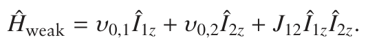

In the case of strong coupling the term which represents the coupling has

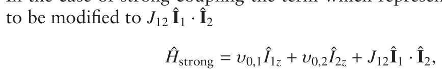

where

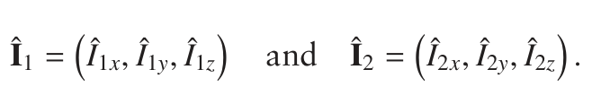

Î1 and Î2 are vectors comprising the operators which represent the x-, y-and z-components of the angular momentum. Î1 · Î2 is the scalar product between these two vectors, which is defined in the following way

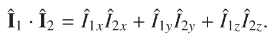

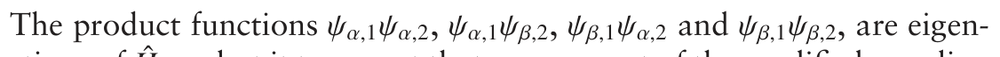

functions of Ĥweak but it turns out that, on account of the modified coupling term, these functions are not eigenfunctions of Ĥstrong. However, given the

**Table 12.1** Eigenfunctions and corresponding eigenvalues (energy levels) for two strongly coupled spins.

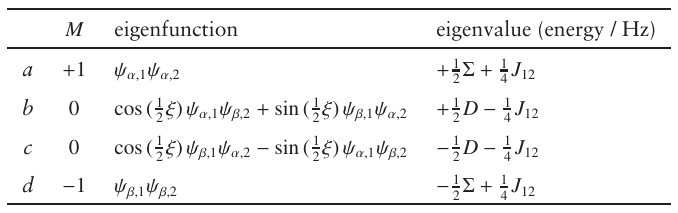

fact that the two Hamiltonians Ĥweak and Ĥstrong are not that different, we can use a well-established strategy in quantum mechanics which is to assume that the eigenfunctions of Ĥstrong are linear combinations of the known eigenfunctions of Ĥweak. This strategy works perfectly in the present case, although the details of how the correct linear combinations are chosen are beyond the level of the present discussion.

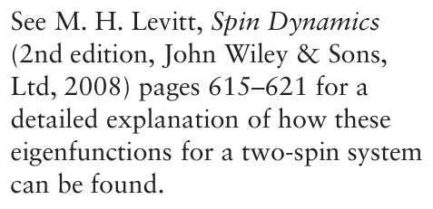

The eigenfunctions and the corresponding energy levels of Ĥstrong are given in Table 12.1, where the following definitions are used

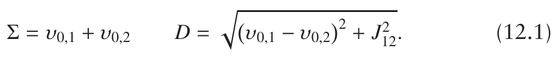

Note that D is defined to be a positive quantity. The angle ξ is given by

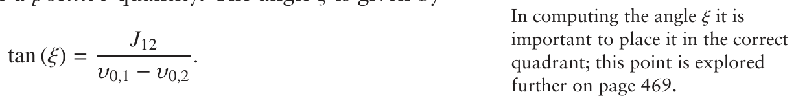

Comparison of these eigenfunctions and eigenvalues with those given in Table 3.2 on page 38 for two weakly coupled spins shows that eigenfunctions a and d are the same as the weakly coupled eigenfunctions 1 and 4. However, eigenfunction b is a mixture of the weakly coupled eigenfunctions 2 (ψα,1ψβ,2) and 3 (ψβ,1ψα,2). Similarly, eigenfunction c is also a mixture of these two functions.

The degree of mixing of the wavefunctions depends on the angle ξ which is often called the strong coupling parameter. In the limit of weak coupling the difference in the Larmor frequencies is much greater than the coupling

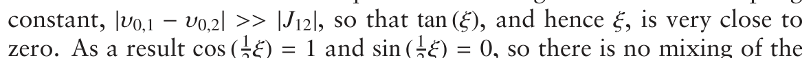

zero. As a result cos (12ξ) = 1 and sin ( 12ξ) = 0, so there is no mixing of the wavefunctions. In this limit eigenfunctions b and c are then the same as the weakly coupled eigenfunctions 2 and 3.

The eigenvalues (energies) of a and d are the same as for the weakly coupled cases, since the eigenfunctions are the same. However, the eigenvalues of b and c are changed as a result of the mixing. In the

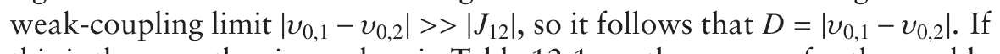

this is the case, the eigenvalues in Table 12.1 are the same as for the weakly coupled case.

### 12.1.2 Form of the spectrum

In section 3.6 on page 38 it was explained that the allowed transitions were ones in which the quantum number m of one of the spins changes by ±1.

**Table 12.2** Frequencies and intensities of the allowed transitions in a strongly coup- led two-spin system, along with corresponding expressions for a weakly coupled system.

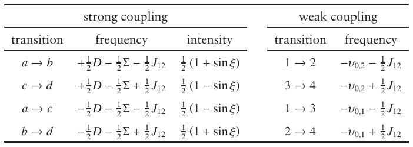

In a strongly coupled system the selection rule is expressed in terms of the quantum number M, introduced in section 3.6.1 on page 39, which is the sum of the m values for the two spins. The values of M for each of the eigenfunctions are given in Table 12.1 on the previous page.

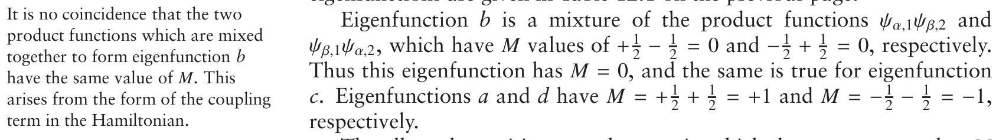

Eigenfunction b is a mixture of the product functions ψα,1ψβ,2 and

Thus this eigenfunction has M = 0, and the same is true for eigenfunction

The allowed transitions are the ones in which the quantum number M changes by ±1 i.e. transitions a–b, c–d, a–c and a–d. In the case of a weakly coupled spin system all the allowed transitions have the same intensity, however this is no longer true in a strongly coupled system and we have to use further quantum mechanical techniques, which are beyond the scope of this discussion, to predict the intensities. Table 12.2 gives the frequencies and intensities of the four transitions, along with the corresponding values in the weakly coupled case; note that the intensities are expressed in terms of the angle ξ.

In the limit of weak coupling ξ goes to zero so that sin ξ is also zero. All of the lines then have the same intensity. The expressions for the frequencies can be taken to the weak coupling limit by setting D = |ν0,1 − ν0,2|, as before.

Figure 12.1 on the next page shows a set of spectra computed from the expressions given in the table and for progressively increasing degrees of strong coupling. In spectrum (a) the separation of the Larmor frequencies is sixteen times greater than the coupling constant, so the spectrum is very close to the weakly coupled limit. We see the expected two doublets, but the intensity of the lines within each of the doublets is not quite the same. As the Larmor frequencies move closer together in (b) and then (c), these intensity perturbations become more pronounced. The two ‘outer’ lines, transitions cd and ac, become progressively weaker, whereas the two ‘inner’ lines, ab and bd, become stronger. This leads to what is called roofing, since the profile of the intensities is reminiscent of the slope of a roof, as indicated by the dashed lines in spectrum (c).

In the weakly coupled case the two doublets are centred at the Larmor frequencies of the two spins. However, as the coupling becomes stronger the two lines are no longer symmetrically disposed about the Larmor

**Fig. 12.1** Computed spectra from two strongly coupled spins. In all cases J12 = 5.0 Hz and the Larmor frequency of spin one is −10 Hz. As we go from (a) to (d) the Larmor frequency of spin two is moved progressively closer to spin one, with ν0,2 taking the values −90, −50, −20 and −10 Hz, respectively; the Larmor frequencies are indicated by the dashed vertical lines. Also given are the values (in degrees) of the angle ξ and the value of sin ξ. The transitions are labelled according to Table 12.2 on the preceding page. Note particularly that when the two Larmor frequencies are equal the spectrum, shown in (d), consists of a single line.

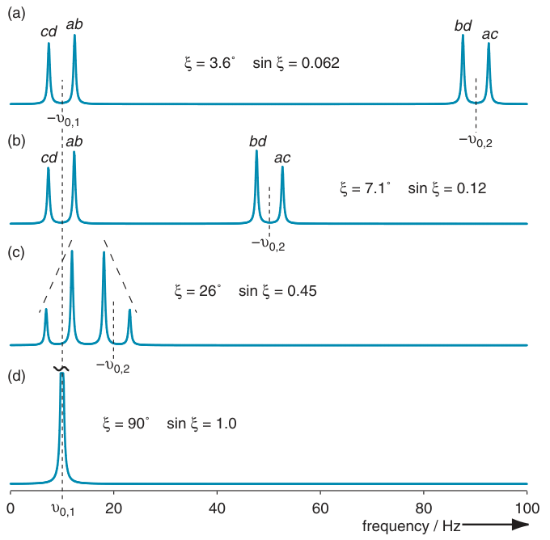

frequencies. In fact, the stronger of the two lines (ab and bd) move closer to the Larmor frequencies, whereas the weaker lines move away – this is particularly evident in spectrum (c). Rather strangely, the separation of the two lines in each doublet is always J12, regardless of the strength of the coupling.

If the two Larmor frequencies are the same, then (ν0,1 − ν0,2) goes to zero and tan ξ goes to infinity i.e. the angle ξ is π/2 radians or 90◦. In this limit sin ξ = 1, so the intensity of transitions cd and ac, which are given by 12 (1 − sin ξ), go to zero. In contrast the other two transitions have intensity 1. In other words, only two lines remain in the spectrum.

The frequency of transition ab is, from the table, +12D − 12Σ − 12 J12. However, if ν0,1 = ν0,2 it follows from their definitions, Eq. 12.1 on page 443, that D = |J12| and Σ = 2ν0,1. Therefore the frequency of the transition ab is −ν0,1; a similar line of argument shows that the frequency of bd is also −ν0,1. Note carefully that the frequencies of these two lines are the same and do not depend on the value of the coupling constant.

The conclusion is that if we have two coupled spins whose Larmor frequencies (i.e. chemical shifts) are the same, then in the spectrum we simply see one line at the Larmor frequency. The value of the coupling constant has no effect on the position of the line, and although there is a coupling between the two nuclei this does not give rise to any observable splittings in the spectrum.

### 12.1.3 Summary

It is useful at this point to summarize what we have found about the spectrum of two coupled spins.

- If the difference between the Larmor frequencies of the two spins is

large compared with the coupling constant between the spins, then

the spectrum consists of two doublets, with the two lines in each

doublet having the same intensity. The spins are said to be weakly coupled.

- When the difference between the Larmor frequencies becomes com-

parable with the coupling constant, then the positions of the lines are

perturbed from the values expected for weak coupling, and in addi-

tion the intensities of the lines are altered to give the characteristic roofing effect. Such spins are said to be strongly coupled.

- When the Larmor frequencies of the two spins are the same, the

spectrum consists of one line. Even though the spins are coupled,

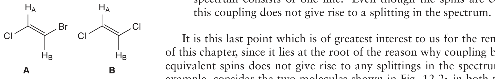

It is this last point which is of greatest interest to us for the remainder of this chapter, since it lies at the root of the reason why coupling between equivalent spins does not give rise to any splittings in the spectrum. For example, consider the two molecules shown in Fig. 12.2: in both the two protons HA and HB are coupled to one another since they are separated by three bonds. For molecule A the coupling shows up clearly in the spectrum which consists of two doublets. However, in B protons HA and HB are in the same environment and so have the same chemical shift (Larmor frequency). As we have just shown, in such a case the spectrum is a single line and there are no splittings due to the coupling, despite it being present.

**Fig. 12.2** The two protons in A are in different chemical environments and are coupled to one another, so the spectrum consists of two doublets. In B the two protons are in identical environments and so have the same Larmor frequency. Thus, although they are still coupled, no splittings are seen in the spectrum, which consists of a single line.

Although we have illustrated this point for just two spins, the same idea applies to larger spin systems, and it is found that the couplings between spins which have the same Larmor frequency (same chemical shift) have no effect on the spectrum. Such spins are said to be equivalent, but as we shall see in the next section we need to distinguish between different kinds of equivalent spins.

## 12.2 Chemical and magnetic equivalence

In this section we will explore the difference between magnetic and chemical equivalence. Spins which are chemically equivalent have the same chemical shift, but for spins to be magnetically equivalent not only do the shifts need to be the same but also the couplings to all of the spins need to be the same. The reason why this distinction is important is that the couplings between magnetically equivalent spins have no effect on the spectrum, but the same is not true for spins which are simply chemically equivalent.

### 12.2.1 Chemical equivalence

The two protons in molecule B (shown in Fig. 12.2) are in the same chemical environment and hence have the same chemical shift (Larmor frequency): the two protons are said to be chemically equivalent. Likewise, the six protons in benzene are all in the same environment and so are also chemically equivalent.

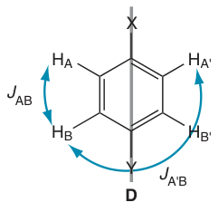

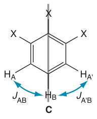

**Fig. 12.3** Illustration of the difference between chemical and magnetic equivalence. In C the presence of the mirror plane (indicated by the grey line) makes HA and HA′ chemically equivalent (i.e. they have the same shift). The couplings JAB and JA′B are clearly the same, so HA and HA′ are magnetically equivalent. In D, HA and HA′ are chemically equivalent, as are HB and HB′. However, JAB JA′B so HA and HA′ are not magnetically equivalent.

Chemical equivalence is often the result of symmetry. For example, molecule B has a two-fold rotation axis located in the middle of the double bond and coming out of the paper. Rotation by 180◦ about this axis interconverts HA and HB, and so the two protons are chemically equivalent. Similarly, the six protons in benzene are interconverted by rotation through 60◦ about the six-fold axis which lies perpendicular to the plane of the ring, and as a result all six protons are equivalent.

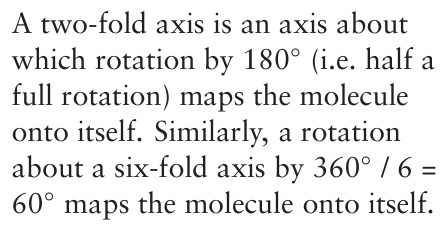

### 12.2.2 Magnetic equivalence

Groups of spins which have the same shift may also be magnetically equivalent, which is a more subtle form of equivalence involving the couplings as well as the shifts. Imagine that in a molecule we have a group of three spins A1, A2 and A3 which all have the same shift, and a group of two spins B1 and B2 which have the same shift as one another, but different to that of the A spins.

If the coupling between each of the A spins and each of the B spins is identical, then the three A spins are magnetically equivalent, and the two B spins are magnetically equivalent. To be explicit, the couplings A1–B1, A1–B2, A2–B1, A2–B2, A3–B1 and A3–B2 must all be identical for the three A spins and the two B spins to form magnetically equivalent groups.

Expressed more formally, a group of spins is magnetically equivalent if: (1) they have the same chemical shift and (2) if each spin in the group has identical couplings to any other magnetically equivalent group of spins in the molecule. There is one exception to this rule which is that if there is only one group of spins in the molecule, then these are magnetically equivalent.

### 12.2.3 Examples

The test for magnetic equivalence is best illustrated by some examples. First consider the benzene molecule, in which all six protons have the same shift. Since there is only one group of spins in this molecule, and these have the same shift, they are magnetically equivalent. Other examples of spins which are magnetically equivalent for the same reason are the two protons in water and the four protons in methane.

The two molecules in Fig. 12.3 on the previous page illustrate how the network of couplings has to be considered in order to distinguish between chemical and magnetic equivalence. Molecule C has a mirror plane indicated by the grey line and since protons HA and HA′ are interconverted by this plane, they must have the same chemical shift. HB, on the other hand, has a different shift to the other two protons. We therefore have two groups [HA, HA′] and [HB]. (The fact that the second group only has one member does not alter the test for equivalence.)

The size of the coupling between HA and HB is identical to that between HA′ and HB, since both pass through an identical set of bonds. The test for magnetic equivalence is therefore satisfied and thus HA and HA′ are magnetically equivalent.

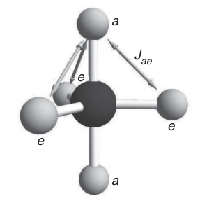

Now turn to molecule D, which also has a mirror plane. Clearly HA and HA′ have the same shift since they are interconverted by the mirror plane. The same is true of HB and HB′, so we have two groups [HA, HA′] and [HB, HB′]. The coupling of HB to HA is not the same as the coupling of HB to HA′, since the former is through three bonds and the latter through five bonds. Thus the condition for magnetic equivalence is not satisfied as the couplings of each member of the first group are not the same to each member of the second group. It follows that neither the group [HA, HA′] nor the group [HB, HB′] are magnetically equivalent.

**Fig. 12.4** PF5 is trigonal pyramidal and so has two fluorine environments: axial (a) and equatorial (e). As indicated by the arrows, each equatorial fluorine has an identical coupling to each axial fluorine. The three equatorial fluorines are thus magnetically equivalent, and the two axial fluorines are also magnetically equivalent.

The molecule PF5, illustrated in Fig. 12.4, has a trigonal bipyramidal geometry. There are two environments for the fluorine atoms: the two axial positions (denoted a) and the three equatorial positions (denoted e). From the geometry, it is clear that each axial fluorine has an identical coupling to each of the equatorial fluorine atoms. As a result the two axial fluorines are magnetically equivalent, as are the three equatorial fluorines.

In molecules which have some degree of conformational flexibility, such as the rotation about single bonds, it is rather more difficult to decide whether or not a group of spins is magnetically equivalent. For example, consider the case of chloroethane, CH3CH2Cl. In this molecule the barrier to rotation about the C–C bond is not very high, but the staggered arrangements, illustrated as Newman projections in Fig. 12.5, are the lowest energy rotamers and therefore the ones which will be most populated.

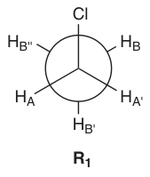

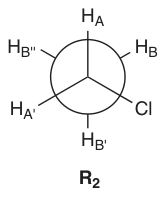

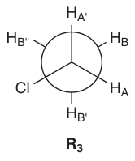

**Fig. 12.5** The three low-energy rotamers of chloroethane depicted as Newman projections. The two methylene protons are labelled A and A′, and the three methyl protons are labelled B, B′ and B′′. In any one rotamer the couplings between a particular A proton and the three B protons are not all the same. However, if there is rapid exchange between the three rotamers, and each is populated equally, the averaged values of these couplings are identical. As a result the CH2 protons are magnetically equivalent, as are the CH3 protons.

In rotamer R1 the coupling between HA and HB is not the same as that between HA and HB′. Therefore, neither the three CH3 protons nor the two CH2 protons are magnetically equivalent. The same is true in the other two rotamers.

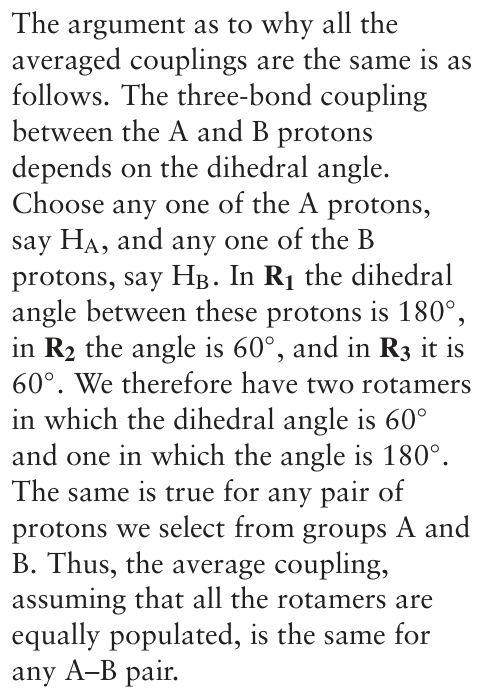

However, if the molecule is jumping between rotamers at a rate fast compared with the range of couplings involved, which is certainly the case for this molecule under normal conditions, we need to consider the average value of the couplings. If the three rotamers are equally populated, then the average value of the coupling from any one of the CH2 protons to any one of the CH3 protons is the same. Thus, the CH2 protons form a magnetically equivalent group, as do the CH3 protons. For chloroethane the interactions are the same in all three rotamers, so we expect them to be equally populated.

In more complex examples it may not be so immediately obvious whether or not a group of protons are magnetically equivalent, for example in situations in which the populations of the rotamers are not equal.

### 12.2.4 Consequences of magnetic equivalence

The most important consequence of magnetic equivalence is that the couplings between a group of magnetically equivalent spins have no effect on the spectrum i.e. these couplings do not give rise to any observable splittings in the spectrum. In section 12.1 on page 442 we saw an example of this for the case of two spins: when the shift of the two spins is the same then we see just one line in the spectrum, despite the fact that the two spins are coupled.

In fact, it can also be shown that the couplings between equivalent nuclei have no effect on the outcome of any NMR experiment, regardless of the pulse sequence. It therefore follows that in making product operator calculations on such spin systems we can simply ignore the couplings between equivalent spins. This greatly simplifies the calculations, and is a feature we will make use of in the remainder of this chapter.

The proof that the couplings between magnetically equivalent spins have no effect on the spectrum or the outcome of any experiment requires the use of quantum mechanical techniques which are well beyond the scope of this text. An elegant proof of this property is given in Appendix 9 of M. H. Levitt, Spin Dynamics (2nd edition, John Wiley & Sons, Ltd, 2008).

For the remainder of this chapter we will be focusing on heteronuclear NMR experiments involving the spins systems 13C1H, 13C(1H)2 and 13C(1H)3. For the latter two we can reasonably assume that the protons have the same shift and, since they also have the same (one-bond) coupling to the 13C, it follows that the protons are magnetically equivalent. We are therefore able to ignore the coupling between these spins thus greatly simplifying the calculations.

### 12.2.5 Notation for spin systems

There is a commonly used notation for spin systems which is especially useful when dealing with chemically or magnetically equivalent spins. In this notation a different capital letter is used for each spin with a distinct chemical shift. If the spins are strongly coupled (i.e. their shift separation is comparable with the coupling constant between them), then two letters close in the alphabet are used, whereas weakly coupled spins are denoted by letters far apart in the alphabet.

Therefore two weakly coupled spins are described as an ‘AX spin system’ whereas two strongly coupled spins are called an ‘AB spin system’. Three weakly coupled spins would be denoted AMX and three strongly coupled spins would be denoted ABC. If two of the spins are strongly coupled and one is weakly coupled we have an ABX spin system.

In this notation groups of magnetically equivalent spins are denoted by adding a subscript, so AX2 indicates a magnetically equivalent group of two spins (the X2) weakly coupled to the first spin A. Likewise, AX3 denotes a set of three magnetically equivalent nuclei coupled to the A spin.

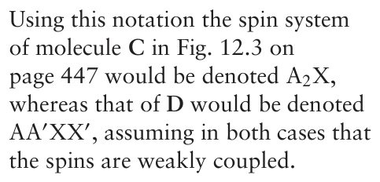

Groups of spins which are chemically equivalent (as distinct from being magnetically equivalent) are denoted by adding primes, so AA′X indicates two chemically equivalent spins, A and A′, weakly coupled to a third spin X. It is necessary to distinguish the chemically equivalent A spins using the prime as the coupling of X to A will not be the same as that to A′.

## 12.3 Product operators for AXn (InS) spin systems

In this section we are going to explore how the product operator method can be extended to compute the evolution of AX2 and AX3 spin systems. The main reason for doing this is that we are interested in the behaviour of 13CH2 and 13CH3 fragments in certain heteronuclear experiments. Following on from the notation used in earlier chapters we will denote the operators of the heteronucleus using S , and those of the protons as I1, I2 and I3. To be consistent with this notation we will therefore describe the spin systems as I2S and I3S .

Recall from the foregoing discussion that because the I spins are magnetically equivalent the coupling between them can be ignored. Thus, in the InS spin system we only have to consider the evolution of the I–S coupling, which is the same for each pair of spins. For brevity this coupling will be denoted J.

In section 10.1 on page 320 we described the product operators that arose for three coupled spins and how these evolved under free precession and pulses. As is explained in the following sections, the approach taken there is readily extended to cope with I2S and I3S spin systems.

### 12.3.1 Hamiltonians for free precession and pulses

### Free precession

The free precession Hamiltonian has a term for the offset of each spin, along with terms describing the couplings. For the I3S spin system it will be

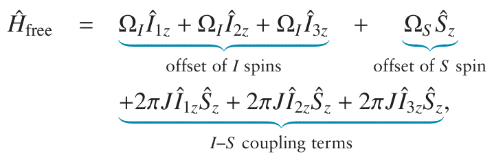

where the offset of the I spins is ΩI (all the same), and that of the S spin is ΩS . For the I2S spin system we simply drop the terms in Î3z, and for the IS spin system we also drop the terms in Î2z. Note that since the I spins are magnetically equivalent it is not necessary to include any terms for the coupling between them.

Each of the terms in the free precession Hamiltonians commutes with all the others, so the evolution can be computed by considering the effect of each in turn, in any order. Using the arrow notation this becomes, for the offset terms

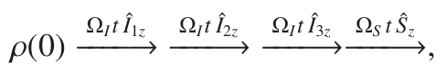

and for the coupling terms

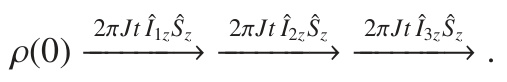

### Pulses

Since the I and S spins are different types of nucleus (e.g. 1H and 13C) pulses are applied to each separately. For a (strong) x-pulse to the S spins the Hamiltonian is

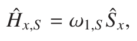

and for the I spins it is

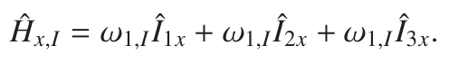

As with the free precession Hamiltonian, each of these terms commutes and so their effect can be considered separately and in any order. In the arrow notation we have, for a pulse to the I spins,

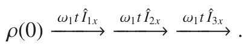

As before, for the I2S spin system we simply drop the terms in Î3x, and for the IS spin system we also drop the terms in Î2x.

### 12.3.2 Observable terms

As we have seen for two and three spins, only those operator products containing one Îx or Îy operator combined with any number of Îz operators are observable. For operator products which are observable on the S spin, the presence of an Îi,z operator indicates that the multiplet will be anti-phase with respect to the coupling to spin i. The appearance of the multiplet depends on the number of Îz operators present and on the number of coupled spins, as is described below.

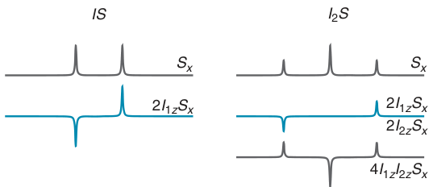

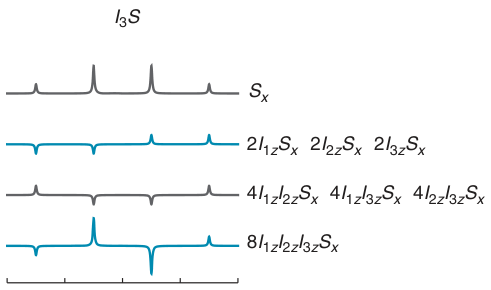

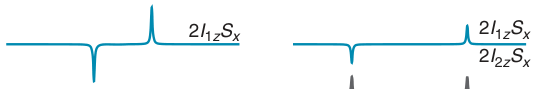

**Fig. 12.6** Illustration of the multiplets arising from various operator products in IS , I2S and I3S spin systems. In each case Ŝx gives rise to the familiar multiplet with intensity patterns 1:1, 1:2:1 and 1:3:3:1. Introduction of Îi,z operators into the product gives the more complex anti-phase multiplets shown. Note that in the I2S spin system the operators Î1z and Î2z are interchangeable as they represent equivalent spins; similarly in the case of I3S all three I spin operators are interchangeable. The offset of the S spin has been set to 0 Hz and the I–S coupling has been set to 5 Hz. The in-phase multiplets are drawn such that each has the same integral.

### S spin observables

The operator Ŝx represents a fully in-phase multiplet on the S spin. For the IS spin system this means a 1:1 doublet, for the I2S system it represents a 1:2:1 triplet and for the I3S system it represents a 1:3:3:1 quartet. These are of course the multiplets expected for spin S in the conventional NMR spectrum of an InS spin system, with the intensity patterns that can be predicted using the usual tree diagram. These multiplets are illustrated along the top row of Fig. 12.6.

The term 2Î1z Ŝx indicates magnetization which is anti-phase with respect to the I1–S coupling. For the IS spin system it gives rise to the familiar anti-phase multiplet with intensity −1:1. In the I2S system the intensity pattern is −1:0:1 i.e. the middle line is absent, and in the I3S system the pattern is −1:−1:1:1. These multiplets are illustrated in the second row of Fig. 12.6.

For the I2S spin system the operator 2Î2z Ŝx gives the same pattern as

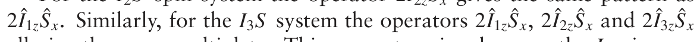

all give the same multiplets. This property arises because the I spins are magnetically equivalent, and are thus interchangeable.

For the I2S and I3S spin systems we can have doubly anti-phase operators such as 4Î1z Î2z Ŝx; note that the normalizing factor is now 4 on account of there being three operators in the product. This operator gives rise to a multiplet with intensity pattern 1:−2:1 in the I2S system, and a multiplet with intensity pattern 1:−1:−1:1 in the I3S system. In the latter, the operators 4Î1z Î3z Ŝx and 4Î2z Î3z Ŝx give rise to identical multiplets. These doubly anti-phase multiplets are illustrated in the third row of the figure.

Finally, in the I3S system we can have the triply anti-phase operator 8Î1z Î2z Î3z Ŝx which gives rise to a −1:3:−3:1 multiplet, also illustrated in the figure. As there are four operators in the product, the normalizing factor is now 8.

Changing the S spin operator from Ŝx to Ŝy gives an identical set of multiplets except that the phase is shifted by 90◦ i.e. the lines would all be in dispersion. As usual, a phase correction by 90◦ will return the lines to absorption. The form of the multiplets arising for these various operator products can be worked out by following an analogous process to that used in section 7.5 on page 152, a topic which is explored in more detail in one of the Exercises at the end of this chapter.

### I spin observables

For all of these InS spin systems the I spin spectrum is simply a doublet due to the coupling to the S spin (recall that the couplings between the magnetically equivalent I spins have no effect on the spectrum). Thus the operators Îi,x, where i is 1, 2 or 3, all give rise to an in-phase doublet on the I spin, and the operators 2Îi,x Ŝz all give rise to anti-phase doublets. Along with their counterparts Îi,y and 2Îi,y Ŝz, these are the only observable operators on the I spins.

### 12.3.3 Evolution due to coupling

The anti-phase terms arise due to the evolution of coupling which follows the same rules as for a two-spin system, as illustrated in Fig. 7.6 on page 152. Starting with Ŝx the effect of the coupling to spin I1 is

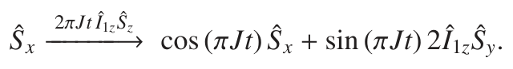

Note that the evolution of the coupling to I1 gives the term Î1z in the operator product. By analogy, evolution of the coupling to spin I2 gives the term Î2z in the product:

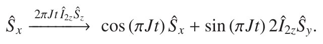

In the I2S and I3S spin systems the singly anti-phase term 2Î1z Ŝy can evolve further under the coupling to spin I2. The relevant term in the Hamiltonian is 2πJ Î2z Ŝz, and since this does not include any operators for spin I1 the operator Î1z in the product 2Î1z Ŝy will be unaffected. We can therefore write 2Î1z Ŝy as A Ŝy, where A is a constant. The evolution of this term under the coupling to spin I2 follows the usual rule

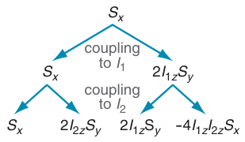

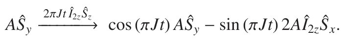

**Fig. 12.7** Illustration of the operators arising from Ŝx under the evolution of first the coupling to spin I1 and then the coupling to spin I2. An arrow to the left is associated with a factor cos (πJt), and an arrow to the right is associated with a factor sin (πJt).

Replacing A with 2Î1z gives

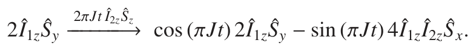

We see that the singly anti-phase term 2Î1z Ŝy evolves into the doubly anti-phase term 4Î1z Î2z Ŝx. Figure 12.7 illustrates the operators which arise from Ŝx due to the effect of coupling to spin I1 and then to spin I2.

In the I3S spin system an analogous term arises due to the evolution under the coupling to spin I3

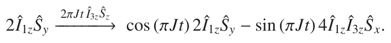

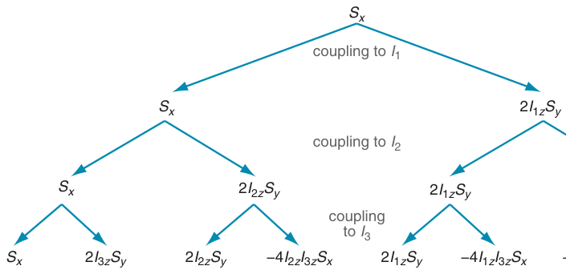

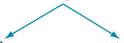

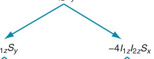

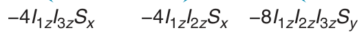

**Fig. 12.8** Illustration of the operators arising from Ŝx under the evolution of the couplings to spins I1, I2 and I3. An arrow to the left is associated with a factor cos (πJt), and an arrow to the right is associated with a factor sin (πJt).

In this spin system the doubly anti-phase term 4Î1z Î2z Ŝx can evolve further under the influence of the coupling to spin I3. As before, the terms Î1z and Î2z are unaffected by this coupling so the doubly anti-phase term can be written BŜx, where B is a constant. The evolution under the coupling to spin I3 follows the usual rule:

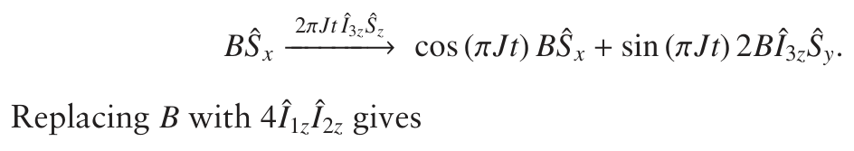

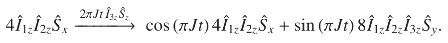

We see that evolution of the doubly anti-phase term 4Î1z Î2z Ŝx gives the triply anti-phase term 8Î1z Î2z Î3z Ŝy (note that this is only possible in the I3S spin system). Figure 12.8 illustrates the evolution of Ŝx under the coupling to three I spins.

These anti-phase terms evolve back into in-phase terms in an analogous way to that we have seen before. For example, when the term 4Î1z Î2z Ŝx evolves under the coupling to spin I2 we recognize that the term Î1z will be unaffected, so the problem boils down to the evolution of 2Î2z Ŝx under the coupling to I2, which simply gives rise to Ŝy. The full result is

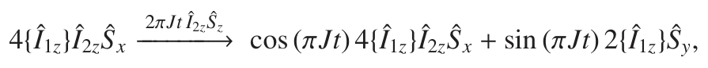

where the unaffected operator has been placed in curly braces. Similarly, in the following transformation both Î1z and Î2z are unaffected

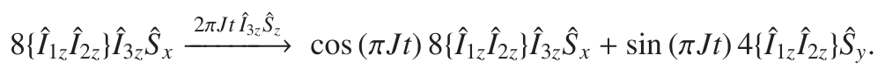

## 12.4 Spin echoes in InS spin systems

The first experiment we will look at is the straightforward spin echo on the S spin, the pulse sequence for which is shown in Fig. 12.9. Following the discussion in section 7.8.4 on page 164 we note that since 180◦ pulses are applied to both the I and S spins we expect that the offset of both will be refocused, but that the coupling between them will continue to evolve for the entire time 2τ. Furthermore, the outcome of the –τ–180◦–τ– segment can be computed by allowing the coupling to evolve for time 2τ and then applying the two 180◦ pulses.

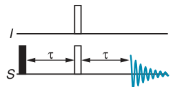

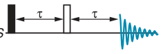

**Fig. 12.9** A simple spin echo sequence applied to the S spin. The offsets of the I and S spins will be refocused, but the I–S coupling will continue to evolve for the whole time 2τ.

### 12.4.1 IS spin system

The initial 90◦ pulse generates the operator − Ŝy. Using the short cut just discussed, the result of the spin echo for an IS spin system is

If the delay τ is zero we have the in-phase term Ŝy. Setting the delay to 1/(4J) gives complete conversion to the anti-phase term −2Î1z Ŝx, and a delay of 1/(2J) returns the in-phase term − Ŝy, but with a sign change. A delay of 1/J gives the same result as a delay of zero.

### 12.4.2 I2S spin system

For the I2S spin system we need to consider the effect of the coupling first to spin I1 and then to spin I2. The first of these couplings gives the same result as above, and the second gives rise to additional terms

result is written more compactly as

There is a clear pattern to the trigonometric coefficients in front of each operator: each Îiz operator in the product leads to a cosine term being replaced by a sine term. Furthermore, the fact that the coefficients for 2Î2z Ŝx and 2Î1z Ŝx are the same is simply a result of the I–S couplings all being the same.

**Fig. 12.10** Plots showing how the amounts of the operator products generated in a spin echo sequence vary with the delay τ in the echo for: (a) the I2S spin system and (b) the I3S spin system. The value of the delay τ is expressed in terms of the I–S coupling J.

The result of the calculation, Eq. 12.2 on the preceding page, is plotted in Fig. 12.10 (a). The graph shows how the amounts of Ŝy, 2Î1z Ŝx and 4Î1z Î2z Ŝy vary as a function of the delay τ, expressed in terms of the coupling constant J (2Î2z Ŝx behaves in the same way as 2Î1z Ŝx). The behaviour is rather different to that of the IS spin system.

For example, there is no value of the delay which results in the generation only the singly anti-phase terms 2Î1z Ŝx and 2Î2z Ŝx, whereas there is complete conversion to the doubly anti-phase term 4Î1z Î2z Ŝy when τ = 1/(4J). In contrast to the IS spin system, a delay of 1/(2J) gives the same result as a delay of zero. The maximum amount of the singly

for the IS spin system the maximum is at a delay of 1/(4J). This result may be interpreted by noting that the outer lines of the triplet are in some ways analogous to a doublet with twice the coupling constant (the lines are separated by 2J), and so the anti-phase terms develops twice as quickly.

### 12.4.3 I3S spin system

For the I3S spin system we have one more coupling to evolve which gives rise to a total of eight terms. Starting from Eq. 12.2 on the preceding page and using the compact notation the evolution is

Collecting terms together gives the final result

This result mirrors the pattern already seen for the I2S spin system: a cosine term is replaced by a sine for each Îiz operator present in the product. Figure 12.10 (b) on the preceding page shows plots of the amount of each of the different types of operator as a function of the delay τ.

A delay of 1/(4J) generates just the triply anti-phase term 8Î1z Î2z Î3z Ŝx. Setting the delay to 1/J gives the same result as for a delay of zero, and τ = 1/(2J) gives just the in-phase term, but with opposite sign to that for τ = 0. All other values of τ give contributions from each of the different operators.

The delay which gives the greatest amount of the singly anti-phase term can be found by locating the turning points in the function cos2 (2πJτ) sin (2πJτ), and for the doubly anti-phase term we have to consider the function cos (2πJτ)sin2 (2πJτ). Finding these turning points is one of the Exercises at the end of the chapter; the lowest values of τ which give the maximum amounts of these two terms turn out to be at τ = 0.0980/J and τ = 0.152/J. In each case the term is at its most negative, as can be seen from Fig. 12.10 (b).

### 12.4.4 Attached proton test (APT)

The APT experiment gives a very simple way of determining whether a line in a proton-decoupled 13C spectrum is due to a C, CH, CH2 or CH3 group. The experiment itself is just a simple spin echo, like the one we have been discussing, but with the addition of broadband I spin (proton) decoupling during acquisition. The pulse sequence is shown in Fig. 12.11 (a) on the following page.

APT: Attached Proton Test

As was discussed in section 7.10.3 on page 169, broadband I spin decoupling effectively sets the I–S coupling to zero and as a result the lines in any anti-phase multiplets simply cancel one another out making such terms unobservable. The only observable operators are therefore Ŝx and Ŝy, each of which gives, under decoupled conditions, a single line at the offset of the S spin. Referring back to our calculations in the previous section, we can therefore see that the intensity of the observed signal is simply proportional to the trigonometric term multiplying the operator Ŝy. This term is different for each spin system:

In the table we have added an entry for just a single S spin which is not coupled to any I spins. It is trivial to see that in such a case the spin echo just gives the term Ŝy. Inspection of the table on the previous page gives us a very nice result: in this experiment the intensity of the signal from an InS

In the APT experiment we choose τ = 1/(2J) which means that cos (2πJτ) = −1. The peaks from S and I2S spin systems will therefore be positive, while those from IS and I3S spin systems will be negative. In other words, peaks from InS spin systems with n even will be positive, and those with n odd will be negative.

Thus, simply by inspecting the sign of the peaks in the APT experiment we can obtain an indication as to whether a peak in a 13C spectrum is from a C or CH2 group on the one hand, or from a CH or CH3 group on the other. Although the experiment does not distinguish between C and CH2, nor between CH or CH3, the information that is provided is often sufficient to be a considerable help in assigning the spectrum. So simple and reliable is the APT experiment that it is often recorded as a matter of routine alongside a conventional 13C spectrum.

**Fig. 12.11** Two alternative APT pulse sequences. Sequence (a) is a J-modulated spin echo with broadband I spin decoupling (indicated by the blue rectangle) during acquisition. As a result only in-phase terms lead to observable signals. Sequence (b) achieves the same result, but rather than a 180◦ pulse being applied to the I spins, broadband decoupling is switched on half-way through the echo, effectively setting the coupling to zero. The coupling therefore only evolves for the first period τ′ and so is not refocused. To have the same overall modulation it is necessary to set τ′ = 2 × τ.

In practice the pulse sequence of Fig. 12.11 (b) is generally used, rather than the simple echo sequence (a). Sequence (b) is a spin echo on the S spin, but there is no 180◦ pulse on the I spin. Rather, broadband I-spin decoupling starts half way through the echo and then carries on into the acquisition period. The I–S coupling evolves during the first period τ′, but during the second period the coupling is effectively set to zero and so does not evolve. A spin echo can only refocus a coupling if it evolves equally in the two delays, which is certainly not the case here, and as a result the coupling is not refocused. Effectively, sequence (b) is J-modulated spin echo.

In sequence (a) the coupling evolves for both the periods τ, giving a total evolution time of 2τ. However, in (b) the coupling only evolves for τ′, so we need to set τ′ = 2 × τ to obtain a comparable result i.e. τ′ has to be set to 1/J in order to achieve the result described above. Sequence (b) is generally preferred as it is somewhat simpler, having only one 180◦ pulse which needs to be calibrated carefully.

Of course, the time τ (or τ′) has to be set according to the value of the I–S coupling. In the case of CHn groups this is the one-bond C–H coupling which does not vary greatly and so it is relatively easy to select a single value for the delay which will give acceptable intensity for all the different carbons in the molecule. Figure 12.12 on the facing page shows the APT spectrum of quinine.

## 12.5 INEPT in InS spin systems

In section 7.10 on page 167 we discussed the INEPT experiment which is used to transfer magnetization from the I spins to the S spins by first generating an anti-phase state on the I spin and then applying two 90◦ pulses to transfer this to the S spin. The pulse sequence, in the form which utilizes I-spin decoupling during acquisition, is shown in Fig. 12.13 on the facing page.

If we start out with equilibrium magnetization on the first I spin, Î1z, the 90◦ pulse generates −Î1y. Period A is a spin echo during which the

**Fig. 12.12** APT spectrum of quinine recorded at 500 MHz for protons. The spectrum has been phased such that signals from C and CH2 groups are positive whereas those from CH and CH3 groups are negative. The multiplet from CDCl3 appears as a positive peak as the carbon is not attached to any protons: it therefore behaves like a quaternary carbon.

I–S coupling evolves for a total time 2τ1 and the I-spin offset is refocused. We do not need to worry about any couplings amongst the magnetically equivalent I spins, so our calculation is valid for any InS spin system.

We have worked out the operators present at the end of period A before, and so can simply quote these as

Equilibrium magnetization on the second or third I spin (if present) gives exactly analogous terms – all we need to do is change the index of the I-spin operator from 1 to 2, or to 3.

Since we know that only the anti-phase term will be transferred to the S spin, we can right away see that the optimum value for τ1 is 1/(4J) and from now on we will assume that this is the case. After the two transfer pulses, period B, we therefore have

**Fig. 12.13** Pulse sequence for the INEPT experiment with decoupled acquisition.

Period C is a spin echo, the purpose of which is to allow this anti-phase term to evolve into an in-phase term which will be observable under conditions of broadband I-spin decoupling. What we are about to discover is that the details of this process depend on the number of equivalent I spins in the InS spin system.

### 12.5.1 IS spin system

It is not really necessary to do a full calculation of the effect of the final spin echo since it is only the in-phase term which is observable. All we need to do is concentrate on how this term arises. During the echo the term −2Î1z Ŝy will evolve into Ŝx, multiplied by the trigonometric factor sin (2πJτ2). We must not forget to take account of the two 180◦ pulses, but in this case they have no effect on this term since a pulse to the I spin has no effect on Ŝx, and an x-pulse to the S spin also has no effect on Ŝx. The final result is that the observable signal goes as sin (2πJτ2).

### 12.5.2 I2S spin system

Under the effect of the I1–S coupling the term −2Î1z Ŝy will evolve into Ŝx with a trigonometric factor sin (2πJτ2). However, we also need to take account of the evolution due to the I2–S coupling which results in the wanted in-phase term going anti-phase with respect to this coupling:

Of these two terms it is the first that we are interested in as this is the observable in-phase term. Carrying forward both trigonometric terms we see that the observable term is

Again, this is unaffected by the 180◦ pulses.

Finally, we need to recall that there are two I spins, the equilibrium magnetization from each of which will contribute a term identical to that just given. As a result, the final intensity goes as 2 sin (2πJτ2) cos (2πJτ2) which, using the usual trigonometric identities, can be rewritten sin (4πJτ2). The immediate conclusion from this calculation is that whereas the optimum value for τ2 for the IS spin system is 1/(4J), for the I2S spin system the optimum value is 1/(8J).

### 12.5.3 I3S spin system

If we add a further I spin then the evolution of the I3–S coupling has to be considered. As before, it is the in-phase part that we are interested in, so all that happens is that we acquire an additional cosine factor in complete analogy to that for the second I spin. The intensity of the in-phase term therefore goes as 3 sin (2πJτ2) cos2 (2πJτ2), where the three arises from the fact that there are three spins.

It is necessary to use calculus to find the maximum in this function, which turns out to be at τ2 = 0.0980/J (with a value of 1.15). Written in decimals for ease of comparison, the optimum value of τ2 for an IS spin system is 0.25/J, and for an I2S spin system the value is 0.125/J. All three values are significantly different.

### 12.5.4 Comparison

Figure 12.14 on the next page shows in graphical form the results of our calculation as to how the intensity of the in-phase signal varies with the delay τ2. It is only in the IS spin system that all of the magnetization from the I spin can be transferred to the S spin. In the I2S system if all of the magnetization were to be transferred we would expect an intensity of 2 since there are two I spins coupled to the S spin. In fact, the maximum transfer is just 1. The reason for this reduced intensity is that although the transfer into the anti-phase term 2Î1z Ŝy is complete, under the influence of the I1–S and I2–S couplings this term cannot evolve completely into the observable in-phase operator.

The story is the same for the I3S spin system. Complete transfer would result in an intensity of 3 due to the presence of the three I spins. However,

**Fig. 12.14** Plot showing how the intensity of the transferred signal in an INEPT experiment varies with the delay τ2 for IS , I2S and I3S spin systems. The delay is expressed in terms of the I–S coupling J.

once again the presence of three I–S couplings prevents the complete conversion of the anti-phase term into the in-phase term.

In summary, for the InS spin system we expect the intensity of the in-phase signal to have a factor of sin (2πJτ2) representing the interconversion of the anti-phase to in-phase terms, and then (n − 1) factors of cos (2πJτ2) arising from the evolution of the other couplings. Finally, there is a factor of n representing the transfer from the n I spins. Overall, the intensity goes

### 12.5.5 Consequences

One immediate consequence of this analysis is that if we wish to use the INEPT sequence to enhance the intensity of the S -spin signal then the choice of τ2 will depend on the spin system present. If, as would be the case for 13C NMR, there are IS , I2S and I3S spin systems present, then no single value of τ2 is ideal for all three spin systems, and so a compromise value has to be sought.

Another consequence of the different behaviour of InS spin systems is the possibility of differentiating between them, much in the same way as the APT experiment. For example, if we ran an INEPT experiment with τ2 = 1/(4J) then, as is obvious from Fig. 12.14, there will be no signal at all from I2S and I3S spin systems. In the case of 13C, the resulting spectrum would therefore show only those peaks from CH groups, which might well be useful information to have when working on an assignment.

From the graph we can see that setting the delay to some value around 3/(8J) would result in CH and CH3 groups giving positive signals, and CH2 groups giving negative signals. Thus, by recording two separate INEPT experiments with these two different values for τ2 it ought to be possible to identify the lines from CH, CH2 and CH3 groups. The main difficulty with this approach is that the value of τ2 depends on the value of the coupling. As has already been commented on, in the case of C–H one-bond couplings there is not that much variation in these values. However, any variation that there is will mean that setting τ2 = 1/(4J) for an average value of J will result in some signals from CH2 and CH3 groups appearing for those carbons in which the coupling is significantly different from the mean.

This idea of separating out the lines from different CHn groups in a 13C spectrum is developed further in the DEPT experiment.

## 12.6 DEPT

The pulse sequence for the DEPT experiment is shown in Fig. 12.15. Like INEPT, this sequence results in an overall transfer of I-spin magnetization to the S spins. However, quite how it achieves this is, at first sight, not at all obvious. The best thing to do is to analyse the sequence using product operators: then it will become clear how it works.

Before starting on our analysis it is helpful to spot that over period A the I-spin offset is refocused by the centrally placed 180◦ pulse to those spins. Likewise, the other 180◦ pulse refocuses the S -spin offset over period B. Therefore, during A we can ignore the I-spin offset, and during B we can ignore the S -spin offset. It is true that a 90◦ pulse to the S spins intervenes during period A, but as was the case in the HMQC experiment (section 8.8 on page 212) this does not prevent the I-spin offset being refocused.

**Fig. 12.15** The DEPT pulse sequence. Note that the third I-spin pulse has flip angle β and is applied about the y-axis. The optimum value of τ is 1/(2J).

### 12.6.1 IS spin system

Starting with equilibrium magnetization on the I spin, the first pulse generates −Î1y. This evolves under the coupling during the first delay τ, and then the 180◦ pulse to I, in the following way

Next comes the 90◦ pulse to the S spin:

We see that the anti-phase term has been transferred into (heteronuclear) multiple-quantum coherence, 2Î1x Ŝy. Since there are no further S -spin pulses, other than a 180◦ pulse which cannot cause transfer, it is not possible for the term Î1y to become observable on the S spin, so we will drop it from the calculation.

During the second period τ nothing happens to the multiple-quantum term since we have already decided that the offsets can be ignored and, in addition, it is a property of I–S multiple-quantum coherence that it does not evolve due to the coupling between the two nuclei involved (see section 7.12.3 on page 176). We therefore can move on to consider the effect of the 180◦ pulse to S and the β pulse (applied about the y-axis) to I

The effect of the β pulse is to transfer part of the multiple-quantum coherence into an anti-phase term on the I spin. Since there are no further pulses in the sequence, only this latter term can go on to give an observable signal; we will therefore carry on the calculation with just this term.

In the final delay τ the anti-phase term evolves under the I–S coupling

Since we are using I-spin decoupling during acquisition, only the in-phase term Ŝx is observable, so the final signal intensity goes as

It immediately follows that the optimum value for τ is 1/(2J) and that the optimum value for β is π/2 (90◦). With these values there is complete transfer from I to S .

Having completed the analysis it is now clearer how the sequence ‘works’.

(a) During the first delay τ anti-phase magnetization is generated on the I spin.

(b) The 90◦ pulse to S transfers this to heteronuclear multiple-quantum coherence.

(c) In the case of the IS spin system, this multiple-quantum coherence

does not evolve during the second delay τ (we shall see shortly that

(d) The β pulse to the I spins transfers some of the multiple-quantum

coherence to anti-phase magnetization on the S spin; for this to happen, the pulse must be about the y-axis.

(e) During the third delay τ the anti-phase magnetization evolves into

in-phase magnetization which is the only term observable under conditions of broadband I-spin decoupling.

### 12.6.2 I2S spin system

For the I2S spin system the result of the first delay τ, the 180◦ pulse and the 90◦ pulse to the S spin is the same as for the IS spin system. Therefore, at the start of the second delay τ we have

Since there are no further pulses to the S spin (other than a 180◦ pulse), the Î1y term will not be transferred to the S spin and so we can ignore it.

The multiple-quantum term 2Î1x Ŝy does not evolve under the influence of the I1–S coupling, but it does evolve under the I2–S coupling. We can work out the result by noting that Î1x will be unaffected by this coupling, so we can write 2Î1x as a constant A. The evolution then follows the usual rule:

Replacing A by 2Î1x gives the final result as

which can be interpreted as the multiple-quantum term 2Î1x Ŝy evolving into a multiple-quantum term 4Î1x Î2z Ŝx in which the presence of the Î2z term indicates that the multiple-quantum coherence is anti-phase with respect to the I2–S coupling.

The 180◦ pulse (about x) to the S spin simply changes the sign of the first term to give

Next comes the βy pulse to the I spins. First, consider the effect of the pulse to spin I1:

The pulse to I2 has no effect on the first two terms, but does on the second two

are observable on the S spins. Of these terms, only those in boxes However these terms need to evolve into in-phase terms under the I1–S and I2–S couplings during the third τ delay for them to be observable under conditions of broad band I-spin decoupling.

For 2Î1z Ŝy to become in phase it must evolve with respect to the I1–S coupling, thus acquiring a factor of sin (πJτ), but must remain unaffected by the I2–S coupling, thus acquiring a factor cos (πJτ). The resulting in-phase term is therefore

For 4Î1z Î2z Ŝx to become in phase it must evolve with respect to the I1–S coupling, thus acquiring a factor of sin (πJτ), and similarly evolve with respect to the I2–S coupling, thus acquiring a further factor of sin (πJτ). The resulting in-phase term is therefore

Assuming that τ = 1/(2J) as before, the former term goes to zero, whereas the latter becomes

A similar calculation can be completed starting out with equilibrium magnetization on the I2 spin, and this gives exactly the same result. The overall intensity is therefore 2 cos (β) sin (β), which can be written as sin (2β)

### 12.6.3 I3S spin system

To simplify the calculation we will assume from the start that τ = 1/(2J). Therefore at the start of the second period τ we have just the term −2Î1x Ŝy. During this period the term is first converted to anti-phase with respect to the I2–S coupling

and then to anti-phase with respect to the I3–S coupling

The 180◦ pulse to the S spin changes the sign of this term.

For the βy pulse to the I spins to make this term observable Î1x must be rotated to Î1z, but the other two I-spin operators must remain as Î2z and Î3z. The rotation therefore has a sin (β) factor associated with the first process, and two factors of cos (β) associated with the second:

Finally, during the third delay τ the triply anti-phase term becomes in phase as a result of evolution of the three couplings. Assuming that τ = 1/(2J) we have

Taking into account that each of the three I spins can contribute equally we find that the intensity of the transferred signal therefore goes as

Summarising these results, we see that each spin system has a different dependence on the flip angle β, as is shown in the following table:

This behaviour results from the fact that at the end of the second delay τ the heteronuclear multiple quantum which is present has become anti-phase with respect to one I spin in the case of the I2S spin system, and anti-phase with respect to two I spins in the case of the I3S spin system. To convert this multiple quantum in observable coherence requires rotation of the spin I1 but the other I spins (which are passive) must be left along z. The rotation of spin I1 results in a factor sin (β), whereas factors of cos (β) are found for each of the spins which must be left along z.

**Fig. 12.16** Plot showing how the intensity of the transferred signal in a DEPT experiment varies with the flip angle β of the final pulse applied to the I spins. It is assumed that τ = 1/(2J).

### 12.6.4 Editing with DEPT

Figure 12.16 shows how the intensity of the signal in a DEPT experiment varies with the flip angle β for InS spin systems i.e. plots of the functions given in the table on the previous page. This plot is of exactly the same form as that shown in Fig. 12.14 on page 461, which shows how the intensity in an INEPT experiment varies with the value of the delay τ2. Indeed, looking at the results of our calculations we see that if we identify (2πJτ2) with the angle β the two pulse sequences give precisely the same intensities.

There is, however, an important difference between INEPT and DEPT. In the former the intensity depends on the delay τ2 and the coupling constant, whereas in the latter it varies just with the flip angle β. The fact that in DEPT the dependence is on the flip angle, and not on the coupling (to the first approximation), means that a cleaner separation of the different spin systems is possible. For example, selecting β = π/2 will give a DEPT spectrum containing just resonances from IS spin systems regardless of the value of the coupling, whereas in INEPT it is not possible to choose τ2 = 1/(4J) for all values of J. As a result, in the INEPT spectrum lines from I2S and I3S spin systems may be seen at low intensity if their couplings deviate from the assumed average value used to set τ2.

The DEPT experiment is not perfect, however, in that it also contains delays which have to be set according to the value of the couplings. However, the fact that a compromise value has to be used for these delays has only a small effect on the separation of the different kinds of spin system.

It is possible to generate ‘subspectra’ from IS , I2S and I3S spin systems by combining a number of DEPT spectra recorded with different flip angles. There are a number of different ways of achieving this, one of which is set out in the table below. This gives the intensities, for each spin system, for three experiments recorded with β = π/4, π/2 and 3π/4 (i.e. 45◦, 90◦ and 135◦).

**Fig. 12.17** Experimental DEPT spectra of quinine recorded at 500 MHz for proton. Spectra (a), (b) and (c) were recorded with the flip angle of the final I-spin pulse (β) set to π/4, π/2 and 3π/4, respectively. In principle, only lines from CH groups should appear in spectrum (b). Spectra (d) and (e) are formed by combining (a)–(c) in the way decribed in the text. Only lines from CH2 groups should appear in spectrum (d), and only lines from CH3 groups should appear in spectrum (e). The separation is not quite perfect, but nevertheless the experiment is a very useful way of identifying the type of CHn group responsible for each peak, Spectra (a)–(c) are plotted on the same scale, but the scale has been altered for (d) and (e).

The three subspectra are generated by making the following combinations:

Figure 12.17 shows the result of this process for the experimental spectrum of quinine.

## 12.7 Spin system analysis

One of the nice features of NMR spectra is that spin multiplets can be interpreted in a simple way without the need to resort to elaborate calculations or computer simulation. Rather, all we need to understand are the simple rules needed to construct a tree diagram (see section 2.3.1 on page 10). In this way we can not only work out how many spins are coupled, but can also measure values for the coupling constants. Even if the multiplets are too complex or poorly resolved to analyse completely, the centre of the multiplet still gives us the chemical shift.

However, this simple interpretation only applies in the weak coupling limit, which is when the difference between the Larmor frequencies of any coupled pair of spins is much greater than the coupling constant between them. If this condition is violated, then the spectra become more complicated as was illustrated in section 12.1 on page 442 for a two-spin system: such spectra are said to be strongly coupled.

In general, the multiplets in strongly coupled spectra lack the symmetry seen in the weakly coupled limit, so it is not possible to measure the chemical shifts in such a straightforward way. In addition, the splittings are no longer related in a simple way to the couplings, and there are also intensity perturbations in the multiplets. More insidiously, in some cases the number of lines in a multiplet can actually increase when the system becomes strongly coupled.

For all but the simplest spin systems a complete analysis of the multiplets is best done by fitting the spectrum using a computer program. However, it is useful to understand the behaviour of a few simple spin systems so as to have some understanding of the issues involved. In this section we will look at the AB system once more, and then extend this to the ABX spin system in which there is a third, weakly coupled spin. Finally, we will look at the AA′XX′ system which illustrates how chemical equivalence can give rise to surprisingly complicated spectra, in contrast to the simple multiplets seen for magnetically equivalent spins.

### 12.7.1 AB spin system

In section 12.1 on page 442 we have already looked in some detail at the spectra arising from two strongly coupled spins. Figure 12.1 on page 445 illustrates how, as the difference in Larmor frequencies becomes smaller, one of the lines in each doublet diminishes in intensity while the other line becomes stronger. In addition, the midpoint between the two lines in the ‘doublet’ is no longer at the Larmor frequency.

The frequencies and intensities of the lines in the spectrum were given in Table 12.2 on page 444, but for convenience these are repeated here in Table 12.3 on the facing page in a slightly different form. For this spin system the two Larmor frequencies are ν0,A and ν0,B, the coupling constant is JAB, and the following definitions are also used

. (12.4)

**Table 12.3** Frequencies and intensities of the lines in a strongly coupled AB spin system.

The eigenfunctions (i.e. energy levels) involved in each of the four transitions are also given in the table. As we saw in Table 12.1 on page 443 some of these eigenfunctions are mixtures of the eigenfunctions for the weakly coupled system e.g. eigenfunction b, which is cos (12ξ) ψα,1ψβ,2 + sin (12ξ) ψβ,1ψα,2. In Table 12.3 such an eigenfunction is denoted by the shorthand notation (αβ, βα), where the first entry in the bracket is the eigenfunction in the case of weak coupling (i.e. ξ = 0) and the second entry is the weakly coupled eigenfunction which is mixed in.

If we have a spectrum in which we identify the four lines of an AB pattern, then it is easy to use the information in the table to work out the parameters of the spin system i.e. the Larmor frequencies (shifts) and the coupling constant. The process is illustrated in Fig. 12.18.

The first thing to note is that the frequency difference between lines 1 and 2, and between lines 3 and 4, is simply JAB: it is therefore trivial to measure the value of the coupling constant. From the table we can also see that the frequency separation of lines 2 and 4, and of lines 1 and 3, is D (recall that D is a positive quantity). Finally, the average frequency of lines

Thus, from the spectrum it is possible to measure JAB, D and Σ. Armed with these data, and the definitions given in Eq. 12.4 on the preceding page, it is possible to find the two Larmor frequencies. Note that the spectrum is invariant to the sign of JAB, so this cannot be determined.

This is a good opportunity to point out that some care is needed in calculating the angle ξ. In Eq. 12.4 on the facing page we see how to compute tan ξ, so to find the angle itself we need to compute an inverse tangent (or arc tangent). However, it is important that the resulting angle is placed in the correct quadrant of the circle, which can be achieved using the geometric construction shown in Fig. 12.19 on the next page.

can be constructed by placing a point at x-coordinate 'ν0,A − ν0,B( and

**Fig. 12.18** Illustration of how the parameters of an AB system can be extracted from the spectrum. JAB, D and −12Σ can all be measured as shown, and manipulation of these quantities will lead to the shifts of A and B.

y-coordinate JAB. Recall that in a right-angle triangle the tangent of an angle is the length of the side of the triangle opposite to the angle divided by the length of the side adjacent to the angle. Therefore if a line is taken from this point to the origin, then ξ is the angle measured anti-clockwise from the x-axis.

If JAB and 'ν0,A − ν0,B( are both positive, ξ must be in the range 0–90◦,

which is the situation depicted in (a), tan ξ is +0.833 and pressing the ‘inverse tan’ key on a calculator will give the value 39.8◦, which is correct.

the situation depicted in (b) and we therefore conclude that ξ must be in the range 90–180◦. For the parameters given tan ξ = −0.833 and the calculator tells us that the angle is −39.8◦. Mathematically this is correct, but the angle is not in the correct quadrant. The best way to sort this out is first to compute the angle assuming that both JAB and 'ν0,A − ν0,B( are positive; this gives the value 39.8◦. We then refer to (b) and deduce that the correct

−12 Hz, as depicted in (c). It follows that the angle must be between 180◦ and 270◦. For these parameters tan ξ = +0.833 and so the calculator gives us the value of 39.8◦ for the angle. However, it is clear from (c) that the

This may all seem incredibly fussy, but if you do not follow this recipe and then go on to use the value of ξ to compute line intensities you will often obtain incorrect results. Mathematically oriented computer programs usually have a version of the inverse tangent function which takes two arguments (i.e. the x- and y-coordinates of the point such that tan θ = y/x) and thus places the angle in the correct quadrant without further work on our part. In EXCEL the function is ATAN2(x,y), in Mathematica the

**Fig. 12.19** The correct value of the angle ξ is found by placing a

### 12.7.2 ABX spin system

The next spin system we will look at contains three coupled spins. Two of the spins, A and B, have shifts which are close enough to make them strongly coupled. In contrast, the shift of the third spin X is sufficiently separated from both A and B that weak coupling between A and X, and between B and X, can be assumed. The spectrum of this spin system separates into two parts: the AB part, containing lines associated with transitions of the A and B spins, and the X part, containing lines associated with transitions of the X spin. We will discuss these two parts separately.

### The AB part

Since X is weakly coupled to the other two spins it turns out that the AB part of the spectrum can be thought of as consisting of two sets of lines: the first set are transitions in which the X spin remains ‘up’, and the second set in which the X spin remains ‘down’. We have come across a similar idea to this in section 3.6 on page 38 where the different lines in a multiplet were associated with different spin states of the (passive) coupled spins. For the

**Fig. 12.20** Illustration of how the AB part of the spectrum of an ABX spin system can be decomposed into two subspectra, one in which the X spin is up (shown in blue), and one in which the X spin is down (shown in dark grey). The complete AB spectrum is shown in black beneath the two subspectra. The parameters used for these simulations were ν0,A = −20 Hz, JAX = 10 Hz, JBX = 2 Hz and JAB = 12 Hz. The Larmor frequency of spin B was set to −60 Hz, −35 Hz and −23 Hz in spectra (a), (b) and (c), respectively. In each case the effective Larmor frequencies ν0,A± and ν0,B± are indicated by the dashed lines. In going from (a) to (c) the degree of strong coupling increases, but in each case the X-down subspectrum is more strongly coupled than the X-up subspectrum.

ABX spin system, we are not associating a particular line with a spin state of X but a whole set of lines, called a subspectrum.

The AB part of the spectrum therefore consists of two subspectra, each of which is a four-line pattern just like that expected for a simple AB spin system (e.g. of the type shown in Fig. 12.1 on page 445). The two subspectra are different because in each the Larmor frequencies of A and B can be thought of as being modified by the coupling to the X spin. In the first subspectrum, associated with the X spin being up, the Larmor frequency of A is modified from ν0,A to ν0,A + 12 JAX, where JAX is the A–X coupling; likewise the Larmor frequency of B is modified to ν0,B + 12 JBX, where JBX is the B–X coupling. The second subspectrum is associated with the X spin being down, and in this the A and B Larmor frequencies become ν0,A − 12 JAX and ν0,B − 12 JBX; note the minus signs. These effective Larmor frequencies are written ν0,A± and ν0,B±, with the + sign for the X-up

We can predict the frequencies and intensities of the lines in the X-up subspectrum simply by replacing ν0,A and ν0,B in Table 12.3 on page 469 and in Eq. 12.4 by ν0,A+ and ν0,B+. Similarly, the form of the X-down subspectrum can be found by replacing ν0,A and ν0,B with ν0,A− and ν0,B−. Some typical examples of the resulting subspectra and the complete AB part of the spectrum are shown in Fig. 12.20.

In the figure the X-up subspectra are shown in blue and the X-down subspectra are shown in dark grey. Note that each subspectrum consists of four lines whose intensities show the roofing effect characteristic of an

**Table 12.4** Frequencies and intensities of the lines in the two subspectra which comprise the AB part of the spectrum of an ABX spin system. The four transitions of the X-up subspectrum are denoted 1+–4+, and those of the X-down subspectrum are denoted 1−–4−.

AB spectrum, but that the pattern of intensities is different in each case. Beneath, in black, is shown the complete AB part of the spectrum which is simply the sum of the two subspectra. In these spectra the values of the coupling constants and the Larmor frequency of spin A are held constant, but as we go from (a) to (c) the Larmor frequency of spin B is brought progressively closer to that of A. As a result, in all of the subspectra the degree of strong coupling increases and the patterns become more roofed.

In the spectra JAX has been chosen to be larger than JBX (with both positive). Therefore, the separation between ν0,A− and ν0,B− is smaller than that between ν0,A+ and ν0,B+. A consequence of this is that the X-down subspectrum (grey) is more strongly coupled than the X-up subspectrum (blue), as is clearly visible in Fig. 12.20 on the preceding page. Indeed, in case (c) the X-down subspectrum has become so strongly coupled that the two inner lines of the AB pattern have just about merged, whereas in the X-up subspectrum these lines are still clearly separate. In this case the complete AB part of the spectrum (black) looks rather odd until we realize the way it can be disentangled into two AB subspectra.

Analysing these spectra is simply a matter of identifying the lines which belong to each of the two AB subspectra, something which is readily achieved since the pattern of four lines is very characteristic. Each subspectrum is then analysed using the process described in the previous section for a simple AB spectrum. This analysis gives ν0,A+ and ν0,B+ from one subspectrum, and ν0,A− and ν0,B− from the other. From these it is then possible to determine ν0,A, ν0,B and the two coupling constants JAX and JBX. Applying this procedure is the subject of one of the Exercises at the end of this chapter.

It is interesting to note that although the sign of the A–B coupling constant has no effect on the spectrum, the relative signs of the A–X and B–X couplings does. For example, consider the parameters used to generate Fig. 12.20 (a). These give the following effective Larmor frequencies in the two subspectra:

The separation of the effective Larmor frequencies in the X-up subspectrum is therefore −15 − (−59) = 44 Hz, whereas in the X-down subspectrum it is 36 Hz. If the sign of the A–X coupling is reversed, such that JAX = −10 Hz, then repeating the above calculations gives the separation of the effective Larmor frequencies as 34 Hz and 46 Hz. The AB patterns will look different in each case, so the spectrum is therefore sensitive to the sign of the A–X coupling. However, it is only the relative signs of the A–X and B–X couplings which can be determined i.e. having both coupling constants positive gives an identical result to having both couplings negative. This point is explored further in the Exercises at the end of this chapter.

For completeness, Table 12.4 on the preceding page gives the frequencies and intensities of the eight lines in the AB part of the spectrum. In analogy to the simple AB spectrum we define the quantities Σ±, D± and ξ± for each subspectrum using the corresponding effective shifts:

In the table the eigenfunctions involved in each transition are denoted in the same way that was used for the AB spectrum, with the spin states being given in the order ABX; for contrast the state of the X spin is shown in blue. Note that in the four transitions which comprise the X-up subspectrum (transitions 1+–4+) the X spin is always in the α state: this is what it means for these lines to be described as the X-up subspectrum. Similarly, in the other four transitions the X spin is always in the β (down) state.

### The X part

**Fig. 12.21** The X part of the ABX spectrum simulated for the same set of parameters used in Fig. 12.20 on page 471; the tick marks are spaced by 10 Hz. Note that the middle lines of the multiplet are weaker than the outer two lines, and that when the coupling becomes very strong in one of the subspectra, as in (c), two weaker lines appear at the edges of the multiplet. The separation between the two strong lines, indicated by the dashed lines, is always (JAX + JBX).

Since the shift of the X spin is well-separated from that of the A and B spins, it might, quite reasonably, be thought that the X part of the spectrum will be unaffected by the strong coupling between A and B. However, this is not the case since the eigenfunctions between which the transitions take place are affected by strong coupling.

Figure 12.21 shows the X part of the ABX spectrum for the same set of parameters used to generate the spectra shown in Fig. 12.20 on page 471. In (a) we see what appears at first sight to be a doublet of doublets, which is what we would expect for a weakly coupled spin system. However, closer inspection shows that the two inner lines in the multiplet are weaker than the outer lines, an effect which is slightly more pronounced in spectrum (b). This is a result of strong coupling between A and B.

The multiplet shown in (c) also shows two additional weak lines flanking the multiplet i.e. a total of six lines, as opposed to the four

**Table 12.5** Frequencies and intensities of the lines in the X part of the spectrum of an ABX spin system.

expected in the case of weak coupling; indeed, close inspection reveals that corresponding lines are also visible in (b). These lines only have significant intensity if one (or both) of the X subspectra shows very strong coupling, as is the case for the X-down subspectrum in Fig. 12.20 (c). Note that although the size of JAX and JBX are the same for (a)–(c), the inner lines in the multiplet are changing in frequency.

Table 12.5 gives the frequencies and intensities of the six lines which comprise the X part of the spectrum, along with the eigenfunctions involved in each transition. Both the intensities and frequencies of transitions X1 and X4 are independent of the strength of coupling: these are indicated by the dashed lines in Fig. 12.21 on the previous page. Transitions X2 and X3 correspond to the inner two lines of the multiplet – their frequencies and intensities are affected by the amount of strong coupling present.

Transitions X5 and X6 are rather different to the others. In these transitions all three spins flip e.g. (βαα, αβα) → (αββ, βαβ), in contrast to all of the other transitions in which only one spin flips. Despite all three spins being flipped, the quantum number M changes by ±1 as it does in all of the other transitions.

Transitions which have ΔM = ±1 but in which three spins flip lead to what are called combination lines in the spectrum. We came across these in section 3.7.4 on page 43 where it was noted that in weakly coupled spectra such transitions are not allowed. However, in the case of strong coupling they can acquire some intensity, which is exactly what happens in the ABX spectrum. These combination lines appear as the weak lines flanking the multiplet in spectra (b) and (c).

The X part of the spectrum is invariant to the sign of the A–B coupling constant but, like the AB part of the spectrum, it is sensitive to the relative signs of the A–X and B–X couplings. Again, this behaviour is explored in the Exercises at the end of the chapter. Under some circumstances the X part of the spectrum can be very sensitive to the precise separation between the Larmor frequencies of the A and B spins. This point is illustrated in Fig. 12.22 on the next page which shows how the X-spin multiplet changes as ν0,B is moved in steps of 2 Hz.

In (a) we see four strong lines flanked by the two rather weak combination lines. In (b) ν0,B is set to −24 Hz which makes the effective Larmor frequencies of A and B in the X-down subspectrum equal i.e. infinite strong

**Fig. 12.22** Plots of the X part of an ABX spectrum for the case where the Larmor frequency of the B spin is (a) −26 Hz, (b) −24 Hz, (c) −22 Hz and (d) −20 Hz. The Larmor frequency of the A spin is −20 Hz and all the other parameters are as in Fig. 12.20 on page 471. The tick marks are spaced by 10 Hz. Note how even these small changes in Larmor frequency affect the appearance of the multiplet.

coupling in this subspectrum. However, this only makes a relatively small difference to the spectrum. Further increasing ν0,B to −22 Hz and then to −20 Hz causes a more dramatic change in the multiplet, and in the latter case the two central lines merge into one. In fact, the special thing about ν0,B = −20 Hz is that it is midway between the value of −24 Hz, in which the X-down subspectrum is infinitely strongly coupled, and the value of

If the weak peaks flanking the X-spin multiplet are ignored or obscured by noise, then it would be easy to misinterpret each of the multiplets in Fig. 12.22 as a doublet of doublets and then go on to measure the values of the two couplings present in the usual way. The values obtained in this way would be entirely wrong since the splittings are not related to the couplings in a simple way. Remember that JAX and JBX are in fact the same for all four multiplets (a)–(d), despite the fact that the multiplets appear to be rather different.

### Virtual coupling

As we have seen, although the X spin is well-separated from A and B, strong coupling between the latter two spins still has an influence on the X-spin multiplet. Unless we are aware of this, it is possible to be misled by the appearance of this multiplet. In this section we are going to describe a particular case, which is encountered quite often, in which the X-spin multiplet is very misleading.

Imagine that the A–X coupling is zero, but the B–X and A–B couplings are still present. If the Larmor frequencies of A and B are identical (i.e. an AA′ system) then it turns out that the X-spin multiplet appears to be a ‘triplet’, as illustrated in Fig. 12.23. It is thus easy to be misled into thinking that the X spin must have equal couplings to A and A′, whereas in fact there is only a coupling to one of these spins. This phenomenon is called virtual coupling since it appears that a coupling is present, whereas in fact there is none.

**Fig. 12.23** X-spin multiplet for the case where the Larmor frequencies of A and B are the same (i.e. an AA′ system) and in which JAX = 0 Hz and JBX = 2 Hz; as before JAB = 12 Hz. Despite the fact that X is only coupled to one spin, the X-spin multiplet appears as a triplet, with splitting JBX between the outer lines. This is the phenomenon of virtual coupling. The tick marks on the axis are spaced by 2 Hz.

Strong coupling effects, such as those seen in AB or ABX spin systems, generally decrease as the static magnetic field is increased since this increases the separation between the Larmor frequencies of A and B. However, in the case of an AA′X spin system A and A′ have the same Larmor frequency – a situation which does not change when the static field is increased. Therefore virtual coupling effects do not disappear when we move to a higher magnetic field.

If the shifts of A and B are not identical, but still close enough for there to be strong coupling between them, then the X-multiplet shows four lines and so appears to be a ‘doublet of doublets’. Once again this is misleading since it gives the impression that there are two spins coupled to X, whereas there is in fact only one. As the degree of strong coupling between A and B decreases further the four lines merge into two, giving the simple doublet expected in the case of weak coupling.

The palladium phosphine complex shown in Fig. 12.24 is a good example of how virtual coupling can lead to what are at first sight somewhat unexpected spectra. In the proton NMR of this compound the resonance from the methyl groups appears as a ‘triplet’ with a separation of around 7 Hz between the outer lines. This splitting must be due to coupling to 31P, since the protons on the benzene ring are too far away to be coupled to a significant extent. The fact that the multiplet is a triplet might be seen to imply that the two-bond P–H and six-bond P–H couplings have the same magnitude, which seems rather unlikely.

Br

Br

**Fig. 12.24** A typical palladium phosphine complex which exhibits virtual coupling in its proton spectrum.

The correct explanation is that the two 31P nuclei are chemically (but not magnetically) equivalent and that there is a significant coupling between them. Assuming that all six methyl protons in the –PMe2Ph ligand are equivalent, these protons and the two phosphorus nuclei thus form an AA′X6 system. The X spins are only coupled to the 31P which is two-bonds away, so what we have here is analogous to the AA′X system we have just been discussing. The X part of the spectrum thus appears to be a triplet, despite the fact that the protons are only coupled to one 31P.

### 12.7.3 The AA′XX′ spin system

The final spin system we will look at is the AA′XX′ system consisting of two pairs of chemically equivalent spins. It is well-exemplified by a 1,4-substituted benzene ring, such as 1,4-chloronitrobenzene, as shown in Fig. 12.25. Spins A and A′ have the same shift, but A has a different coupling to X than it does to X′, which is why A and A′ are not magnetically equivalent.

What we have here is in part a strongly coupled spin system since A and A′ have the same shift and are coupled together, as is also the case for X and X′. From our experience with the ABX spin system we should not be surprised to find that the multiplet for the X spins is affected by the strong coupling between A and A′, and vice versa.

Figure 12.26 on the next page shows a simulation of the multiplet from the A spins for this molecule; the multiplet for the X spins is identical. The multiplet is rather complex and there is no immediately recognizable pattern to the lines. The two strongest peaks are separated by JAX, and the multiplet is symmetrically placed about the shift of the A spins. This multiplet is not simplified by moving to higher magnetic field strengths since, as explained above, A and A′ have the chemical shift and hence the same Larmor frequency, regardless of the applied field.

**Fig. 12.25** The molecule 1,4-chloronitrobenzene is an example of an AA′XX′ system. The parameters for the spin system are shown.

### 12.7.4 More complex spin systems

It is pretty tedious work to use the expressions in Table 12.4 on page 472 and Table 12.5 on page 474 to compute out the form of an ABX spectrum for a particular combination of shifts and couplings. For more complex spin systems the task becomes even more tedious, and it may be that expressions for the expected line frequencies are simply not available.

In such cases it is best to resort to computer-based numerical calculations. There are a range of programs available which will simulate a spectrum for a more-or-less arbitrary spin system. Often these programs also make it possible to compare a simulated spectrum with an experimental one and then to adjust, automatically, the values of the shifts and coupling constants so as to obtain the best match.

Such programs are often part of the suite provided along with a spectrometer. There are also some freely available versions, some of which are listed under Further reading.

**Fig. 12.26** Simulated multiplet for the A spins in an AA′XX′ system using the parameters appropriate for 1,4-chloronitrobenzene; the multiplet for the X spins is identical. The tick marks are spaced by 5 Hz, and the linewidth is 0.2 Hz.

## 12.8 Further reading

Chemical and magnetic equivalence; spin system analysis; strong coupling:

Chapter 2 from R. K. Harris, Nuclear Magnetic Resonance

Spectroscopy, A Physiochemical View (Longman, 1983).

Chapter 17 from M. H. Levitt, Spin Dynamics (2nd edition, John Wiley

& Sons, Ltd, 2008).

Chapter 5 from H. Günther, NMR Spectroscopy – An Introduction (2nd

edition, John Wiley & Sons, Ltd, 1992).

Products operators for equivalent spins:

O. W. Sørensen, G. W. Eich, M. H. Levitt, G. Bodenhausen and

R. R. Ernst, Progress in Nuclear Magnetic Resonance Spectroscopy, 16, 163–192 (1983).

Spin system simulation programs:

SpinWorks (Dr K. Marat, University of Manitoba NMR Laboratory) http://www.umanitoba.ca/chemistry/nmr/spinworks/index.html

WINDNMR (Prof. Hans J. Reich, University of Wisconsin) http://www.chem.wisc.edu/areas/reich/plt/windnmr.htm

## 12.9 Exercises

You may find it convenient to make the necessary calculations for strongly coupled spin systems using a spreadsheet or some other mathematical program.

12.1 For each of the following molecules determine which groups of protons or 19F nuclei (if any) are chemically or magnetically equivalent, giving your reasons. Hence describe each spin system using the conventional notation (you may assume that all spins, other than those whose shifts are identical by symmetry, are weakly coupled). In (e) and (f) ignore couplings over more than four bonds, and in (g) and (h) only consider those protons attached to carbon.

12.2 This question is concerned with an I2S spin system.

(a) Show that, under the influence of the I–S couplings and

the offset of the S spin, an initial operator Ŝx gives rise to

the following term in Ŝx (there are, of course, several other

product operators generated, but these are not of interest

show that the product of trigonometric terms in front of the

operator Ŝx can be written as the following sum of trigono-

(c) Assuming that only the x-magnetization is detected and the resulting signal is subject to a cosine Fourier transform, explain why your result predicts that the spectrum will consist of a 1:2:1 triplet, centred at ΩS. What is the spacing of the outer two lines? (d) Repeat the above calculation for the case where the initial state is 2Î1z Ŝx and show that the resulting term in Ŝx is

product of trigonometric terms can be written as

Hence explain that the resulting spectrum is a −1:0:+1 triplet. (e) Repeat the above calculation for the case where the initial state is 4Î1z Î2z Ŝx and show that the resulting spectrum is a +1:−2:+1 triplet. You may need to use the identity

12.3 Using the same approach as in the previous exercise, predict the

and 8Î1z Î2z Î3z Ŝx in an I3S spin system; compare your results with Fig. 12.6 on page 452. You will need to apply repeatedly several of the following trigonometric identities

12.4 (a) Compute the evolution of the operator Ŝy under the influence of the I–S couplings in (i) an IS , (ii) an I2S and (iii) an I3S spin system. (b) Compute the evolution of the operator 8Î1z Î2z Î3z Ŝy under the influence of the I–S couplings in an I3S spin system. After what time will this triply anti-phase operator become entirely in phase?

12.5 On page 457 it was shown that for a spin echo applied to an I3S spin system the amount of the singly anti-phase terms goes as cos2 (2πJτ)sin (2πJτ). Maximizing this function is equivalent

differentiating the function cos2 (θ) sin (θ) with respect to θ show that one of the extrema is at sin θ = √1/3, and hence show that the greatest amount of the singly anti-phase term is found when τ = 0.0980/J. [The calculation is made easier if you use the identity sin2 (θ) + cos2 (θ) ≡ 1 so that the expressions can be written entirely in terms of cos (θ) or sin (θ), as is convenient.] Similarly show that the maximum amount of the doubly anti-phase

12.6 In an APT experiment the delay τ has to be set to a compromise value based on the average value of a one-bond C–H coupling. Suppose that we take this value to be 130 Hz, what will be the value for the delay τ? The one-bond C–H coupling in an ethyne (acetylene) group –C≡C–H can be as large as 250 Hz. In an APT spectrum with τ set to the value you have computed, how would the line from such a carbon be affected? Does the line appear with the expected sign?

12.7 Predict the form of the cross-peak multiplet that would be seen in a COSY spectrum of an I2S and of an I3S spin system, assuming that the I and S spins are affected by both 90◦ pulses. [The calculation is simplest if you start with Î1z as the equilibrium magnetization, but you should also attempt it starting from Ŝz. When predicting the form of the multiplets use the graphical approach illustrated in Fig. 8.10 on page 194.]

12.8 In an AB spectrum the two weaker lines are found to have frequencies of 40.8 Hz and 9.18 Hz, and the two stronger lines are found to have frequencies of 31.1 Hz and 18.7 Hz, measured relative to some arbitrary origin.

(a) Using the method described in section 12.7.1 on page 468,

determine the Larmor frequencies of the two spins and the coupling constant between them.

(b) Use these data to compute the intensities of the lines and hence sketch the spectrum.

(c) Suppose that the static magnetic field is doubled. Compute the

frequencies and intensities of the lines you would then expect to see.

12.9 (a) Using EXCEL (or some other suitable program) set up a

spreadsheet which computes the line frequencies and inten-

sities of both the AB and X parts of an ABX system for an arbitrary set of parameters.

(b) Use your spreadsheet to compute the spectrum for the fol-

sketch of the spectrum (or do so using a computer) and note any features of interest.

(c) Investigate the effect on the spectrum of changing the signs of the various coupling constants.

**Fig. 12.27** Simulated ABX spectrum, showing the AB and X parts separately.

12.10 For the ABX spectrum shown in Fig. 12.27 the frequencies of the lines, relative to some arbitrary origin, are given in the following table.

(a) From the AB part, pick out the lines which correspond to the two subspectra. In doing this it is useful to remember that in an AB pattern: (i) the separation between the two low-frequency lines, and the separation between the two high-frequency lines, is JAB; (ii) the two outer lines have the same intensity as one another, as do the two inner lines. In addition the same splitting by JAB occurs in both subspectra. (b) Analyse each subspectrum using the method described in section 12.7.1 on page 468 and hence obtain the effective Larmor frequencies of A and B in each of the subspectra (i.e. ν0,A± and ν0,B±), as well as the value of the coupling constant JAB. Since it is not possible to determine the sign of this coupling constant, simply assume that it is positive. Check your answers by using the values of the parameters you have determined to predict the frequencies and intensities of the lines in the spectrum and then comparing these with the data. Be careful to follow the guidelines on page 469 when computing the angles ξ±.

(c) You should now have four effective Larmor frequencies, two for each subspectrum: let us call these ν1 and ν2 for the first subspectrum, and ν3 and ν4 for the second subspectrum. The problem is that at this stage there is no way of knowing which pair of these frequencies correspond to ν0,A± and which pair correspond to ν0,B±. There are basically two distinct possibilities: (1) ν1 and ν3 are ν0,A±, and ν2 and ν4 are ν0,B±;

it does not matter whether ν1 or ν3 is ν0,A+, and so on for the other combinations. Make a choice corresponding to (1) and hence find values for ν0,A, ν0,B, JAX and JBX (the signs of the coupling constants should be retained). Then make a choice corresponding to (2) and hence find a second set of parameters. (d) The only way of distinguishing between the two choices is to compute the form of the X part of the spectrum. Assuming that νX is −1000 Hz do this for both possibilities and, by comparing your result with Fig. 12.27 on the previous page, determine which possibility is the correct one.

12.11 Consider a spin system consisting of a 13C, spin X, and two protons, A and B. The carbon has a one-bond coupling of 150 Hz to proton A, and a long-range coupling of 15 Hz to proton B. Protons A and B are also coupled.

(a) Describe the circumstances in which degree of strong coupling in the two AB subspectra will be substantially different. (b) Assuming that the proton Larmor frequency is 500 MHz, compute the difference in chemical shift (in ppm) between protons A and B which will result in infinite strong coupling in first one subspectrum and then in the other. [Hint: compute the frequency separation in Hz and then convert this to ppm.] (c) Explain why your answers will be the same if the sign of the A–B coupling is reversed, but will change if the sign of the B–X coupling is reversed. (d) Explain why it is that in a homonuclear AB spin system the degree of strong coupling always decreases as the static field is increased, whereas in an ABX system of the type described at the start of the question increasing the static field can, under some circumstances, increase the degree of strong coupling.
