# 13

# How the spectrometer works

NMR spectrometers have now become very complex instruments capable of performing an almost limitless number of sophisticated experiments. We certainly do not need to understand the details of how the spectrometer works in order to be able to use it effectively, but it is helpful to have a broad understanding of the basic components which make up the spectrometer, and the way in which they work together.

Broken down to its simplest form, the spectrometer consists of the following:

- An intense, homogeneous and stable magnetic field.

- A ‘probe’ in which the coils used to excite and detect the NMR signal are held close to the sample.

- An RF transmitter capable of delivering short high-power pulses, and longer low-power pulses for selective excitation.

- A sensitive RF receiver to capture and amplify the NMR signals.

- A digitizer to convert the NMR signals into a form which can be stored in computer memory.

- A ‘pulse programmer’ to produce precisely timed pulses and delays.

- A computer to control everything and to process the data.

We will consider each of these in turn.

## 13.1 The magnet

Modern NMR spectrometers use persistent superconducting magnets to generate the B0 field. Basically such a magnet consists of a coil of wire through which a current passes, thereby generating a magnetic field. The wire is held at a sufficiently low temperature (typically < 6 K) for it to become superconducting, meaning that its resistance goes to zero. Thus, once the current is set running in the coil it will persist for ever, thereby generating a magnetic field without consuming any electrical power. Super-conducting magnets tend to be very stable and so are ideal for NMR.

One particular difficulty in constructing superconducting magnets is that there is a physical effect which causes the wire to cease to be superconducting once the magnetic field exceeds a certain critical value. Simple copper wires do not remain superconducting at the kinds of field strengths we need for NMR. However, such high fields can be achieved by using special wires in which filaments of one metal or alloy are embedded in a matrix of another; typical combinations include copper, niobium and tin.

To maintain the wire in its superconducting state the coil is immersed in a bath of liquid helium. Surrounding this is usually a ‘heat shield’ kept at 77 K by contact with a bath of liquid nitrogen. This reduces the amount of (expensive) liquid helium which boils off due to heat flowing in from the surroundings. The whole assembly is constructed in a vacuum flask so as to further reduce the heat flow. The cost of maintaining the magnetic field is basically the cost of the liquid helium and liquid nitrogen needed to keep the magnet cool.

Of course, we do not want the sample to be at liquid helium tempera-tures, therefore a room temperature region – accessible to the outside world – has to be engineered as part of the design of the magnet. Usually this room temperature zone takes the form of a vertical tube passing through the magnet (called the bore tube of the magnet).

### 13.1.1 Shims

The lines in NMR spectra are very narrow – linewidths of 1 Hz or less are not uncommon – and so the magnetic field has to be very homogeneous. Just how homogeneous the field has to be is best illustrated by an example.

Consider a proton spectrum recorded at 500 MHz, which corresponds to a magnetic field of 11.75 T. The Larmor frequency is given by

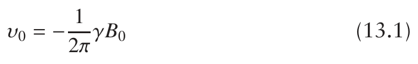

where γ is the gyromagnetic ratio (2.67 × 108 rad s−1 for protons). We need to limit the variation in the magnetic field across the sample so that the corresponding variation in the Larmor frequency is much less than the width of the line, say by a factor of ten.

Suppose that the maximum acceptable change in Larmor frequency across the sample is 0.1 Hz. Using Eq. 13.1 we can compute the change in the magnetic field as (0.1 × 2π)/γ = 2.4 × 10−9 T. Expressed as a fraction of the main magnetic field this variation is about 2 × 10−10. We can see that we need to have an extremely homogeneous magnetic field for work at high resolution.

On its own, no superconducting magnet can produce such a homogeneous field. What we have to do is to surround the sample with a set of shim coils, each of which produces a tiny magnetic field with a particular spatial profile which can be used to cancel out the inhomogeneities in the main magnetic field. The current through each of these coils is adjusted until the magnetic field has the required homogeneity, something we can easily assess by recording the spectrum of a sample which has a sharp line.

Modern spectrometers might have up to 40 different shim coils, so adjusting them is an involved task. However, once set it is usually only necessary on a day to day basis to alter a few of the shims which generate the simplest field profiles.

The shims are labelled according to the field profiles they generate. So, for example, there are usually shims labelled x, y and z, which generate magnetic fields varying in the corresponding directions. The shim z2 generates a field that varies quadratically along the z direction, which is the direction of B0. There are more shims whose labels you might recognize as corresponding to the names of the hydrogen atomic orbitals. This is no coincidence since the magnetic field profiles that the shims coils create are in fact the spherical harmonic functions, which are the angular parts of the atomic orbitals.

### 13.1.2 The lock

Although the field produced by a superconducting magnet is very stable, there will nevertheless be some drift in the field which is certainly significant for the very narrow lines we see in NMR. This slow drift is compensated for by the field–frequency lock, which is a feedback system designed to keep the field at a steady value.

The lock uses the 2H NMR signal from a deuterated solvent used to prepare the sample (most commonly CDCl3, or D2O in the case of biological samples). The magnetic field is adjusted by small amounts in such a way as to keep the deuterium resonance at a fixed frequency thus ensuring that the field is held at a constant value. These adjustments to the field are made by varying the current through a coil rather like the shim coils, but this time designed to produce a homogeneous field profile.

The deuterium NMR signal is monitored using a continuous wave (CW) NMR experiment, rather than the usual pulse–acquire experiment. The reason for using a CW experiment is that it is by far the simplest way of monitoring the frequency of a single line, which is all we want to do in this case.

The lock is a feedback system: if the field changes, the deuterium line shifts, resulting in an error signal which in turn alters the field in such a way as to bring the line back to its original position. As we are not expecting the field to change quickly, this feedback loop is given a long time constant which means that it integrates the error signal over a long time. The advantage of this approach is that any noise in the system is also integrated over this long time, thus diminishing its effect.

## 13.2 The probe

The probe is a cylindrical metal tube which is inserted into the bore of the magnet. The small coil used both to excite and detect the NMR signal (see section 4.2 on page 50 and section 4.4 on page 52) is held in the top of this assembly in such a way that the sample can come down from the top of the magnet and drop into the coil. Various other pieces of electronics are contained in the probe, along with some arrangements for heating or cooling the sample.

The coil is connected in parallel with a capacitor to form a tuned circuit, which has a particular resonant frequency, depending on the inductance of the coil and capacitance of the capacitor. The signal which a given amount of magnetization gives rise to is greatly increased when the resonance frequency of the tuned circuit matches the Larmor frequency. Therefore to optimize the sensitivity, it is vital to make sure that the tuned circuit is resonant at the Larmor frequency: this is what we do when we ‘tune the probe’.

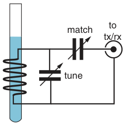

Tuning the probe means adjusting the capacitor until the tuned circuit is resonant at the Larmor frequency. Usually we also need to ‘match the probe’ which involves further adjustments designed to maximize the power transfer between the probe and the transmitter and receiver. Figure 13.1 shows a typical arrangement in which variable capacitors are used for tuning and matching. The two adjustments tend to interact rather, so tuning the probe can be a tricky business. To aid us, the instrument manufacturers provide various indicators and displays so that the tuning and matching can be optimized. We expect the tuning of the probe to be particularly sensitive to changing solvent or to changing the concentration of ions in the solvent, as such things affect the inductance of the coil.

**Fig. 13.1** Schematic of the key parts of the probe. The coil is shown on the left (with the sample tube in blue) which forms a tuned circuit with the capacitor marked ‘tune’. The power transfer to the transmitter and receiver is optimized by adjusting the capacitor marked ‘match’. Note that the coil geometry as shown is not suitable for a superconducting magnet in which the main field is parallel to the sample axis.

In NMR, the main source of noise in a well-designed spectrometer is actually from the coil itself. This is thermal noise, which arises from the thermal motion of the electrons in the metal. Therefore, cooling the coil will reduce the noise – the lower we go in temperature, the less noise there will be. Technologically, cooling the coil down to temperatures of a few kelvin, while keeping the sample at room temperature, is a very challenging problem, but it is one that has been solved. Such cryo probes, as they are know, are now readily available and the increase in signal-to-noise ratio which these have when compared with conventional probes is very significant.

## 13.3 The transmitter

The RF transmitter is the part of the spectrometer which generates the pulses. We start with an RF source, such as a frequency synthesizer, which produces a stable frequency which can be set precisely via a computer interface. We also need to be able to shift the phase of the RF source in order to generate phase-shifted RF pulses.

As we only need the RF to be applied for a short time, the output of the synthesizer has to be ‘gated’ so as to create a pulse of RF energy. Such a gate will be under computer control so that the length and timing of the pulse can be controlled.

The RF source will be at a low level (a few mW) and so needs to be boosted by a high-power amplifier to provide the 100 W or so needed to create hard (non-selective) pulses. However, we may not always want the pulses to be at full power; for example, we might want to generate selective pulses, which require much lower power. To allow for this option, an attenuator, under computer control, is placed between the RF source and the amplifier. The amplifier has a fixed gain, but by using the attenuator to alter the power going into the amplifier we can alter its power output. The complete arrangement is illustrated in Fig. 13.2 on the facing page.

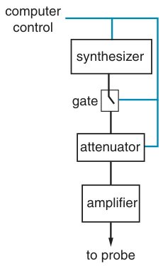

The more power that is applied to the probe the more intense the B1 field will become and so the shorter the 90◦ pulse length. However, there is a limit to the amount of power which can be applied because of the high voltages which are generated in the probe, especially across the coil and tuning capacitor. Eventually, the voltage will reach a point where it is sufficient to ionize the air, thus generating a discharge or arc. Not only does this probe arcing have the potential to destroy the coil and capacitor, but it also results in unpredictable and erratic B1 fields.

### 13.3.1 Power levels and ‘dB’

As we have seen, the attenuator between the RF source and the amplifier gives us a way of altering the output power of the transmitter. The attenuation is normally expressed in decibels (abbreviated dB and pronounced ‘dee bee’). If the power of the signal going into the attenuator is Pin and power at the output is Pout, then the attenuation in dB is

**Fig. 13.2** Typical arrangement of the RF transmitter. The synthesizer, which is the source of the RF, produces a low-level output. This is fed, via a gate and an attenuator, to a high-power amplifier. The power output is controlled by using the attenuator to vary the input to the amplifier. The gate is used to switch on the RF power when a pulse is required. All of the components are under computer control.

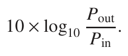

Note that the logarithm is to the base 10, not the natural logarithm; the factor of 10 is the ‘deci’ part in the dB.

For example, if the output power is half the input power, i.e.

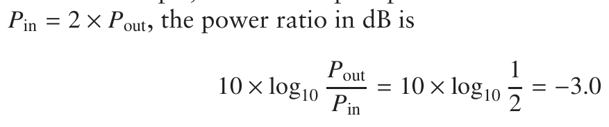

So, halving the power corresponds to a change of −3.0 dB, the minus indicating that there is a power reduction i.e. an attenuation. An attenuator which achieves this effect would be called ‘a 3 dB attenuator’.

Likewise, a power reduction by a factor of four corresponds to −6.0 dB. In fact, because of the logarithmic relationship we can see that each 3 dB of attenuation will halve the power. So, a 12 dB attenuator will reduce the power by a factor of sixteen.

The B1 field strength is proportional to the square root of the power applied. The reason for this is that it is the current in the coil which is responsible for generating the B1 field, and current and power are related by power = resistance × current2. Thus the current is proportional to the square root of the power.

In order to double the B1 field we need to double the current, which means multiplying the power by a factor of four: this corresponds to a power ratio of 6 dB. Therefore decreasing the attenuation by 6 dB will cause the B1 field to double, and decreasing by a further 6 dB will cause a further doubling of the field, and so on.

Usually the attenuator is under computer control and its value can be set in dB. This is very helpful to us as we can determine the attenuation needed for different B1 field strengths. Suppose that with a certain setting of the attenuator we have determined the B1 field strength to be ωinit1 (in angular frequency units). However, in another experiment we want the field strength to be ωnew1 . The ratio of the powers needed to achieve these two field strengths is equal to the square of the ratio of the field strengths:

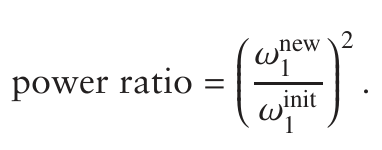

Expressed in dB this is

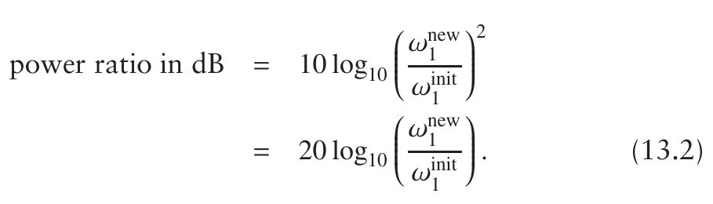

This expression can be used to find the correct setting for the attenuator.

As the duration of a pulse of a given flip angle is inversely proportional to ω1 the relationship can be expressed in terms of the initial and new pulse

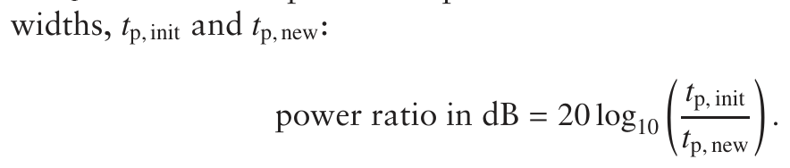

For example, suppose we have calibrated the pulse width for a 90◦ pulse to be 15 μs, but now we want a 90◦ pulse of 25 μs. The required attenuation would be:

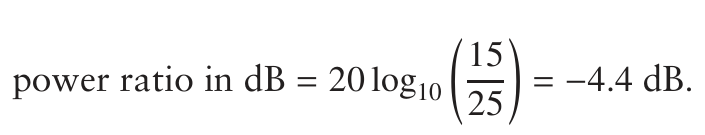

We would therefore need to increase the attenuator setting by 4.4 dB.

## 13.4 The receiver

The NMR signal emanating from the probe is very small (of the order of μV), but there is no problem in amplifying this signal to a level where it can be digitized. The amplifiers need to be designed so that they introduce a minimum of extra noise i.e. they should be low-noise amplifiers.

The first of these amplifiers, called the pre-amplifier or pre-amp is usually placed as close to the probe as possible (you will often see it resting by the foot of the magnet). This is so that the weak signal is boosted before being sent down a cable to the spectrometer console.

One additional problem which needs to be solved comes about because the coil in the probe is used for both exciting the spins and detecting the signal. This means that at one moment 100 W of RF power are being applied, and the next we are trying to detect a signal at the μV level. We need to ensure that the high-power pulse does not end up in the sensitive receiver, thereby destroying it!

This separation of the receiver and transmitter is achieved by a device known as a diplexer. There are various different ways of constructing such a device, but at the simplest level it is just a fast acting switch set up so that when the pulse is on the high power RF is routed to the probe, and the receiver is protected by disconnecting its input. When the pulse is off the receiver is connected to the probe and the transmitter is disconnected.

Some diplexers are passive, in the sense that they require no external power to achieve the required switching. Other designs use fast electronic switches (rather like the gate in the transmitter) which are under the control of the pulse programmer so that the receiver or transmitter is connected to the probe at the right times.

## 13.5 Digitizing the signal

### 13.5.1 The analogue to digital converter

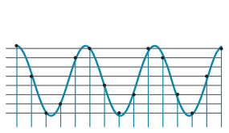

A device known as an analogue to digital converter or ADC is used to convert the NMR signal from a voltage to a binary number which can be stored in computer memory. The ADC samples the signal at regular intervals, resulting in a representation of the FID as data points.

The output from the ADC is just a number, and the range of different numbers that the ADC can output is set by the number of binary ‘bits’ that the ADC uses. For example, the output of a three-bit ADC can take just eight values: the binary numbers 000, 001, 010, 011, 100, 101, 110 and 111. The total number of possibilities is 2 raised to the power of the number of bits.

**Fig. 13.3** Digitization of a waveform using an ADC with eight levels (three bits). The output of the ADC can only be one of the eight levels, so the smoothly varying waveform has to be represented by data points at one of the eight levels. The data points, indicated by black dots, are therefore an approximation to the true waveform. Note that the waveform is sampled at regular intervals, as indicated by the blue vertical lines.

The waveform which the ADC is digitizing is varying continuously, but output of the three-bit ADC is restricted to one of eight levels, so what the device has to do is simply pick which of these levels is closest to the input, as is illustrated in Fig. 13.3. The output of the ADC is therefore an approximation to the actual waveform.

The accuracy of the digital representation of the signal can be improved by increasing the number of bits, as this gives more levels. At present, ADCs with between 16 and 32 bits are commonly in use in NMR spectrometers; a further increase in the numbers of bits is limited by technical considerations.

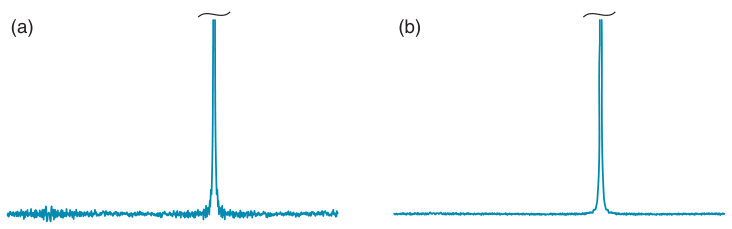

**Fig. 13.4** Illustration of the effect of increasing the resolution of the ADC on the size of digitization sidebands. Spectrum (a) is from a FID which has been digitized using a six-bit ADC (i.e. 64 levels); the vertical scale has been expanded ten-fold so that the digitization sidebands are clearly visible. Spectrum (b) is from a FID which has been digitized using an eight-bit ADC (256 levels); the improvement over (a) is evident.

The main consequence of the approximation inherent in the ADC is the generation of a forest of small sidebands – called digitization sidebands – around the base of the peaks in the spectrum. Usually these are not a problem as they are likely to be swamped by thermal noise. However, if the spectrum contains a very strong peak the sidebands from it can swamp a nearby weak peak. Increasing the number of bits used by the ADC results in a better approximation of the signal, and hence reduced digitization sidebands. This point is illustrated in Fig. 13.4 on the preceding page.

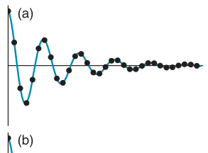

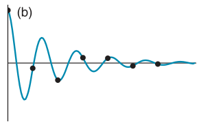

### 13.5.2 Sampling rates

Given that the ADC is only going to sample the signal at regular intervals, the question arises as to how frequently it is necessary to sample the FID i.e. what the time interval between the data points should be. Clearly, if the time interval is too long we will miss important features of the waveform, and so the digitized points will be a poor representation of the signal. This is illustrated in Fig. 13.5.

**Fig. 13.5** Illustration of the effect of sampling rate on the representation of the FID. In (a) the data points (shown by black dots) are quite a good representation of the signal (shown by the blue line). In (b) the data points are too widely separated and so are a very poor representation of the signal.

It turns out that, if the interval between the points is Δ, the highest frequency which can be represented correctly, fmax, is given by

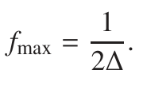

fmax is called the Nyquist frequency, and a signal at this frequency will have two data points per cycle. Usually we think of this relationship the other way round i.e. if we wish to represent correctly frequencies up to fmax the sampling interval is given by:

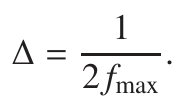

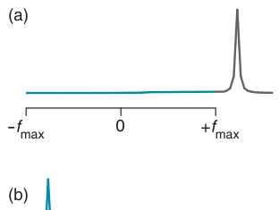

The sampling interval Δ is often called the dwell time.

We will see in section 13.6 on the facing page that we are able to distinguish positive and negative frequencies, so if the dwell time is Δ, it means that the range of frequencies from −fmax to +fmax are represented correctly.

A signal at greater than fmax will still appear in the spectrum, but not at the correct frequency; such a peak is said to be folded. For example a peak at (fmax + F) will appear in the spectrum at (−fmax + F), as is illustrated in Fig. 13.6.

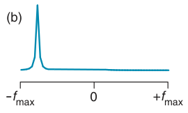

This Nyquist condition quickly brings us to a problem. A typical NMR frequency is of the order of hundreds of MHz, but there simply are no ADCs available which work fast enough to digitize such a waveform with the kind of accuracy (i.e. number of bits) we need for NMR. The solution to this problem is to mix down the signal to a lower frequency, as is described in the next section.

**Fig. 13.6** Illustration of the concept of folding. In spectrum (a) the peak (shown in dark grey) is at a higher frequency than the maximum set by the Nyquist condition. In practice, such a peak would appear in the position shown in (b).

### 13.5.3 Mixing down to a lower frequency

The range of frequencies that a typical NMR spectrum covers is rather small, usually no more than a few tens of kHz. So, if we choose a frequency in the middle of this range, and then subtract this from the frequencies of the NMR signals, we will end up with signals whose frequencies are no more than a few tens of kHz, rather than hundreds of MHz. Digitizing such low frequencies is easily within the capabilities of typical ADCs.

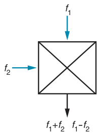

This frequency we subtract from the NMR signals is called the receiver reference frequency or sometimes just the receiver frequency. Shifting the frequencies in this way is the equivalent of detection in a rotating frame, as was described in section 4.6 on page 60.

The subtraction process is carried out by a mixer. Such a device takes two signal inputs at frequencies f1 and f2, and produces an output which contains signals at the sum of the two input frequencies, (f1 + f2), and at

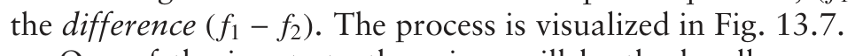

One of the inputs to the mixer will be the locally generated receiver reference frequency, and the other will be the NMR signal from the probe. Since we choose the reference frequency to be close to the NMR frequency, the difference of these two will be at a low frequency, whereas the sum will be at around twice the Larmor frequency. This high-frequency signal is easily separated from the required low-frequency signal by passing the output of the mixer though a low-pass filter. The filtered signal is then passed to the ADC.

**Fig. 13.7** A radiofrequency mixer takes inputs at two different frequencies, and produces an output which contains signals at the sum and difference of the frequencies of the two inputs.

## 13.6 Quadrature detection

In discussing the vector model, we noted that it was possible to detect both the x- and y-components of the precessing magnetization (section 4.6 on page 60). These two signals are then used to construct a complex time-domain signal:

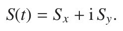

It is S(t) which we subject to a Fourier transform in order to generate the spectrum (section 5.2 on page 82). Typically, S(t) is a damped oscillation

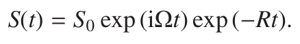

This time-domain signal is sensitive to the sign of Ω: exp (+iΩt) and exp (−iΩt) are different functions, and upon Fourier transformation will give a peak at +Ω and −Ω, respectively. The spectrum is said to have frequency discrimination. It is very important that our spectrum is discriminated in this way since, as we place the receiver reference frequency in the middle of the spectrum, there will be peaks at both positive and negative offsets.

The question is, how is it possible to detect the x- and y-components of the magnetization? One possibility is to have two coils in the probe, one aligned along x and one along y; these would detect the x- and y-components of the magnetization. In practice, it turns out to be very hard to achieve such an arrangement, partly because of the confined space in the probe and partly because of the difficulties in making the two coils electrically isolated from one another.

The same effect as having two coils can be achieved by feeding the output from one coil into two mixers, which have different phases for the

**Fig. 13.8** The schematic arrangement used for quadrature detection. The key part is the two mixers which are fed with reference signals, one of which is shifted in phase by 90◦. As a result, the output of the two detectors are proportional to orthogonal components of the transverse magnetization. The low-pass filters between the mixers and the ADCs are there to ensure that only the low-frequency difference signal is digitized.

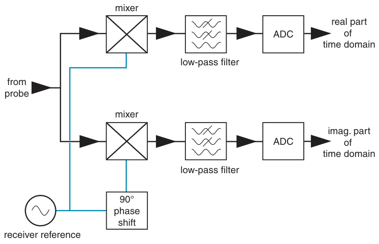

receiver reference frequency. The way this works can be understood as follows.

A mixer works by literally ‘multiplying together’ the two inputs. So, if one input is the NMR signal of the form S cos (ω0t), and the other is the receiver reference, represented by cos (ωrxt), multiplying these two together gives

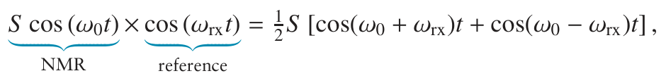

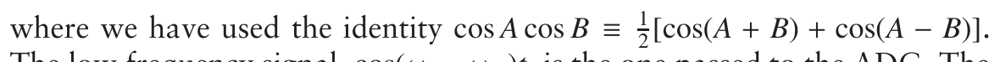

The low frequency signal, cos(ω0 −ωrx)t, is the one passed to the ADC. The difference ω0 − ωrx is the offset, Ω, so the ADC digitizes the signal cos (Ωt).

Now suppose we shift the phase of the receiver reference frequency by 90◦ (π/2 radians). The signal applied to the mixer is now cos (ωrxt + π/2) which is the same as − sin (ωrxt). Multiplying this by the NMR signal gives

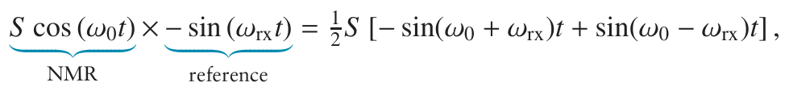

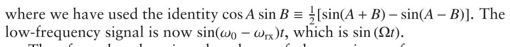

Therefore, by changing the phase of the receiver reference we can alter the output of the detector from 12S cos (Ωt) to 12S sin (Ωt), which we recognize as the two orthogonal components of the precessing transverse magnetization. We do not need two coils, therefore, but just two mixers fed with reference frequencies which differ in phase by 90◦.

This method of generating the two orthogonal components is called quadrature detection. Figure 13.8 shows a typical practical implementation of this scheme. The NMR signal from the probe is split into two and fed to two separate mixers, and the receiver reference signal fed to one of the mixers is shifted by 90◦ relative to that fed to the other. As a result, the outputs of the two mixers are proportional to the two orthogonal components of the magnetization. These two outputs are digitized separately and become the real and imaginary parts of a complex time-domain signal.

## 13.7 The pulse programmer

The pulse programmer has become an immensely sophisticated piece of computer hardware, controlling as it does all of the functions of the spectrometer. As the pulse programmer needs to produce very precisely timed events, often in rapid succession, it is usual for it to run independently of the main computer. Typically, the pulse program is specified in the main computer and then, when the experiment is started, the instructions are loaded into the pulse programmer and then executed there.

The acquisition of data is usually also handled by the pulse programmer, again separately from the main computer. Only when the experiment is finished are the data passed back to the main computer.

## 13.8 Further reading

NMR data processing, including issues relating to digitization:

J. C. Lindon and A. G. Ferrige, Progress in Nuclear Magnetic Resonance

Spectroscopy, 14, 27–66 (1980).

A more detailed description of the RF hardware used in spectrometers:

Chapter 5 from E. Fukushima and S. B. W. Roeder, Experimental Pulse

NMR: a Nuts and Bolts Approach, Addison–Wesley (1981).

Chapter 4 from M. H. Levitt, Spin Dynamics (2nd edition, John Wiley

& Sons, Ltd, 2008).

## 13.9 Exercises

13.1 You have been offered a superconducting magnet which claims to have a homogeneity of ‘1 part in 108’. Your intention is to use it to record 31P spectra at Larmor frequency of 180 MHz, and you know that your typical linewidths are likely to be of the order of 25 Hz. Is the magnet sufficiently homogeneous to be of use?

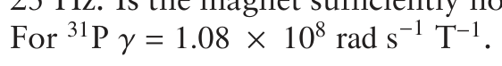

13.2 A careful pulse calibration experiment has determined that the 180◦ pulse length is 24.8 μs. How much attenuation, in dB, would have to be introduced into the transmitter in order to give an RF field strength, (ω1/2π), of 2 kHz?

13.3 A spectrometer is equipped with a transmitter capable of generating a maximum of 100 W of RF power at the frequency of 13C. Using this transmitter at full power, the 90◦ pulse width is found to be 20 μs. What power would be needed to reduce the 90◦ pulse width to 7.5 μs? Would you have any reservations about using this amount of power?

13.4 Explain what is meant by ‘a two-bit ADC’ and draw a diagram to illustrate the outcome of such a ADC being used to digitize a sine wave. Why is it generally desirable to use an ADC with the largest number of bits available?

13.5 A spectrometer operates at 800 MHz for proton, and it is desired to record a spectrum covering a shift range of 15 ppm. Assuming that the receiver reference frequency is placed in the middle of this range, what range of frequencies (in Hz) is covered by the spectrum, and what would the sampling interval (dwell time) have to be?
