# Some mathematical topics

This appendix contains brief outlines of some mathematical concepts which are used frequently in the text. These outlines are more by way of a reminder of the key ideas, rather than a full exposition of the topic.

## A.1 The exponential function and logarithms

The exponential function arises in the mathematical description of all sorts of physical processes; in NMR it is encountered particularly in the theory of relaxation. This function can be written in one of two ways:

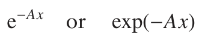

where A is a constant and x is the variable; we tend to use the latter version in this book. Figure A.1 on the next page shows a plot of this function for three different positive values of A.

When x = 0 the function takes the value 1 for all values of A, and then as x increases the function decays away towards zero; the larger the constant A, the faster the decay rate. For negative values of x, exp (−Ax) is greater than one and increases steadily the more negative x becomes. This kind of behaviour is not usually encountered in physical systems.

The natural logarithm, denoted ln, is closely related to the exponential:

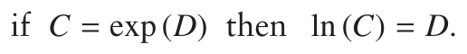

It follows from this definition of the logarithm that

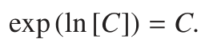

Any number raised to the power of zero is 1, thus exp (0) = 1 and so it

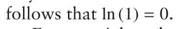

Exponentials and natural logarithms have a number of properties which

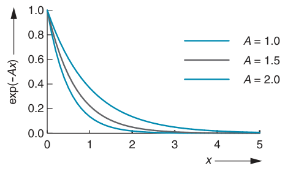

**Fig. A.1** Plots of the exponential function for three different values of the constant A; note that, for all values of A, the function is equal to one when x = 0, but that as A increases, the rate of decay of the function increases.

we use frequently in manipulations:

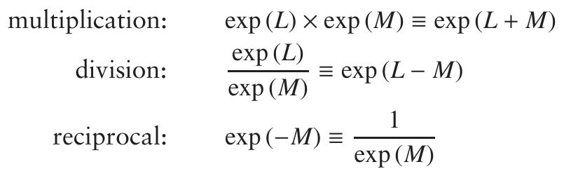

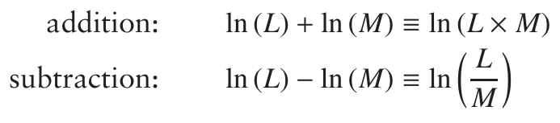

From the final relationship we have the following special case when L = 1:

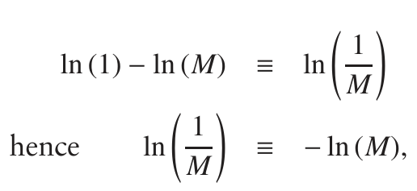

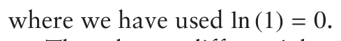

The relevant differentials and integrals are:

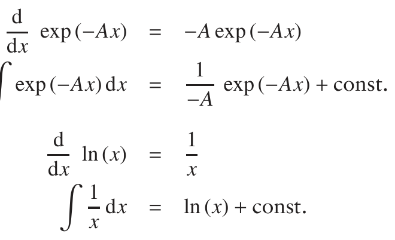

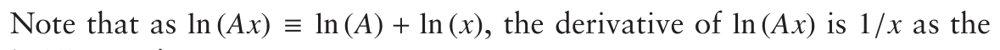

ln (A) term is a constant.

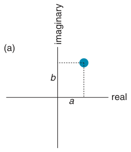

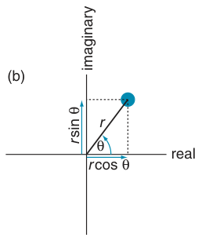

**Fig. A.2** Visualization of the complex plane, in which the two orthogonal axes are labelled ‘real’ and ‘imaginary’. In (a) we see how a complex number, the blue dot, can be thought of as a point in the complex plane, with components a and b along the real and imaginary axes. The position of the point can also be specified by the distance r from the origin, and the angle θ, as shown in (b). Note that r is real and positive.

## A.2 Complex numbers

Complex numbers, particularly when combined with the exponential function, occur in the mathematical description of all sorts of physical phenomena associated with oscillations and other kinds of periodic motion. In quantum mechanics, wavefunctions and the matrix representations of operators frequently involve complex numbers.

One way to think about ordinary numbers is to consider them as falling on a line, which extends from minus infinity, through zero, to plus infinity. Complex numbers are an extension of this idea in which the numbers lie in a plane, the horizontal axis of which gives the real part of the number, and the orthogonal vertical axis gives the imaginary part of the number.

Figure A.2 (a) illustrates this complex plane. The blue dot represents the number, and its coordinate along the two axes are a and b. Therefore a is the real part of the number and b is the imaginary part. Such a complex number is written

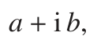

where i is the ‘complex i’. This quantity has a number of properties which are very important when it comes to manipulating complex numbers:

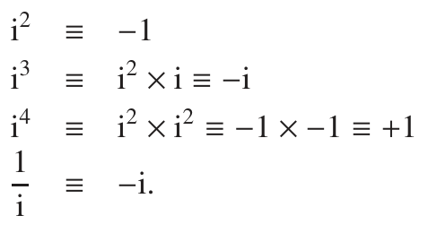

The last of these properties is proved by multiplying the top and bottom

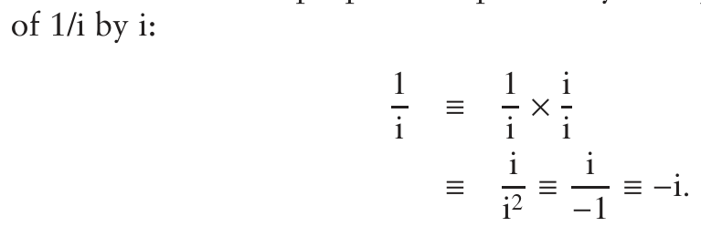

The complex conjugate of a complex number, indicated by a super-script *, is found by changing the sign of the imaginary part:

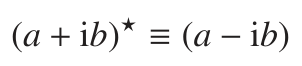

If a complex number is multiplied by its complex conjugate, the result is a real positive number:

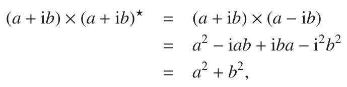

where, to go to the last line we have used i2 = −1. For a general complex number z, z z* is known as the square modulus of z, |z|2:

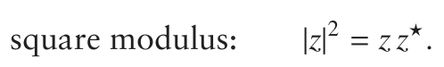

Another way of thinking about a complex number is shown in Fig. A.2 (b) on the previous page. Here we specify a position in the complex plane in terms of the distance r of the point from the origin, and an angle θ, measured as shown in the diagram. The distance r is, by definition, real and positive. It follows from simple trigonometry that the real and imaginary parts are given by:

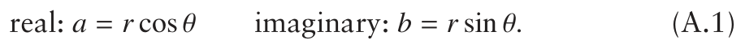

Using this representation, the square modulus is computed as follows

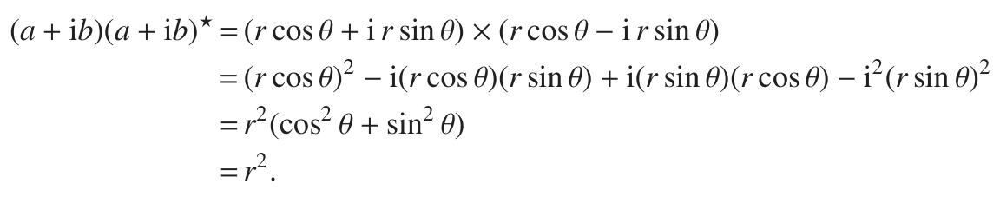

To go to the last line, we have used the identity cos2 θ + sin2 θ ≡ 1. What we have shown here is that the square modulus is just r2, the square of the distance from the origin.

### A.2.1 The complex exponential

It can be shown that the exponential of an imaginary number (ix) obeys

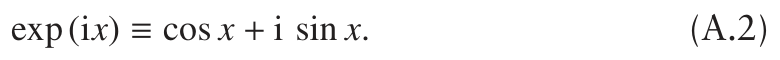

If we express the real and imaginary parts of a complex number a + i b in terms of r and θ, as in Eq. A.1, we find:

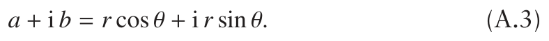

Comparison of Eq. A.3 with Eq. A.2 shows that we can write the complex number as

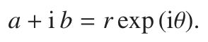

This representation of a complex number is very convenient for many purposes.

The complex conjugate of r exp (iθ) is found in the usual way by changing the sign of the imaginary part (remember that r is real):

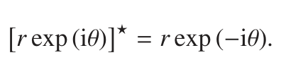

Using this, the square modulus is

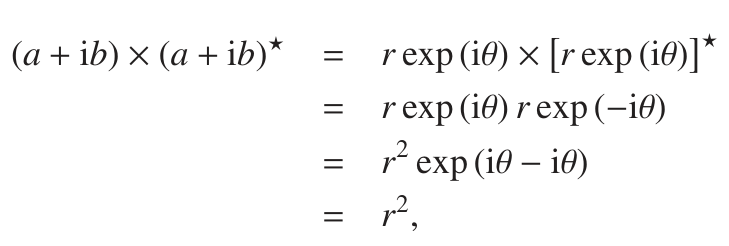

where to go to the last line we have used exp (0) = 1. As we found before, the square modulus is simply r2:

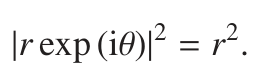

Since we have defined r to be positive, it follows that the modulus of a complex number written in the form r exp (iθ) is r.

The complex exponential obeys all the rules which apply to the regular exponential function, so manipulation of complex numbers represented in this r/θ format is straightforward.

From Eq. A.2 on the preceding page it is clear that the complex exponential is closely related to trigonometric functions. This leads to a number of useful identities, which can be developed in the following way:

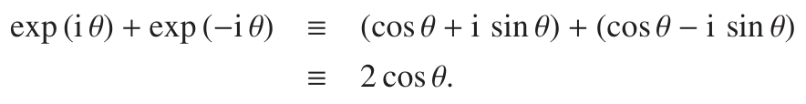

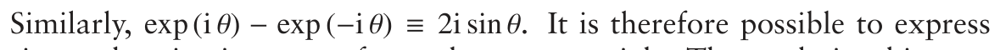

sine and cosine in terms of complex exponentials. These relationships are usually written as

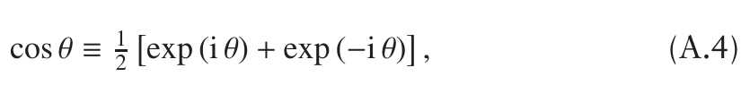

and

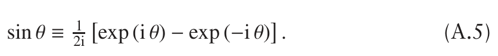

## A.3 Trigonometric identities

The sine and cosine functions obey the following:

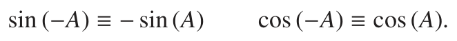

Products of sine and cosine functions arise every time we make a calculation using product operators, so we frequently need to manipulate such products. For convenience, the set of identities needed for such manipulations are repeated here:

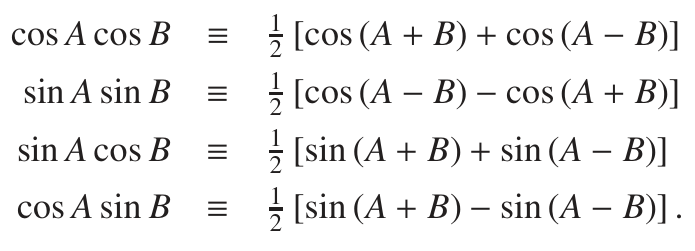

The fourth of these is the same as the third with A and B swapped, but it is included for convenience. These identities are easily proved by expressing the product on the left using complex exponentials i.e. using Eqs A.4 and A.5 from the preceding page. For example:

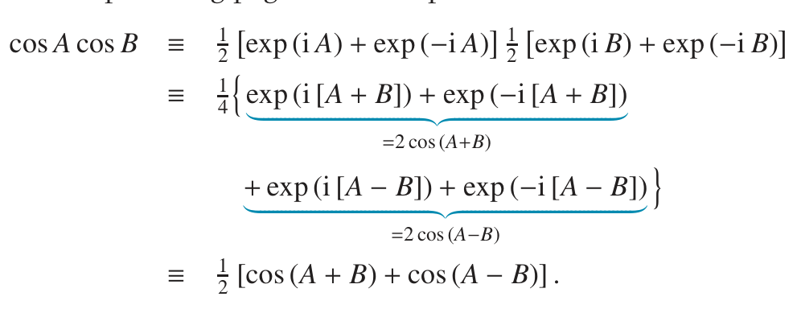

The sine and cosine of the sum and difference of angles have the following identities:

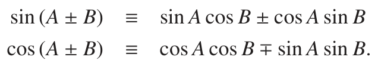

Again, these are easily proved using complex exponentials. Of special

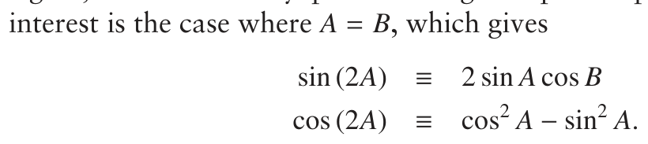

From the definition of sine and cosine it follows that

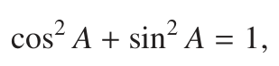

from which it follows that

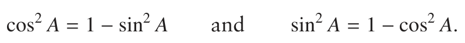

These can be used to rewrite cos (2A) in two different ways

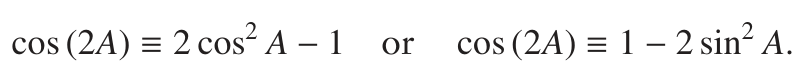

These identities can be used to express sin2 A and cos2 A in terms of cos (2A):

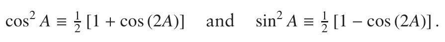

## A.4 Further reading

D. S. Sivia and S. G. Rawlings, Foundations of Science Mathematics (Oxford University Press, 1999).
